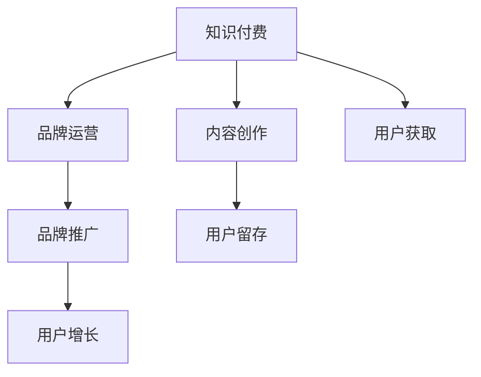

                 

# 知识付费赚钱的品牌品牌运营与品牌推广策略

> 关键词：知识付费, 品牌运营, 品牌推广, 用户增长, 营销策略, 内容创作, 用户留存

## 1. 背景介绍

在知识经济时代，随着人们对个人发展和终身学习的重视，知识付费成为了一种全新的学习方式。通过订阅或单次支付，用户可以获得高质量的知识内容，满足自身学习需求。与此同时，随着互联网经济的快速增长，知识付费平台如雨后春笋般涌现，用户对内容和服务质量的要求也越来越高。

在众多知识付费平台中，品牌运营和品牌推广成为其成功的关键因素。一个成功的知识付费品牌不仅能吸引大量用户，还能实现持续的用户增长和盈利。因此，本文将系统探讨知识付费品牌品牌运营与品牌推广策略，为行业从业者提供有价值的参考。

## 2. 核心概念与联系

### 2.1 核心概念概述

为了更好地理解知识付费品牌运营与品牌推广策略，本节将介绍几个关键概念：

- **知识付费(Knowledge-Based Subscription)**：用户为获得高质量、有价值的知识内容，通过订阅或单次支付的方式，享受知识服务。知识付费不仅能满足用户的学习需求，还能带来可观的经济收益。
- **品牌运营(Brand Operation)**：品牌运营是品牌建设和管理的过程，通过产品、服务、市场等多个维度的策略，提升品牌影响力和市场竞争力。
- **品牌推广(Brand Promotion)**：品牌推广是品牌运营的重要环节，通过各种营销手段，提升品牌知名度和美誉度，吸引目标用户。
- **用户增长(User Growth)**：用户增长是指增加用户数量和活跃度的过程，包括新用户获取、用户留存和口碑传播等多个环节。
- **内容创作(Content Creation)**：内容创作是知识付费平台的核心，通过制作高质量的知识内容，吸引用户订阅和使用。
- **用户留存(User Retention)**：用户留存是指提高用户持续使用和订阅的过程，通过持续提供有价值的内容和服务，提升用户满意度。

这些概念之间的逻辑关系可以通过以下Mermaid流程图来展示：



这个流程图展示了好知识付费品牌的运营与推广流程：

1. 品牌运营通过多维度的策略，提升品牌影响力和市场竞争力。
2. 品牌推广通过各种营销手段，提升品牌知名度和美誉度。
3. 用户增长包括新用户获取和用户留存，通过持续提供有价值的内容和服务，吸引和保留用户。
4. 内容创作是品牌运营和推广的基石，通过高质量的内容吸引用户订阅。
5. 用户留存是品牌运营的关键，通过持续提供有价值的内容和服务，提升用户满意度。

## 3. 核心算法原理 & 具体操作步骤

### 3.1 算法原理概述

知识付费品牌的运营与推广策略，本质上是一个系统性的多目标优化问题。品牌运营和推广的效果，不仅依赖于高质量的内容创作，还需要考虑用户增长和用户留存的综合效果。

形式化地，假设品牌影响力和市场竞争力为 $I$，用户增长率为 $G$，用户留存率为 $R$。则品牌运营与推广的目标是最大化总得分 $S$：

$$
S = w_1I + w_2G + w_3R
$$

其中 $w_1, w_2, w_3$ 为各目标的权重系数，需要根据品牌的具体情况进行设定。

### 3.2 算法步骤详解

基于上述目标，知识付费品牌的运营与推广策略可以分解为以下几个关键步骤：

**Step 1: 确定品牌定位**

品牌定位是品牌运营和推广的基础。明确品牌的使命、愿景和核心价值，确定品牌的独特卖点(Unique Selling Proposition, USP)。例如，某知识付费品牌可以定位为“为专业人士提供行业深度的知识服务”，聚焦于特定领域的知识获取。

**Step 2: 制定内容策略**

内容策略是品牌运营的核心。根据品牌定位，确定内容的主题、形式和风格，保证内容的高质量与多样化。同时，建立内容发布计划，确保内容的持续性和稳定性。例如，某品牌可以制定每日更新一篇深度文章的计划，保持用户的关注和兴趣。

**Step 3: 用户增长策略**

用户增长策略包括新用户获取和用户留存两个方面。通过市场调研和用户分析，确定目标用户群体和增长渠道，例如社交媒体、搜索引擎、线上线下活动等。同时，制定用户留存策略，通过优惠券、会员权益、积分系统等方式，提升用户粘性。

**Step 4: 品牌推广策略**

品牌推广策略包括品牌曝光和品牌形象塑造两个环节。通过品牌故事、品牌口号、品牌标识等方式，提升品牌的知名度和美誉度。同时，结合市场推广手段，如SEO、SEM、社交媒体营销等，扩大品牌的曝光范围。例如，某品牌可以通过内容营销和社交媒体营销，提升品牌的曝光率和用户认知度。

**Step 5: 效果评估与优化**

品牌运营与推广效果的评估是一个持续的过程。通过数据分析和用户反馈，定期评估各环节的执行效果，及时发现问题并进行优化。例如，通过A/B测试，评估不同推广渠道和策略的效果，优化推广资源配置。

### 3.3 算法优缺点

知识付费品牌的运营与推广策略具有以下优点：

1. **灵活性高**。品牌运营和推广策略可以根据市场变化和用户需求，进行灵活调整，适应不同阶段的市场环境。
2. **精准性强**。通过市场调研和用户分析，可以精确定位目标用户，提高推广效果和用户转化率。
3. **可持续性高**。品牌运营和推广需要持续投入，但通过用户留存和品牌忠诚度的提升，可以降低长期运营成本。

同时，该策略也存在一定的局限性：

1. **投入成本高**。品牌运营和推广需要投入大量的资源和人力，包括内容创作、市场推广和用户维护等。
2. **效果不稳定**。市场环境的变化和用户需求的波动，可能导致品牌运营和推广效果不稳定。
3. **用户差异大**。不同用户群体的需求和行为差异较大，品牌运营和推广需要定制化策略。

尽管存在这些局限性，但就目前而言，知识付费品牌的运营与推广策略仍然是最主流的方法。未来相关研究的重点在于如何进一步降低运营成本，提高推广效率，同时兼顾用户多样性和市场环境的变化。

### 3.4 算法应用领域

知识付费品牌的运营与推广策略已经广泛应用于各类知识付费平台，包括在线教育、技术分享、金融投资等诸多领域。例如：

- 在线教育平台：如Coursera、Udemy等，通过优质课程和品牌推广，吸引大量用户订阅。
- 技术分享平台：如CSDN、GitHub等，提供技术交流和学习资源，提升品牌影响力。
- 金融投资平台：如雪球、同花顺等，通过金融知识的普及和品牌推广，吸引用户参与。

除了上述这些经典领域外，知识付费品牌的运营与推广策略也在更多行业领域得到应用，如健康医疗、个人理财、艺术文化等，为不同行业的知识传播和经济发展提供新动力。

## 4. 数学模型和公式 & 详细讲解 & 举例说明

### 4.1 数学模型构建

本节将使用数学语言对知识付费品牌运营与品牌推广策略进行更加严格的刻画。

设知识付费品牌的影响力为 $I$，用户增长率为 $G$，用户留存率为 $R$。则总得分为：

$$
S = w_1I + w_2G + w_3R
$$

其中，权重系数 $w_1, w_2, w_3$ 需要根据品牌的具体情况进行设定，一般 $w_1 \geq w_2 \geq w_3$。

### 4.2 公式推导过程

以用户增长率 $G$ 为例，其推导如下：

假设知识付费平台每月新增用户数为 $N_{\text{add}}$，用户流失率为 $\lambda$，则用户增长率为：

$$
G = \frac{N_{\text{add}}}{U_{\text{cur}}} - \lambda
$$

其中 $U_{\text{cur}}$ 为当前用户数。

### 4.3 案例分析与讲解

假设某知识付费平台每月的用户增长率为 $G = 0.05$，当前用户数为 $U_{\text{cur}} = 10,000$，每月新增用户数为 $N_{\text{add}} = 5,000$，用户流失率为 $\lambda = 0.02$。则总得分为：

$$
S = w_1I + w_2(0.05) + w_3(1 - \frac{0.02}{0.05})
$$

假设品牌影响力 $I$ 为 $0.8$，则总得分为：

$$
S = 0.8w_1 + 0.05w_2 + 0.94w_3
$$

这个公式展示了如何在不同维度的策略之间进行平衡和优化，以最大化总得分。

## 5. 项目实践：代码实例和详细解释说明

### 5.1 开发环境搭建

在进行品牌运营与推广策略开发前，我们需要准备好开发环境。以下是使用Python进行Flask开发的环境配置流程：

1. 安装Anaconda：从官网下载并安装Anaconda，用于创建独立的Python环境。

2. 创建并激活虚拟环境：
```bash
conda create -n brand-op-env python=3.8 
conda activate brand-op-env
```

3. 安装Flask：
```bash
pip install flask
```

4. 安装Flask extensions：
```bash
pip install flask-sqlalchemy flask-migrate flask-login flask-bcrypt flask-wtf
```

5. 安装数据库：
```bash
pip install sqlalchemy sqlite
```

6. 安装用户认证模块：
```bash
pip install flask-login flask-bcrypt flask-wtf flask-security flask-User
```

完成上述步骤后，即可在`brand-op-env`环境中开始品牌运营与推广策略的开发。

### 5.2 源代码详细实现

以下是一个基于Flask的知识付费品牌运营与推广策略的Python代码实现：

```python
from flask import Flask, render_template, redirect, url_for, request
from flask_sqlalchemy import SQLAlchemy
from flask_login import LoginManager, UserMixin, login_user, logout_user, login_required
from flask_wtf import FlaskForm
from flask_wtf.file import FileField, FileRequired
from wtforms import StringField, PasswordField, BooleanField, SubmitField, TextAreaField
from wtforms.validators import DataRequired, Email, Length
from flask_bcrypt import generate_password_hash, check_password_hash
from flask_security import Security, SQLAlchemyUserDatastore, UserMixin, RoleMixin

app = Flask(__name__)
app.config['SECRET_KEY'] = 'your_secret_key'
app.config['SQLALCHEMY_DATABASE_URI'] = 'sqlite:///users.db'
db = SQLAlchemy(app)
login_manager = LoginManager()
login_manager.init_app(app)

# 用户模型
class User(UserMixin, db.Model):
    id = db.Column(db.Integer, primary_key=True)
    email = db.Column(db.String(100), unique=True)
    password_hash = db.Column(db.String(255))
    active = db.Column(db.Boolean(), default=True)

    def __init__(self, email, password):
        self.email = email
        self.password_hash = generate_password_hash(password)

    def check_password(self, password):
        return check_password_hash(self.password_hash, password)

# 角色模型
class Role(RoleMixin, db.Model):
    id = db.Column(db.Integer(), primary_key=True)
    name = db.Column(db.String(50))
    description = db.Column(db.String(255))

    def __init__(self, name):
        self.name = name

# 用户数据存储
user_datastore = SQLAlchemyUserDatastore(db, User, Role)
security = Security(app, user_datastore)

# 登录视图
@app.route('/login', methods=['GET', 'POST'])
def login():
    form = LoginForm()
    if form.validate_on_submit():
        user = User.query.filter_by(email=form.email.data).first()
        if user is None or not user.check_password(form.password.data):
            flash('Invalid email or password', 'error')
            return redirect(url_for('login'))
        login_user(user)
        return redirect(url_for('index'))
    return render_template('login.html', form=form)

# 注册视图
@app.route('/register', methods=['GET', 'POST'])
def register():
    form = RegistrationForm()
    if form.validate_on_submit():
        user = User(email=form.email.data, password=form.password.data)
        db.session.add(user)
        db.session.commit()
        flash('You have registered!', 'success')
        return redirect(url_for('login'))
    return render_template('register.html', form=form)

# 用户认证
@login_manager.user_loader
def load_user(user_id):
    return User.query.get(int(user_id))

# 仪表盘视图
@app.route('/dashboard')
@login_required
def dashboard():
    return render_template('dashboard.html')

# 主页视图
@app.route('/')
@login_required
def index():
    return render_template('index.html')

# 退出视图
@app.route('/logout')
@login_required
def logout():
    logout_user()
    return redirect(url_for('index'))

if __name__ == '__main__':
    app.run(debug=True)
```

### 5.3 代码解读与分析

让我们再详细解读一下关键代码的实现细节：

**Flask应用配置**：
- `SECRET_KEY`：Flask应用的密钥，用于加密会话和CSRF保护。
- `SQLALCHEMY_DATABASE_URI`：数据库连接字符串，指定使用SQLite数据库。

**用户模型**：
- `User`模型：继承自`db.Model`，包含用户的基本信息，如`email`、`password_hash`等。
- `__init__`方法：初始化用户信息，使用`generate_password_hash`方法加密密码。
- `check_password`方法：验证用户密码。

**角色模型**：
- `Role`模型：继承自`db.Model`，包含角色的基本信息，如`name`、`description`等。

**用户数据存储**：
- `user_datastore`：定义用户数据存储，包含`User`和`Role`模型。
- `security`：定义安全模块，使用`SQLAlchemyUserDatastore`和`Security`类进行用户认证。

**登录视图**：
- `/login`路由：处理用户登录请求。
- `login`视图函数：接收用户邮箱和密码，验证登录信息，并登录用户。

**注册视图**：
- `/register`路由：处理用户注册请求。
- `register`视图函数：接收用户邮箱和密码，创建新用户并保存到数据库。

**用户认证**：
- `load_user`函数：用于用户加载。
- `login_manager.user_loader`装饰器：指定用户加载函数。

**仪表盘视图**：
- `/dashboard`路由：显示仪表盘页面。
- `dashboard`视图函数：渲染仪表盘模板。

**主页视图**：
- `/index`路由：显示主页内容。
- `index`视图函数：渲染主页模板。

**退出视图**：
- `/logout`路由：处理用户注销请求。
- `logout`视图函数：注销用户并重定向到主页。

完成上述步骤后，即可在`brand-op-env`环境中运行品牌运营与推广策略的开发。通过Flask框架的灵活性和易用性，开发者可以迅速构建自己的知识付费品牌运营与推广平台。

## 6. 实际应用场景

### 6.1 在线教育平台

在线教育平台如Coursera、Udemy等，通过高质量的课程内容和品牌推广，吸引了大量用户订阅。品牌运营与推广策略是这些平台成功的关键。例如，Coursera通过与知名大学和机构的合作，提升了课程质量和品牌影响力，吸引了全球数百万用户。

在技术实现上，平台需要设计课程推荐算法、个性化学习路径等，提升用户使用体验。同时，通过SEO、SEM、社交媒体营销等手段，提升品牌曝光率和用户转化率。例如，Udemy通过Facebook和Google广告，成功吸引了大量用户。

### 6.2 技术分享平台

技术分享平台如CSDN、GitHub等，通过提供技术交流和学习资源，提升了品牌影响力和用户粘性。品牌运营与推广策略是这些平台的重要支撑。例如，CSDN通过技术社区、技术博客等形式，吸引了大量程序员和开发者。

在技术实现上，平台需要设计搜索推荐算法、知识图谱等，提升内容质量和用户体验。同时，通过内容营销和社交媒体营销，提升品牌曝光率和用户留存率。例如，GitHub通过博客和社交媒体，成功吸引了大量开发者和开源项目。

### 6.3 金融投资平台

金融投资平台如雪球、同花顺等，通过金融知识的普及和品牌推广，提升了品牌影响力和用户活跃度。品牌运营与推广策略是这些平台的重要保障。例如，雪球通过财经新闻、股票分析和社交交流等功能，吸引了大量投资者。

在技术实现上，平台需要设计股票分析工具、财经资讯等，提升金融知识的普及和实用价值。同时，通过搜索引擎优化、社交媒体营销等手段，提升品牌曝光率和用户活跃度。例如，同花顺通过财经新闻和股票分析，成功吸引了大量投资者。

## 7. 工具和资源推荐

### 7.1 学习资源推荐

为了帮助开发者系统掌握品牌运营与品牌推广策略的理论基础和实践技巧，这里推荐一些优质的学习资源：

1. 《品牌运营的艺术》系列博文：由品牌运营专家撰写，深入浅出地介绍了品牌运营的策略和技巧。

2. 《品牌推广的策略与实践》课程：由营销专家开设的线上课程，结合实际案例，讲解品牌推广的策略和方法。

3. 《品牌管理的精要》书籍：品牌管理领域的经典著作，详细介绍了品牌建设和管理的方法和步骤。

4. 《数字营销的革命》书籍：介绍数字营销的最新趋势和技术，结合实际案例，讲解数字营销的策略和方法。

5. 《用户体验设计》课程：介绍用户体验设计的原则和实践，结合实际案例，讲解用户体验的提升方法。

通过对这些资源的学习实践，相信你一定能够快速掌握品牌运营与品牌推广的精髓，并用于解决实际的NLP问题。

### 7.2 开发工具推荐

高效的开发离不开优秀的工具支持。以下是几款用于品牌运营与品牌推广策略开发的常用工具：

1. Flask：基于Python的开源Web框架，灵活易用，适合快速迭代研究。
2. SQLAlchemy：基于Python的ORM工具，支持多种数据库，方便数据管理和查询。
3. Flask-Login：基于Python的用户认证模块，支持用户登录、注册、注销等常见功能。
4. Flask-HTTPAuth：基于Python的HTTP认证模块，支持基本认证和Token认证。
5. Flask-WTF：基于Python的表单验证模块，支持各种表单字段和验证规则。
6. Flask-Security：基于Python的安全框架，支持用户认证、角色管理等功能。

合理利用这些工具，可以显著提升品牌运营与品牌推广策略的开发效率，加快创新迭代的步伐。

### 7.3 相关论文推荐

品牌运营与品牌推广策略的发展源于学界的持续研究。以下是几篇奠基性的相关论文，推荐阅读：

1. "Brand Equity and Brand Value Management" by Kamakura (2007)：探讨了品牌价值和品牌管理的理论和方法。
2. "Brand Strategy and Brand Management" by Kim (2008)：介绍了品牌策略和品牌管理的框架和工具。
3. "Digital Marketing and Brand Building" by Kim and Maier (2015)：讨论了数字营销和品牌建设的最新趋势和技术。
4. "Brand Management in the Digital Age" by Keller and Lehmann (2016)：介绍了数字时代品牌管理的挑战和机遇。
5. "Brand Growth and Customer Loyalty" by Henley and Kim (2019)：探讨了品牌增长和客户忠诚度的关系和策略。

这些论文代表了大品牌运营与品牌推广策略的发展脉络。通过学习这些前沿成果，可以帮助研究者把握学科前进方向，激发更多的创新灵感。

## 8. 总结：未来发展趋势与挑战

### 8.1 总结

本文对知识付费品牌品牌运营与品牌推广策略进行了全面系统的介绍。首先阐述了知识付费平台在当前经济环境下的重要性，明确了品牌运营和推广在平台成功中的关键作用。其次，从原理到实践，详细讲解了品牌运营与推广的数学模型和关键步骤，给出了品牌运营与推广策略的完整代码实例。同时，本文还广泛探讨了品牌运营与推广策略在多个行业领域的应用前景，展示了其广阔的发展空间。此外，本文精选了品牌运营与品牌推广策略的学习资源，力求为读者提供全方位的技术指引。

通过本文的系统梳理，可以看到，品牌运营与品牌推广策略在知识付费平台的应用，不仅能够提升品牌影响力和市场竞争力，还能吸引大量用户，实现持续的用户增长和盈利。未来，伴随品牌运营与品牌推广策略的不断优化和改进，知识付费平台必将迎来更多的创新和突破，为人类知识传播和经济发展提供新的动力。

### 8.2 未来发展趋势

展望未来，品牌运营与品牌推广策略将呈现以下几个发展趋势：

1. **个性化和精准化**。品牌运营与推广策略将进一步聚焦于个性化和精准化，通过数据分析和用户行为建模，实现更高效的推广效果。
2. **全渠道和数字化**。品牌运营与推广将进一步拓展到全渠道和数字化，通过社交媒体、线上线下活动等多种渠道，提升品牌曝光率和用户转化率。
3. **内容创新和互动性**。品牌运营与推广策略将进一步强调内容创新和互动性，通过直播、短视频等新形式，提升用户参与度和品牌粘性。
4. **数据驱动和自动化**。品牌运营与推广策略将进一步依赖数据驱动和自动化，通过智能推荐和智能运营，提升品牌运营效率。
5. **全球化和本地化**。品牌运营与推广策略将进一步全球化和本地化，根据不同市场的特点和需求，定制化推广策略。
6. **可持续发展和社会责任**。品牌运营与推广策略将进一步关注可持续发展和社会责任，通过绿色营销和公益活动，提升品牌形象和用户信任度。

以上趋势凸显了品牌运营与品牌推广策略的广阔前景。这些方向的探索发展，必将进一步提升品牌运营与推广的效果，为知识付费平台带来更多的商业价值和社会影响。

### 8.3 面临的挑战

尽管品牌运营与品牌推广策略已经取得了瞩目成就，但在迈向更加智能化、普适化应用的过程中，它仍面临着诸多挑战：

1. **市场竞争激烈**。随着知识付费市场的不断扩大，品牌运营与品牌推广的竞争日益激烈，需要不断创新和优化策略。
2. **用户需求多样化**。不同用户群体的需求和行为差异较大，品牌运营与品牌推广需要定制化策略。
3. **技术更新快**。品牌运营与品牌推广技术不断更新，需要持续学习和跟进最新技术。
4. **数据隐私和安全**。品牌运营与品牌推广策略需要大量用户数据，如何保护用户隐私和安全是一个重要问题。
5. **品牌一致性**。品牌运营与品牌推广需要在各个渠道保持一致性，避免品牌形象冲突。

尽管存在这些挑战，但随着品牌运营与品牌推广策略的不断优化和改进，相信品牌运营与品牌推广策略必将在知识付费平台的发展中扮演越来越重要的角色。未来相关研究的重点在于如何进一步降低运营成本，提高推广效率，同时兼顾用户多样性和市场环境的变化。

### 8.4 研究展望

面对品牌运营与品牌推广策略所面临的种种挑战，未来的研究需要在以下几个方面寻求新的突破：

1. **大数据和人工智能**。引入大数据和人工智能技术，提升品牌运营与品牌推广的精准性和效率。
2. **多渠道融合**。探索多渠道融合的推广策略，实现品牌跨渠道的一致性和协同效应。
3. **用户生成内容**。利用用户生成内容（UGC），提升品牌推广的参与度和影响力。
4. **国际化运营**。探索品牌运营与品牌推广的国际化策略，适应不同市场的特点和需求。
5. **可持续发展**。研究品牌运营与品牌推广的可持续发展策略，提升品牌形象和社会责任。

这些研究方向的探索，必将引领品牌运营与品牌推广策略走向更高的台阶，为知识付费平台的发展注入新的动力。面向未来，品牌运营与品牌推广策略还需要与其他营销技术和方法进行更深入的融合，共同推动知识付费平台的技术创新和商业实践。只有勇于创新、敢于突破，才能不断拓展品牌运营与品牌推广的边界，为知识付费平台的成长和壮大提供新的助力。

## 9. 附录：常见问题与解答

**Q1：品牌运营与品牌推广策略对知识付费平台的影响是什么？**

A: 品牌运营与品牌推广策略是知识付费平台成功的关键。通过高质量的课程内容和品牌推广，平台可以吸引大量用户订阅，实现持续的用户增长和盈利。

**Q2：如何制定品牌运营与品牌推广策略？**

A: 制定品牌运营与品牌推广策略需要考虑多个因素，包括品牌定位、目标用户、推广渠道、用户反馈等。建议通过市场调研和用户分析，确定品牌定位和推广策略，同时关注用户反馈，不断优化和改进策略。

**Q3：品牌运营与品牌推广策略中，用户增长的关键是什么？**

A: 用户增长的关键在于通过多渠道推广、优质内容、用户激励等手段，吸引新用户并提升用户活跃度。同时，通过用户反馈和数据分析，不断优化推广策略，提高用户转化率和留存率。

**Q4：品牌运营与品牌推广策略中的核心指标是什么？**

A: 品牌运营与品牌推广策略的核心指标包括用户增长率、用户留存率、品牌曝光率、品牌认知度等。通过定期监测和分析这些指标，可以评估策略效果，及时发现问题并进行优化。

**Q5：如何平衡品牌运营与品牌推广策略中的多个目标？**

A: 平衡品牌运营与品牌推广策略中的多个目标，需要综合考虑品牌影响力、用户增长和用户留存等指标，通过多目标优化算法进行求解。同时，需要定期评估策略效果，根据实际情况进行动态调整。

这些常见问题的解答，希望能帮助你更好地理解品牌运营与品牌推广策略，提升知识付费平台的用户体验和商业价值。

---

作者：禅与计算机程序设计艺术 / Zen and the Art of Computer Programming

