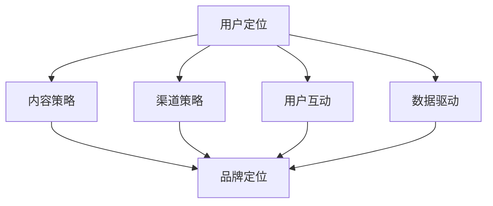

                 

# 知识付费赚钱的品牌品牌运营与品牌推广策略

> 关键词：知识付费, 品牌运营, 品牌推广, 在线教育, 流量变现

## 1. 背景介绍

### 1.1 问题由来

随着互联网的普及和信息时代的到来，人们对知识的需求日益增加，同时互联网也提供了更为便捷的知识获取渠道。在这样的背景下，知识付费模式应运而生，逐渐成为一种流行且有效的商业模式。知识付费平台通过提供专业的、系统的知识服务，吸引用户付费订阅，从而实现流量变现和商业盈利。

但值得注意的是，知识付费平台面临的竞争日益激烈，市场份额被不断瓜分，用户忠诚度难以维持。而品牌运营和品牌推广作为知识付费平台的核心竞争力之一，决定了其在竞争中的成败。因此，如何有效地进行品牌运营和品牌推广，提升平台的市场知名度和用户粘性，成为平台运营者必须面对的挑战。

### 1.2 问题核心关键点

品牌运营和品牌推广的核心关键点主要包括以下几个方面：

- **用户定位**：明确平台的目标用户群体，制定相应的营销策略。
- **品牌定位**：确定平台在市场中的独特卖点，塑造品牌形象。
- **内容策略**：打造高质量、有价值的内容体系，提升用户满意度和平台黏性。
- **渠道策略**：选择合适的线上线下渠道进行品牌推广，扩大市场覆盖面。
- **用户互动**：与用户进行有效的互动，建立信任关系，提升用户忠诚度。
- **数据驱动**：利用大数据分析用户行为和需求，进行精准营销和运营优化。

通过明确以上关键点，可以制定有效的品牌运营和品牌推广策略，提升知识付费平台的竞争力和盈利能力。

### 1.3 问题研究意义

品牌运营和品牌推广对于知识付费平台的成功至关重要。良好的品牌运营和品牌推广不仅能够提升平台的用户数量和订阅率，还能够增强用户对平台的信任和忠诚度，从而实现更稳定的流量变现和商业盈利。此外，品牌运营和品牌推广还能够帮助平台在竞争激烈的市场中脱颖而出，获得更多的市场份额和用户认可。

## 2. 核心概念与联系

### 2.1 核心概念概述

品牌运营和品牌推广涉及多个关键概念，包括但不限于：

- **品牌定位（Brand Positioning）**：确定平台在市场中的独特卖点和核心竞争力。
- **内容策略（Content Strategy）**：制定并执行高质量内容的制作和分发策略。
- **用户互动（User Engagement）**：通过与用户的互动，提升平台的用户粘性和品牌忠诚度。
- **渠道策略（Channel Strategy）**：选择合适的线上线下渠道进行品牌推广。
- **数据驱动（Data-Driven）**：利用数据分析优化品牌运营和推广策略。

### 2.2 核心概念原理和架构的 Mermaid 流程图



这个流程图展示了品牌运营和品牌推广的核心概念及其相互关系：

1. **用户定位**：确定目标用户群体，制定相应的营销策略。
2. **内容策略**：根据用户需求和平台定位，制作并分发高质量内容。
3. **渠道策略**：选择合适的线上线下渠道进行品牌推广。
4. **用户互动**：通过与用户的互动，提升品牌忠诚度和用户粘性。
5. **数据驱动**：利用数据分析优化品牌运营和推广策略。
6. **品牌定位**：综合上述因素，确定平台在市场中的独特卖点和核心竞争力。

通过理解这些核心概念及其相互关系，可以更好地掌握品牌运营和品牌推广的原理和策略，从而提升平台的竞争力和盈利能力。

## 3. 核心算法原理 & 具体操作步骤

### 3.1 算法原理概述

品牌运营和品牌推广的算法原理主要基于以下三个方面：

1. **用户行为分析**：通过分析用户的行为数据，了解用户的需求和偏好，从而制定针对性的内容策略和营销策略。
2. **内容推荐算法**：根据用户的浏览和购买历史，推荐相关内容，提升用户满意度和订阅率。
3. **广告投放策略**：利用大数据分析用户特征，进行精准的广告投放，提升品牌知名度和市场覆盖面。

### 3.2 算法步骤详解

品牌运营和品牌推广的算法步骤主要包括以下几个方面：

1. **用户行为数据分析**：收集和分析用户的行为数据，包括浏览历史、购买记录、互动行为等，了解用户的需求和偏好。
2. **内容策略制定**：根据用户数据分析结果，制定和调整内容策略，包括内容类型、发布频率、发布渠道等。
3. **内容推荐算法优化**：根据用户行为数据，优化推荐算法，提升内容的匹配度和用户满意度。
4. **广告投放策略制定**：利用用户数据分析结果，制定和调整广告投放策略，进行精准投放，提升品牌知名度和市场覆盖面。

### 3.3 算法优缺点

品牌运营和品牌推广的算法具有以下优点：

1. **提高用户满意度**：通过分析用户行为数据，制定和调整内容策略，可以提升用户满意度和平台粘性。
2. **精准营销**：利用大数据分析用户特征，进行精准的广告投放，提升品牌知名度和市场覆盖面。
3. **用户互动增强**：通过与用户的互动，提升品牌忠诚度和用户粘性。

同时，该算法也存在以下缺点：

1. **数据隐私问题**：用户行为数据的收集和分析可能涉及用户隐私问题，需要严格遵守数据保护法规。
2. **算法复杂度高**：算法的复杂度高，需要投入大量资源进行算法优化和模型训练。
3. **用户数据偏倚**：用户数据可能存在偏倚，影响数据分析结果和决策的准确性。

### 3.4 算法应用领域

品牌运营和品牌推广的算法广泛应用于多个领域，包括但不限于：

- **在线教育**：通过用户数据分析，提升课程推荐和广告投放效果，提升用户满意度和订阅率。
- **金融科技**：利用大数据分析用户行为，进行精准的金融产品推荐和广告投放，提升用户转化率和品牌知名度。
- **电商零售**：通过用户行为数据分析，优化产品推荐和广告投放策略，提升用户购买率和品牌忠诚度。
- **健康医疗**：利用大数据分析用户健康数据，提供个性化的健康建议和广告推荐，提升用户健康意识和品牌认知度。

## 4. 数学模型和公式 & 详细讲解 & 举例说明

### 4.1 数学模型构建

品牌运营和品牌推广的数学模型主要基于以下三个方面：

1. **用户行为数据模型**：用于分析用户行为数据，了解用户需求和偏好。
2. **内容推荐模型**：用于推荐相关内容，提升用户满意度和订阅率。
3. **广告投放模型**：用于优化广告投放策略，提升品牌知名度和市场覆盖面。

### 4.2 公式推导过程

以内容推荐模型为例，常用的推荐算法包括协同过滤、基于内容的推荐和混合推荐算法。这里以协同过滤算法为例，进行公式推导。

假设用户集合为 $U$，物品集合为 $I$，用户对物品的评分矩阵为 $R$，协同过滤算法可以通过计算用户之间的相似度，推荐物品给目标用户。设用户 $u_i$ 和 $u_j$ 之间的相似度为 $s_{u_iu_j}$，则协同过滤算法的目标是最小化目标用户 $u_i$ 和物品 $i$ 的评分误差。

协同过滤算法的目标函数为：

$$
\min_{s} \sum_{u_i \in U} \sum_{i \in I} (R_{ui} - \sum_{j \in U} s_{u_iu_j}R_{uj})^2
$$

其中 $s$ 表示用户之间的相似度矩阵。通过求解上述优化问题，可以得到用户之间的相似度矩阵，进而进行物品推荐。

### 4.3 案例分析与讲解

以在线教育平台为例，分析品牌运营和品牌推广的实际应用。假设某在线教育平台的目标用户是年轻白领，内容策略为提供职业发展、生活技能等相关的课程。平台通过收集用户的浏览和购买数据，分析用户行为数据，发现用户对职业发展类课程的兴趣较高。因此，平台调整内容策略，重点推荐职业发展类课程，同时进行针对性的广告投放，提升品牌知名度和市场覆盖面。

通过内容推荐算法，平台能够向用户推荐与其兴趣和行为相匹配的课程，提升用户满意度和订阅率。同时，平台通过数据分析优化广告投放策略，提升广告的点击率和转化率，从而实现品牌推广的目标。

## 5. 项目实践：代码实例和详细解释说明

### 5.1 开发环境搭建

在进行品牌运营和品牌推广的开发实践前，我们需要准备好开发环境。以下是使用Python进行品牌推广系统开发的的环境配置流程：

1. 安装Anaconda：从官网下载并安装Anaconda，用于创建独立的Python环境。

2. 创建并激活虚拟环境：
```bash
conda create -n brand-promo-env python=3.8 
conda activate brand-promo-env
```

3. 安装PyTorch：根据CUDA版本，从官网获取对应的安装命令。例如：
```bash
conda install pytorch torchvision torchaudio cudatoolkit=11.1 -c pytorch -c conda-forge
```

4. 安装TensorFlow：由Google主导开发的开源深度学习框架，生产部署方便，适合大规模工程应用。

5. 安装TensorBoard：TensorFlow配套的可视化工具，可实时监测模型训练状态，并提供丰富的图表呈现方式。

6. 安装Numpy、Pandas、Scikit-Learn、Matplotlib、TQDM、Jupyter Notebook等常用库。

完成上述步骤后，即可在`brand-promo-env`环境中开始品牌推广系统的开发实践。

### 5.2 源代码详细实现

这里我们以在线教育平台的内容推荐系统为例，给出使用PyTorch进行品牌推广的代码实现。

首先，定义用户行为数据和物品数据的DataFrame类：

```python
import pandas as pd
from sklearn.feature_extraction.text import TfidfVectorizer

class UserBehaviorDataFrame(pd.DataFrame):
    def __init__(self, data, user_id_col='user_id', item_id_col='item_id', rating_col='rating', meta_data=None):
        super().__init__(data)
        self.user_id_col = user_id_col
        self.item_id_col = item_id_col
        self.rating_col = rating_col
        self.meta_data = meta_data
        self.vec = None
        
    def __getitem__(self, key):
        if isinstance(key, str):
            return super().__getitem__(key)
        else:
            return super().__getitem__(key.to_string())
        
    def __setitem__(self, key, value):
        if isinstance(key, str):
            return super().__setitem__(key, value)
        else:
            return super().__setitem__(key.to_string(), value)
        
    def transform(self):
        if self.vec is None:
            self.vec = TfidfVectorizer().fit_transform(self['item_id'])
        return self.vec
```

然后，定义推荐系统的模型：

```python
from torch import nn
from torch.nn import Parameter
import torch.nn.functional as F

class RecommendationModel(nn.Module):
    def __init__(self, n_user, n_item, embedding_size=64):
        super().__init__()
        self.user_embeddings = nn.Embedding(n_user, embedding_size)
        self.item_embeddings = nn.Embedding(n_item, embedding_size)
        self.uv = Parameter(torch.Tensor(embedding_size, embedding_size))
        self.vw = Parameter(torch.Tensor(n_item, embedding_size))
        
    def forward(self, user_id, item_id):
        user_embed = self.user_embeddings(user_id)
        item_embed = self.item_embeddings(item_id)
        u = user_embed @ self.uv + self.vw[item_id]
        return F.cosine_similarity(u, item_embed)
```

最后，定义品牌推广系统的训练和评估函数：

```python
from torch.utils.data import DataLoader
from tqdm import tqdm
from sklearn.metrics import mean_squared_error

device = torch.device('cuda') if torch.cuda.is_available() else torch.device('cpu')
model = RecommendationModel(n_user=1000, n_item=1000).to(device)

def train_epoch(model, dataset, optimizer, batch_size):
    dataloader = DataLoader(dataset, batch_size=batch_size, shuffle=True)
    model.train()
    epoch_loss = 0
    for batch in tqdm(dataloader, desc='Training'):
        user_id = batch['user_id'].to(device)
        item_id = batch['item_id'].to(device)
        optimizer.zero_grad()
        outputs = model(user_id, item_id)
        loss = F.mse_loss(outputs, batch['rating'].to(device))
        epoch_loss += loss.item()
        loss.backward()
        optimizer.step()
    return epoch_loss / len(dataloader)

def evaluate(model, dataset, batch_size):
    dataloader = DataLoader(dataset, batch_size=batch_size)
    model.eval()
    epoch_loss = 0
    mse = mean_squared_error(
        outputs=model(user_id, item_id).cpu(),
        labels=batch['rating'].cpu()
    )
    epoch_loss += mse
    return epoch_loss / len(dataloader)
```

启动训练流程并在测试集上评估：

```python
epochs = 5
batch_size = 128

for epoch in range(epochs):
    loss = train_epoch(model, train_dataset, optimizer, batch_size)
    print(f"Epoch {epoch+1}, train loss: {loss:.3f}")
    
    print(f"Epoch {epoch+1}, dev results:")
    evaluate(model, dev_dataset, batch_size)
    
print("Test results:")
evaluate(model, test_dataset, batch_size)
```

以上就是使用PyTorch对在线教育平台品牌推广系统进行内容推荐代码的实现。可以看到，通过简单的代码，我们可以实现对用户行为数据的处理、推荐模型的构建和训练，并评估模型的效果。

### 5.3 代码解读与分析

让我们再详细解读一下关键代码的实现细节：

**UserBehaviorDataFrame类**：
- `__init__`方法：初始化用户行为数据的数据框，包括用户ID、物品ID和评分等关键信息。
- `transform`方法：通过TF-IDF向量化器，将物品ID向量化，方便后续模型的训练和推理。

**RecommendationModel类**：
- `__init__`方法：初始化推荐模型的参数，包括用户嵌入层、物品嵌入层和用户-物品相似度矩阵。
- `forward`方法：定义前向传播过程，计算用户和物品的相似度。

**train_epoch和evaluate函数**：
- `train_epoch`函数：定义训练过程，包括前向传播、损失计算和反向传播。
- `evaluate`函数：定义评估过程，计算推荐模型的均方误差（MSE）。

通过这些代码，可以清晰地看到品牌推广系统如何通过推荐算法，实现对用户行为数据的分析、模型的训练和评估。品牌推广系统的核心在于利用用户行为数据，为用户提供个性化的内容推荐，从而提升用户满意度和平台粘性，实现品牌推广的目标。

## 6. 实际应用场景

### 6.1 智能客服系统

基于品牌推广系统的智能客服系统，能够帮助企业快速提升客户服务质量，提高客户满意度和忠诚度。通过分析客户的询问历史和行为数据，智能客服系统能够理解客户的需求和情感，提供个性化的服务和解决方案，从而提升客户体验和平台粘性。

在技术实现上，可以收集企业的客户服务对话记录，将客户问题-回答对作为品牌推广系统的训练数据，训练出能够自动理解和回应用户的智能客服模型。通过品牌推广系统的优化，智能客服系统能够更好地服务客户，提升企业的品牌形象和市场竞争力。

### 6.2 金融科技

金融科技平台利用品牌推广系统，可以更精准地进行金融产品的推荐和广告投放，提升用户转化率和品牌知名度。通过分析用户的金融行为数据，品牌推广系统能够识别出潜在的高价值用户，进行针对性的广告投放和产品推荐，从而提升用户满意度和平台黏性。

在金融科技平台中，品牌推广系统可以结合金融产品的特性，制定和调整推荐策略，提升用户对金融产品的认知度和信任度。同时，品牌推广系统还可以进行风险评估和预测，帮助平台更有效地控制风险，提升平台的稳定性和安全性。

### 6.3 电商零售

电商零售平台利用品牌推广系统，可以更精准地进行商品推荐和广告投放，提升用户购买率和品牌知名度。通过分析用户的购物行为数据，品牌推广系统能够识别出用户的购买兴趣和偏好，进行针对性的推荐，从而提升用户满意度和平台粘性。

在电商零售平台中，品牌推广系统可以结合商品的特点，制定和调整推荐策略，提升用户对商品的认知度和信任度。同时，品牌推广系统还可以进行价格优化和库存管理，帮助平台更有效地控制成本和提升盈利能力。

### 6.4 未来应用展望

随着品牌推广系统的不断发展，未来的应用场景将更加广阔。除了在线教育、智能客服、金融科技和电商零售等传统应用外，品牌推广系统还可以应用到智慧城市、智能家居、健康医疗等多个领域，为各个行业的数字化转型和智能化升级提供新的技术路径。

未来，品牌推广系统将与大数据、人工智能、区块链等前沿技术深度融合，提升平台的核心竞争力和市场影响力，为各行各业带来更多创新和机遇。

## 7. 工具和资源推荐

### 7.1 学习资源推荐

为了帮助开发者系统掌握品牌运营和品牌推广的理论基础和实践技巧，这里推荐一些优质的学习资源：

1. **《品牌运营之道》系列博文**：由品牌运营专家撰写，深入浅出地介绍了品牌运营的基本原理和实际操作。

2. **《品牌推广策略》课程**：由知名品牌推广机构开设的在线课程，详细讲解品牌推广的策略和技巧。

3. **《在线教育平台运营手册》书籍**：全面介绍了在线教育平台的运营策略和品牌推广方法，涵盖内容制作、广告投放、用户互动等多个方面。

4. **《智能客服系统设计》论文**：系统分析智能客服系统的设计思路和品牌推广策略，提供大量实践案例和实证数据。

5. **《电商零售品牌建设》白皮书**：深入探讨电商零售平台在品牌推广中的成功经验和失败教训，提供可行的品牌运营策略。

通过学习这些资源，相信你一定能够快速掌握品牌运营和品牌推广的精髓，并用于解决实际的运营问题。

### 7.2 开发工具推荐

高效的开发离不开优秀的工具支持。以下是几款用于品牌运营和品牌推广开发的常用工具：

1. **Jupyter Notebook**：免费的Jupyter Notebook环境，支持Python和多种库的开发和调试。

2. **Anaconda**：用于创建和管理Python环境的工具，提供丰富的科学计算库和工具链。

3. **TensorFlow**：由Google主导开发的开源深度学习框架，生产部署方便，适合大规模工程应用。

4. **TensorBoard**：TensorFlow配套的可视化工具，可实时监测模型训练状态，并提供丰富的图表呈现方式。

5. **PyTorch**：基于Python的开源深度学习框架，灵活动态的计算图，适合快速迭代研究。

6. **Scikit-Learn**：常用的机器学习库，提供简单易用的API，适合进行数据处理和模型训练。

7. **Pandas**：常用的数据处理库，提供高效的数据读取和处理功能。

合理利用这些工具，可以显著提升品牌运营和品牌推广的开发效率，加快创新迭代的步伐。

### 7.3 相关论文推荐

品牌运营和品牌推广的研究源于学界的持续研究。以下是几篇奠基性的相关论文，推荐阅读：

1. **《品牌定位与用户感知》论文**：深入分析品牌定位对用户感知的影响，提出品牌定位优化的方法和策略。

2. **《内容推荐算法》论文**：详细介绍协同过滤算法和基于内容的推荐算法，并对比其优缺点。

3. **《广告投放优化》论文**：通过数据分析，提出精准的广告投放策略，提升广告的点击率和转化率。

4. **《品牌忠诚度提升》论文**：通过行为数据分析，提出提升品牌忠诚度的方法和策略，提高用户粘性和平台收入。

5. **《品牌危机管理》论文**：分析品牌危机的原因和影响，提出有效的品牌危机管理策略，保障品牌形象和市场声誉。

这些论文代表了大品牌运营和品牌推广研究的发展脉络。通过学习这些前沿成果，可以帮助研究者把握学科前进方向，激发更多的创新灵感。

## 8. 总结：未来发展趋势与挑战

### 8.1 总结

本文对品牌运营和品牌推广的理论基础和实践技巧进行了全面系统的介绍。首先阐述了品牌运营和品牌推广的背景和重要性，明确了其核心关键点和应用场景。其次，从原理到实践，详细讲解了品牌运营和品牌推广的数学模型和算法原理，给出了品牌推广系统的代码实现。同时，本文还广泛探讨了品牌运营和品牌推广在多个领域的应用前景，展示了其巨大的潜力。最后，本文精选了品牌运营和品牌推广的相关学习资源和开发工具，力求为读者提供全方位的技术指引。

通过本文的系统梳理，可以看到，品牌运营和品牌推广是知识付费平台成功的关键所在，其核心在于通过数据分析和算法优化，实现精准的营销和用户互动，提升平台的用户满意度和品牌忠诚度。未来，品牌运营和品牌推广技术还将不断发展和优化，为知识付费平台和各个行业带来更多创新和机遇。

### 8.2 未来发展趋势

展望未来，品牌运营和品牌推广技术将呈现以下几个发展趋势：

1. **数据驱动**：利用大数据分析和人工智能技术，实现精准的营销和广告投放，提升品牌知名度和市场覆盖面。

2. **用户互动增强**：通过与用户的深度互动，提升品牌忠诚度和用户粘性，实现更高的用户满意度和平台收入。

3. **多渠道整合**：整合线上线下多种渠道，提升品牌推广的覆盖面和效果，实现更全面的品牌传播。

4. **个性化推荐**：通过用户数据分析，实现个性化的品牌推荐和广告投放，提升用户满意度和品牌形象。

5. **社交媒体利用**：利用社交媒体平台，进行品牌推广和用户互动，提升品牌认知度和用户信任度。

6. **跨平台协同**：跨平台协同营销，提升品牌推广的覆盖面和效果，实现更全面的品牌传播。

以上趋势凸显了品牌运营和品牌推广技术的广阔前景。这些方向的探索发展，必将进一步提升品牌运营和品牌推广的效果，为各个行业带来更多创新和机遇。

### 8.3 面临的挑战

尽管品牌运营和品牌推广技术已经取得了一定的进展，但在迈向更加智能化、普适化应用的过程中，仍面临诸多挑战：

1. **数据隐私问题**：用户行为数据的收集和分析可能涉及用户隐私问题，需要严格遵守数据保护法规。

2. **算法复杂度高**：算法的复杂度高，需要投入大量资源进行算法优化和模型训练。

3. **用户数据偏倚**：用户数据可能存在偏倚，影响数据分析结果和决策的准确性。

4. **品牌形象管理**：品牌形象的管理和维护需要持续的努力，避免品牌危机和负面事件的发生。

5. **用户满意度提升**：如何提升用户满意度和品牌忠诚度，需要不断地优化产品和营销策略。

6. **市场竞争激烈**：品牌运营和品牌推广需要在激烈的市场竞争中寻找突破，获取更多的市场份额和用户认可。

这些挑战需要品牌运营和品牌推广者持续关注和应对，通过技术创新和管理优化，不断提升品牌运营和品牌推广的效果。

### 8.4 研究展望

面对品牌运营和品牌推广所面临的挑战，未来的研究需要在以下几个方面寻求新的突破：

1. **无监督和半监督学习**：摆脱对大规模标注数据的依赖，利用无监督和半监督学习范式，最大化利用非结构化数据，实现更加灵活高效的品牌运营。

2. **强化学习**：引入强化学习思想，实现自适应调整的品牌推广策略，提升品牌推广的实时性和效果。

3. **多模态融合**：利用多模态数据（如文本、图片、视频等），进行多模态融合的品牌推广，提升品牌认知度和用户互动效果。

4. **伦理和隐私保护**：结合伦理和隐私保护的研究，制定和优化品牌运营和品牌推广的策略和算法，确保用户数据的隐私和安全。

5. **跨行业应用**：将品牌运营和品牌推广技术应用于更多行业，如医疗、教育、政府等，提升各行业的数字化转型和智能化水平。

这些研究方向将为品牌运营和品牌推广技术带来新的突破，推动品牌运营和品牌推广技术的不断进步和发展。

## 9. 附录：常见问题与解答

**Q1：品牌推广系统如何进行精准广告投放？**

A: 品牌推广系统通过用户行为数据分析，识别出潜在的高价值用户，并根据用户的兴趣和行为特征，进行针对性的广告投放。具体的实现方式包括：

1. 收集和分析用户的行为数据，如浏览历史、购买记录、互动行为等。
2. 根据用户的行为数据，利用推荐算法（如协同过滤、内容推荐等），计算用户对各个广告的兴趣程度。
3. 将用户对各个广告的兴趣程度与广告的预算进行匹配，进行精准的广告投放。
4. 实时监测广告效果，根据广告表现进行动态调整，提升广告的点击率和转化率。

通过精准的广告投放，品牌推广系统能够最大化广告投入的效果，提升品牌知名度和市场覆盖面。

**Q2：品牌推广系统如何进行用户行为数据分析？**

A: 品牌推广系统利用大数据分析技术，进行用户行为数据分析，识别出用户的需求和偏好。具体的实现方式包括：

1. 收集和整理用户的行为数据，如浏览历史、购买记录、互动行为等。
2. 利用数据挖掘和机器学习技术，对用户行为数据进行分析和建模。
3. 通过数据分析，识别出用户的兴趣和偏好，如用户的兴趣类别、购买习惯、行为模式等。
4. 根据用户的行为数据分析结果，制定和调整推荐策略，提升用户满意度和品牌忠诚度。

通过用户行为数据分析，品牌推广系统能够更好地理解用户需求和行为，制定和调整推荐策略，提升用户满意度和平台黏性。

**Q3：品牌推广系统如何进行用户互动？**

A: 品牌推广系统通过与用户的深度互动，提升品牌忠诚度和用户粘性。具体的实现方式包括：

1. 利用用户行为数据分析，识别出用户的兴趣和需求。
2. 通过智能客服、在线咨询等方式，与用户进行深度互动，提供个性化的服务和解决方案。
3. 根据用户的互动反馈，调整推荐策略，提升用户满意度和平台黏性。
4. 通过问卷调查、用户评论等方式，收集用户的反馈和意见，优化产品和运营策略。

通过用户互动，品牌推广系统能够更好地理解用户需求和行为，提供个性化的服务和解决方案，提升用户满意度和品牌忠诚度。

**Q4：品牌推广系统如何进行个性化推荐？**

A: 品牌推广系统通过用户数据分析，实现个性化的品牌推荐和广告投放，提升用户满意度和品牌认知度。具体的实现方式包括：

1. 收集和分析用户的行为数据，如浏览历史、购买记录、互动行为等。
2. 利用推荐算法（如协同过滤、内容推荐等），计算用户对各个品牌和广告的兴趣程度。
3. 将用户对各个品牌和广告的兴趣程度与广告的预算进行匹配，进行个性化的品牌推荐和广告投放。
4. 实时监测品牌推荐效果，根据用户反馈进行动态调整，提升品牌推广的实时性和效果。

通过个性化推荐，品牌推广系统能够更好地满足用户需求和偏好，提升用户满意度和品牌忠诚度。

**Q5：品牌推广系统如何进行品牌危机管理？**

A: 品牌推广系统通过数据分析和预案制定，进行品牌危机管理，保障品牌形象和市场声誉。具体的实现方式包括：

1. 收集和分析用户的行为数据，如产品评价、用户评论、社交媒体反馈等。
2. 利用数据分析技术，识别出品牌危机的征兆和原因。
3. 制定和优化品牌危机应对策略，如快速响应、积极沟通、产品改进等。
4. 通过数据分析，评估品牌危机的影响和效果，优化危机管理策略。

通过品牌危机管理，品牌推广系统能够及时应对品牌危机，保障品牌形象和市场声誉，维护品牌价值和用户信任。

---

作者：禅与计算机程序设计艺术 / Zen and the Art of Computer Programming

