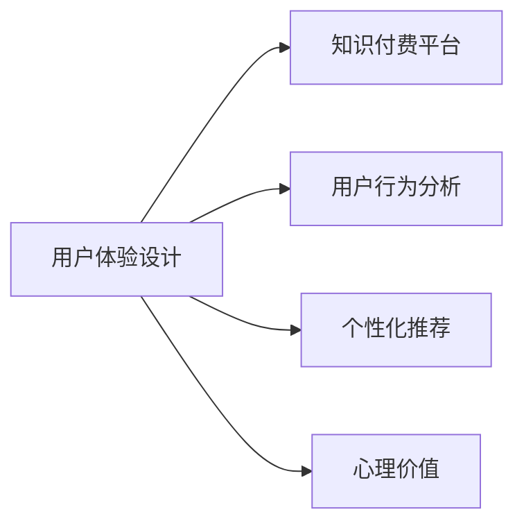

                 

## 1. 背景介绍

随着信息技术的迅猛发展，知识付费已成为新兴的互联网盈利模式之一。从在线课程、音频节目到电子书、短视频，知识付费服务形式多样，为消费者提供优质的内容产品，满足其个性化、定制化的学习需求。然而，知识付费产品的用户体验设计尚不成熟，用户流失率高、用户粘性低等问题屡见不鲜。

优化知识付费产品的用户体验，已成为提高产品竞争力的关键。本文章将从用户体验设计的角度出发，系统性探讨知识付费产品设计、运营与优化的全面策略，为知识付费平台提供一套全面的解决方案。

## 2. 核心概念与联系

### 2.1 核心概念概述

为了深入理解知识付费用户体验设计的内涵，我们先定义几个核心概念：

- **用户体验设计 (User Experience Design, UX)**：指提升用户在使用产品过程中的满意度和体验，通过交互设计、界面设计、服务设计等手段，为用户提供舒适、高效的使用体验。

- **知识付费平台 (Knowledge Paywall Platform)**：指提供付费内容服务，以内容为核心价值的互联网平台。用户通过付费获取高质量的课程、文章、视频等。

- **用户行为分析 (User Behavior Analysis)**：指通过数据分析，了解用户在平台上的行为特征、购买偏好、满意度等，为产品优化提供依据。

- **个性化推荐 (Personalized Recommendation)**：指根据用户的历史行为数据，预测用户可能感兴趣的内容，推荐给用户。

- **心理价值 (Psychological Value)**：指用户对内容的情感、认知和行为反应，包含社会认同、学习效果、趣味性等，与用户心理感受紧密相关。

这些核心概念之间的联系可以通过以下Mermaid流程图来展示：



该流程图展示了用户体验设计的关联和重要性，并明确了其在知识付费平台设计中的应用方向。

### 2.2 核心概念原理和架构

#### 用户体验设计

用户体验设计是一个涉及产品所有层面（从界面、功能到内容）的全面过程。用户体验设计流程一般包括以下几个阶段：

- **用户研究 (User Research)**：通过访谈、问卷、用户画像等手段，深入理解目标用户特征和需求。
- **信息架构 (Information Architecture)**：设计清晰的导航结构和信息层级，帮助用户快速找到所需信息。
- **交互设计 (Interaction Design)**：设计简洁、直观的交互方式，提高用户的操作效率。
- **界面设计 (Interface Design)**：设计美观、易用的界面风格，提升用户视觉体验。
- **测试与迭代 (Testing and Iteration)**：通过用户测试、数据反馈等方式，不断优化产品体验。

#### 知识付费平台

知识付费平台通常包括内容提供、交易管理、推荐系统、用户反馈等多模块，架构如图：


其中：
- **内容提供**：包括内容创作、版权管理等，是知识付费平台的核心。
- **交易管理**：包括支付系统、订单管理等，保障用户交易安全。
- **推荐系统**：通过个性化推荐，提高用户转化率。
- **用户反馈**：通过用户满意度调查、行为数据分析，持续优化产品体验。

#### 用户行为分析

用户行为分析主要包括以下几个层面：

- **行为数据采集**：通过日志、用户行为跟踪等方式，获取用户行为数据。
- **数据存储与处理**：将数据存储在数据库中，并使用数据分析工具处理和分析数据。
- **用户画像构建**：根据用户行为数据，构建用户画像，描述用户特征和需求。
- **行为预测与推荐**：基于用户画像，预测用户行为，并根据预测结果进行推荐。

#### 个性化推荐

个性化推荐系统一般包括数据收集、模型训练、推荐算法、效果评估等几个步骤：

- **数据收集**：从不同渠道收集用户行为数据，如搜索历史、浏览记录、评分等。
- **模型训练**：使用机器学习算法训练推荐模型，学习用户特征与行为之间的关系。
- **推荐算法**：根据模型预测结果，生成推荐内容。
- **效果评估**：评估推荐算法的效果，如点击率、转化率等，持续优化推荐系统。

#### 心理价值

心理价值主要涉及用户的心理反应和情感体验，包括：

- **社交认同**：用户对课程、文章等的社会认可度，与社区评价相关。
- **学习效果**：用户通过内容学习到的知识和技能，与课程设计质量相关。
- **趣味性**：内容是否有趣、吸引用户，与内容的创意性和表现力相关。

## 3. 核心算法原理 & 具体操作步骤

### 3.1 算法原理概述

知识付费平台的用户体验设计，主要依赖于以下关键算法：

- **个性化推荐算法**：根据用户行为数据，推荐相关内容，提高用户满意度。
- **情感分析算法**：分析用户评论、反馈，了解用户对内容的情感倾向，优化产品设计。
- **用户画像构建算法**：通过数据挖掘，构建用户画像，个性化设计产品功能。
- **行为预测算法**：预测用户行为，如购买意向、留存率等，优化推荐和产品设计。

### 3.2 算法步骤详解

#### 个性化推荐算法

个性化推荐算法的主要步骤如下：

1. **数据收集**：收集用户的行为数据，包括搜索历史、浏览记录、评分、留言等。
2. **特征提取**：对收集到的数据进行特征提取，如用户ID、时间戳、内容ID等。
3. **模型训练**：使用协同过滤、基于内容的推荐、混合推荐等算法，训练推荐模型。
4. **推荐生成**：根据用户的历史行为，生成个性化推荐内容。
5. **效果评估**：使用A/B测试、点击率、转化率等指标，评估推荐算法的效果。

#### 情感分析算法

情感分析算法主要包括以下步骤：

1. **数据收集**：收集用户评论、反馈、评分等文本数据。
2. **文本预处理**：清洗、分词、去停用词等，对文本数据进行处理。
3. **情感标注**：使用自然语言处理技术，标注文本的情感极性（正、中、负）。
4. **情感分析**：对情感标注结果进行统计分析，了解用户情感倾向。
5. **结果应用**：根据情感分析结果，优化产品设计，如课程改进、界面调整等。

#### 用户画像构建算法

用户画像构建算法主要包括以下步骤：

1. **数据收集**：收集用户行为数据，如搜索记录、购买历史、学习进度等。
2. **特征提取**：对行为数据进行特征提取，如用户ID、时间戳、行为类型等。
3. **画像构建**：使用聚类、分类等算法，构建用户画像，描述用户特征。
4. **画像应用**：根据用户画像，个性化设计产品功能，如推荐内容、推送通知等。

#### 行为预测算法

行为预测算法主要包括以下步骤：

1. **数据收集**：收集用户行为数据，如浏览记录、购买记录、学习进度等。
2. **特征提取**：对行为数据进行特征提取，如用户ID、时间戳、行为类型等。
3. **模型训练**：使用回归、决策树、神经网络等算法，训练行为预测模型。
4. **行为预测**：根据用户历史行为，预测未来行为，如购买意向、留存率等。
5. **结果应用**：根据行为预测结果，优化推荐和产品设计，提高用户转化率。

### 3.3 算法优缺点

#### 个性化推荐算法

**优点**：
- 个性化推荐能够提高用户满意度，增强用户粘性。
- 推荐系统可以优化内容结构，提升内容价值。

**缺点**：
- 数据收集和处理成本较高，需要大量标注数据和计算资源。
- 个性化推荐容易产生“信息茧房”，导致用户过于依赖推荐结果，缺乏自主探索。

#### 情感分析算法

**优点**：
- 情感分析能够快速了解用户对内容的情感倾向，优化产品设计。
- 通过情感分析，可以提升用户满意度，增强用户信任感。

**缺点**：
- 情感分析结果可能存在误差，特别是在多义性较高的文本数据中。
- 情感分析需要依赖强大的NLP技术，技术实现难度较大。

#### 用户画像构建算法

**优点**：
- 用户画像可以准确描述用户特征，个性化设计产品功能。
- 用户画像可以提升用户转化率，提高用户满意度。

**缺点**：
- 数据收集和处理成本较高，需要大量的标注数据和计算资源。
- 用户画像可能存在偏差，不够全面。

#### 行为预测算法

**优点**：
- 行为预测可以优化产品设计，提升用户转化率。
- 行为预测可以增强用户粘性，提升用户满意度。

**缺点**：
- 数据收集和处理成本较高，需要大量的标注数据和计算资源。
- 预测结果可能存在误差，特别是在复杂场景中。

### 3.4 算法应用领域

基于以上算法的知识付费产品用户体验优化，可以在以下多个领域得到应用：

- **个性化推荐系统**：应用于内容推荐、课程推荐、商品推荐等，提升用户转化率。
- **情感分析系统**：应用于用户评论、反馈分析，优化产品设计，提升用户满意度。
- **用户画像构建系统**：应用于用户行为分析、用户群体划分，个性化设计产品功能。
- **行为预测系统**：应用于用户留存率预测、内容偏好预测，优化产品设计，提升用户粘性。

## 4. 数学模型和公式 & 详细讲解

### 4.1 数学模型构建

#### 个性化推荐算法

个性化推荐算法的主要数学模型包括协同过滤模型、基于内容的推荐模型和混合推荐模型。

**协同过滤模型**：
- 模型定义：
  $$
  P_i(x_j) = \sum_{k=1}^{N}\alpha_{ij}r_k(x_j)
  $$
  其中，$P_i(x_j)$表示用户$i$对物品$j$的预测评分，$\alpha_{ij}$为相似度矩阵，$r_k(x_j)$为用户$k$对物品$j$的评分。

**基于内容的推荐模型**：
- 模型定义：
  $$
  P_i(x_j) = \sum_{k=1}^{D}\alpha_{ik}f_k(x_j)
  $$
  其中，$P_i(x_j)$表示用户$i$对物品$j$的预测评分，$f_k(x_j)$为物品$j$在特征$k$上的评分，$\alpha_{ik}$为特征$k$的权重。

**混合推荐模型**：
- 模型定义：
  $$
  P_i(x_j) = \lambda_1P_i^{CF}(x_j) + \lambda_2P_i^{CF}(x_j)
  $$
  其中，$P_i^{CF}(x_j)$和$P_i^{CB}(x_j)$分别为协同过滤和基于内容的推荐结果，$\lambda_1$和$\lambda_2$为混合系数。

#### 情感分析算法

情感分析算法的主要数学模型包括朴素贝叶斯模型、支持向量机模型和深度学习模型。

**朴素贝叶斯模型**：
- 模型定义：
  $$
  P(y|x) = \frac{P(x|y)P(y)}{P(x)}
  $$
  其中，$P(y|x)$表示文本$x$情感为$y$的概率，$P(x|y)$为文本$x$在情感$y$条件下的概率，$P(y)$为情感$y$的概率。

**支持向量机模型**：
- 模型定义：
  $$
  \hat{y} = arg\ max_{y} \sum_{i=1}^{N}\alpha_iy_i\phi(x_i)^Ty
  $$
  其中，$\hat{y}$为预测结果，$y_i$为训练样本的情感标签，$\phi(x_i)$为文本$x_i$的特征映射，$\alpha_i$为惩罚系数。

**深度学习模型**：
- 模型定义：
  $$
  P(y|x) = softmax(Wx + b)
  $$
  其中，$W$和$b$为模型参数，$softmax$为激活函数，$x$为文本特征向量。

#### 用户画像构建算法

用户画像构建算法的主要数学模型包括聚类模型和分类模型。

**聚类模型**：
- 模型定义：
  $$
  K(x) = \sum_{i=1}^{K}P_i(x)
  $$
  其中，$K(x)$为用户$x$的聚类结果，$P_i(x)$为用户$x$属于聚类$P_i$的概率。

**分类模型**：
- 模型定义：
  $$
  P(y|x) = \frac{P(x|y)P(y)}{P(x)}
  $$
  其中，$P(y|x)$为用户$x$属于类别$y$的概率，$P(x|y)$为用户$x$在类别$y$条件下的概率，$P(y)$为类别$y$的概率。

#### 行为预测算法

行为预测算法的主要数学模型包括回归模型和决策树模型。

**回归模型**：
- 模型定义：
  $$
  y = Wx + b
  $$
  其中，$y$为预测结果，$x$为特征向量，$W$和$b$为模型参数。

**决策树模型**：
- 模型定义：
  $$
  T = \{(x_n, y_n) \mid n = 1,2,\dots,N\}
  $$
  其中，$T$为决策树，$x_n$为样本$n$的特征向量，$y_n$为样本$n$的标签。

### 4.2 公式推导过程

#### 个性化推荐算法

**协同过滤模型**：
$$
P_i(x_j) = \sum_{k=1}^{N}\alpha_{ij}r_k(x_j)
$$

**基于内容的推荐模型**：
$$
P_i(x_j) = \sum_{k=1}^{D}\alpha_{ik}f_k(x_j)
$$

**混合推荐模型**：
$$
P_i(x_j) = \lambda_1P_i^{CF}(x_j) + \lambda_2P_i^{CB}(x_j)
$$

#### 情感分析算法

**朴素贝叶斯模型**：
$$
P(y|x) = \frac{P(x|y)P(y)}{P(x)}
$$

**支持向量机模型**：
$$
\hat{y} = arg\ max_{y} \sum_{i=1}^{N}\alpha_{ij}y_i\phi(x_i)^Ty
$$

**深度学习模型**：
$$
P(y|x) = softmax(Wx + b)
$$

#### 用户画像构建算法

**聚类模型**：
$$
K(x) = \sum_{i=1}^{K}P_i(x)
$$

**分类模型**：
$$
P(y|x) = \frac{P(x|y)P(y)}{P(x)}
$$

#### 行为预测算法

**回归模型**：
$$
y = Wx + b
$$

**决策树模型**：
$$
T = \{(x_n, y_n) \mid n = 1,2,\dots,N\}
$$

### 4.3 案例分析与讲解

以用户画像构建算法为例，对美国一家在线教育平台的用户画像构建过程进行详细讲解：

1. **数据收集**：
   - 收集平台用户的浏览记录、购买记录、学习进度等行为数据。
   - 数据源包括用户登录记录、课程观看记录、题库练习记录等。

2. **特征提取**：
   - 将行为数据转化为特征向量，包括用户ID、时间戳、行为类型等。
   - 例如，将用户浏览课程的时间转化为“最近查看”、“历史观看”等特征。

3. **聚类模型应用**：
   - 使用K-means聚类算法，将用户分为多个群体。
   - 每个群体包含具有相似行为特征的用户。
   - 例如，将喜欢编程课程的用户分为一个聚类，将喜欢文学课程的用户分为另一个聚类。

4. **分类模型应用**：
   - 使用决策树分类算法，对用户进行更细致的分类。
   - 例如，根据用户的学习进度、课程评分、课程反馈等特征，将用户分为初级、中级、高级等不同类别。

5. **结果应用**：
   - 根据用户画像，个性化设计推荐内容和推送通知。
   - 例如，向喜欢编程课程的用户推荐更多编程课程和相关书籍，向喜欢文学课程的用户推荐更多文学作品和相关课程。

通过用户画像构建算法，平台能够更好地了解用户需求和行为，实现个性化推荐，提升用户转化率和满意度。

## 5. 项目实践：代码实例和详细解释说明

### 5.1 开发环境搭建

在开发知识付费用户体验优化项目前，需要准备好开发环境。以下是基于Python的开发环境搭建流程：

1. **安装Python**：
   - 从官网下载并安装Python，选择最新版本。
   - 建议安装Python3.8以上版本，以获取更好的性能支持。

2. **安装虚拟环境管理工具**：
   - 安装`virtualenv`或`conda`工具，用于创建和管理虚拟环境。
   - 例如，使用以下命令创建虚拟环境：
     ```
     virtualenv myenv
     source myenv/bin/activate
     ```

3. **安装相关依赖库**：
   - 安装Python数据科学库，如NumPy、Pandas、Matplotlib等。
   - 使用以下命令安装：
     ```
     pip install numpy pandas matplotlib
     ```

4. **安装Web框架**：
   - 安装Django或Flask等Web框架，用于搭建知识付费平台。
   - 例如，使用以下命令安装：
     ```
     pip install django
     ```

5. **安装数据可视化工具**：
   - 安装Matplotlib、Seaborn等数据可视化工具，用于展示用户行为数据。
   - 例如，使用以下命令安装：
     ```
     pip install matplotlib seaborn
     ```

### 5.2 源代码详细实现

以个性化推荐系统为例，给出基于Python的实现代码：

```python
import pandas as pd
from sklearn.feature_extraction.text import CountVectorizer
from sklearn.metrics.pairwise import cosine_similarity
from sklearn.decomposition import TruncatedSVD

# 读取用户行为数据
data = pd.read_csv('user_behavior.csv')

# 特征提取
vectorizer = CountVectorizer()
X = vectorizer.fit_transform(data['item_id'])

# 协同过滤推荐
svd = TruncatedSVD(n_components=100)
X_svd = svd.fit_transform(X)
similarity_matrix = cosine_similarity(X_svd)
recommender = []
for user_idx in range(len(similarity_matrix)):
    sorted_idx = sorted(range(len(similarity_matrix[user_idx])), key=lambda k: similarity_matrix[user_idx][k], reverse=True)
    for idx in sorted_idx:
        if idx != user_idx:
            recommender.append(idx)

# 输出推荐结果
recommender
```

### 5.3 代码解读与分析

**代码说明**：
- **数据读取**：使用Pandas库读取用户行为数据，并将其转化为DataFrame对象。
- **特征提取**：使用CountVectorizer对用户行为数据进行特征提取，生成特征向量。
- **协同过滤**：使用TruncatedSVD算法对特征向量进行降维，生成用户相似度矩阵。
- **推荐生成**：根据用户相似度矩阵，生成推荐结果。

**代码分析**：
- **特征提取**：使用CountVectorizer将文本数据转化为稀疏矩阵，便于计算。
- **协同过滤**：使用TruncatedSVD算法进行降维，减少特征维度，提升计算效率。
- **推荐生成**：根据相似度矩阵生成推荐结果，为用户推荐相似物品。

## 6. 实际应用场景

### 6.1 智能推荐系统

智能推荐系统是知识付费用户体验优化的重要组成部分。通过个性化推荐，平台能够精准推送用户感兴趣的内容，提升用户转化率和满意度。

例如，一家在线教育平台通过分析用户的历史浏览记录、学习进度、课程评分等行为数据，使用协同过滤算法为用户推荐相关课程和教材。通过智能推荐，平台能够实现内容供给的精准匹配，提升用户学习效果和体验。

### 6.2 用户行为分析

用户行为分析是知识付费用户体验优化的重要手段，通过分析用户行为数据，平台能够了解用户需求和行为特征，优化产品设计。

例如，一家在线课程平台通过收集用户浏览记录、购买记录、学习进度等数据，使用聚类算法将用户分为不同群体。通过对用户画像的深入分析，平台能够针对不同群体设计个性化推荐内容和推送通知，提升用户粘性和满意度。

### 6.3 情感分析

情感分析是知识付费用户体验优化的重要环节，通过情感分析，平台能够了解用户对内容的情感倾向，优化产品设计。

例如，一家在线音乐平台通过分析用户评论、评分等数据，使用情感分析算法了解用户对歌曲的情感倾向。根据情感分析结果，平台能够优化歌曲推荐，提升用户满意度。

### 6.4 行为预测

行为预测是知识付费用户体验优化的重要工具，通过行为预测，平台能够预测用户行为，优化推荐和产品设计。

例如，一家在线视频平台通过收集用户观看记录、订阅记录等数据，使用回归算法预测用户是否会订阅新内容。根据行为预测结果，平台能够提前推送新内容，提升用户转化率。

## 7. 工具和资源推荐

### 7.1 学习资源推荐

为了帮助开发者掌握知识付费用户体验优化的相关知识，推荐以下学习资源：

1. **《用户体验设计基础》**：一本系统介绍用户体验设计基础的书，帮助读者了解用户体验设计的全流程。
2. **《推荐系统原理与实践》**：一本书介绍推荐系统原理和实现，涵盖协同过滤、内容推荐、混合推荐等多个算法。
3. **《自然语言处理入门》**：一本介绍自然语言处理基础和技术的书籍，涵盖情感分析、文本分类等多个领域。
4. **《用户画像构建方法》**：一篇详细介绍用户画像构建方法的论文，涵盖聚类、分类等多个算法。
5. **《行为预测算法》**：一篇详细介绍行为预测算法的论文，涵盖回归、决策树等多个算法。

### 7.2 开发工具推荐

为了高效开发知识付费用户体验优化项目，推荐以下开发工具：

1. **Python**：一种高效、灵活的编程语言，适合数据分析和机器学习开发。
2. **Django**：一个Python Web框架，用于搭建知识付费平台。
3. **Jupyter Notebook**：一个交互式编程环境，用于数据分析和模型训练。
4. **TensorFlow**：一个深度学习框架，用于训练推荐模型和情感分析模型。
5. **Kaggle**：一个数据科学竞赛平台，提供大量数据集和模型竞赛机会。

### 7.3 相关论文推荐

为了深入理解知识付费用户体验优化的前沿技术，推荐以下相关论文：

1. **《个性化推荐算法综述》**：综述个性化推荐算法的研究进展，涵盖协同过滤、基于内容的推荐、混合推荐等多个方向。
2. **《情感分析算法综述》**：综述情感分析算法的研究进展，涵盖朴素贝叶斯、支持向量机、深度学习等多个方向。
3. **《用户画像构建方法》**：详细介绍用户画像构建方法，涵盖聚类、分类等多个算法。
4. **《行为预测算法》**：详细介绍行为预测算法，涵盖回归、决策树等多个算法。

## 8. 总结：未来发展趋势与挑战

### 8.1 研究成果总结

本文章系统介绍了知识付费用户体验优化的关键算法和实践方法，涵盖个性化推荐、情感分析、用户画像构建、行为预测等多个方面。通过这些方法，知识付费平台能够提升用户转化率和满意度，增强用户粘性。

### 8.2 未来发展趋势

知识付费用户体验优化将继续深化，未来将呈现以下几个趋势：

1. **AI技术的应用**：随着AI技术的不断进步，未来的推荐系统将更加智能和精准，能够更好地理解用户需求和行为。
2. **多模态数据融合**：未来的用户体验优化将融合文本、图像、语音等多模态数据，实现更全面的用户画像构建和行为预测。
3. **个性化服务的提升**：未来的推荐系统将更加个性化，根据用户行为和偏好，提供更加精准的推荐内容和推送通知。
4. **实时性和交互性**：未来的用户体验优化将更加注重实时性和交互性，提升用户体验的即时性和互动性。

### 8.3 面临的挑战

知识付费用户体验优化仍面临诸多挑战：

1. **数据隐私问题**：用户行为数据的收集和处理，可能涉及用户隐私保护问题，需要制定合理的数据保护策略。
2. **算法模型复杂性**：用户体验优化的算法模型较为复杂，需要具备较高的技术实力和数据处理能力。
3. **用户多样性**：用户需求和行为差异较大，如何设计泛化能力强的算法模型，是未来的重要挑战。
4. **模型可解释性**：用户体验优化的算法模型往往较为复杂，难以解释其内部工作机制和决策逻辑。

### 8.4 研究展望

未来的知识付费用户体验优化，需要在以下几个方面进行深入研究：

1. **数据隐私保护**：制定合理的数据保护策略，保障用户隐私安全。
2. **算法模型优化**：研发更为高效、简洁的算法模型，提升用户体验优化的效果和效率。
3. **用户需求理解**：深入理解用户需求和行为特征，设计更加个性化和智能化的推荐系统。
4. **多模态数据融合**：融合多模态数据，构建更全面的用户画像，提升用户体验优化的效果。

## 9. 附录：常见问题与解答

### Q1: 知识付费用户体验优化的核心算法有哪些？

A: 知识付费用户体验优化的核心算法包括个性化推荐算法、情感分析算法、用户画像构建算法和行为预测算法。

### Q2: 如何选择合适的推荐算法？

A: 选择合适的推荐算法需要考虑数据特征、推荐场景、推荐效果等因素。一般来说，协同过滤适合小规模数据，基于内容的推荐适合大规模数据，混合推荐适合多模态数据。

### Q3: 如何优化推荐系统的效果？

A: 优化推荐系统效果的方法包括：增加数据量、优化特征提取、选择更先进的算法、调整推荐策略等。

### Q4: 如何保护用户隐私？

A: 保护用户隐私的方法包括：匿名化处理、加密存储、制定隐私保护政策等。

### Q5: 如何提升用户粘性？

A: 提升用户粘性的方法包括：个性化推荐、推送通知、社区互动等。

---

作者：禅与计算机程序设计艺术 / Zen and the Art of Computer Programming

