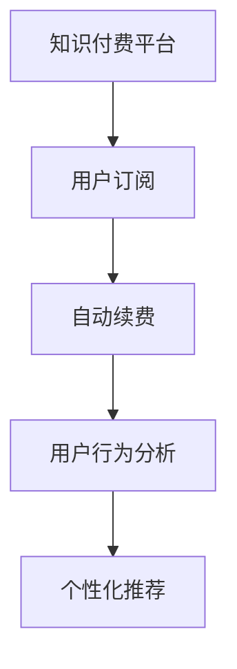

                 

# 知识付费赚钱的用户订阅模式与自动续费策略

> 关键词：知识付费, 用户订阅, 自动续费, 用户行为分析, 个性化推荐

## 1. 背景介绍

随着互联网的迅猛发展，知识付费平台成为了信息时代的新型商业模式。通过出售有价值的信息内容，平台不仅能满足用户的学习需求，还能实现盈利。用户订阅是知识付费平台的主要营收模式，而如何吸引用户续费，则是平台可持续发展的关键问题。本文将探讨知识付费平台用户订阅模式与自动续费策略，希望为知识付费行业的发展提供有益的参考。

## 2. 核心概念与联系

### 2.1 核心概念概述

为了更好地理解知识付费平台的订阅模式与自动续费策略，首先定义几个核心概念：

- **知识付费平台**：基于互联网的知识服务提供商，用户需要付费获取专业知识和信息。
- **用户订阅**：用户支付一定费用，定期获取平台提供的信息服务。
- **自动续费**：用户订阅到期后，平台自动扣费，用户无需手动续费。
- **用户行为分析**：通过数据分析，了解用户行为模式，预测用户需求，优化订阅策略。
- **个性化推荐**：根据用户偏好，推荐符合其需求的内容，提高用户黏性。

这些概念之间的逻辑关系可以通过以下Mermaid流程图来展示：



这个流程图展示了知识付费平台的用户订阅模式与自动续费策略的基本流程：

1. 用户通过知识付费平台订阅信息服务。
2. 平台提供自动续费选项，用户到期后无需手动续费。
3. 平台通过用户行为分析，了解用户需求。
4. 根据分析结果，提供个性化推荐内容。

这些环节共同构成知识付费平台的核心运营策略，旨在提升用户体验和平台收益。

## 3. 核心算法原理 & 具体操作步骤
### 3.1 算法原理概述

知识付费平台的用户订阅模式与自动续费策略，主要依赖于数据分析和机器学习技术。核心算法原理如下：

- **用户行为分析**：收集用户订阅、付费、使用等行为数据，通过数据分析技术，识别出用户需求和行为模式。
- **个性化推荐**：基于用户行为分析结果，通过推荐算法，为用户推荐符合其需求的内容，提升用户满意度。
- **自动续费策略**：根据用户行为数据，建立模型预测用户续费概率，并设计自动续费策略，最大化用户续费率。

这些算法原理，在实际操作中需要结合平台的具体情况和用户需求进行设计和优化。

### 3.2 算法步骤详解

知识付费平台的用户订阅模式与自动续费策略，主要包括以下几个关键步骤：

**Step 1: 数据收集与预处理**

- 收集用户订阅、付费、使用等行为数据，包括用户的购买记录、观看时长、互动情况等。
- 对数据进行预处理，包括去重、缺失值填充、特征工程等，以提高后续模型的准确性。

**Step 2: 用户行为分析**

- 通过数据分析技术，识别用户行为模式，如订阅周期、付费频率、使用频率等。
- 分析用户活跃度、流失率等关键指标，预测用户续费概率。

**Step 3: 个性化推荐**

- 根据用户行为分析结果，构建用户画像，描述用户兴趣和需求。
- 通过推荐算法，为用户推荐符合其需求的内容，提升用户满意度和续费意愿。

**Step 4: 自动续费策略设计**

- 根据用户行为数据，建立模型预测用户续费概率。
- 设计自动续费策略，如折扣优惠、连续订阅优惠、推荐好友续费等，提高用户续费率。

**Step 5: 策略实施与效果评估**

- 实施自动续费策略，实时监控用户续费情况。
- 定期评估策略效果，根据用户反馈和续费数据，调整优化策略。

以上是知识付费平台用户订阅模式与自动续费策略的一般流程。在实际应用中，还需要针对具体平台和用户需求进行优化设计，如改进推荐算法、调整续费折扣等。

### 3.3 算法优缺点

知识付费平台的用户订阅模式与自动续费策略，具有以下优点：

- **提升用户满意度**：个性化推荐和自动续费策略，能显著提升用户体验，增加用户黏性。
- **提高续费率**：通过数据分析和机器学习，预测用户续费概率，设计有效的自动续费策略，最大化用户续费率。
- **减少人工成本**：自动续费策略减少了人工手动续费操作，提高运营效率。

同时，该方法也存在一定的局限性：

- **数据隐私问题**：用户数据隐私保护需要得到充分考虑，避免数据泄露和滥用。
- **模型偏差问题**：模型预测可能存在偏差，需进行充分测试和优化。
- **策略调整复杂**：策略实施和效果评估需要持续迭代和优化，过程较为复杂。

尽管存在这些局限性，但就目前而言，基于数据分析和机器学习的自动续费策略仍是一种高效且具有竞争力的营收方式。未来相关研究的重点在于如何进一步提升模型准确性、优化推荐算法、保护用户隐私等，以提高策略的可持续性和用户体验。

### 3.4 算法应用领域

知识付费平台的用户订阅模式与自动续费策略，已经在多个领域得到了广泛应用：

- **在线教育**：如Coursera、Udemy等平台，通过订阅模式向用户提供课程学习服务，并提供自动续费选项。
- **科技资讯**：如Zhihu、Medium等平台，提供专业领域的文章和知识，用户可以通过订阅获取持续内容更新。
- **专业技能培训**：如LinkedIn Learning、Pluralsight等平台，提供技术、管理等方面的课程，通过订阅模式获取服务。

除了这些常见应用外，知识付费模式还在财经、健康、艺术等多个领域得到了拓展，成为信息时代的重要商业模式。

## 4. 数学模型和公式 & 详细讲解  
### 4.1 数学模型构建

知识付费平台的用户订阅模式与自动续费策略，主要依赖于以下数学模型：

- **用户行为分析模型**：如用户活跃度模型、流失率模型等，用于预测用户续费概率。
- **个性化推荐模型**：如协同过滤推荐模型、内容推荐模型等，用于为用户推荐内容。
- **自动续费策略模型**：如折扣优惠模型、好友续费模型等，用于设计自动续费策略。

这些模型的构建，需要结合具体业务场景和数据特征，进行设计和优化。

### 4.2 公式推导过程

以用户活跃度模型为例，推导其中的关键公式：

假设用户每天使用平台的概率为 $p$，订阅周期为 $T$，则用户某时刻的活跃度 $A$ 可以表示为：

$$
A = \prod_{t=0}^{T-1} p^t
$$

其中 $t$ 表示用户连续使用天数，$T$ 表示订阅周期。通过数据分析，可以估计 $p$ 和 $T$ 的值，进而计算用户活跃度。

### 4.3 案例分析与讲解

以下是一个简单的案例分析：

假设某知识付费平台的用户每天使用概率为 $p=0.8$，订阅周期为 $T=30$ 天，则用户某时刻的活跃度为：

$$
A = \prod_{t=0}^{29} 0.8^t = 0.448^30 \approx 0.02
$$

即用户活跃度约为 2%。根据这个计算结果，平台可以通过调整推荐内容和折扣策略，进一步提升用户续费概率。

## 5. 项目实践：代码实例和详细解释说明
### 5.1 开发环境搭建

在进行订阅模式与自动续费策略的实践前，我们需要准备好开发环境。以下是使用Python进行数据分析和机器学习开发的流程：

1. 安装Anaconda：从官网下载并安装Anaconda，用于创建独立的Python环境。

2. 创建并激活虚拟环境：
```bash
conda create -n pydata-env python=3.8 
conda activate pydata-env
```

3. 安装必要的库：
```bash
conda install pandas numpy scikit-learn scikit-optimize
```

4. 安装机器学习库：
```bash
pip install xgboost lightgbm scikit-learn
```

完成上述步骤后，即可在`pydata-env`环境中开始开发。

### 5.2 源代码详细实现

下面是一个简单的代码实现，用于分析和预测用户续费概率：

```python
import pandas as pd
import numpy as np
from sklearn.model_selection import train_test_split
from sklearn.linear_model import LogisticRegression
from sklearn.metrics import roc_auc_score

# 读取用户行为数据
data = pd.read_csv('user_behavior_data.csv')

# 数据预处理
# ...

# 特征工程
X = data[['active_days', 'purchase_frequency', 'subscription_duration']]
y = data['renewal_status']

# 划分训练集和测试集
X_train, X_test, y_train, y_test = train_test_split(X, y, test_size=0.2, random_state=42)

# 训练模型
model = LogisticRegression()
model.fit(X_train, y_train)

# 预测用户续费概率
y_pred = model.predict_proba(X_test)[:, 1]

# 计算AUC
auc = roc_auc_score(y_test, y_pred)
print('AUC:', auc)
```

### 5.3 代码解读与分析

让我们再详细解读一下关键代码的实现细节：

**用户行为数据**：
- `pd.read_csv`：从CSV文件中读取用户行为数据。
- `data[['active_days', 'purchase_frequency', 'subscription_duration']]`：选择用户活跃度、购买频率、订阅周期等关键特征。

**数据预处理**：
- 数据预处理包括去重、缺失值填充、特征工程等，以提高模型的准确性。

**特征工程**：
- 特征工程是数据分析的关键步骤，通过选择和构造特征，提升模型的表现。

**模型训练**：
- 使用Logistic回归模型训练用户续费预测模型。
- `train_test_split`：将数据划分为训练集和测试集，以评估模型性能。

**预测和评估**：
- 使用训练好的模型预测用户续费概率。
- `roc_auc_score`：计算模型预测结果的AUC（Area Under Curve），评估模型性能。

可以看到，通过上述代码，可以构建一个基本的用户续费预测模型，实现简单的用户行为分析与预测。

### 5.4 运行结果展示

在实际应用中，可以通过进一步优化模型参数、特征选择、样本划分等，提升模型预测准确性，从而更好地设计自动续费策略。

## 6. 实际应用场景
### 6.1 在线教育平台

在线教育平台如Coursera、Udemy等，通过订阅模式向用户提供课程学习服务。平台通过数据分析和机器学习，预测用户续费概率，设计自动续费策略，以提升用户续费率和平台收益。

具体而言，平台可以通过用户学习时长、作业完成率、课程评分等数据，构建用户画像，预测用户续费概率。根据预测结果，平台可以设计个性化的推荐内容和优惠策略，提高用户续费意愿。

### 6.2 科技资讯平台

科技资讯平台如Zhihu、Medium等，通过订阅模式向用户提供专业领域的文章和知识。平台通过分析用户阅读时长、评论互动、收藏行为等，预测用户续费概率。根据预测结果，平台可以推荐用户感兴趣的内容，提供个性化的阅读体验，提升用户续费率。

### 6.3 专业技能培训平台

专业技能培训平台如LinkedIn Learning、Pluralsight等，通过订阅模式向用户提供技术、管理等方面的课程。平台通过分析用户学习路径、课程评分、证书考取情况等，预测用户续费概率。根据预测结果，平台可以推荐用户适合的课程，提供个性化的培训方案，提升用户续费率。

### 6.4 未来应用展望

随着数据分析和机器学习技术的不断发展，知识付费平台的订阅模式与自动续费策略也将不断演进，为平台和用户带来更多价值：

- **多模态数据分析**：结合用户行为数据、社交网络数据、地理位置数据等多模态信息，构建更全面的用户画像，提高预测准确性。
- **个性化推荐算法**：引入深度学习、强化学习等技术，提升推荐算法的效果，为用户提供更精准的内容推荐。
- **动态定价策略**：根据用户行为数据，动态调整订阅价格，提高用户续费率。
- **多渠道订阅方式**：通过微信、支付宝、Apple Pay等渠道，提供更多订阅方式，提高用户订阅便捷性。

伴随技术的进步和应用的拓展，知识付费平台的用户订阅模式与自动续费策略将更加智能化和人性化，提升用户满意度和平台收益。

## 7. 工具和资源推荐
### 7.1 学习资源推荐

为了帮助开发者系统掌握知识付费平台的订阅模式与自动续费策略，这里推荐一些优质的学习资源：

1. **《数据科学入门》系列博文**：由知名数据科学家撰写，涵盖数据分析、机器学习、统计学等基本概念和实践技能，适合初学者学习。

2. **《Python数据科学手册》**：一本经典的数据科学书籍，系统介绍了Python在数据处理、分析、可视化等方面的应用，适合进阶学习。

3. **Kaggle竞赛平台**：一个数据科学竞赛平台，提供大量真实业务数据集，适合数据科学家实践和竞赛。

4. **Coursera《机器学习》课程**：由斯坦福大学教授Andrew Ng主讲的机器学习课程，系统介绍了机器学习的基本概念和算法，适合理论学习。

5. **Arxiv预印本平台**：一个学术文献分享平台，提供大量前沿研究论文，适合跟踪最新研究成果。

通过这些资源的学习实践，相信你一定能够快速掌握知识付费平台的用户订阅模式与自动续费策略，并用于解决实际的业务问题。

### 7.2 开发工具推荐

高效的开发离不开优秀的工具支持。以下是几款用于数据分析和机器学习开发的常用工具：

1. **Anaconda**：Python数据分析和机器学习工具，提供高效的数据管理和科学计算环境。

2. **Jupyter Notebook**：一个交互式的数据分析和可视化工具，支持Python等语言，方便开发者进行实验和演示。

3. **Scikit-learn**：一个常用的Python机器学习库，提供丰富的模型和算法，适合快速原型开发。

4. **TensorFlow**：一个开源的机器学习框架，支持深度学习、强化学习等高级算法，适合复杂模型训练。

5. **Keras**：一个高级的神经网络API，提供简单易用的API，支持TensorFlow等后端引擎，适合快速搭建模型。

合理利用这些工具，可以显著提升数据分析和机器学习的开发效率，加快创新迭代的步伐。

### 7.3 相关论文推荐

知识付费平台的用户订阅模式与自动续费策略，受到了广泛的研究关注。以下是几篇奠基性的相关论文，推荐阅读：

1. **《在线教育平台的订阅模式优化》**：研究在线教育平台的用户订阅模式，通过数据分析和机器学习，优化订阅策略，提高用户续费率。

2. **《科技资讯平台的个性化推荐算法》**：研究科技资讯平台的内容推荐算法，通过用户行为分析，提升推荐效果，提高用户满意度。

3. **《专业技能培训平台的自动续费策略》**：研究专业技能培训平台的自动续费策略，通过用户行为预测，设计有效的续费方案，提高用户续费率。

这些论文代表了这个领域的研究方向和进展，通过学习这些前沿成果，可以帮助开发者把握学科前进方向，激发更多的创新灵感。

## 8. 总结：未来发展趋势与挑战

### 8.1 总结

本文对知识付费平台的用户订阅模式与自动续费策略进行了全面系统的介绍。首先阐述了知识付费平台的背景和意义，明确了订阅模式和自动续费策略在平台运营中的关键作用。其次，从原理到实践，详细讲解了订阅模式和自动续费策略的数学模型和操作步骤，给出了具体代码实现和结果分析。同时，本文还广泛探讨了订阅模式和自动续费策略在在线教育、科技资讯、专业技能培训等多个领域的应用前景，展示了其广阔的发展空间。最后，本文精选了订阅模式和自动续费策略的学习资源、开发工具和相关论文，力求为开发者提供全方位的技术指引。

通过本文的系统梳理，可以看到，知识付费平台的用户订阅模式与自动续费策略，正在成为平台运营的重要手段，极大地提升了用户体验和平台收益。未来，伴随技术的不断进步和应用的深入发展，订阅模式和自动续费策略还将迎来更多的创新和突破，为知识付费行业的可持续发展注入新的动力。

### 8.2 未来发展趋势

展望未来，知识付费平台的用户订阅模式与自动续费策略将呈现以下几个发展趋势：

1. **多模态数据融合**：结合用户行为数据、社交网络数据、地理位置数据等多模态信息，构建更全面的用户画像，提升预测准确性。

2. **动态定价策略**：根据用户行为数据，动态调整订阅价格，提高用户续费率。

3. **多渠道订阅方式**：通过微信、支付宝、Apple Pay等渠道，提供更多订阅方式，提高用户订阅便捷性。

4. **个性化推荐算法**：引入深度学习、强化学习等技术，提升推荐算法的效果，为用户提供更精准的内容推荐。

5. **智能客服与用户体验**：通过智能客服和个性化推荐，提升用户体验，降低用户流失率。

6. **自动化管理与运营**：引入自动化管理工具，提高运营效率，降低人工成本。

以上趋势凸显了订阅模式和自动续费策略在知识付费平台中的重要地位。这些方向的探索发展，必将进一步提升用户体验和平台收益，推动知识付费行业的健康发展。

### 8.3 面临的挑战

尽管订阅模式和自动续费策略已经取得了瞩目成就，但在迈向更加智能化、普适化应用的过程中，它仍面临着诸多挑战：

1. **数据隐私问题**：用户数据隐私保护需要得到充分考虑，避免数据泄露和滥用。

2. **模型偏差问题**：模型预测可能存在偏差，需进行充分测试和优化。

3. **策略调整复杂**：策略实施和效果评估需要持续迭代和优化，过程较为复杂。

4. **技术壁垒较高**：订阅模式和自动续费策略的实现需要较强的数据分析和机器学习背景，对技术要求较高。

5. **用户教育成本高**：用户对订阅模式和自动续费策略的理解和接受度需要进一步提升。

6. **市场竞争激烈**：知识付费市场竞争激烈，平台需要在定价、内容、服务等方面进行持续优化。

正视订阅模式和自动续费策略面临的这些挑战，积极应对并寻求突破，将是在线教育、科技资讯、专业技能培训等领域持续发展的关键。相信随着学界和产业界的共同努力，这些挑战终将一一被克服，知识付费平台的用户订阅模式与自动续费策略必将迎来更广阔的应用前景。

### 8.4 研究展望

面向未来，订阅模式和自动续费策略的研究需要在以下几个方面寻求新的突破：

1. **隐私保护与数据安全**：加强数据隐私保护，引入差分隐私等技术，确保用户数据安全。

2. **多模态数据融合与用户画像**：结合多模态数据，构建更全面、准确的用户画像，提升模型预测效果。

3. **动态定价与个性化推荐**：引入动态定价和个性化推荐算法，提高用户续费率和服务满意度。

4. **智能客服与用户体验**：引入智能客服和个性化推荐，提升用户体验，降低用户流失率。

5. **自动化管理与运营**：引入自动化管理工具，提高运营效率，降低人工成本。

6. **伦理道德与社会责任**：在设计订阅模式和自动续费策略时，充分考虑伦理道德和社会责任，确保技术应用的公正性和安全性。

这些研究方向的探索，必将引领订阅模式和自动续费策略技术迈向更高的台阶，为知识付费行业的发展提供更多创新思路和解决方案。总之，订阅模式和自动续费策略需要技术与业务、数据与算法、平台与用户等多方面的协同创新，才能实现其可持续发展和广泛应用。面向未来，知识付费平台的订阅模式与自动续费策略，需要在技术创新和用户体验优化方面持续努力，共同推动行业健康发展。

## 9. 附录：常见问题与解答

**Q1：知识付费平台如何构建用户画像？**

A: 知识付费平台通过收集用户行为数据，包括订阅记录、购买行为、阅读时长、评论互动等，构建用户画像。具体步骤包括：

1. 数据收集：通过API接口、数据库等方式，收集用户行为数据。
2. 数据清洗：去除重复数据、缺失值处理等。
3. 特征工程：选择关键特征，如活跃度、购买频率、学习时长等。
4. 用户分类：根据用户行为特征，进行分类和聚类，构建用户画像。
5. 特征表示：将用户画像转换为向量形式，方便模型处理。

**Q2：如何设计有效的自动续费策略？**

A: 设计有效的自动续费策略，需要综合考虑用户行为、市场需求、平台收益等多方面因素。具体步骤包括：

1. 数据收集：收集用户行为数据，包括活跃度、续费周期、付费频率等。
2. 用户分析：通过数据分析，识别出高流失用户和潜在续费用户。
3. 策略设计：根据用户行为数据，设计个性化的续费策略，如折扣优惠、推荐好友续费等。
4. 模型优化：建立模型预测用户续费概率，并根据效果不断优化策略。
5. 效果评估：实时监控续费情况，根据用户反馈和续费数据，调整优化策略。

**Q3：用户订阅模式与自动续费策略在实施中需要注意哪些问题？**

A: 用户订阅模式与自动续费策略的实施，需要注意以下问题：

1. 数据隐私：确保用户数据隐私保护，避免数据泄露和滥用。
2. 模型偏差：模型预测可能存在偏差，需进行充分测试和优化。
3. 策略调整：策略实施和效果评估需要持续迭代和优化，过程较为复杂。
4. 用户体验：订阅模式和自动续费策略需要提升用户体验，降低用户流失率。
5. 市场竞争：平台需要在定价、内容、服务等方面进行持续优化，应对激烈的市场竞争。

**Q4：如何改进推荐算法，提升推荐效果？**

A: 改进推荐算法，提升推荐效果，需要结合用户行为数据和业务场景进行优化。具体步骤包括：

1. 特征工程：选择和构造关键特征，如用户画像、内容属性、时间序列等。
2. 模型选择：选择适合业务场景的推荐算法，如协同过滤、内容推荐、深度学习等。
3. 模型训练：使用用户行为数据，训练推荐模型，优化模型参数。
4. 特征融合：结合多模态数据，提高推荐效果。
5. 效果评估：通过A/B测试等方法，评估推荐算法的效果，不断优化模型。

---

作者：禅与计算机程序设计艺术 / Zen and the Art of Computer Programming

