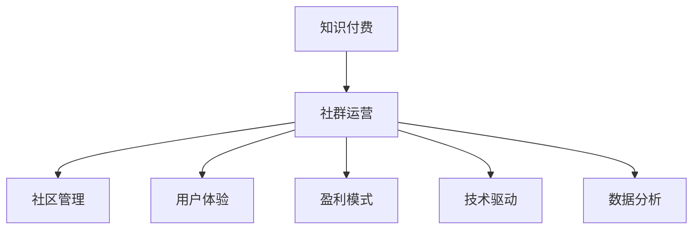

                 

# 知识付费：程序员的社群运营攻略

> 关键词：知识付费, 程序员, 社群运营, 社区管理, 用户体验, 盈利模式, 技术驱动, 数据挖掘

## 1. 背景介绍

### 1.1 问题由来
随着互联网技术的飞速发展，知识付费作为一种新兴的互联网商业模式，逐渐成为主流。越来越多的程序员，开始通过在各类知识付费平台上发布技术文章、录制视频课程、提供在线编程辅导等形式，获得稳定的收入。然而，知识付费不仅仅是内容创作，更是一种社群运营，如何打造优质的社群、维护良好的用户体验、实现可持续的盈利模式，成为了每一位知识付费创作者需要思考的重要问题。

### 1.2 问题核心关键点
知识付费社群运营的关键点在于：
1. **内容质量与用户体验**：优质的内容吸引用户，良好的用户体验留存用户。
2. **社群管理与互动**：高效的管理机制和积极的互动能够提高用户参与度和满意度。
3. **盈利模式与商业化**：明确的盈利策略和合理的商业化手段，确保创作者的经济回报。
4. **技术驱动与数据分析**：利用技术手段和大数据分析优化社群运营，提升运营效率。

## 2. 核心概念与联系

### 2.1 核心概念概述

为更好地理解知识付费社群运营的策略，本节将介绍几个核心概念：

- **知识付费**：通过互联网平台，用户为获取知识内容而支付费用的商业模式。程序员通过提供有价值的编程知识和技术经验，获得用户付费，实现知识变现。
- **社群运营**：构建和维护一个稳定、活跃、可持续发展的社区，通过提供服务、解答问题、组织活动等方式，促进用户之间的互动和交流。
- **社区管理**：制定规则、监督执行、处理投诉，确保社区健康有序的运行。
- **用户体验**：确保用户在使用产品过程中有良好的感受和满足感，提升用户满意度和忠诚度。
- **盈利模式**：如何通过付费会员、广告、赞助等方式实现收入增长，保障知识付费平台的可持续发展。
- **技术驱动**：利用互联网技术手段，如大数据分析、智能推荐、人工智能等，优化社区运营，提升运营效率。
- **数据分析**：通过收集、分析和利用用户行为数据，优化内容和社群运营策略，提高运营效果。

这些核心概念之间的逻辑关系可以通过以下Mermaid流程图来展示：



这个流程图展示了的核心概念及其之间的关系：

1. 知识付费通过社群运营、社区管理、用户体验、盈利模式、技术驱动、数据分析等手段，不断提升用户满意度和忠诚度。
2. 社群运营的核心在于内容质量与用户体验，通过社区管理和技术驱动手段，提升用户互动和参与度。
3. 盈利模式是知识付费社群运营的最终目标，通过数据分析和用户体验优化，确保持续的收入增长。

## 3. 核心算法原理 & 具体操作步骤
### 3.1 算法原理概述

知识付费社群运营本质上是一个复杂的系统工程，涉及内容运营、用户互动、社区管理等多个方面。其核心算法原理可以概括为以下几点：

1. **内容推荐算法**：利用协同过滤、内容排序、用户画像等技术手段，提升用户的内容发现效率，增加用户粘性。
2. **用户行为分析**：通过数据挖掘和机器学习技术，分析用户行为数据，了解用户需求和偏好，优化内容和运营策略。
3. **社群管理机制**：制定和执行社区规则，处理用户投诉和争议，维护社区秩序和活跃度。
4. **用户体验优化**：通过UI/UX设计、个性化推荐、实时反馈等手段，提升用户的使用体验，增加用户满意度和忠诚度。
5. **盈利模式设计**：通过订阅制、付费会员、广告、赞助等多元化盈利方式，确保知识付费平台的经济收益。

### 3.2 算法步骤详解

以下是知识付费社群运营的具体操作步骤：

**Step 1: 确定定位与目标用户群**
- 明确知识付费平台的主要目标用户，如初级开发者、中高级开发者、架构师等。
- 根据目标用户的特性和需求，制定相应的内容和运营策略。

**Step 2: 构建优质内容库**
- 收集高质量的编程技术文章、代码示例、视频教程等内容，确保内容对用户有实际价值。
- 邀请业内专家和资深程序员作为内容创作者，提升内容的专业性和权威性。
- 对内容进行分类、标签化处理，便于用户查找和推荐。

**Step 3: 设计互动机制**
- 引入评论、点赞、分享等功能，鼓励用户互动和交流。
- 设置问答环节，让用户能够直接向专家提问，增加社群互动。
- 定期组织线上线下活动，如编程马拉松、技术沙龙等，增强用户粘性。

**Step 4: 实施社区管理**
- 制定和执行社区规则，确保内容的健康和安全。
- 及时处理用户投诉和争议，维护社区秩序。
- 通过Karma系统等激励机制，鼓励积极的用户行为。

**Step 5: 优化用户体验**
- 优化用户界面，提升内容浏览和使用的便捷性。
- 利用个性化推荐技术，根据用户兴趣推荐相关内容。
- 提供实时反馈机制，及时响应用户需求和问题。

**Step 6: 设计盈利模式**
- 通过订阅制、付费会员等方式，获取稳定的收入来源。
- 引入广告和赞助，增加平台的流量和收入。
- 探索新的盈利方式，如众筹、打赏等，多样化收入渠道。

**Step 7: 持续优化与迭代**
- 根据用户反馈和数据分析，不断优化内容和运营策略。
- 引入新技术和工具，提升运营效率和效果。
- 定期总结和评估运营效果，不断调整和优化。

### 3.3 算法优缺点

知识付费社群运营方法具有以下优点：
1. 内容丰富多样，满足不同用户需求。
2. 用户互动性强，增强社区粘性。
3. 盈利模式多元化，确保平台可持续发展。
4. 利用技术手段，提升运营效率。

同时，该方法也存在一定的局限性：
1. 对内容创作者的要求较高，需要持续输出高质量内容。
2. 对技术手段的依赖较大，需要不断引入新技术和工具。
3. 用户获取成本较高，需要通过持续营销推广吸引用户。
4. 对用户粘性和参与度要求较高，需要不断优化运营策略。

尽管存在这些局限性，但就目前而言，知识付费社群运营方法仍是大多数知识付费平台采用的主流范式。未来相关研究的重点在于如何进一步优化内容质量、提升用户互动、探索新盈利模式等，以提高平台的整体效果和竞争力。

### 3.4 算法应用领域

知识付费社群运营方法在多个领域得到了广泛应用，例如：

- 编程学习平台：如CSDN、Stack Overflow等，通过发布高质量的编程教程和技术文章，吸引编程爱好者订阅和学习。
- 技术培训平台：如Udacity、Coursera等，提供系统的技术培训课程，培养高水平的技术人才。
- 开源社区：如GitHub、Stack Exchange等，通过组织开源项目和技术讨论，吸引开发者贡献代码和知识。
- 技术咨询平台：如Freelancer、Upwork等，提供技术咨询服务，帮助企业解决技术难题。

这些平台通过知识付费和社群运营的结合，不仅实现了内容的商业化，还构建了强大的社区生态，成为技术人才交流和协作的重要平台。

## 4. 数学模型和公式 & 详细讲解 & 举例说明
### 4.1 数学模型构建

知识付费社群运营的数学模型构建，主要基于用户行为数据的分析和内容推荐的优化。以下以协同过滤算法为例，构建一个简单的用户行为分析模型。

设用户集合为 $U=\{u_1,u_2,\dots,u_n\}$，内容集合为 $I=\{i_1,i_2,\dots,i_m\}$，用户与内容之间的互动关系可以用二进制矩阵 $R \in \{0,1\}^{n \times m}$ 表示，其中 $R_{ui}=1$ 表示用户 $u$ 与内容 $i$ 有互动关系，$R_{ui}=0$ 表示无互动关系。

定义用户-内容评分矩阵 $S \in [0,1]^{n \times m}$，其中 $S_{ui}=\frac{1}{1+e^{-R_{ui}}}$ 表示用户 $u$ 对内容 $i$ 的评分，利用sigmoid函数将二进制互动关系转化为0-1之间的评分。

知识付费社群运营的目标是最大化用户对内容的满意度，即最大化用户-内容评分矩阵 $S$ 中的元素值。协同过滤算法通过利用用户之间的相似性，对评分矩阵进行优化，提升用户-内容的相关度。

### 4.2 公式推导过程

协同过滤算法的核心思想是利用用户之间的相似性，对评分矩阵进行矩阵分解，从而优化评分。设用户 $u$ 和内容 $i$ 的潜在特征向量为 $p_u$ 和 $q_i$，则评分矩阵 $S$ 可以表示为：

$$
S = Upq^T
$$

其中 $U$ 为用户特征矩阵，$q$ 为内容特征矩阵，$Upq^T$ 为用户-内容评分矩阵 $S$。

协同过滤算法的目标是最小化评分误差，即：

$$
\min_{U,q} \sum_{(u,i)} (S_{ui} - p_u^Tq_i)^2
$$

利用梯度下降算法，对 $U$ 和 $q$ 进行优化，得到用户特征矩阵和内容特征矩阵的更新公式：

$$
\begin{align*}
\Delta U_{ui} &= \eta \cdot (\frac{1}{p_u^Tq_i} - S_{ui})p_uq_i^T \\
\Delta q_{iu} &= \eta \cdot (\frac{1}{p_u^Tq_i} - S_{ui})p_u^Tq_i
\end{align*}
$$

其中 $\eta$ 为学习率，用于控制每次更新的步长。

通过不断迭代优化 $U$ 和 $q$，协同过滤算法能够逐步提升评分矩阵的准确性，实现个性化推荐，提升用户满意度。

### 4.3 案例分析与讲解

以CSDN知识付费平台为例，进行具体分析。

CSDN是国内知名的编程学习社区，通过知识付费模式，吸引了大量的程序员用户。CSDN的知识付费运营，主要基于以下几大步骤：

**Step 1: 内容构建**
- CSDN通过邀请业内专家和资深程序员，发布高质量的编程教程和技术文章。
- 内容经过分类和标签化处理，便于用户查找和推荐。

**Step 2: 互动机制设计**
- 引入评论、点赞、分享等功能，鼓励用户互动和交流。
- 设置问答环节，让用户能够直接向专家提问，增加社群互动。

**Step 3: 社区管理**
- 制定和执行社区规则，确保内容的健康和安全。
- 及时处理用户投诉和争议，维护社区秩序。

**Step 4: 用户体验优化**
- 优化用户界面，提升内容浏览和使用的便捷性。
- 利用个性化推荐技术，根据用户兴趣推荐相关内容。

**Step 5: 盈利模式设计**
- 通过订阅制、付费会员等方式，获取稳定的收入来源。
- 引入广告和赞助，增加平台的流量和收入。

通过以上步骤，CSDN构建了一个稳定、活跃的知识付费社群，实现了知识内容的商业化，同时也为程序员提供了高效的学习和交流平台。

## 5. 项目实践：代码实例和详细解释说明
### 5.1 开发环境搭建

在进行知识付费社群运营开发前，我们需要准备好开发环境。以下是使用Python进行Flask开发的环境配置流程：

1. 安装Anaconda：从官网下载并安装Anaconda，用于创建独立的Python环境。

2. 创建并激活虚拟环境：
```bash
conda create -n flask-env python=3.8 
conda activate flask-env
```

3. 安装Flask：
```bash
pip install flask
```

4. 安装Flask-RESTful：
```bash
pip install flask-restful
```

5. 安装Flask-SQLAlchemy：
```bash
pip install flask-sqlalchemy
```

6. 安装Flask-WTF：
```bash
pip install flask-wtf
```

完成上述步骤后，即可在`flask-env`环境中开始知识付费社群运营开发。

### 5.2 源代码详细实现

下面是知识付费社群运营的一个简单实现，包括用户注册、内容发布、互动和推荐功能。

**用户注册**

```python
from flask import Flask, render_template, request, redirect, url_for
from flask_sqlalchemy import SQLAlchemy

app = Flask(__name__)
app.config['SQLALCHEMY_DATABASE_URI'] = 'sqlite:///users.db'
app.config['SQLALCHEMY_TRACK_MODIFICATIONS'] = False
db = SQLAlchemy(app)

class User(db.Model):
    id = db.Column(db.Integer, primary_key=True)
    name = db.Column(db.String(50), unique=True)
    email = db.Column(db.String(120), unique=True)

@app.route('/register', methods=['GET', 'POST'])
def register():
    if request.method == 'POST':
        name = request.form['name']
        email = request.form['email']
        user = User(name=name, email=email)
        db.session.add(user)
        db.session.commit()
        return redirect(url_for('home'))
    return render_template('register.html')
```

**内容发布**

```python
class Content(db.Model):
    id = db.Column(db.Integer, primary_key=True)
    title = db.Column(db.String(200))
    content = db.Column(db.Text)
    user_id = db.Column(db.Integer, db.ForeignKey('user.id'))

@app.route('/post', methods=['GET', 'POST'])
def post():
    user = User.query.first()
    if request.method == 'POST':
        title = request.form['title']
        content = request.form['content']
        content = Content(title=title, content=content, user_id=user.id)
        db.session.add(content)
        db.session.commit()
        return redirect(url_for('home'))
    return render_template('post.html', user=user)
```

**用户互动**

```python
class Comment(db.Model):
    id = db.Column(db.Integer, primary_key=True)
    content = db.Column(db.Text)
    user_id = db.Column(db.Integer, db.ForeignKey('user.id'))
    content_id = db.Column(db.Integer, db.ForeignKey('content.id'))

@app.route('/comment', methods=['POST'])
def comment():
    user = User.query.first()
    content = Content.query.first()
    comment = Comment(content=comment, user_id=user.id, content_id=content.id)
    db.session.add(comment)
    db.session.commit()
    return redirect(url_for('content', content_id=content.id))
```

**内容推荐**

```python
@app.route('/content/<int:content_id>')
def content(content_id):
    content = Content.query.get(content_id)
    comments = Comment.query.filter_by(content_id=content_id).all()
    return render_template('content.html', content=content, comments=comments)
```

### 5.3 代码解读与分析

让我们再详细解读一下关键代码的实现细节：

**User模型**

- `User` 类定义了用户的基本信息，包括用户名和邮箱。
- 在 `/register` 路由中，获取用户提交的表单数据，创建新用户并添加到数据库中。

**Content模型**

- `Content` 类定义了内容的基本信息，包括标题和内容，同时与用户表建立外键关系。
- 在 `/post` 路由中，获取用户提交的表单数据，创建新内容并添加到数据库中。

**Comment模型**

- `Comment` 类定义了评论的基本信息，包括评论内容和与用户表、内容表建立外键关系。
- 在 `/comment` 路由中，获取用户提交的评论内容，创建新评论并添加到数据库中。

**内容推荐**

- `/content/<content_id>` 路由中，根据内容ID获取具体内容，以及与之相关的评论信息，返回给前端进行渲染。

以上是知识付费社群运营的一个基本实现，包括了用户注册、内容发布、用户互动和内容推荐等功能。在实际开发中，还需要加入更多的安全和优化措施，如防止SQL注入、避免内容重复、优化数据库性能等，以确保应用的稳定性和可靠性。

## 6. 实际应用场景
### 6.1 智能客服系统

知识付费社群运营在智能客服系统的构建中也有广泛的应用。传统客服系统往往需要配备大量人力，高峰期响应缓慢，且一致性和专业性难以保证。通过知识付费模式，可以构建一个包含大量高质量客服内容的知识库，吸引程序员用户参与客服解答，利用问答机制提供7x24小时不间断服务，提升客服效率和用户体验。

在技术实现上，可以构建一个基于知识付费的智能客服平台，提供在线客服聊天、FAQ自动回复、智能推荐等应用，通过问答机制吸引程序员用户参与客服解答，利用协同过滤算法等技术手段提升智能客服的响应速度和准确性，提升用户体验和满意度。

### 6.2 金融舆情监测

金融领域需要实时监测市场舆论动向，以便及时应对负面信息传播，规避金融风险。传统的人工监测方式成本高、效率低，难以应对网络时代海量信息爆发的挑战。通过知识付费模式，可以构建一个包含金融领域专业知识的问答社区，吸引金融专家和分析师参与，利用问答机制实时监测舆情变化，提高监测效率和准确性。

在技术实现上，可以构建一个基于知识付费的金融舆情监测平台，提供实时舆情分析和智能推荐，利用自然语言处理技术对金融文本进行分析和处理，提取关键信息，结合机器学习和数据挖掘技术，实现舆情的自动化监测和分析，提升金融舆情监测的效率和效果。

### 6.3 个性化推荐系统

当前的推荐系统往往只依赖用户的历史行为数据进行物品推荐，无法深入理解用户的真实兴趣偏好。通过知识付费模式，可以构建一个包含高质量编程技术文章和代码示例的知识社区，吸引程序员用户参与内容创作和互动，利用协同过滤算法等技术手段，提升推荐系统的准确性和个性化程度。

在技术实现上，可以构建一个基于知识付费的个性化推荐平台，提供高质量的编程技术文章和代码示例，利用协同过滤算法等技术手段，根据用户的行为数据和兴趣偏好，推荐相关内容，提升用户体验和满意度。

### 6.4 未来应用展望

随着知识付费模式和大数据技术的不断发展，未来的知识付费社群运营将呈现以下几个发展趋势：

1. **内容多样化**：知识付费平台将涵盖更多的垂直领域，如医学、法律、金融等，构建更丰富的知识库。
2. **用户互动增强**：通过智能问答、社区讨论等方式，增强用户之间的互动和交流，提升社群活跃度。
3. **人工智能的应用**：利用自然语言处理、机器学习等技术手段，提升知识付费平台的运营效率和效果。
4. **多渠道融合**：通过App、PC端、移动端等多渠道融合，实现全渠道的用户覆盖和互动。
5. **国际化和本地化**：利用本地化内容和国际化推广，拓展全球用户市场，提升平台的国际影响力。

这些趋势展示了知识付费社群运营的广阔前景，相信随着技术的不断进步，知识付费模式将为各行各业带来新的变革和机遇。

## 7. 工具和资源推荐
### 7.1 学习资源推荐

为了帮助开发者系统掌握知识付费社群运营的理论基础和实践技巧，这里推荐一些优质的学习资源：

1. **《知识付费运营秘籍》系列博文**：由知识付费专家撰写，深入浅出地介绍了知识付费运营的理论基础、用户行为分析、内容运营策略等。
2. **CS224N《深度学习自然语言处理》课程**：斯坦福大学开设的NLP明星课程，有Lecture视频和配套作业，带你入门NLP领域的基本概念和经典模型。
3. **《知识付费运营实战手册》书籍**：详细介绍了知识付费运营的各个环节，包括用户获取、内容生产、社群管理等，是知识付费从业者的必备工具书。
4. **《知识付费平台构建指南》白皮书**：介绍知识付费平台的搭建流程和技术实现细节，是平台开发者的重要参考。
5. **Coursera知识付费平台公开课**：学习知识付费平台的搭建和运营，了解如何通过知识付费模式实现商业化。

通过对这些资源的学习实践，相信你一定能够快速掌握知识付费社群运营的精髓，并用于解决实际的NLP问题。

### 7.2 开发工具推荐

高效的开发离不开优秀的工具支持。以下是几款用于知识付费社群运营开发的常用工具：

1. **Flask**：基于Python的轻量级Web框架，易于上手，适合快速迭代研究。
2. **SQLAlchemy**：Python的ORM库，支持多数据库操作，方便数据管理和查询。
3. **WTForms**：Python的表单库，支持多类型表单验证，提升表单处理的安全性和便捷性。
4. **Flask-WTF**：基于WTForms的表单扩展，支持CSRF防护、重载表单等特性，提高表单处理的稳定性和用户体验。
5. **Flask-SocketIO**：基于WebSocket的实时通信库，支持多人在线聊天、实时通知等功能。

合理利用这些工具，可以显著提升知识付费社群运营的开发效率，加快创新迭代的步伐。

### 7.3 相关论文推荐

知识付费社群运营的研究源于学界的持续研究。以下是几篇奠基性的相关论文，推荐阅读：

1. **《知识付费平台的用户行为分析与运营策略》**：分析知识付费平台的用户行为数据，提出针对性的运营策略。
2. **《基于协同过滤的知识推荐算法》**：利用协同过滤算法实现个性化推荐，提升用户体验和满意度。
3. **《知识付费社群的社区管理与互动机制设计》**：介绍知识付费社群的管理机制和互动机制，提升社群活跃度和用户粘性。
4. **《知识付费平台的盈利模式设计与运营效果评估》**：探索知识付费平台的盈利模式，评估运营效果，优化运营策略。
5. **《基于大数据分析的知识付费平台运营优化》**：利用大数据分析技术，优化知识付费平台的运营效果，提升运营效率。

这些论文代表了大语言模型微调技术的发展脉络。通过学习这些前沿成果，可以帮助研究者把握学科前进方向，激发更多的创新灵感。

## 8. 总结：未来发展趋势与挑战
### 8.1 总结

本文对知识付费社群运营的策略进行了全面系统的介绍。首先阐述了知识付费社群运营的背景和核心关键点，明确了内容质量与用户体验、社群管理与互动、盈利模式与商业化、技术驱动与数据分析等运营策略的重要性。其次，从原理到实践，详细讲解了知识付费社群运营的数学模型和操作步骤，给出了知识付费社群运营的一个完整代码实例。同时，本文还广泛探讨了知识付费社群运营在智能客服、金融舆情监测、个性化推荐等实际应用场景中的具体应用，展示了知识付费社群运营的广泛应用前景。

通过本文的系统梳理，可以看到，知识付费社群运营已经成为了程序员社区中不可或缺的一部分，极大地提升了程序员之间的互动和交流，促进了技术知识的传播和应用。未来，随着知识付费模式和大数据技术的不断发展，知识付费社群运营将迎来更多的机遇和挑战，相信会有更多的创新和发展。

### 8.2 未来发展趋势

展望未来，知识付费社群运营将呈现以下几个发展趋势：

1. **内容质量提升**：通过引入更多专家和高质量内容创作者，提升知识库的专业性和权威性。
2. **技术手段丰富**：利用自然语言处理、机器学习等技术手段，提升知识付费平台的运营效率和效果。
3. **用户互动增强**：通过智能问答、社区讨论等方式，增强用户之间的互动和交流，提升社群活跃度。
4. **多渠道融合**：通过App、PC端、移动端等多渠道融合，实现全渠道的用户覆盖和互动。
5. **国际化和本地化**：利用本地化内容和国际化推广，拓展全球用户市场，提升平台的国际影响力。

这些趋势展示了知识付费社群运营的广阔前景，相信随着技术的不断进步，知识付费模式将为各行各业带来新的变革和机遇。

### 8.3 面临的挑战

尽管知识付费社群运营已经取得了一定的成效，但在迈向更加智能化、普适化应用的过程中，它仍面临着诸多挑战：

1. **内容创作者依赖**：高质量内容创作者的数量和质量直接影响知识付费平台的用户体验和粘性。如何吸引更多高质量创作者参与，是知识付费平台需要解决的问题。
2. **用户获取成本高**：知识付费模式依赖于高质量内容，对内容创作者的要求较高，需要持续输出高质量内容，同时获取高质量用户也需要大量的营销推广。
3. **盈利模式单一**：当前的知识付费平台主要依靠订阅制和付费会员等盈利模式，如何探索多元化盈利模式，增加收入来源，是知识付费平台的重要课题。
4. **用户体验和满意度**：用户在使用知识付费平台时，可能会遇到内容更新不及时、界面体验差等问题，影响用户体验和满意度。如何提升用户体验和满意度，是知识付费平台需要不断优化的地方。
5. **技术手段限制**：当前的知识付费平台主要依赖于协同过滤算法等技术手段，如何引入更多先进的技术手段，如自然语言处理、机器学习等，提升平台的智能化和自动化程度，是知识付费平台需要不断探索的方向。

这些挑战都需要知识付费平台在内容创作者、用户获取、盈利模式、用户体验和技术手段等方面进行全面优化，才能更好地实现商业化运营。

### 8.4 研究展望

面向未来，知识付费社群运营需要在以下几个方面寻求新的突破：

1. **内容创作激励机制**：通过引入内容创作者激励机制，如Karma系统、打赏机制等，提升内容创作者的动力和积极性。
2. **多元化盈利模式**：探索更多盈利模式，如众筹、广告、赞助等，增加收入来源，提高平台的可持续发展能力。
3. **智能化推荐系统**：引入更多先进技术手段，如自然语言处理、机器学习等，提升个性化推荐系统的准确性和效果。
4. **社区互动机制优化**：设计更加高效和有趣的社区互动机制，提升用户参与度和满意度。
5. **国际化拓展**：利用本地化内容和国际化推广，拓展全球用户市场，提升平台的国际影响力。

这些研究方向的探索，必将引领知识付费社群运营技术迈向更高的台阶，为构建安全、可靠、可解释、可控的智能系统铺平道路。面向未来，知识付费社群运营还需要与其他人工智能技术进行更深入的融合，如知识表示、因果推理、强化学习等，多路径协同发力，共同推动知识付费技术的进步。

## 9. 附录：常见问题与解答

**Q1：知识付费社群运营是否适用于所有知识付费平台？**

A: 知识付费社群运营方法适用于大多数知识付费平台，尤其是以内容驱动的平台。但对于以商品或服务驱动的平台，需要结合具体的商业模式进行优化和调整。

**Q2：如何衡量知识付费社群运营的效果？**

A: 知识付费社群运营的效果可以通过以下指标来衡量：

1. **用户增长率**：平台用户的数量和增长趋势。
2. **内容质量**：平台内容的数量、质量和更新频率。
3. **用户参与度**：用户的互动频率、评论数量和内容质量。
4. **用户满意度**：用户的评价和反馈，通过问卷调查、用户体验调研等方式获取。
5. **收入和盈利能力**：平台的收入来源和盈利能力，包括订阅费、广告收入、打赏收入等。

通过综合这些指标，可以全面评估知识付费社群运营的效果，并及时进行调整和优化。

**Q3：如何提高知识付费社群运营的用户粘性？**

A: 提高知识付费社群运营的用户粘性，可以从以下几个方面入手：

1. **高质量内容**：提供高质量、实用的内容，满足用户需求。
2. **互动机制**：设计互动机制，鼓励用户参与讨论和交流，增强用户粘性。
3. **社区氛围**：构建良好的社区氛围，提升用户的归属感和认同感。
4. **用户体验**：优化用户体验，提升界面的简洁性和操作的便捷性。
5. **个性化推荐**：利用个性化推荐技术，根据用户兴趣推荐相关内容，增加用户粘性。

通过以上措施，可以显著提高知识付费社群运营的用户粘性，增加用户的长期留存。

**Q4：知识付费社群运营如何实现盈利？**

A: 知识付费社群运营的盈利主要通过以下几个方面实现：

1. **订阅制和付费会员**：通过提供高质量内容和优质服务，吸引用户订阅和付费。
2. **广告和赞助**：利用平台的流量和影响力，吸引广告主和赞助商进行合作。
3. **知识付费课程和培训**：提供系统的知识付费课程和培训，帮助用户提升技能。
4. **打赏和众筹**：鼓励用户通过打赏和众筹等方式，支持平台和创作者。
5. **增值服务和产品**：提供增值服务和产品，如技术咨询、在线编程服务等。

通过多元化盈利模式，可以实现知识付费平台的可持续发展。

**Q5：知识付费社群运营面临的主要技术挑战是什么？**

A: 知识付费社群运营面临的主要技术挑战包括：

1. **数据隐私和安全**：如何保障用户数据隐私和安全，防止数据泄露和滥用。
2. **推荐系统准确性**：如何提升推荐系统的准确性和个性化程度，满足用户需求。
3. **内容版权问题**：如何避免内容版权纠纷，确保内容的合法性和原创性。
4. **用户行为分析**：如何通过数据分析，了解用户需求和行为，优化运营策略。
5. **技术基础设施**：如何构建高效、稳定、可靠的技术基础设施，保障平台的稳定运行。

这些技术挑战需要知识付费平台不断优化和升级技术手段，才能提升平台的整体效果和用户体验。

**Q6：知识付费社群运营如何拓展全球用户市场？**

A: 知识付费社群运营拓展全球用户市场，可以从以下几个方面入手：

1. **本地化内容**：根据不同国家和地区的语言和文化习惯，提供本地化的内容和服务。
2. **国际化推广**：通过多语言支持、社交媒体推广等方式，提升平台的国际知名度和影响力。
3. **跨文化互动**：鼓励跨文化交流和互动，提升用户的国际视野和文化认同感。
4. **全球化技术支持**：提供全球化的技术支持和服务，保障平台的稳定运行和用户体验。

通过以上措施，可以拓展知识付费社群运营的全球用户市场，提升平台的国际竞争力和影响力。

---

作者：禅与计算机程序设计艺术 / Zen and the Art of Computer Programming

