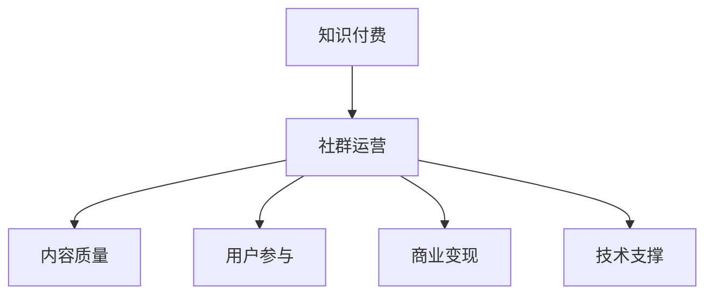

                 

## 1. 背景介绍

### 1.1 问题由来
近年来，知识付费平台在教育、职场、技术等众多领域迅速兴起。随之而来的是大量的知识创作者和内容消费者，为知识付费市场注入了源源不断的动力。尤其是编程社区，如CSDN、Stack Overflow、Github等，成为了程序员学习交流的重要平台。

然而，当前的编程社区尽管聚集了大量优秀的技术人才，但仍存在诸多问题。例如，内容质量参差不齐，交流氛围不够活跃，知识共享效果不理想。这不仅影响了社区的长期发展，也限制了程序员的学习进步。

为了改善这种现状，许多社区和平台开始引入知识付费机制，将优质内容进行筛选、包装、售卖，形成良性互动，提升社区的价值。但知识付费机制的引入，又需要程序员社群具备相应的运营能力，才能将付费用户转化为忠实贡献者，并形成健康的生态。

本文旨在总结和探讨程序员社群运营的策略和技巧，帮助社区和平台构建有效的知识付费模式，提升社区质量，促进程序员的共同成长。

### 1.2 问题核心关键点
知识付费运营的核心在于如何构建健康的社区生态，并实现商业化可持续。具体包括：
1. 构建高质量的内容供应体系，提升内容质量和创新性。
2. 设计有效的用户参与机制，形成稳定的社区交流氛围。
3. 探索多样的商业变现模式，提升平台盈利能力。
4. 利用技术手段优化社区运营，提高运营效率。

通过回答这些关键问题，本文将深入探讨程序员社群运营的策略和技巧，提出切实可行的解决方案，助力知识付费模式的成功落地。

## 2. 核心概念与联系

### 2.1 核心概念概述

为更好地理解程序员社群运营的策略和技巧，本节将介绍几个密切相关的核心概念：

- **知识付费(Knowledge Pricing)**：通过筛选、包装、售卖优质内容，实现商业化可持续。知识付费能够提升内容质量，增加用户粘性，进而带来商业价值。

- **社群运营(Community Operations)**：指通过策划、执行、管理等方式，打造一个健康、活跃、可持续发展的社群。社群运营是知识付费模式的重要支撑，好的运营策略能提升平台的用户参与度和忠诚度。

- **内容质量(Content Quality)**：知识付费的核心在于内容，高质量的内容是吸引用户、提升用户满意度的关键。内容质量包括但不限于文章深度、新颖性、实用性、互动性等。

- **用户参与(User Engagement)**：社群运营的重要目标是提升用户参与度。用户参与度高的社区，交流氛围更活跃，内容质量更有保障，最终能实现平台的良性循环。

- **商业变现(Commercial Monetization)**：知识付费模式的最终目标是通过售卖优质内容实现盈利。探索多种商业变现模式，如内容订阅、付费问答、技术培训、广告收入等，是平台可持续发展的关键。

- **技术支撑(Technical Support)**：知识付费的落地实施离不开技术支持。技术手段能够提升运营效率，优化用户体验，确保平台稳定运行。

这些核心概念之间的逻辑关系可以通过以下Mermaid流程图来展示：



这个流程图展示了几者之间的内在联系：知识付费是目标，社群运营是手段，内容质量和用户参与是核心，商业变现和技术支撑是保障。

## 3. 核心算法原理 & 具体操作步骤
### 3.1 算法原理概述

知识付费和程序员社群运营的策略与方法，本质上是一种多目标优化问题。其核心在于平衡内容质量、用户参与度、商业变现和技术支撑等多方面的因素，形成一个良性互动的生态系统。

形式化地，假设一个知识付费平台的目标函数为：

$$
\text{Maximize } f(\text{Content Quality}, \text{User Engagement}, \text{Commercial Monetization}, \text{Technical Support})
$$

其中：
- $\text{Content Quality}$ 为内容质量的指标。
- $\text{User Engagement}$ 为用户参与度的指标。
- $\text{Commercial Monetization}$ 为商业变现的指标。
- $\text{Technical Support}$ 为技术支撑的指标。

### 3.2 算法步骤详解

基于多目标优化问题的知识付费和程序员社群运营，一般包括以下几个关键步骤：

**Step 1: 构建内容供应链**

- 收集并筛选高质量的编程内容，包括技术文章、项目教程、在线课程等。
- 引入内容创作者进行内容创作，提供激励机制，提升创作者活力。
- 组织专家评审，确保内容的质量和实用性。

**Step 2: 设计用户参与机制**

- 设计激励机制，如积分系统、排行榜、荣誉认证等，吸引用户参与。
- 举办编程竞赛、技术讲座、技术交流会等活动，提升用户互动性。
- 引入社区志愿者和管理员，维护社区秩序，处理用户反馈。

**Step 3: 探索商业变现模式**

- 设计内容订阅模式，提供分层定价策略。
- 开展付费问答服务，让用户能够快速解决问题。
- 引入技术培训和在线课程，提升社区商业价值。
- 开展广告业务，通过平台流量和影响力实现收益。

**Step 4: 利用技术手段优化运营**

- 开发知识图谱、推荐系统、问答系统等技术工具，提升内容分发效率和用户体验。
- 使用数据挖掘和大数据分析，监测社区行为，优化运营策略。
- 引入自动化和AI技术，提升内容审核和用户审核的效率。

**Step 5: 持续迭代优化**

- 定期收集用户反馈，调整内容供应链和用户参与机制。
- 分析商业变现数据，优化定价策略和运营模式。
- 利用技术迭代，提升平台性能和稳定性。

以上是知识付费和程序员社群运营的一般流程。在实际应用中，还需要根据社区和平台的特点，对各个环节进行细致的设计和优化。

### 3.3 算法优缺点

知识付费和程序员社群运营的策略与方法，具有以下优点：
1. 提升内容质量。筛选和包装高质量内容，提升用户满意度。
2. 增加用户粘性。通过激励机制和互动活动，提升用户参与度和忠诚度。
3. 实现商业化可持续。多目标优化，确保平台的盈利和可持续发展。
4. 提高运营效率。利用技术手段优化内容分发和用户互动，降低运营成本。

同时，该方法也存在一定的局限性：
1. 内容筛选难度大。高质量内容的筛选标准和数量都具有一定挑战性。
2. 用户激励机制设计复杂。如何设计合理的激励机制，促进用户长期参与，是一个复杂问题。
3. 商业变现模式有限。需要不断探索和创新，才能适应市场需求变化。
4. 技术支撑成本高。技术开发和维护需要较高的成本投入，尤其是在初创阶段。

尽管存在这些局限性，但知识付费和程序员社群运营的策略与方法，仍然是一种被广泛认可的成功模式，帮助众多社区和平台实现了商业化和可持续发展。

### 3.4 算法应用领域

知识付费和程序员社群运营的策略与方法，已在多个社区和平台得到了成功应用，包括：

- CSDN：提供技术文章、在线课程、技术讲座等，通过付费会员模式实现盈利。
- GitHub：引入开源项目、技术问答、技术培训等，通过企业赞助和广告收入实现商业变现。
- Stack Overflow：提供技术问答、技术交流等服务，通过广告和会员订阅实现收入。

除了上述这些经典案例外，知识付费和程序员社群运营的策略与方法，还被广泛应用到更多场景中，如知识共享平台、技术社区、在线教育等，为程序员的共同成长提供了新的路径。

## 4. 数学模型和公式 & 详细讲解  
### 4.1 数学模型构建

本节将使用数学语言对知识付费和程序员社群运营的策略与方法进行更加严格的刻画。

假设一个知识付费平台的目标函数为：

$$
\max_{x_1, x_2, x_3, x_4} \left( \sum_{i=1}^4 w_i f_i(x_i) \right)
$$

其中 $w_i$ 为各指标的权重，$f_i(x_i)$ 为第 $i$ 个指标的函数。

以用户参与度为例，$f_i(x_i)$ 可以表示为：

$$
f_{\text{用户参与度}} = u \cdot P + (1-u) \cdot I
$$

其中 $u$ 为参与度提升的目标值，$P$ 为用户参与率的函数，$I$ 为用户互动率的函数。

### 4.2 公式推导过程

以内容订阅模式为例，推导用户订阅模型的付费策略：

假设平台提供 $n$ 个内容订阅选项，每个选项的价格分别为 $p_i$，订阅人数分别为 $x_i$，总收益为 $R$。则用户订阅模型的目标函数为：

$$
\max_{x_1, x_2, ..., x_n} R = \sum_{i=1}^n p_i x_i
$$

在用户数量有限的情况下，用户订阅模式的目标函数可以转化为：

$$
\max_{x_1, x_2, ..., x_n} R = \sum_{i=1}^n p_i x_i \text{ s.t. } \sum_{i=1}^n x_i = C
$$

其中 $C$ 为平台的订阅用户数量上限。

通过拉格朗日乘子法，可以得到用户订阅模式下的最优订阅人数分配：

$$
x_i = \frac{C p_i}{\sum_{j=1}^n p_j}
$$

即用户根据价格比例合理分配订阅，实现收益最大化。

### 4.3 案例分析与讲解

**案例一：Stack Overflow的订阅模式**

Stack Overflow的订阅模式采用了分层定价策略，提供多个订阅选项，分别满足不同需求的用户。其订阅模型如下所示：

- 基础版：$5美元/月$，包含所有基础功能。
- 专业版：$29美元/月$，提供高级功能，如技术问答优先级、社区订阅等。
- 企业版：$99美元/月$，提供企业级支持和定制化服务。

通过分层定价，Stack Overflow不仅提升了用户体验，还实现了收入的多元化。

**案例二：CSDN的技术文章订阅**

CSDN的技术文章订阅采用了基于阅读量的激励机制，即阅读量越高的文章，订阅价格越低。其订阅模型如下所示：

- 免费文章：阅读量 $< 1000$
- 付费文章：$10元/月$，阅读量 $1000-5000$
- VIP文章：$30元/月$，阅读量 $> 5000$

通过基于阅读量的定价策略，CSDN不仅提升了内容质量，还增加了用户粘性，实现了商业化可持续。

## 5. 项目实践：代码实例和详细解释说明
### 5.1 开发环境搭建

在进行知识付费和程序员社群运营的实践前，我们需要准备好开发环境。以下是使用Python进行Django开发的环境配置流程：

1. 安装Anaconda：从官网下载并安装Anaconda，用于创建独立的Python环境。

2. 创建并激活虚拟环境：
```bash
conda create -n django-env python=3.8 
conda activate django-env
```

3. 安装Django：根据CUDA版本，从官网获取对应的安装命令。例如：
```bash
conda install django
```

4. 安装各类工具包：
```bash
pip install numpy pandas scikit-learn matplotlib tqdm jupyter notebook ipython
```

完成上述步骤后，即可在`django-env`环境中开始知识付费和程序员社群运营的开发。

### 5.2 源代码详细实现

这里我们以Stack Overflow的订阅模式为例，给出使用Django实现用户订阅模型的Python代码实现。

首先，定义用户订阅模型：

```python
from django.db import models
from django.core.validators import MinValueValidator, MaxValueValidator

class Subscription(models.Model):
    user = models.ForeignKey(User, on_delete=models.CASCADE)
    subscription_type = models.CharField(max_length=20)
    start_date = models.DateTimeField()
    end_date = models.DateTimeField()
    price = models.DecimalField(max_digits=10, decimal_places=2)
```

然后，定义订阅模型的管理界面：

```python
from django.contrib import admin

@admin.register(Subscription)
class SubscriptionAdmin(admin.ModelAdmin):
    list_display = ('user', 'subscription_type', 'start_date', 'end_date', 'price')
```

接着，定义订阅模型的注册视图：

```python
from django.shortcuts import render
from django.http import HttpResponse

def subscription_register(request):
    if request.method == 'POST':
        user = request.user
        subscription_type = request.POST.get('subscription_type')
        start_date = request.POST.get('start_date')
        end_date = request.POST.get('end_date')
        price = request.POST.get('price')
        
        # 将订阅信息保存到数据库
        Subscription.objects.create(user=user, subscription_type=subscription_type, start_date=start_date, end_date=end_date, price=price)
        
        return HttpResponse('Subscription registered successfully.')
    else:
        return render(request, 'subscription_register.html')
```

最后，定义订阅模型的展示视图：

```python
def subscription_show(request):
    subscriptions = Subscription.objects.all()
    
    return render(request, 'subscription_show.html', {'subscriptions': subscriptions})
```

完整代码示例如下：

```python
from django.db import models
from django.contrib import admin
from django.shortcuts import render
from django.http import HttpResponse

class Subscription(models.Model):
    user = models.ForeignKey(User, on_delete=models.CASCADE)
    subscription_type = models.CharField(max_length=20)
    start_date = models.DateTimeField()
    end_date = models.DateTimeField()
    price = models.DecimalField(max_digits=10, decimal_places=2)

@admin.register(Subscription)
class SubscriptionAdmin(admin.ModelAdmin):
    list_display = ('user', 'subscription_type', 'start_date', 'end_date', 'price')

def subscription_register(request):
    if request.method == 'POST':
        user = request.user
        subscription_type = request.POST.get('subscription_type')
        start_date = request.POST.get('start_date')
        end_date = request.POST.get('end_date')
        price = request.POST.get('price')
        
        Subscription.objects.create(user=user, subscription_type=subscription_type, start_date=start_date, end_date=end_date, price=price)
        
        return HttpResponse('Subscription registered successfully.')
    else:
        return render(request, 'subscription_register.html')

def subscription_show(request):
    subscriptions = Subscription.objects.all()
    
    return render(request, 'subscription_show.html', {'subscriptions': subscriptions})
```

### 5.3 代码解读与分析

让我们再详细解读一下关键代码的实现细节：

**Subscription类**：
- `user` 字段为与用户表的外键关系。
- `subscription_type` 字段为订阅类型，如基础版、专业版、企业版等。
- `start_date` 和 `end_date` 字段为订阅生效和到期时间。
- `price` 字段为订阅价格。

**SubscriptionAdmin类**：
- 定义了订阅模型的管理界面，展示用户、订阅类型、开始日期、结束日期和价格。

**subscription_register视图**：
- 用户通过表单提交订阅信息。
- 解析请求参数，保存到数据库。

**subscription_show视图**：
- 获取所有订阅信息，展示在界面上。

这个示例展示了如何使用Django实现用户订阅模型的管理和注册，具有较高的可扩展性和灵活性。在实际应用中，可以根据需求扩展更多功能，如价格计算、到期提醒等。

## 6. 实际应用场景
### 6.1 智能问答系统

智能问答系统是知识付费和程序员社群运营的重要应用场景之一。通过问答系统的技术支撑，用户能够快速获得解决问题的答案，提高学习效率和社区互动性。

在技术实现上，可以引入知识图谱和推荐系统，对用户提出的问题进行语义分析和智能匹配，引导用户参考优质回答。同时，利用数据分析和用户反馈，不断优化问答系统的精准度和用户满意度。

### 6.2 编程竞赛

编程竞赛是程序员社群运营的另一个重要应用场景。通过举办编程竞赛，能够激发用户的创新精神，提升编程能力，同时吸引更多优秀人才加入社区。

在技术实现上，可以设计合理的竞赛规则，引入算法和数据驱动的评比机制，确保竞赛的公正性和公平性。同时，利用实时数据分析和用户反馈，优化竞赛流程，提升用户体验。

### 6.3 技术培训和课程

技术培训和课程是知识付费和程序员社群运营的核心业务之一。通过提供高质量的培训和课程，能够帮助用户掌握新技术、提升专业能力，同时实现商业变现。

在技术实现上，可以引入在线课程和视频讲座，提供丰富的学习材料。同时，利用AI技术进行个性化推荐，提升课程的覆盖面和用户参与度。

### 6.4 未来应用展望

随着知识付费和程序员社群运营的深入发展，其应用场景和价值将进一步拓展。未来，知识付费平台将更加注重用户参与度、内容质量和技术支撑，通过多渠道、多模式的融合，实现商业化可持续。

在智慧城市、教育培训、企业培训等更多领域，知识付费和程序员社群运营将发挥更大的作用。通过引入AI和知识图谱技术，构建更加智能、高效的社区生态，为人类社会的进步提供新的动力。

## 7. 工具和资源推荐
### 7.1 学习资源推荐

为了帮助开发者系统掌握知识付费和程序员社群运营的理论基础和实践技巧，这里推荐一些优质的学习资源：

1. Django官方文档：提供了Django框架的详细教程和API文档，适合初学者快速上手。

2. Django实战：由知名Django开发者撰写，通过多个实际项目，展示Django的灵活性和实用性。

3. Python Web开发实战：结合Django、Flask等框架，介绍Web开发的多种模式和技巧，适合进阶学习。

4. Python Web框架实战：介绍了多种Web框架的特性和应用场景，适合多框架对比学习和实战练习。

5. Django及其扩展：提供了大量Django插件和扩展的详细教程，适合深入挖掘Django的潜力。

通过对这些资源的学习实践，相信你一定能够快速掌握知识付费和程序员社群运营的核心技术，并用于解决实际的社区运营问题。

### 7.2 开发工具推荐

高效的开发离不开优秀的工具支持。以下是几款用于知识付费和程序员社群运营开发的常用工具：

1. Django：Python的Web框架，灵活性和扩展性高，适合构建复杂的社区应用。

2. Flask：轻量级的Web框架，易于上手，适合快速搭建社区应用。

3. GitLab：开源代码托管平台，适合社区和平台的管理和版本控制。

4. GitHub：全球最大的代码托管平台，适合项目和社区的协作开发和版本管理。

5. Jenkins：自动化持续集成和部署工具，适合社区和平台的CI/CD流程管理。

6. Kubernetes：容器编排工具，适合社区和平台的高效部署和扩展。

合理利用这些工具，可以显著提升知识付费和程序员社群运营的开发效率，加快创新迭代的步伐。

### 7.3 相关论文推荐

知识付费和程序员社群运营的研究源于学界的持续研究。以下是几篇奠基性的相关论文，推荐阅读：

1. Web 2.0: A Platform for Global Knowledge Sharing：探讨了Web 2.0技术在知识共享平台中的应用。

2. Social Media and Public Opinion：分析了社交媒体对公共舆论的影响，为社区管理和用户互动提供了新的思路。

3. Online Learning Platforms for Programming Education：介绍了在线编程教育平台的设计和实现，为技术培训提供了新的模式。

4. Knowledge-Driven Decision Support Systems for Software Engineers：研究了知识驱动的决策支持系统在软件开发中的应用，为编程竞赛提供了新的机制。

这些论文代表了大规模知识付费和程序员社群运营的发展脉络。通过学习这些前沿成果，可以帮助研究者把握学科前进方向，激发更多的创新灵感。

## 8. 总结：未来发展趋势与挑战
### 8.1 总结

本文对知识付费和程序员社群运营的策略与方法进行了全面系统的介绍。首先阐述了知识付费和程序员社群运营的研究背景和意义，明确了社区和平台运营的目标和手段。其次，从原理到实践，详细讲解了知识付费和程序员社群运营的数学模型和算法步骤，给出了代码实现和详细解释。同时，本文还广泛探讨了知识付费和程序员社群运营在智能问答、编程竞赛、技术培训等场景中的应用，展示了其广阔前景。此外，本文精选了知识付费和程序员社群运营的学习资源和工具，力求为读者提供全方位的技术指引。

通过本文的系统梳理，可以看到，知识付费和程序员社群运营的策略与方法在大规模编程社区中的应用已经取得了显著成效。未来，伴随知识付费模式的不断创新和优化，知识付费和程序员社群运营必将成为NLP技术落地应用的重要范式，推动知识共享和程序员的共同成长。

### 8.2 未来发展趋势

展望未来，知识付费和程序员社群运营将呈现以下几个发展趋势：

1. 内容质量提升。通过筛选、包装、售卖高质量内容，提升用户满意度和平台价值。
2. 用户参与度增强。通过激励机制和互动活动，构建健康、活跃的社区生态。
3. 商业变现模式多样化。探索多样化的商业变现模式，提升平台盈利能力。
4. 技术手段优化。利用技术手段提升运营效率，优化用户体验。
5. 多渠道融合。在教育、培训、咨询等多个渠道融合知识付费模式，提升社区价值。
6. 全球化布局。通过国际化扩展，吸引全球人才，提升社区影响力。

以上趋势凸显了知识付费和程序员社群运营的广阔前景。这些方向的探索发展，必将进一步提升社区质量，促进程序员的共同成长。

### 8.3 面临的挑战

尽管知识付费和程序员社群运营已经取得了一定成就，但在迈向更加智能化、普适化应用的过程中，仍面临诸多挑战：

1. 内容筛选难度大。高质量内容的筛选标准和数量都具有一定挑战性。
2. 用户激励机制设计复杂。如何设计合理的激励机制，促进用户长期参与，是一个复杂问题。
3. 商业变现模式有限。需要不断探索和创新，才能适应市场需求变化。
4. 技术支撑成本高。技术开发和维护需要较高的成本投入，尤其是在初创阶段。
5. 用户粘性不足。如何提升用户粘性，构建长期稳定的社区生态，仍需不断探索。

尽管存在这些挑战，但知识付费和程序员社群运营的策略与方法，仍然是一种被广泛认可的成功模式，帮助众多社区和平台实现了商业化和可持续发展。

### 8.4 研究展望

面对知识付费和程序员社群运营所面临的种种挑战，未来的研究需要在以下几个方面寻求新的突破：

1. 探索无监督和半监督学习模式。摆脱对大规模标注数据的依赖，利用自监督学习、主动学习等无监督和半监督范式，最大限度利用非结构化数据，实现更加灵活高效的运营。

2. 研究多目标优化算法。设计更加高效的多目标优化算法，平衡内容质量、用户参与度和商业变现，提升运营效果。

3. 引入知识图谱和推荐系统。通过知识图谱和推荐系统，提升内容分发和用户匹配的精准度，提升用户参与度。

4. 探索个性化推荐和广告推荐。利用机器学习算法进行个性化推荐，提升用户体验，同时探索广告推荐模式，实现商业变现。

5. 引入区块链和NFT技术。通过区块链和NFT技术，提升社区的信任度和激励机制的设计，促进社区的良性互动。

6. 纳入伦理和安全考量。在模型设计和运营过程中，纳入伦理和安全考量，确保社区的可持续发展。

这些研究方向将引领知识付费和程序员社群运营技术迈向更高的台阶，为构建安全、可靠、可解释、可控的智能社区提供新的思路和工具。面向未来，知识付费和程序员社群运营技术还需要与其他人工智能技术进行更深入的融合，如自然语言处理、机器学习、区块链等，多路径协同发力，共同推动社区和平台的发展。

## 9. 附录：常见问题与解答

**Q1：知识付费模式的适用范围有哪些？**

A: 知识付费模式适用于各类知识共享平台、编程社区、在线教育等场景。无论是在线课程、技术文章、技术问答、技术培训等，只要能够提供高质量、有价值的内容，都可以考虑采用知识付费模式。

**Q2：如何设计合理的用户激励机制？**

A: 设计合理的用户激励机制，需要考虑以下因素：
1. 目标明确：激励机制应明确用户参与的目标，如提高互动率、增加订阅用户等。
2. 多样性：提供多种激励形式，如积分、荣誉认证、排行榜等，增加用户参与的趣味性和多样性。
3. 可控性：控制激励的触发条件和数量，避免过度激励导致过拟合。
4. 透明度：激励机制应透明、公正，让用户清楚了解激励的依据和规则。

**Q3：如何提高知识付费平台的用户粘性？**

A: 提高用户粘性需要从多方面入手，包括：
1. 内容质量：提供高质量、实用性强的内容，提升用户满意度。
2. 互动机制：引入互动活动、竞赛等，增加用户参与度。
3. 社区氛围：营造积极的社区氛围，让用户感到被尊重和认可。
4. 个性化推荐：利用AI技术进行个性化推荐，提升用户匹配度和参与度。
5. 定期反馈：定期收集用户反馈，优化内容和运营策略。

**Q4：知识付费平台应该如何进行商业变现？**

A: 知识付费平台的商业变现模式多种多样，包括：
1. 内容订阅：提供分层定价策略，满足不同用户的需求。
2. 技术问答：提供付费技术问答服务，快速解决用户问题。
3. 技术培训：提供在线课程和技术讲座，提升用户技能。
4. 广告业务：通过平台流量和影响力实现广告收入。
5. 知识图谱和推荐系统：提供知识图谱和推荐服务，提升平台价值。

**Q5：知识付费和程序员社群运营的未来发展方向是什么？**

A: 知识付费和程序员社群运营的未来发展方向包括：
1. 内容质量提升：通过筛选、包装、售卖高质量内容，提升用户满意度。
2. 用户参与度增强：通过激励机制和互动活动，构建健康、活跃的社区生态。
3. 商业变现模式多样化：探索多样化的商业变现模式，提升平台盈利能力。
4. 技术手段优化：利用技术手段提升运营效率，优化用户体验。
5. 多渠道融合：在教育、培训、咨询等多个渠道融合知识付费模式，提升社区价值。
6. 全球化布局：通过国际化扩展，吸引全球人才，提升社区影响力。

这些发展方向将引领知识付费和程序员社群运营技术迈向更高的台阶，为构建安全、可靠、可解释、可控的智能社区提供新的思路和工具。

