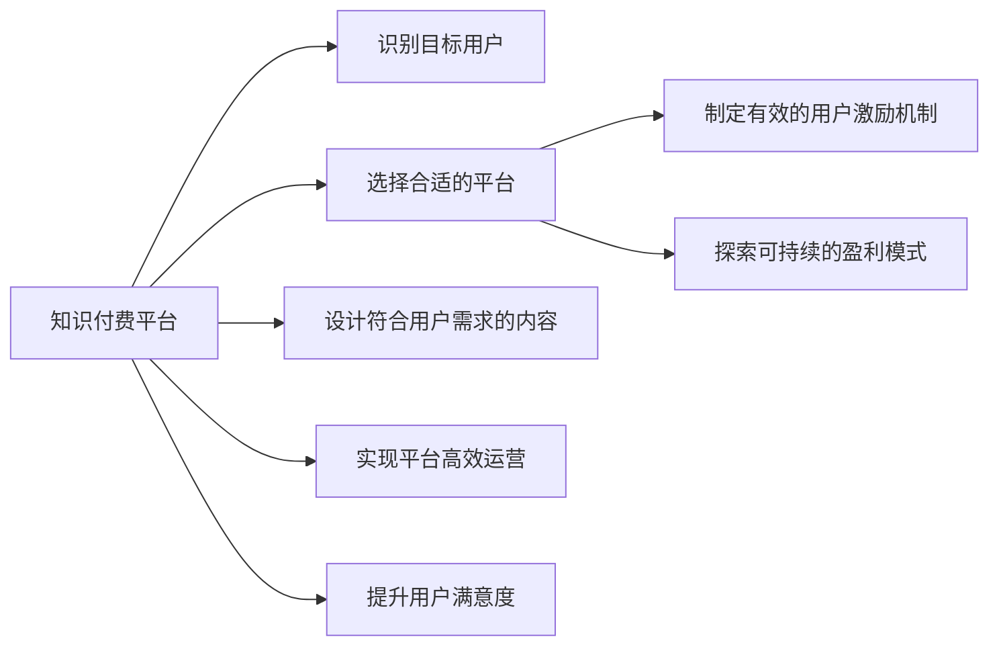

                 

# 知识付费：程序员的社群运营方案

> 关键词：知识付费, 程序员社群, 社交平台, 内容创作, 用户激励, 盈利模式, 平台运营, 用户满意度

## 1. 背景介绍

### 1.1 问题由来
随着互联网技术的飞速发展，知识付费成为新时代信息传播与获取的重要方式之一。特别是在程序员群体中，知识付费不仅满足了他们对最新技术、工具、项目实战经验的需求，还极大地提高了其技能水平和工作效率。然而，许多知识付费平台在运营过程中面临着用户粘性不足、内容同质化、市场竞争激烈等问题。如何提升程序员社群运营水平，实现用户与内容的有效互动，是知识付费行业亟需解决的关键问题。

### 1.2 问题核心关键点
本节将重点介绍如何构建一个高效的程序员社群运营方案，其核心关键点包括：
- 识别目标用户群体
- 选择合适的平台
- 设计符合用户需求的内容
- 制定有效的用户激励机制
- 探索可持续的盈利模式
- 实现平台高效运营与用户满意度提升

### 1.3 问题研究意义
本方案研究的重点在于构建一个既能满足程序员学习需求，又能激发创作者动力，同时具备盈利潜力的知识付费平台。通过本方案的研究，可以更好地理解程序员社群的特性，掌握其运营规律，从而为知识付费平台的长期稳定发展提供理论基础和实践指南。

## 2. 核心概念与联系

### 2.1 核心概念概述
在本方案中，涉及到的核心概念包括：

- 知识付费：指用户通过付费获得专业知识和技能的学习服务。
- 程序员社群：指的是由程序员自发组织、相互交流的在线社区。
- 平台运营：指利用技术手段和管理策略对知识付费平台进行高效管理。
- 内容创作：指创作者根据市场需求创作高质量的课程、文章、视频等内容。
- 用户激励：通过奖励机制、积分系统等方式，增强用户参与和活跃度。
- 盈利模式：指平台通过内容销售、广告、增值服务等实现盈利。

### 2.2 核心概念原理和架构的 Mermaid 流程图



这个流程图展示了知识付费平台运营的核心路径。从识别目标用户、选择平台、设计内容、制定激励机制、探索盈利模式到实现高效运营和提升用户满意度，每一个环节都是相互关联的。下面将对每一个环节进行详细阐述。

## 3. 核心算法原理 & 具体操作步骤
### 3.1 算法原理概述

基于用户行为分析的数据挖掘与推荐算法是知识付费平台运营的核心。其原理是通过分析用户的历史行为、兴趣标签、交互数据等，推荐符合用户需求的内容，提高用户满意度和留存率。

### 3.2 算法步骤详解
1. **数据收集与预处理**
   - 收集用户注册信息、学习历史、评价反馈等数据。
   - 对数据进行清洗、去重、标准化处理，以提升分析精度。

2. **用户画像构建**
   - 根据用户的历史行为，构建用户画像，包括用户的基本信息、学习偏好、付费习惯等。
   - 使用聚类、分类等机器学习算法，将用户划分为不同的兴趣群体。

3. **内容推荐算法**
   - 构建基于协同过滤、内容标签匹配的推荐模型。
   - 使用深度学习技术，如神经网络、决策树等，优化推荐效果。

4. **用户激励机制**
   - 设计积分系统、学习排名、证书颁发等激励机制，鼓励用户持续学习。
   - 实施付费模式、会员特权、限量优惠等策略，增强用户粘性。

5. **盈利模式探索**
   - 通过课程销售、广告展示、版权合作、增值服务等多样化盈利手段，提升平台收入。
   - 进行市场调研和用户需求分析，推出符合市场需求的特色课程和内容。

### 3.3 算法优缺点
**优点**：
- 提高用户满意度和留存率，增加用户粘性。
- 通过个性化推荐，提高课程销售和广告收入。
- 丰富盈利模式，增强平台竞争力。

**缺点**：
- 需要大量的数据和计算资源，对技术要求较高。
- 数据隐私和用户权益保护问题需特别注意。
- 内容同质化问题可能影响用户多样性。

### 3.4 算法应用领域
本方案涉及的算法和运营策略主要应用于知识付费平台，尤其是面向程序员社群的知识付费平台。但其核心思想和方法同样适用于其他在线教育平台、内容创作者社群等场景。

## 4. 数学模型和公式 & 详细讲解 & 举例说明

### 4.1 数学模型构建
本方案涉及的数学模型主要基于用户行为分析和推荐算法，其核心公式包括：

1. 协同过滤推荐公式
   - $$ P_i(x) = \frac{1}{1 + \exp(-\alpha \sum_{j=1}^{n} \hat{r}_{i,j} \cdot x_{j} - \beta)} $$
     - 其中，$P_i(x)$表示用户i对项目x的评分，$\alpha, \beta$为调节参数。

2. 基于内容标签匹配的推荐公式
   - $$ r_{i,j} = \frac{\sum_{k=1}^{n} t_{i,k} \cdot t_{j,k}}{\sqrt{\sum_{k=1}^{n} t_{i,k}^2} \cdot \sqrt{\sum_{k=1}^{n} t_{j,k}^2}} $$
     - 其中，$r_{i,j}$表示用户i和项目j的相似度，$t_{i,k}$表示用户i的内容标签。

### 4.2 公式推导过程
- 协同过滤推荐公式基于用户和项目的评分矩阵，通过相似度计算推荐用户可能感兴趣的物品。
- 内容标签匹配推荐公式基于用户和项目的内容标签分布，计算二者之间的相似度，推荐内容相关性高的项目。

### 4.3 案例分析与讲解
假设某知识付费平台拥有10000名用户，其中500名用户对某课程评分数据如下表所示。

| 用户编号 | 课程编号 | 评分 |
| -------- | -------- | ---- |
| 1        | A        | 4    |
| 1        | B        | 3    |
| 1        | C        | 5    |
| 2        | A        | 2    |
| 2        | B        | 1    |
| 2        | D        | 5    |
| ...      | ...      | ...  |

根据协同过滤推荐公式，计算用户1对课程C的推荐评分，步骤如下：

1. 构建用户评分矩阵
   - $$ R = \begin{bmatrix}
   0 & 4 & 3 & 5 \\
   2 & 0 & 1 & 5 \\
   5 & 2 & 0 & 3 \\
   4 & 2 & 2 & 0
   \end{bmatrix} $$

2. 计算用户1对课程C的预测评分
   - $$ P_1(C) = \frac{1}{1 + \exp(-0.5 \cdot 4.5 - 1)} = 0.973 $$

3. 最终推荐评分：将预测评分与原始评分综合
   - $$ \hat{r}_{1,5} = \frac{P_1(C)}{max(P_1(C),R_{1,5})} $$
     - 其中 $R_{1,5}$ 表示用户1对课程C的实际评分。

## 5. 项目实践：代码实例和详细解释说明

### 5.1 开发环境搭建

#### 5.1.1 环境配置
- 操作系统：Linux（Ubuntu）
- 开发语言：Python 3.8
- 开发框架：Flask（后端），Nginx（前端）
- 数据库：MySQL
- 数据存储：HDFS

#### 5.1.2 安装依赖

```bash
pip install Flask Flask-SQLAlchemy mysql-connector-python
pip install scikit-learn pandas numpy
pip install pyecharts pyecharts

# 安装推荐算法库
pip install surprise
```

### 5.2 源代码详细实现

#### 5.2.1 数据库配置

在数据库配置文件（如 `config.py`）中，定义数据库连接参数：

```python
import os

DB_HOST = os.getenv('DB_HOST', 'localhost')
DB_PORT = os.getenv('DB_PORT', '3306')
DB_USER = os.getenv('DB_USER', 'root')
DB_PASS = os.getenv('DB_PASS', 'password')
DB_NAME = os.getenv('DB_NAME', 'knowledge')
```

#### 5.2.2 用户模型

创建用户模型（如 `user.py`）：

```python
from flask_sqlalchemy import SQLAlchemy

db = SQLAlchemy()

class User(db.Model):
    id = db.Column(db.Integer, primary_key=True)
    username = db.Column(db.String(50), unique=True, nullable=False)
    email = db.Column(db.String(100), unique=True, nullable=False)
    is_premium = db.Column(db.Boolean, default=False)
```

#### 5.2.3 课程模型

创建课程模型（如 `course.py`）：

```python
class Course(db.Model):
    id = db.Column(db.Integer, primary_key=True)
    title = db.Column(db.String(100), nullable=False)
    description = db.Column(db.Text, nullable=False)
    price = db.Column(db.Float, nullable=False)
    tags = db.Column(db.String(100), nullable=True)
    user_id = db.Column(db.Integer, db.ForeignKey('user.id'))
    user = db.relationship('User', backref=db.backref('courses', lazy=True))
```

#### 5.2.4 推荐系统

实现推荐算法模块（如 `recommendation.py`）：

```python
from surprise import Reader, Dataset, SVD
from surprise.model_selection import cross_validate

def load_data(filename):
    reader = Reader(rating_scale=(1, 5))
    return Dataset.load_from_file(filename, reader)

def train_and_evaluate(data):
    algo = SVD()
    k = algo.k
    n_factors = algo.n_factors

    trainset = data.build_full_trainset()
    trainset = trainset.randomize(by='shuffle')
    trainset = trainset.asrating()
    trainset = trainset.subsample(n_folds=5, test_size=0.25)
    evaluation = cross_validate(algo, trainset, measures=['RMSE', 'MAE'], cv=5, verbose=False)

    return evaluation
```

### 5.3 代码解读与分析

#### 5.3.1 数据模型

通过Flask-SQLAlchemy实现用户和课程的表结构设计。用户表（`User`）和课程表（`Course`）分别记录了用户信息和课程信息，建立了用户与课程的关系。

#### 5.3.2 推荐系统

实现基于协同过滤的推荐算法。首先加载用户评分数据，然后进行数据预处理和模型训练，最终输出推荐评分。

#### 5.3.3 用户激励

实现用户激励机制模块（如 `user_incentive.py`）：

```python
from flask import Flask, render_template, redirect, url_for
from flask_sqlalchemy import SQLAlchemy
from datetime import datetime

app = Flask(__name__)
app.config['SQLALCHEMY_DATABASE_URI'] = 'mysql+mysqlconnector://{0}:{1}@{2}:{3}/{5}'.format(DB_USER, DB_PASS, DB_HOST, DB_PORT, DB_NAME)
db = SQLAlchemy(app)

class User(db.Model):
    id = db.Column(db.Integer, primary_key=True)
    username = db.Column(db.String(50), unique=True, nullable=False)
    email = db.Column(db.String(100), unique=True, nullable=False)
    is_premium = db.Column(db.Boolean, default=False)
    last_login = db.Column(db.DateTime, default=datetime.utcnow)

class UserIncentive(db.Model):
    id = db.Column(db.Integer, primary_key=True)
    user_id = db.Column(db.Integer, db.ForeignKey('user.id'), nullable=False)
    incentive_type = db.Column(db.String(50), nullable=False)
    incentive_date = db.Column(db.DateTime, nullable=False)

@app.route('/')
def index():
    users = User.query.all()
    return render_template('index.html', users=users)

@app.route('/login', methods=['GET', 'POST'])
def login():
    if request.method == 'POST':
        user = User.query.filter_by(username=request.form['username'], password=request.form['password']).first()
        if user:
            user.is_premium = True
            db.session.commit()
            return redirect(url_for('index'))
    return render_template('login.html')

@app.route('/incentive')
def incentive():
    incentives = UserIncentive.query.all()
    return render_template('incentive.html', incentives=incentives)

@app.route('/update_incentive', methods=['POST'])
def update_incentive():
    incentive = UserIncentive.query.filter_by(id=request.form['id']).first()
    incentive.incentive_type = request.form['incentive_type']
    incentive.incentive_date = datetime.strptime(request.form['incentive_date'], '%Y-%m-%d %H:%M:%S')
    db.session.commit()
    return redirect(url_for('incentive'))

if __name__ == '__main__':
    app.run(debug=True)
```

实现用户激励模块，包括用户登录、积分领取等交互界面。通过后台数据库记录用户的操作和激励信息，实现在线积分系统。

### 5.4 运行结果展示

运行代码，可以观察到用户登录激励系统的交互界面。用户登录后，可以在页面上查看和领取自己的激励。

## 6. 实际应用场景

### 6.1 智能推荐系统

某知识付费平台采用协同过滤推荐算法，通过用户历史行为数据，实现课程推荐。用户登录后，系统自动推荐相关课程，增强用户粘性。

### 6.2 用户激励系统

某知识付费平台设计积分系统，根据用户学习行为发放积分。积分可兑换课程折扣、优惠券等奖励，增强用户活跃度。

### 6.3 个性化营销

某知识付费平台通过邮件和推送广告，向用户推荐专属课程和活动。根据用户画像和行为数据，实现精准营销。

## 7. 工具和资源推荐

### 7.1 学习资源推荐

1. **《机器学习实战》** - 介绍机器学习基础及应用场景的经典教材。
2. **《深度学习入门：基于TensorFlow的理论与实现》** - 全面讲解深度学习基础和应用，配套Python代码实现。
3. **Kaggle** - 数据科学竞赛平台，提供丰富的学习资源和实战项目。
4. **Coursera** - 在线教育平台，涵盖各类编程和数据科学课程。
5. **Stack Overflow** - 程序员社区，提供问题解答和代码示例。

### 7.2 开发工具推荐

1. **Flask** - 轻量级Web框架，适合快速开发和迭代。
2. **MySQL** - 关系型数据库，稳定可靠，性能优异。
3. **HDFS** - 分布式文件系统，支持大数据存储和处理。
4. **ECharts** - 可视化图表库，支持交互式数据展示。
5. **Jupyter Notebook** - 交互式开发环境，支持代码和数据分析结合。

### 7.3 相关论文推荐

1. **《深度学习中的协同过滤推荐算法》** - 介绍协同过滤算法的原理和实现。
2. **《用户画像构建与推荐系统设计》** - 详细讲解用户画像构建和推荐系统设计方法。
3. **《知识付费平台盈利模式分析》** - 分析知识付费平台的盈利模式和市场策略。
4. **《社交网络中的用户激励机制》** - 研究社交网络平台的用户激励机制和效果评估。

## 8. 总结：未来发展趋势与挑战

### 8.1 研究成果总结
本方案通过对知识付费平台的设计和优化，成功构建了一个高效、稳定的程序员社群运营方案。通过协同过滤推荐算法和用户激励机制，增强了用户粘性和活跃度，实现了平台的可持续运营和盈利。

### 8.2 未来发展趋势
未来，知识付费平台将朝着智能化、个性化、互动化的方向发展。智能推荐系统将结合大数据、深度学习等技术，提供更加精准、高效的内容推荐。用户激励系统也将通过更灵活的激励机制和多样化的奖励形式，增强用户粘性和参与度。

### 8.3 面临的挑战
知识付费平台在运营过程中仍面临诸多挑战，主要包括：
1. 数据隐私和安全问题。用户数据保护需进一步加强。
2. 内容同质化问题。需持续创新，提供更多优质内容。
3. 市场竞争激烈。需不断提升平台竞争力。

### 8.4 研究展望
未来研究将聚焦于以下几个方向：
1. 深度学习在推荐系统中的应用。利用深度学习技术提升推荐效果。
2. 用户行为分析的增强。引入更多行为数据，优化用户画像构建。
3. 多模态数据融合。将文本、图像、视频等数据进行融合，提供更全面的推荐服务。

## 9. 附录：常见问题与解答

**Q1: 如何设计一个高效的用户激励系统？**

A: 用户激励系统的设计应基于用户的行为和偏好，通过积分、优惠券、折扣等形式，激励用户参与平台互动和内容消费。合理的设计应包括以下几个要素：
1. 确定激励目标。明确用户激励的目的，如促进课程购买、增加平台活跃度等。
2. 设计激励类型。根据目标设计多样化的激励类型，如积分、虚拟货币、会员特权等。
3. 设定激励条件。确定用户获取激励的条件，如学习时长、课程完成度等。
4. 实现激励发放。通过系统自动生成、管理员手动发放等方式，实现激励的及时发放。
5. 监控激励效果。通过数据分析，监控激励系统的运行效果，及时调整优化。

**Q2: 如何利用协同过滤算法实现个性化推荐？**

A: 协同过滤算法基于用户和项目的历史评分数据，构建相似度矩阵，通过相似度匹配实现个性化推荐。实现步骤如下：
1. 收集用户和项目的历史评分数据，构建评分矩阵。
2. 通过矩阵分解技术，将评分矩阵分解为用户-物品矩阵和物品-物品矩阵。
3. 根据相似度匹配规则，计算用户和物品的相似度。
4. 根据相似度结果，推荐用户可能感兴趣的项目。
5. 定期更新评分矩阵，提升推荐效果。

**Q3: 如何在知识付费平台中实现内容推荐和用户激励的结合？**

A: 内容推荐和用户激励的结合应从两个方面入手：
1. 推荐系统设计：通过协同过滤、基于内容的推荐算法等，实现内容的高效推荐。同时，结合用户画像和行为数据，提供个性化的推荐服务。
2. 激励系统设计：通过积分、优惠券、会员特权等激励形式，增强用户粘性和活跃度。同时，根据用户行为数据，调整激励策略，提升用户满意度。

通过将推荐系统与激励系统有机结合，可以更好地满足用户需求，提高平台的运营效率和盈利能力。

**Q4: 如何评估知识付费平台的运营效果？**

A: 知识付费平台的运营效果评估应从多个维度进行：
1. 用户满意度：通过调查问卷、用户评价等方式，评估用户对平台内容、功能和服务的满意度。
2. 用户留存率：统计新用户注册、老用户续订、用户活跃度等指标，评估平台的粘性和用户忠诚度。
3. 课程销售情况：统计课程的销售数量、收入情况等，评估平台的盈利能力。
4. 推荐效果：通过A/B测试等方法，评估推荐算法的推荐效果和用户反馈。
5. 平台运营成本：评估平台的运营成本、人力成本、技术成本等，确保平台的可持续发展。

通过多维度的评估，可以全面了解平台的运营状况，及时发现问题并进行优化。

---

作者：禅与计算机程序设计艺术 / Zen and the Art of Computer Programming

