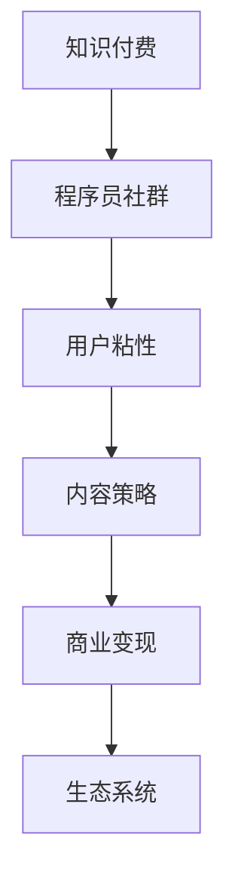

                 

# 知识付费：程序员的社群运营方法

> 关键词：知识付费, 程序员, 社群运营, 技术社区, 用户留存, 内容策略, 商业变现, 生态系统

## 1. 背景介绍

### 1.1 问题由来
近年来，随着互联网技术的发展，知识付费逐渐成为一种趋势。技术社区、在线教育平台、专业论坛等纷纷涌现，为知识付费行业注入了新的活力。程序员作为互联网行业的核心力量，其专业知识与经验的传播与分享，成为了知识付费的重要组成部分。然而，如何构建有效的程序员社群，提升用户粘性，并实现可持续的商业变现，成为了一大难题。

### 1.2 问题核心关键点
知识付费的本质在于利用知识资源创造价值，而社群运营则是实现这一价值的关键手段。因此，本文聚焦于程序员社群的构建与运营方法，以期为知识付费平台提供策略参考。具体关键点如下：

- 社群构建：如何吸引和汇聚程序员群体，构建一个有影响力的技术社区。
- 用户粘性：如何提升用户活跃度和忠诚度，增加用户留存。
- 内容策略：如何制定有效的社区内容策略，确保内容的高质量与相关性。
- 商业变现：如何将社群资源商业化，实现收益与社区价值的良性循环。
- 生态系统：如何构建一个健康的生态系统，促进社区与用户之间的良性互动。

### 1.3 问题研究意义
对于知识付费平台而言，成功的程序员社群运营不仅能够吸引大量用户，还能提升品牌影响力，实现长久的商业变现。同时，对于程序员本身而言，高质量的社群能够提供持续的学习资源和交流机会，加速技术进步和职业发展。

## 2. 核心概念与联系

### 2.1 核心概念概述

为更好地理解程序员社群的构建与运营方法，本节将介绍几个密切相关的核心概念：

- 知识付费：通过在线平台提供知识服务，收取相应费用，实现知识资源的商业化。
- 程序员社群：由程序员组成的专业技术社区，提供技术交流、经验分享、问题解答等服务。
- 用户粘性：指用户对社区的长期依赖和高度参与度。
- 内容策略：制定合理的社区内容规划，吸引用户参与并提升内容质量。
- 商业变现：将社区资源转化为收益，实现商业化运营。
- 生态系统：指社群成员之间的互动关系和社区环境。

这些核心概念之间的逻辑关系可以通过以下Mermaid流程图来展示：



这个流程图展示了一组核心概念之间的关联性：

1. 知识付费为程序员社群的构建提供了物质基础。
2. 程序员社群的建立是为了提升用户粘性，吸引更多用户参与。
3. 内容策略直接影响用户粘性和社区活跃度。
4. 商业变现能够实现社区的可持续发展。
5. 生态系统的健康有助于提升用户粘性和社区整体质量。

这些概念共同构成了知识付费平台社群运营的框架，帮助平台更好地吸引、维护用户，实现商业价值。

## 3. 核心算法原理 & 具体操作步骤
### 3.1 算法原理概述

程序员社群的运营方法，本质上是一个数据驱动的过程，涉及用户行为分析、内容管理、商业化策略等多个层面。其核心在于通过数据分析发现用户需求，优化内容供给，实现商业变现。

假设社群平台拥有用户数据集 $D=\{(u_i, a_i)\}_{i=1}^N$，其中 $u_i$ 为第 $i$ 个用户，$a_i$ 为用户的活跃度数据（如访问频率、内容消费量等）。定义社区用户粘性指标 $F(u)$，内容质量指标 $Q(a)$，商业变现收益 $R(a)$。社群运营的目标是最大化这些指标，即：

$$
\max_{u} F(u) \times Q(a) \times R(a)
$$

其中 $F(u)$ 为社区用户粘性，$Q(a)$ 为内容质量，$R(a)$ 为商业变现收益。

### 3.2 算法步骤详解

基于以上目标，社群运营的具体操作步骤包括以下几个关键步骤：

**Step 1: 用户行为分析**

- 收集和分析用户行为数据，包括访问时间、内容阅读量、参与讨论等。
- 使用数据挖掘技术，如聚类分析、关联规则挖掘等，发现用户群体特征和行为模式。
- 通过用户画像构建，识别不同用户群体的需求和偏好。

**Step 2: 内容策略制定**

- 根据用户画像，制定符合用户需求的内容策略，包括内容主题、形式、发布频率等。
- 采用A/B测试等方法，评估内容策略的效果，迭代优化。
- 引入高质量的外部内容资源，如专家讲座、论文、开源项目等，丰富社区内容。

**Step 3: 商业变现策略**

- 选择合适的商业变现模式，如广告、付费订阅、技术咨询等。
- 设计合理的定价策略，确保用户支付的合理性。
- 提供灵活的付费方案，吸引不同消费能力的用户。

**Step 4: 社群生态建设**

- 建立社区规范和激励机制，鼓励积极互动和内容创作。
- 引入KOL、大V等影响者，提升社区影响力。
- 搭建用户反馈系统，及时调整内容和服务策略。

**Step 5: 持续优化**

- 持续监控用户行为数据和社区表现指标，定期评估策略效果。
- 根据数据分析结果，动态调整内容策略和商业化方案。
- 引入新的技术工具和资源，提升运营效率。

### 3.3 算法优缺点

程序员社群的运营方法具有以下优点：

- 数据驱动：通过用户行为数据驱动运营决策，确保策略的有效性和精准性。
- 内容丰富：多样化的内容策略能够满足不同用户需求，提升用户粘性。
- 商业化灵活：多种商业变现模式的灵活选择，能够实现收益的最大化。
- 生态系统健康：规范和激励机制的建立，有助于构建健康社区生态。

同时，该方法也存在一定的局限性：

- 数据隐私：用户数据的收集和使用需要严格遵守隐私保护政策。
- 运营成本：高质量内容的引入和商业化策略的设计需要大量资源投入。
- 用户流失：用户需求变化快，社区管理不当可能导致用户流失。
- 平台竞争：知识付费行业竞争激烈，需要不断创新才能保持竞争力。

尽管存在这些局限性，但就目前而言，数据驱动的社群运营方法仍是大平台成功运营的关键。未来相关研究的重点在于如何进一步优化数据采集和分析，提升运营效率，同时兼顾用户隐私和社区生态的平衡。

### 3.4 算法应用领域

程序员社群的运营方法在多个领域都得到了应用，包括但不限于：

- 技术论坛：如Stack Overflow、GitHub等，通过社区管理和内容激励提升用户参与度。
- 在线教育平台：如Coursera、Udacity等，提供高质量课程和互动学习环境，实现商业变现。
- 知识付费平台：如Patreon、Navigable等，通过专业内容和技术咨询实现商业化运营。
- 技术博客和媒体：如Medium、Hacker News等，通过内容分发和广告收入实现可持续发展。

## 4. 数学模型和公式 & 详细讲解  
### 4.1 数学模型构建

本节将使用数学语言对程序员社群的构建与运营方法进行更加严格的刻画。

假设社群平台拥有用户数据集 $D=\{(u_i, a_i)\}_{i=1}^N$，其中 $u_i$ 为第 $i$ 个用户，$a_i$ 为用户的活跃度数据（如访问频率、内容消费量等）。定义社区用户粘性指标 $F(u)$，内容质量指标 $Q(a)$，商业变现收益 $R(a)$。社群运营的目标是最大化这些指标，即：

$$
\max_{u} F(u) \times Q(a) \times R(a)
$$

其中 $F(u)$ 为社区用户粘性，$Q(a)$ 为内容质量，$R(a)$ 为商业变现收益。

### 4.2 公式推导过程

以下我们以二分类任务为例，推导社区用户粘性指标 $F(u)$ 和内容质量指标 $Q(a)$ 的计算公式。

假设用户 $u_i$ 对内容 $a_i$ 的粘性 $F(u)$ 定义为：

$$
F(u) = \frac{\text{活跃用户数}}{\text{总用户数}} \times \frac{\text{活跃用户的内容消费量}}{\text{总内容消费量}}
$$

内容质量 $Q(a)$ 定义为：

$$
Q(a) = \frac{\text{高质量内容数}}{\text{总内容数}} \times \frac{\text{高质量内容的用户参与度}}{\text{总内容的用户参与度}}
$$

其中高质量内容可以通过用户评价、专家推荐等方式进行评估和筛选。

### 4.3 案例分析与讲解

以一个技术论坛为例，分析其用户粘性指标和内容质量指标的计算过程：

**用户粘性指标 $F(u)$ 的计算**：

- 假设论坛有 $N=10,000$ 名注册用户，其中 $M=5,000$ 名用户每天活跃访问，内容消费量占总量的 $80\%$。
- 则 $F(u) = \frac{5,000}{10,000} \times \frac{5,000 \times 0.8}{10,000 \times 0.8} = 1$。

**内容质量指标 $Q(a)$ 的计算**：

- 假设论坛每天发布 $100$ 篇文章，其中有 $20$ 篇被用户评为高质量，这些高质量内容的平均用户参与度是普通内容的 $1.2$ 倍。
- 则 $Q(a) = \frac{20}{100} \times \frac{20 \times 1.2}{100 \times 1} = 0.48$。

通过这些指标的计算，可以初步评估社区的用户粘性和内容质量。

## 5. 项目实践：代码实例和详细解释说明
### 5.1 开发环境搭建

在进行社群运营的实践前，我们需要准备好开发环境。以下是使用Python进行数据分析和模型训练的环境配置流程：

1. 安装Anaconda：从官网下载并安装Anaconda，用于创建独立的Python环境。

2. 创建并激活虚拟环境：
```bash
conda create -n community-analytics python=3.8 
conda activate community-analytics
```

3. 安装必要的Python包：
```bash
conda install pandas numpy scikit-learn seaborn plotly
pip install tensorflow matplotlib jupyter notebook ipython
```

4. 准备数据集：
- 用户行为数据集：包含用户访问时间、内容消费量等。
- 内容质量数据集：包含用户对内容的评价、阅读量等。

5. 启动Jupyter Notebook：
```bash
jupyter notebook
```

完成上述步骤后，即可在`community-analytics`环境中开始社群运营的实践。

### 5.2 源代码详细实现

我们以一个技术论坛为例，给出使用Python进行用户粘性和内容质量评估的代码实现。

首先，定义用户行为和内容质量的数据处理函数：

```python
import pandas as pd
import numpy as np
import matplotlib.pyplot as plt

def process_user_data(data):
    # 计算用户活跃度
    user_engagement = data['user_id'].value_counts(normalize=True) * data['total_content_consumption'].mean()
    # 计算内容质量
    content_quality = data['content_id'].value_counts(normalize=True) * data['content_quality_score'].mean()
    return user_engagement, content_quality

# 读取用户行为数据
user_data = pd.read_csv('user_behavior_data.csv')
user_engagement, content_quality = process_user_data(user_data)
```

然后，计算用户粘性和内容质量的指标：

```python
# 计算用户粘性
user_stickiness = user_engagement.sum() / user_data['user_id'].nunique()

# 计算内容质量
content_quality_ratio = content_quality.sum() / user_data['content_id'].nunique()

print(f"User Stickiness: {user_stickiness:.2f}")
print(f"Content Quality: {content_quality_ratio:.2f}")
```

最后，通过图表展示这些指标的变化趋势：

```python
# 绘制用户粘性曲线
plt.plot(user_data['user_id'], user_engagement.values, label='User Engagement')
plt.title('User Engagement Over Time')
plt.xlabel('User ID')
plt.ylabel('Engagement Percentage')
plt.legend()
plt.show()

# 绘制内容质量曲线
plt.plot(user_data['content_id'], content_quality.values, label='Content Quality')
plt.title('Content Quality Over Time')
plt.xlabel('Content ID')
plt.ylabel('Quality Percentage')
plt.legend()
plt.show()
```

以上就是使用Python对技术论坛用户粘性和内容质量进行评估的完整代码实现。可以看到，通过简单数据处理和可视化，便能直观地分析社区的用户粘性和内容质量。

### 5.3 代码解读与分析

让我们再详细解读一下关键代码的实现细节：

**process_user_data函数**：
- 定义了计算用户活跃度和内容质量的函数，通过`value_counts`和`mean`方法计算用户和内容的数量占比和平均活跃度。

**user_stickiness和content_quality_ratio变量**：
- 通过调用`process_user_data`函数，计算出用户粘性和内容质量的指标。

**绘图代码**：
- 使用`plt.plot`绘制用户活跃度和内容质量的趋势图，并通过`xlabel`、`ylabel`、`title`和`legend`方法进行美化。

这些代码展示了如何通过数据分析和可视化手段，评估程序员社群的用户粘性和内容质量，从而指导社群运营策略。

## 6. 实际应用场景
### 6.1 智能客服系统

基于程序员社群的用户粘性和内容质量，智能客服系统可以提供更加个性化的服务。通过分析用户行为和内容互动，智能客服能够精准识别用户需求，快速提供解决方案，提升用户满意度。

在技术实现上，可以构建智能客服机器人，根据用户历史互动记录，自动推荐相关问题和答案。同时，智能客服系统可以集成社群内容，提供更丰富的知识库和解决方案，进一步提升服务质量。

### 6.2 金融舆情监测

程序员社群的内容质量可以为金融舆情监测提供重要参考。通过分析社区对市场事件的讨论和评价，金融机构可以及时捕捉市场情绪，预测市场动向，进行风险预警。

具体而言，可以收集程序员社群对经济、政策、公司动态等话题的讨论内容，利用自然语言处理技术进行情感分析和话题识别。一旦发现负面舆情激增等异常情况，系统便会自动预警，帮助金融机构快速应对潜在风险。

### 6.3 个性化推荐系统

程序员社群的内容质量可以为个性化推荐系统提供优质数据来源。通过分析用户对不同内容的评价和互动，推荐系统能够识别用户兴趣，提供更加精准和多样化的内容推荐。

在推荐算法上，可以采用协同过滤、内容推荐、兴趣画像等技术，结合程序员社群的内容质量指标，提升推荐系统的效果。同时，推荐系统可以引入社区热门内容，增加内容多样性，满足用户的多样化需求。

### 6.4 未来应用展望

随着程序员社群的不断发展和数据积累，其应用前景将更加广阔。

在智慧医疗领域，程序员社群的开发者可以贡献医疗相关的算法和知识库，提升医疗服务的智能化水平，辅助医生诊疗，加速新药开发进程。

在智能教育领域，程序员社群的开发者可以参与课程开发和内容创作，因材施教，促进教育公平，提高教学质量。

在智慧城市治理中，程序员社群的开发者可以构建城市事件监测和舆情分析系统，提高城市管理的自动化和智能化水平，构建更安全、高效的未来城市。

此外，在企业生产、社会治理、文娱传媒等众多领域，程序员社群的知识分享和资源整合能力也将被进一步挖掘，为各行各业带来变革性影响。

## 7. 工具和资源推荐
### 7.1 学习资源推荐

为了帮助开发者系统掌握程序员社群的构建与运营方法，这里推荐一些优质的学习资源：

1. 《社区运营：从入门到精通》系列博文：由社区运营专家撰写，深入浅出地介绍了社区构建、用户粘性提升、内容策略制定等核心技术。

2. 《NLP与大数据》课程：深度学习与大数据技术结合的实战课程，涵盖数据挖掘、文本分析、推荐系统等内容。

3. 《社区管理与运营》书籍：社区管理与运营的全面指南，包含用户行为分析、内容策略制定、商业变现等方方面面。

4. GitHub开源项目：社区运营相关的开源项目，如Discourse、Flarum等，提供丰富的社区运营工具和示例代码。

5. Weights & Biases：模型训练的实验跟踪工具，可以记录和可视化模型训练过程中的各项指标，方便对比和调优。与主流深度学习框架无缝集成。

通过这些资源的学习实践，相信你一定能够快速掌握程序员社群的构建与运营的精髓，并用于解决实际的社区运营问题。

### 7.2 开发工具推荐

高效的开发离不开优秀的工具支持。以下是几款用于程序员社群运营开发的常用工具：

1. Jupyter Notebook：开源的交互式开发环境，支持Python、R等多种编程语言，便于数据分析和可视化。

2. Pandas：Python数据分析库，提供了高效的数据处理和分析功能，适合处理大规模用户行为数据。

3. Plotly：数据可视化工具，支持生成交互式图表，适合展示用户粘性和内容质量的变化趋势。

4. Scikit-learn：机器学习库，提供了多种模型算法，适合进行用户分类和内容推荐。

5. TensorFlow：谷歌开发的深度学习框架，适合构建复杂的社区分析模型。

合理利用这些工具，可以显著提升程序员社群运营的开发效率，加快创新迭代的步伐。

### 7.3 相关论文推荐

程序员社群的构建与运营技术的发展源于学界的持续研究。以下是几篇奠基性的相关论文，推荐阅读：

1. A Study on Community Development and User Retention：分析社区用户留存和增长因素，提出了一套社区运营的优化策略。

2. User Behavioral Analysis in Online Communities：研究用户在线行为的数据挖掘方法，通过聚类分析和关联规则挖掘揭示用户需求和行为模式。

3. Content Strategy in Knowledge Communities：探讨内容策略对社区用户粘性的影响，提出了一系列高质量内容生成的方法。

4. Monetization of Online Communities：讨论社区商业变现模式和定价策略，分析不同变现模式的优缺点。

5. Building a Sustainable Online Community Ecosystem：构建社区生态系统的策略和建议，涵盖社区规范、激励机制、KOL引入等关键环节。

这些论文代表了大数据与社区运营技术的发展脉络。通过学习这些前沿成果，可以帮助研究者把握学科前进方向，激发更多的创新灵感。

## 8. 总结：未来发展趋势与挑战
### 8.1 总结

本文对程序员社群的构建与运营方法进行了全面系统的介绍。首先阐述了社群运营的背景和意义，明确了用户粘性、内容策略、商业变现等关键点。其次，从原理到实践，详细讲解了社群运营的数学模型和操作步骤，给出了社群运营任务开发的完整代码实例。同时，本文还探讨了社群运营在多个领域的应用前景，展示了其广阔的应用空间。最后，精选了社群运营技术的各类学习资源，力求为开发者提供全方位的技术指引。

通过本文的系统梳理，可以看到，程序员社群的构建与运营方法正在成为知识付费平台的重要手段，极大地拓展了知识付费行业的发展边界，催生了更多的落地场景。未来，伴随数据分析和模型优化技术的持续演进，社区运营必将更加高效、智能，成为知识付费平台不可或缺的一部分。

### 8.2 未来发展趋势

展望未来，程序员社群的运营技术将呈现以下几个发展趋势：

1. 数据驱动：大数据分析技术的应用将更加广泛，通过数据挖掘和机器学习优化社区运营策略。

2. 内容丰富：内容策略将更加灵活多样，涵盖文本、图片、视频等多种形式，提升用户粘性。

3. 商业化多样：社区变现模式将更加多样，如广告、订阅、知识付费、社交电商等，满足不同用户的需求。

4. 用户互动：社区运营将更加注重用户互动，通过智能推荐、社区投票等方式提升用户参与度。

5. 生态系统：社区生态系统将更加健康，通过规则制定、激励机制、KOL引入等方式，构建稳定、良性的社区环境。

以上趋势凸显了程序员社群运营技术的广阔前景。这些方向的探索发展，必将进一步提升社区运营的效率和质量，为知识付费平台带来更多商业价值。

### 8.3 面临的挑战

尽管程序员社群运营技术已经取得了显著成果，但在迈向更加智能化、普适化应用的过程中，仍面临诸多挑战：

1. 数据隐私：用户数据的收集和使用需要严格遵守隐私保护政策，确保用户信息的安全。

2. 运营成本：高质量内容的引入和社区管理需要大量资源投入，运营成本较高。

3. 用户流失：用户需求变化快，社区管理不当可能导致用户流失，影响社区质量。

4. 平台竞争：知识付费平台众多，需要不断创新才能保持竞争力，吸引用户加入。

5. 生态建设：社区生态系统复杂，需要多方面协同合作，共同维护社区健康。

正视社群运营面临的这些挑战，积极应对并寻求突破，将是大平台成功运营的关键。相信随着学界和产业界的共同努力，这些挑战终将一一被克服，程序员社群运营技术必将迈向更高的台阶，为知识付费平台带来更多商业价值。

### 8.4 研究展望

面对程序员社群运营所面临的种种挑战，未来的研究需要在以下几个方面寻求新的突破：

1. 数据治理：建立数据治理体系，保障用户数据的安全与隐私，提升数据使用的合规性和效率。

2. 算法优化：开发更加高效、准确的模型算法，提升社区运营策略的效果，减少运营成本。

3. 用户分析：深化用户行为分析，识别用户需求和行为模式，提高社区运营的精准性和个性化。

4. 社区治理：建立社区自治机制，引入用户参与社区管理的渠道，提升社区治理能力。

5. 跨领域融合：将社区运营技术与其他领域的知识整合，如心理学、社会学等，提升社区运营的深度和广度。

这些研究方向将引领程序员社群运营技术的进一步发展，为构建高质量的知识付费平台提供有力支持。面向未来，社区运营技术必将与更多前沿技术深度融合，推动知识付费行业的全面进步。

## 9. 附录：常见问题与解答

**Q1：如何评估程序员社群的用户粘性？**

A: 评估程序员社群的用户粘性，可以通过以下几个指标：

1. 用户活跃度：统计用户访问频率、内容消费量等指标，评估用户对社区的持续参与度。

2. 内容互动率：统计用户对内容的点赞、评论、分享等互动行为，评估用户对内容的积极参与。

3. 用户留存率：统计用户在不同时间点的留存情况，评估用户对社区的长期依赖。

通过这些指标的综合评估，可以初步判断社区的用户粘性。

**Q2：如何制定程序员社群的内容策略？**

A: 制定程序员社群的内容策略，可以从以下几个方面入手：

1. 用户需求分析：通过数据分析和用户调研，了解用户对不同内容的需求和偏好。

2. 内容多样化：引入高质量的外部内容资源，如专家讲座、论文、开源项目等，丰富社区内容。

3. 内容更新频率：根据用户活跃度数据，制定合理的内容发布频率，确保内容的新鲜度和持续性。

4. 用户反馈机制：建立用户反馈系统，及时调整内容策略，确保内容质量与用户需求匹配。

通过以上步骤，可以制定出符合用户需求、高质量、多样化的内容策略。

**Q3：程序员社群的商业化变现有哪些方式？**

A: 程序员社群的商业化变现方式主要包括：

1. 广告变现：通过社区中的广告位，向用户展示相关广告，获取广告收入。

2. 付费订阅：提供高级会员服务，包括专属内容、优先发布等，获取订阅费。

3. 技术咨询：提供社区内专家的技术咨询服务，获取咨询费。

4. 知识付费：通过平台提供课程、讲座、技术分享等，获取知识付费收入。

5. 社交电商：社区内引入商品推广，通过用户购买获取佣金。

这些变现方式可以根据社群的特点和用户需求，灵活选择和组合。

**Q4：如何构建程序员社群的生态系统？**

A: 构建程序员社群的生态系统，可以从以下几个方面入手：

1. 社区规范：制定社区规范和行为准则，确保社区健康有序运行。

2. KOL引入：引入社区内的KOL和影响者，提升社区影响力和用户信任度。

3. 激励机制：建立激励机制，如积分系统、排行榜等，鼓励用户积极参与和创作内容。

4. 社区活动：组织技术交流、线上线下活动，增加用户互动和社区凝聚力。

5. 用户反馈：建立用户反馈系统，及时调整社区策略，提升用户满意度。

通过以上措施，可以构建一个健康、活跃、良性的程序员社群生态系统。

**Q5：程序员社群的运营有哪些关键步骤？**

A: 程序员社群的运营过程可以分为以下几个关键步骤：

1. 用户行为分析：收集和分析用户行为数据，了解用户需求和行为模式。

2. 内容策略制定：根据用户需求，制定合适的社区内容策略，确保内容高质量。

3. 商业化变现：选择合适的商业化策略，实现收益最大化。

4. 社群生态建设：建立社区规范和激励机制，提升用户粘性和社区质量。

5. 持续优化：持续监控社区表现指标，动态调整策略，提升运营效率。

通过以上步骤，可以系统地进行程序员社群的运营，实现社区的可持续发展。

---

作者：禅与计算机程序设计艺术 / Zen and the Art of Computer Programming

