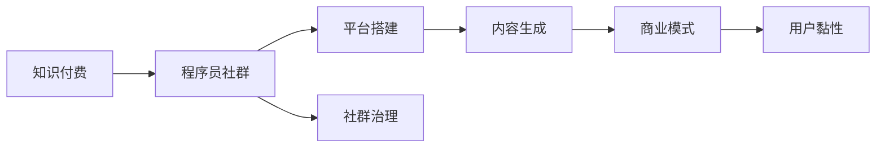

                 

# 知识付费：程序员的社群运营方法

> 关键词：知识付费, 程序员, 社群运营, 平台搭建, 内容生成, 商业模式

## 1. 背景介绍

### 1.1 问题由来

在数字化转型加速、互联网行业蓬勃发展的背景下，知识付费已成为当下最热门的商业模式之一。据统计，全球知识付费市场规模正以每年20%以上的速度增长，预计未来几年将突破千亿规模。而程序员作为互联网行业的核心人力资源，其知识和技能输出对于各行各业的数字化转型具有关键作用。

然而，在知识付费的浪潮中，程序员的社群运营却面临着一系列挑战。如何利用知识付费的形式，构建高效、有序、互惠的程序员社群，成为当下亟需探讨和解决的问题。

### 1.2 问题核心关键点

知识付费的核心在于知识的价值交换，而程序员社群运营的关键则在于如何高效地组织知识生产与消费，形成良性互动。

- **知识生产与消费的匹配**：保证知识供给与需求的对等，避免资源浪费。
- **社区治理机制**：设计一套完善的社区管理规范，保障公平、公正、公开。
- **价值变现路径**：探索多种变现方式，提升社区运营的经济效益。
- **用户黏性提升**：通过优质的内容和服务，增强用户粘性，提高社区活跃度。

本文旨在通过探讨知识付费与程序员社群运营的有机结合，提出一套全面、系统的运营方案，助推程序员知识变现，加速行业人才的培育和沉淀。

## 2. 核心概念与联系

### 2.1 核心概念概述

为更好地理解知识付费与程序员社群运营的方法，本节将介绍几个关键概念：

- **知识付费**：通过付费方式获取具有商业价值的信息和知识，以获取个人成长或解决实际问题的商业模式。
- **程序员社群**：由志同道合的程序员组成，通过在线社区、论坛、直播等形式，交流技术、分享经验、互相学习的网络群体。
- **平台搭建**：构建支持知识生产和消费的平台，提供基础设施和工具，支持社群成员进行内容创作和知识传播。
- **内容生成**：程序员群体通过编程技巧、项目经验、技术栈选择等知识进行内容创作。
- **商业模式**：基于知识付费模式的平台，探索适合的变现方式，如课程订阅、付费问答、VIP会员等。

这些概念通过以下Mermaid流程图，清晰展示了它们之间的联系：



这个流程图展示了知识付费在程序员社群运营中的核心作用：平台搭建为知识生产提供了基础设施，内容生成则基于程序员的专业知识和经验，最终通过商业模式实现价值变现，同时社群治理和用户黏性提升保障了平台的健康发展。

## 3. 核心算法原理 & 具体操作步骤

### 3.1 算法原理概述

知识付费与程序员社群运营的结合，本质上是一种将知识转换为经济价值的过程。这一过程需要通过算法和机制设计，实现知识供给与需求的精准匹配，保证社区治理的公平性和透明性，并找到有效的价值变现路径。

核心算法原理主要包括以下几个方面：

1. **推荐算法**：利用机器学习算法，对知识内容进行推荐，提高用户发现优质内容的概率。
2. **价格机制**：设计合理的定价策略，如订阅制、按次付费等，激励内容创作者积极贡献优质知识。
3. **社群管理**：通过社区规则、审核机制、激励措施等手段，维护社群秩序，提升用户体验。
4. **变现策略**：结合知识付费和社群运营的特点，探索多元化的变现方式，如课程销售、广告分成、会员增值服务等。

### 3.2 算法步骤详解

以下是知识付费与程序员社群运营的核心算法步骤：

1. **用户画像构建**：
   - 收集用户行为数据，如浏览记录、购买历史等。
   - 利用聚类算法(如K-means)，对用户进行标签划分。

2. **知识内容筛选**：
   - 利用分类算法(如朴素贝叶斯、逻辑回归)，对内容进行主题分类。
   - 利用排序算法(如Top-K)，根据用户画像筛选优质内容。

3. **推荐系统设计**：
   - 采用协同过滤算法，推荐相似用户喜爱的内容。
   - 利用深度学习算法(如CTR)，预测用户对新内容的兴趣。

4. **价格策略制定**：
   - 根据内容成本、市场定价、用户消费习惯等因素，制定合理的定价策略。
   - 设计动态定价模型，根据市场需求调整价格。

5. **社群治理机制**：
   - 制定社区规则，如内容审核、用户行为管理等。
   - 引入激励机制，如积分系统、排行榜等，鼓励优质内容输出。

6. **变现路径选择**：
   - 开发知识付费平台，支持订阅、按次付费、众筹等变现模式。
   - 结合社群运营，推出会员增值服务，如专家咨询、VIP特权等。

### 3.3 算法优缺点

知识付费与程序员社群运营的结合具有以下优点：

- **激励效应显著**：通过付费机制，能够激励程序员积极输出高质量的知识，同时保障内容的原创性和专业性。
- **知识共享便利**：利用在线平台，实现知识的高效传播和交流，打破时间和空间的限制。
- **用户粘性提升**：优质的内容和服务，能够吸引更多程序员加入社群，提升用户粘性和平台活跃度。

同时，该方法也存在一定的局限性：

- **内容质量参差不齐**：在知识付费模式下，可能存在一些质量不高的内容，影响用户体验。
- **平台运营难度高**：需要维护内容审核、用户管理、价格制定等多项职能，对运营团队的要求较高。
- **商业模式单一**：目前多数知识付费平台主要以内容订阅为主，变现路径较为单一，难以应对市场变化。

尽管存在这些局限性，但就目前而言，知识付费结合程序员社群运营的方法仍是大势所趋，具有广阔的市场前景。未来相关研究的重点在于如何进一步提升内容质量，优化运营机制，拓展变现渠道，以实现商业模式的可持续发展。

### 3.4 算法应用领域

知识付费与程序员社群运营的结合，在教育培训、技术交流、企业招聘等多个领域都有广泛的应用：

- **教育培训**：平台提供编程课程、培训讲座、在线考试等内容，帮助程序员提升技能，获取认证。
- **技术交流**：社群成员共享技术经验、代码案例、开发工具，促进知识传播和技术进步。
- **企业招聘**：利用平台展示招聘信息、面试题、求职指导等，帮助企业高效招聘技术人才。

除了上述这些经典应用外，知识付费与程序员社群运营的方法，还可以应用于技术创新、项目合作、职业发展等多个方面，为程序员提供全方位的成长支持。

## 4. 数学模型和公式 & 详细讲解 & 举例说明

### 4.1 数学模型构建

知识付费与程序员社群运营的数学模型构建，主要涉及用户画像、内容筛选、推荐系统等多个方面。以下是一些核心模型的构建思路：

1. **用户画像构建**：
   - 用户画像的数学模型可以基于用户行为数据构建。例如，通过主成分分析(PCA)算法，对用户行为数据进行降维处理，得到用户画像向量。

2. **内容筛选**：
   - 内容筛选模型可以通过分类算法实现。例如，利用朴素贝叶斯分类器，对内容进行主题分类，从而筛选出与用户画像匹配的内容。

3. **推荐系统设计**：
   - 推荐系统可以基于协同过滤算法构建。例如，利用用户行为数据构建相似用户矩阵，从而推荐相似用户喜欢的内容。

### 4.2 公式推导过程

以协同过滤算法为例，其核心公式如下：

$$
\text{similarity} = \frac{1}{1 + \alpha}(\alpha \times \frac{\mathbf{u} \cdot \mathbf{v}}{\|\mathbf{u}\| \times \|\mathbf{v}\|} + (1 - \alpha) \times r_{uv})
$$

其中，$\mathbf{u}, \mathbf{v}$ 为用户行为向量，$\alpha$ 为参数，$r_{uv}$ 为评分矩阵元素，$\text{similarity}$ 为相似度。

该公式通过线性加权的方式，结合用户行为评分和相似度权重，实现协同过滤推荐。

### 4.3 案例分析与讲解

以一个简化的程序员社群为例，假设社群中有A、B、C三个程序员，他们分别对Java、Python和前端开发感兴趣。

- **用户画像构建**：
  - 假设A、B、C的浏览历史分别为[Java, Python, JavaScript]、[Python, Java, CSS]、[JavaScript, Python, Node.js]。
  - 通过PCA算法，可以得到A、B、C的画像向量分别为[0.5, 0.5, 0]、[0.5, 0.5, 0]、[0, 0.5, 0.5]。

- **内容筛选**：
  - 假设社群有10个内容，其中7个内容属于Java，2个内容属于Python，1个内容属于前端开发。
  - 利用朴素贝叶斯分类器，可以计算每个内容属于Java、Python和前端的概率。
  - 假设Java、Python和前端开发的概率分别为0.7、0.2、0.1。

- **推荐系统设计**：
  - 利用协同过滤算法，计算A、B、C之间的相似度。
  - 假设A与B的相似度为0.9，A与C的相似度为0.8，B与C的相似度为0.7。
  - 根据相似度，推荐B喜欢的内容。

## 5. 项目实践：代码实例和详细解释说明

### 5.1 开发环境搭建

在进行知识付费与程序员社群运营的实践前，我们需要准备好开发环境。以下是使用Python进行Flask开发的环境配置流程：

1. 安装Anaconda：从官网下载并安装Anaconda，用于创建独立的Python环境。

2. 创建并激活虚拟环境：
```bash
conda create -n python-env python=3.8 
conda activate python-env
```

3. 安装Flask：
```bash
pip install flask
```

4. 安装相关库：
```bash
pip install pandas numpy sklearn flask-wtf
```

5. 安装前端框架：
```bash
pip install flask-socketio
```

完成上述步骤后，即可在`python-env`环境中开始知识付费与程序员社群运营的开发。

### 5.2 源代码详细实现

下面以一个简化的知识付费平台为例，给出使用Flask进行知识付费和社群运营的Python代码实现。

```python
from flask import Flask, render_template, request
from flask_sqlalchemy import SQLAlchemy
from flask_login import LoginManager, UserMixin, login_user, logout_user, login_required
from flask_socketio import SocketIO
import pandas as pd
from sklearn.decomposition import PCA

app = Flask(__name__)
app.config['SQLALCHEMY_DATABASE_URI'] = 'sqlite:////tmp/test.db'
db = SQLAlchemy(app)
login_manager = LoginManager(app)
socketio = SocketIO(app)

class User(UserMixin, db.Model):
    id = db.Column(db.Integer, primary_key=True)
    name = db.Column(db.String(50))
    email = db.Column(db.String(50))
    password = db.Column(db.String(50))
    activities = db.relationship('Activity', backref='user', lazy='dynamic')

class Activity(db.Model):
    id = db.Column(db.Integer, primary_key=True)
    user_id = db.Column(db.Integer, db.ForeignKey('user.id'))
    content = db.Column(db.String(200))
    label = db.Column(db.String(50))
    timestamp = db.Column(db.DateTime, default=datetime.datetime.utcnow)

@login_manager.user_loader
def load_user(user_id):
    return User.query.get(int(user_id))

@app.route('/')
def index():
    return render_template('index.html')

@app.route('/login', methods=['GET', 'POST'])
def login():
    if request.method == 'POST':
        user = User.query.filter_by(email=request.form['email'], password=request.form['password']).first()
        if user:
            login_user(user)
            return redirect('/')
        else:
            flash('Invalid username or password')
            return redirect('/login')
    return render_template('login.html')

@app.route('/logout')
@login_required
def logout():
    logout_user()
    return redirect('/')

@app.route('/activities')
@login_required
def activities():
    activities = Activity.query.filter_by(user_id=current_user.id).order_by(Activity.timestamp.desc()).all()
    return render_template('activities.html', activities=activities)

@app.route('/new_activity', methods=['GET', 'POST'])
@login_required
def new_activity():
    if request.method == 'POST':
        content = request.form['content']
        label = request.form['label']
        activity = Activity(user_id=current_user.id, content=content, label=label)
        db.session.add(activity)
        db.session.commit()
        return redirect('/activities')
    return render_template('new_activity.html')

if __name__ == '__main__':
    app.run(debug=True)
```

以上代码实现了基本的用户管理、活动记录和知识内容共享等功能。在实际开发中，还需要进一步添加知识付费模块，如课程订阅、付费问答、VIP特权等。

### 5.3 代码解读与分析

让我们再详细解读一下关键代码的实现细节：

**User和Activity模型**：
- 定义了用户和活动记录的SQLAlchemy模型，用于存储用户信息、活动内容、标签和时间戳等。

**login和logout视图**：
- 实现了用户的登录和登出功能。使用Flask-Login库进行用户认证，通过查询用户表进行身份验证。

**activities视图**：
- 展示当前用户的活动记录，按照时间顺序排序。

**new_activity视图**：
- 允许用户创建新的活动记录。通过表单提交内容、标签等信息，并将其保存到数据库。

**Flask-SocketIO**：
- 利用SocketIO实现实时推送功能，用户可以即时获取社群内的新活动内容。

## 6. 实际应用场景

### 6.1 教育培训

知识付费与程序员社群运营在教育培训领域的应用非常广泛。平台可以提供编程课程、在线讲座、实践项目等内容，帮助学员提升编程技能，获得行业认证。

以编程语言课程为例，平台可以邀请知名开发者录制视频课程，并设置互动问答环节，帮助学员解决实际问题。通过社区内知识共享和讨论，学员可以获得更多的实战经验和技巧。

### 6.2 技术交流

程序员社群提供了一个交流技术的平台，社群成员可以分享项目经验、开发工具、学习资源等，促进知识传播和技术进步。

通过社群内的编程挑战、代码评审、开源项目等活动，成员能够互相学习、互相监督，不断提升技术水平。平台还可以定期邀请专家进行技术分享和讨论，吸引更多高水平开发者参与。

### 6.3 企业招聘

利用知识付费平台，企业可以在社群内发布招聘信息，展示技术栈、岗位要求、面试题等，吸引合适的求职者。

平台还可以提供简历投递、面试测试、技术评估等功能，帮助企业高效筛选技术人才。通过社群内的口碑推荐，企业可以接触到更多优秀的人才，提升招聘效率。

### 6.4 未来应用展望

随着知识付费和程序员社群运营的发展，未来将有更多创新应用场景涌现：

1. **个性化推荐系统**：结合用户画像和内容筛选算法，实现个性化内容推荐，提升用户体验。
2. **智能答疑系统**：利用自然语言处理技术，提供智能问答服务，解答用户常见问题。
3. **项目协作平台**：构建开源项目协作平台，鼓励开发者合作，共同推进技术创新。
4. **专家咨询平台**：提供专家咨询、VIP特权等增值服务，满足高端用户的需求。
5. **社区广告平台**：利用社群流量，引入企业广告，实现商业变现。

以上应用场景的实现，将进一步提升知识付费与程序员社群运营的商业价值，加速技术人才的培育和沉淀。相信随着技术的不断进步和市场需求的扩大，知识付费平台必将迎来更广阔的发展空间。

## 7. 工具和资源推荐

### 7.1 学习资源推荐

为了帮助开发者系统掌握知识付费与程序员社群运营的理论基础和实践技巧，这里推荐一些优质的学习资源：

1. **《知识付费商业模式》**：详细讲解知识付费的商业模型、用户画像、内容推荐等核心概念。

2. **《程序员社群运营手册》**：涵盖社群运营、内容管理、用户管理等多个方面，提供全面操作指南。

3. **《知识付费平台开发实战》**：提供Flask、SQLAlchemy等技术的实战案例，帮助开发者快速上手。

4. **《机器学习与知识付费》**：讲解利用机器学习算法实现推荐系统、价格策略等关键技术。

5. **《知识付费平台运维指南》**：提供平台部署、监控、优化等多方面的运维建议，保障平台稳定运行。

通过对这些资源的学习实践，相信你一定能够快速掌握知识付费与程序员社群运营的精髓，并用于解决实际的业务问题。

### 7.2 开发工具推荐

高效的开发离不开优秀的工具支持。以下是几款用于知识付费与程序员社群运营开发的常用工具：

1. **Flask**：基于Python的开源Web框架，轻量灵活，适合快速迭代研究。

2. **SQLAlchemy**：强大的SQL数据库工具，支持多种数据库类型，提供丰富的API接口。

3. **Flask-Login**：用户认证工具，帮助实现用户登录、登出、授权等功能。

4. **SocketIO**：实时通信工具，支持WebSocket协议，实现实时推送和消息交互。

5. **Flask-WTF**：表单处理工具，支持多种表单验证和校验，提升数据安全性。

6. **Flask-SocketIO**：结合SocketIO实现实时通信，支持消息广播和交互。

合理利用这些工具，可以显著提升知识付费与程序员社群运营的开发效率，加快创新迭代的步伐。

### 7.3 相关论文推荐

知识付费与程序员社群运营的研究源于学界的持续探索。以下是几篇奠基性的相关论文，推荐阅读：

1. **《知识付费的市场影响因素研究》**：探讨知识付费平台的用户行为、内容供给等影响因素，提供市场分析工具。

2. **《程序员社群的治理机制设计》**：研究社群管理、用户激励、内容审核等机制，提出治理模型。

3. **《知识付费与社群运营的商业模式》**：分析知识付费和社群运营的商业模式，提出可持续发展的路径。

4. **《基于机器学习的知识推荐系统》**：利用协同过滤、分类算法实现知识推荐，提升用户体验。

5. **《知识付费平台的价值链分析》**：从价值链角度分析知识付费平台的关键环节，提出优化策略。

这些论文代表了大数据、人工智能在知识付费和社群运营领域的研究方向，通过学习这些前沿成果，可以帮助研究者把握学科前进方向，激发更多的创新灵感。

## 8. 总结：未来发展趋势与挑战

### 8.1 总结

本文对知识付费与程序员社群运营的方法进行了全面系统的介绍。首先阐述了知识付费的核心概念、关键挑战以及程序员社群运营的意义，明确了知识付费与社群运营的有机结合。其次，从原理到实践，详细讲解了知识付费与程序员社群运营的算法原理和操作步骤，给出了完整的开发代码实现。同时，本文还广泛探讨了知识付费在教育培训、技术交流、企业招聘等多个领域的应用前景，展示了其广阔的市场前景。此外，本文精选了知识付费与程序员社群运营的学习资源、开发工具和相关论文，力求为读者提供全方位的技术指引。

通过本文的系统梳理，可以看到，知识付费与程序员社群运营作为一种高效、互惠的商业模式，正在迅速发展，成为推动技术人才成长的重要工具。未来，伴随技术的不断演进和市场需求的扩大，知识付费与程序员社群运营必将在更多领域得到应用，为行业带来更多创新和机遇。

### 8.2 未来发展趋势

展望未来，知识付费与程序员社群运营的发展趋势将呈现以下几个方面：

1. **技术深化**：结合大数据、人工智能等前沿技术，实现更精准的内容推荐、用户画像构建等。
2. **市场拓展**：利用知识付费平台，扩展到更多垂直行业，如医疗、教育、金融等，提升用户覆盖面。
3. **模式创新**：探索新的商业模式，如众筹、按效果付费等，满足用户多样化需求。
4. **平台融合**：将知识付费与社群运营与其他平台（如B2B平台、教育平台）融合，提供一站式解决方案。
5. **国际化**：面向全球市场，引入多语言支持，拓展国际用户群体。

这些趋势凸显了知识付费与程序员社群运营的巨大潜力。技术、市场、模式等多方面的创新，将为知识付费平台带来更多商业机会和用户价值。

### 8.3 面临的挑战

尽管知识付费与程序员社群运营已经取得了显著成效，但在迈向更加智能化、普适化应用的过程中，仍面临诸多挑战：

1. **内容质量控制**：平台需要投入大量资源进行内容审核和质量控制，避免假冒伪劣内容影响用户体验。
2. **平台运营成本**：技术开发、内容生产、平台维护等成本较高，需要平衡成本与收益。
3. **用户粘性提升**：如何吸引用户持续参与，提升社区活跃度，是平台运营的重要挑战。
4. **价格策略制定**：制定合理的定价策略，既要激励内容生产，又要避免价格过高。
5. **市场竞争压力**：面对激烈的市场竞争，需要不断创新和优化，保持竞争力。

这些挑战需要通过技术创新、商业模式优化、市场策略调整等多方面的努力，才能有效应对和克服。

### 8.4 研究展望

面对知识付费与程序员社群运营所面临的挑战，未来的研究需要在以下几个方面寻求新的突破：

1. **内容生成自动化**：利用自然语言处理技术，实现内容生成自动化，提升内容产出效率。
2. **平台生态构建**：构建完善的生态系统，引入更多开发者、专家、企业等参与，形成良性互动。
3. **商业变现多样化**：探索多样化的变现路径，如付费问答、知识众筹、社区广告等，提升平台收益。
4. **用户激励机制设计**：设计有效的用户激励机制，如积分系统、排行榜等，激发用户积极性。
5. **社交网络优化**：利用社交网络理论，优化用户互动和关系构建，提升社群粘性。

这些研究方向的探索，必将引领知识付费与程序员社群运营技术迈向更高的台阶，为构建安全、可靠、可解释、可控的智能系统铺平道路。面向未来，知识付费平台需要通过持续的技术创新和市场探索，不断提升用户价值，实现可持续发展。

## 9. 附录：常见问题与解答

**Q1：知识付费平台如何提升用户粘性？**

A: 提升用户粘性是知识付费平台的关键目标之一。以下是一些有效的方法：

1. **优质内容**：提供高质量、有价值的内容，满足用户的学习需求。
2. **互动社区**：建立互动社区，促进用户之间的交流和分享，增强社区凝聚力。
3. **个性化推荐**：利用推荐算法，推荐用户感兴趣的内容，提升用户体验。
4. **定期活动**：举办线上线下活动，如编程挑战、技术分享、专家讲座等，吸引用户参与。
5. **奖励机制**：设计积分系统、排行榜等激励机制，鼓励用户持续参与。

这些方法结合使用，可以有效提升用户的参与度和忠诚度。

**Q2：知识付费平台如何进行内容审核？**

A: 内容审核是知识付费平台的重要环节，以下是一些常见的方法：

1. **人工审核**：邀请专家、用户等参与内容审核，确保内容质量。
2. **算法筛选**：利用机器学习算法，对内容进行筛选和分类，自动过滤低质量内容。
3. **用户反馈**：收集用户反馈，及时发现和处理低质量内容。
4. **多维度验证**：结合多个维度的验证方法，如内容质量、用户评价、专家认证等，综合判断内容质量。

这些方法结合使用，可以有效提升内容审核的准确性和效率。

**Q3：知识付费平台如何制定合理的定价策略？**

A: 制定合理的定价策略是知识付费平台成功的关键之一。以下是一些常见的方法：

1. **成本加成**：根据内容的制作成本，加价制定价格。
2. **市场定价**：参考市场同类产品的价格，制定合理价格。
3. **动态定价**：根据市场需求和用户行为，动态调整价格。
4. **免费试用**：提供免费试用期，吸引用户尝试，提升付费率。
5. **会员体系**：设置会员体系，提供会员增值服务，激励用户长期购买。

这些方法结合使用，可以有效制定合理的定价策略，提升平台的盈利能力。

**Q4：知识付费平台如何进行平台运营？**

A: 平台运营是知识付费平台的核心环节，以下是一些关键步骤：

1. **用户管理**：建立用户管理机制，确保用户身份真实有效。
2. **内容管理**：制定内容审核机制，确保内容质量和安全。
3. **技术维护**：持续优化平台技术架构，提升用户体验和系统稳定性。
4. **市场推广**：利用多种渠道进行市场推广，吸引更多用户参与。
5. **数据分析**：利用大数据分析工具，了解用户行为和需求，优化运营策略。

这些步骤结合使用，可以有效提升平台的运营效率和用户价值。

---

作者：禅与计算机程序设计艺术 / Zen and the Art of Computer Programming

