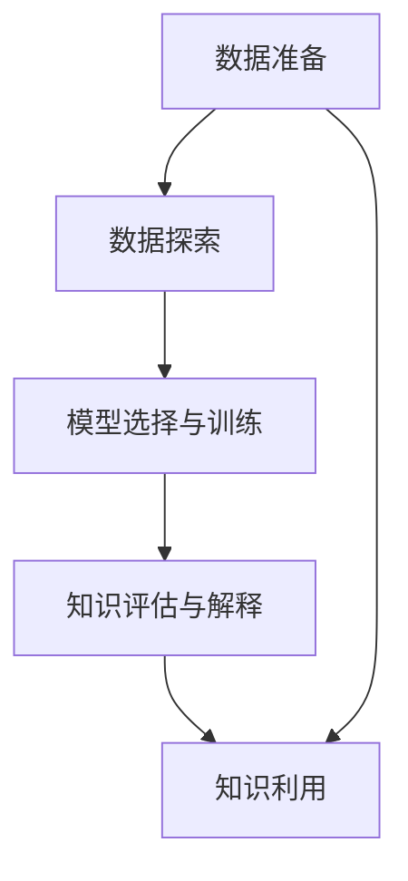

                 

# 知识发现之旅：探索未知，发现新知识

> 关键词：知识发现, 数据挖掘, 机器学习, 大数据, 深度学习, 自然语言处理

## 1. 背景介绍

### 1.1 问题由来

在当今信息爆炸的时代，数据量呈指数级增长，每天都在产生海量数据，其中蕴含着无限的知识和洞见。然而，如何将数据转化为有价值的知识，是摆在每个数据分析师和科学家面前的巨大挑战。数据挖掘（Data Mining），作为从数据中发现知识（Knowledge Discovery）的重要手段，旨在从大量数据中自动地发现有意义的模式、规律和关联，帮助我们理解数据背后的故事。

知识发现（Knowledge Discovery in Databases, KDD）则更进一步，不仅从数据中挖掘知识，还注重于这些知识的表示、评估和利用。近年来，随着大数据、人工智能和机器学习的快速发展，知识发现技术正逐步走出实验室，进入各行各业，为商业决策、医疗健康、科学研究等领域提供了强有力的支持。

### 1.2 问题核心关键点

知识发现的本质是从数据中提取有用信息，并转化为知识和洞察力的过程。在知识发现的过程中，核心的关键点包括：

1. **数据准备**：对原始数据进行清洗、转换和集成，形成可用于挖掘的数据集。
2. **数据探索**：利用统计分析、可视化等方法，对数据集进行初步探索，发现初步的知识模式。
3. **模型选择与训练**：选择合适的机器学习模型，对数据集进行训练，发现隐藏在数据背后的规律和关系。
4. **知识评估与解释**：对挖掘出的知识进行评估，确保其可靠性和有效性，并通过解释性分析，将知识转化为可理解的形式。
5. **知识利用**：将发现的知识应用于实际问题中，提供决策支持或改进业务流程。

这些关键点共同构成了知识发现的完整流程，帮助研究者和实践者高效地从数据中提取价值。

### 1.3 问题研究意义

研究知识发现技术，对于推动各行业数据驱动决策，提升业务效率和竞争力具有重要意义：

1. **决策支持**：知识发现技术可以自动分析和整合大量数据，帮助决策者发现数据背后的趋势和关联，制定更加科学合理的决策。
2. **市场分析**：通过消费者行为、市场趋势等数据挖掘，企业可以深入了解市场需求和变化，优化产品和服务策略。
3. **风险管理**：在金融、医疗等高风险领域，知识发现可以识别潜在的风险因素和预警信号，降低风险损失。
4. **个性化服务**：通过分析用户行为和偏好，企业可以提供更加个性化的产品和服务，提升用户体验。
5. **科学研究**：在科学研究中，知识发现技术可以帮助研究人员发现新的科学假设和研究路径，推动科学进步。

通过这些应用，知识发现技术已经成为推动数据科学发展、促进信息社会进步的重要工具。

## 2. 核心概念与联系

### 2.1 核心概念概述

为了更好地理解知识发现的流程和方法，我们首先需要了解一些核心的概念：

- **数据挖掘（Data Mining）**：从数据中提取有用信息和知识的过程，涉及统计学、机器学习和数据库技术。
- **知识发现（Knowledge Discovery）**：利用数据挖掘技术，从数据中发现有意义的模式、规律和关联。
- **机器学习（Machine Learning）**：通过数据训练模型，使模型能够自动地从数据中学习知识，并进行预测和决策。
- **深度学习（Deep Learning）**：一种特殊的机器学习方法，通过多层次的非线性模型，从数据中学习到更复杂、更抽象的知识表示。
- **自然语言处理（Natural Language Processing, NLP）**：使计算机能够理解、处理和生成自然语言的技术，广泛应用于知识发现中的文本挖掘和情感分析等任务。

这些概念共同构成了知识发现的理论和技术基础，帮助研究者从数据中提取有价值的知识，为实际应用提供支撑。

### 2.2 核心概念原理和架构的 Mermaid 流程图(Mermaid 流程节点中不要有括号、逗号等特殊字符)



这个流程图展示了知识发现的整个流程，从数据准备到知识利用的各个环节。每个环节都有其特定的技术方法和工具，共同构建了知识发现的完整框架。

## 3. 核心算法原理 & 具体操作步骤
### 3.1 算法原理概述

知识发现通常包括以下几个步骤：

1. **数据准备**：对原始数据进行清洗、转换和集成，形成可用于挖掘的数据集。
2. **数据探索**：利用统计分析、可视化等方法，对数据集进行初步探索，发现初步的知识模式。
3. **模型选择与训练**：选择合适的机器学习模型，对数据集进行训练，发现隐藏在数据背后的规律和关系。
4. **知识评估与解释**：对挖掘出的知识进行评估，确保其可靠性和有效性，并通过解释性分析，将知识转化为可理解的形式。
5. **知识利用**：将发现的知识应用于实际问题中，提供决策支持或改进业务流程。

这些步骤构成了知识发现的完整流程，帮助研究者和实践者高效地从数据中提取价值。

### 3.2 算法步骤详解

下面详细讲解知识发现的各个步骤：

**Step 1: 数据准备**

数据准备是知识发现的第一步，其目的是对原始数据进行清洗、转换和集成，形成可用于挖掘的数据集。主要包括以下几个步骤：

1. **数据收集**：从各种数据源（如数据库、日志文件、Web爬虫等）收集数据，确保数据的完整性和准确性。
2. **数据清洗**：对数据进行去重、去噪、填补缺失值等处理，保证数据的干净和一致性。
3. **数据转换**：将数据转换为适合挖掘的形式，如标准化、归一化、特征提取等。
4. **数据集成**：将来自不同数据源的数据进行合并，形成统一的、综合的数据集。

**Step 2: 数据探索**

数据探索是指利用统计分析、可视化等方法，对数据集进行初步探索，发现初步的知识模式。主要包括以下几个步骤：

1. **数据可视化**：通过绘制直方图、散点图、热力图等图表，直观地展示数据的基本特征和分布情况。
2. **统计分析**：利用均值、方差、相关系数等统计量，分析数据的中心趋势、离散程度和关系特征。
3. **数据聚类**：利用聚类算法（如K-means、层次聚类等），将数据分为不同的群组，发现数据中的自然分群。
4. **关联规则挖掘**：利用Apriori、FP-growth等算法，发现数据集中的频繁项集和关联规则，揭示数据中的潜在关系。

**Step 3: 模型选择与训练**

模型选择与训练是指选择合适的机器学习模型，对数据集进行训练，发现隐藏在数据背后的规律和关系。主要包括以下几个步骤：

1. **模型选择**：根据数据类型和任务需求，选择合适的机器学习模型（如回归模型、分类模型、聚类模型等）。
2. **模型训练**：利用训练集数据，对选定的模型进行训练，调整模型参数，优化模型性能。
3. **模型评估**：在验证集上对训练好的模型进行评估，选择性能最佳的模型。
4. **模型调优**：对评估结果进行分析，进一步调整模型参数，优化模型性能。

**Step 4: 知识评估与解释**

知识评估与解释是指对挖掘出的知识进行评估，确保其可靠性和有效性，并通过解释性分析，将知识转化为可理解的形式。主要包括以下几个步骤：

1. **知识验证**：利用测试集对模型进行验证，评估模型的泛化能力和准确性。
2. **知识解释**：通过可视化、特征分析等方法，解释模型的决策过程和预测结果，确保知识的可理解性和可解释性。
3. **知识迭代**：根据评估结果，对模型进行进一步调整和优化，提高知识的质量和可靠性。

**Step 5: 知识利用**

知识利用是指将发现的知识应用于实际问题中，提供决策支持或改进业务流程。主要包括以下几个步骤：

1. **知识应用**：将挖掘出的知识应用于实际问题中，如预测、分类、聚类等任务。
2. **业务改进**：根据知识发现的结果，改进业务流程，优化决策过程。
3. **效果评估**：对知识应用的实际效果进行评估，确保知识的实用性和有效性。

### 3.3 算法优缺点

知识发现技术具有以下优点：

1. **自动化程度高**：知识发现过程大部分由算法自动完成，减少了人工干预，提高了效率。
2. **发现潜在知识**：能够发现数据中隐藏的模式和关联，提供新的洞察和见解。
3. **可扩展性强**：适用于大规模数据集，能够处理海量数据并从中发现有用的知识。

同时，知识发现技术也存在一些缺点：

1. **数据质量要求高**：数据准备阶段对数据质量和一致性要求较高，清洗和转换过程复杂。
2. **模型选择困难**：不同模型适用于不同类型的数据和任务，选择合适的模型需要经验和试验。
3. **结果解释复杂**：复杂模型和算法往往难以解释其决策过程，需要进一步的研究和开发。

### 3.4 算法应用领域

知识发现技术在多个领域中得到了广泛应用，包括但不限于：

- **金融分析**：利用历史交易数据，发现市场趋势和风险因素，辅助投资决策。
- **医疗健康**：从患者数据中发现疾病模式和关联，支持医疗诊断和治疗。
- **市场分析**：分析消费者行为和市场趋势，优化产品和服务策略。
- **客户关系管理**：挖掘客户行为和偏好，提升客户满意度和忠诚度。
- **智能制造**：从生产数据中发现设备和工艺的运行规律，优化生产流程。
- **安全监控**：从监控数据中发现异常行为和安全威胁，保障信息安全。

## 4. 数学模型和公式 & 详细讲解 & 举例说明

### 4.1 数学模型构建

知识发现通常涉及多种数学模型，如回归模型、分类模型、聚类模型等。这里以回归模型为例，构建数学模型。

假设我们有 $n$ 个样本，每个样本有 $m$ 个特征 $x_i=(x_{i1},x_{i2},\ldots,x_{im})$，对应的标签为 $y_i$，回归模型的目标是从训练数据中学习一个函数 $f(x)$，使其能够预测标签 $y$。数学模型可以表示为：

$$
y_i = f(x_i) + \epsilon_i
$$

其中 $\epsilon_i$ 表示噪声项，假设服从高斯分布 $N(0,\sigma^2)$。

### 4.2 公式推导过程

回归模型的目标是最小化预测误差 $\epsilon_i$ 的平方和，即：

$$
\min_{f(x)} \sum_{i=1}^n (y_i - f(x_i))^2
$$

使用梯度下降法，求解最优函数 $f(x)$。对于线性回归模型，假设 $f(x)$ 为线性函数，即 $f(x) = \theta_0 + \theta_1 x_1 + \ldots + \theta_m x_m$，其中 $\theta_0, \theta_1, \ldots, \theta_m$ 为回归系数。

梯度下降法的更新公式为：

$$
\theta_j \leftarrow \theta_j - \eta \frac{\partial}{\partial \theta_j} \sum_{i=1}^n (y_i - f(x_i))^2
$$

将上述公式代入回归模型中，得到：

$$
\theta_j \leftarrow \theta_j - \eta \sum_{i=1}^n (y_i - \theta_0 - \theta_1 x_{i1} - \ldots - \theta_m x_{im})
$$

将求和项展开，得到：

$$
\theta_j \leftarrow \theta_j - \eta (y - \theta_0 x_1 - \ldots - \theta_m x_m)
$$

其中 $y = \frac{1}{n} \sum_{i=1}^n y_i$，$x_j = \frac{1}{n} \sum_{i=1}^n x_{ij}$。

### 4.3 案例分析与讲解

以房价预测为例，分析回归模型在知识发现中的应用。

假设有一组历史房价数据，包括面积、楼层、朝向、户型等信息。目标是预测新房子的价格，可以通过以下步骤进行：

1. **数据准备**：收集历史房价数据，清洗、转换和集成数据。
2. **数据探索**：绘制直方图、散点图，分析数据的基本特征和分布情况。
3. **模型选择与训练**：选择线性回归模型，利用训练集数据进行训练，得到回归系数 $\theta_j$。
4. **知识评估与解释**：在验证集上评估模型性能，解释模型的决策过程。
5. **知识利用**：利用模型对新房子的面积、楼层、朝向等特征进行预测，辅助房价评估和决策。

通过这个案例，可以看出知识发现技术在实际应用中的重要性和广泛性。

## 5. 项目实践：代码实例和详细解释说明

### 5.1 开发环境搭建

在进行知识发现项目开发前，我们需要准备好开发环境。以下是使用Python进行Scikit-learn开发的环境配置流程：

1. 安装Anaconda：从官网下载并安装Anaconda，用于创建独立的Python环境。

2. 创建并激活虚拟环境：
```bash
conda create -n sklearn-env python=3.8 
conda activate sklearn-env
```

3. 安装Scikit-learn：从官网获取安装命令，例如：
```bash
conda install scikit-learn
```

4. 安装其他必要的工具包：
```bash
pip install numpy pandas matplotlib seaborn
```

完成上述步骤后，即可在`sklearn-env`环境中开始知识发现实践。

### 5.2 源代码详细实现

这里我们以房价预测为例，给出使用Scikit-learn进行线性回归的Python代码实现。

首先，定义房价预测的数据处理函数：

```python
import pandas as pd
from sklearn.model_selection import train_test_split

def load_data():
    df = pd.read_csv('house_prices.csv')
    df = df.dropna()  # 删除缺失值
    features = df[['area', 'floor', 'orientation', 'type']]
    labels = df['price']
    return train_test_split(features, labels, test_size=0.2, random_state=42)
```

然后，定义模型和优化器：

```python
from sklearn.linear_model import LinearRegression
from sklearn.metrics import mean_squared_error

model = LinearRegression()
```

接着，定义训练和评估函数：

```python
def train_model(model, X_train, y_train):
    model.fit(X_train, y_train)
    return model

def evaluate_model(model, X_test, y_test):
    y_pred = model.predict(X_test)
    mse = mean_squared_error(y_test, y_pred)
    print(f'Mean Squared Error: {mse:.2f}')
```

最后，启动训练流程并在测试集上评估：

```python
X_train, X_test, y_train, y_test = load_data()

model = train_model(model, X_train, y_train)
evaluate_model(model, X_test, y_test)
```

以上就是使用Scikit-learn进行房价预测的知识发现任务的完整代码实现。可以看到，利用Scikit-learn进行线性回归的实现非常简洁高效。

### 5.3 代码解读与分析

让我们再详细解读一下关键代码的实现细节：

**load_data函数**：
- `pd.read_csv`方法：读取CSV格式的数据文件，并返回一个pandas DataFrame对象。
- `df.dropna`方法：删除包含缺失值的行，确保数据的完整性。
- `train_test_split`方法：将数据集划分为训练集和测试集，比例为80:20。

**train_model函数**：
- `model.fit`方法：利用训练集数据对模型进行训练，更新模型参数。

**evaluate_model函数**：
- `model.predict`方法：对测试集数据进行预测，返回预测结果。
- `mean_squared_error`方法：计算预测结果和真实标签之间的均方误差，评估模型性能。

**训练流程**：
- 使用`load_data`函数加载数据集，分为训练集和测试集。
- 调用`train_model`函数训练模型，得到训练好的模型对象。
- 调用`evaluate_model`函数评估模型性能，输出均方误差。

可以看到，Scikit-learn提供的机器学习工具库，使得知识发现任务的开发和实践变得非常简单快捷。

## 6. 实际应用场景

### 6.1 金融风控

在金融领域，风险管理是一个重要任务。通过知识发现技术，可以从大量的金融交易数据中挖掘出潜在的风险因素和模式，提前预警和规避风险。

具体应用包括：

- **信用评分**：利用历史贷款数据，发现影响贷款违约的关键因素，构建信用评分模型。
- **欺诈检测**：从交易数据中发现异常行为，及时检测和防范金融欺诈。
- **市场预测**：分析市场趋势和波动，预测股票价格和市场风险，支持投资决策。

### 6.2 医疗健康

在医疗领域，知识发现技术可以从海量的医疗数据中发现潜在的健康问题和风险因素，辅助医疗诊断和治疗。

具体应用包括：

- **疾病预测**：利用患者的健康数据，发现疾病发生的风险因素和早期预警信号，辅助疾病预防。
- **治疗方案优化**：分析治疗效果和副作用，优化治疗方案，提升治疗效果。
- **医疗资源配置**：分析医疗资源的使用情况，优化医疗资源配置，提高医疗服务效率。

### 6.3 智能制造

在制造业中，知识发现技术可以从生产数据中发现设备和工艺的运行规律，优化生产流程和质量控制。

具体应用包括：

- **设备故障预测**：利用设备的运行数据，发现设备故障的预警信号，提前进行维护。
- **生产流程优化**：分析生产过程中的异常和瓶颈，优化生产流程，提高生产效率。
- **质量控制**：从产品数据中发现质量问题，提升产品质量和生产线的稳定性。

### 6.4 未来应用展望

随着数据科学的不断发展，知识发现技术将迎来更加广阔的应用前景：

1. **大数据时代的到来**：数据量的爆炸性增长将为知识发现提供更加丰富的数据来源，推动其在更多领域的应用。
2. **深度学习的应用**：深度学习算法将进一步提升知识发现的精度和泛化能力，推动其在复杂任务中的应用。
3. **边缘计算的普及**：边缘计算技术将使得知识发现更加灵活和高效，适应多样化的应用场景。
4. **联邦学习的发展**：联邦学习技术将使得知识发现在大规模数据集上的分布式训练成为可能，提升模型的泛化能力。
5. **自动化程度提升**：知识发现过程的自动化程度将进一步提升，减少人工干预，提高效率和精度。

## 7. 工具和资源推荐

### 7.1 学习资源推荐

为了帮助开发者系统掌握知识发现的技术基础和实践技巧，这里推荐一些优质的学习资源：

1. 《Python机器学习》书籍：通过Python语言，详细介绍了机器学习的基本概念和常用算法，是学习知识发现技术的入门必读书籍。
2. 《Data Science from Scratch》书籍：从零开始介绍数据科学和机器学习的基本概念，适合初学者入门。
3. Coursera《机器学习》课程：由斯坦福大学Andrew Ng教授主讲，系统讲解了机器学习的理论和实践，是知识发现领域的重要学习资源。
4. Kaggle平台：提供各种数据集和竞赛，实战练习知识发现技术的开发和应用。
5. Scikit-learn官方文档：Scikit-learn的官方文档提供了丰富的学习资源和样例代码，适合快速入门和深入学习。

通过对这些资源的学习实践，相信你一定能够快速掌握知识发现技术的精髓，并用于解决实际的NLP问题。

### 7.2 开发工具推荐

高效的开发离不开优秀的工具支持。以下是几款用于知识发现开发的常用工具：

1. Jupyter Notebook：交互式编程环境，支持Python和R等语言，适合开发和分享知识发现任务的代码。
2. Matplotlib和Seaborn：绘图库，用于绘制各种图表，支持数据可视化。
3. Scikit-learn：机器学习库，提供了多种算法和工具，支持模型的选择、训练和评估。
4. Pandas：数据处理库，支持数据清洗、转换和集成，适合数据准备和探索。
5. TensorBoard：可视化工具，用于监控模型的训练过程和性能。

合理利用这些工具，可以显著提升知识发现任务的开发效率，加快创新迭代的步伐。

### 7.3 相关论文推荐

知识发现技术的发展源于学界的持续研究。以下是几篇奠基性的相关论文，推荐阅读：

1. 《On the Shoulder of Giants》书籍：Richard S. Sutton等，介绍了强化学习的基本概念和算法。
2. 《Machine Learning》书籍：Tom Mitchell等，详细讲解了机器学习的基本理论和算法。
3. 《Data Mining and Statistical Learning》书籍：Hastie等，介绍了数据挖掘和统计学习的理论和算法。
4. 《An Introduction to Statistical Learning》书籍：Gareth James等，介绍了统计学习的理论和算法。
5. 《Pattern Recognition and Machine Learning》书籍：Christopher Bishop，详细讲解了模式识别和机器学习的基本理论和算法。

这些论文代表了大数据和机器学习的理论前沿，通过学习这些前沿成果，可以帮助研究者把握学科前进方向，激发更多的创新灵感。

## 8. 总结：未来发展趋势与挑战

### 8.1 总结

本文对知识发现技术进行了全面系统的介绍。首先阐述了知识发现的背景和意义，明确了知识发现技术在各行业中的重要性和应用价值。其次，从原理到实践，详细讲解了知识发现的数学模型和算法流程，给出了知识发现任务的完整代码实现。同时，本文还探讨了知识发现技术在多个领域中的应用，展示了知识发现技术的广泛影响。此外，本文精选了知识发现技术的各类学习资源，力求为读者提供全方位的技术指引。

通过本文的系统梳理，可以看到，知识发现技术在数据科学中占据着核心地位，帮助研究者和实践者高效地从数据中提取价值。知识发现技术的不断发展，将推动数据驱动决策的普及，促进各行业的智能化和数字化转型。

### 8.2 未来发展趋势

展望未来，知识发现技术将呈现以下几个发展趋势：

1. **自动化程度提升**：知识发现过程的自动化程度将进一步提升，减少人工干预，提高效率和精度。
2. **深度学习的应用**：深度学习算法将进一步提升知识发现的精度和泛化能力，推动其在复杂任务中的应用。
3. **联邦学习的发展**：联邦学习技术将使得知识发现在大规模数据集上的分布式训练成为可能，提升模型的泛化能力。
4. **多模态数据融合**：知识发现技术将从单一模态扩展到多模态数据融合，实现视觉、语音、文本等多种数据源的协同建模。
5. **边缘计算的普及**：边缘计算技术将使得知识发现更加灵活和高效，适应多样化的应用场景。
6. **联邦学习的发展**：联邦学习技术将使得知识发现在大规模数据集上的分布式训练成为可能，提升模型的泛化能力。

### 8.3 面临的挑战

尽管知识发现技术已经取得了瞩目成就，但在迈向更加智能化、普适化应用的过程中，它仍面临着诸多挑战：

1. **数据质量瓶颈**：数据准备阶段对数据质量和一致性要求较高，清洗和转换过程复杂。
2. **模型选择困难**：不同模型适用于不同类型的数据和任务，选择合适的模型需要经验和试验。
3. **结果解释复杂**：复杂模型和算法往往难以解释其决策过程，需要进一步的研究和开发。
4. **隐私和安全问题**：知识发现过程中涉及大量敏感数据，隐私和安全问题需要特别注意。
5. **算力资源限制**：大规模知识发现任务对算力和存储资源要求较高，可能面临硬件瓶颈。

### 8.4 研究展望

面对知识发现面临的种种挑战，未来的研究需要在以下几个方面寻求新的突破：

1. **自动化工具的开发**：开发更加自动化的工具，简化数据准备和模型训练流程，提升知识发现的效率和精度。
2. **联邦学习的应用**：利用联邦学习技术，实现大规模数据集上的分布式训练，提高模型的泛化能力和效率。
3. **多模态数据融合**：开发多模态数据融合技术，实现视觉、语音、文本等多种数据源的协同建模，提升知识发现的全面性和准确性。
4. **知识发现算法优化**：开发更加高效和灵活的算法，提升知识发现的自动化和可解释性，减少人工干预。
5. **隐私和安全保护**：研究隐私保护技术，确保知识发现过程中的数据安全，防止数据泄露和滥用。

这些研究方向的探索，必将引领知识发现技术迈向更高的台阶，为数据驱动决策提供更加强大的技术支撑。面向未来，知识发现技术还需要与其他人工智能技术进行更深入的融合，如自然语言处理、图像处理、语音识别等，多路径协同发力，共同推动数据科学的发展。只有勇于创新、敢于突破，才能不断拓展知识发现的边界，让数据驱动的智能决策更加广泛地应用于各行业，推动信息社会的进步。

## 9. 附录：常见问题与解答

**Q1：什么是知识发现？**

A: 知识发现是从数据中提取有用信息和知识的过程，其目标是自动地发现数据中隐藏的模式、规律和关联，帮助用户理解数据背后的故事。

**Q2：知识发现与数据挖掘有何不同？**

A: 数据挖掘是从数据中发现有用信息和知识的过程，而知识发现则是从数据中提取知识，并对知识进行解释和应用。数据挖掘是知识发现的一个重要组成部分。

**Q3：知识发现的常用算法有哪些？**

A: 知识发现常用的算法包括回归分析、分类算法、聚类算法、关联规则挖掘算法等。具体算法的选择需根据数据类型和任务需求进行。

**Q4：知识发现技术在实际应用中有哪些挑战？**

A: 知识发现技术在实际应用中面临的数据质量、模型选择、结果解释、隐私安全等问题，需要研究者进行深入分析和解决。

**Q5：知识发现技术未来的发展方向是什么？**

A: 知识发现技术的未来发展方向包括自动化程度提升、深度学习应用、联邦学习、多模态数据融合等。

---

作者：禅与计算机程序设计艺术 / Zen and the Art of Computer Programming

