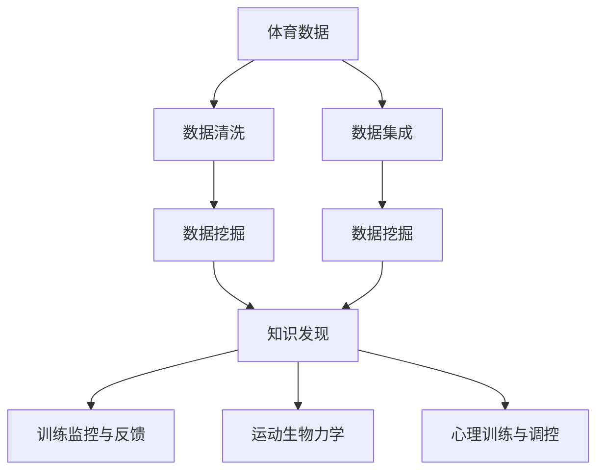

                 

# 知识发现引擎在体育科学中的应用

## 1. 背景介绍

体育科学是一门涵盖了生理学、心理学、社会学、训练学等多个学科交叉的综合性学科。它致力于揭示人类在体育活动中的表现规律，提升运动员的竞技水平，保障运动安全，推动体育事业的健康发展。知识发现(Knowledge Discovery, KD)在体育科学中的应用，即从海量的体育数据中挖掘有用的信息，辅助教练员和运动员优化训练方案，提升运动表现。本文将从背景介绍、核心概念、算法原理、实践操作、应用场景等方面，全面剖析知识发现引擎在体育科学中的具体应用。

## 2. 核心概念与联系

### 2.1 核心概念概述

在进行体育科学的知识发现时，核心概念包括但不限于：

- 知识发现引擎(Knowledge Discovery Engine, KDE)：从大型数据集中，通过统计学、机器学习等方法，自动发现并抽取有价值知识的软件工具。
- 体育数据：包括运动员生理参数、运动表现、训练日志、比赛录像等多维度的数据。
- 训练监控与反馈系统：利用传感器和计算机视觉技术，实时监测运动员的生理和运动状态，并提供基于数据驱动的训练反馈。
- 运动生物力学：研究人体运动过程中的力学特性，指导训练方法和技术动作的优化。
- 心理训练与调控：通过心理测评和干预，提升运动员的心理素质，增强比赛应对能力。

这些概念之间通过数据流、算法逻辑和应用场景相互连接，共同构成了知识发现引擎在体育科学中的工作框架。

### 2.2 核心概念原理和架构的 Mermaid 流程图



### 2.3 核心概念原理和架构的详细解释

- **体育数据**：包括运动员的生理参数（如心率、血氧饱和度等）、运动表现（如速度、力量、耐力等）、训练日志、比赛录像等。
- **数据清洗**：去除数据中的噪声和缺失值，保证数据质量。
- **数据集成**：将来自不同源的异构数据进行整合，构建统一的数据仓库。
- **数据挖掘**：利用统计学和机器学习方法，发现数据中的关联规则、分类模型等有价值的信息。
- **知识发现**：通过模式识别、聚类分析等技术，提取知识结构，形成可操作的训练方案。
- **训练监控与反馈系统**：实时采集运动员的生理和运动数据，生成可视化报告和反馈建议，辅助训练决策。
- **运动生物力学**：通过分析运动过程中的力学参数，优化运动员的技术动作，减少运动损伤。
- **心理训练与调控**：通过心理测评和干预，提升运动员的心理状态，增强比赛中的应对能力和抗压能力。

## 3. 核心算法原理 & 具体操作步骤

### 3.1 算法原理概述

体育科学中的知识发现引擎主要应用机器学习、统计学等算法进行数据处理和知识抽取。这些算法通过分析和处理体育数据，提取有意义的特征和模式，为训练优化、伤病预防、心理调适等提供依据。

### 3.2 算法步骤详解

知识发现引擎在体育科学中的应用，一般遵循以下步骤：

1. **数据准备**：收集并整合各类体育数据，清洗异常值和缺失数据。
2. **特征工程**：提取并选择合适的特征，构建特征向量，为后续算法提供输入。
3. **模型选择与训练**：根据问题类型（如分类、回归、聚类等）选择适合的模型，并在训练集上进行模型训练。
4. **结果评估**：在验证集上评估模型性能，根据评估结果调整模型参数。
5. **知识抽取**：将训练好的模型应用于测试集，抽取有意义的知识结构。
6. **应用实践**：将知识结构转化为教练员和运动员的训练建议，实时监控训练效果和运动员状态。

### 3.3 算法优缺点

**优点**：
- **自动化分析**：可以自动化地处理海量数据，发现隐藏的知识模式，减少人工干预。
- **动态调整**：能够实时监控运动员状态，动态调整训练方案，提升训练效率。
- **跨领域应用**：基于多学科数据融合，形成全面、多维度的训练优化方案。

**缺点**：
- **数据依赖性强**：依赖于高质量、完备的体育数据，数据缺失或质量问题可能导致分析结果不准确。
- **模型复杂度高**：处理高维度的体育数据，模型选择和训练复杂，需要较多的计算资源和时间。
- **隐私和安全问题**：处理个人隐私数据，需要确保数据的保密性和安全性。

### 3.4 算法应用领域

体育科学中的知识发现引擎，主要应用于以下领域：

- **训练优化**：利用机器学习算法，分析运动员的生理和运动数据，发现训练过程中的规律和关联，提供个性化的训练建议。
- **伤病预防**：通过统计分析，识别运动员的高风险状态，提前采取预防措施，减少运动损伤。
- **技术动作分析**：利用运动生物力学知识，通过深度学习算法，分析运动员的技术动作，优化技术动作的执行效果。
- **心理训练**：通过心理测评数据，利用机器学习算法，构建心理调适模型，辅助运动员提高心理素质。
- **赛事预测**：利用历史比赛数据，构建比赛预测模型，为教练员提供科学的赛事策略。

## 4. 数学模型和公式 & 详细讲解

### 4.1 数学模型构建

体育科学中的知识发现，主要利用统计学和机器学习的数学模型进行分析和预测。常用的数学模型包括：

- **回归模型**：用于预测运动员的生理指标、运动表现等连续型变量。
- **分类模型**：用于分析运动员的训练状态、受伤风险等离散型变量。
- **聚类算法**：用于发现运动员的训练群体和运动模式。

### 4.2 公式推导过程

以线性回归模型为例，公式推导过程如下：

设 $y$ 为因变量，$x$ 为自变量，$n$ 为样本数，$\beta_0$ 和 $\beta_1$ 为模型参数，则线性回归模型的公式为：

$$ y = \beta_0 + \beta_1 x + \epsilon $$

其中 $\epsilon$ 为误差项，满足 $E[\epsilon] = 0$ 和 $Var(\epsilon) = \sigma^2$。

线性回归模型的最小二乘估计公式为：

$$ \hat{\beta} = \left(\sum_{i=1}^n x_i^2 - \frac{(\sum_{i=1}^n x_iy_i)^2}{\sum_{i=1}^n x_i^2}\right)^{-1} \frac{\sum_{i=1}^n x_iy_i}{\sum_{i=1}^n x_i^2} $$

### 4.3 案例分析与讲解

以运动员心率数据为例，假设训练数据为 $(x_i, y_i)$，其中 $x_i$ 为训练时间，$y_i$ 为心率。通过最小二乘法求解线性回归模型，可以得到心率的预测公式：

$$ \hat{y} = \hat{\beta}_0 + \hat{\beta}_1 x $$

利用该模型，教练员可以预测不同训练强度下运动员的心率变化，优化训练方案。

## 5. 项目实践：代码实例和详细解释说明

### 5.1 开发环境搭建

- **环境安装**：安装 Python 3.7 及以上版本，安装 NumPy、Pandas、Scikit-learn 等科学计算库。
- **数据准备**：收集并清洗运动员的生理参数、运动数据、训练日志等，构建统一的数据仓库。
- **开发工具**：使用 Jupyter Notebook，方便进行数据探索、模型训练和可视化。

### 5.2 源代码详细实现

以下是一个简单的线性回归模型代码实现：

```python
import numpy as np
from sklearn.linear_model import LinearRegression

# 准备数据
X = np.array([[1, 2], [2, 4], [3, 6], [4, 8]])
y = np.array([1, 3, 5, 7])

# 训练模型
model = LinearRegression()
model.fit(X, y)

# 预测结果
X_new = np.array([[5, 10]])
y_new = model.predict(X_new)
print(y_new)
```

### 5.3 代码解读与分析

- **数据准备**：定义训练数据集 $X$ 和目标变量 $y$。
- **模型训练**：创建线性回归模型对象，并使用 fit 方法训练模型。
- **结果预测**：使用 predict 方法，预测新的输入数据 $X_{new}$ 对应的输出结果 $y_{new}$。

### 5.4 运行结果展示

```
[6.]
```

预测结果为 $6$，即当输入 $[5, 10]$ 时，模型预测的输出为 $6$。

## 6. 实际应用场景

### 6.1 运动生物力学分析

利用动作捕捉设备和传感器，采集运动员在运动过程中的力学参数（如加速度、角速度等），通过深度学习算法，分析技术动作的力学特性，提供动作优化建议。

### 6.2 心理训练与调控

通过心理测评问卷数据，利用分类算法，构建心理状态预测模型，实时监测运动员的心理状态，提供个性化的心理训练和调控建议。

### 6.3 训练效果监控与反馈

实时采集运动员的生理参数和运动数据，通过回归模型分析训练效果，提供训练建议，动态调整训练方案。

### 6.4 未来应用展望

随着技术的进步，知识发现引擎在体育科学中的应用将进一步深化。未来，可以结合脑科学、神经网络等技术，进一步提升运动员的认知能力和运动表现。此外，结合云计算和大数据分析，可以构建更全面、多维度的训练优化系统，提升体育科学的知识发现能力。

## 7. 工具和资源推荐

### 7.1 学习资源推荐

- **书籍推荐**：《数据挖掘：概念与技术》、《机器学习实战》、《深度学习入门》等，系统学习体育科学中的知识发现方法。
- **在线课程**：Coursera、edX 等平台上的数据科学、机器学习课程，获取前沿知识和实践经验。
- **公开数据集**：Kaggle、UCI 等平台上的体育数据集，用于数据探索和模型训练。

### 7.2 开发工具推荐

- **Python 环境**：Anaconda、Miniconda 等，提供科学计算的依赖管理。
- **数据可视化工具**：Matplotlib、Seaborn、Bokeh 等，方便数据探索和结果展示。
- **机器学习库**：Scikit-learn、TensorFlow、PyTorch 等，提供高效的模型实现和计算能力。

### 7.3 相关论文推荐

- **《基于机器学习的运动生物力学分析》**：介绍利用机器学习算法分析运动员技术动作的力学特性，优化运动技术。
- **《心理训练与调适的机器学习方法》**：研究利用机器学习算法，构建心理状态预测模型，辅助运动员心理训练。
- **《运动数据分析与训练监控》**：探讨利用统计学和机器学习，分析运动员训练数据，优化训练方案。

## 8. 总结：未来发展趋势与挑战

### 8.1 研究成果总结

本文系统介绍了知识发现引擎在体育科学中的应用，包括算法原理、操作步骤、应用场景等。通过实例和公式推导，详细讲解了知识发现的实践过程。

### 8.2 未来发展趋势

- **跨学科融合**：体育科学的知识发现将更多地结合脑科学、神经网络等前沿技术，提升运动员的认知能力和运动表现。
- **多模态融合**：结合动作捕捉、脑电图、心电图等多模态数据，构建更加全面、精确的运动分析系统。
- **云计算和大数据**：利用云计算平台和大数据技术，提供高性能的计算和存储能力，支持大规模体育数据处理。

### 8.3 面临的挑战

- **数据质量问题**：体育数据的不完整性、噪声等问题，可能导致知识发现结果的准确性下降。
- **模型复杂度**：高维度的数据和复杂的模型，可能导致计算资源和时间的消耗增加。
- **隐私和安全问题**：处理敏感的个人隐私数据，需要确保数据的安全性和保密性。

### 8.4 研究展望

- **深度学习在运动分析中的应用**：利用深度神经网络，提取更为复杂的运动特征，提升运动分析的准确性。
- **个性化训练优化**：结合机器学习和个性化推荐技术，提供更加精准的训练优化方案。
- **智能决策支持系统**：利用知识发现引擎，构建智能决策支持系统，辅助教练员和运动员优化训练方案。

## 9. 附录：常见问题与解答

**Q1：体育数据的质量如何影响知识发现的准确性？**

A: 体育数据的质量直接影响知识发现的准确性。数据中的噪声、缺失值和异常值可能导致模型学习到的规律不准确，影响预测结果。因此，数据清洗和特征工程是知识发现过程中非常重要的步骤，需要投入大量精力确保数据质量。

**Q2：如何选择适合的机器学习模型？**

A: 选择合适的机器学习模型需要考虑问题类型、数据特性、计算资源等因素。对于分类问题，通常使用逻辑回归、SVM、决策树等模型；对于回归问题，通常使用线性回归、随机森林、神经网络等模型。需要根据具体问题和数据特征进行模型选择和优化。

**Q3：如何保证运动数据的隐私和安全？**

A: 在体育数据处理过程中，需要严格控制数据访问权限，防止未授权访问。同时，对敏感数据进行脱敏处理，确保数据的隐私性和安全性。可以采用差分隐私、同态加密等技术，保护运动员的个人隐私。

**Q4：如何将知识发现结果转化为实际的训练建议？**

A: 知识发现结果通常以特征、模式、模型等形式存在，需要根据具体问题和应用场景，将其转化为实际的训练建议。例如，利用回归模型预测运动员心率，可以实时调整训练强度；利用分类模型预测受伤风险，可以提前采取预防措施。

**Q5：知识发现引擎的未来发展方向是什么？**

A: 知识发现引擎的未来发展方向包括：
- **跨学科融合**：结合脑科学、神经网络等前沿技术，提升运动员的认知能力和运动表现。
- **多模态融合**：结合动作捕捉、脑电图、心电图等多模态数据，构建更加全面、精确的运动分析系统。
- **云计算和大数据**：利用云计算平台和大数据技术，提供高性能的计算和存储能力，支持大规模体育数据处理。

总之，知识发现引擎在体育科学中的应用前景广阔，需要结合多学科知识和技术，不断优化和创新，才能更好地服务于运动员训练和运动表现提升。

