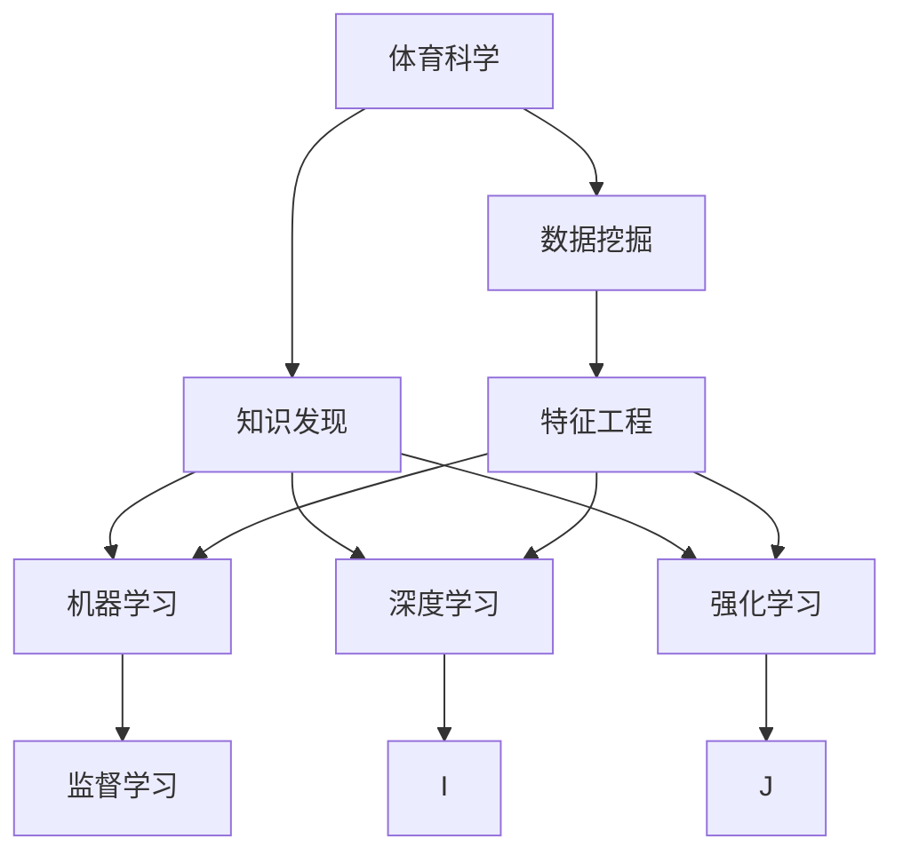
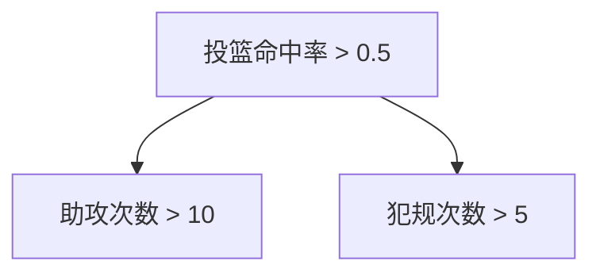

                 

# 知识发现引擎在体育科学中的应用

> 关键词：体育科学，知识发现引擎，数据挖掘，机器学习，AI

## 1. 背景介绍

### 1.1 问题由来
体育科学作为一个跨学科的领域，涉及运动生理学、生物力学、心理學、社会学等多个学科的交叉研究。传统的体育科学研究依赖于大量的现场实验和主观评估，往往耗时耗力，且结论的普适性受到限制。近年来，随着人工智能和大数据技术的迅猛发展，数据驱动的体育科学研究方法逐渐兴起。体育科学中蕴含的海量数据，为知识发现引擎(Knowledge Discovery Engine, KDE)的应用提供了广阔的空间。

体育科学中的知识发现，不仅包括对运动员体能、技能、心理等多维度的分析，还包括对比赛战术、训练方法、伤病预防等的研究。通过高效的数据挖掘和机器学习算法，可以在运动员数据、比赛数据、训练数据等海量数据中自动发现规律，辅助教练员和运动员做出科学决策。

### 1.2 问题核心关键点
体育科学中知识发现的挑战主要包括：
1. 数据获取：获取运动员比赛、训练等数据，并实现数据标准化。
2. 数据处理：处理大规模高维数据，避免数据质量问题。
3. 数据分析：选择合适的机器学习算法，进行特征提取和模式识别。
4. 结果验证：验证模型的预测效果，确保发现的规律具有实际应用价值。
5. 知识应用：将模型结果转化为可操作的动作指导，辅助教练员和运动员。

本文将详细介绍基于知识发现引擎的体育科学应用，特别是机器学习算法在体育领域的具体应用。

## 2. 核心概念与联系

### 2.1 核心概念概述

为更好地理解知识发现引擎在体育科学中的应用，本节将介绍几个密切相关的核心概念：

- 体育科学：研究人体运动能力及其规律的一门综合性学科，涵盖运动生理、生物力学、运动心理学等。
- 数据挖掘(Data Mining)：从大量数据中提取有价值信息的过程，包括统计学、机器学习等方法。
- 知识发现(Knowledge Discovery)：利用数据挖掘技术，发现潜在知识模式和关联关系的过程。
- 机器学习(Machine Learning)：通过数据训练模型，使模型具有预测和分类能力的技术。
- 深度学习(Deep Learning)：一种高级机器学习方法，使用多层次神经网络模型处理复杂数据。
- 强化学习(Reinforcement Learning)：通过智能体与环境交互，学习最优策略的机器学习方法。
- 可解释性(Interpretability)：机器学习模型结果的可解释性和可理解性，是保证模型可靠性的重要指标。
- 特征工程(Feature Engineering)：选择、构造和提取相关特征，提升模型预测效果的过程。
- 监督学习(Supervised Learning)：利用已标注数据训练模型，实现分类和回归任务。

这些概念之间的逻辑关系可以通过以下Mermaid流程图来展示：



这个流程图展示了几组核心概念之间的联系：

1. 体育科学通过数据挖掘技术获取、处理和分析数据。
2. 数据挖掘利用机器学习和深度学习算法进行知识发现。
3. 知识发现的结果可以通过特征工程进行进一步处理和优化。
4. 机器学习、深度学习和强化学习算法在知识发现中各司其职。
5. 监督学习算法是机器学习中的一种，用于训练分类和回归模型。

这些概念共同构成了体育科学中知识发现的理论框架，为利用知识发现引擎进行数据分析和模型训练提供了基础。

## 3. 核心算法原理 & 具体操作步骤

### 3.1 算法原理概述

基于知识发现引擎的体育科学应用，本质上是一个数据挖掘和机器学习的过程。其核心思想是：

1. **数据预处理**：对原始数据进行清洗、归一化等预处理，以提升数据质量。
2. **特征选择**：从数据中提取有用的特征，用于机器学习模型的训练。
3. **模型训练**：利用监督学习、非监督学习、半监督学习等算法，训练模型进行分类、回归、聚类等任务。
4. **结果验证**：通过交叉验证、独立测试集等方式，验证模型的预测效果。
5. **知识应用**：将模型应用于运动员训练计划、比赛战术、伤病预防等方面，实现知识发现。

### 3.2 算法步骤详解

**Step 1: 数据准备**

- 收集运动员的比赛、训练等数据，包括技术统计、生理数据、心理数据等。
- 数据清洗：去除缺失值、异常值，确保数据质量。
- 数据归一化：对不同量级的数据进行标准化处理。

**Step 2: 特征选择与提取**

- 识别重要特征：选择与目标变量相关的特征，如速度、力量、心率等。
- 构造新特征：通过组合和变换，构造新的特征，如平均速度、加速度等。
- 特征提取：使用主成分分析(PCA)、独立成分分析(ICA)等算法提取数据中的潜在特征。

**Step 3: 模型训练**

- 选择合适的机器学习算法：如决策树、随机森林、支持向量机(SVM)、神经网络等。
- 训练模型：使用训练集数据训练模型，优化模型参数。
- 交叉验证：将数据集分为训练集和验证集，使用交叉验证验证模型泛化能力。

**Step 4: 结果验证**

- 独立测试集验证：使用独立测试集评估模型性能。
- 模型调优：根据验证结果调整模型参数，提高预测精度。

**Step 5: 知识应用**

- 训练计划优化：根据模型预测结果，调整运动员的训练计划。
- 比赛战术调整：根据模型分析结果，调整比赛战术。
- 伤病预防：通过模型分析，预防和处理运动员伤病。

### 3.3 算法优缺点

基于知识发现引擎的体育科学应用，具有以下优点：
1. 自动化程度高：数据处理和特征提取自动化，节省了大量人力成本。
2. 预测精度高：利用机器学习算法，可以自动发现数据中的潜在规律，预测效果较好。
3. 适用性广：适用于各种类型的体育数据，包括运动员体能、技能、心理等。
4. 可解释性好：机器学习模型的可解释性较好，可以方便地解释模型结果。

同时，该方法也存在以下缺点：
1. 数据质量要求高：数据收集和处理过程中容易出现数据质量问题。
2. 算法复杂度高：需要选择合适的机器学习算法，并进行参数调优。
3. 对领域知识要求高：需要领域专家进行特征选择和模型解释。
4. 结果解释难度大：复杂的机器学习模型可能难以解释，影响结果的实际应用。

### 3.4 算法应用领域

基于知识发现引擎的体育科学应用，已在多个领域取得了显著成果：

1. 运动员体能分析：利用机器学习模型，分析运动员的速度、力量、耐力等指标，评估运动员状态。
2. 比赛战术研究：通过分析比赛录像和数据，发现比赛中的战术模式和规律，辅助教练员制定战术。
3. 训练计划优化：利用机器学习模型，生成最优的训练计划，提升运动员训练效果。
4. 伤病预防：通过模型分析，预测运动员的伤病风险，提前采取预防措施。
5. 技术动作分析：利用机器视觉和深度学习算法，自动分析运动员技术动作，识别动作缺陷和改进空间。

## 4. 数学模型和公式 & 详细讲解  
### 4.1 数学模型构建

本节将使用数学语言对基于知识发现引擎的体育科学应用进行更加严格的刻画。

记运动员比赛数据为 $D=\{(x_i, y_i)\}_{i=1}^N, x_i \in \mathcal{X}, y_i \in \mathcal{Y}$，其中 $x_i$ 表示运动员比赛中的各种数据指标，$y_i$ 表示比赛结果（如胜负）。假设选择 $M$ 个特征 $f_1(x), f_2(x), \cdots, f_M(x)$，利用监督学习算法 $f$ 训练模型，得到预测结果 $\hat{y}$。

定义预测误差为 $e_i = y_i - \hat{y}_i$，训练集上均方误差损失为：

$$
\mathcal{L}(f) = \frac{1}{N} \sum_{i=1}^N e_i^2
$$

模型参数优化目标为：

$$
\theta^* = \mathop{\arg\min}_{\theta} \mathcal{L}(f_{\theta})
$$

其中 $\theta$ 为模型参数，$f_{\theta}$ 为参数化后的模型函数。

### 4.2 公式推导过程

以下我们以决策树算法为例，推导训练过程中的误差函数和优化公式。

假设训练集 $D$ 中包含 $N$ 个样本，每个样本有 $M$ 个特征 $x_{ij}$。决策树的目标是找到最优的特征和阈值，使得分类误差最小。决策树模型的预测结果为：

$$
\hat{y} = f_{\theta}(x) = \sum_{i=1}^M \theta_i f_i(x)
$$

其中 $\theta_i$ 为决策树模型的参数，$f_i(x)$ 为第 $i$ 个特征的决策函数。

决策树的损失函数为：

$$
\mathcal{L}(f) = \frac{1}{N} \sum_{i=1}^N \ell(f(x_i), y_i)
$$

其中 $\ell$ 为损失函数，如交叉熵损失、均方误差损失等。

决策树的优化目标是找到最优的决策树模型，使得预测误差最小。假设决策树模型为 $T$，目标函数为：

$$
\mathcal{L}(T) = \frac{1}{N} \sum_{i=1}^N \ell(T(x_i), y_i)
$$

通过梯度下降等优化算法，不断更新模型参数 $\theta$，最小化损失函数 $\mathcal{L}(T)$，得到最优的决策树模型 $T^*$。

### 4.3 案例分析与讲解

假设某篮球队希望通过机器学习预测比赛结果，根据历史数据训练模型。首先，选择以下特征：

1. 投篮命中率：球员在比赛中每投中的次数与总次数的比率。
2. 助攻次数：球员在比赛中传球助攻的次数。
3. 犯规次数：球员在比赛中犯规的次数。

利用决策树算法，构建如下决策树模型：



训练集数据如下：

| 投篮命中率 | 助攻次数 | 犯规次数 | 比赛结果 |
| ----------- | -------- | -------- | -------- |
| 0.6         | 15       | 3        | 胜       |
| 0.4         | 5        | 2        | 负       |
| 0.8         | 10       | 4        | 胜       |
| 0.5         | 12       | 7        | 胜       |
| 0.7         | 6        | 2        | 负       |

训练过程中，使用交叉熵损失函数计算误差，使用梯度下降算法更新模型参数。最终得到决策树模型 $T$，该模型可以用于预测新比赛的胜负。

## 5. 项目实践：代码实例和详细解释说明
### 5.1 开发环境搭建

在进行知识发现引擎应用实践前，我们需要准备好开发环境。以下是使用Python进行Scikit-Learn开发的环境配置流程：

1. 安装Anaconda：从官网下载并安装Anaconda，用于创建独立的Python环境。

2. 创建并激活虚拟环境：
```bash
conda create -n sklearn-env python=3.8 
conda activate sklearn-env
```

3. 安装Scikit-Learn：
```bash
pip install scikit-learn
```

4. 安装各类工具包：
```bash
pip install numpy pandas matplotlib seaborn jupyter notebook
```

完成上述步骤后，即可在`sklearn-env`环境中开始知识发现引擎应用实践。

### 5.2 源代码详细实现

下面以篮球比赛结果预测为例，给出使用Scikit-Learn库进行决策树模型微调的Python代码实现。

首先，定义训练集和测试集：

```python
from sklearn.model_selection import train_test_split
from sklearn.tree import DecisionTreeClassifier

X_train, X_test, y_train, y_test = train_test_split(features_train, labels_train, test_size=0.2, random_state=42)
```

然后，定义模型和参数：

```python
clf = DecisionTreeClassifier(max_depth=3, criterion='gini')
clf.fit(X_train, y_train)
```

接着，定义评估函数：

```python
from sklearn.metrics import accuracy_score

def evaluate(model, X, y):
    y_pred = model.predict(X)
    return accuracy_score(y, y_pred)
```

最后，启动训练流程并在测试集上评估：

```python
for depth in range(1, 10):
    clf.set_params(max_depth=depth)
    clf.fit(X_train, y_train)
    print(f"Depth {depth}, accuracy: {evaluate(clf, X_test, y_test)}")
```

以上就是使用Scikit-Learn库进行决策树模型微调的完整代码实现。可以看到，通过Scikit-Learn库，可以轻松地构建、训练和评估决策树模型。

### 5.3 代码解读与分析

让我们再详细解读一下关键代码的实现细节：

**train_test_split函数**：
- 将数据集随机分为训练集和测试集，设定测试集大小为20%，随机种子为42，确保每次运行结果一致。

**DecisionTreeClassifier模型**：
- 构造决策树模型，设定最大树深为3，使用基尼指数作为分裂准则。

**evaluate函数**：
- 定义评估函数，计算模型在测试集上的准确率。

**模型训练和评估**：
- 通过遍历不同树深，使用交叉验证的方法训练和评估模型，找到最优的树深参数。

可以看到，Scikit-Learn库使得机器学习算法的应用变得简单高效，适合快速原型设计和算法验证。但实际应用中，还需要根据具体任务调整模型参数、优化特征选择，并进行模型调优和结果验证。

## 6. 实际应用场景
### 6.1 智能训练计划生成

知识发现引擎可以应用于运动员的智能训练计划生成。通过分析运动员历史数据，模型可以预测不同训练计划对运动员状态的影响，生成最优的训练方案。

在技术实现上，可以收集运动员的训练数据，包括训练强度、恢复时间、营养摄入等。将训练数据作为输入，利用回归模型预测运动员体能、技能、心理等指标，生成最优训练计划。例如，通过分析不同训练强度对运动员耐力、速度等指标的影响，生成最适合运动员的训练计划。

### 6.2 比赛战术调整

知识发现引擎可以应用于比赛战术的调整。通过分析历史比赛数据，模型可以发现不同的战术组合和结果之间的关系，辅助教练员调整战术。

在技术实现上，可以收集运动员的比赛数据，包括得分、助攻、篮板等技术统计数据，以及对手的比赛数据。将比赛数据作为输入，利用分类模型预测比赛结果，分析战术组合的优劣，生成最佳战术组合。例如，通过分析不同战术组合在各种情境下的胜负率，生成最优的战术组合，提升比赛胜率。

### 6.3 伤病预防

知识发现引擎可以应用于伤病预防。通过分析运动员历史数据，模型可以预测运动员的伤病风险，提前采取预防措施。

在技术实现上，可以收集运动员的历史数据，包括训练强度、比赛频率、伤病记录等。将数据作为输入，利用回归模型预测运动员的伤病风险，生成预防措施。例如，通过分析不同训练强度和比赛频率对运动员伤病率的影响，生成预防措施，如调整训练强度、休息时间等，降低伤病发生率。

### 6.4 未来应用展望

随着知识发现引擎技术的发展，其在体育科学中的应用前景更加广阔。未来，知识发现引擎可以应用于更多领域，如运动员选拔、运动员心理分析、比赛预测等，为体育科学带来更多的创新和突破。

1. 运动员选拔：利用知识发现引擎，自动分析运动员历史数据，生成最优的选拔标准和方案。
2. 运动员心理分析：利用机器学习算法，分析运动员的心理状态，如焦虑、压力等，生成心理辅导方案。
3. 比赛预测：利用知识发现引擎，分析比赛数据，生成比赛预测结果，辅助教练员制定战术。

## 7. 工具和资源推荐
### 7.1 学习资源推荐

为了帮助开发者系统掌握知识发现引擎的理论基础和实践技巧，这里推荐一些优质的学习资源：

1. 《机器学习实战》系列博文：由机器学习专家撰写，详细介绍了机器学习的基本概念和经典算法。

2. CS229《机器学习》课程：斯坦福大学开设的机器学习明星课程，提供Lecture视频和配套作业，带你深入学习机器学习理论。

3. 《Pattern Recognition and Machine Learning》书籍：机器学习经典教材，系统介绍了机器学习的基本理论和方法。

4. Kaggle竞赛：平台提供大量数据集和算法实现，适合初学者和进阶学习者进行实践。

5. scikit-learn官方文档：Scikit-Learn库的官方文档，提供了丰富的方法和案例，适合学习应用。

通过对这些资源的学习实践，相信你一定能够快速掌握知识发现引擎的精髓，并用于解决实际的体育科学问题。
###  7.2 开发工具推荐

高效的开发离不开优秀的工具支持。以下是几款用于知识发现引擎应用的常用工具：

1. Jupyter Notebook：交互式笔记本环境，适合进行数据分析和机器学习实践。

2. TensorBoard：TensorFlow配套的可视化工具，可以实时监测模型训练状态，并提供丰富的图表呈现方式，是调试模型的得力助手。

3. Weights & Biases：模型训练的实验跟踪工具，可以记录和可视化模型训练过程中的各项指标，方便对比和调优。

4. Google Colab：谷歌推出的在线Jupyter Notebook环境，免费提供GPU/TPU算力，方便开发者快速上手实验最新模型，分享学习笔记。

合理利用这些工具，可以显著提升知识发现引擎应用的开发效率，加快创新迭代的步伐。

### 7.3 相关论文推荐

知识发现引擎的发展源于学界的持续研究。以下是几篇奠基性的相关论文，推荐阅读：

1. Decision Trees: Theory and Applications（决策树理论与应用）：介绍了决策树算法的原理和应用，是决策树研究的经典之作。

2. Support Vector Machines for Pattern Recognition（支持向量机）：提出了支持向量机算法，是机器学习领域的经典算法之一。

3. Deep Learning（深度学习）：深度学习领域的开创性论文，介绍了深度神经网络的理论基础和应用。

4. Gradient Boosting Machines（梯度提升树）：提出了梯度提升树算法，是提升模型性能的重要工具。

5. Ensemble Methods in Data Mining（集成方法）：介绍了集成学习的理论基础和应用，是机器学习的重要研究方向。

这些论文代表了大规模知识发现引擎技术的发展脉络。通过学习这些前沿成果，可以帮助研究者把握学科前进方向，激发更多的创新灵感。

## 8. 总结：未来发展趋势与挑战

### 8.1 总结

本文对基于知识发现引擎的体育科学应用进行了全面系统的介绍。首先阐述了体育科学中数据挖掘和机器学习的应用背景和意义，明确了知识发现引擎在提升体育科学研究效率和效果方面的重要价值。其次，从原理到实践，详细讲解了知识发现引擎的数学模型和关键算法，给出了体育科学应用的具体代码实现。同时，本文还广泛探讨了知识发现引擎在运动员体能分析、比赛战术调整、伤病预防等多个领域的应用前景，展示了知识发现引擎技术的多样性和潜力。

通过本文的系统梳理，可以看到，知识发现引擎在体育科学中的应用，不仅能够提升研究效率，还能带来更准确、可靠的预测结果。未来，随着数据量的增加和计算能力的提升，知识发现引擎将在体育科学中发挥越来越重要的作用，为运动员的训练、比赛、伤病预防等提供更科学的指导。

### 8.2 未来发展趋势

展望未来，知识发现引擎技术将呈现以下几个发展趋势：

1. 数据融合与跨领域研究：将来自不同领域的数据进行融合，提升知识发现的效果。例如，将运动员的比赛数据与气象数据、运动场馆数据进行结合，发现更多规律。

2. 实时分析和预测：利用云计算和大数据技术，实现实时分析和预测。例如，在比赛中实时分析运动员表现，及时调整战术。

3. 多模态数据融合：将文本、图像、视频等不同类型的数据进行融合，提升知识发现的全面性和准确性。

4. 深度学习与强化学习结合：将深度学习和强化学习算法结合，提升模型的智能性和决策能力。

5. 可解释性增强：通过模型解释技术，提升知识发现引擎的透明度和可靠性，确保结果的可解释性。

6. 人工智能与体育结合：将人工智能技术引入体育科学，推动体育科学智能化发展。

这些趋势凸显了知识发现引擎技术的广阔前景。这些方向的探索发展，必将进一步提升体育科学研究的深度和广度，为运动员训练和比赛提供更科学的指导。

### 8.3 面临的挑战

尽管知识发现引擎技术已经取得了瞩目成就，但在迈向更加智能化、普适化应用的过程中，它仍面临着诸多挑战：

1. 数据获取难度大：获取高质量体育数据，特别是实时数据，存在技术和成本瓶颈。

2. 数据质量参差不齐：体育数据来源多样，质量参差不齐，需要复杂的数据清洗和预处理。

3. 算法复杂度高：选择合适的机器学习算法和进行参数调优，需要较高的技术水平。

4. 结果解释难度大：复杂的机器学习模型可能难以解释，影响结果的实际应用。

5. 应用场景多样：不同体育项目和场景，需要不同的数据处理和算法选择。

6. 实时性要求高：实时分析和预测需要高计算能力和数据处理速度。

正视知识发现引擎面临的这些挑战，积极应对并寻求突破，将是大规模知识发现引擎走向成熟的必由之路。相信随着学界和产业界的共同努力，这些挑战终将一一被克服，知识发现引擎必将在体育科学中发挥更大的作用。

### 8.4 研究展望

面对知识发现引擎技术所面临的种种挑战，未来的研究需要在以下几个方面寻求新的突破：

1. 数据融合技术：发展数据融合技术，实现不同类型和来源数据的统一和整合，提升数据质量和可用性。

2. 实时数据处理：开发实时数据处理技术，支持高计算密度和实时性要求。

3. 智能模型训练：研究智能模型训练方法，提升模型泛化能力和可解释性。

4. 多模态数据融合：研究多模态数据融合方法，提升知识发现的全面性和准确性。

5. 跨领域应用：将知识发现引擎应用于更多领域，探索新的应用场景和价值。

这些研究方向将引领知识发现引擎技术迈向更高的台阶，为体育科学提供更科学、更智能的决策支持。

## 9. 附录：常见问题与解答

**Q1：知识发现引擎在体育科学中的应用场景有哪些？**

A: 知识发现引擎在体育科学中的应用场景包括：
1. 运动员体能分析：通过分析运动员的历史数据，预测体能状态，生成最优训练计划。
2. 比赛战术调整：通过分析历史比赛数据，发现战术组合的优劣，生成最佳战术组合。
3. 伤病预防：通过分析历史数据，预测伤病风险，生成预防措施。
4. 技术动作分析：通过机器视觉和深度学习算法，自动分析运动员技术动作，识别动作缺陷和改进空间。

**Q2：如何使用知识发现引擎进行运动员体能分析？**

A: 使用知识发现引擎进行运动员体能分析的步骤包括：
1. 收集运动员的训练数据，包括训练强度、恢复时间、营养摄入等。
2. 选择重要的特征，如投篮命中率、助攻次数、犯规次数等。
3. 使用回归模型，如决策树、随机森林等，训练模型进行体能预测。
4. 根据模型预测结果，生成最优的训练计划。

**Q3：如何进行知识发现引擎的特征选择？**

A: 进行知识发现引擎的特征选择的方法包括：
1. 领域专家知识：选择与体育科学相关的特征，如速度、力量、耐力等。
2. 数据探索：通过数据探索，发现与目标变量相关的特征，如通过相关性分析、PCA等。
3. 模型选择：选择适合体育科学问题的机器学习模型，如回归模型、分类模型等。
4. 模型调优：根据模型性能，选择最优的特征组合，提升模型效果。

**Q4：知识发现引擎的模型如何应用于比赛战术调整？**

A: 知识发现引擎的模型应用于比赛战术调整的步骤包括：
1. 收集比赛数据，包括得分、助攻、篮板等技术统计数据。
2. 选择重要的特征，如得分效率、助攻次数、篮板数量等。
3. 使用分类模型，如决策树、随机森林等，训练模型进行战术分析。
4. 根据模型预测结果，生成最佳战术组合，如进攻战术、防守战术等。

**Q5：知识发现引擎在体育科学中的未来应用方向是什么？**

A: 知识发现引擎在体育科学中的未来应用方向包括：
1. 运动员选拔：利用知识发现引擎，自动分析运动员历史数据，生成最优的选拔标准和方案。
2. 运动员心理分析：利用机器学习算法，分析运动员的心理状态，如焦虑、压力等，生成心理辅导方案。
3. 比赛预测：利用知识发现引擎，分析比赛数据，生成比赛预测结果，辅助教练员制定战术。

这些应用方向将进一步推动体育科学的智能化发展，为运动员的训练和比赛提供更科学的指导。

---

作者：禅与计算机程序设计艺术 / Zen and the Art of Computer Programming

