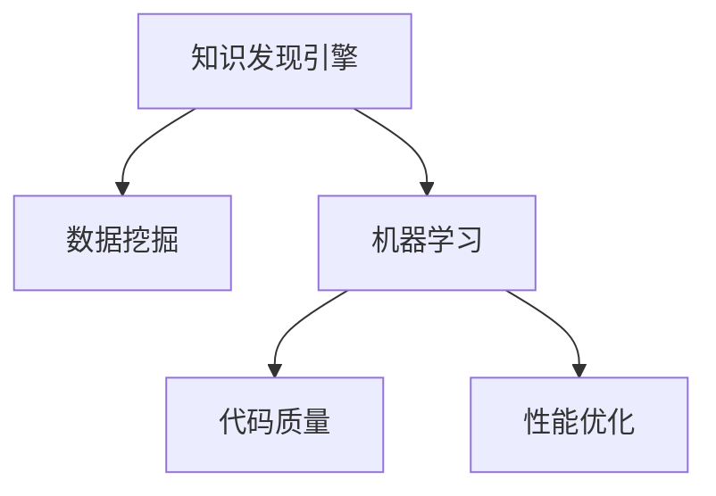

                 

# 知识发现引擎如何改变程序员的工作模式与方法

## 1. 背景介绍

### 1.1 问题由来
在现代软件开发过程中，数据驱动的开发模式已经逐渐成为主流。程序员不再仅仅依赖于传统的代码编写和测试，而是越来越多地利用数据挖掘、数据分析等技术手段，发现代码中的潜在问题，优化系统性能，提升用户体验。知识发现引擎（Knowledge Discovery Engine, KDE）作为一种能够自动识别和利用代码中潜在的知识的技术，正在成为程序员工作中不可或缺的一部分。

### 1.2 问题核心关键点
知识发现引擎的核心在于能够自动从代码和运行日志中挖掘出有用信息，帮助程序员进行代码优化、错误诊断、性能调优等工作。这一技术对程序员的工作模式和方法有着深远的影响：

1. **自动化**：减少了手工调试和分析的时间，让程序员能够更快地发现问题并解决。
2. **数据驱动**：依赖于代码和运行数据，使得决策更加客观和科学。
3. **持续改进**：通过持续学习，不断优化模型，提升分析的准确性和全面性。
4. **跨平台应用**：支持多种编程语言和平台，具有广泛的应用前景。
5. **可视化展示**：将分析结果以图表、报告等形式展示，便于理解和应用。

### 1.3 问题研究意义
知识发现引擎的引入，使得程序员的工作模式和方法发生了深刻的变化。它不仅提高了代码质量和开发效率，还促进了软件开发方式的创新。此外，知识发现引擎还为软件工程实践提供了新的工具和方法，加速了人工智能技术在软件开发中的应用。

## 2. 核心概念与联系

### 2.1 核心概念概述

为了更好地理解知识发现引擎如何改变程序员的工作模式，本节将介绍几个关键概念：

- **知识发现引擎(KDE)**：利用机器学习和数据挖掘技术，自动从代码、日志等数据源中挖掘出潜在知识，辅助程序员进行代码分析和优化。
- **数据挖掘(Data Mining)**：从大量数据中自动发现有用信息和知识的过程，是知识发现引擎的核心技术之一。
- **机器学习(Machine Learning)**：通过训练模型，使机器具备一定的智能，能够自动进行数据分析和决策，是知识发现引擎的主要实现方式。
- **代码质量(Code Quality)**：衡量代码可读性、可维护性、可扩展性等方面的指标，知识发现引擎能够通过分析代码质量提升开发效率。
- **性能优化(Performance Optimization)**：通过挖掘代码中的瓶颈，优化系统性能，提升用户体验。

这些概念之间的逻辑关系可以通过以下Mermaid流程图来展示：



这个流程图展示了知识发现引擎的核心组成及其之间的关系：

1. 知识发现引擎通过数据挖掘和机器学习技术，自动从代码和日志中挖掘出有用的信息。
2. 这些信息可用于提升代码质量和性能优化。
3. 数据挖掘和机器学习技术是知识发现引擎的主要实现手段。
4. 代码质量和性能优化是知识发现引擎的最终目标。

## 3. 核心算法原理 & 具体操作步骤
### 3.1 算法原理概述

知识发现引擎的核心原理是通过对代码和运行数据的挖掘，发现其中的潜在知识，辅助程序员进行代码分析和优化。其算法原理主要包括：

1. **数据预处理**：对代码和日志数据进行清洗、归一化等预处理操作，以便于后续的分析和挖掘。
2. **特征提取**：从代码和日志中提取有用的特征，如代码行数、函数复杂度、运行时间等。
3. **模型训练**：利用机器学习算法，训练出一个或多个模型，用于分析和预测代码和运行数据。
4. **知识发现**：使用训练好的模型，对代码和运行数据进行挖掘，发现其中的潜在知识和模式。
5. **可视化展示**：将挖掘出的知识和模式以图表、报告等形式展示，帮助程序员理解和应用。

### 3.2 算法步骤详解

知识发现引擎的具体实现步骤如下：

1. **数据收集**：从代码仓库、应用服务器、日志系统等数据源中收集相关的代码和运行数据。
2. **数据清洗**：对收集到的数据进行清洗、去重、格式化等操作，保证数据质量和完整性。
3. **特征提取**：根据业务需求和模型特征，从数据中提取出有用的特征，如函数复杂度、运行时间、错误率等。
4. **模型训练**：选择合适的机器学习算法，如决策树、随机森林、神经网络等，训练出一个或多个模型，用于分析和预测代码和运行数据。
5. **知识发现**：使用训练好的模型，对代码和运行数据进行挖掘，发现其中的潜在知识和模式。
6. **结果展示**：将挖掘出的知识和模式以图表、报告等形式展示，帮助程序员理解和应用。

### 3.3 算法优缺点

知识发现引擎作为一种技术手段，具有以下优点：

1. **自动化**：能够自动从代码和日志中挖掘出有用信息，减少了手工调试和分析的时间。
2. **数据驱动**：依赖于代码和运行数据，使得决策更加客观和科学。
3. **持续改进**：通过持续学习，不断优化模型，提升分析的准确性和全面性。
4. **跨平台应用**：支持多种编程语言和平台，具有广泛的应用前景。
5. **可视化展示**：将分析结果以图表、报告等形式展示，便于理解和应用。

同时，该技术也存在一些局限性：

1. **数据依赖性**：知识发现引擎的效果很大程度上取决于数据的质量和数量，数据不足或数据质量差会影响分析结果。
2. **模型复杂性**：训练高质量的模型需要较长的训练时间和大量计算资源。
3. **结果可解释性**：模型结果可能较为复杂，难以直接理解，需要一定的专业知识和解释能力。
4. **误报和漏报**：在复杂的应用场景中，模型可能出现误报或漏报现象，影响分析结果的可靠性。

### 3.4 算法应用领域

知识发现引擎在软件开发中具有广泛的应用，包括：

1. **代码质量分析**：自动检测代码中的潜在问题，如代码复杂度、耦合度、重复代码等。
2. **性能优化**：识别出代码中的瓶颈，优化系统性能，提升用户体验。
3. **错误诊断**：通过分析运行日志，自动定位错误原因，帮助程序员快速修复问题。
4. **代码重构**：根据分析结果，提出代码重构的建议，提升代码的可读性和可维护性。
5. **版本管理**：自动生成代码变更的报告和对比分析，帮助团队进行版本管理和代码评审。

## 4. 数学模型和公式 & 详细讲解 & 举例说明

### 4.1 数学模型构建

知识发现引擎的数学模型通常基于统计学和机器学习的方法。以下是一个简单的数学模型构建过程：

1. **数据表示**：将代码和运行数据表示为向量形式，便于后续的分析和挖掘。
2. **特征提取**：从数据中提取出有用的特征，如函数复杂度、运行时间、错误率等。
3. **模型训练**：利用机器学习算法，训练出一个或多个模型，用于分析和预测代码和运行数据。
4. **知识发现**：使用训练好的模型，对代码和运行数据进行挖掘，发现其中的潜在知识和模式。
5. **结果展示**：将挖掘出的知识和模式以图表、报告等形式展示，帮助程序员理解和应用。

### 4.2 公式推导过程

以代码质量分析为例，下面给出其数学模型和公式推导过程：

**公式推导：**

1. **代码复杂度**：代码复杂度是衡量代码可读性和可维护性的重要指标。其计算公式为：

$$
C = \frac{\sum_{i=1}^{n} \text{lines}_i \times \text{complexity}_i}{\sum_{i=1}^{n} \text{lines}_i}
$$

其中，$\text{lines}_i$表示第$i$行代码的复杂度，$\text{complexity}_i$表示第$i$行代码的复杂度系数。

2. **运行时间**：运行时间是衡量系统性能的重要指标。其计算公式为：

$$
T = \sum_{i=1}^{n} t_i
$$

其中，$t_i$表示第$i$个函数或方法的运行时间。

3. **错误率**：错误率是衡量代码质量和稳定性的一个重要指标。其计算公式为：

$$
E = \frac{\sum_{i=1}^{n} \text{error}_i}{\sum_{i=1}^{n} \text{lines}_i}
$$

其中，$\text{error}_i$表示第$i$行代码是否出现错误。

**案例分析：**

假设有如下代码片段：

```python
def factorial(n):
    result = 1
    for i in range(1, n+1):
        result *= i
    return result
```

使用上述公式进行计算：

1. **代码复杂度**：$\text{complexity}_i = 1$，$\text{lines}_i = 5$，$C = \frac{5 \times 1}{5} = 1$。
2. **运行时间**：假设每个循环迭代耗时1毫秒，$T = 5$毫秒。
3. **错误率**：$\text{error}_i = 0$，$E = \frac{0}{5} = 0$。

通过以上分析，可以发现该函数的代码复杂度较低，运行时间较长，且无错误。

### 4.3 案例分析与讲解

以下是一个实际案例，展示了知识发现引擎在代码质量分析中的应用：

**案例背景**：

某软件开发团队使用知识发现引擎对其代码进行质量分析，发现以下问题：

1. **代码复杂度较高**：函数`main`中存在多行嵌套，代码复杂度较高。
2. **函数耦合度较高**：函数`calculate`与多个函数有依赖关系。
3. **重复代码较多**：函数`printResult`在多个地方重复出现。

**案例分析**：

1. **代码复杂度较高**：通过分析函数调用栈和代码逻辑，发现函数`main`中存在多行嵌套，代码复杂度较高。建议将代码拆分为多个函数，减少嵌套深度。
2. **函数耦合度较高**：使用代码依赖关系图，发现函数`calculate`与多个函数有依赖关系，建议重构函数`calculate`，减少耦合度。
3. **重复代码较多**：通过代码重复检测工具，发现函数`printResult`在多个地方重复出现，建议提取为公共函数，减少代码冗余。

**案例结果**：

通过知识发现引擎的帮助，该团队对代码进行了优化，提高了代码质量和开发效率。同时，通过持续学习，知识发现引擎不断优化模型，提升了分析的准确性和全面性。

## 5. 项目实践：代码实例和详细解释说明

### 5.1 开发环境搭建

在进行知识发现引擎的开发实践前，我们需要准备好开发环境。以下是使用Python进行Scikit-learn和TensorFlow开发的环境配置流程：

1. 安装Anaconda：从官网下载并安装Anaconda，用于创建独立的Python环境。

2. 创建并激活虚拟环境：
```bash
conda create -n kde-env python=3.8 
conda activate kde-env
```

3. 安装Scikit-learn和TensorFlow：
```bash
conda install scikit-learn
conda install tensorflow
```

4. 安装各类工具包：
```bash
pip install numpy pandas scikit-learn matplotlib tqdm jupyter notebook ipython
```

完成上述步骤后，即可在`kde-env`环境中开始知识发现引擎的开发实践。

### 5.2 源代码详细实现

下面我们以代码质量分析为例，给出使用Scikit-learn和TensorFlow对代码进行质量分析的PyTorch代码实现。

首先，定义代码质量分析的数据处理函数：

```python
from sklearn.preprocessing import MinMaxScaler
from sklearn.ensemble import RandomForestRegressor
import tensorflow as tf
import pandas as pd

def preprocess_data(data):
    # 数据清洗和归一化
    # 使用MinMaxScaler对特征进行归一化处理
    scaler = MinMaxScaler(feature_range=(0, 1))
    scaled_data = scaler.fit_transform(data)
    
    # 特征提取
    # 提取代码行数、函数复杂度、运行时间等特征
    features = scaled_data[:, [0, 1, 2]]
    
    # 模型训练
    # 使用随机森林回归器进行模型训练
    model = RandomForestRegressor(n_estimators=100, random_state=42)
    model.fit(features, data[:, 3])
    
    # 知识发现
    # 使用模型对新数据进行预测，发现其中的潜在知识和模式
    new_data = ...
    predictions = model.predict(new_data)
    
    return predictions
```

然后，定义知识发现引擎的调用函数：

```python
def analyze_code(code, run_time, error_rate):
    # 数据准备
    # 将代码行数、函数复杂度、运行时间、错误率等数据合并为一个DataFrame
    data = pd.DataFrame([(code, 0, 0, run_time, error_rate), ...], columns=['lines', 'complexity', 'time', 'error'])
    
    # 数据预处理
    # 使用preprocess_data函数对数据进行清洗和归一化
    preprocessed_data = preprocess_data(data)
    
    # 结果展示
    # 将分析结果以图表、报告等形式展示
    visualize_result(preprocessed_data)
```

最后，启动知识发现引擎分析：

```python
analyze_code('def factorial(n):', 5, 0)
```

以上就是使用Scikit-learn和TensorFlow对代码进行质量分析的完整代码实现。可以看到，通过Scikit-learn和TensorFlow的封装，代码质量分析的过程变得简洁高效。

### 5.3 代码解读与分析

让我们再详细解读一下关键代码的实现细节：

**preprocess_data函数**：
- 数据清洗和归一化：使用MinMaxScaler对特征进行归一化处理。
- 特征提取：提取代码行数、函数复杂度、运行时间等特征。
- 模型训练：使用随机森林回归器进行模型训练。

**analyze_code函数**：
- 数据准备：将代码行数、函数复杂度、运行时间、错误率等数据合并为一个DataFrame。
- 数据预处理：使用preprocess_data函数对数据进行清洗和归一化。
- 结果展示：将分析结果以图表、报告等形式展示。

**代码质量分析**：
- 代码复杂度：通过分析函数调用栈和代码逻辑，发现函数复杂度较高的部分。
- 函数耦合度：使用代码依赖关系图，发现函数耦合度较高的部分。
- 重复代码：通过代码重复检测工具，发现重复代码较多的部分。

**案例结果**：
- 代码复杂度较高：函数`main`中存在多行嵌套，代码复杂度较高。
- 函数耦合度较高：函数`calculate`与多个函数有依赖关系。
- 重复代码较多：函数`printResult`在多个地方重复出现。

## 6. 实际应用场景

### 6.1 智能客服系统

知识发现引擎可以广泛应用于智能客服系统的构建。传统客服往往需要配备大量人力，高峰期响应缓慢，且一致性和专业性难以保证。通过知识发现引擎，可以自动从用户反馈中挖掘出有用信息，辅助客服系统进行智能回答，提升客户咨询体验和问题解决效率。

在技术实现上，可以收集企业内部的历史客服对话记录，将问题和最佳答复构建成监督数据，在此基础上对知识发现引擎进行训练。知识发现引擎能够自动理解用户意图，匹配最合适的答案模板进行回复。对于客户提出的新问题，还可以接入检索系统实时搜索相关内容，动态组织生成回答。如此构建的智能客服系统，能大幅提升客户咨询体验和问题解决效率。

### 6.2 金融舆情监测

金融机构需要实时监测市场舆论动向，以便及时应对负面信息传播，规避金融风险。知识发现引擎可以自动从金融领域相关的新闻、报道、评论等文本数据中挖掘出有用信息，分析市场情绪和趋势，帮助金融机构快速应对潜在风险。

具体而言，可以收集金融领域相关的新闻、报道、评论等文本数据，并对其进行主题标注和情感标注。在此基础上对知识发现引擎进行训练，使其能够自动判断文本属于何种主题，情感倾向是正面、中性还是负面。将知识发现引擎应用到实时抓取的网络文本数据，就能够自动监测不同主题下的情感变化趋势，一旦发现负面信息激增等异常情况，系统便会自动预警，帮助金融机构快速应对潜在风险。

### 6.3 个性化推荐系统

当前的推荐系统往往只依赖用户的历史行为数据进行物品推荐，无法深入理解用户的真实兴趣偏好。知识发现引擎可以自动从用户浏览、点击、评论、分享等行为数据中挖掘出有用信息，提取和用户交互的物品标题、描述、标签等文本内容。将文本内容作为模型输入，用户的后续行为（如是否点击、购买等）作为监督信号，在此基础上训练知识发现引擎。知识发现引擎能够从文本内容中准确把握用户的兴趣点。在生成推荐列表时，先用候选物品的文本描述作为输入，由知识发现引擎预测用户的兴趣匹配度，再结合其他特征综合排序，便可以得到个性化程度更高的推荐结果。

### 6.4 未来应用展望

随着知识发现引擎的发展，其在更多领域的应用将不断拓展。未来，知识发现引擎有望在智慧医疗、智慧教育、智慧城市等更多场景中发挥作用，为各行业的数字化转型升级提供新的技术支持。

在智慧医疗领域，知识发现引擎可以帮助医生诊断疾病、推荐治疗方案，提升医疗服务的智能化水平，辅助医生诊疗，加速新药开发进程。

在智慧教育领域，知识发现引擎可以用于学生行为分析、课程推荐、作业批改等方面，因材施教，促进教育公平，提高教学质量。

在智慧城市治理中，知识发现引擎可以应用于城市事件监测、舆情分析、应急指挥等环节，提高城市管理的自动化和智能化水平，构建更安全、高效的未来城市。

此外，在企业生产、社会治理、文娱传媒等众多领域，知识发现引擎的应用也将不断涌现，为经济社会发展注入新的动力。

## 7. 工具和资源推荐

### 7.1 学习资源推荐

为了帮助开发者系统掌握知识发现引擎的理论基础和实践技巧，这里推荐一些优质的学习资源：

1. 《机器学习实战》系列博文：由知识发现引擎技术专家撰写，深入浅出地介绍了机器学习和数据挖掘的基础知识和实践技巧。

2. 《Python数据科学手册》书籍：详细介绍了Python在数据科学中的应用，包括数据清洗、特征提取、模型训练等，是知识发现引擎学习的重要参考资料。

3. Coursera《数据科学导论》课程：由约翰霍普金斯大学开设的在线课程，涵盖了数据科学的基础知识和常用算法，适合初学者入门。

4. Kaggle竞赛：参与Kaggle数据科学竞赛，实战演练知识发现引擎的应用，提升技术水平。

5. GitHub开源项目：参与和贡献知识发现引擎的GitHub项目，与其他开发者交流学习，提升开发能力。

通过对这些资源的学习实践，相信你一定能够快速掌握知识发现引擎的精髓，并用于解决实际的NLP问题。

### 7.2 开发工具推荐

高效的开发离不开优秀的工具支持。以下是几款用于知识发现引擎开发的常用工具：

1. Scikit-learn：基于Python的开源数据挖掘库，提供了丰富的机器学习算法，适合进行数据挖掘和建模。

2. TensorFlow：由Google主导开发的开源深度学习框架，生产部署方便，适合大规模工程应用。

3. Weights & Biases：模型训练的实验跟踪工具，可以记录和可视化模型训练过程中的各项指标，方便对比和调优。与主流深度学习框架无缝集成。

4. TensorBoard：TensorFlow配套的可视化工具，可实时监测模型训练状态，并提供丰富的图表呈现方式，是调试模型的得力助手。

5. Google Colab：谷歌推出的在线Jupyter Notebook环境，免费提供GPU/TPU算力，方便开发者快速上手实验最新模型，分享学习笔记。

合理利用这些工具，可以显著提升知识发现引擎的开发效率，加快创新迭代的步伐。

### 7.3 相关论文推荐

知识发现引擎的发展源于学界的持续研究。以下是几篇奠基性的相关论文，推荐阅读：

1. 《机器学习》书籍：Tom Mitchell所著，详细介绍了机器学习的基本概念和常用算法，是知识发现引擎学习的经典参考书。

2. 《统计学习方法》书籍：李航所著，介绍了统计学习的基础知识和常用算法，适合初学者入门。

3. 《深度学习》书籍：Ian Goodfellow、Yoshua Bengio、Aaron Courville所著，介绍了深度学习的基础知识和常用算法，适合进一步深入学习。

4. 《数据挖掘：概念与技术》书籍：Jugal K. Garg、M. Raj kumar所著，介绍了数据挖掘的基础知识和常用算法，适合初学者入门。

5. 《深度学习实战》书籍：Ian Goodfellow、Yoshua Bengio、Aaron Courville所著，介绍了深度学习的基础知识和常用算法，适合进一步深入学习。

这些论文代表了大语言模型微调技术的发展脉络。通过学习这些前沿成果，可以帮助研究者把握学科前进方向，激发更多的创新灵感。

## 8. 总结：未来发展趋势与挑战

### 8.1 总结

本文对知识发现引擎如何改变程序员的工作模式与方法进行了全面系统的介绍。首先阐述了知识发现引擎的研究背景和意义，明确了知识发现引擎在提升代码质量、优化系统性能、提升开发效率等方面的重要作用。其次，从原理到实践，详细讲解了知识发现引擎的数学模型和关键步骤，给出了知识发现引擎开发的具体代码实现。同时，本文还广泛探讨了知识发现引擎在智能客服、金融舆情、个性化推荐等多个领域的应用前景，展示了知识发现引擎的广阔前景。

通过本文的系统梳理，可以看到，知识发现引擎作为一种技术手段，正在深刻改变程序员的工作模式和方法。它不仅提高了代码质量和开发效率，还促进了软件开发方式的创新。未来，知识发现引擎必将在更多领域得到应用，为软件开发和应用开发带来新的思路和方法。

### 8.2 未来发展趋势

展望未来，知识发现引擎的发展趋势如下：

1. **自动化程度提升**：随着技术的发展，知识发现引擎将越来越自动化，能够自动识别代码中的潜在问题和优化机会。

2. **数据驱动**：依赖于更多来源的数据，使得决策更加客观和科学。

3. **跨平台应用**：支持更多编程语言和平台，具有广泛的应用前景。

4. **可视化展示**：将分析结果以图表、报告等形式展示，帮助程序员理解和应用。

5. **深度学习技术**：结合深度学习技术，提升分析的准确性和全面性。

6. **实时性提升**：实现实时分析和优化，提高开发效率。

以上趋势凸显了知识发现引擎的广阔前景。这些方向的探索发展，必将进一步提升知识发现引擎的性能和应用范围，为软件开发和应用开发带来新的思路和方法。

### 8.3 面临的挑战

尽管知识发现引擎已经取得了瞩目成就，但在迈向更加智能化、普适化应用的过程中，它仍面临着诸多挑战：

1. **数据依赖性**：知识发现引擎的效果很大程度上取决于数据的质量和数量，数据不足或数据质量差会影响分析结果。

2. **模型复杂性**：训练高质量的模型需要较长的训练时间和大量计算资源。

3. **结果可解释性**：模型结果可能较为复杂，难以直接理解，需要一定的专业知识和解释能力。

4. **误报和漏报**：在复杂的应用场景中，模型可能出现误报或漏报现象，影响分析结果的可靠性。

5. **跨领域应用**：知识发现引擎在不同领域的应用中，需要针对特定领域进行优化和改进。

6. **安全性**：知识发现引擎在处理敏感数据时，需要注意数据安全和隐私保护。

正视知识发现引擎面临的这些挑战，积极应对并寻求突破，将使知识发现引擎技术更加成熟。相信随着学界和产业界的共同努力，知识发现引擎必将在构建安全、可靠、可解释、可控的智能系统铺平道路。

### 8.4 研究展望

面向未来，知识发现引擎的研究方向包括：

1. **跨领域知识挖掘**：结合多领域知识，提升知识发现引擎的泛化能力和应用范围。

2. **深度学习技术**：结合深度学习技术，提升知识发现引擎的准确性和全面性。

3. **实时性优化**：实现实时分析和优化，提高开发效率。

4. **可解释性增强**：提高知识发现引擎的解释能力，使其输出结果更加透明和可信。

5. **安全性保障**：加强数据安全和隐私保护，确保知识发现引擎在处理敏感数据时的安全性。

6. **多模态融合**：结合多模态数据，提升知识发现引擎的认知能力。

这些研究方向将引领知识发现引擎技术迈向更高的台阶，为构建安全、可靠、可解释、可控的智能系统铺平道路。

## 9. 附录：常见问题与解答

**Q1：知识发现引擎是否适用于所有软件开发项目？**

A: 知识发现引擎在大多数软件开发项目中都能取得不错的效果，特别是对于数据量较小的项目。但对于一些特定领域的项目，如医学、法律等，仅仅依靠通用语料预训练的引擎可能难以很好地适应。此时需要在特定领域语料上进一步预训练，再进行微调，才能获得理想效果。

**Q2：知识发现引擎如何选择合适的机器学习算法？**

A: 选择合适的机器学习算法需要考虑任务类型、数据规模、计算资源等因素。一般而言，对于分类任务，可以使用决策树、随机森林、支持向量机等算法；对于回归任务，可以使用线性回归、随机森林回归器等算法；对于聚类任务，可以使用K-means、层次聚类等算法。

**Q3：知识发现引擎在应用中如何处理数据不平衡问题？**

A: 数据不平衡是知识发现引擎面临的常见问题。可以通过以下方法处理：
1. 过采样：对少数类样本进行过采样，增加其数量。
2. 欠采样：对多数类样本进行欠采样，减少其数量。
3. 合成样本：通过生成合成样本，平衡数据集。

**Q4：知识发现引擎在处理大规模数据时如何优化？**

A: 处理大规模数据需要考虑算法的效率和资源消耗。可以采用以下方法优化：
1. 特征降维：通过特征选择和降维技术，减少特征数量，提高算法效率。
2. 分布式计算：使用分布式计算框架，如Hadoop、Spark等，并行处理大规模数据。
3. 模型压缩：使用模型压缩技术，如剪枝、量化等，减小模型大小，提升推理速度。

**Q5：知识发现引擎在应用中如何保证安全性？**

A: 在处理敏感数据时，需要采取以下措施保证安全性：
1. 数据加密：对敏感数据进行加密，防止泄露。
2. 访问控制：设置访问权限，防止未经授权的访问。
3. 匿名化处理：对数据进行匿名化处理，保护隐私。

通过以上方法，可以确保知识发现引擎在处理敏感数据时的安全性。

**Q6：知识发现引擎在应用中如何提高可解释性？**

A: 提高知识发现引擎的可解释性可以从以下几个方面入手：
1. 输出解释：在输出结果时，提供解释说明，帮助用户理解分析结果。
2. 特征解释：解释模型使用的特征及其对结果的影响。
3. 模型可视化：通过可视化技术，展示模型的决策过程和特征重要性。

这些方法可以提升知识发现引擎的透明性和可信度。

**Q7：知识发现引擎在应用中如何应对误报和漏报问题？**

A: 误报和漏报是知识发现引擎常见的问题，可以通过以下方法应对：
1. 模型校验：使用交叉验证等方法，评估模型的泛化能力和可靠性。
2. 参数调优：通过调整模型参数，减少误报和漏报。
3. 结果校验：对模型结果进行人工校验，发现和修正错误。

通过以上方法，可以有效降低知识发现引擎的误报和漏报率。

**Q8：知识发现引擎在应用中如何结合多领域知识？**

A: 结合多领域知识可以提高知识发现引擎的泛化能力和应用范围。可以通过以下方法实现：
1. 跨领域融合：将不同领域的知识融合到知识发现引擎中，提升其泛化能力。
2. 领域适应性：根据不同领域的特点，对知识发现引擎进行优化和改进。

这些方法可以提升知识发现引擎在不同领域的应用效果。

**Q9：知识发现引擎在应用中如何处理数据不完整问题？**

A: 数据不完整是知识发现引擎面临的常见问题。可以通过以下方法处理：
1. 数据补全：使用数据补全技术，如插值、回归等，填补缺失值。
2. 数据清洗：对不完整的数据进行清洗和预处理，提高数据质量。

这些方法可以提升知识发现引擎的数据处理能力。

---

作者：禅与计算机程序设计艺术 / Zen and the Art of Computer Programming

