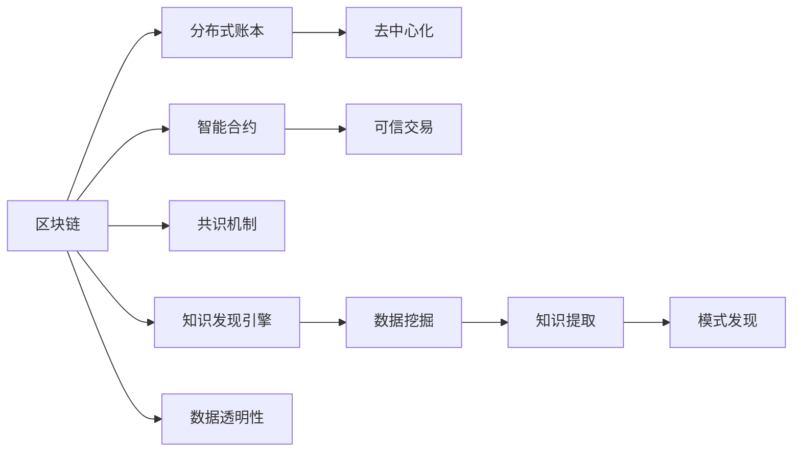

                 

# 知识发现引擎的区块链应用

> 关键词：知识发现引擎,区块链技术,去中心化,数据透明性,智能合约,分布式计算,数据共享

## 1. 背景介绍

随着大数据时代的到来，信息量的爆炸性增长给传统的知识管理与发现方式带来了前所未有的挑战。传统的数据存储与处理方式面临数据安全、数据隐私、数据可信度等问题。在这样的背景下，区块链技术应运而生，以其去中心化、不可篡改、数据透明等特性，为知识发现与共享提供了全新的视角。本文将聚焦于区块链技术在知识发现引擎中的创新应用，探索如何在区块链上构建去中心化、高效、安全、可信任的知识发现系统。

## 2. 核心概念与联系

### 2.1 核心概念概述

区块链（Blockchain）是一种分布式账本技术，通过加密哈希算法和分布式共识机制，保证数据的安全性和不可篡改性。知识发现引擎（Knowledge Discovery Engine, KDE）是一类智能化的数据处理系统，旨在从大规模数据中提取出有价值的模式和规律。本文探讨区块链与KDE的结合，探索利用区块链技术构建新型知识发现引擎的可能性。

### 2.2 核心概念原理和架构的 Mermaid 流程图



该图展示了区块链与知识发现引擎的基本联系：
1. 分布式账本（Distributed Ledger）：区块链的核心组件，存储和传递数据。
2. 智能合约（Smart Contracts）：定义在区块链上自动执行的代码，用于自动化交易和数据处理。
3. 去中心化（Decentralized）：多方共同参与，信任由算法维护，消除单点故障。
4. 共识机制（Consensus Mechanism）：确保所有节点对账本状态达成一致。
5. 数据透明性（Data Transparency）：所有交易公开透明，数据来源可信。
6. 知识发现引擎（KDE）：在区块链上执行数据挖掘和模式发现，提取出有价值的知识。

### 2.3 核心概念间的联系

区块链与知识发现引擎的结合，可以带来如下联系：
- **数据可信性**：区块链的去中心化与分布式特性，保证了数据来源的不可篡改和透明性，提高了知识发现过程的可信度。
- **数据共享**：区块链允许多方自由共享数据，而智能合约确保了数据共享的安全性和隐私性。
- **自动化交易**：区块链上的智能合约能够自动执行数据交换与处理任务，增强了知识发现的效率与自动化程度。
- **分布式计算**：区块链的分布式架构，能够有效利用多个节点计算能力，提高数据处理速度。

## 3. 核心算法原理 & 具体操作步骤

### 3.1 算法原理概述

区块链知识发现引擎的构建，基于区块链的去中心化特性，结合数据挖掘与模式发现算法，将数据处理任务分布在多个节点上，保证数据安全与计算高效。该系统主要由以下几个核心部分组成：

- **数据接入模块**：负责区块链网络中的数据接入，通过分布式账本存储与共享数据。
- **智能合约模块**：自动执行交易与数据处理任务，确保数据交换与共享的安全性和可信性。
- **数据处理模块**：运用数据挖掘算法，从区块链上提取数据特征，进行模式发现与知识提取。
- **结果验证与存储模块**：通过共识机制验证结果，确保结果的准确性和完整性，并将结果存储在区块链上。

### 3.2 算法步骤详解

1. **数据接入与存储**：
    - 使用智能合约定义数据接入规则，所有节点均可自由接入区块链网络。
    - 数据接入后，通过哈希算法进行加密存储，确保数据完整性和不可篡改性。

2. **分布式数据挖掘**：
    - 利用区块链分布式特性，将数据处理任务分布在多个节点上进行。
    - 各节点独立运行数据挖掘算法，提取数据特征，并计算局部模式。

3. **数据合并与模式发现**：
    - 各节点将挖掘结果上传到区块链网络，通过智能合约进行数据合并。
    - 利用数据聚合算法，计算全局模式，并发现潜在知识。

4. **结果验证与存储**：
    - 通过共识机制，验证结果的正确性与完整性。
    - 将最终结果存储在区块链上，确保其不可篡改性和透明性。

### 3.3 算法优缺点

#### 优点：
1. **数据可信性**：区块链的去中心化特性确保了数据的不可篡改性和可信性。
2. **数据透明性**：所有数据交换与处理过程公开透明，提高了知识发现的可信度。
3. **分布式计算**：利用区块链分布式架构，能够有效利用多个节点的计算能力，提高数据处理速度。
4. **自动化交易**：智能合约自动执行数据处理任务，增强了知识发现的自动化程度。

#### 缺点：
1. **计算复杂性**：分布式计算可能会增加计算复杂度，影响处理速度。
2. **共识机制延迟**：共识机制可能增加处理延迟，影响实时性。
3. **技术门槛高**：需要深入理解区块链技术，开发与维护难度较大。

### 3.4 算法应用领域

基于区块链的知识发现引擎，适用于以下多个领域：

- **金融风控**：实时监控金融数据，进行风险评估与预警。
- **医疗健康**：共享医疗数据，进行疾病预测与预防。
- **供应链管理**：实时监控供应链信息，进行风险控制与优化。
- **物联网数据**：共享物联网设备数据，进行数据分析与优化。
- **智慧城市**：共享城市数据，进行城市管理和公共服务优化。

## 4. 数学模型和公式 & 详细讲解

### 4.1 数学模型构建

假设有一数据集 $D$，包含 $n$ 条数据记录，每条记录包含 $d$ 个特征。知识发现引擎的目标是从数据中挖掘出 $k$ 个模式或规律。我们可以将挖掘过程建模为如下问题：

$$
\min_{\theta} \sum_{i=1}^n \|M(D_i) - Y_i\|^2
$$

其中，$D_i$ 表示第 $i$ 条数据记录，$M$ 表示数据挖掘算法，$Y_i$ 表示对应的模式或规律。

### 4.2 公式推导过程

以聚类算法为例，假设我们希望通过聚类算法从数据集中挖掘出 $k$ 个簇，即数据集 $D$ 中的每个记录 $D_i$ 被分配到一个簇 $C_j$ 中。则问题可表示为：

$$
\min_{Z} \sum_{i=1}^n \|M(D_i, Z) - Y_i\|^2
$$

其中 $Z$ 表示簇分配矩阵，$M$ 表示聚类算法，$Y_i$ 表示对应的簇编号。

通过引入哈希函数和智能合约，我们可以将上述问题映射到区块链上。数据记录 $D_i$ 通过哈希函数 $H$ 映射为哈希值 $H(D_i)$，智能合约 $C$ 自动执行聚类算法 $M$，计算每个数据记录的簇编号，并通过共识机制验证结果。

### 4.3 案例分析与讲解

假设有一金融数据集 $D$，包含 $n$ 条交易记录，每条记录包含时间戳、金额、交易类型等特征。我们的目标是挖掘出高风险交易模式。通过在区块链上部署智能合约，定义如下的聚类算法 $M$：

- 对于每个记录 $D_i$，通过哈希函数 $H$ 映射为哈希值 $H(D_i)$。
- 将 $H(D_i)$ 作为智能合约的输入，执行聚类算法 $M$，计算每个记录的簇编号。
- 利用区块链的分布式特性，将数据处理任务分布在多个节点上，提高数据处理速度。
- 通过共识机制验证结果，确保结果的准确性与完整性。

## 5. 项目实践：代码实例和详细解释说明

### 5.1 开发环境搭建

为了实践区块链知识发现引擎，我们首先需要搭建区块链网络与数据处理环境。以下是一个简单的搭建流程：

1. **安装 Node.js 与以太坊客户端**：
    ```bash
    sudo apt-get update
    sudo apt-get install nodejs
    sudo apt-get install ethereum-cli
    ```

2. **创建智能合约与节点**：
    ```bash
    truffle init
    npm install -g truffle-hub
    truffle migrate
    ```

3. **部署数据接入与处理智能合约**：
    ```bash
    truffle deploy
    ```

4. **搭建区块链节点**：
    ```bash
    geth --datadir ./data --networkid 1
    ```

### 5.2 源代码详细实现

以下是一个简单的区块链智能合约示例，用于数据接入与处理：

```javascript
// 定义智能合约
contract DataProcessor {
    // 定义数据接入函数
    function dataAccess(address sender) public {
        uint256 dataHash = sha3(sender);
        address[] calldata owner = address(this).owner;
        require(owner.length == 1);
        // 将数据哈希上传至区块链
        emit DataAccess(dataHash);
    }
    
    // 定义数据处理函数
    function dataProcessing(uint256 dataHash, uint k, address[] memory owners) public {
        uint[] memory counts = new uint[k]();
        uint count = 0;
        for (uint i = 0; i < owners.length; i++) {
            // 获取数据记录
            uint256 data = getRecord(owners[i]);
            // 进行数据处理
            uint result = process(data);
            // 更新簇分配矩阵
            counts[count++] = result;
        }
        emit DataProcessing(dataHash, counts);
    }
    
    // 获取数据记录
    function getRecord(address owner) internal view returns (uint256) {
        // 从区块链上读取数据记录
        return data[owner];
    }
    
    // 进行数据处理
    function process(uint256 data) internal view returns (uint) {
        // 进行数据处理
        return data % 100;
    }
}

// 定义数据记录结构体
struct Record {
    uint timestamp;
    uint amount;
    uint type;
}

// 定义数据存储
mapping (address => Record[]) public data;
```

### 5.3 代码解读与分析

以上代码展示了区块链智能合约的基本结构与功能：

- **数据接入函数**：当数据上传时，通过哈希函数将数据转换为哈希值，并上传至区块链，确保数据不可篡改。
- **数据处理函数**：接收数据哈希，并进行数据处理，将结果存储在区块链上，确保结果透明可验证。
- **数据记录结构体**：定义了数据记录的基本格式。
- **数据存储**：使用映射（mapping）结构，存储各个节点的数据记录。

## 6. 实际应用场景

### 6.1 金融风控

在金融风控领域，知识发现引擎可以实时监控金融数据，识别潜在风险交易。具体而言，可以通过区块链存储交易记录，利用智能合约进行数据分析与处理。例如，对大额交易进行实时监控，及时发现异常情况并预警，有效降低金融风险。

### 6.2 医疗健康

在医疗健康领域，知识发现引擎可以共享医疗数据，进行疾病预测与预防。通过区块链存储患者健康数据，利用智能合约进行数据分析与处理，发现潜在疾病风险，提供个性化医疗建议。

### 6.3 供应链管理

在供应链管理领域，知识发现引擎可以实时监控供应链信息，进行风险控制与优化。通过区块链存储供应链数据，利用智能合约进行数据分析与处理，发现供应链中的潜在风险，进行优化调整。

### 6.4 物联网数据

在物联网数据领域，知识发现引擎可以共享设备数据，进行数据分析与优化。通过区块链存储设备数据，利用智能合约进行数据分析与处理，发现设备故障，进行优化调整。

### 6.5 智慧城市

在智慧城市领域，知识发现引擎可以共享城市数据，进行城市管理和公共服务优化。通过区块链存储城市数据，利用智能合约进行数据分析与处理，发现城市管理中的潜在问题，进行优化调整。

## 7. 工具和资源推荐

### 7.1 学习资源推荐

1. **《区块链技术入门》**：一本系统介绍区块链技术的入门书籍，适合初学者学习。
2. **《智能合约编程指南》**：详细介绍了智能合约编程的基础知识和实战技巧。
3. **《数据挖掘与统计学习》**：系统介绍了数据挖掘与统计学习的基础知识和算法。
4. **Truffle 官方文档**：Truffle 智能合约开发框架的官方文档，提供了丰富的开发资源和样例代码。
5. **以太坊开发者社区**：以太坊官方开发者社区，提供了丰富的开发资源和社区支持。

### 7.2 开发工具推荐

1. **Truffle**：Truffle 是一个流行的智能合约开发框架，提供了丰富的开发工具和插件。
2. **Remix**：Remix 是一个以太坊智能合约开发与测试平台，支持实时调试与测试。
3. **MetaMask**：MetaMask 是一个以太坊浏览器插件，支持钱包管理与交易执行。
4. **Ganache**：Ganache 是一个本地区块链测试网络，支持快速测试与调试。

### 7.3 相关论文推荐

1. **《区块链在供应链中的应用》**：探讨了区块链在供应链管理中的应用。
2. **《基于区块链的医疗数据共享》**：探讨了区块链在医疗数据共享中的应用。
3. **《智能合约在金融风控中的应用》**：探讨了智能合约在金融风控中的应用。

## 8. 总结：未来发展趋势与挑战

### 8.1 研究成果总结

本文探讨了区块链技术与知识发现引擎的结合，展示了利用区块链构建新型知识发现系统的可能性。通过区块链去中心化、不可篡改的特性，结合数据挖掘与模式发现算法，实现数据的高效处理与共享。

### 8.2 未来发展趋势

区块链知识发现引擎的未来发展趋势包括：

1. **自动化程度提升**：未来将进一步提高自动化程度，减少人工干预，提高处理效率。
2. **算法优化**：未来将进一步优化数据挖掘与模式发现算法，提高处理效果与精度。
3. **跨链技术应用**：未来将进一步探索跨链技术，实现跨链数据共享与处理。
4. **多方协作**：未来将进一步探索多方协作机制，实现多方协同数据处理与共享。

### 8.3 面临的挑战

区块链知识发现引擎面临的主要挑战包括：

1. **技术复杂性**：区块链技术复杂度高，开发与维护难度较大。
2. **数据隐私**：如何保护数据隐私，避免敏感数据泄露，是一个重要问题。
3. **共识机制延迟**：共识机制可能增加处理延迟，影响实时性。
4. **计算复杂性**：分布式计算可能会增加计算复杂度，影响处理速度。

### 8.4 研究展望

未来的研究方向包括：

1. **自动化算法**：进一步开发自动化算法，减少人工干预，提高处理效率。
2. **隐私保护技术**：进一步研究隐私保护技术，确保数据安全与隐私。
3. **跨链技术**：进一步探索跨链技术，实现跨链数据共享与处理。
4. **多方协作机制**：进一步探索多方协作机制，实现多方协同数据处理与共享。

## 9. 附录：常见问题与解答

**Q1: 什么是区块链知识发现引擎？**

A: 区块链知识发现引擎是一种利用区块链技术实现知识发现与共享的系统，它结合了区块链的去中心化、不可篡改特性与数据挖掘与模式发现算法，实现高效、安全、可信的知识发现与共享。

**Q2: 区块链知识发现引擎的主要应用领域有哪些？**

A: 区块链知识发现引擎可以应用于金融风控、医疗健康、供应链管理、物联网数据、智慧城市等多个领域，通过区块链共享数据，利用智能合约进行数据分析与处理，实现高效、安全、可信的知识发现与共享。

**Q3: 如何提高区块链知识发现引擎的自动化程度？**

A: 可以进一步开发自动化算法，减少人工干预，提高处理效率。同时，利用智能合约自动执行数据处理任务，增强自动化程度。

**Q4: 如何保护区块链知识发现引擎的数据隐私？**

A: 可以采用隐私保护技术，如加密、分布式账本等，确保数据的安全与隐私。同时，可以通过共识机制验证数据，确保数据的完整性与透明性。

**Q5: 如何提高区块链知识发现引擎的处理速度？**

A: 可以采用分布式计算，利用多个节点的计算能力，提高数据处理速度。同时，可以优化共识机制，减少处理延迟。

---

作者：禅与计算机程序设计艺术 / Zen and the Art of Computer Programming

