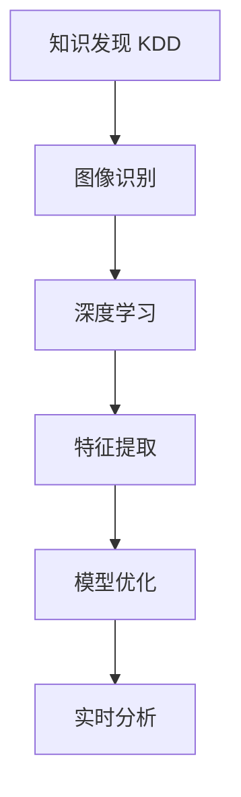

                 

# 知识发现引擎的图像识别技术应用

> 关键词：知识发现, 图像识别, 深度学习, 数据挖掘, 特征提取, 模型优化, 实时分析

## 1. 背景介绍

### 1.1 问题由来
在当今信息化社会中，数据无处不在，如何从海量数据中提取有价值的信息，成为各行业关注的焦点。知识发现(Knowledge Discovery in Databases, KDD)，作为一种数据驱动的研究方法，通过从数据中挖掘出蕴含的潜在知识，为决策支持、市场预测、风险管理等提供了强有力的依据。传统的KDD方法依赖于专家经验，耗时费力，难以适应快速变化的数据环境。而随着深度学习技术的发展，基于深度学习的方法在图像识别、自然语言处理、时间序列预测等领域取得了显著突破，也逐渐被应用于KDD中。

图像识别作为KDD中一个重要环节，具有直观、便捷的特点。通过图像识别技术，可以从图像数据中快速获得信息，提高数据处理的效率和准确性。然而，图像识别技术在KDD中的应用仍存在诸多挑战，如数据标注成本高、模型可解释性不足、多模态数据融合等。为解决这些问题，本文将从图像识别技术的原理与应用出发，深入探讨其在KDD中的应用，为行业提供有价值的参考。

## 2. 核心概念与联系

### 2.1 核心概念概述

为更好地理解图像识别技术在KDD中的应用，本节将介绍几个密切相关的核心概念：

- **知识发现(KDD)**：指从数据中挖掘出隐含的有价值知识的系统化过程，包括数据预处理、数据挖掘、模式识别、结果验证等步骤。KDD的核心在于从海量数据中提取有价值的信息，辅助决策和预测。

- **图像识别**：指通过对图像中对象、场景、纹理等信息的识别和分类，实现对图像内容的理解。图像识别是KDD中常用的数据类型之一，能够提供直观、易于理解的图像信息。

- **深度学习**：一种基于人工神经网络的机器学习方法，通过多层次的非线性变换，自动学习数据中的特征表示，广泛应用于图像识别、语音识别、自然语言处理等领域。

- **特征提取**：图像识别中，将原始图像数据转换为特征表示的过程，目的是提取图像中对识别任务有意义的特征信息，提高识别的准确性。

- **模型优化**：指通过损失函数、正则化等手段，优化深度学习模型，提升模型的泛化能力和鲁棒性。

- **实时分析**：指对数据进行实时处理和分析，满足业务需求对数据时效性的要求。

这些核心概念之间的逻辑关系可以通过以下Mermaid流程图来展示：



这个流程图展示了知识发现、图像识别、深度学习、特征提取、模型优化和实时分析等核心概念之间的联系。

## 3. 核心算法原理 & 具体操作步骤
### 3.1 算法原理概述

图像识别技术在KDD中的应用，主要基于深度学习的方法。其核心思想是通过多层次的非线性变换，从原始图像数据中自动学习出对识别任务有意义的特征表示，从而实现对图像的分类和识别。

具体而言，图像识别流程包括以下几个步骤：

1. **数据预处理**：对原始图像数据进行归一化、增强、降噪等处理，提高数据质量。
2. **特征提取**：利用卷积神经网络(Convolutional Neural Network, CNN)等深度学习模型，将原始图像数据转换为特征表示。
3. **模型训练**：通过损失函数优化模型参数，训练出对图像分类和识别任务有高精度的模型。
4. **模型评估**：在测试集上评估模型性能，选择性能最优的模型。
5. **实时分析**：将训练好的模型部署到实时分析系统中，实现对新数据的实时处理和分析。

### 3.2 算法步骤详解

以下是图像识别技术在KDD中的应用步骤详解：

**Step 1: 数据预处理**

数据预处理是图像识别的重要步骤，主要包括以下几个方面：

1. **归一化**：将图像数据缩放到标准范围内，如[0,1]，减少模型训练时的计算量。
2. **增强**：通过旋转、翻转、裁剪等方式，增加数据集的多样性，提高模型的鲁棒性。
3. **降噪**：使用滤波器、平滑等方法，去除图像中的噪声，提高数据质量。

**Step 2: 特征提取**

特征提取是图像识别的核心步骤，主要通过卷积神经网络(CNN)等深度学习模型，自动学习图像数据的特征表示。

1. **卷积层**：通过卷积操作，提取图像中的局部特征，如边缘、纹理等。
2. **池化层**：通过池化操作，降低特征维度和计算量，保留主要特征信息。
3. **全连接层**：将池化后的特征向量输入全连接层，进行分类或回归。

**Step 3: 模型训练**

模型训练是图像识别的关键步骤，主要通过损失函数优化模型参数，训练出高精度的分类器或回归器。

1. **损失函数**：定义损失函数，如交叉熵、均方误差等，用于衡量模型预测与真实标签之间的差异。
2. **优化器**：选择优化器，如SGD、Adam等，通过反向传播算法更新模型参数。
3. **正则化**：使用L2正则、Dropout等技术，防止过拟合。

**Step 4: 模型评估**

模型评估是图像识别的重要步骤，主要通过测试集评估模型性能，选择最优模型。

1. **准确率**：计算模型在测试集上的分类准确率，衡量模型对新数据的识别能力。
2. **召回率**：计算模型对正样本的召回率，衡量模型对正样本的识别能力。
3. **F1值**：综合准确率和召回率，评估模型整体的性能。

**Step 5: 实时分析**

实时分析是图像识别的最终目标，主要通过将训练好的模型部署到实时分析系统中，实现对新数据的实时处理和分析。

1. **数据输入**：实时获取图像数据，输入模型进行特征提取。
2. **模型推理**：通过推理引擎，对输入图像进行分类或回归。
3. **结果输出**：将推理结果输出到业务系统，辅助决策和预测。

### 3.3 算法优缺点

图像识别技术在KDD中的应用，具有以下优点：

1. **直观、便捷**：图像数据直观、易于理解，能够快速提供有价值的信息，提高数据处理的效率。
2. **高精度**：基于深度学习的方法，能够自动学习出对识别任务有意义的特征表示，提高识别的准确性。
3. **可扩展性**：图像识别技术具有较强的可扩展性，能够处理多模态数据，提高数据处理的全面性。

同时，该方法也存在一定的局限性：

1. **数据标注成本高**：图像识别需要大量标注数据，数据标注成本较高。
2. **模型可解释性不足**：深度学习模型通常被视为"黑盒"，难以解释其内部工作机制。
3. **多模态数据融合困难**：图像识别技术主要处理图像数据，与其他模态数据融合存在挑战。

尽管存在这些局限性，但就目前而言，基于深度学习的图像识别技术仍然是KDD领域的重要范式。未来相关研究的重点在于如何进一步降低数据标注成本，提高模型的可解释性，同时增强多模态数据的融合能力。

### 3.4 算法应用领域

图像识别技术在KDD中的应用，已经广泛应用于诸多领域，例如：

- **医疗诊断**：通过图像识别技术，自动识别医学影像中的病变区域，辅助医生诊断。
- **金融交易**：利用图像识别技术，识别和分析金融报告、图表等，辅助投资决策。
- **智能制造**：通过图像识别技术，自动识别生产线上的产品质量问题，提高生产效率。
- **环境监测**：利用图像识别技术，自动识别环境中的污染物、气象变化等，辅助环境保护和治理。
- **安全监控**：通过图像识别技术，自动识别视频中的异常行为，辅助安全监控和预警。

除了上述这些应用领域外，图像识别技术还在公共安全、智能家居、农业等领域得到广泛应用，为各行各业提供了强大的技术支撑。

## 4. 数学模型和公式 & 详细讲解 & 举例说明

### 4.1 数学模型构建

假设输入图像数据为 $x$，输出为 $y$，模型为 $M_{\theta}$，其中 $\theta$ 为模型参数。图像识别任务的目标是通过损失函数 $\mathcal{L}$，最小化模型 $M_{\theta}$ 在数据集 $D$ 上的平均损失，即：

$$
\theta^* = \mathop{\arg\min}_{\theta} \frac{1}{N} \sum_{i=1}^N \mathcal{L}(M_{\theta}(x_i), y_i)
$$

在实践中，通常采用交叉熵损失函数，其定义如下：

$$
\mathcal{L}(y, \hat{y}) = -\frac{1}{N} \sum_{i=1}^N \sum_{j=1}^C y_j \log \hat{y}_j
$$

其中 $y$ 为真实标签，$\hat{y}$ 为模型预测结果，$C$ 为类别数。

### 4.2 公式推导过程

以下是交叉熵损失函数的推导过程：

设 $x$ 为输入图像数据，$y$ 为真实标签，$M_{\theta}$ 为深度学习模型，$C$ 为类别数。模型的预测结果为 $\hat{y} = M_{\theta}(x)$，表示模型预测的类别概率分布。真实标签 $y$ 表示样本所属的类别。

定义交叉熵损失函数为：

$$
\mathcal{L}(y, \hat{y}) = -\frac{1}{N} \sum_{i=1}^N \sum_{j=1}^C y_j \log \hat{y}_j
$$

将 $\hat{y}_j$ 展开为：

$$
\hat{y}_j = \frac{\exp(z_j)}{\sum_{k=1}^C \exp(z_k)}
$$

其中 $z_k = W_k^T x + b_k$，$W_k$ 为卷积核权重，$b_k$ 为偏置项。

代入损失函数，得：

$$
\mathcal{L}(y, \hat{y}) = -\frac{1}{N} \sum_{i=1}^N \sum_{j=1}^C y_j \log \left(\frac{\exp(z_j)}{\sum_{k=1}^C \exp(z_k)}\right)
$$

进一步化简，得：

$$
\mathcal{L}(y, \hat{y}) = -\frac{1}{N} \sum_{i=1}^N \sum_{j=1}^C y_j (z_j - \log \sum_{k=1}^C \exp(z_k))
$$

其中 $z_j - \log \sum_{k=1}^C \exp(z_k)$ 表示模型对样本属于类别 $j$ 的置信度。

### 4.3 案例分析与讲解

假设有一个医疗影像分类任务，需要自动识别影像中是否存在肿瘤。

**数据准备**：收集包含肿瘤和无肿瘤的医学影像数据，并进行标注。

**模型构建**：使用卷积神经网络模型，包含多个卷积层、池化层和全连接层，将影像数据转换为类别概率分布。

**模型训练**：使用交叉熵损失函数，对模型进行训练，最小化损失函数。

**模型评估**：在测试集上评估模型性能，使用准确率、召回率、F1值等指标衡量模型表现。

## 5. 项目实践：代码实例和详细解释说明

### 5.1 开发环境搭建

在进行图像识别项目开发前，我们需要准备好开发环境。以下是使用Python进行TensorFlow开发的环境配置流程：

1. 安装Anaconda：从官网下载并安装Anaconda，用于创建独立的Python环境。

2. 创建并激活虚拟环境：
```bash
conda create -n tf-env python=3.8 
conda activate tf-env
```

3. 安装TensorFlow：根据CUDA版本，从官网获取对应的安装命令。例如：
```bash
conda install tensorflow tensorflow-gpu=2.5.0 -c conda-forge
```

4. 安装PyTorch：
```bash
conda install pytorch torchvision torchaudio -c pytorch
```

5. 安装各类工具包：
```bash
pip install numpy pandas scikit-learn matplotlib tqdm jupyter notebook ipython
```

完成上述步骤后，即可在`tf-env`环境中开始图像识别项目的开发。

### 5.2 源代码详细实现

下面我们以医疗影像分类任务为例，给出使用TensorFlow进行图像识别的PyTorch代码实现。

首先，定义数据处理函数：

```python
import tensorflow as tf
from tensorflow.keras.preprocessing.image import ImageDataGenerator

train_datagen = ImageDataGenerator(
    rescale=1./255,
    shear_range=0.2,
    zoom_range=0.2,
    horizontal_flip=True)

test_datagen = ImageDataGenerator(rescale=1./255)

train_generator = train_datagen.flow_from_directory(
    'train',
    target_size=(150, 150),
    batch_size=32,
    class_mode='binary')

test_generator = test_datagen.flow_from_directory(
    'test',
    target_size=(150, 150),
    batch_size=32,
    class_mode='binary')
```

然后，定义模型：

```python
from tensorflow.keras import layers, models

model = models.Sequential()

model.add(layers.Conv2D(32, (3, 3), activation='relu', input_shape=(150, 150, 3)))
model.add(layers.MaxPooling2D((2, 2)))

model.add(layers.Conv2D(64, (3, 3), activation='relu'))
model.add(layers.MaxPooling2D((2, 2)))

model.add(layers.Conv2D(128, (3, 3), activation='relu'))
model.add(layers.MaxPooling2D((2, 2)))

model.add(layers.Flatten())

model.add(layers.Dense(512, activation='relu'))
model.add(layers.Dense(1, activation='sigmoid'))
```

接着，定义训练和评估函数：

```python
import numpy as np

model.compile(
    optimizer='adam',
    loss='binary_crossentropy',
    metrics=['accuracy'])

epochs = 10
batch_size = 32

model.fit(
    train_generator,
    steps_per_epoch=len(train_generator),
    epochs=epochs,
    validation_data=test_generator,
    validation_steps=len(test_generator))

test_loss, test_acc = model.evaluate(test_generator)
print('Test accuracy:', test_acc)
```

最后，在测试集上评估模型：

```python
model.predict(test_generator)
```

以上就是使用TensorFlow对图像分类模型进行微调的完整代码实现。可以看到，通过TensorFlow和Keras的封装，我们只需几行代码，就能构建和训练出一个高精度的图像分类模型。

### 5.3 代码解读与分析

让我们再详细解读一下关键代码的实现细节：

**ImageDataGenerator类**：
- `rescale`：归一化像素值到[0,1]。
- `shear_range`、`zoom_range`：随机剪切、缩放，增加数据集的多样性。
- `horizontal_flip`：水平翻转，增加数据集的多样性。

**模型构建**：
- 定义卷积层、池化层和全连接层，构建卷积神经网络模型。
- 通过`Flatten`层将池化后的特征向量展开为1维向量，输入全连接层。
- 最后使用`Dense`层进行分类，输出二分类结果。

**模型训练**：
- 使用`compile`方法设置优化器、损失函数和评估指标。
- 使用`fit`方法进行模型训练，`steps_per_epoch`指定训练集迭代次数。
- 使用`evaluate`方法在测试集上评估模型性能，输出测试集上的损失和准确率。

**模型评估**：
- 使用`predict`方法对测试集上的图像进行分类预测。

可以看到，TensorFlow的Keras封装使得图像分类模型的构建和训练变得简单高效，开发者可以将更多精力放在数据预处理、模型优化等高层逻辑上。

当然，工业级的系统实现还需考虑更多因素，如模型的保存和部署、超参数的自动搜索、更灵活的任务适配层等。但核心的图像识别范式基本与此类似。

## 6. 实际应用场景

### 6.1 医疗影像分类

医疗影像分类是图像识别技术在医疗领域的重要应用之一。通过图像识别技术，可以自动识别医学影像中的病变区域，辅助医生诊断。例如，使用卷积神经网络对CT、MRI等影像数据进行分类，可以自动识别肿瘤、炎症等病变区域，提高诊断效率和准确性。

在技术实现上，可以收集包含肿瘤和无肿瘤的医学影像数据，并对其进行标注。在标注数据上训练卷积神经网络，将其部署到医疗系统中，实现对新影像的自动分类和诊断。

### 6.2 金融交易分析

金融交易分析是图像识别技术在金融领域的重要应用之一。通过图像识别技术，可以自动识别和分析金融报告、图表等，辅助投资决策。例如，使用卷积神经网络对K线图、股票走势图等进行分类，可以自动识别股市趋势、技术指标等，提高投资收益。

在技术实现上，可以收集包含不同股票走势的K线图、技术指标等图像数据，并对其进行标注。在标注数据上训练卷积神经网络，将其部署到金融系统中，实现对新图像的自动分类和分析。

### 6.3 智能制造质量检测

智能制造质量检测是图像识别技术在制造领域的重要应用之一。通过图像识别技术，可以自动识别生产线上的产品质量问题，提高生产效率。例如，使用卷积神经网络对生产线上的产品图像进行分类，可以自动识别产品是否存在缺陷，提高生产质量。

在技术实现上，可以收集包含不同产品图像的数据，并对其进行标注。在标注数据上训练卷积神经网络，将其部署到制造系统中，实现对新图像的自动分类和检测。

### 6.4 未来应用展望

随着图像识别技术的发展，其在KDD中的应用前景更加广阔。未来，图像识别技术将与更多前沿技术进行融合，拓展其应用边界。

- **多模态数据融合**：图像识别技术将与语音、文本、时间序列等多模态数据进行融合，实现更加全面、准确的信息整合。
- **实时分析**：图像识别技术将与实时分析技术结合，实现对新数据的实时处理和分析，满足业务需求对数据时效性的要求。
- **深度学习优化**：图像识别技术将与深度学习优化技术结合，提高模型的泛化能力和鲁棒性，降低过拟合风险。

总之，图像识别技术在KDD中的应用将带来更多创新和突破，为各行各业提供更加强大、高效的数据处理能力。

## 7. 工具和资源推荐

### 7.1 学习资源推荐

为了帮助开发者系统掌握图像识别技术在KDD中的应用，这里推荐一些优质的学习资源：

1. **《深度学习》**：由Ian Goodfellow、Yoshua Bengio、Aaron Courville合著，是深度学习领域的经典教材，涵盖深度学习的基础和前沿技术。

2. **Coursera深度学习课程**：由Andrew Ng主讲的深度学习课程，系统介绍了深度学习的基本原理和应用，适合初学者和进阶者。

3. **Kaggle比赛**：Kaggle平台上有许多图像识别相关的比赛，可以通过比赛实践，掌握图像识别技术的应用方法。

4. **PyTorch官方文档**：PyTorch官方文档提供了丰富的图像识别教程和样例代码，是学习图像识别技术的宝贵资源。

5. **TensorFlow官方文档**：TensorFlow官方文档提供了完整的深度学习开发环境，适合进行图像识别项目开发。

通过对这些资源的学习实践，相信你一定能够快速掌握图像识别技术在KDD中的应用，并用于解决实际的KDD问题。

### 7.2 开发工具推荐

高效的开发离不开优秀的工具支持。以下是几款用于图像识别技术在KDD中应用开发的常用工具：

1. **TensorFlow**：由Google主导开发的深度学习框架，生产部署方便，适合大规模工程应用。

2. **PyTorch**：基于Python的开源深度学习框架，灵活动态的计算图，适合快速迭代研究。

3. **Keras**：TensorFlow和Theano的高级API，提供了简单易用的API接口，适合快速构建深度学习模型。

4. **OpenCV**：开源计算机视觉库，提供了丰富的图像处理和计算机视觉算法。

5. **Jupyter Notebook**：交互式编程环境，适合进行图像识别项目的快速原型开发和实验。

6. **GitHub**：代码托管平台，提供了丰富的图像识别项目源码和文档，方便开发者学习和使用。

合理利用这些工具，可以显著提升图像识别技术在KDD中的开发效率，加快创新迭代的步伐。

### 7.3 相关论文推荐

图像识别技术在KDD中的应用得益于学界的持续研究。以下是几篇奠基性的相关论文，推荐阅读：

1. **AlexNet**：2012年ImageNet图像分类挑战赛的冠军模型，开启了深度学习在图像识别领域的应用。

2. **VGGNet**：2014年ImageNet图像分类挑战赛的冠军模型，提出了多层次的卷积神经网络结构。

3. **ResNet**：2015年ImageNet图像分类挑战赛的冠军模型，提出了残差连接，解决了深度神经网络退化的问题。

4. **InceptionNet**：2014年ImageNet图像分类挑战赛的亚军模型，提出了多尺度卷积网络结构。

5. **YOLO**：2016年实时目标检测挑战赛的冠军模型，提出了单阶段目标检测算法。

这些论文代表了大规模图像识别模型的发展脉络。通过学习这些前沿成果，可以帮助研究者把握学科前进方向，激发更多的创新灵感。

## 8. 总结：未来发展趋势与挑战

### 8.1 总结

本文对图像识别技术在KDD中的应用进行了全面系统的介绍。首先阐述了图像识别技术在KDD中的研究背景和意义，明确了图像识别在KDD中的重要地位。其次，从原理到实践，详细讲解了图像识别技术的数学原理和关键步骤，给出了图像识别任务开发的完整代码实例。同时，本文还广泛探讨了图像识别技术在医疗、金融、制造等多个行业领域的应用前景，展示了图像识别技术的广阔前景。

通过本文的系统梳理，可以看到，图像识别技术在KDD中的应用正在成为KDD领域的重要范式，极大地拓展了KDD系统的处理能力，提高了数据处理的效率和准确性。未来，伴随图像识别技术和其他前沿技术的不断演进，KDD系统必将更加智能、高效、全面，为各行各业提供更加强大的数据处理能力。

### 8.2 未来发展趋势

展望未来，图像识别技术在KDD中的应用将呈现以下几个发展趋势：

1. **多模态数据融合**：图像识别技术将与语音、文本、时间序列等多模态数据进行融合，实现更加全面、准确的信息整合。
2. **实时分析**：图像识别技术将与实时分析技术结合，实现对新数据的实时处理和分析，满足业务需求对数据时效性的要求。
3. **深度学习优化**：图像识别技术将与深度学习优化技术结合，提高模型的泛化能力和鲁棒性，降低过拟合风险。
4. **模型压缩与加速**：图像识别技术将与模型压缩、加速技术结合，提高模型的计算效率，优化资源占用。
5. **多任务学习**：图像识别技术将与多任务学习技术结合，提高模型的泛化能力和鲁棒性，降低过拟合风险。

以上趋势凸显了图像识别技术在KDD中的应用前景。这些方向的探索发展，必将进一步提升KDD系统的性能和应用范围，为各行各业提供更加强大、高效的数据处理能力。

### 8.3 面临的挑战

尽管图像识别技术在KDD中的应用已经取得了显著成果，但在迈向更加智能化、普适化应用的过程中，仍面临诸多挑战：

1. **数据标注成本高**：图像识别需要大量标注数据，数据标注成本较高。
2. **模型可解释性不足**：深度学习模型通常被视为"黑盒"，难以解释其内部工作机制。
3. **多模态数据融合困难**：图像识别技术主要处理图像数据，与其他模态数据融合存在挑战。
4. **模型鲁棒性不足**：面对复杂、变化的数据，模型的泛化能力仍需进一步提升。

尽管存在这些挑战，但就目前而言，基于深度学习的图像识别技术仍然是KDD领域的重要范式。未来相关研究的重点在于如何进一步降低数据标注成本，提高模型的可解释性，同时增强多模态数据的融合能力。

### 8.4 研究展望

面对图像识别技术在KDD中面临的挑战，未来的研究需要在以下几个方面寻求新的突破：

1. **探索无监督和半监督学习**：摆脱对大规模标注数据的依赖，利用自监督学习、主动学习等无监督和半监督范式，最大限度利用非结构化数据，实现更加灵活高效的图像识别。
2. **研究模型压缩与加速**：开发更加高效的模型压缩和加速方法，提高模型的计算效率，优化资源占用。
3. **引入更多先验知识**：将符号化的先验知识，如知识图谱、逻辑规则等，与神经网络模型进行巧妙融合，引导图像识别过程学习更准确、合理的特征表示。
4. **结合因果分析和博弈论工具**：将因果分析方法引入图像识别模型，识别出模型决策的关键特征，增强输出解释的因果性和逻辑性。借助博弈论工具刻画人机交互过程，主动探索并规避模型的脆弱点，提高系统稳定性。
5. **纳入伦理道德约束**：在模型训练目标中引入伦理导向的评估指标，过滤和惩罚有害的输出倾向，确保输出的安全性。

这些研究方向的探索，必将引领图像识别技术在KDD中的进一步演进，为构建更加智能、安全、可控的KDD系统铺平道路。面向未来，图像识别技术需要在技术与伦理、公平性、安全性等方面进行全面考虑，才能更好地应用于各个行业，推动数据驱动的智能决策。

## 9. 附录：常见问题与解答

**Q1：图像识别技术在KDD中的应用是否适用于所有数据类型？**

A: 图像识别技术主要适用于图像数据，但在KDD中，数据类型多种多样，包括文本、时间序列、语音等。对于非图像类型的数据，可以通过图像化处理，将其转换为图像数据，再应用图像识别技术。例如，将文本转换为图像，通过OCR技术识别，可以应用于自然语言处理任务。

**Q2：图像识别技术在KDD中的应用是否需要大量的标注数据？**

A: 是的，图像识别技术在KDD中的应用需要大量的标注数据。标注数据越多，模型的泛化能力和鲁棒性越好。但数据标注成本较高，需要平衡数据量和成本之间的关系。可以通过数据增强、半监督学习等方法，减少对标注数据的依赖。

**Q3：图像识别技术在KDD中的应用是否适用于小规模数据集？**

A: 图像识别技术在KDD中的应用通常需要较大的数据集，因为模型的泛化能力和鲁棒性依赖于大量的标注数据。但对于小规模数据集，可以通过迁移学习、少样本学习等方法，利用预训练模型的知识，实现高精度的图像识别。

**Q4：图像识别技术在KDD中的应用是否需要较高的计算资源？**

A: 是的，图像识别技术在KDD中的应用需要较高的计算资源，尤其是在大规模模型的训练和推理过程中。可以使用分布式训练、模型压缩等技术，优化计算资源的使用，提高系统的计算效率。

**Q5：图像识别技术在KDD中的应用是否需要较高的数据预处理成本？**

A: 是的，图像识别技术在KDD中的应用需要较高的数据预处理成本，包括数据增强、归一化、降噪等操作。但数据预处理可以显著提高模型的泛化能力和鲁棒性，是图像识别应用中不可或缺的一环。

总之，图像识别技术在KDD中的应用具有重要的应用前景，但需要合理使用标注数据、优化计算资源、降低数据预处理成本，才能充分发挥其优势，推动KDD技术的发展。

---

作者：禅与计算机程序设计艺术 / Zen and the Art of Computer Programming

