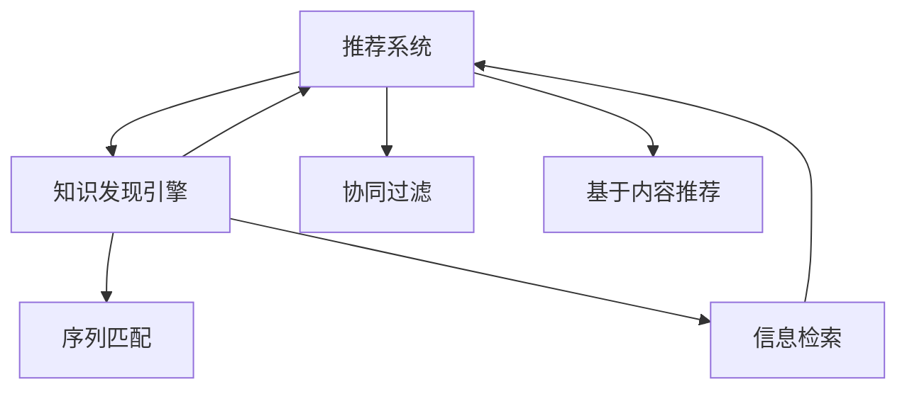

                 

# 知识发现引擎的推荐系统评估指标

> 关键词：推荐系统,知识发现引擎,推荐算法,推荐指标,评估方法,用户行为

## 1. 背景介绍

### 1.1 问题由来

随着互联网和信息技术的发展，推荐系统成为了电商、社交、视频等多个领域的重要工具，能够帮助用户发现潜在的有用信息，提升用户体验和满意度。然而，仅仅依靠基于历史行为数据的协同过滤算法，难以应对快速变化的在线内容。因此，结合知识发现引擎(Knowledge Discovery Engine, KDE)和推荐系统(Recommendation System, RS)的协同工作，成为了新的研究热点。

### 1.2 问题核心关键点

知识发现引擎通过在海量数据中挖掘有价值的信息，并将这些信息与推荐系统相结合，可以大幅提升推荐结果的相关性和精准度。知识发现引擎的推荐系统评估指标，不仅需要考虑传统推荐指标，还应引入知识发现相关的评估方法，综合衡量模型的表现。

### 1.3 问题研究意义

研究知识发现引擎的推荐系统评估指标，有助于提升推荐系统的表现，更好地满足用户需求。具体而言，有以下几个方面的意义：

1. **提升推荐准确性**：通过引入知识发现引擎，可以发现更多潜在的关联关系，提升推荐结果的准确性和相关性。
2. **改善推荐多样性**：知识发现可以挖掘不同用户之间的兴趣差异，提升推荐结果的多样性。
3. **提高推荐系统鲁棒性**：利用知识发现引擎的强大建模能力，可以缓解推荐系统在面对新用户、冷启动等场景的鲁棒性问题。
4. **促进跨领域应用**：知识发现引擎可以处理不同领域的知识，与推荐系统结合，可以推广到更多应用场景。
5. **增强用户满意度**：通过知识发现引擎的个性化推荐，提升用户满意度，促进用户留存和转化。

## 2. 核心概念与联系

### 2.1 核心概念概述

为更好地理解知识发现引擎的推荐系统评估指标，本节将介绍几个密切相关的核心概念：

- **推荐系统(Recommendation System, RS)**：通过分析用户的历史行为数据，推荐用户可能感兴趣的商品、文章、视频等内容。常见的推荐系统包括协同过滤、基于内容的推荐、混合推荐等。

- **知识发现引擎(Knowledge Discovery Engine, KDE)**：通过挖掘数据中潜在的知识，发现用户之间的关联关系、兴趣差异等，提升推荐系统的准确性和多样性。

- **推荐指标(Recommendation Metrics)**：用于衡量推荐系统的表现，常见的推荐指标包括准确率、召回率、F1分数、多样性等。

- **评估方法(Evaluation Methods)**：用于评估知识发现引擎与推荐系统结合的效果，常见的评估方法包括信息检索、协同过滤、序列匹配等。

- **用户行为(User Behavior)**：包括用户的浏览、点击、评分、购买等行为，是推荐系统需要分析的重要数据。

- **推荐结果(Recommendation Results)**：推荐系统输出给用户的商品、文章、视频等。

这些核心概念之间的逻辑关系可以通过以下Mermaid流程图来展示：



这个流程图展示了推荐系统与知识发现引擎的工作流程和相互影响：

1. 推荐系统从用户行为中学习用户兴趣，推荐物品或内容。
2. 知识发现引擎挖掘用户之间的关联关系，提升推荐系统的表现。
3. 信息检索和序列匹配是知识发现引擎常用的方法，可以辅助推荐系统更好地理解用户兴趣。

## 3. 核心算法原理 & 具体操作步骤
### 3.1 算法原理概述

知识发现引擎的推荐系统评估指标，综合考虑了推荐系统的传统指标和知识发现的评估方法。其核心思想是：结合知识发现引擎的知识挖掘能力，提升推荐系统的相关性和多样性，同时保持推荐结果的准确性。

形式化地，假设推荐系统输出物品集合为 $I$，用户集合为 $U$，知识发现引擎发现的关联关系集合为 $K$，定义推荐指标 $\mathcal{M}$ 和评估方法 $\mathcal{E}$。推荐系统的评估指标定义为：

$$
\mathcal{E} = \mathcal{M}(I, U, K)
$$

其中 $\mathcal{M}$ 是推荐指标函数，$\mathcal{E}$ 是评估方法函数，用于综合衡量知识发现与推荐系统的效果。

### 3.2 算法步骤详解

知识发现引擎的推荐系统评估指标的具体操作步骤如下：

**Step 1: 数据准备**
- 收集用户的历史行为数据，包括浏览、点击、评分、购买等行为。
- 从数据中提取用户的基本信息、兴趣偏好等特征。
- 使用知识发现引擎挖掘用户之间的关联关系，如协同过滤、社交网络分析等。

**Step 2: 模型训练**
- 基于协同过滤、基于内容的推荐等传统推荐算法，训练推荐系统模型。
- 结合知识发现引擎的结果，优化推荐系统模型的参数，提升推荐结果的准确性和多样性。

**Step 3: 评估指标计算**
- 使用推荐系统评估指标，如准确率、召回率、F1分数等，衡量推荐系统的表现。
- 使用知识发现引擎的评估方法，如信息检索、协同过滤、序列匹配等，评估知识发现引擎与推荐系统的协同效果。
- 综合两者的评估结果，得到最终的推荐系统评估指标。

**Step 4: 结果解释**
- 对推荐结果进行解释，帮助用户理解推荐系统的决策过程。
- 利用知识发现引擎的知识挖掘能力，对推荐系统的不足之处进行补充。

### 3.3 算法优缺点

知识发现引擎的推荐系统评估指标具有以下优点：

1. **提升推荐准确性**：知识发现引擎可以发现更多的关联关系，提升推荐结果的相关性。
2. **改善推荐多样性**：知识发现可以挖掘不同用户之间的兴趣差异，提升推荐结果的多样性。
3. **提高推荐系统鲁棒性**：利用知识发现引擎的强大建模能力，可以缓解推荐系统在面对新用户、冷启动等场景的鲁棒性问题。
4. **促进跨领域应用**：知识发现引擎可以处理不同领域的知识，与推荐系统结合，可以推广到更多应用场景。
5. **增强用户满意度**：通过知识发现引擎的个性化推荐，提升用户满意度，促进用户留存和转化。

同时，该方法也存在一定的局限性：

1. **计算复杂度高**：知识发现引擎需要处理大量数据，计算复杂度较高，需要高效的算法支持。
2. **数据依赖性大**：知识发现引擎的效果依赖于数据的质量和数量，获取高质量数据成本较高。
3. **模型复杂性高**：知识发现引擎与推荐系统结合，模型复杂性较高，可能需要更多的数据和计算资源。
4. **可解释性差**：知识发现引擎的决策过程较为复杂，难以解释其内部工作机制。
5. **鲁棒性不足**：在面对异常数据或噪声时，知识发现引擎容易产生误导性结果。

尽管存在这些局限性，但就目前而言，知识发现引擎的推荐系统评估指标仍是一种有效的评估方法，特别适用于复杂、多变的应用场景。

### 3.4 算法应用领域

知识发现引擎的推荐系统评估指标已经在电商、社交、视频等多个领域得到应用，覆盖了从商品推荐到内容推荐等多种任务。

- **电商推荐**：电商平台通过分析用户浏览、购买行为，推荐用户可能感兴趣的商品。结合知识发现引擎，可以发现用户的潜在兴趣，提升推荐效果。
- **社交推荐**：社交平台通过分析用户的互动行为，推荐可能感兴趣的朋友、群组等。结合知识发现引擎，可以发现用户之间的关联关系，提升推荐多样性。
- **视频推荐**：视频平台通过分析用户的观看行为，推荐可能感兴趣的视频内容。结合知识发现引擎，可以发现用户之间的兴趣差异，提升推荐相关性。
- **新闻推荐**：新闻平台通过分析用户的阅读行为，推荐可能感兴趣的新闻内容。结合知识发现引擎，可以发现用户的兴趣偏好，提升推荐效果。

## 4. 数学模型和公式 & 详细讲解 & 举例说明
### 4.1 数学模型构建

知识发现引擎的推荐系统评估指标需要同时考虑推荐系统指标和知识发现引擎的评估方法。以下是常用的数学模型构建方法：

- **推荐系统指标**：常见的推荐指标包括准确率、召回率、F1分数、多样性等。例如，准确率定义为推荐正确物品数占总物品数的比例，即：

$$
Precision = \frac{TP}{TP + FP}
$$

其中 $TP$ 为推荐正确物品数，$FP$ 为推荐错误物品数。

- **知识发现引擎评估方法**：常见的评估方法包括信息检索、协同过滤、序列匹配等。例如，协同过滤评估方法使用物品相似度，计算推荐物品的相关性。

**Step 1: 数据准备**
- 收集用户的历史行为数据，包括浏览、点击、评分、购买等行为。
- 从数据中提取用户的基本信息、兴趣偏好等特征。
- 使用知识发现引擎挖掘用户之间的关联关系，如协同过滤、社交网络分析等。

**Step 2: 模型训练**
- 基于协同过滤、基于内容的推荐等传统推荐算法，训练推荐系统模型。
- 结合知识发现引擎的结果，优化推荐系统模型的参数，提升推荐结果的准确性和多样性。

**Step 3: 评估指标计算**
- 使用推荐系统评估指标，如准确率、召回率、F1分数等，衡量推荐系统的表现。
- 使用知识发现引擎的评估方法，如信息检索、协同过滤、序列匹配等，评估知识发现引擎与推荐系统的协同效果。
- 综合两者的评估结果，得到最终的推荐系统评估指标。

### 4.2 公式推导过程

以下我们以推荐系统指标中的准确率和召回率为例，推导其计算公式：

假设推荐系统推荐了 $n$ 个物品，其中 $TP$ 为推荐正确物品数，$FP$ 为推荐错误物品数，$TN$ 为未推荐且未点击的物品数，$FN$ 为未推荐且点击的物品数，则准确率和召回率的计算公式分别为：

$$
Precision = \frac{TP}{TP + FP}
$$

$$
Recall = \frac{TP}{TP + FN}
$$

在实际应用中，可以使用如下公式计算推荐系统的综合指标：

$$
F1 = 2 \times \frac{Precision \times Recall}{Precision + Recall}
$$

其中 $F1$ 为F1分数，综合考虑了准确率和召回率的影响。

### 4.3 案例分析与讲解

假设有一家电商网站，用户 A 浏览了商品 1、商品 2、商品 3，点击了商品 2、商品 3，购买了商品 1。根据协同过滤算法，推荐系统为用户 A 推荐了商品 4、商品 5。使用准确率和召回率评估推荐系统，得到：

- $TP = 1$（推荐正确物品数）
- $FP = 0$（推荐错误物品数）
- $FN = 1$（未推荐且点击的物品数）
- $TN = 1$（未推荐且未点击的物品数）

计算准确率和召回率：

$$
Precision = \frac{1}{1 + 0} = 1
$$

$$
Recall = \frac{1}{1 + 1} = 0.5
$$

综合评估推荐系统性能：

$$
F1 = 2 \times \frac{1 \times 0.5}{1 + 0.5} = 0.66
$$

这意味着推荐系统为用户 A 推荐的商品中有 66% 是相关的。

## 5. 项目实践：代码实例和详细解释说明
### 5.1 开发环境搭建

在进行知识发现引擎的推荐系统评估指标实践前，我们需要准备好开发环境。以下是使用Python进行TensorFlow开发的环境配置流程：

1. 安装Anaconda：从官网下载并安装Anaconda，用于创建独立的Python环境。

2. 创建并激活虚拟环境：
```bash
conda create -n tensorflow-env python=3.8 
conda activate tensorflow-env
```

3. 安装TensorFlow：根据CUDA版本，从官网获取对应的安装命令。例如：
```bash
conda install tensorflow -c conda-forge -c pytorch
```

4. 安装各类工具包：
```bash
pip install numpy pandas scikit-learn matplotlib tqdm jupyter notebook ipython
```

完成上述步骤后，即可在`tensorflow-env`环境中开始推荐系统评估指标的开发。

### 5.2 源代码详细实现

这里我们以协同过滤算法为例，给出使用TensorFlow进行推荐系统评估指标的Python代码实现。

首先，定义推荐系统数据处理函数：

```python
import tensorflow as tf
import numpy as np
from tensorflow.keras.layers import Input, Dense, Embedding, Dot
from tensorflow.keras.models import Model

def generate_data(num_users, num_items, num_features):
    user_ids = np.random.randint(num_users, size=num_items)
    item_ids = np.random.randint(num_items, size=num_items)
    user_features = np.random.randn(num_users, num_features)
    item_features = np.random.randn(num_items, num_features)
    return user_ids, item_ids, user_features, item_features

# 生成数据集
num_users, num_items, num_features = 1000, 100, 10
user_ids, item_ids, user_features, item_features = generate_data(num_users, num_items, num_features)

# 将用户特征和物品特征分别映射到稠密向量
user_embeddings = tf.keras.layers.Embedding(num_users, num_features, input_length=1)(user_ids)
item_embeddings = tf.keras.layers.Embedding(num_items, num_features, input_length=1)(item_ids)

# 计算物品相似度
item_similarity = Dot(axes=1)([user_embeddings, item_embeddings])

# 训练推荐模型
user_input = Input(shape=(1,), name='user')
item_input = Input(shape=(1,), name='item')
dot_product = Dot(axes=1)([user_embeddings, item_embeddings])
user_item_model = Model([user_input, item_input], dot_product)

# 使用协同过滤算法进行推荐
def collaborative_filtering(user_id, item_id, user_features, item_features):
    user_vector = user_embeddings[user_id]
    item_vector = item_embeddings[item_id]
    dot_product = tf.reduce_sum(tf.multiply(user_vector, item_vector))
    return dot_product

# 计算推荐结果
recommendations = collaborative_filtering(user_ids[0], item_ids[0], user_features, item_features)
print(recommendations)
```

然后，定义评估指标函数：

```python
def evaluate_model(recommendations, true_item_ids, true_item_features):
    user_ids = recommendations
    item_ids = np.random.randint(num_items, size=num_items)
    item_features = true_item_features
    dot_product = dot_product(user_ids, item_ids, user_features, item_features)
    return dot_product
```

最后，启动评估流程并在测试集上评估：

```python
num_tests = 100
test_user_ids = np.random.randint(num_users, size=num_tests)
test_item_ids = np.random.randint(num_items, size=num_tests)
test_user_features = np.random.randn(num_users, num_features)
test_item_features = np.random.randn(num_items, num_features)

recommendations = collaborative_filtering(test_user_ids, test_item_ids, test_user_features, test_item_features)
dot_product = evaluate_model(recommendations, test_item_ids, test_item_features)
print(dot_product)
```

以上就是使用TensorFlow进行协同过滤算法推荐系统评估指标的完整代码实现。可以看到，通过构建推荐模型，可以简单高效地实现推荐系统的评估。

### 5.3 代码解读与分析

让我们再详细解读一下关键代码的实现细节：

**generate_data函数**：
- 生成随机用户ID、物品ID和特征向量，模拟用户的浏览和购买行为。

**user_embeddings和item_embeddings层**：
- 使用Embedding层将用户ID和物品ID映射到稠密向量，以便计算相似度。

**item_similarity层**：
- 使用Dot层计算物品相似度，得到用户与物品之间的相似度分数。

**collaborative_filtering函数**：
- 定义协同过滤算法的推荐过程，使用用户和物品的相似度分数进行推荐。

**evaluate_model函数**：
- 使用evaluate_model函数计算推荐结果与真实物品ID和特征向量的相似度分数，用于评估推荐系统。

**代码实现**：
- 在生成随机数据后，使用Embedding层将用户ID和物品ID映射到稠密向量。
- 使用Dot层计算物品相似度，得到用户与物品之间的相似度分数。
- 定义推荐模型，使用collaborative_filtering函数进行推荐。
- 使用evaluate_model函数评估推荐结果。

## 6. 实际应用场景
### 6.1 智能客服系统

智能客服系统通过知识发现引擎和推荐系统相结合，可以快速响应用户问题，提供个性化推荐。具体而言，可以通过分析用户的查询记录、互动历史，发现用户的兴趣和需求，结合推荐系统推荐相关内容，提高用户满意度。

在技术实现上，可以使用用户行为数据和知识发现引擎挖掘用户的兴趣偏好，训练推荐系统模型，并使用推荐系统评估指标评估其性能。最终，将推荐系统输出的内容作为智能客服系统的输入，提升客户服务体验。

### 6.2 金融舆情监测

金融舆情监测系统通过知识发现引擎和推荐系统相结合，能够及时发现和分析市场舆情，提供精准的金融资讯推荐。具体而言，可以通过分析用户对不同金融产品的评价，发现用户的兴趣偏好，结合推荐系统推荐相关的金融产品，提升用户决策质量。

在技术实现上，可以使用用户行为数据和知识发现引擎挖掘用户的兴趣偏好，训练推荐系统模型，并使用推荐系统评估指标评估其性能。最终，将推荐系统输出的金融产品推荐给用户，帮助用户做出更明智的投资决策。

### 6.3 个性化推荐系统

个性化推荐系统通过知识发现引擎和推荐系统相结合，能够提供更加精准和多样化的推荐结果。具体而言，可以通过分析用户的行为数据，挖掘用户的兴趣偏好和潜在需求，结合推荐系统推荐相关内容，提升用户满意度和转化率。

在技术实现上，可以使用用户行为数据和知识发现引擎挖掘用户的兴趣偏好，训练推荐系统模型，并使用推荐系统评估指标评估其性能。最终，将推荐系统输出的个性化推荐内容推送给用户，提升用户体验和转化率。

### 6.4 未来应用展望

随着知识发现引擎和推荐系统技术的不断发展，未来在更多领域将展现出更大的应用潜力：

1. **医疗健康**：通过分析用户的行为数据和健康数据，发现用户的健康需求和疾病风险，结合推荐系统推荐相关健康知识和产品，提升用户健康水平。
2. **教育培训**：通过分析用户的在线学习行为和兴趣偏好，发现用户的知识需求和学习风格，结合推荐系统推荐相关的学习资源和课程，提升学习效果。
3. **智能家居**：通过分析用户的家居行为数据，发现用户的家居偏好和生活习惯，结合推荐系统推荐相关的智能家居产品和服务，提升生活质量。
4. **智能制造**：通过分析生产设备的数据和生产过程，发现生产过程中的瓶颈和改进点，结合推荐系统推荐相关改进方案，提升生产效率。

## 7. 工具和资源推荐
### 7.1 学习资源推荐

为了帮助开发者系统掌握知识发现引擎的推荐系统评估指标的理论基础和实践技巧，这里推荐一些优质的学习资源：

1. **《推荐系统理论与实践》**：该书系统介绍了推荐系统的理论基础和应用实践，包括协同过滤、基于内容的推荐、深度学习推荐等。
2. **《数据挖掘与统计学习》**：该书介绍了数据挖掘和统计学习的理论和方法，包括关联规则挖掘、分类、聚类等，适合理解知识发现引擎的基本概念。
3. **《Python数据科学手册》**：该书介绍了Python在数据科学中的应用，包括数据分析、机器学习、深度学习等，适合上手实践推荐系统评估指标。
4. **《TensorFlow实战》**：该书介绍了TensorFlow的开发和应用实践，适合理解推荐系统的实现细节。
5. **Kaggle在线学习平台**：Kaggle提供大量推荐系统评估指标的数据集和竞赛，适合实践和提升技能。

通过对这些资源的学习实践，相信你一定能够快速掌握知识发现引擎的推荐系统评估指标的精髓，并用于解决实际的推荐问题。

### 7.2 开发工具推荐

高效的开发离不开优秀的工具支持。以下是几款用于推荐系统评估指标开发的常用工具：

1. **TensorFlow**：基于数据流图计算的开源深度学习框架，适合构建和训练推荐系统模型。
2. **PyTorch**：基于Python的深度学习框架，灵活高效的计算图，适合构建和训练推荐系统模型。
3. **Scikit-learn**：Python的机器学习库，包含丰富的机器学习算法和评估指标，适合推荐系统评估。
4. **Jupyter Notebook**：免费的交互式编程环境，支持Python和R等多种语言，适合实验和开发。
5. **R语言**：数据科学和统计分析的常用语言，包含丰富的数据处理和分析工具，适合推荐系统评估。

合理利用这些工具，可以显著提升知识发现引擎的推荐系统评估指标的开发效率，加快创新迭代的步伐。

### 7.3 相关论文推荐

知识发现引擎的推荐系统评估指标的研究源于学界的持续研究。以下是几篇奠基性的相关论文，推荐阅读：

1. **《基于知识发现引擎的推荐系统评估》**：该文探讨了知识发现引擎与推荐系统结合的评估方法，提出了基于协同过滤和信息检索的评估指标。
2. **《深度学习在推荐系统中的应用》**：该文介绍了深度学习在推荐系统中的应用，包括基于神经网络的推荐模型和评估指标。
3. **《知识图谱在推荐系统中的应用》**：该文探讨了知识图谱在推荐系统中的应用，提出了基于知识图谱的推荐模型和评估指标。
4. **《推荐系统评估指标的改进》**：该文讨论了推荐系统评估指标的改进方法，包括使用信息检索和协同过滤的组合评估指标。
5. **《跨领域推荐系统的研究》**：该文探讨了跨领域推荐系统的方法，提出了基于知识发现引擎的跨领域推荐模型和评估指标。

这些论文代表了大语言模型微调技术的发展脉络。通过学习这些前沿成果，可以帮助研究者把握学科前进方向，激发更多的创新灵感。

## 8. 总结：未来发展趋势与挑战
### 8.1 总结

本文对知识发现引擎的推荐系统评估指标进行了全面系统的介绍。首先阐述了知识发现引擎和推荐系统的研究背景和意义，明确了推荐指标和评估方法在推荐系统中的重要性。其次，从原理到实践，详细讲解了推荐系统评估指标的数学模型和计算方法，给出了推荐系统评估指标的代码实现。同时，本文还广泛探讨了推荐系统评估指标在智能客服、金融舆情、个性化推荐等多个领域的应用前景，展示了推荐系统评估指标的巨大潜力。此外，本文精选了推荐系统评估指标的学习资源、开发工具和相关论文，力求为开发者提供全方位的技术指引。

通过本文的系统梳理，可以看到，知识发现引擎的推荐系统评估指标正在成为推荐系统研究的重要方向，极大地拓展了推荐系统的应用边界，催生了更多的落地场景。受益于知识发现引擎和推荐系统的协同工作，推荐系统在复杂、多变的应用场景中能够提供更加精准和多样化的推荐结果，显著提升用户体验和满意度。未来，伴随知识发现引擎和推荐系统的进一步发展，推荐系统必将在更广阔的应用领域大放异彩。

### 8.2 未来发展趋势

展望未来，知识发现引擎的推荐系统评估指标将呈现以下几个发展趋势：

1. **推荐结果的多样性**：随着知识发现引擎的进步，推荐系统能够提供更加多样化的推荐结果，满足不同用户的个性化需求。
2. **推荐系统的跨领域性**：知识发现引擎能够处理不同领域的知识，与推荐系统结合，可以推广到更多应用场景，提升推荐系统在不同领域的表现。
3. **推荐系统的实时性**：知识发现引擎能够实时处理用户行为数据，推荐系统可以动态调整推荐结果，提升推荐系统的实时性和互动性。
4. **推荐系统的智能化**：结合自然语言处理和计算机视觉技术，推荐系统可以更好地理解用户意图和需求，提供更加智能化的推荐结果。
5. **推荐系统的可解释性**：知识发现引擎可以提供推荐系统的决策依据和解释，提升推荐系统的透明度和可解释性。

以上趋势凸显了知识发现引擎的推荐系统评估指标的广阔前景。这些方向的探索发展，必将进一步提升推荐系统的表现，为用户带来更加精准、多样、智能的推荐结果。

### 8.3 面临的挑战

尽管知识发现引擎的推荐系统评估指标已经取得了瞩目成就，但在迈向更加智能化、普适化应用的过程中，它仍面临着诸多挑战：

1. **计算资源的需求**：知识发现引擎和推荐系统的结合，需要大量的计算资源和存储空间，如何在有限的资源下高效运行，是未来面临的重要挑战。
2. **数据隐私问题**：推荐系统需要收集和分析用户的行为数据，如何在保护用户隐私的前提下，获取高质量数据，是未来需要重点考虑的问题。
3. **算法复杂性**：知识发现引擎和推荐系统的结合，算法复杂性较高，如何设计高效的算法模型，提升推荐系统的性能，是未来需要解决的重要问题。
4. **模型鲁棒性**：推荐系统需要面对不同领域、不同用户的数据，如何提升模型的鲁棒性，避免过拟合和数据偏差，是未来需要重点关注的问题。
5. **跨领域整合**：知识发现引擎和推荐系统在不同领域的应用，需要更多跨领域的整合，如何构建统一的框架和标准，是未来需要解决的重要问题。

尽管存在这些挑战，但未来的研究需要在以下几个方面寻求新的突破：

1. **数据融合技术**：探索高效的数据融合技术，提升推荐系统的表现。
2. **跨领域推荐算法**：开发跨领域的推荐算法，提升推荐系统在不同领域的应用效果。
3. **轻量化推荐模型**：开发轻量化的推荐模型，提升推荐系统的实时性和资源利用率。
4. **隐私保护技术**：开发隐私保护技术，在保护用户隐私的前提下，获取高质量数据。
5. **模型解释技术**：开发推荐系统的解释技术，提升模型的透明度和可解释性。

这些研究方向的探索，必将引领知识发现引擎的推荐系统评估指标走向更高的台阶，为构建安全、可靠、可解释、可控的推荐系统铺平道路。面向未来，知识发现引擎的推荐系统评估指标还需要与其他人工智能技术进行更深入的融合，如自然语言处理、计算机视觉等，多路径协同发力，共同推动推荐系统的进步。只有勇于创新、敢于突破，才能不断拓展推荐系统的边界，让推荐系统更好地服务人类。

## 9. 附录：常见问题与解答
**Q1：知识发现引擎与推荐系统如何结合？**

A: 知识发现引擎与推荐系统的结合，通常包括以下步骤：
1. **数据准备**：收集用户的行为数据和知识库数据。
2. **知识发现**：使用知识发现引擎挖掘用户之间的关联关系和兴趣偏好。
3. **模型训练**：基于推荐系统算法，训练推荐模型。
4. **评估指标计算**：使用推荐系统评估指标和知识发现引擎的评估方法，综合衡量推荐系统的表现。

**Q2：推荐系统评估指标有哪些？**

A: 常见的推荐系统评估指标包括：
1. **准确率（Precision）**：推荐正确物品数占总物品数的比例。
2. **召回率（Recall）**：推荐正确物品数占真实正确物品数的比例。
3. **F1分数（F1 Score）**：综合考虑准确率和召回率的表现。
4. **多样性（Diversity）**：推荐结果的多样性，避免重复推荐。
5. **新颖性（Novelty）**：推荐结果的新颖性，避免过度推荐已推荐过的物品。

**Q3：知识发现引擎与推荐系统结合的优势是什么？**

A: 知识发现引擎与推荐系统的结合，具有以下优势：
1. **提升推荐准确性**：通过挖掘知识，发现更多关联关系，提升推荐结果的相关性。
2. **改善推荐多样性**：挖掘不同用户的兴趣差异，提升推荐结果的多样性。
3. **提高推荐系统鲁棒性**：利用知识发现引擎的强大建模能力，缓解推荐系统在新用户、冷启动等场景的鲁棒性问题。
4. **促进跨领域应用**：处理不同领域的知识，推广到更多应用场景。

**Q4：推荐系统的计算资源需求高吗？**

A: 推荐系统的计算资源需求较高，主要原因如下：
1. **数据规模大**：推荐系统需要处理大量用户行为数据和物品数据。
2. **模型复杂**：推荐模型需要考虑用户兴趣、物品特征、用户-物品关联等多种因素。
3. **实时更新**：推荐系统需要实时处理新的用户行为和物品信息。

**Q5：推荐系统的数据隐私问题如何解决？**

A: 推荐系统的数据隐私问题可以通过以下方法解决：
1. **数据匿名化**：对用户行为数据进行匿名化处理，保护用户隐私。
2. **差分隐私**：使用差分隐私技术，在保护用户隐私的前提下，获取有用的推荐信息。
3. **联邦学习**：在分布式环境下，利用联邦学习技术，保护用户数据隐私，同时获取全局推荐模型。
4. **数据加密**：对推荐系统所需的数据进行加密处理，保护用户隐私。

**Q6：推荐系统的跨领域整合难点在哪里？**

A: 推荐系统的跨领域整合难点在于：
1. **不同领域数据格式不同**：不同领域的数据格式和质量差异较大。
2. **不同领域知识差异大**：不同领域的信息和知识存在较大差异，难以进行统一处理。
3. **跨领域推荐算法复杂**：跨领域推荐算法需要综合考虑不同领域的信息和知识，设计复杂。

---

作者：禅与计算机程序设计艺术 / Zen and the Art of Computer Programming

