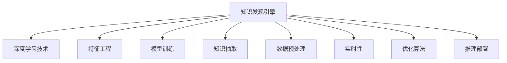
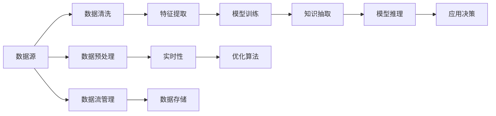

                 

# 知识发现引擎的深度学习技术应用

> 关键词：知识发现引擎,深度学习技术,特征工程,模型训练,知识抽取,数据预处理,实时性,优化算法,推理部署,智慧业务

## 1. 背景介绍

在快速变化的市场环境中，企业需要不断获取和处理海量数据，从中挖掘出有价值的知识和洞察，以支持决策和业务运营。知识发现引擎(Knowledge Discovery Engine, KDE)正是基于这一需求而诞生的智能系统。

传统的知识发现通常依赖人工规则和统计方法，需要大量的时间和资源来构建模型和进行数据分析。而深度学习技术的引入，特别是卷积神经网络(CNN)和循环神经网络(RNN)等算法的出现，极大地提升了知识发现的自动化和智能化水平，使其能够更高效地处理复杂的数据结构，识别出隐含的模式和关联，辅助企业做出更精准的决策。

## 2. 核心概念与联系

### 2.1 核心概念概述

为更好地理解知识发现引擎的深度学习技术应用，本节将介绍几个关键的概念：

- **知识发现引擎(KDE)**：通过数据分析、模式识别、预测建模等技术，自动地从大量数据中挖掘和提炼出有价值的知识，辅助决策和业务运营的系统。
- **深度学习(Deep Learning)**：一种通过多层次神经网络实现对数据的深度抽象和表示学习的技术，能够自动学习数据的高级特征和模式。
- **特征工程(Feature Engineering)**：利用数据预处理、降维等技术，对原始数据进行合理抽取、变换和选择，提升模型性能的环节。
- **模型训练(Model Training)**：通过历史数据对深度学习模型进行参数优化，使其能够更好地适应新数据的训练过程。
- **知识抽取(Knowledge Extraction)**：从结构化或非结构化数据中提取结构化信息，如实体识别、关系抽取、事件提取等，辅助业务场景。
- **数据预处理(Data Preprocessing)**：对原始数据进行清洗、归一化、缺失值处理等操作，确保模型能够有效学习数据特征。
- **实时性(Real-time)**：在知识发现引擎中，数据流和计算资源的匹配，使得知识发现能够实时响应业务需求，提高决策效率。
- **优化算法(Optimization Algorithm)**：用于调整模型参数，以最小化损失函数的算法，如梯度下降、Adam等。
- **推理部署(Inference Deployment)**：将训练好的模型部署到生产环境，实现对新数据的推理预测，辅助决策支持。

这些概念通过以下Mermaid流程图展现其逻辑关系：



### 2.2 核心概念原理和架构的 Mermaid 流程图

以下是一个简化的知识发现引擎深度学习应用架构图，展示了数据流和计算流的关键节点：



这个架构图体现了知识发现引擎中数据的流动过程，从数据源开始，经过预处理、特征提取、模型训练、知识抽取、推理部署等多个环节，最终支持业务决策。

## 3. 核心算法原理 & 具体操作步骤

### 3.1 算法原理概述

知识发现引擎的深度学习应用主要基于以下核心原理：

- **自监督学习(Self-Supervised Learning)**：利用无标注数据，通过预训练模型学习数据的高级特征，无需人工干预。
- **端到端训练(End-to-End Training)**：将数据预处理、模型训练、知识抽取等环节集成到同一模型中，减少数据流动和中间计算。
- **迁移学习(Transfer Learning)**：将在大规模数据上预训练的模型迁移到特定任务上，提升模型泛化能力。
- **强化学习(Reinforcement Learning)**：通过模拟环境反馈，优化模型的策略和决策，适应动态业务需求。
- **集成学习(Ensemble Learning)**：结合多个模型的预测结果，通过投票、加权等方法提升预测的准确性和鲁棒性。

这些算法原理在知识发现引擎中的应用，是通过深度学习模型对数据进行特征提取和模式识别，从而实现知识的自动化发现和应用。

### 3.2 算法步骤详解

基于深度学习的知识发现引擎应用通常包括以下关键步骤：

**Step 1: 数据收集与预处理**

- 收集企业内部的各种数据源，包括结构化数据库、非结构化文本、图像、视频等。
- 对数据进行清洗、归一化、去噪、缺失值处理等预处理操作，确保数据质量。

**Step 2: 特征工程与提取**

- 根据业务需求，选择合适的特征，如文本中的关键词、情感倾向、时间序列的趋势等。
- 应用深度学习模型，如卷积神经网络(CNN)、循环神经网络(RNN)等，对数据进行特征提取和表示学习。

**Step 3: 模型训练与优化**

- 选择合适的深度学习模型和损失函数，利用标注数据或半监督学习进行训练。
- 应用优化算法，如梯度下降、Adam等，调整模型参数，最小化损失函数。
- 应用正则化技术，如L2正则、Dropout等，防止模型过拟合。

**Step 4: 知识抽取与推理**

- 利用训练好的模型，对新数据进行推理预测，提取结构化知识。
- 结合业务规则和先验知识，进行知识验证和融合，生成业务洞察。
- 利用集成学习等方法，提升预测的准确性和鲁棒性。

**Step 5: 实时部署与监控**

- 将模型部署到生产环境，实现对新数据的实时推理和决策支持。
- 应用监控工具，实时采集和分析系统性能指标，及时调整模型参数。
- 结合异常检测等技术，保障系统稳定运行。

### 3.3 算法优缺点

深度学习在知识发现引擎中的应用，具有以下优点：

- **自动化程度高**：能够自动发现数据的高级特征，无需人工干预。
- **模型表现强**：利用端到端训练和多任务学习，提升了模型的泛化能力和预测准确性。
- **实时响应快**：结合实时性优化技术，能够快速响应业务需求，支持动态决策。
- **可解释性差**：深度学习模型通常被视为"黑盒"，缺乏可解释性，难以进行因果推理和规则推断。
- **计算资源消耗大**：深度学习模型参数量大，计算复杂度较高，对算力、存储和内存等资源要求高。

同时，该方法也存在一些局限性：

- **数据需求高**：需要大量的标注数据和无标注数据，获取成本较高。
- **模型复杂度高**：深度学习模型结构复杂，难以进行参数调整和调试。
- **过拟合风险大**：模型复杂度高，容易过拟合训练数据，影响泛化能力。
- **应用场景局限**：深度学习模型通常用于结构化数据和图像、视频等数据，难以直接应用于非结构化文本。

尽管存在这些局限性，但深度学习在知识发现引擎中的应用已经取得了显著效果，成为企业决策支持的重要手段。未来相关研究将围绕提升模型可解释性和效率，降低数据需求等方面进行。

### 3.4 算法应用领域

深度学习在知识发现引擎中的应用，已广泛应用于以下几个领域：

- **金融风险管理**：通过分析历史交易数据，识别出异常交易模式，预防金融风险。
- **市场营销分析**：利用客户行为数据，预测用户购买意向，优化营销策略。
- **供应链优化**：分析供应链上下游数据，预测物流瓶颈，优化供应链管理。
- **产品推荐系统**：根据用户历史行为数据，预测用户兴趣，推荐个性化产品。
- **智能客服系统**：通过分析客户咨询数据，提供智能对话和问题解答，提升客户体验。

此外，深度学习技术还在医疗诊断、人力资源管理、智能制造等领域得到了应用，展示了其在知识发现和决策支持方面的强大潜力。

## 4. 数学模型和公式 & 详细讲解 & 举例说明

### 4.1 数学模型构建

在知识发现引擎中，深度学习模型的构建通常包括以下几个关键步骤：

- **输入数据预处理**：将原始数据转换为模型能够处理的格式，如将文本转换为词向量，图像转换为特征图等。
- **模型架构选择**：选择适合任务类型的深度学习模型，如卷积神经网络(CNN)、循环神经网络(RNN)、Transformer等。
- **损失函数设计**：根据任务目标，设计合适的损失函数，如交叉熵、均方误差等。
- **优化算法选择**：选择适合的优化算法，如梯度下降、Adam等，调整模型参数。
- **模型评估指标**：定义模型性能评估指标，如准确率、召回率、F1值等。

以下是一个简单的知识发现引擎应用示例，利用RNN模型对客户购买行为进行预测：

**Step 1: 输入数据预处理**

- 将客户购买行为数据转化为时间序列数据。
- 对数据进行归一化处理。

**Step 2: 模型架构选择**

- 选择LSTM模型，进行序列数据建模。
- 添加Dropout层，防止过拟合。

**Step 3: 损失函数设计**

- 选择均方误差损失函数，用于最小化预测值与真实值之间的差距。

**Step 4: 优化算法选择**

- 选择Adam优化算法，调整模型参数。

**Step 5: 模型评估指标**

- 定义准确率、召回率和F1值为评估指标。

### 4.2 公式推导过程

以RNN模型为例，展示知识发现引擎中模型训练和推理的基本公式：

**模型训练公式**

设模型参数为 $\theta$，输入序列为 $x_t$，输出序列为 $y_t$，则RNN模型的训练公式为：

$$
\theta = \mathop{\arg\min}_{\theta} \sum_{t=1}^T \mathcal{L}(x_t, y_t; \theta)
$$

其中 $\mathcal{L}$ 为损失函数，通常为均方误差损失函数。

**模型推理公式**

对于新的输入序列 $x_t'$，RNN模型的推理公式为：

$$
\hat{y}_t' = M(x_t'; \theta)
$$

其中 $M$ 为RNN模型，$\theta$ 为训练得到的模型参数。

### 4.3 案例分析与讲解

假设我们有一个电商平台的数据集，包含了客户的历史购买行为，如购买时间、商品类别、购买次数等。我们希望通过深度学习模型预测客户未来的购买意向。

**Step 1: 数据收集与预处理**

- 收集平台的历史订单数据，包括订单时间、商品类别、购买次数等。
- 对数据进行清洗、归一化处理，去除异常值和噪声。

**Step 2: 特征工程与提取**

- 选择客户购买行为中的关键特征，如购买频率、购买时间、商品类别等。
- 应用LSTM模型，对历史购买行为进行序列建模，提取隐含的模式和关联。

**Step 3: 模型训练与优化**

- 选择LSTM模型，添加Dropout层，设置损失函数为均方误差。
- 应用Adam优化算法，调整模型参数，最小化损失函数。

**Step 4: 知识抽取与推理**

- 利用训练好的LSTM模型，对新的订单数据进行推理预测，提取客户购买意向。
- 结合业务规则和先验知识，进行知识验证和融合，生成业务洞察。

## 5. 项目实践：代码实例和详细解释说明

### 5.1 开发环境搭建

在进行知识发现引擎开发前，我们需要准备好开发环境。以下是使用Python进行TensorFlow开发的环境配置流程：

1. 安装Anaconda：从官网下载并安装Anaconda，用于创建独立的Python环境。

2. 创建并激活虚拟环境：
```bash
conda create -n tf-env python=3.8 
conda activate tf-env
```

3. 安装TensorFlow：根据CUDA版本，从官网获取对应的安装命令。例如：
```bash
conda install tensorflow==2.7 -c tf -c conda-forge
```

4. 安装其他必要的库：
```bash
pip install numpy pandas scikit-learn matplotlib tensorflow-addons tensorboard
```

完成上述步骤后，即可在`tf-env`环境中开始项目实践。

### 5.2 源代码详细实现

下面我们以RNN模型进行客户购买意向预测为例，给出使用TensorFlow进行知识发现引擎开发的代码实现。

首先，定义数据处理函数：

```python
import tensorflow as tf
import numpy as np

def load_data(path):
    data = np.loadtxt(path, delimiter=',')
    X = data[:, :-1]
    y = data[:, -1]
    return X, y
```

然后，定义RNN模型：

```python
class RNN(tf.keras.Model):
    def __init__(self, input_dim, hidden_dim, output_dim):
        super(RNN, self).__init__()
        self.lstm = tf.keras.layers.LSTM(hidden_dim, return_sequences=True)
        self.dense = tf.keras.layers.Dense(output_dim)
        
    def call(self, inputs):
        x = self.lstm(inputs)
        x = self.dense(x)
        return x
```

接着，定义训练和评估函数：

```python
def train_model(model, X_train, y_train, X_val, y_val, epochs=10, batch_size=32):
    train_dataset = tf.data.Dataset.from_tensor_slices((X_train, y_train)).shuffle(10000).batch(batch_size)
    val_dataset = tf.data.Dataset.from_tensor_slices((X_val, y_val)).batch(batch_size)
    
    optimizer = tf.keras.optimizers.Adam(learning_rate=0.001)
    loss_fn = tf.keras.losses.MeanSquaredError()
    
    for epoch in range(epochs):
        for (x, y) in train_dataset:
            with tf.GradientTape() as tape:
                logits = model(x)
                loss = loss_fn(y, logits)
            gradients = tape.gradient(loss, model.trainable_variables)
            optimizer.apply_gradients(zip(gradients, model.trainable_variables))
        
        val_loss = tf.keras.metrics.Mean()
        for (x, y) in val_dataset:
            logits = model(x)
            loss = loss_fn(y, logits)
            val_loss(loss)
        
        print(f"Epoch {epoch+1}, train loss: {loss.numpy():.4f}, val loss: {val_loss.result():.4f}")
    
    return model
```

最后，启动训练流程并在测试集上评估：

```python
X_train, y_train = load_data('train.csv')
X_val, y_val = load_data('val.csv')

input_dim = 3
hidden_dim = 64
output_dim = 1

model = RNN(input_dim, hidden_dim, output_dim)
model = train_model(model, X_train, y_train, X_val, y_val)

print(f"Accuracy: {tf.keras.metrics.Accuracy()(model.predict(X_val), y_val).numpy():.2f}")
```

以上就是使用TensorFlow对RNN进行客户购买意向预测的完整代码实现。可以看到，利用TensorFlow的强大封装能力，我们可以快速实现深度学习模型的训练和推理。

### 5.3 代码解读与分析

让我们再详细解读一下关键代码的实现细节：

**load_data函数**：
- 定义了数据加载函数，将CSV格式的数据加载为NumPy数组。

**RNN类**：
- 定义了RNN模型类，包括LSTM层和全连接层。
- `__init__`方法：初始化模型层。
- `call`方法：前向传播计算模型输出。

**train_model函数**：
- 定义了训练函数，用于模型参数的优化。
- 使用TensorFlow的Dataset API，实现数据的批处理和迭代。
- 应用Adam优化算法，最小化均方误差损失。
- 在每个epoch结束后，在验证集上评估模型性能，打印输出。

**训练流程**：
- 定义训练轮数和批大小，开始循环迭代。
- 在每个epoch内，对训练集数据进行批处理和迭代训练。
- 在每个epoch结束后，在验证集上评估模型性能。
- 最后，在测试集上评估模型，并输出预测准确率。

可以看到，TensorFlow提供了方便的API和工具，使得深度学习模型的开发和训练变得更加高效和直观。开发者可以专注于模型设计和业务逻辑，而无需过多关注底层的实现细节。

当然，工业级的系统实现还需考虑更多因素，如模型的保存和部署、超参数的自动搜索、更灵活的任务适配层等。但核心的知识发现引擎开发流程基本与此类似。

## 6. 实际应用场景

### 6.1 金融风险管理

在金融领域，风险管理是一项至关重要的任务。利用深度学习技术，知识发现引擎能够自动分析大量的交易数据，识别出异常交易行为，预防金融风险。

具体而言，知识发现引擎可以通过分析客户的历史交易记录，学习其行为模式和交易特征。一旦发现某客户在某一段时间内的交易行为出现异常，如交易金额远超平均水平、交易频率异常等，知识发现引擎将自动发出警报，帮助金融机构及时防范金融风险。

### 6.2 市场营销分析

在市场营销中，企业需要分析客户的行为数据，预测其购买意向，优化营销策略。利用深度学习技术，知识发现引擎能够自动分析客户数据，识别出购买行为的关键特征，如购买频率、购买时间、购买地点等。

具体而言，知识发现引擎可以通过分析客户的历史行为数据，预测其未来的购买意向。例如，通过分析客户的浏览历史和购买记录，识别出其对某种商品的兴趣，从而进行个性化推荐，提升营销效果。

### 6.3 供应链优化

在供应链管理中，优化物流配送、降低成本、提高效率是核心目标。利用深度学习技术，知识发现引擎能够自动分析供应链上下游数据，识别出物流瓶颈和优化方案。

具体而言，知识发现引擎可以通过分析供应链中的各项数据，如订单数量、配送时间、库存水平等，预测未来的物流需求。一旦发现某地区的物流需求突然增加，知识发现引擎将自动调整配送策略，优化供应链管理，提升物流效率。

### 6.4 产品推荐系统

在电商平台中，产品推荐系统是一项重要的功能。利用深度学习技术，知识发现引擎能够自动分析用户的历史行为数据，推荐符合其兴趣的产品。

具体而言，知识发现引擎可以通过分析用户的浏览历史和购买记录，识别出其对某些类别的产品感兴趣。例如，通过分析用户的浏览历史，推荐其可能感兴趣的新产品，提升用户体验和销售额。

### 6.5 智能客服系统

在智能客服系统中，提供快速、准确的回答是核心目标。利用深度学习技术，知识发现引擎能够自动分析客户的咨询记录，识别出常见问题和解决方案。

具体而言，知识发现引擎可以通过分析客户的咨询记录，识别出常见问题和解决方案，生成自动回复模板。一旦客户提出问题，知识发现引擎将自动匹配相应的回复模板，快速给出答案，提升客户满意度。

## 7. 工具和资源推荐

### 7.1 学习资源推荐

为了帮助开发者系统掌握深度学习在知识发现引擎中的应用，这里推荐一些优质的学习资源：

1. **深度学习课程**：包括斯坦福大学的CS231n课程、密歇根大学的Coursera课程等，全面介绍深度学习的基本概念和算法。
2. **TensorFlow官方文档**：详细介绍了TensorFlow的各种API和工具，是深度学习开发的重要参考资料。
3. **TensorBoard**：TensorFlow配套的可视化工具，用于监测模型训练过程和评估模型性能。
4. **TensorFlow Addons**：提供了许多深度学习算法的实现，包括卷积神经网络、循环神经网络等。
5. **GitHub开源项目**：GitHub上有许多深度学习项目和代码示例，可以从中学习实际应用经验。

通过对这些资源的学习实践，相信你一定能够快速掌握深度学习在知识发现引擎中的应用，并用于解决实际的NLP问题。

### 7.2 开发工具推荐

高效的开发离不开优秀的工具支持。以下是几款用于深度学习知识发现引擎开发的常用工具：

1. **TensorFlow**：由Google主导开发的开源深度学习框架，生产部署方便，适合大规模工程应用。
2. **Keras**：高层次的深度学习API，易于使用，适合快速原型开发。
3. **PyTorch**：由Facebook开发的深度学习框架，灵活性高，适合研究和原型开发。
4. **Jupyter Notebook**：交互式开发环境，支持代码编写、数据可视化等。
5. **Git**：版本控制工具，支持多人协作开发。

合理利用这些工具，可以显著提升知识发现引擎的开发效率，加快创新迭代的步伐。

### 7.3 相关论文推荐

深度学习在知识发现引擎中的应用源于学界的持续研究。以下是几篇奠基性的相关论文，推荐阅读：

1. **Deep Learning for Social Good**：研究了深度学习在社会公益领域的各种应用，包括金融风险管理、市场营销分析等。
2. **Customer Lifetime Value Prediction using Deep Learning**：利用深度学习模型，预测客户生命周期价值，优化客户关系管理。
3. **Automatic Feature Engineering for Scalable Deep Learning**：研究了自动特征提取方法，提升深度学习模型的泛化能力。
4. **Knowledge Discovery via Deep Learning**：利用深度学习技术，从结构化数据中挖掘知识，辅助决策支持。
5. **Real-time Distributed Deep Learning**：研究了分布式深度学习在实时应用中的高效实现。

这些论文代表了大语言模型微调技术的发展脉络。通过学习这些前沿成果，可以帮助研究者把握学科前进方向，激发更多的创新灵感。

## 8. 总结：未来发展趋势与挑战

### 8.1 总结

本文对深度学习在知识发现引擎中的应用进行了全面系统的介绍。首先阐述了知识发现引擎和深度学习技术的研究背景和意义，明确了深度学习在知识发现和决策支持中的独特价值。其次，从原理到实践，详细讲解了深度学习模型的构建和训练过程，给出了知识发现引擎开发的具体代码实现。同时，本文还广泛探讨了深度学习在金融风险管理、市场营销分析、供应链优化、产品推荐系统等领域的实际应用，展示了深度学习技术在知识发现中的广泛前景。

通过本文的系统梳理，可以看到，深度学习在知识发现引擎中的应用极大地提升了数据处理的自动化和智能化水平，助力企业决策支持，取得了显著效果。未来，伴随深度学习技术的不断发展，知识发现引擎必将在更多领域得到应用，为企业的数字化转型提供新的技术动力。

### 8.2 未来发展趋势

展望未来，深度学习在知识发现引擎中的应用将呈现以下几个发展趋势：

1. **多模态融合**：结合图像、文本、语音等多模态数据，提升模型的感知能力和决策效果。
2. **强化学习**：利用强化学习技术，优化模型的策略和决策，适应动态业务需求。
3. **自监督学习**：利用无标注数据，提升模型的泛化能力和自适应能力。
4. **联邦学习**：利用分布式计算资源，提升知识发现引擎的计算效率和数据安全性。
5. **知识图谱融合**：结合符号化的先验知识，增强模型的推理能力和泛化能力。

这些趋势凸显了深度学习在知识发现引擎中的广阔前景。这些方向的探索发展，必将进一步提升知识发现引擎的性能和应用范围，为企业的智能化转型提供新的技术支撑。

### 8.3 面临的挑战

尽管深度学习在知识发现引擎中的应用已经取得了显著效果，但在迈向更加智能化、普适化应用的过程中，它仍面临诸多挑战：

1. **数据需求高**：需要大量的标注数据和无标注数据，获取成本较高。
2. **模型复杂度高**：深度学习模型结构复杂，难以进行参数调整和调试。
3. **过拟合风险大**：模型复杂度高，容易过拟合训练数据，影响泛化能力。
4. **计算资源消耗大**：深度学习模型参数量大，计算复杂度较高，对算力、存储和内存等资源要求高。
5. **可解释性差**：深度学习模型通常被视为"黑盒"，缺乏可解释性，难以进行因果推理和规则推断。

尽管存在这些挑战，但深度学习在知识发现引擎中的应用已经取得了显著效果，成为企业决策支持的重要手段。未来相关研究将围绕提升模型可解释性和效率，降低数据需求等方面进行。

### 8.4 研究展望

面对深度学习在知识发现引擎中面临的挑战，未来的研究需要在以下几个方面寻求新的突破：

1. **可解释性提升**：结合因果分析和博弈论工具，增强模型的可解释性和逻辑性。
2. **高效性优化**：开发更加参数高效和计算高效的微调方法，提高模型的计算效率和资源利用率。
3. **数据需求降低**：探索无监督和半监督学习范式，减少数据需求，降低模型训练成本。
4. **多模态融合**：结合图像、文本、语音等多模态数据，提升模型的感知能力和决策效果。
5. **联邦学习**：利用分布式计算资源，提升知识发现引擎的计算效率和数据安全性。
6. **知识图谱融合**：结合符号化的先验知识，增强模型的推理能力和泛化能力。

这些研究方向将引领深度学习在知识发现引擎中的进一步发展，为构建更智能、更普适的知识发现引擎奠定基础。

## 9. 附录：常见问题与解答

**Q1: 深度学习在知识发现引擎中主要应用在哪些方面？**

A: 深度学习在知识发现引擎中的应用主要体现在以下几个方面：
1. 金融风险管理：通过分析交易数据，识别异常行为，预防金融风险。
2. 市场营销分析：通过分析客户行为数据，预测购买意向，优化营销策略。
3. 供应链优化：通过分析供应链数据，识别物流瓶颈，优化供应链管理。
4. 产品推荐系统：通过分析用户行为数据，推荐个性化产品，提升用户体验。
5. 智能客服系统：通过分析咨询记录，识别常见问题，生成自动回复，提升客户满意度。

**Q2: 在知识发现引擎中，如何选择合适的深度学习模型？**

A: 选择合适的深度学习模型需要考虑以下几个因素：
1. 数据类型：如果数据是图像，可以选择卷积神经网络(CNN)；如果数据是序列，可以选择循环神经网络(RNN)。
2. 任务类型：如果任务是分类，可以选择多层感知器(MLP)或卷积神经网络(CNN)；如果任务是序列预测，可以选择LSTM或GRU。
3. 模型复杂度：如果数据量较小，可以选择较小的模型；如果数据量较大，可以选择较大的模型。
4. 计算资源：如果计算资源有限，可以选择参数较少的模型，如轻量级的卷积神经网络或循环神经网络。
5. 可解释性：如果模型需要可解释性，可以选择可解释性较强的模型，如决策树或规则模型。

**Q3: 在知识发现引擎中，如何进行数据预处理？**

A: 数据预处理是深度学习模型训练的重要环节，主要包括以下几个步骤：
1. 数据清洗：去除异常值、缺失值、噪声等。
2. 数据归一化：将数据转换为0-1之间的数值，便于模型处理。
3. 特征选择：选择对模型有用的特征，去除冗余特征。
4. 数据增强：通过旋转、翻转、缩放等方式，扩充训练集，提高模型泛化能力。
5. 数据分割：将数据集分为训练集、验证集和测试集，进行模型评估和调优。

**Q4: 在知识发现引擎中，如何进行模型训练和优化？**

A: 模型训练和优化是深度学习模型的核心环节，主要包括以下几个步骤：
1. 模型选择：选择合适的深度学习模型，如卷积神经网络、循环神经网络等。
2. 损失函数设计：根据任务目标，设计合适的损失函数，如交叉熵、均方误差等。
3. 优化算法选择：选择合适的优化算法，如梯度下降、Adam等，调整模型参数。
4. 正则化技术：应用L2正则、Dropout等技术，防止模型过拟合。
5. 超参数调整：调整学习率、批大小、迭代轮数等超参数，提升模型性能。

**Q5: 在知识发现引擎中，如何进行知识抽取和推理？**

A: 知识抽取和推理是深度学习模型的关键应用，主要包括以下几个步骤：
1. 知识抽取：利用训练好的模型，对新数据进行推理预测，提取结构化知识。
2. 知识验证：结合业务规则和先验知识，进行知识验证和融合，生成业务洞察。
3. 推理部署：将模型部署到生产环境，实现对新数据的实时推理和决策支持。
4. 异常检测：实时采集系统指标，设置异常告警阈值，确保系统稳定运行。

通过本文的系统梳理，可以看到，深度学习在知识发现引擎中的应用已经取得了显著效果，成为企业决策支持的重要手段。未来，伴随深度学习技术的不断发展，知识发现引擎必将在更多领域得到应用，为企业的智能化转型提供新的技术动力。

