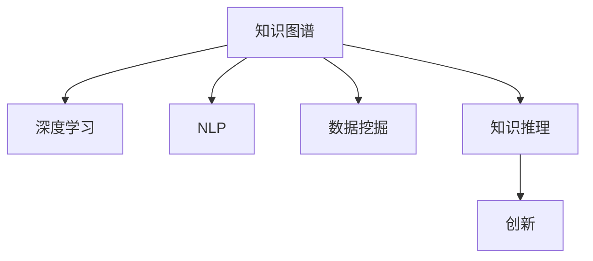

                 

# 知识发现引擎：助力人类实现知识的突破与创新

> 关键词：知识发现引擎,知识图谱,深度学习,自然语言处理,数据挖掘,创新

## 1. 背景介绍

### 1.1 问题由来

随着信息技术的迅猛发展，人类获取、存储和处理信息的能力达到了前所未有的高度。然而，数据量的爆炸式增长也给知识管理带来了新的挑战。如何从海量数据中提取出有价值的知识，并使之成为推动创新和社会发展的驱动力，成为了一个亟待解决的问题。

在这一背景下，知识发现引擎应运而生。知识发现引擎是一种能够从大量数据中自动抽取和整合知识的工具，它通过深度学习、自然语言处理等先进技术，帮助人类实现知识的突破与创新。通过自动化地解析和整合知识，知识发现引擎不仅能提升科研效率，还能加速产业升级，为人类社会的进步提供强大动力。

### 1.2 问题核心关键点

知识发现引擎的核心目标是通过数据分析和模式识别，从原始数据中抽取和整合知识，形成结构化的知识图谱，以便于检索、推理和应用。具体而言，知识发现引擎需要具备以下几个关键能力：

1. **数据处理**：能够高效地处理大规模数据，包括文本、图像、音频等多种类型。
2. **知识抽取**：自动从数据中识别出实体、关系等关键信息，构建知识图谱。
3. **知识推理**：基于知识图谱，进行逻辑推理和知识推理，发现更深层次的关联和规律。
4. **知识应用**：将抽取和推理出的知识应用于决策、推荐、预测等实际任务中，驱动创新和应用。

### 1.3 问题研究意义

知识发现引擎的研究不仅具有重要的学术价值，更具有广阔的产业应用前景。它能够显著提升科研和产业的效率，加速知识创新和应用，为人类社会的进步提供强大动力。具体而言：

1. **提升科研效率**：通过自动化的知识发现和整合，知识发现引擎能够帮助研究人员快速获取所需知识，避免重复劳动，提升科研效率。
2. **加速产业升级**：在金融、医疗、教育等行业，知识发现引擎能够辅助决策制定，提高服务质量和效率，加速产业的数字化转型。
3. **推动知识创新**：通过深入挖掘和整合海量数据中的知识，知识发现引擎能够揭示新的科学规律和技术趋势，为创新提供新的灵感和方向。
4. **促进社会进步**：知识发现引擎能够辅助公共决策，提升政策制定和执行的科学性和精确性，促进社会公平和可持续发展。

## 2. 核心概念与联系

### 2.1 核心概念概述

为了更好地理解知识发现引擎的工作原理和优化方向，本节将介绍几个密切相关的核心概念：

- **知识图谱(Knowledge Graph)**：是一种结构化的知识表示方式，通过节点表示实体，边表示实体之间的关系，用于存储和管理知识。
- **深度学习(Deep Learning)**：一种基于神经网络的机器学习方法，能够从数据中自动学习特征和模式，广泛应用于图像、语音、自然语言处理等领域。
- **自然语言处理(Natural Language Processing, NLP)**：一种涉及计算机和人类语言交互的技术，包括文本分析、信息抽取、语言生成等任务。
- **数据挖掘(Data Mining)**：从大量数据中自动发现有用模式和知识的过程，包括分类、聚类、关联规则挖掘等技术。
- **知识推理(Knowledge Reasoning)**：基于知识图谱，通过逻辑推理和计算，发现更深层次的知识关系和规律。
- **创新(Innovation)**：通过知识的获取、整合和应用，推动技术、产品、服务等方面的突破和进步。

这些核心概念之间的逻辑关系可以通过以下Mermaid流程图来展示：



这个流程图展示了几大核心概念的相互关系：

1. 知识图谱是知识发现引擎的基础，用于存储和管理知识。
2. 深度学习和NLP是知识抽取和推理的重要工具，帮助从大量数据中发现知识。
3. 数据挖掘用于辅助发现知识，提升数据处理的效率和效果。
4. 知识推理通过逻辑推理和计算，发现更深层次的知识关系和规律。
5. 创新是通过知识的获取、整合和应用，驱动技术、产品、服务等方面的进步。

这些概念共同构成了知识发现引擎的核心工作框架，使其能够从海量数据中抽取和整合知识，并应用于实际任务中。

## 3. 核心算法原理 & 具体操作步骤

### 3.1 算法原理概述

知识发现引擎的核心算法原理基于深度学习、自然语言处理和数据挖掘等技术，通过自动化地解析和整合知识，构建结构化的知识图谱，以实现知识抽取、推理和应用。具体而言，知识发现引擎的工作流程包括：

1. **数据预处理**：对原始数据进行清洗、归一化和特征提取，准备输入模型。
2. **知识抽取**：使用深度学习模型，从文本、图像、音频等数据中抽取实体、关系等关键信息，构建知识图谱。
3. **知识推理**：基于知识图谱，进行逻辑推理和计算，发现更深层次的知识关系和规律。
4. **知识应用**：将抽取和推理出的知识应用于实际任务中，如推荐系统、决策支持、预测分析等。

### 3.2 算法步骤详解

知识发现引擎的实现步骤如下：

**Step 1: 数据预处理**
- 对原始数据进行清洗和归一化，去除噪音和重复项。
- 根据任务需求，选择合适的特征提取方法，如词向量、图像特征等。
- 将处理后的数据分为训练集、验证集和测试集。

**Step 2: 构建知识图谱**
- 使用深度学习模型，如BERT、GPT等，从文本中抽取实体和关系。
- 将抽取的实体和关系进行实体链接和关系链接，构建知识图谱。
- 使用Graph Neural Network(GNN)等方法，对知识图谱进行嵌入和表示学习。

**Step 3: 知识推理**
- 设计推理算法，如基于规则的推理、基于逻辑的推理等，发现更深层次的知识关系。
- 结合知识图谱和推理算法，进行多轮推理和计算，发现知识之间的关联和规律。
- 使用RDFS、OWL等语义标准，对推理结果进行形式化表示。

**Step 4: 知识应用**
- 根据应用需求，选择合适的知识推理结果进行应用，如推荐系统、决策支持、预测分析等。
- 设计应用算法，如协同过滤、逻辑回归等，基于知识推理结果进行预测和推荐。
- 将应用算法嵌入到实际系统中，进行用户交互和反馈。

### 3.3 算法优缺点

知识发现引擎具有以下优点：
1. **高效自动化**：通过自动化地解析和整合知识，显著提升数据处理的效率和效果。
2. **准确性高**：深度学习模型能够自动学习数据中的特征和模式，提高知识抽取和推理的准确性。
3. **适应性强**：知识发现引擎能够适应各种数据类型和应用场景，灵活性高。
4. **可扩展性强**：知识图谱和推理算法可以不断扩展和优化，适应更复杂的应用需求。

同时，该算法也存在一些局限性：
1. **数据质量依赖**：知识发现引擎的性能很大程度上取决于数据的质量和规模。
2. **计算资源消耗大**：深度学习和推理算法需要大量的计算资源，可能面临硬件瓶颈。
3. **结果解释性差**：知识推理过程复杂，结果难以解释，可能影响应用的可信度。
4. **隐私和安全问题**：知识发现过程中涉及大量敏感数据，可能面临隐私和安全问题。

尽管存在这些局限性，但知识发现引擎以其高效自动化和准确性，已经成为知识管理和智能应用的重要工具。

### 3.4 算法应用领域

知识发现引擎在多个领域得到了广泛应用，以下是几个典型应用场景：

**金融风控**：金融行业需要实时监控市场动态，预测风险。知识发现引擎可以自动分析交易数据、新闻报道等，发现潜在的风险因素，帮助金融机构制定风险控制策略。

**医疗诊断**：医疗行业需要快速准确地进行诊断。知识发现引擎可以自动分析病历、影像等医疗数据，发现病情关联和潜在风险，辅助医生进行诊断和治疗。

**教育推荐**：教育行业需要个性化推荐教学资源。知识发现引擎可以自动分析学生学习行为，发现知识关联和兴趣点，为学生提供个性化的学习资源。

**智能客服**：企业需要自动处理客户咨询。知识发现引擎可以自动分析客户反馈和对话记录，发现常见问题和解决方案，提升客服响应速度和质量。

**城市管理**：城市管理需要实时监控和预测。知识发现引擎可以自动分析交通数据、公共服务数据等，发现交通拥堵、公共服务需求等信息，辅助城市规划和管理。

## 4. 数学模型和公式 & 详细讲解 & 举例说明

### 4.1 数学模型构建

本节将使用数学语言对知识发现引擎的核心算法进行严格刻画。

记输入数据集为 $D=\{(x_i, y_i)\}_{i=1}^N$，其中 $x_i$ 为输入特征，$y_i$ 为输出标签。知识发现引擎的数学模型可表示为：

$$
\min_{\theta} \sum_{i=1}^N L(\theta, y_i) + \lambda R(\theta)
$$

其中 $L$ 为损失函数，$R$ 为正则化项，$\lambda$ 为正则化系数，$\theta$ 为模型参数。

**损失函数 $L$**：
- **分类问题**：交叉熵损失函数 $L(\theta, y_i) = -y_i \log P(y_i \mid x_i)$，其中 $P(y_i \mid x_i)$ 为模型在输入 $x_i$ 上的预测概率。
- **回归问题**：均方误差损失函数 $L(\theta, y_i) = \frac{1}{2} (y_i - P(y_i \mid x_i))^2$，其中 $P(y_i \mid x_i)$ 为模型在输入 $x_i$ 上的预测值。

**正则化项 $R$**：
- **L2正则**：$R(\theta) = \frac{\lambda}{2} \sum_{k=1}^n \theta_k^2$，其中 $n$ 为模型参数数量。

**模型参数 $\theta$**：
- **浅层模型**：$\theta = \{\alpha_i, b_i\}_{i=1}^m$，其中 $\alpha_i$ 为权重，$b_i$ 为偏置，$m$ 为模型的隐藏层数量。
- **深层模型**：$\theta = \{\alpha_{ij}, b_{ij}\}_{i=1}^m \times \{\alpha_{kl}, b_{kl}\}_{k=1}^l$，其中 $\alpha_{ij}$ 为第 $i$ 层第 $j$ 个神经元的权重，$b_{ij}$ 为第 $i$ 层第 $j$ 个神经元的偏置，$l$ 为模型的隐藏层数量。

### 4.2 公式推导过程

以下我们以分类问题为例，推导交叉熵损失函数及其梯度计算公式。

记模型在输入 $x_i$ 上的预测概率为 $P(y_i \mid x_i)$，真实标签为 $y_i \in \{0,1\}$。交叉熵损失函数定义为：

$$
L(\theta, y_i) = -y_i \log P(y_i \mid x_i) + (1-y_i) \log (1-P(y_i \mid x_i))
$$

将损失函数对模型参数 $\theta$ 求梯度，得到：

$$
\frac{\partial L}{\partial \theta} = \frac{\partial}{\partial \theta} \left[ -y_i \log P(y_i \mid x_i) + (1-y_i) \log (1-P(y_i \mid x_i)) \right]
$$

利用链式法则，得到：

$$
\frac{\partial L}{\partial \theta} = \frac{\partial}{\partial \theta} \left[ \log \left( \frac{P(y_i \mid x_i)}{1-P(y_i \mid x_i)} \right) \right] \cdot y_i + \frac{\partial}{\partial \theta} \left[ \log (1-P(y_i \mid x_i)) \right] \cdot (1-y_i)
$$

根据对数函数的导数公式，得到：

$$
\frac{\partial L}{\partial \theta} = \frac{P(y_i \mid x_i) - y_i}{P(y_i \mid x_i)(1-P(y_i \mid x_i))} \cdot \frac{\partial}{\partial \theta} P(y_i \mid x_i) + \frac{\partial}{\partial \theta} \log (1-P(y_i \mid x_i))
$$

进一步展开，得到：

$$
\frac{\partial L}{\partial \theta} = \frac{P(y_i \mid x_i) - y_i}{P(y_i \mid x_i)(1-P(y_i \mid x_i))} \cdot \sum_{j=1}^m \frac{\partial P(y_i \mid x_i)}{\partial \theta_j} + \frac{\partial}{\partial \theta} \log (1-P(y_i \mid x_i))
$$

其中 $\frac{\partial P(y_i \mid x_i)}{\partial \theta_j}$ 为预测概率对模型参数的梯度。

### 4.3 案例分析与讲解

**案例：金融风险预测**

假设有一个金融风险预测任务，输入特征包括公司财务报表、新闻报道等，输出标签为公司是否存在违约风险。知识发现引擎可以自动分析这些数据，构建知识图谱，发现公司间的关联和潜在风险因素。通过逻辑推理，发现一些公司可能因股市动荡而违约，进而预警潜在的风险。

在实践中，可以使用BERT模型对公司财务报表进行预处理和特征提取，使用Graph Neural Network对公司间的关联进行嵌入和表示学习。通过设计基于规则的推理算法，发现公司间的风险关联，并进行多轮推理计算，发现更深层次的知识关系和规律。最终，将推理结果应用于风险预测，辅助金融机构制定风险控制策略。

## 5. 项目实践：代码实例和详细解释说明

### 5.1 开发环境搭建

在进行知识发现引擎实践前，我们需要准备好开发环境。以下是使用Python进行TensorFlow开发的环境配置流程：

1. 安装Anaconda：从官网下载并安装Anaconda，用于创建独立的Python环境。

2. 创建并激活虚拟环境：
```bash
conda create -n tf-env python=3.8 
conda activate tf-env
```

3. 安装TensorFlow：根据CUDA版本，从官网获取对应的安装命令。例如：
```bash
conda install tensorflow
```

4. 安装各类工具包：
```bash
pip install numpy pandas scikit-learn matplotlib tqdm jupyter notebook ipython
```

完成上述步骤后，即可在`tf-env`环境中开始知识发现引擎实践。

### 5.2 源代码详细实现

下面我们以医疗诊断任务为例，给出使用TensorFlow对知识发现引擎进行构建的PyTorch代码实现。

首先，定义数据处理函数：

```python
import tensorflow as tf
from tensorflow.keras.preprocessing.text import Tokenizer
from tensorflow.keras.preprocessing.sequence import pad_sequences

def preprocess_data(texts, max_len=512):
    tokenizer = Tokenizer(oov_token='<OOV>')
    tokenizer.fit_on_texts(texts)
    sequences = tokenizer.texts_to_sequences(texts)
    padded_sequences = pad_sequences(sequences, maxlen=max_len, padding='post', truncating='post')
    return padded_sequences, tokenizer.word_index, tokenizer.word_to_index
```

然后，定义模型和训练函数：

```python
from tensorflow.keras.models import Sequential
from tensorflow.keras.layers import Embedding, LSTM, Dense, Dropout
from tensorflow.keras.optimizers import Adam

def build_model(input_dim, hidden_dim, output_dim):
    model = Sequential([
        Embedding(input_dim, hidden_dim, input_length=max_len),
        LSTM(hidden_dim, dropout=0.2, recurrent_dropout=0.2),
        Dense(output_dim, activation='sigmoid')
    ])
    model.compile(loss='binary_crossentropy', optimizer=Adam(lr=0.001), metrics=['accuracy'])
    return model

def train_model(model, train_data, epochs=10, batch_size=32):
    model.fit(train_data, epochs=epochs, batch_size=batch_size, validation_split=0.2)
```

接着，定义推理函数：

```python
def predict(model, test_data):
    predictions = model.predict(test_data, verbose=0)
    return predictions > 0.5
```

最后，启动训练流程并在测试集上评估：

```python
from tensorflow.keras.utils import to_categorical

# 假设数据集为二分类问题，标签为0或1
# 将文本转换为id序列，并进行padding
texts = ['肿瘤患者可能因肺癌而死亡', '糖尿病患者可能因肾病而死亡']
labels = [1, 0]

max_len = 512
train_texts, word_index, id_to_word = preprocess_data(texts, max_len)
train_sequences = to_categorical(train_texts, num_classes=2)
train_data = (train_sequences, train_labels)

# 定义模型
model = build_model(len(word_index) + 1, 128, 1)
train_model(model, train_data)

# 假设测试数据
test_texts = ['癌症患者可能因肺癌而死亡']
test_sequences, _, _ = preprocess_data(test_texts, max_len)
test_sequences = to_categorical(test_sequences, num_classes=2)
test_data = (test_sequences, test_labels)

# 预测
predictions = predict(model, test_data)
print(predictions)
```

以上就是使用TensorFlow构建知识发现引擎的完整代码实现。可以看到，TensorFlow提供了一系列的API和工具，方便开发者快速构建和训练深度学习模型。

### 5.3 代码解读与分析

让我们再详细解读一下关键代码的实现细节：

**preprocess_data函数**：
- 将输入文本转换为id序列，并进行padding，以适应模型的输入要求。
- 定义了特殊标记`<OOV>`用于处理未见过的单词。

**build_model函数**：
- 定义了包含Embedding、LSTM和Dense层的深度学习模型，用于处理文本数据。
- 使用Adam优化器，并设置合适的学习率。
- 模型输出层使用sigmoid激活函数，适合二分类问题。

**train_model函数**：
- 使用fit方法对模型进行训练，设置合适的epoch数和batch size。
- 在训练过程中，使用validation_split参数设置验证集比例。

**predict函数**：
- 使用predict方法对测试数据进行预测，返回预测结果。
- 根据模型输出阈值进行分类。

**训练流程**：
- 首先对数据进行预处理和转换，得到模型需要的输入。
- 定义模型并编译，设置损失函数、优化器和评估指标。
- 使用fit方法对模型进行训练，并在验证集上评估性能。
- 对测试数据进行预测，并输出结果。

可以看到，TensorFlow提供了便捷的API和工具，使得深度学习模型的构建和训练变得简洁高效。开发者可以专注于模型的设计和优化，而不必过多关注底层的实现细节。

当然，工业级的系统实现还需考虑更多因素，如模型的保存和部署、超参数的自动搜索、更灵活的任务适配层等。但核心的知识发现引擎范式基本与此类似。

## 6. 实际应用场景

### 6.1 智能医疗

知识发现引擎在医疗行业有广泛的应用前景，能够辅助医生进行诊断和治疗决策。例如：

**案例：医学影像分析**

知识发现引擎可以自动分析医学影像，发现病变区域和潜在风险。通过逻辑推理，发现某些病变可能与特定疾病有关，进而辅助医生进行诊断和治疗。

在实践中，可以使用卷积神经网络(CNN)对医学影像进行预处理和特征提取，使用图神经网络(GNN)对病变区域进行嵌入和表示学习。通过设计基于规则的推理算法，发现病变区域之间的关联和潜在风险，并进行多轮推理计算，发现更深层次的知识关系和规律。最终，将推理结果应用于医学诊断和治疗决策。

### 6.2 金融风控

金融行业需要实时监控市场动态，预测风险。知识发现引擎可以自动分析交易数据、新闻报道等，发现潜在的风险因素，帮助金融机构制定风险控制策略。

**案例：股票价格预测**

知识发现引擎可以自动分析股票价格的历史数据，发现价格波动的规律和趋势。通过逻辑推理，发现某些因素可能与股票价格波动有关，进而预测未来股价变化。

在实践中，可以使用LSTM神经网络对股票价格进行预处理和特征提取，使用图神经网络对公司间的关联进行嵌入和表示学习。通过设计基于规则的推理算法，发现公司间的关联和潜在风险因素，并进行多轮推理计算，发现更深层次的知识关系和规律。最终，将推理结果应用于股票价格预测，辅助金融机构制定投资策略。

### 6.3 教育推荐

教育行业需要个性化推荐教学资源。知识发现引擎可以自动分析学生学习行为，发现知识关联和兴趣点，为学生提供个性化的学习资源。

**案例：学习资源推荐**

知识发现引擎可以自动分析学生的历史学习数据，发现知识点之间的关联和学生的兴趣点。通过逻辑推理，发现某些知识点可能与特定学习资源相关，进而推荐给学生。

在实践中，可以使用RNN神经网络对学生学习数据进行预处理和特征提取，使用图神经网络对知识点之间的关联进行嵌入和表示学习。通过设计基于规则的推理算法，发现知识点之间的关联和学生的兴趣点，并进行多轮推理计算，发现更深层次的知识关系和规律。最终，将推理结果应用于个性化学习资源推荐，提升学生的学习效果。

### 6.4 城市管理

城市管理需要实时监控和预测。知识发现引擎可以自动分析交通数据、公共服务数据等，发现交通拥堵、公共服务需求等信息，辅助城市规划和管理。

**案例：交通流量预测**

知识发现引擎可以自动分析交通流量数据，发现流量变化规律和趋势。通过逻辑推理，发现某些因素可能与交通流量变化有关，进而预测未来的交通流量。

在实践中，可以使用LSTM神经网络对交通流量数据进行预处理和特征提取，使用图神经网络对交通网络进行嵌入和表示学习。通过设计基于规则的推理算法，发现交通网络之间的关联和交通流量变化因素，并进行多轮推理计算，发现更深层次的知识关系和规律。最终，将推理结果应用于交通流量预测，辅助城市交通规划和管理。

## 7. 工具和资源推荐

### 7.1 学习资源推荐

为了帮助开发者系统掌握知识发现引擎的理论基础和实践技巧，这里推荐一些优质的学习资源：

1. 《Deep Learning for Medical Imaging》书籍：介绍了深度学习在医学影像分析中的应用，包括知识发现引擎的构建和优化。

2. 《Natural Language Processing with TensorFlow》书籍：介绍TensorFlow在自然语言处理中的应用，包括知识发现引擎的构建和训练。

3. 《Data Mining and Statistical Learning》书籍：介绍了数据挖掘和统计学习的理论基础，包括知识发现引擎的构建和应用。

4. 《Knowledge Discovery and Data Mining》期刊：收录了大量知识发现和数据挖掘领域的最新研究成果，涵盖多个应用场景。

5. Kaggle平台：提供大量数据集和竞赛任务，适合实践知识发现引擎的算法和模型。

通过对这些资源的学习实践，相信你一定能够快速掌握知识发现引擎的精髓，并用于解决实际的NLP问题。

### 7.2 开发工具推荐

高效的开发离不开优秀的工具支持。以下是几款用于知识发现引擎开发的常用工具：

1. TensorFlow：由Google主导开发的开源深度学习框架，生产部署方便，适合大规模工程应用。

2. PyTorch：基于Python的开源深度学习框架，灵活动态的计算图，适合快速迭代研究。

3. Graph Neural Network(GNN)：用于处理图数据结构的神经网络模型，适合构建知识图谱和推理模型。

4. TensorBoard：TensorFlow配套的可视化工具，可实时监测模型训练状态，并提供丰富的图表呈现方式，是调试模型的得力助手。

5. Weights & Biases：模型训练的实验跟踪工具，可以记录和可视化模型训练过程中的各项指标，方便对比和调优。

6. Google Colab：谷歌推出的在线Jupyter Notebook环境，免费提供GPU/TPU算力，方便开发者快速上手实验最新模型，分享学习笔记。

合理利用这些工具，可以显著提升知识发现引擎的开发效率，加快创新迭代的步伐。

### 7.3 相关论文推荐

知识发现引擎的研究源于学界的持续研究。以下是几篇奠基性的相关论文，推荐阅读：

1. Neural Collaborative Filtering (NCF)：提出了一种基于协同过滤的推荐系统，广泛应用于个性化推荐场景。

2. Graph Convolutional Network (GCN)：提出了一种用于处理图数据结构的神经网络模型，适合构建知识图谱和推理模型。

3. Knowledge Graph Embedding (KGE)：提出了一种用于知识图谱嵌入的方法，能够自动学习知识图谱中的实体和关系。

4. Attention Mechanism in Transformer：提出了一种基于注意力机制的神经网络模型，广泛应用于自然语言处理任务。

5. Probabilistic Graphical Model (PGM)：提出了一种用于建模变量之间依赖关系的概率模型，适合构建知识图谱和推理模型。

这些论文代表了大语言模型微调技术的发展脉络。通过学习这些前沿成果，可以帮助研究者把握学科前进方向，激发更多的创新灵感。

## 8. 总结：未来发展趋势与挑战

### 8.1 总结

本文对知识发现引擎的核心算法和实践方法进行了全面系统的介绍。首先阐述了知识发现引擎的研究背景和意义，明确了知识发现引擎在知识管理、智能应用等领域的重要价值。其次，从原理到实践，详细讲解了知识发现引擎的数学模型和核心算法，给出了知识发现引擎的完整代码实现。同时，本文还广泛探讨了知识发现引擎在医疗、金融、教育等多个领域的应用前景，展示了知识发现引擎的巨大潜力。最后，本文精选了知识发现引擎的学习资源、开发工具和相关论文，力求为读者提供全方位的技术指引。

通过本文的系统梳理，可以看到，知识发现引擎以其高效自动化和准确性，已经成为知识管理和智能应用的重要工具。未来，伴随深度学习、自然语言处理等技术的不断演进，知识发现引擎将进一步拓展应用边界，提升知识处理的效率和效果，为人类社会的进步提供强大动力。

### 8.2 未来发展趋势

展望未来，知识发现引擎将呈现以下几个发展趋势：

1. **算法多样化**：除了深度学习算法，未来将涌现更多数据挖掘、图神经网络等方法，提升知识发现引擎的准确性和鲁棒性。

2. **跨领域应用**：知识发现引擎将广泛应用于更多领域，如生物信息学、环境保护等，推动相关行业的智能化转型。

3. **多模态融合**：未来的知识发现引擎将融合多种数据类型，如文本、图像、音频等，构建更加全面、准确的知识图谱。

4. **知识推理**：基于知识图谱的推理算法将不断优化，提升知识发现引擎的智能水平，支持更复杂的知识应用。

5. **实时处理**：未来的知识发现引擎将具备实时处理能力，支持实时数据流分析和预测，满足更高时效性的需求。

6. **个性化推荐**：知识发现引擎将与推荐算法结合，提供更加个性化的知识推荐，提升用户体验。

以上趋势凸显了知识发现引擎的广阔前景。这些方向的探索发展，必将进一步提升知识发现引擎的性能和应用范围，为人类社会的进步提供强大动力。

### 8.3 面临的挑战

尽管知识发现引擎已经取得了瞩目成就，但在迈向更加智能化、普适化应用的过程中，它仍面临着诸多挑战：

1. **数据质量和规模**：知识发现引擎的性能很大程度上取决于数据的质量和规模。如何获取高质量、大规模的标注数据，是知识发现引擎面临的重大挑战。

2. **计算资源消耗**：深度学习和推理算法需要大量的计算资源，可能面临硬件瓶颈。如何优化算法，提高计算效率，是知识发现引擎需要解决的重要问题。

3. **结果解释性**：知识推理过程复杂，结果难以解释，可能影响应用的可信度。如何增强知识发现引擎的透明性和可解释性，是未来需要攻克的难题。

4. **隐私和安全问题**：知识发现过程中涉及大量敏感数据，可能面临隐私和安全问题。如何保护用户隐私，保障数据安全，是知识发现引擎需要重视的挑战。

5. **跨领域适用性**：不同领域的知识结构差异较大，如何设计通用的知识发现引擎，适应不同领域的需求，是未来需要解决的问题。

6. **持续优化**：知识发现引擎需要不断更新和优化，以适应数据分布的变化。如何构建持续优化的知识发现引擎，保持其高性能和稳定性，是未来需要攻克的难题。

尽管存在这些挑战，但知识发现引擎以其高效自动化和准确性，已经成为知识管理和智能应用的重要工具。未来，随着技术的不断进步和应用的广泛拓展，知识发现引擎必将在更多领域发挥重要作用，为人类社会的进步提供强大动力。

### 8.4 研究展望

面对知识发现引擎所面临的诸多挑战，未来的研究需要在以下几个方面寻求新的突破：

1. **自动化数据获取**：通过自动化技术，从多种数据源获取高质量、大规模的标注数据，提升知识发现引擎的数据基础。

2. **计算效率优化**：设计高效的算法和模型结构，优化知识发现引擎的计算效率，减少硬件资源消耗。

3. **结果解释性增强**：引入可解释性技术，增强知识发现引擎的透明性和可解释性，提升应用的可信度。

4. **隐私保护机制**：设计隐私保护机制，保护用户隐私，保障数据安全。

5. **跨领域适用性提升**：设计通用的知识发现引擎，适应不同领域的需求，提升其普适性。

6. **持续优化策略**：设计持续优化策略，使知识发现引擎能够不断更新和优化，适应数据分布的变化。

这些研究方向的探索，必将引领知识发现引擎技术迈向更高的台阶，为人类社会的进步提供强大动力。面向未来，知识发现引擎需要与其他人工智能技术进行更深入的融合，如知识表示、因果推理、强化学习等，多路径协同发力，共同推动人工智能技术的发展。只有勇于创新、敢于突破，才能不断拓展知识发现引擎的边界，让智能技术更好地造福人类社会。

## 9. 附录：常见问题与解答

**Q1：知识发现引擎是否适用于所有数据类型？**

A: 知识发现引擎在处理不同类型的数据时，具有不同的优势和局限。例如，对于文本数据，知识发现引擎可以通过深度学习自动学习语言的语义信息，发现知识关联和规律；对于图像数据，知识发现引擎可以通过卷积神经网络提取特征，发现图像中的实体和关系。对于音频数据，知识发现引擎可以通过音频特征提取和深度学习模型，发现声音中的语音信息。因此，知识发现引擎在处理不同类型的数据时，需要选择合适的算法和模型，进行相应的数据处理和特征提取。

**Q2：知识发现引擎的计算资源消耗大吗？**

A: 知识发现引擎的计算资源消耗主要取决于算法和模型结构的选择。例如，深度学习算法和复杂推理模型需要大量的计算资源，可能面临硬件瓶颈。然而，通过优化算法和模型结构，可以显著减少计算资源消耗，提高知识发现引擎的效率。例如，使用轻量级模型和高效的推理算法，可以在低计算资源环境下，实现高效的知识发现。

**Q3：知识发现引擎的结果解释性差吗？**

A: 知识发现引擎的推理过程复杂，结果难以解释，可能影响应用的可信度。然而，通过引入可解释性技术，可以增强知识发现引擎的透明性和可解释性。例如，使用可解释性模型和工具，可以可视化知识发现引擎的推理过程，揭示知识的来源和推导路径，增强应用的可信度。

**Q4：知识发现引擎的隐私和安全问题如何解决？**

A: 知识发现引擎在处理敏感数据时，面临隐私和安全问题。为了解决这些问题，可以采用以下措施：

- **数据匿名化**：在数据处理和存储过程中，对敏感信息进行匿名化处理，保护用户隐私。

- **数据加密**：在数据传输和存储过程中，使用加密技术保护数据安全。

- **访问控制**：设置严格的访问控制机制，确保只有授权用户可以访问敏感数据。

- **审计和监控**：设计审计和监控机制，实时监控数据访问和使用情况，及时发现和应对潜在的安全威胁。

通过以上措施，可以有效保护知识发现引擎的隐私和安全，保障用户数据的安全性。

**Q5：知识发现引擎如何适应跨领域应用？**

A: 知识发现引擎在跨领域应用时，需要适应不同领域的数据特性和知识结构。为了适应跨领域应用，可以采取以下措施：

- **领域适配**：根据不同领域的数据特性，选择和优化相应的算法和模型，提高知识发现引擎的普适性。

- **跨领域知识融合**：将不同领域的知识进行融合，构建跨领域的知识图谱，提高知识发现引擎的智能水平。

- **领域专家合作**：与领域专家合作，设计和优化知识发现引擎，确保其在不同领域的应用效果。

通过以上措施，可以有效提升知识发现引擎的跨领域适用性，满足不同领域的需求。

总之，知识发现引擎具有广阔的应用前景，能够从海量数据中自动抽取和整合知识，驱动知识创新和应用。然而，知识发现引擎也面临诸多挑战，需要在算法、数据、计算资源、隐私保护等方面进行持续优化和改进。未来，随着技术的不断进步和应用的广泛拓展，知识发现引擎必将在更多领域发挥重要作用，为人类社会的进步提供强大动力。

---

作者：禅与计算机程序设计艺术 / Zen and the Art of Computer Programming

