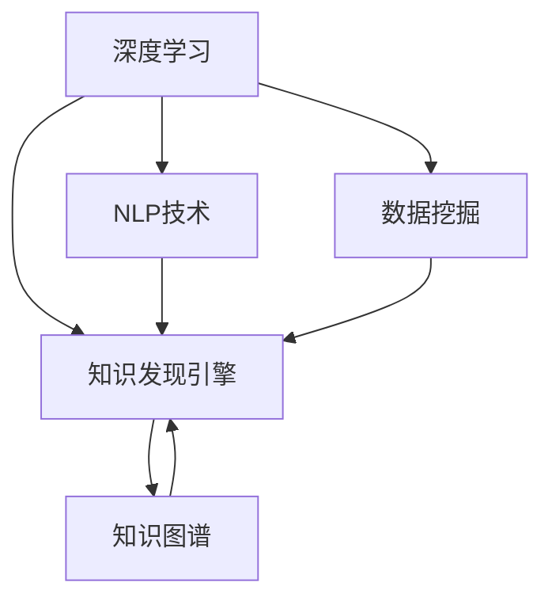

                 

# 知识发现引擎：开启知识创新新纪元

## 1. 背景介绍

### 1.1 问题由来
在当今信息爆炸的时代，数据已经成为驱动科技创新的关键资源。然而，数据本身无法直接转化为有用的知识，需要借助于先进的数据挖掘与知识发现技术。近年来，人工智能技术的迅猛发展为知识发现提供了新的方法和工具，特别是深度学习、自然语言处理和数据挖掘技术的发展，使得大规模知识发现成为可能。

### 1.2 问题核心关键点
知识发现引擎是指利用先进算法和大规模数据集，自动化地从数据中挖掘和发现知识的工具。核心关键点在于如何高效、准确地从海量数据中提取有用信息，并通过数据关联、推理、可视化等技术手段，形成可应用的实用知识。

### 1.3 问题研究意义
知识发现引擎的研究与应用，对于推动知识密集型经济的发展、提升社会治理水平、增强企业竞争力具有重要意义：

1. **经济增长**：知识发现引擎能够帮助企业快速获取市场动态、竞争对手情报、消费者行为等关键信息，为决策提供科学依据，加速经济发展。
2. **社会治理**：在公共卫生、教育、交通等领域，知识发现引擎能够提供精准化的决策支持，提升政府治理效率，提高公共服务质量。
3. **企业竞争力**：通过深入挖掘企业内部数据和市场信息，知识发现引擎能够帮助企业发现市场机会，优化产品设计，增强核心竞争力。

## 2. 核心概念与联系

### 2.1 核心概念概述

为了更好地理解知识发现引擎的工作原理和设计，本节将介绍几个关键概念：

- **知识发现引擎**：通过深度学习、自然语言处理、数据挖掘等技术手段，从大规模数据中自动化地提取、关联和推理知识，形成可应用的实用知识的工具。
- **深度学习**：利用多层神经网络模型，从数据中学习特征表示，用于图像、文本、语音等多种类型的知识发现。
- **自然语言处理**：使计算机能够理解和处理人类语言，包括文本分类、情感分析、实体识别、问答系统等多种应用。
- **数据挖掘**：通过统计学和机器学习技术，从数据中挖掘出有价值的模式和关联，为知识发现提供数据支撑。
- **知识图谱**：将实体、属性和关系三元组结构化的知识表示，用于更高效的知识存储、查询和推理。

这些概念之间的逻辑关系可以通过以下Mermaid流程图来展示：



这个流程图展示的知识发现引擎的核心概念及其之间的关系：

1. 深度学习、NLP技术和数据挖掘为知识发现引擎提供了技术支撑。
2. 知识发现引擎通过这些技术从数据中挖掘知识，并通过知识图谱进行存储和推理。
3. 最终形成的知识可以用于驱动决策支持、智能推荐、业务优化等多个应用场景。

## 3. 核心算法原理 & 具体操作步骤
### 3.1 算法原理概述

知识发现引擎的核心算法原理主要是利用深度学习模型和数据挖掘技术，从大规模数据中提取和关联知识，形成可应用的知识图谱。核心算法包括：

1. **自编码器(Autoencoder)**：用于学习数据的低维表示，从高维数据中提取核心特征，用于降维、异常检测等应用。
2. **生成对抗网络(GANs)**：通过生成器和判别器之间的对抗训练，生成逼真的数据样本，用于数据增强、数据合成等任务。
3. **卷积神经网络(CNNs)**：适用于图像数据的特征提取和模式识别，如图像分类、目标检测等。
4. **循环神经网络(RNNs)**：适用于时间序列数据的建模，如自然语言处理中的文本生成、序列预测等。
5. **图神经网络(GNNs)**：适用于图结构数据的建模，如图关系挖掘、网络分析等。

### 3.2 算法步骤详解

知识发现引擎的一般操作步骤包括：

1. **数据预处理**：清洗和整理原始数据，消除噪声和缺失值，将数据转换为适合深度学习模型处理的形式。
2. **特征提取**：利用深度学习模型自动提取数据特征，通过卷积、池化等操作提取关键信息。
3. **模式识别**：通过分类、聚类等算法识别数据中的模式和关联，构建知识图谱。
4. **推理与可视化**：利用知识图谱进行推理，通过图表、报表等形式进行知识可视化，帮助用户理解和使用知识。

### 3.3 算法优缺点

知识发现引擎具有以下优点：

1. **自动化**：通过自动化算法，能够高效地从大规模数据中发现有用知识，减少人工干预。
2. **多模态支持**：支持文本、图像、视频等多种类型的数据，具有较强的适应性。
3. **可扩展性**：适用于各种规模的数据集，能够处理海量数据。
4. **适用广泛**：在商业决策、医疗健康、智能交通等多个领域具有广泛的应用前景。

同时，知识发现引擎也存在一些局限性：

1. **数据依赖**：依赖于高质量的数据集，数据缺失或噪声会影响算法效果。
2. **模型复杂**：深度学习模型参数量大，需要高性能计算资源。
3. **解释性不足**：深度学习模型的黑盒特性，使得其结果难以解释。
4. **泛化能力有限**：对于新数据的泛化能力较弱，需要持续更新和优化。

### 3.4 算法应用领域

知识发现引擎的应用领域非常广泛，包括但不限于：

1. **商业智能(BI)**：通过数据挖掘和分析，帮助企业发现市场趋势、客户行为等关键信息，优化决策过程。
2. **金融风控**：利用深度学习模型分析交易数据，识别潜在的欺诈行为和风险，增强金融安全。
3. **医疗健康**：通过分析病历数据和医疗影像，发现疾病模式和关联，辅助诊断和治疗。
4. **智能交通**：利用传感器和监控数据，分析交通流量和行为模式，优化交通管理。
5. **智能推荐**：基于用户行为数据，推荐个性化商品、内容和服务，提升用户体验。

## 4. 数学模型和公式 & 详细讲解 & 举例说明（备注：数学公式请使用latex格式，latex嵌入文中独立段落使用 $$，段落内使用 $)
### 4.1 数学模型构建

知识发现引擎的数学模型构建通常包括以下几个关键步骤：

1. **数据表示**：将原始数据转换为适合深度学习模型处理的张量形式。
2. **损失函数定义**：定义模型预测与真实标签之间的误差，如交叉熵损失、均方误差等。
3. **优化目标**：最小化损失函数，利用优化算法更新模型参数。

### 4.2 公式推导过程

以文本分类任务为例，假设模型输入为 $x$，输出为 $y$，模型参数为 $\theta$，损失函数为 $L(\theta)$，优化器为 $Optimizer$，优化步长为 $\alpha$，则前向传播和反向传播的过程可以表示为：

$$
y = f(x; \theta)
$$

$$
L(\theta) = -\frac{1}{N} \sum_{i=1}^N \log y_i^i
$$

其中，$f$ 为模型函数，$y_i$ 为模型预测输出，$N$ 为样本数量。

通过链式法则，计算损失函数对模型参数 $\theta$ 的梯度，进行反向传播：

$$
\frac{\partial L(\theta)}{\partial \theta} = \frac{1}{N} \sum_{i=1}^N (\frac{y_i}{y_i^i} - 1) \frac{\partial y_i^i}{\partial \theta}
$$

将梯度代入优化器，更新模型参数：

$$
\theta = \theta - \alpha \frac{\partial L(\theta)}{\partial \theta}
$$

其中，$\alpha$ 为学习率，通常需要经过调参确定最优值。

### 4.3 案例分析与讲解

以情感分析为例，假设从社交媒体数据中提取的文本被输入到深度学习模型中，模型预测其情感倾向。首先，需要对文本进行预处理，包括分词、去除停用词等。然后，利用词向量表示文本，通过卷积神经网络提取特征。最终，通过全连接层进行分类，输出情感倾向概率。

假设模型训练集包含 $N$ 个样本，每个样本有 $D$ 个特征。使用二分类交叉熵损失函数：

$$
L = -\frac{1}{N} \sum_{i=1}^N [y_i \log(y_i^i) + (1-y_i) \log(1-y_i^i)]
$$

其中，$y_i$ 为真实情感标签，$y_i^i$ 为模型预测情感概率。

通过反向传播计算梯度，使用优化器更新模型参数。模型训练完成后，可以用于对新文本进行情感分析，输出情感倾向。

## 5. 项目实践：代码实例和详细解释说明
### 5.1 开发环境搭建

在进行知识发现引擎的实践开发前，我们需要准备好开发环境。以下是使用Python进行PyTorch开发的环境配置流程：

1. 安装Anaconda：从官网下载并安装Anaconda，用于创建独立的Python环境。

2. 创建并激活虚拟环境：
```bash
conda create -n pytorch-env python=3.8 
conda activate pytorch-env
```

3. 安装PyTorch：根据CUDA版本，从官网获取对应的安装命令。例如：
```bash
conda install pytorch torchvision torchaudio cudatoolkit=11.1 -c pytorch -c conda-forge
```

4. 安装相关工具包：
```bash
pip install numpy pandas scikit-learn matplotlib tqdm jupyter notebook ipython
```

完成上述步骤后，即可在`pytorch-env`环境中开始开发。

### 5.2 源代码详细实现

以下是使用PyTorch进行文本分类任务的知识发现引擎代码实现：

```python
import torch
import torch.nn as nn
import torch.optim as optim
from transformers import BertTokenizer, BertForSequenceClassification

# 定义模型
class TextClassifier(nn.Module):
    def __init__(self):
        super(TextClassifier, self).__init__()
        self.bert = BertForSequenceClassification.from_pretrained('bert-base-cased', num_labels=2)
        self.fc = nn.Linear(768, 2)
    
    def forward(self, input_ids, attention_mask):
        logits = self.bert(input_ids, attention_mask=attention_mask)[0]
        logits = self.fc(logits)
        return logits

# 加载数据
from datasets import load_dataset
dataset = load_dataset('imdb', split='train', batch_size=16)

# 初始化模型和优化器
model = TextClassifier()
optimizer = optim.Adam(model.parameters(), lr=1e-5)
loss_fn = nn.CrossEntropyLoss()

# 训练模型
device = torch.device('cuda') if torch.cuda.is_available() else torch.device('cpu')
model.to(device)

for epoch in range(10):
    model.train()
    for batch in dataset:
        input_ids = batch['input_ids'].to(device)
        attention_mask = batch['attention_mask'].to(device)
        labels = batch['labels'].to(device)
        optimizer.zero_grad()
        logits = model(input_ids, attention_mask)
        loss = loss_fn(logits, labels)
        loss.backward()
        optimizer.step()

    # 评估模型
    model.eval()
    with torch.no_grad():
        eval_dataset = load_dataset('imdb', split='validation', batch_size=16)
        total_loss = 0
        for batch in eval_dataset:
            input_ids = batch['input_ids'].to(device)
            attention_mask = batch['attention_mask'].to(device)
            labels = batch['labels'].to(device)
            logits = model(input_ids, attention_mask)
            loss = loss_fn(logits, labels)
            total_loss += loss.item()
        avg_loss = total_loss / len(eval_dataset)
        print(f"Epoch {epoch+1}, Validation Loss: {avg_loss:.3f}")
```

### 5.3 代码解读与分析

让我们再详细解读一下关键代码的实现细节：

**TextClassifier类**：
- `__init__`方法：初始化Bert模型和全连接层。
- `forward`方法：前向传播计算模型输出。

**数据加载**：
- `load_dataset`函数：用于加载IMDB数据集，分成训练集、验证集和测试集。
- `dataset`变量：包含训练集的样本数据和标签。

**模型初始化**：
- `TextClassifier`类：定义模型结构，包括Bert模型和全连接层。
- `optimizer`：Adam优化器，用于更新模型参数。
- `loss_fn`：交叉熵损失函数。

**训练过程**：
- `device`变量：设置训练设备为GPU或CPU。
- `model.to(device)`：将模型移动到指定设备。
- 循环训练，对于每个批次数据，计算损失并反向传播更新参数。

**评估过程**：
- 模型进入评估模式，不更新参数。
- 在验证集上计算损失，输出平均损失。

可以看到，PyTorch配合Transformer库使得文本分类任务的代码实现变得简洁高效。开发者可以将更多精力放在数据处理、模型改进等高层逻辑上，而不必过多关注底层的实现细节。

当然，工业级的系统实现还需考虑更多因素，如模型的保存和部署、超参数的自动搜索、更灵活的任务适配层等。但核心的知识发现过程基本与此类似。

## 6. 实际应用场景
### 6.1 电商推荐系统

电商推荐系统是知识发现引擎的重要应用场景之一。通过分析用户的浏览行为、购买记录等数据，推荐系统能够预测用户可能感兴趣的商品，提升用户购买率和满意度。

在技术实现上，可以将用户行为数据作为输入，通过深度学习模型学习用户的兴趣模式。然后，基于这些模式，利用知识图谱构建用户-商品关联，进行推荐排序。如此构建的推荐系统，能够实现更加个性化和精准的商品推荐。

### 6.2 金融风控系统

金融风控系统利用知识发现引擎，能够从大量的交易数据中发现异常行为和潜在风险。通过分析交易模式、用户行为等数据，系统能够自动识别出潜在的欺诈行为和违规操作，及时发出预警。

在实现上，可以利用深度学习模型进行数据预处理和特征提取，利用知识图谱进行关联分析，最后结合专家规则进行风险评估和决策。知识发现引擎在金融风控中的广泛应用，使得金融机构能够更有效地防范金融风险，保障客户利益。

### 6.3 医疗诊断系统

医疗诊断系统利用知识发现引擎，能够从海量的病历数据中发现疾病模式和关联。通过分析病历数据、医学影像等，系统能够自动诊断疾病，提供治疗建议。

在技术实现上，可以利用深度学习模型进行文本分析和图像识别，利用知识图谱进行疾病关联分析，最后结合医生经验和临床指南进行诊断和推荐。知识发现引擎在医疗诊断中的应用，能够显著提高诊断的准确性和效率。

### 6.4 未来应用展望

随着知识发现引擎技术的不断演进，未来将在更多领域得到应用，为社会发展和经济增长注入新的动力。

在智慧城市治理中，知识发现引擎能够从海量的城市数据中发现交通、能源、环境等关键信息，优化城市管理，提升城市治理效率。

在教育领域，知识发现引擎能够从学生的学习行为数据中发现知识需求和兴趣点，为教育提供个性化推荐，提升教育质量和公平性。

在工业制造中，知识发现引擎能够从生产数据中发现设备状态和故障模式，预测设备维护需求，减少停机时间和维修成本。

未来，知识发现引擎将在更多领域发挥重要作用，为各行各业提供更加智能和高效的解决方案。相信伴随技术的不断发展，知识发现引擎必将在构建智慧社会中扮演越来越重要的角色。

## 7. 工具和资源推荐
### 7.1 学习资源推荐

为了帮助开发者系统掌握知识发现引擎的理论基础和实践技巧，这里推荐一些优质的学习资源：

1. 《深度学习》系列书籍：全面介绍了深度学习的基本原理和算法，适合初学者和进阶者。
2. 《自然语言处理》系列课程：由斯坦福大学等知名高校开设的NLP课程，系统讲解了NLP技术和应用。
3. 《数据挖掘与统计学习》书籍：介绍了数据挖掘的基本概念和算法，适合了解知识发现的基本原理。
4. 《Python数据科学手册》：详细介绍了使用Python进行数据处理和分析的实践技巧。
5. 《机器学习实战》书籍：通过多个实战项目，展示了机器学习在各行各业中的应用。

通过对这些资源的学习实践，相信你一定能够快速掌握知识发现引擎的精髓，并用于解决实际的NLP问题。

### 7.2 开发工具推荐

高效的开发离不开优秀的工具支持。以下是几款用于知识发现引擎开发的常用工具：

1. PyTorch：基于Python的开源深度学习框架，灵活动态的计算图，适合快速迭代研究。大部分深度学习模型都有PyTorch版本的实现。

2. TensorFlow：由Google主导开发的开源深度学习框架，生产部署方便，适合大规模工程应用。同样有丰富的深度学习模型资源。

3. Transformers库：HuggingFace开发的NLP工具库，集成了众多SOTA语言模型，支持PyTorch和TensorFlow，是进行知识发现任务开发的利器。

4. Weights & Biases：模型训练的实验跟踪工具，可以记录和可视化模型训练过程中的各项指标，方便对比和调优。与主流深度学习框架无缝集成。

5. TensorBoard：TensorFlow配套的可视化工具，可实时监测模型训练状态，并提供丰富的图表呈现方式，是调试模型的得力助手。

6. Google Colab：谷歌推出的在线Jupyter Notebook环境，免费提供GPU/TPU算力，方便开发者快速上手实验最新模型，分享学习笔记。

合理利用这些工具，可以显著提升知识发现引擎的开发效率，加快创新迭代的步伐。

### 7.3 相关论文推荐

知识发现引擎的发展源于学界的持续研究。以下是几篇奠基性的相关论文，推荐阅读：

1. 《Deep Learning》（Goodfellow et al., 2016）：介绍了深度学习的基本原理和算法，是深度学习领域的经典教材。

2. 《A Survey of Deep Learning Techniques for Natural Language Processing》（Jurafsky et al., 2018）：综述了深度学习在NLP中的应用，包括文本分类、情感分析、机器翻译等。

3. 《Data Mining and Statistical Learning》（Hastie et al., 2009）：介绍了数据挖掘的基本概念和算法，涵盖了分类、聚类、关联分析等多个方面。

4. 《Neural Information Processing Systems》（NIPS，每年出版）：顶级会议和期刊，汇聚了深度学习领域的最新研究成果和技术进展。

这些论文代表了大规模知识发现引擎的发展脉络。通过学习这些前沿成果，可以帮助研究者把握学科前进方向，激发更多的创新灵感。

## 8. 总结：未来发展趋势与挑战

### 8.1 总结

本文对知识发现引擎的知识发现方法和应用进行了全面系统的介绍。首先阐述了知识发现引擎的研究背景和意义，明确了知识发现引擎在知识密集型经济、社会治理、企业竞争力提升等方面的独特价值。其次，从原理到实践，详细讲解了知识发现引擎的数学模型和操作步骤，给出了知识发现任务开发的完整代码实例。同时，本文还广泛探讨了知识发现引擎在电商推荐、金融风控、医疗诊断等多个领域的应用前景，展示了知识发现引擎的广阔应用空间。此外，本文精选了知识发现引擎的学习资源，力求为读者提供全方位的技术指引。

通过本文的系统梳理，可以看到，知识发现引擎正在成为人工智能领域的重要范式，极大地拓展了数据挖掘和知识发现的应用边界，推动了人工智能技术的产业化进程。未来，伴随知识发现引擎技术的不断发展，必将为各行各业提供更加智能和高效的解决方案。

### 8.2 未来发展趋势

展望未来，知识发现引擎将呈现以下几个发展趋势：

1. **多模态融合**：融合文本、图像、视频等多种数据模态，形成更为丰富和全面的知识表示。
2. **因果推断**：引入因果推断技术，增强知识发现的可解释性和可信度，减少偏见和不确定性。
3. **跨领域迁移**：利用知识图谱等技术手段，实现跨领域和跨任务的知识迁移，提升知识发现的泛化能力。
4. **智能决策支持**：结合专家知识和经验，构建智能决策支持系统，提升知识发现的实用性和决策质量。
5. **自适应学习**：利用在线学习技术，实时更新和优化知识发现模型，保持模型的高效性和适用性。
6. **隐私保护**：在知识发现过程中，保护用户隐私和数据安全，确保知识发现的伦理性和合规性。

以上趋势凸显了知识发现引擎的广阔前景。这些方向的探索发展，必将进一步提升知识密集型经济的生产效率和创新能力，构建更为智慧和可持续发展的未来社会。

### 8.3 面临的挑战

尽管知识发现引擎已经取得了瞩目成就，但在迈向更加智能化、普适化应用的过程中，它仍面临着诸多挑战：

1. **数据隐私和安全**：在处理敏感数据时，需要确保数据隐私和安全，防止数据泄露和滥用。
2. **模型透明性和可解释性**：知识发现引擎的决策过程通常难以解释，需要进一步增强模型的透明性和可解释性。
3. **泛化能力和鲁棒性**：在实际应用中，模型对新数据的泛化能力较弱，需要提升模型的鲁棒性和泛化能力。
4. **计算资源限制**：知识发现引擎的复杂性较高，需要高性能计算资源，存在计算资源限制问题。
5. **知识图谱的构建和维护**：知识图谱的构建和维护需要大量专家知识和时间，存在成本和效率问题。
6. **跨领域知识整合**：不同领域之间的知识整合难度较大，需要构建统一的知识表示和关联。

正视知识发现引擎面临的这些挑战，积极应对并寻求突破，将是大规模知识发现引擎迈向成熟的必由之路。相信随着学界和产业界的共同努力，这些挑战终将一一被克服，知识发现引擎必将在构建智慧社会中扮演越来越重要的角色。

### 8.4 研究展望

面对知识发现引擎所面临的种种挑战，未来的研究需要在以下几个方面寻求新的突破：

1. **知识表示和推理**：探索新的知识表示和推理方法，增强知识图谱的可扩展性和可维护性。
2. **跨领域知识迁移**：利用迁移学习和元学习技术，实现跨领域和跨任务的知识迁移。
3. **模型解释性**：引入可解释性技术，增强模型的透明性和可解释性，提升用户信任度。
4. **隐私保护**：利用差分隐私等技术手段，保护用户隐私和数据安全，确保知识发现的伦理性和合规性。
5. **知识图谱自动化**：利用自动化技术，简化知识图谱的构建和维护过程，降低成本和提高效率。
6. **多模态知识融合**：探索多模态数据的融合方法，提升知识发现的准确性和全面性。

这些研究方向的探索，必将引领知识发现引擎技术迈向更高的台阶，为构建智慧社会提供更加智能和高效的知识支持。面向未来，知识发现引擎需要与其他人工智能技术进行更深入的融合，如自然语言处理、知识图谱、深度学习等，多路径协同发力，共同推动知识密集型经济的发展和进步。总之，知识发现引擎需要开发者根据具体任务，不断迭代和优化模型、数据和算法，方能得到理想的效果。

## 9. 附录：常见问题与解答

**Q1：知识发现引擎是否适用于所有数据类型？**

A: 知识发现引擎主要适用于结构化数据和非结构化数据的混合处理，如文本、图像、视频等。对于时序数据、时间序列数据等，同样可以应用知识发现引擎进行分析和发现。

**Q2：知识发现引擎是否需要大量的标注数据？**

A: 知识发现引擎通常需要大量的标注数据来训练和优化模型，特别是在复杂任务中，如情感分析、文本分类等。但对于某些简单任务，如异常检测、聚类等，可以通过无监督学习或半监督学习方式进行知识发现。

**Q3：知识发现引擎是否具有可扩展性？**

A: 知识发现引擎具有较好的可扩展性，可以通过添加更多的层和参数，提升模型的复杂度和表达能力。同时，利用分布式计算和云计算技术，可以在更大规模数据集上进行知识发现。

**Q4：知识发现引擎在实际应用中如何避免数据偏差？**

A: 在知识发现引擎的设计和实现中，需要考虑数据偏差的纠正和处理。可以通过数据预处理、样本加权、多样性增强等方法，减少数据偏差的影响。同时，引入因果推断和公平性评估技术，提升模型的公正性和鲁棒性。

**Q5：知识发现引擎在多模态数据融合中需要注意哪些问题？**

A: 多模态数据融合是知识发现引擎的重要应用场景。在融合过程中，需要注意不同模态数据之间的转换和对齐，避免信息丢失和噪声干扰。同时，利用深度学习模型进行特征提取和融合，提升多模态数据的表现力和可解释性。

通过本文的系统梳理，可以看到，知识发现引擎正在成为人工智能领域的重要范式，极大地拓展了数据挖掘和知识发现的应用边界，推动了人工智能技术的产业化进程。未来，伴随知识发现引擎技术的不断发展，必将为各行各业提供更加智能和高效的解决方案。面向未来，知识发现引擎需要开发者根据具体任务，不断迭代和优化模型、数据和算法，方能得到理想的效果。

---

作者：禅与计算机程序设计艺术 / Zen and the Art of Computer Programming

