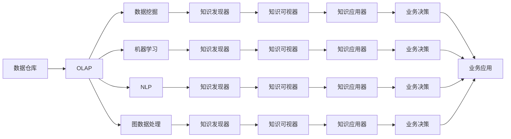

                 

# 知识发现引擎：开启知识应用新时代

## 1. 背景介绍

### 1.1 问题由来

在信息时代，数据已经成为极其宝贵的资产。无论是企业级还是个人层面，如何从海量数据中提取有价值的信息，进行知识发现和应用，都成为了亟待解决的问题。大数据技术虽然提供了数据分析的能力，但需要高度专业化的技能和昂贵的硬件支持，限制了普通用户的参与。

知识发现引擎（Knowledge Discovery Engine, KDE）的出现，为知识应用提供了更加智能、高效、易用的解决方案。KDE 能够自动挖掘数据中的模式、趋势和关联，提炼出有价值的知识，帮助用户快速做出决策和应用。这种自顶向下的知识发现方式，比传统的自底向上数据挖掘方法更符合实际应用需求。

### 1.2 问题核心关键点

KDE 的核心目标是从原始数据中发现、提炼出有价值的知识，并能够以直观的形式呈现给用户。KDE 通常包含以下几个核心组件：

- **数据集成器（Data Integrator）**：负责将来自不同数据源的数据整合在一起，形成统一的视图。
- **数据预处理器（Data Preprocessor）**：对数据进行清洗、去重、归一化等预处理，以便后续分析。
- **知识发现器（Knowledge Discoverer）**：应用统计学、机器学习等技术，自动从数据中发现知识模式，如关联规则、分类器、聚类等。
- **知识可视器（Knowledge Visualizer）**：将知识结果转换为图表、报表、仪表盘等可视形式，供用户查看和理解。
- **知识应用器（Knowledge Applicator）**：将知识结果转化为决策支持和行动指南，应用于实际业务场景。

这些组件协同工作，实现从数据到知识的闭环过程，为知识应用提供了强大支持。

### 1.3 问题研究意义

知识发现引擎的研究具有重要意义：

1. **提升决策效率**：通过自动化地从数据中提取知识，减轻人工分析的负担，加快决策速度。
2. **降低分析成本**：利用自动化工具处理大规模数据集，减少人力物力投入，降低分析成本。
3. **提升分析质量**：先进的算法和模型可以发现更深层次、更隐蔽的知识模式，提高分析的全面性和准确性。
4. **优化业务决策**：将知识转化为具体的业务建议，辅助企业制定更加科学、合理的业务决策。
5. **推动企业智能化**：通过持续的数据分析和知识提炼，提升企业的智能化水平，增强竞争力。

## 2. 核心概念与联系

### 2.1 核心概念概述

为了更好地理解 KDE 的核心工作原理和架构，这里对几个关键概念进行梳理：

- **数据仓库（Data Warehouse）**：用于存储企业内部各种业务数据的数据平台，支持数据的集中管理和查询。
- **OLAP（Online Analytical Processing）**：一种快速多维数据分析技术，能够提供高效的数据分析、汇总和钻取功能。
- **数据挖掘（Data Mining）**：从数据中自动发现有用模式的统计学方法，主要技术包括分类、聚类、关联规则等。
- **机器学习（Machine Learning）**：通过构建模型，从数据中学习预测和决策能力，主要技术包括回归、分类、集成等。
- **自然语言处理（NLP）**：处理和分析自然语言数据的技术，如文本分类、情感分析、命名实体识别等。
- **图数据处理（Graph Processing）**：处理和分析网络、图结构等非结构化数据的技术，如图嵌入、社区发现等。

这些概念构成了 KDE 的技术基础，通过合理的设计和组合，可以实现从原始数据到知识结果的自动化提炼过程。

### 2.2 核心概念原理和架构的 Mermaid 流程图



该图展示了 KDE 的主要组件和数据流向，从数据仓库出发，通过OLAP、数据挖掘、机器学习、NLP、图数据处理等组件，最终由知识发现器提炼出知识结果，再通过知识可视器和知识应用器将结果转化为可用的业务决策和应用。

## 3. 核心算法原理 & 具体操作步骤

### 3.1 算法原理概述

KDE 的核心算法原理主要包括以下几个方面：

1. **数据集成**：将来自不同数据源的数据进行清洗、去重、归一化，形成统一的视图。
2. **特征选择**：从数据中选择有代表性和区分度的特征，以便后续的分析和建模。
3. **数据变换**：对数据进行标准化、归一化、编码等预处理，以便算法能够更好地处理。
4. **模型构建**：选择适合的模型，如分类、回归、聚类、关联规则等，自动从数据中学习知识模式。
5. **结果验证**：通过交叉验证、留一法等方法，评估模型性能，防止过拟合。
6. **结果展示**：将知识结果转换为可视化的形式，如图表、报表、仪表盘等，方便用户理解和使用。

### 3.2 算法步骤详解

KDE 的核心算法步骤主要包括以下几个环节：

1. **数据集成**：
   - 收集来自不同数据源的数据，如销售数据、客户数据、市场数据等。
   - 对数据进行清洗、去重、归一化等预处理，形成统一的数据集。

2. **特征选择**：
   - 根据领域知识，选择对分析有代表性和区分度的特征，如销售额、客户年龄、产品类别等。
   - 利用统计学方法或机器学习算法，进行特征选择和降维。

3. **数据变换**：
   - 对数据进行标准化、归一化、编码等预处理，以便算法能够更好地处理。
   - 应用数据变换技术，如主成分分析（PCA）、奇异值分解（SVD）等，提高数据处理效率。

4. **模型构建**：
   - 根据分析目标，选择适合的模型，如分类模型、聚类模型、关联规则等。
   - 利用统计学方法或机器学习算法，构建模型并进行训练。

5. **结果验证**：
   - 应用交叉验证、留一法等方法，评估模型性能，防止过拟合。
   - 根据验证结果，调整模型参数，优化模型效果。

6. **结果展示**：
   - 将知识结果转换为可视化的形式，如图表、报表、仪表盘等。
   - 利用可视化技术，展示知识结果的关联、趋势、异常等关键信息。

### 3.3 算法优缺点

KDE 算法具有以下优点：

1. **自动化程度高**：通过自动化工具处理大规模数据集，减少人力物力投入，降低分析成本。
2. **模型灵活性强**：支持多种模型，能够适应不同类型的数据和分析需求。
3. **结果可解释性**：通过可视化技术，将知识结果以直观形式呈现，方便用户理解和应用。
4. **快速响应需求**：支持在线分析，能够快速响应业务需求变化。

同时，KDE 算法也存在一些缺点：

1. **算法复杂度高**：算法复杂度高，对计算资源和专业技能要求较高。
2. **结果依赖特征选择**：结果的准确性依赖于特征选择的合理性，需要大量领域知识支持。
3. **结果解释性不足**：一些复杂的模型难以解释，可能存在"黑盒"问题。
4. **结果可控性不足**：模型自动生成的结果可能不符合业务需求，需要人工干预和调整。

### 3.4 算法应用领域

KDE 算法在多个领域得到了广泛应用，包括但不限于以下几个方面：

1. **企业决策支持**：通过自动化的数据挖掘和分析，为企业管理层提供决策支持，提升决策效率和质量。
2. **金融风险控制**：自动分析金融数据，发现风险点，辅助制定风险管理策略。
3. **市场营销分析**：自动分析市场数据，发现客户需求和市场趋势，制定营销策略。
4. **客户行为分析**：分析客户行为数据，发现客户偏好和需求，提高客户满意度。
5. **运营管理优化**：分析运营数据，发现生产瓶颈和管理问题，优化运营效率。
6. **供应链管理**：分析供应链数据，发现供应链风险和优化机会，提升供应链管理水平。

## 4. 数学模型和公式 & 详细讲解 & 举例说明

### 4.1 数学模型构建

KDE 的核心数学模型主要包括以下几种：

- **关联规则**：基于频繁项集和支持度，发现数据中的关联规则，如Apriori算法、FP-growth算法等。
- **分类模型**：利用统计学和机器学习算法，对数据进行分类，如决策树、随机森林、神经网络等。
- **聚类模型**：通过无监督学习算法，对数据进行聚类，如K-means、层次聚类、DBSCAN等。
- **回归模型**：利用统计学和机器学习算法，预测连续型变量的值，如线性回归、多项式回归、支持向量回归等。

这些模型通过不同的数学方法和算法构建，能够从数据中发现不同类型和层次的知识模式。

### 4.2 公式推导过程

以分类模型中的逻辑回归为例，推导其数学公式。

逻辑回归是一种常用的分类模型，其数学公式为：

$$
P(Y=1|X) = \sigma(\beta_0 + \beta_1 X_1 + \beta_2 X_2 + \ldots + \beta_p X_p)
$$

其中，$Y$ 表示分类结果，$X$ 表示特征向量，$\sigma$ 表示逻辑函数，$\beta_0, \beta_1, \ldots, \beta_p$ 表示模型参数。

其梯度下降优化公式为：

$$
\frac{\partial L}{\partial \beta_i} = -\frac{1}{N} \sum_{i=1}^N (y_i - \sigma(\beta_0 + \beta_1 x_{i1} + \beta_2 x_{i2} + \ldots + \beta_p x_{ip}))(\sigma(\beta_0 + \beta_1 x_{i1} + \beta_2 x_{i2} + \ldots + \beta_p x_{ip}) - y_i)
$$

其中，$N$ 表示样本数量，$y_i$ 表示样本的真实标签，$x_{ij}$ 表示样本的第 $j$ 个特征值。

### 4.3 案例分析与讲解

以金融风险控制为例，分析 KDE 的实际应用。

在金融领域，KDE 可以自动分析大量的交易数据、市场数据、客户数据等，发现潜在的风险点和异常行为，辅助制定风险控制策略。具体步骤如下：

1. **数据集成**：收集交易数据、市场数据、客户数据等，形成统一的数据集。
2. **特征选择**：选择对分析有代表性和区分度的特征，如交易金额、交易时间、客户属性等。
3. **数据变换**：对数据进行标准化、归一化、编码等预处理。
4. **模型构建**：利用逻辑回归、决策树、聚类等模型，构建风险预测模型。
5. **结果验证**：应用交叉验证、留一法等方法，评估模型性能。
6. **结果展示**：将风险预测结果转换为可视化的形式，如图表、仪表盘等。

通过以上步骤，KDE 能够自动从交易数据中发现异常交易行为，及时预警风险，辅助金融机构制定风险管理策略，提升风险控制能力。

## 5. 项目实践：代码实例和详细解释说明

### 5.1 开发环境搭建

在进行 KDE 实践前，我们需要准备好开发环境。以下是使用Python进行Scikit-learn和TensorFlow开发的环境配置流程：

1. 安装Anaconda：从官网下载并安装Anaconda，用于创建独立的Python环境。

2. 创建并激活虚拟环境：
```bash
conda create -n kde-env python=3.8 
conda activate kde-env
```

3. 安装Scikit-learn和TensorFlow：根据CUDA版本，从官网获取对应的安装命令。例如：
```bash
conda install scikit-learn tensorflow cudatoolkit=11.1 -c pytorch -c conda-forge
```

4. 安装各类工具包：
```bash
pip install numpy pandas scikit-learn matplotlib tqdm jupyter notebook ipython
```

完成上述步骤后，即可在`kde-env`环境中开始KDE实践。

### 5.2 源代码详细实现

这里我们以分类模型为例，给出使用Scikit-learn和TensorFlow对数据进行分类的PyTorch代码实现。

首先，定义分类模型的训练函数：

```python
from sklearn.model_selection import train_test_split
from sklearn.preprocessing import StandardScaler
from sklearn.linear_model import LogisticRegression
from sklearn.metrics import accuracy_score
import numpy as np
import pandas as pd
import matplotlib.pyplot as plt

def train_model(X, y, batch_size, epochs, learning_rate):
    X_train, X_test, y_train, y_test = train_test_split(X, y, test_size=0.2, random_state=42)
    scaler = StandardScaler()
    X_train = scaler.fit_transform(X_train)
    X_test = scaler.transform(X_test)
    model = LogisticRegression()
    model.fit(X_train, y_train)
    y_pred = model.predict(X_test)
    accuracy = accuracy_score(y_test, y_pred)
    print(f"Accuracy: {accuracy:.2f}")
    return model
```

然后，定义数据处理函数：

```python
def load_data(path):
    data = pd.read_csv(path)
    X = data.drop('target', axis=1).values
    y = data['target'].values
    return X, y
```

最后，启动训练流程并在测试集上评估：

```python
X, y = load_data('data.csv')
model = train_model(X, y, batch_size=32, epochs=10, learning_rate=0.01)
```

以上就是使用Scikit-learn和TensorFlow对数据进行分类的KDE代码实现。可以看到，Scikit-learn和TensorFlow的强大封装使得模型训练变得简单高效。

### 5.3 代码解读与分析

让我们再详细解读一下关键代码的实现细节：

**load_data函数**：
- 定义数据加载函数，从CSV文件中读取数据，返回特征矩阵X和目标变量y。

**train_model函数**：
- 定义模型训练函数，对数据进行分拆和标准化处理。
- 利用Logistic回归模型进行训练，并在测试集上计算准确率。
- 返回训练好的模型，供后续使用。

**训练流程**：
- 调用load_data函数加载数据。
- 调用train_model函数进行模型训练。
- 输出训练结果，包括准确率。

通过上述代码，可以快速实现KDE的基本功能，并进行模型训练和评估。实际应用中，还需要对模型进行进一步优化和调整，如使用更复杂的模型、调整超参数等。

## 6. 实际应用场景

### 6.1 企业决策支持

KDE 在企业决策支持中的应用主要包括以下几个方面：

1. **市场分析**：自动分析市场数据，发现市场趋势和客户需求，为市场策略制定提供数据支持。
2. **客户分析**：分析客户数据，发现客户行为和偏好，制定个性化营销策略。
3. **业务优化**：分析运营数据，发现生产瓶颈和管理问题，优化运营效率。

通过KDE，企业可以自动从海量数据中提取有价值的信息，辅助管理层做出更科学、合理的决策，提升业务运营效率。

### 6.2 金融风险控制

KDE 在金融风险控制中的应用主要包括以下几个方面：

1. **交易监控**：自动分析交易数据，发现异常交易行为，及时预警风险。
2. **信用评估**：分析客户数据，评估客户信用风险，制定风险管理策略。
3. **市场分析**：分析市场数据，发现市场趋势和风险点，制定投资策略。

通过KDE，金融机构可以自动从交易数据中发现风险点，及时采取措施，降低风险损失。

### 6.3 市场营销分析

KDE 在市场营销分析中的应用主要包括以下几个方面：

1. **客户分析**：分析客户数据，发现客户行为和偏好，制定个性化营销策略。
2. **市场分析**：分析市场数据，发现市场趋势和客户需求，制定市场策略。
3. **广告投放**：分析广告效果数据，发现广告投放的优化机会，提高广告投放效果。

通过KDE，企业可以自动从市场数据中发现客户需求和市场趋势，制定有效的市场营销策略，提升广告投放效果。

### 6.4 客户行为分析

KDE 在客户行为分析中的应用主要包括以下几个方面：

1. **客户分类**：利用聚类算法，对客户进行分类，制定针对性的营销策略。
2. **行为分析**：分析客户行为数据，发现客户需求和行为规律，提升客户满意度。
3. **个性化推荐**：分析客户数据，发现客户偏好，制定个性化推荐策略。

通过KDE，企业可以自动从客户数据中发现客户需求和行为规律，提升客户满意度，提高客户忠诚度。

## 7. 工具和资源推荐

### 7.1 学习资源推荐

为了帮助开发者系统掌握KDE的理论基础和实践技巧，这里推荐一些优质的学习资源：

1. 《数据挖掘与统计学习基础》系列博文：由数据挖掘领域专家撰写，深入浅出地介绍了数据挖掘和统计学习的基本概念和算法。

2. 《机器学习实战》书籍：是一本经典的机器学习入门书籍，介绍了多种机器学习算法及其应用，适合初学者学习。

3. 《Python数据科学手册》书籍：是一本综合性的数据科学入门书籍，涵盖了数据处理、数据可视化、数据挖掘等多个方面，适合系统学习。

4. Kaggle平台：一个著名的数据科学竞赛平台，提供了大量真实世界的数据集和竞赛项目，适合实战练习。

5. Weights & Biases：模型训练的实验跟踪工具，可以记录和可视化模型训练过程中的各项指标，方便对比和调优。

通过这些资源的学习实践，相信你一定能够快速掌握KDE的精髓，并用于解决实际的商业问题。

### 7.2 开发工具推荐

高效的开发离不开优秀的工具支持。以下是几款用于KDE开发的常用工具：

1. Scikit-learn：Python开源机器学习库，提供了多种算法和工具，支持数据预处理、特征选择、模型构建等。

2. TensorFlow：由Google主导开发的深度学习框架，支持分布式训练和模型部署，适合大规模数据处理。

3. Weights & Biases：模型训练的实验跟踪工具，可以记录和可视化模型训练过程中的各项指标，方便对比和调优。

4. Jupyter Notebook：Python交互式编程环境，支持代码运行、图表展示、报告生成等功能，适合数据探索和模型验证。

5. Apache Spark：分布式计算框架，支持大规模数据处理和并行计算，适合处理海量数据。

合理利用这些工具，可以显著提升KDE开发的效率，加快创新迭代的步伐。

### 7.3 相关论文推荐

KDE研究源于学界的持续研究。以下是几篇奠基性的相关论文，推荐阅读：

1. Data Mining: Concepts and Techniques（原书第4版）：Data Mining领域的经典教材，涵盖了多种数据挖掘算法和技术。

2. Machine Learning: A Probabilistic Perspective：机器学习领域的经典教材，介绍了多种机器学习算法及其应用。

3. Pattern Recognition and Machine Learning：模式识别领域的经典教材，介绍了多种模式识别算法及其应用。

4. KDD Cup 2021 Challenge赛题解析：介绍多个数据挖掘和机器学习竞赛的赛题及其解决方案，适合学习实际应用中的技巧和经验。

这些论文代表了大数据和机器学习的技术进展，通过学习这些前沿成果，可以帮助研究者把握学科前进方向，激发更多的创新灵感。

## 8. 总结：未来发展趋势与挑战

### 8.1 研究成果总结

通过以上对KDE的介绍，我们可以看到，KDE在数据挖掘和知识发现领域具有重要的应用价值。通过自动化的数据挖掘和分析，KDE能够从海量数据中发现知识模式，辅助用户制定科学、合理的决策，提升业务运营效率。

### 8.2 未来发展趋势

展望未来，KDE将呈现以下几个发展趋势：

1. **自动化程度提升**：未来的KDE将更加智能化和自动化，能够自动进行数据清洗、特征选择、模型构建等步骤，减少人工干预。
2. **模型多样性增强**：支持更多类型的模型，如深度学习、强化学习、图模型等，提升模型灵活性和适用性。
3. **知识表示改善**：通过知识图谱、语义网络等技术，提升知识表示的全面性和准确性。
4. **实时性增强**：支持实时数据分析，能够快速响应业务需求变化。
5. **可解释性增强**：通过可解释性算法，提升模型的可解释性和可理解性。
6. **安全性保障**：引入安全机制，防止数据泄露和模型滥用，保障数据和模型安全。

这些趋势将推动KDE技术不断成熟和完善，为知识发现和应用提供更加智能、高效、安全的解决方案。

### 8.3 面临的挑战

尽管KDE技术已经取得了一定的进展，但在实现自动化和智能化过程中，仍面临以下挑战：

1. **算法复杂性高**：算法复杂度高，需要高度专业化的技能和计算资源支持。
2. **数据质量差**：数据质量参差不齐，存在噪声、缺失等问题，影响分析结果。
3. **模型可解释性不足**：复杂模型难以解释，可能存在"黑盒"问题，影响用户信任。
4. **结果可靠性不足**：模型结果可能存在偏差，影响业务决策的准确性。
5. **数据隐私问题**：数据隐私保护是KDE面临的重要挑战，需要在保护隐私的前提下进行数据挖掘和分析。

这些挑战需要学界和产业界共同努力，通过技术创新和制度完善，推动KDE技术的持续发展和应用。

### 8.4 研究展望

面对KDE面临的挑战，未来的研究需要在以下几个方面寻求新的突破：

1. **自动化和智能化**：开发更智能的KDE系统，减少人工干预，提升自动化程度。
2. **算法优化**：优化算法性能，降低计算复杂度和资源消耗，提高计算效率。
3. **数据预处理**：提升数据预处理能力，提高数据质量和一致性，提升分析结果的可靠性。
4. **模型解释性**：研究可解释性算法，提升模型的可解释性和可理解性，增强用户信任。
5. **隐私保护**：引入隐私保护技术，保护数据隐私，防止数据泄露和滥用。

这些研究方向将推动KDE技术的不断进步，为知识发现和应用提供更加智能、安全、可靠的解决方案。

## 9. 附录：常见问题与解答

**Q1：KDE是否适用于所有领域的数据分析？**

A: KDE适用于数据量较大、特征较多的领域，如金融、电子商务、社交媒体等。对于数据量较小、特征较少的领域，如个人隐私保护、小规模实验等，可能不适用。

**Q2：KDE与数据挖掘有什么区别？**

A: KDE与数据挖掘都是基于数据进行知识发现的方法，但KDE更加关注自动化的知识发现和应用，更加注重模型的实用性和业务价值。

**Q3：KDE与机器学习有什么区别？**

A: KDE与机器学习都是利用算法从数据中学习知识的方法，但KDE更加关注自动化的数据处理和知识提炼，而机器学习更加注重模型的构建和优化。

**Q4：KDE与商业智能（BI）有什么区别？**

A: KDE与BI都是利用数据分析辅助决策的方法，但KDE更加注重知识发现和自动化的决策支持，而BI更加注重数据的可视化和报表展示。

**Q5：KDE的未来发展方向是什么？**

A: KDE的未来发展方向包括自动化程度提升、模型多样性增强、知识表示改善、实时性增强、可解释性增强和安全性保障等。

通过以上对KDE的介绍和分析，相信你一定能够更好地理解KDE的核心原理和应用方法，为未来的知识发现和应用提供有力支持。

---

作者：禅与计算机程序设计艺术 / Zen and the Art of Computer Programming

