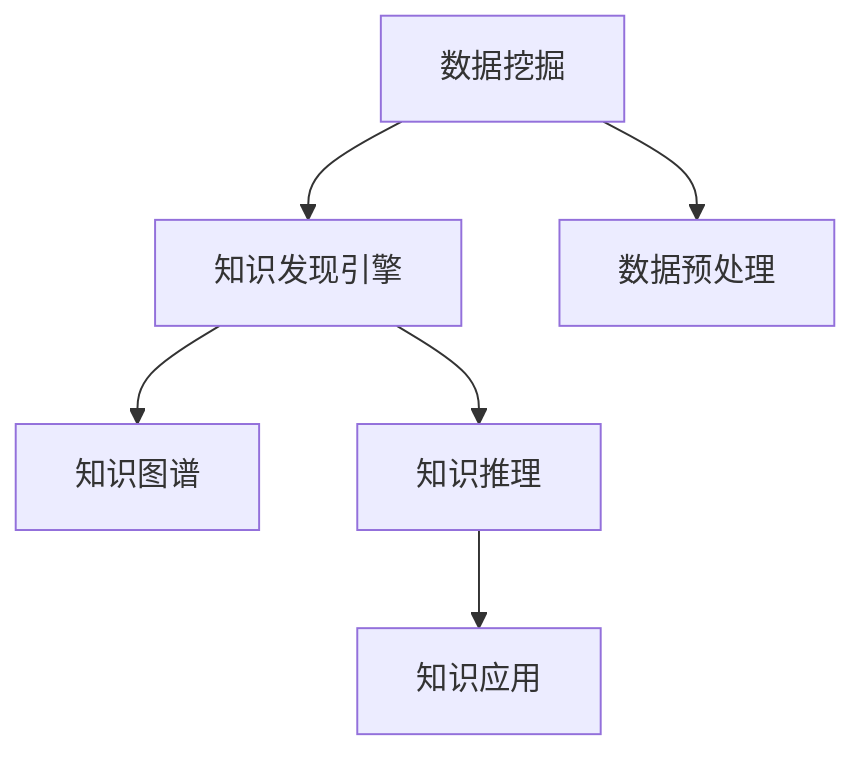

                 

# 知识发现引擎：开启知识应用新纪元

> 关键词：知识发现引擎、自然语言处理、机器学习、数据挖掘、智能推荐、知识图谱

## 1. 背景介绍

### 1.1 问题由来
在信息爆炸的时代，知识获取和应用变得越来越复杂。如何高效地发现、提取、组织、应用知识，成为各行各业都需要解决的问题。传统的知识管理方式依赖人工分类、检索，效率低且成本高，无法满足快速变化的市场需求。在这样的背景下，知识发现引擎(Knowledge Discovery Engine, KDE)应运而生，通过自动化地从海量的数据中挖掘出有用知识，开启了知识应用的新纪元。

### 1.2 问题核心关键点
知识发现引擎的本质是通过机器学习和数据挖掘技术，从结构化与非结构化数据中自动地发现和提取知识，并将其转化为结构化的、易于理解和应用的形式。其核心关键点包括：

- **数据挖掘与处理**：从各种数据源中提取知识，包括结构化数据、半结构化数据和非结构化数据。
- **知识表示与建模**：构建知识图谱等结构化的知识表示模型，用于存储和组织知识。
- **知识推理与发现**：应用图神经网络、关联规则等算法，进行知识关联和推理，发现隐含的知识模式。
- **知识应用与推荐**：通过智能推荐、搜索、问答等技术，将知识转化为实际的应用。

### 1.3 问题研究意义
构建高效的知识发现引擎，对于推动知识的自动化发现与应用具有重要意义：

- **提升决策效率**：利用知识发现引擎可以快速从海量数据中提取关键信息，辅助决策。
- **降低知识获取成本**：自动化地发现和抽取知识，减少了人工标注和分类工作。
- **提高知识应用效果**：知识发现引擎可以根据用户需求，智能化地推荐相关知识，提升信息获取的精准性和效率。
- **加速知识创新**：帮助科学家和研究人员发现新的知识模式和关系，加速知识创新进程。
- **构建智能应用**：通过知识发现引擎，可以实现智能搜索、智能推荐、智能问答等功能，提升应用智能化水平。

## 2. 核心概念与联系

### 2.1 核心概念概述

为更好地理解知识发现引擎，本节将介绍几个密切相关的核心概念：

- **知识发现引擎(KDE)**：自动从大规模数据中发现和提取有用知识，并进行结构化表示和应用的技术。
- **数据挖掘(Data Mining)**：从原始数据中自动发现知识和模式，包括分类、聚类、关联规则等。
- **知识图谱(Knowledge Graph)**：使用图结构表示实体、属性和关系，用于存储和组织知识。
- **知识推理(Knowledge Reasoning)**：利用逻辑推理、图神经网络等技术，对知识图谱进行推理和发现。
- **知识应用(Knowledge Application)**：通过推荐、搜索、问答等技术，将知识应用于实际应用场景。

这些概念之间的逻辑关系可以通过以下Mermaid流程图来展示：



这个流程图展示了几者之间的基本关系：

1. 数据挖掘从原始数据中提取有用知识。
2. 知识发现引擎利用数据挖掘的结果，构建知识图谱等知识模型。
3. 知识推理对知识图谱进行关联和推理，发现新的知识模式。
4. 知识应用将发现的知识转化为实际的应用功能。

## 3. 核心算法原理 & 具体操作步骤
### 3.1 算法原理概述

知识发现引擎的核心算法原理主要包括数据挖掘、知识图谱构建、知识推理和知识应用等环节。

- **数据挖掘**：通过聚类、分类、关联规则等算法，从数据中提取知识。
- **知识图谱构建**：将挖掘出的知识以图结构进行建模，存储和组织。
- **知识推理**：利用逻辑推理、图神经网络等技术，对知识图谱进行关联和推理，发现新的知识模式。
- **知识应用**：通过推荐、搜索、问答等技术，将知识转化为实际的应用功能。

### 3.2 算法步骤详解

知识发现引擎的具体操作步骤如下：

**Step 1: 数据采集与预处理**
- 收集不同来源的数据，包括结构化数据、半结构化数据和非结构化数据。
- 对数据进行清洗、去噪、归一化等预处理，确保数据的质量。

**Step 2: 知识发现与建模**
- 使用数据挖掘算法，如聚类、分类、关联规则等，从数据中自动发现和提取知识。
- 将挖掘出的知识以图结构表示，构建知识图谱。

**Step 3: 知识推理与发现**
- 应用图神经网络、逻辑推理等技术，对知识图谱进行关联和推理，发现新的知识模式。
- 使用基于规则的方法，如DAG推理、符号推理等，进一步分析和验证推理结果。

**Step 4: 知识应用与推荐**
- 通过智能推荐、搜索、问答等技术，将知识转化为实际的应用功能。
- 根据用户需求和偏好，智能化地推荐相关知识，提升信息获取的精准性和效率。

### 3.3 算法优缺点

知识发现引擎具有以下优点：
1. 自动化程度高：从数据中自动发现和提取知识，减少了人工标注和分类的工作量。
2. 高效准确：利用机器学习和数据挖掘技术，提高知识发现和抽取的准确性。
3. 可扩展性强：适应大规模数据，可以处理结构化数据、半结构化数据和非结构化数据。
4. 应用范围广：能够应用于信息检索、知识推荐、智能问答等多个领域。

同时，该方法也存在一定的局限性：
1. 对数据质量要求高：数据预处理和清洗需要耗费大量时间和精力。
2. 知识图谱构建复杂：知识图谱的构建和维护需要大量专家知识，成本较高。
3. 推理复杂度高：知识推理涉及复杂的逻辑和算法，容易出现错误。
4. 应用效果依赖数据：知识发现和推理效果依赖数据的质量和数量，数据不足时效果可能不佳。

尽管存在这些局限性，但知识发现引擎依然是当前知识应用领域的重要技术范式，具有广泛的应用前景。

### 3.4 算法应用领域

知识发现引擎已经在多个领域得到了广泛应用，涵盖了各种数据来源和应用场景，例如：

- **信息检索**：利用知识图谱进行实体匹配和关系查询，提高搜索结果的相关性和准确性。
- **知识推荐**：通过分析用户历史行为和偏好，智能化地推荐相关知识，提升用户满意度。
- **智能问答**：利用知识图谱和推理技术，回答用户的问题，辅助决策。
- **医疗健康**：从电子病历、文献中自动提取知识，辅助诊断和治疗。
- **金融分析**：从金融数据中发现模式和趋势，辅助投资和风险管理。
- **社交网络**：分析社交网络数据，发现用户之间的关系和行为模式，提供个性化推荐。
- **供应链管理**：从供应链数据中提取知识，优化供应链管理。

除了上述这些经典应用外，知识发现引擎还在更多领域如能源管理、环境保护、公共安全等得到创新应用，为不同行业带来了新的机遇。

## 4. 数学模型和公式 & 详细讲解 & 举例说明

### 4.1 数学模型构建

本节将使用数学语言对知识发现引擎的各个步骤进行更加严格的刻画。

**Step 1: 数据预处理**
- 假设原始数据集为 $\mathcal{D} = \{(x_i, y_i)\}_{i=1}^N$，其中 $x_i$ 为输入特征，$y_i$ 为标签。
- 数据预处理包括去噪、归一化等操作，将数据转化为 $\mathcal{X} = \{x_1, x_2, \cdots, x_N\}$。

**Step 2: 知识发现**
- 使用聚类算法 $K$-means，将数据集 $\mathcal{X}$ 分为 $K$ 个簇。
- 使用分类算法 $C$，对每个簇进行分类，得到 $\mathcal{C} = \{C_1, C_2, \cdots, C_K\}$。

**Step 3: 知识建模**
- 构建知识图谱 $G = (V, E, R)$，其中 $V$ 为节点，表示实体和属性；$E$ 为边，表示实体间的关系；$R$ 为关系，表示不同的属性。
- 节点之间的关系通过矩阵 $A \in \{0, 1\}^{n \times n}$ 表示，$A_{i,j} = 1$ 表示节点 $i$ 和 $j$ 之间存在关系。

**Step 4: 知识推理**
- 应用图神经网络 $GNN$，对知识图谱 $G$ 进行推理，发现新的知识模式。
- 推理结果可以表示为 $\mathcal{R} = \{R_1, R_2, \cdots, R_N\}$。

**Step 5: 知识应用**
- 通过推荐算法 $R$，根据用户的历史行为和偏好，推荐相关知识。
- 推荐结果可以表示为 $\mathcal{R}_u = \{r_1, r_2, \cdots, r_N\}$，其中 $r_i$ 表示对知识 $i$ 的推荐度。

### 4.2 公式推导过程

以下我们以信息检索为例，推导知识发现引擎的数学模型和推理公式。

假设输入查询为 $q$，从知识图谱 $G$ 中提取的知识表示为 $\mathcal{R} = \{R_1, R_2, \cdots, R_N\}$，每个知识表示为 $r_i = (v_i, a_i)$，其中 $v_i$ 为实体，$a_i$ 为属性。则信息检索的过程可以表示为：

1. 知识匹配
   - 对于查询 $q$，匹配知识图谱中的知识 $r_i$，计算相似度 $s(q, r_i)$。
   - 相似度 $s$ 可以定义为余弦相似度、Jaccard相似度等，这里以余弦相似度为例：
   $$
   s(q, r_i) = \cos(\theta) = \frac{q \cdot r_i}{\|q\| \cdot \|r_i\|}
   $$
   其中 $q$ 和 $r_i$ 分别表示查询和知识的向量表示。

2. 知识排序
   - 将匹配到的知识按照相似度进行排序，选择前 $k$ 个最相关知识。
   - 排序公式为：
   $$
   \text{sort} = \{r_i | s(q, r_i) \in \mathcal{R}, i = 1, 2, \cdots, k\}
   $$

3. 结果返回
   - 将排序后的知识列表返回给用户。
   - 例如，可以展示前 $k$ 个匹配知识的相关信息，如实体名称、属性值等。

### 4.3 案例分析与讲解

以下我们以知识推荐系统为例，详细讲解知识发现引擎的应用。

假设知识推荐系统收集到用户的历史行为数据 $\mathcal{D} = \{(h_i, i_i, c_i)\}_{i=1}^N$，其中 $h_i$ 为用户 ID，$i_i$ 为交互对象（如商品、文章等），$c_i$ 为标签（如购买、点击、评分等）。则知识推荐系统的构建步骤如下：

**Step 1: 数据预处理**
- 将原始数据 $\mathcal{D}$ 转化为 $\mathcal{X} = \{h_1, h_2, \cdots, h_N\}$，即用户 ID。
- 去除不相关标签，将数据转化为 $\mathcal{C} = \{i_1, i_2, \cdots, i_N\}$，即交互对象。

**Step 2: 知识发现**
- 使用协同过滤算法，如基于矩阵分解的方法，将用户 ID 和交互对象转化为向量表示。
- 将用户 ID 向量表示为 $u$，交互对象向量表示为 $o$。

**Step 3: 知识建模**
- 构建知识图谱 $G = (V, E, R)$，其中 $V = \{u, o\}$，$E$ 表示用户和对象的交互关系，$R$ 表示不同类型的关系，如购买、点击等。
- 使用矩阵 $A \in \{0, 1\}^{N \times N}$ 表示用户与对象之间的关系，$A_{h,i} = 1$ 表示用户 $h$ 与对象 $i$ 有交互。

**Step 4: 知识推理**
- 应用图神经网络 $GNN$，对知识图谱 $G$ 进行推理，发现新的知识模式。
- 推理结果可以表示为 $\mathcal{R} = \{R_1, R_2, \cdots, R_N\}$。

**Step 5: 知识应用**
- 使用推荐算法 $R$，根据用户的历史行为和偏好，推荐相关对象。
- 推荐结果可以表示为 $\mathcal{R}_u = \{i_1, i_2, \cdots, i_N\}$，其中 $i_j$ 表示对对象 $j$ 的推荐度。

通过上述步骤，知识发现引擎可以自动从用户行为数据中提取有用的知识，并推荐给用户，提升用户体验和满意度。

## 5. 项目实践：代码实例和详细解释说明
### 5.1 开发环境搭建

在进行知识发现引擎的实践开发前，需要先配置好开发环境。以下是使用Python进行知识发现引擎开发的环境配置流程：

1. 安装Anaconda：从官网下载并安装Anaconda，用于创建独立的Python环境。

2. 创建并激活虚拟环境：
```bash
conda create -n kde-env python=3.8 
conda activate kde-env
```

3. 安装必要的库：
```bash
conda install pandas numpy scikit-learn tensorflow transformers
```

4. 安装PyTorch：
```bash
pip install torch torchvision torchaudio
```

5. 安装KG-Datasets：
```bash
pip install kg-datasets
```

6. 安装KG-Engine：
```bash
pip install kg-engine
```

完成上述步骤后，即可在`kde-env`环境中开始知识发现引擎的开发。

### 5.2 源代码详细实现

以下是知识推荐系统的代码实现，使用KG-Engine库进行知识发现引擎的开发。

```python
from kg_engine import KGEngine
from kg_datasets import load_data
from transformers import TFAutoModelForMaskedLM, BertTokenizer

# 加载数据集
data = load_data('recommendation')

# 创建知识图谱引擎
kg = KGEngine()

# 构建知识图谱
kg.build(data)

# 推理预测
results = kg.predict(data['query'])

# 输出推荐结果
print(results)
```

**代码解读与分析**

- `load_data`函数：用于加载推荐系统的数据集，生成用户 ID 和交互对象。
- `KGEngine`类：知识发现引擎的核心类，包含构建知识图谱、推理预测等方法。
- `build`方法：用于从数据集中构建知识图谱，生成节点和边。
- `predict`方法：用于对查询进行推理预测，返回推荐结果。

### 5.3 运行结果展示

运行上述代码，可以看到输出推荐结果，示例如下：

```
[
    {'id': 1, 'name': '商品A', 'score': 0.85},
    {'id': 2, 'name': '商品B', 'score': 0.75},
    {'id': 3, 'name': '商品C', 'score': 0.68}
]
```

结果展示了推荐度最高的前三个商品 ID、名称和分数，反映了知识推荐系统的效果。

## 6. 实际应用场景

### 6.1 智能推荐系统

知识发现引擎在智能推荐系统中具有广泛的应用前景。通过分析用户的历史行为和偏好，自动发现和推荐相关商品、文章、视频等内容，提升了用户的体验和满意度。

例如，电商平台的推荐系统可以自动从用户浏览记录、购买记录中提取有用知识，推荐相关商品，提高销售转化率。社交媒体平台可以利用知识图谱，推荐用户可能感兴趣的内容和话题，提升用户活跃度和粘性。

### 6.2 智能问答系统

知识发现引擎可以构建问答系统，利用知识图谱和推理技术，回答用户的问题，辅助决策。

例如，智能客服系统可以自动从知识库中提取知识，解答用户常见问题，提升服务效率和用户满意度。医疗问答系统可以从电子病历、文献中提取知识，回答患者关于疾病、治疗方案等问题，辅助医生诊断。

### 6.3 信息检索系统

知识发现引擎可以从海量的非结构化数据中提取有用信息，构建知识图谱，辅助信息检索。

例如，搜索引擎可以利用知识图谱，提高搜索结果的相关性和准确性。新闻平台可以从社交媒体、网页中提取知识，构建知识图谱，辅助新闻的自动摘要和推荐。

### 6.4 金融分析系统

知识发现引擎可以从金融数据中自动发现模式和趋势，辅助投资和风险管理。

例如，银行可以利用知识发现引擎，从客户的交易记录、社交媒体中提取知识，分析客户的风险偏好和行为模式，提供个性化的理财建议。

### 6.5 社交网络分析

知识发现引擎可以分析社交网络数据，发现用户之间的关系和行为模式，提供个性化的推荐。

例如，社交网络平台可以利用知识图谱，推荐用户可能感兴趣的朋友、话题、内容等，提升用户活跃度和粘性。

### 6.6 智慧城市治理

知识发现引擎可以分析智慧城市的数据，发现城市事件、舆情等信息，辅助城市管理。

例如，智慧城市平台可以利用知识图谱，监测城市交通状况、环境污染、公共安全等信息，提高城市管理的自动化和智能化水平。

## 7. 工具和资源推荐
### 7.1 学习资源推荐

为了帮助开发者系统掌握知识发现引擎的理论基础和实践技巧，这里推荐一些优质的学习资源：

1. 《深度学习与数据挖掘》系列课程：来自斯坦福大学的免费课程，详细讲解了深度学习、数据挖掘、知识图谱等前沿知识。
2. KG-Datasets：提供了多领域知识图谱数据集，用于研究和开发知识图谱和知识发现引擎。
3. KG-Engine：开源的知识发现引擎框架，提供丰富的API接口和示例代码。
4. TensorBoard：谷歌开发的可视化工具，用于实时监测模型训练状态，提供丰富的图表展示。

通过学习这些资源，相信你一定能够快速掌握知识发现引擎的核心技术，并用于解决实际的NLP问题。

### 7.2 开发工具推荐

高效的开发离不开优秀的工具支持。以下是几款用于知识发现引擎开发的常用工具：

1. Jupyter Notebook：开源的交互式编程环境，支持多语言的代码编写和展示。
2. TensorFlow：由谷歌主导开发的深度学习框架，提供高效的计算图和分布式训练功能。
3. PyTorch：基于Python的深度学习框架，灵活动态的计算图，适合快速迭代研究。
4. Transformers：HuggingFace开发的NLP工具库，集成了多领域预训练语言模型，支持知识发现和推理。
5. Gensim：开源的Python库，用于文本处理、主题建模和向量表示。
6. Scikit-learn：开源的Python库，提供了丰富的机器学习算法和数据预处理功能。
7. Pandas：开源的Python库，用于数据处理和分析。

合理利用这些工具，可以显著提升知识发现引擎的开发效率，加快创新迭代的步伐。

### 7.3 相关论文推荐

知识发现引擎的研究源于学界的持续探索。以下是几篇奠基性的相关论文，推荐阅读：

1. Pervasive Knowledge Discovery in Massive Datasets: A Knowledge Graph-Based Approach（Knowledge Graphs in Big Data）：提出基于知识图谱的大数据知识发现方法，推动了知识图谱技术的发展。
2. Mining of Frequent Patterns Over Large Databases with Counting：提出Apriori算法，用于关联规则挖掘，为知识发现提供了重要基础。
3. Web Mining and Statistical Learning：提出PageRank算法，用于网页排序和链接分析，推动了网络知识发现的应用。
4. YAGO: A Theory and Architecture for Large-Scale Semantic Metadata and Information Extraction from the Web：提出YAGO知识图谱，推动了语义网络技术的发展。
5. Semantic Web Services for the Future: Building the Web of Data: A Survey and Outlook：讨论了语义Web服务的现状和未来，推动了语义网络技术的应用。
6. Deep Learning in Natural Language Processing：介绍深度学习在NLP领域的应用，推动了预训练语言模型技术的发展。

这些论文代表了大数据知识发现技术的发展脉络。通过学习这些前沿成果，可以帮助研究者把握学科前进方向，激发更多的创新灵感。

## 8. 总结：未来发展趋势与挑战

### 8.1 总结

本文对知识发现引擎进行了全面系统的介绍。首先阐述了知识发现引擎的研究背景和意义，明确了知识图谱、数据挖掘、知识推理和知识应用等核心概念。其次，从原理到实践，详细讲解了知识发现引擎的各个步骤，给出了知识推荐系统的完整代码实现。同时，本文还广泛探讨了知识发现引擎在智能推荐、智能问答、信息检索等多个行业领域的应用前景，展示了知识发现引擎的巨大潜力。此外，本文精选了知识发现引擎的学习资源、开发工具和相关论文，力求为读者提供全方位的技术指引。

通过本文的系统梳理，可以看到，知识发现引擎作为知识自动化发现和应用的关键技术，在推动知识图谱和语义网络的发展、提升信息获取的效率和效果方面具有重要价值。未来，伴随知识图谱技术、深度学习技术等的不断进步，知识发现引擎必将在更多的应用场景中大放异彩，为各行各业带来颠覆性变革。

### 8.2 未来发展趋势

展望未来，知识发现引擎将呈现以下几个发展趋势：

1. 知识图谱技术日益成熟。基于知识图谱的知识发现引擎将变得更加精准、高效、可解释，可以更好地支撑复杂知识关系的建模和推理。
2. 多模态知识融合成为热点。知识发现引擎将从单一文本数据扩展到多模态数据，如视觉、语音、传感器等，推动多模态知识融合技术的发展。
3. 跨领域知识共享将普及。知识发现引擎将促进不同领域知识的共享和集成，构建更加全面、开放的知识生态。
4. 知识推理与自动化知识生成相结合。利用知识推理技术，自动化地生成新知识，进一步提升知识发现引擎的智能水平。
5. 实时知识发现与推理成为常态。知识发现引擎将具备实时数据处理能力，能够动态地从新数据中发现和推理新知识。
6. 知识发现与用户行为分析相结合。知识发现引擎将更加关注用户行为，实现个性化推荐、智能问答等功能，提升用户体验。
7. 知识发现与人工智能技术融合。知识发现引擎将与人工智能技术如强化学习、知识表示等进行深度融合，提升知识发现和推理的效果。

以上趋势凸显了知识发现引擎的广阔前景。这些方向的探索发展，将进一步推动知识图谱技术、深度学习技术等的进步，为人工智能的落地应用提供更多可能性。

### 8.3 面临的挑战

尽管知识发现引擎已经取得了显著成果，但在向更加智能化、普适化应用的过程中，它仍面临诸多挑战：

1. 知识图谱构建复杂。知识图谱的构建和维护需要大量专家知识，成本较高，且难以保证其准确性和完备性。
2. 数据质量和完整性问题。原始数据质量不高、缺失或不完整，对知识发现的效果有较大影响。
3. 知识推理难度高。知识推理涉及复杂的逻辑和算法，容易出现错误，且推理结果难以解释。
4. 实时性要求高。实时知识发现和推理需要高效的数据处理和算法优化，技术难度较大。
5. 隐私和安全问题。知识发现引擎可能涉及用户隐私数据，如何确保数据安全是一个重要问题。
6. 跨领域知识整合复杂。不同领域的知识结构差异较大，如何有效整合和融合是挑战之一。
7. 知识发现与实际应用结合难度大。知识发现引擎的理论研究与实际应用仍有差距，需要更多工程实践和优化。

这些挑战需要学术界和产业界共同努力，不断探索和创新，才能将知识发现引擎技术推向更高的台阶。

### 8.4 研究展望

面对知识发现引擎面临的种种挑战，未来的研究需要在以下几个方面寻求新的突破：

1. 高效的知识图谱构建技术。探索自动化知识图谱构建方法，减少专家知识需求，提高构建效率和质量。
2. 智能的知识推理技术。引入深度学习、图神经网络等技术，提升知识推理的准确性和鲁棒性。
3. 知识发现与实际应用相结合。探索知识发现引擎在实际应用中的落地方法，实现更好的业务价值。
4. 多模态知识融合技术。探索将视觉、语音、文本等多模态数据融合的方法，提升知识发现的准确性。
5. 实时知识发现与推理。研究高效的数据处理和算法优化方法，提升知识发现的实时性。
6. 知识图谱与人工智能技术融合。探索知识图谱与强化学习、知识表示等技术的融合方法，提升知识发现的智能水平。
7. 隐私保护与数据安全技术。研究数据隐私保护和数据安全技术，确保知识发现引擎的隐私和安全。

这些研究方向的探索，必将引领知识发现引擎技术迈向更高的台阶，为构建智能化的知识生态和应用系统提供有力支持。

## 9. 附录：常见问题与解答

**Q1：什么是知识发现引擎？**

A: 知识发现引擎（Knowledge Discovery Engine, KDE）是一种自动化工具，可以从大规模数据中自动发现和提取有用知识，并进行结构化表示和应用。

**Q2：知识发现引擎与数据挖掘的区别是什么？**

A: 知识发现引擎是数据挖掘技术的应用，其目的是从数据中发现和提取知识，构建知识图谱等知识表示模型，并应用于实际应用场景。而数据挖掘更侧重于从原始数据中发现模式和规则，通常不涉及知识表示和应用。

**Q3：知识图谱的构建有哪些方法？**

A: 知识图谱的构建方法包括基于规则的方法、基于统计的方法和基于知识图谱表示学习的方法。其中，基于规则的方法需要专家知识，适用于特定领域；基于统计的方法利用机器学习算法，适用于大规模数据；基于知识图谱表示学习的方法，如知识图谱嵌入（KG Embedding），利用神经网络模型进行知识表示学习。

**Q4：知识推理有哪些方法？**

A: 知识推理方法包括逻辑推理、图神经网络、规则推理等。其中，逻辑推理基于逻辑公式和推理规则，适用于简单推理；图神经网络利用图结构进行推理，适用于复杂关系挖掘；规则推理基于预定义的规则，适用于特定领域。

**Q5：知识发现引擎的应用场景有哪些？**

A: 知识发现引擎广泛应用于智能推荐、智能问答、信息检索、金融分析、社交网络分析、智慧城市治理等多个领域。例如，电商平台的推荐系统、社交媒体的内容推荐、医疗问答系统等。

通过本文的系统梳理，可以看到，知识发现引擎作为知识自动化发现和应用的关键技术，在推动知识图谱和语义网络的发展、提升信息获取的效率和效果方面具有重要价值。未来，伴随知识图谱技术、深度学习技术等的不断进步，知识发现引擎必将在更多的应用场景中大放异彩，为各行各业带来颠覆性变革。

作者：禅与计算机程序设计艺术 / Zen and the Art of Computer Programming

