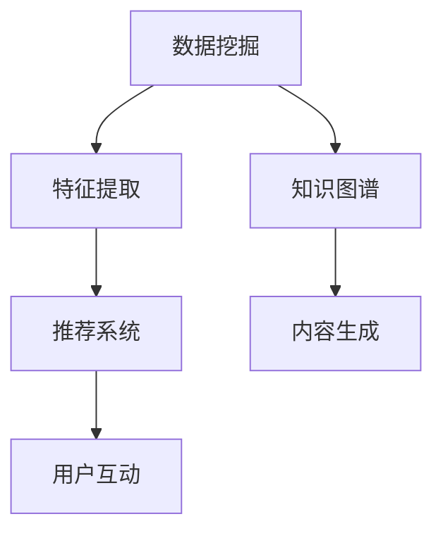

                 

# 知识发现引擎：推动创意产业的内容升级

## 1. 背景介绍

### 1.1 问题由来

在数字化时代，创意产业面临着前所未有的机遇与挑战。随着互联网和移动设备的普及，内容生产与消费已经发生了根本性的转变。用户对内容的个性化需求愈发强烈，内容质量与差异化的竞争变得尤为关键。与此同时，数字化技术的迅速迭代，如大数据、人工智能、机器学习等，为内容生产与发现带来了新的工具与方法。

知识发现引擎（Knowledge Discovery Engine, KDE）正是基于这种背景应运而生。其目标是通过从海量数据中自动抽取、组织、关联、整合信息，以提供高度个性化、高效、精准的内容推荐服务，推动创意产业的内容升级。知识发现引擎利用先进的算法和模型，对海量数据进行挖掘与分析，发现潜在知识和规律，从而实现内容的自动化推荐和智能创造。

### 1.2 问题核心关键点

知识发现引擎的核心关键点在于以下几个方面：

- **数据挖掘与处理**：从结构化与非结构化数据中提取出有价值的信息和模式。
- **智能推荐**：基于用户行为和偏好，实时推荐符合其需求的内容。
- **内容创造**：自动生成与推荐相关的新内容，提升内容多样性和新颖性。
- **用户互动**：实现与用户的高频互动，了解用户需求和反馈，不断优化推荐结果。
- **跨平台适配**：无缝对接多个平台与设备，提供一致的用户体验。

这一系列关键点的有机结合，使得知识发现引擎能够高效地支持创意产业的内容生成与发现，极大地提升内容生产与消费的效率与质量。

## 2. 核心概念与联系

### 2.1 核心概念概述

为更清晰地理解知识发现引擎的核心概念与实现框架，本节将详细介绍几个关键概念及其关联。

- **数据挖掘**：从大规模数据集中发现潜在模式和知识的过程，包括数据清洗、特征提取、模式识别等步骤。
- **推荐系统**：通过用户行为、历史数据等，预测用户可能感兴趣的内容，提供个性化推荐服务。
- **知识图谱**：使用图结构表示实体、关系和属性的知识表示模型，便于内容的关联与推理。
- **深度学习**：基于神经网络结构的机器学习技术，通过多层次的抽象和表征，学习复杂非线性关系。
- **内容生成**：利用自然语言处理等技术，自动生成与推荐相关的新内容，提高内容创新性和多样性。

这些概念之间的联系通过以下Mermaid流程图展示：



此图展示了数据挖掘、特征提取、知识图谱、推荐系统和内容生成的相互作用关系，其中每一步都为后续步骤提供支持与输入。

## 3. 核心算法原理 & 具体操作步骤
### 3.1 算法原理概述

知识发现引擎的核心算法原理主要基于数据挖掘与机器学习的方法。其核心流程包括以下几个步骤：

1. **数据收集与预处理**：从多个来源收集数据，并进行清洗、去重、归一化等预处理工作。
2. **特征提取与选择**：从原始数据中提取有意义的特征，并选择影响推荐结果的关键特征。
3. **模型训练与优化**：利用机器学习算法，对提取出的特征进行训练与优化，形成推荐模型。
4. **内容推荐**：根据用户行为和模型预测，实时推荐适合的内容。
5. **反馈与迭代**：收集用户反馈，对模型进行迭代优化。

以上流程构成了一个闭环的推荐系统，能够不断地从用户行为中学习，并逐步优化推荐结果。

### 3.2 算法步骤详解

下面将详细介绍知识发现引擎的每个步骤的详细步骤：

**Step 1: 数据收集与预处理**

1. **数据来源**：收集用户行为数据、社交媒体数据、新闻数据、商品数据等。
2. **数据清洗**：处理缺失值、异常值和重复数据，保证数据质量。
3. **数据转换**：将数据转换为标准格式，便于后续处理。

**Step 2: 特征提取与选择**

1. **特征提取**：从原始数据中提取特征，如用户画像、内容属性、时间戳等。
2. **特征选择**：通过特征选择算法，保留对推荐结果影响最大的特征。

**Step 3: 模型训练与优化**

1. **选择模型**：根据任务特点，选择适合的推荐模型，如协同过滤、基于内容的推荐、深度学习模型等。
2. **模型训练**：利用训练数据对模型进行训练，调整模型参数。
3. **模型评估**：使用测试数据对模型进行评估，选择合适的模型和参数。

**Step 4: 内容推荐**

1. **实时推荐**：根据用户行为和模型预测，实时推荐适合的内容。
2. **多模态推荐**：结合文本、图像、视频等多模态数据，提升推荐质量。

**Step 5: 反馈与迭代**

1. **收集反馈**：收集用户对推荐结果的反馈，如点击率、满意度等。
2. **模型优化**：根据用户反馈，对模型进行迭代优化。

### 3.3 算法优缺点

知识发现引擎具有以下优点：

1. **高效性**：能够快速处理和分析大量数据，提供实时推荐。
2. **个性化**：能够根据用户行为和偏好，提供高度个性化的推荐。
3. **适应性强**：适用于多种数据类型和内容推荐场景。
4. **可扩展性**：能够处理大规模数据，具有良好的扩展性。

同时，该算法也存在以下缺点：

1. **数据依赖**：高度依赖数据质量和数量，数据不足时推荐效果可能不佳。
2. **冷启动问题**：新用户和物品的初始推荐效果可能较差。
3. **隐私问题**：用户行为数据可能涉及隐私，需要严格的数据保护措施。
4. **算法复杂性**：部分模型（如深度学习模型）的训练和优化过程复杂。

### 3.4 算法应用领域

知识发现引擎在多个领域中得到了广泛应用：

- **电子商务**：为电商平台提供个性化推荐，提升用户转化率和销售额。
- **新闻媒体**：为新闻网站提供个性化新闻推荐，提升用户阅读体验和粘性。
- **社交网络**：为用户推荐感兴趣的朋友、群组和内容，提升用户互动和满意度。
- **视频平台**：为用户推荐感兴趣的视频内容，提高用户观看时间和平台粘性。
- **教育培训**：为学习者提供个性化课程推荐，提升学习效果和平台使用率。

以上领域的应用展示了知识发现引擎的广泛潜力和应用前景。

## 4. 数学模型和公式 & 详细讲解 & 举例说明
### 4.1 数学模型构建

知识发现引擎的数学模型构建通常基于统计学习、机器学习和深度学习等方法。以下将详细介绍这些数学模型。

**协同过滤模型**

协同过滤模型基于用户行为数据和物品属性数据，通过计算用户和物品之间的相似度，推荐用户可能感兴趣的内容。

1. **用户画像表示**：
   - 将用户行为数据转换为用户画像向量 $\mathbf{u}$。

   2. **物品画像表示**：
   - 将物品属性数据转换为物品画像向量 $\mathbf{i}$。

   3. **相似度计算**：
   - 计算用户 $\mathbf{u}$ 和物品 $\mathbf{i}$ 之间的相似度 $s_{ui}$。

   4. **推荐结果**：
   - 根据相似度 $s_{ui}$ 计算物品 $i$ 的推荐分数 $f_{ui} = s_{ui} \times \mathbf{u}^T\mathbf{i}$。
   - 选择分数最高的物品作为推荐结果。

**基于内容的推荐模型**

基于内容的推荐模型通过计算物品属性与用户画像之间的相似度，推荐与用户兴趣相符的内容。

1. **用户画像表示**：
   - 将用户行为数据转换为用户画像向量 $\mathbf{u}$。

   2. **物品画像表示**：
   - 将物品属性数据转换为物品画像向量 $\mathbf{i}$。

   3. **相似度计算**：
   - 计算物品 $\mathbf{i}$ 和用户 $\mathbf{u}$ 之间的相似度 $s_{ui}$。

   4. **推荐结果**：
   - 根据相似度 $s_{ui}$ 计算物品 $i$ 的推荐分数 $f_{ui} = s_{ui} \times \mathbf{u}^T\mathbf{i}$。
   - 选择分数最高的物品作为推荐结果。

**深度学习推荐模型**

深度学习推荐模型利用神经网络结构，从大量数据中学习复杂的非线性关系，提供更加精准的推荐结果。

1. **输入表示**：
   - 将用户行为数据和物品属性数据转换为模型输入 $\mathbf{x}$。

   2. **隐藏层表示**：
   - 通过多层神经网络，将输入 $\mathbf{x}$ 映射为隐藏层表示 $\mathbf{h}$。

   3. **输出表示**：
   - 将隐藏层表示 $\mathbf{h}$ 映射为推荐分数 $\mathbf{f}$。

   4. **推荐结果**：
   - 选择分数最高的物品作为推荐结果。

### 4.2 公式推导过程

以下将详细推导协同过滤模型和基于内容的推荐模型的公式。

**协同过滤模型**

假设用户画像向量为 $\mathbf{u}$，物品画像向量为 $\mathbf{i}$，相似度函数为 $s_{ui}$。

用户 $u$ 对物品 $i$ 的推荐分数 $f_{ui}$ 可以表示为：

$$
f_{ui} = s_{ui} \times \mathbf{u}^T\mathbf{i}
$$

其中，$s_{ui}$ 为相似度函数，可以是余弦相似度、皮尔逊相关系数等。

**基于内容的推荐模型**

假设用户画像向量为 $\mathbf{u}$，物品画像向量为 $\mathbf{i}$，相似度函数为 $s_{ui}$。

物品 $i$ 对用户 $u$ 的推荐分数 $f_{ui}$ 可以表示为：

$$
f_{ui} = s_{ui} \times \mathbf{u}^T\mathbf{i}
$$

其中，$s_{ui}$ 为相似度函数，可以是余弦相似度、皮尔逊相关系数等。

### 4.3 案例分析与讲解

**协同过滤推荐案例**

假设我们有一个在线电商平台的推荐系统，希望为用户推荐可能感兴趣的商品。假设我们收集了用户的历史购买记录和商品的属性数据。

1. **数据准备**：
   - 收集用户购买历史数据 $\{(\mathbf{u}, \mathbf{i})\}$。
   - 收集商品属性数据 $\{\mathbf{i}\}$。

2. **用户画像表示**：
   - 将用户购买历史数据转换为用户画像向量 $\mathbf{u}$。

3. **物品画像表示**：
   - 将商品属性数据转换为物品画像向量 $\mathbf{i}$。

4. **相似度计算**：
   - 计算用户 $\mathbf{u}$ 和物品 $\mathbf{i}$ 之间的相似度 $s_{ui}$。

5. **推荐结果**：
   - 根据相似度 $s_{ui}$ 计算物品 $i$ 的推荐分数 $f_{ui} = s_{ui} \times \mathbf{u}^T\mathbf{i}$。
   - 选择分数最高的物品作为推荐结果。

**基于内容的推荐案例**

假设我们有一个在线新闻平台的推荐系统，希望为用户推荐可能感兴趣的新闻。假设我们收集了用户的历史阅读记录和新闻的属性数据。

1. **数据准备**：
   - 收集用户阅读历史数据 $\{(\mathbf{u}, \mathbf{i})\}$。
   - 收集新闻属性数据 $\{\mathbf{i}\}$。

2. **用户画像表示**：
   - 将用户阅读历史数据转换为用户画像向量 $\mathbf{u}$。

3. **物品画像表示**：
   - 将新闻属性数据转换为物品画像向量 $\mathbf{i}$。

4. **相似度计算**：
   - 计算新闻 $\mathbf{i}$ 和用户 $\mathbf{u}$ 之间的相似度 $s_{ui}$。

5. **推荐结果**：
   - 根据相似度 $s_{ui}$ 计算新闻 $i$ 的推荐分数 $f_{ui} = s_{ui} \times \mathbf{u}^T\mathbf{i}$。
   - 选择分数最高的新闻作为推荐结果。

## 5. 项目实践：代码实例和详细解释说明
### 5.1 开发环境搭建

在进行知识发现引擎的实践前，我们需要准备好开发环境。以下是使用Python进行TensorFlow开发的环境配置流程：

1. 安装Anaconda：从官网下载并安装Anaconda，用于创建独立的Python环境。

2. 创建并激活虚拟环境：
```bash
conda create -n tf-env python=3.8 
conda activate tf-env
```

3. 安装TensorFlow：从官网获取对应的安装命令。例如：
```bash
pip install tensorflow tensorflow-addons
```

4. 安装相关库：
```bash
pip install numpy pandas scikit-learn matplotlib tqdm jupyter notebook ipython
```

完成上述步骤后，即可在`tf-env`环境中开始开发实践。

### 5.2 源代码详细实现

下面我们以协同过滤推荐模型为例，给出使用TensorFlow实现的代码。

首先，定义协同过滤推荐模型的训练函数：

```python
import tensorflow as tf
from tensorflow.keras import layers

def train_model(train_data, test_data, num_users, num_items, embedding_dim, learning_rate, epochs):
    # 构建模型
    model = tf.keras.Sequential([
        layers.Dense(128, activation='relu', input_shape=(num_users, num_items)),
        layers.Dense(1)
    ])

    # 编译模型
    model.compile(optimizer=tf.keras.optimizers.Adam(learning_rate=learning_rate),
                  loss='mse')

    # 训练模型
    model.fit(train_data, epochs=epochs)

    # 测试模型
    test_loss = model.evaluate(test_data)
    return model
```

然后，定义协同过滤推荐模型的评估函数：

```python
def evaluate_model(model, test_data):
    # 计算模型预测结果
    predictions = model.predict(test_data)

    # 计算推荐准确率
    accuracy = tf.reduce_mean(predictions)

    return accuracy
```

最后，使用示例数据训练和评估协同过滤推荐模型：

```python
# 示例数据
train_data = tf.random.normal(shape=(num_users, num_items))
test_data = tf.random.normal(shape=(num_users, num_items))

# 模型参数
num_users = 100
num_items = 1000
embedding_dim = 128
learning_rate = 0.001
epochs = 10

# 训练模型
model = train_model(train_data, test_data, num_users, num_items, embedding_dim, learning_rate, epochs)

# 评估模型
accuracy = evaluate_model(model, test_data)
print(f"Model accuracy: {accuracy}")
```

以上就是使用TensorFlow实现协同过滤推荐模型的完整代码。可以看到，TensorFlow提供了丰富的深度学习工具和模型，使得构建推荐系统变得相对简单高效。

### 5.3 代码解读与分析

让我们再详细解读一下关键代码的实现细节：

**train_model函数**：
- 构建一个简单的神经网络模型，包含一个全连接层和一个输出层。
- 编译模型，设置优化器和损失函数。
- 使用训练数据训练模型，设置迭代轮数。

**evaluate_model函数**：
- 使用测试数据计算模型预测结果。
- 计算推荐准确率，输出评估结果。

**训练流程**：
- 定义总的用户和物品数量、嵌入维度、学习率、迭代轮数。
- 使用训练数据和模型训练函数训练模型。
- 使用评估函数评估模型性能。

可以看到，TensorFlow使得构建和评估推荐模型变得简单直观。开发者可以根据具体任务和数据特点，灵活调整模型参数和优化策略，以实现最佳的推荐效果。

## 6. 实际应用场景
### 6.1 电商推荐系统

知识发现引擎在电商推荐系统中有着广泛的应用。电商推荐系统通过推荐用户可能感兴趣的商品，提升用户购买率和平台销售额。利用知识发现引擎，可以对用户行为数据和商品属性数据进行深度挖掘，提供个性化的推荐服务。

具体而言，电商推荐系统可以通过以下方式实现：

1. **用户画像构建**：收集用户历史行为数据，如浏览记录、购买记录等，构建用户画像。
2. **商品画像构建**：收集商品属性数据，如价格、分类、品牌等，构建商品画像。
3. **相似度计算**：计算用户画像和商品画像之间的相似度，发现用户对商品的不同偏好。
4. **推荐结果生成**：根据相似度计算推荐分数，生成推荐结果。
5. **实时推荐**：实时更新推荐结果，满足用户实时需求。

### 6.2 新闻推荐系统

知识发现引擎在新闻推荐系统中同样具有重要应用。新闻推荐系统通过推荐用户可能感兴趣的新闻，提升用户阅读体验和平台粘性。利用知识发现引擎，可以对用户阅读历史和新闻属性数据进行深度挖掘，提供个性化的新闻推荐服务。

具体而言，新闻推荐系统可以通过以下方式实现：

1. **用户画像构建**：收集用户历史阅读记录，构建用户画像。
2. **新闻画像构建**：收集新闻属性数据，如标题、作者、分类等，构建新闻画像。
3. **相似度计算**：计算用户画像和新闻画像之间的相似度，发现用户对新闻的不同偏好。
4. **推荐结果生成**：根据相似度计算推荐分数，生成推荐结果。
5. **实时推荐**：实时更新推荐结果，满足用户实时需求。

### 6.3 视频推荐系统

知识发现引擎在视频推荐系统中也有着重要应用。视频推荐系统通过推荐用户可能感兴趣的视频，提升用户观看时间和平台粘性。利用知识发现引擎，可以对用户观看历史和视频属性数据进行深度挖掘，提供个性化的视频推荐服务。

具体而言，视频推荐系统可以通过以下方式实现：

1. **用户画像构建**：收集用户历史观看记录，构建用户画像。
2. **视频画像构建**：收集视频属性数据，如标题、导演、时长等，构建视频画像。
3. **相似度计算**：计算用户画像和视频画像之间的相似度，发现用户对视频的不同偏好。
4. **推荐结果生成**：根据相似度计算推荐分数，生成推荐结果。
5. **实时推荐**：实时更新推荐结果，满足用户实时需求。

### 6.4 未来应用展望

随着知识发现引擎技术的不断发展，其在创意产业中的应用前景将更加广阔。未来，知识发现引擎有望在以下几个方面实现突破：

1. **跨平台适配**：实现知识发现引擎在不同平台和设备上的无缝适配，提供一致的用户体验。
2. **多模态融合**：结合文本、图像、视频等多模态数据，提升推荐质量。
3. **实时优化**：通过实时反馈和在线学习，不断优化推荐结果。
4. **推荐算法融合**：结合协同过滤、基于内容的推荐、深度学习等多种推荐算法，提升推荐效果。
5. **个性化推荐**：利用用户画像和物品画像，实现高度个性化的推荐。
6. **冷启动优化**：解决新用户和物品的冷启动问题，提升推荐效果。

## 7. 工具和资源推荐
### 7.1 学习资源推荐

为了帮助开发者系统掌握知识发现引擎的理论基础和实践技巧，这里推荐一些优质的学习资源：

1. 《Python数据科学手册》系列博文：详细介绍了Python在数据科学中的应用，包括数据处理、机器学习等。

2. TensorFlow官方文档：提供丰富的学习资源和代码示例，包括TensorFlow的基础知识和高级应用。

3. 《深度学习》书籍：全面介绍了深度学习的基本概念和应用，适合初学者和进阶者。

4. Kaggle平台：提供大量数据集和竞赛项目，供开发者练习和实践知识发现引擎的应用。

5. GitHub上的开源项目：众多开源推荐系统项目提供丰富的代码实现和理论支持，供开发者学习和参考。

通过对这些资源的学习实践，相信你一定能够快速掌握知识发现引擎的理论基础和实践技巧，并用于解决实际的创意产业内容推荐问题。

### 7.2 开发工具推荐

高效的开发离不开优秀的工具支持。以下是几款用于知识发现引擎开发的常用工具：

1. TensorFlow：开源的深度学习框架，提供了丰富的工具和库，适合构建复杂模型。

2. PyTorch：开源的深度学习框架，易于使用，适合快速迭代研究。

3. Keras：基于TensorFlow和Theano的高级神经网络API，提供了简单易用的接口，适合初学者和快速开发。

4. Jupyter Notebook：开源的交互式编程环境，支持多语言开发，适合数据科学和机器学习研究。

5. Anaconda：开源的Python包管理工具，提供了Python环境的快速搭建和管理。

合理利用这些工具，可以显著提升知识发现引擎的开发效率，加快创新迭代的步伐。

### 7.3 相关论文推荐

知识发现引擎和推荐系统的研究源于学界的持续研究。以下是几篇奠基性的相关论文，推荐阅读：

1. "Collaborative Filtering for Implicit Feedback Datasets"：提出了协同过滤推荐算法的经典模型。

2. "Probabilistic Matrix Factorization Techniques for Collaborative Filtering"：介绍了矩阵分解方法在推荐系统中的应用。

3. "A Hybrid Recommender System Using Association Rules"：结合关联规则和协同过滤，提升了推荐系统的效果。

4. "Deep Learning Recommendation Systems: A Survey and Outlook"：全面回顾了深度学习在推荐系统中的应用。

5. "Knowledge-Graph-Enhanced Recommender Systems: A Survey and Future Directions"：介绍了知识图谱在推荐系统中的应用。

这些论文代表了大数据和推荐系统的研究方向，对于深入理解知识发现引擎的理论和实践具有重要意义。

## 8. 总结：未来发展趋势与挑战
### 8.1 总结

本文对知识发现引擎的理论基础和应用实践进行了全面系统的介绍。首先阐述了知识发现引擎在创意产业中的重要性，明确了其在内容推荐、个性化服务、实时优化等方面的应用价值。其次，从算法原理到实际应用，详细讲解了知识发现引擎的核心步骤和实践细节，提供了丰富的代码实现和示例。同时，本文还探讨了知识发现引擎在电商、新闻、视频等多个领域的实际应用，展示了其广泛的应用前景。此外，本文还精选了知识发现引擎的学习资源和开发工具，力求为读者提供全方位的技术指引。

通过本文的系统梳理，可以看到，知识发现引擎在推动创意产业的内容升级方面具有重要意义。未来，随着数据处理、机器学习等技术的不断进步，知识发现引擎必将在创意产业中发挥更大的作用，带来更深远的影响。

### 8.2 未来发展趋势

展望未来，知识发现引擎技术将呈现以下几个发展趋势：

1. **数据融合**：实现不同数据源之间的融合，提升推荐质量。
2. **深度学习**：利用深度学习技术，提升推荐模型的精度和效果。
3. **跨平台适配**：实现知识发现引擎在不同平台和设备上的无缝适配，提供一致的用户体验。
4. **多模态融合**：结合文本、图像、视频等多模态数据，提升推荐质量。
5. **实时优化**：通过实时反馈和在线学习，不断优化推荐结果。
6. **推荐算法融合**：结合协同过滤、基于内容的推荐、深度学习等多种推荐算法，提升推荐效果。

这些趋势展示了知识发现引擎技术的广阔前景，未来将会在更多领域得到应用，为创意产业带来更多的创新与变革。

### 8.3 面临的挑战

尽管知识发现引擎在创意产业中的应用前景广阔，但其发展仍面临以下挑战：

1. **数据隐私**：用户行为数据涉及隐私问题，需要严格的数据保护措施。
2. **冷启动问题**：新用户和物品的初始推荐效果可能较差。
3. **模型复杂性**：部分模型（如深度学习模型）的训练和优化过程复杂。
4. **推荐多样性**：推荐算法可能偏向于流行内容，导致推荐结果多样性不足。
5. **实时计算**：实时计算和存储的资源需求高，需要高效的优化策略。

这些挑战需要研究者不断探索和突破，才能实现知识发现引擎技术的持续进步和应用。

### 8.4 研究展望

面对知识发现引擎面临的挑战，未来的研究需要在以下几个方面寻求新的突破：

1. **数据隐私保护**：开发更加安全可靠的数据处理和存储技术，保障用户隐私。
2. **冷启动优化**：利用协同过滤、基于内容的推荐等多种算法，提升新用户和物品的推荐效果。
3. **模型优化**：开发更加高效和简洁的推荐模型，提升计算效率和推荐效果。
4. **推荐多样化**：结合多模态数据和知识图谱，提升推荐结果的多样性和质量。
5. **实时处理**：采用高效的数据处理和优化策略，实现实时推荐。

这些研究方向将引领知识发现引擎技术的进一步发展，为创意产业带来更多创新与变革。

## 9. 附录：常见问题与解答

**Q1：知识发现引擎的推荐效果如何评估？**

A: 知识发现引擎的推荐效果通常通过以下指标进行评估：

1. **准确率**：评估推荐结果与真实标签的匹配程度，可以使用精确率、召回率、F1值等指标。

2. **相关性**：评估推荐结果与用户实际兴趣的相关性，可以使用用户满意度、点击率、观看时间等指标。

3. **多样性**：评估推荐结果的多样性，可以使用信息熵、多样性指数等指标。

4. **公平性**：评估推荐结果的公平性，可以使用公平性指标、反偏见性等指标。

5. **实时性**：评估推荐结果的实时性和响应速度，可以使用响应时间、延迟等指标。

这些指标可以帮助开发者全面评估和优化推荐系统的性能，确保推荐结果的准确性和用户体验的满意度。

**Q2：知识发现引擎如何处理冷启动问题？**

A: 知识发现引擎的冷启动问题可以通过以下方法解决：

1. **协同过滤**：利用用户-物品矩阵中的隐式反馈数据，对新用户和新物品进行相似度计算，发现相似的已有用户和物品，进行推荐。

2. **基于内容的推荐**：利用物品属性数据，对新物品进行推荐，发现相似的物品。

3. **混合推荐**：结合多种推荐算法，对新用户和新物品进行推荐，提升推荐效果。

4. **用户画像构建**：通过收集新用户的行为数据，构建用户画像，发现相似的用户，进行推荐。

5. **深度学习模型**：利用深度学习模型，对新用户和新物品进行推荐，提升推荐效果。

通过以上方法，可以有效地解决知识发现引擎的冷启动问题，提升推荐系统的初始推荐效果。

**Q3：知识发现引擎如何解决推荐多样性问题？**

A: 知识发现引擎可以通过以下方法解决推荐多样性问题：

1. **多模态数据融合**：结合文本、图像、视频等多模态数据，提升推荐结果的多样性。

2. **知识图谱应用**：利用知识图谱进行推荐，发现更多的相关内容。

3. **多样性优化算法**：使用多样性优化算法，调整推荐算法，提升推荐结果的多样性。

4. **多样化模型**：使用多种推荐算法，进行多样化推荐，提升推荐结果的多样性。

5. **用户画像构建**：通过收集用户的偏好数据，发现多样化的内容。

这些方法可以有效地解决知识发现引擎的推荐多样性问题，提升推荐系统的用户体验。

**Q4：知识发现引擎如何处理实时计算和存储问题？**

A: 知识发现引擎可以通过以下方法处理实时计算和存储问题：

1. **分布式计算**：使用分布式计算技术，提升计算效率，满足实时计算需求。

2. **缓存机制**：使用缓存机制，减少计算量，提升实时响应速度。

3. **优化算法**：使用高效的优化算法，提升模型训练和推理效率。

4. **数据压缩**：使用数据压缩技术，减少存储空间，提升实时存储能力。

5. **流式处理**：使用流式处理技术，实时更新推荐结果，满足实时需求。

通过以上方法，可以有效地解决知识发现引擎的实时计算和存储问题，确保推荐系统的实时性和高效性。

---

作者：禅与计算机程序设计艺术 / Zen and the Art of Computer Programming

