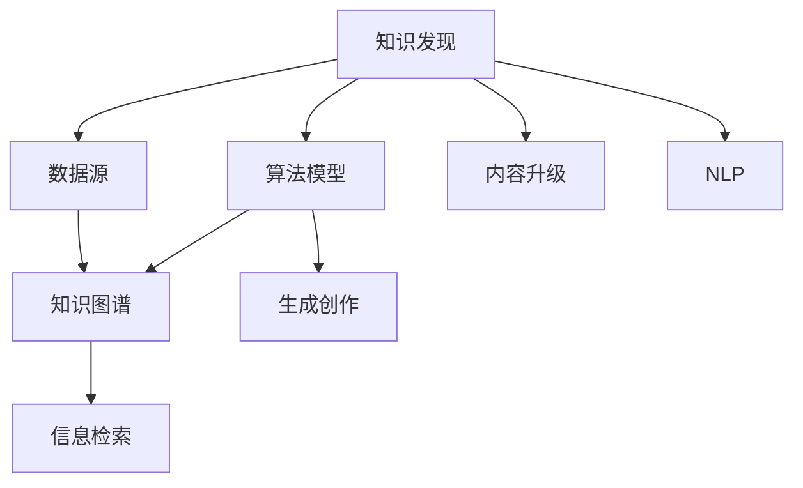

                 

# 知识发现引擎：推动创意产业的内容升级

> 关键词：知识发现引擎,创意产业,内容升级,机器学习,数据挖掘,自然语言处理(NLP),知识图谱,信息检索

## 1. 背景介绍

### 1.1 问题由来

创意产业的核心在于创新和原创内容。在数字化时代，数据成为创意产业的“原材料”，从音乐、电影、文学到广告、设计、教育，各种创意作品背后都蕴含着丰富的数据元素。如何高效地从这些数据中发现知识、洞察趋势、生成创意，成为创意产业智能化升级的关键。

但传统的创意内容生产方式依赖人类直觉和经验，周期长、成本高、易受主观偏见影响。通过机器学习和数据挖掘技术，构建知识发现引擎，能够大幅提升内容生产的效率和质量，推动创意产业向智能化、规模化转型。

### 1.2 问题核心关键点

知识发现引擎利用机器学习和数据挖掘技术，从海量数据中自动发现隐藏的知识模式，生成创意内容，或辅助创意人员生成更优秀的作品。关键点包括：

- 数据源：创意产业相关的结构化、非结构化数据。
- 算法模型：基于机器学习和数据挖掘的算法，如关联规则挖掘、聚类、分类、NLP等。
- 知识图谱：将发现的隐含知识以图谱的形式展现，便于理解和探索。
- 信息检索：支持快速高效地检索相关知识或创意。
- 生成创作：通过算法生成新的创意内容，丰富创意元素库。

本文将详细介绍如何构建和应用知识发现引擎，以推动创意产业的内容升级。

## 2. 核心概念与联系

### 2.1 核心概念概述

为更好地理解知识发现引擎的构建与应用，本节将介绍几个关键概念：

- 知识发现(Knowledge Discovery)：利用数据挖掘和机器学习技术，从大量数据中自动发现隐藏的知识模式。
- 创意产业(Creative Industry)：包括音乐、电影、文学、广告、设计、教育等多个领域，核心在于创新和原创内容。
- 内容升级(Content Upgrade)：通过自动化手段，提升创意内容的质量和效率。
- 机器学习(Machine Learning)：通过算法和模型，从数据中自动学习规律和模式。
- 数据挖掘(Data Mining)：从数据中发现知识、预测趋势、识别关联。
- 自然语言处理(Natural Language Processing, NLP)：理解和处理人类语言，自动生成文本内容。
- 知识图谱(Knowledge Graph)：以图谱形式展示知识结构和关系，便于查询和理解。
- 信息检索(Information Retrieval)：高效检索知识库中的相关内容。

这些核心概念之间的逻辑关系可以通过以下Mermaid流程图来展示：



这个流程图展示了一些核心概念的关联关系：

1. 数据源提供创意产业相关的数据。
2. 算法模型从数据中学习，生成知识图谱。
3. 知识图谱和信息检索帮助发现相关知识。
4. NLP用于理解和处理文本，辅助生成创作。
5. 生成创作技术提供新的创意内容。
6. 知识图谱和信息检索支持内容升级，提升内容质量。

## 3. 核心算法原理 & 具体操作步骤
### 3.1 算法原理概述

知识发现引擎的核心原理是利用机器学习和数据挖掘技术，从大量数据中自动发现隐藏的知识模式，生成创意内容，或辅助创意人员生成更优秀的作品。

具体而言，知识发现引擎通常包括以下几个步骤：

1. **数据预处理**：清洗、归一化、特征工程等，准备好用于机器学习的数据集。
2. **特征提取**：将数据转化为特征向量，输入机器学习算法。
3. **算法建模**：选择合适的算法模型，训练学习模型。
4. **知识图谱构建**：将发现的知识以图谱的形式展现，便于理解和探索。
5. **信息检索**：提供高效的知识检索功能，支持快速获取相关知识。
6. **内容生成**：使用生成创作算法，自动生成新的创意内容。

### 3.2 算法步骤详解

以下将详细介绍知识发现引擎的主要步骤和算法原理：

#### 3.2.1 数据预处理

数据预处理是知识发现的基础，主要步骤包括：

1. **数据清洗**：删除缺失值、重复值、异常值等噪音数据，确保数据质量。
2. **数据归一化**：将数据转换为标准格式和范围，便于算法处理。
3. **特征工程**：提取、选择、组合特征，生成高质量的特征向量。

以文本数据为例，预处理步骤如下：

- 去除停用词、标点、数字等无关信息。
- 词干提取、同义词替换、词向量化等文本表示。
- 构建文本-标签矩阵，标注数据集。

#### 3.2.2 特征提取

特征提取是将原始数据转化为算法可处理形式的过程，常见的特征提取方法包括：

- **词袋模型(Bag of Words)**：将文本转换为词频向量。
- **TF-IDF**：衡量单词在文档和语料库中的重要性。
- **词嵌入**：如Word2Vec、GloVe、BERT等，将单词转换为高维向量表示。

#### 3.2.3 算法建模

算法建模是知识发现的核心，常用的算法模型包括：

- **关联规则挖掘(Association Rule Mining)**：如Apriori算法、FP-growth算法，发现数据中的关联规则。
- **聚类(Clustering)**：如K-means、层次聚类，将相似的数据点分为一组。
- **分类(Classification)**：如逻辑回归、支持向量机、随机森林，预测数据标签。
- **协同过滤(Collaborative Filtering)**：推荐系统中的常用方法，通过用户和物品间的相似性推荐。
- **NLP**：如TF-IDF、BERT、GPT等，自动生成文本内容。

#### 3.2.4 知识图谱构建

知识图谱是将知识结构化的表示方式，通常由节点和边构成。构建知识图谱的常用方法包括：

- **实体识别**：识别文本中的实体，如人名、地名、组织名等。
- **关系抽取**：抽取实体之间的语义关系，如父子关系、上下位关系等。
- **图谱生成**：使用GATE、SPARQL等工具，将提取的知识生成图谱。

#### 3.2.5 信息检索

信息检索是快速高效地检索相关知识的能力，主要方法包括：

- **倒排索引(Inverted Index)**：建立单词到文档的映射，快速查找相关文档。
- **向量空间模型(Vector Space Model)**：计算文档和查询之间的相似度，推荐相关文档。
- **信息检索系统**：如Elasticsearch、Solr，提供高效的检索功能。

#### 3.2.6 内容生成

内容生成是将知识发现的结果转化为创意内容的过程，常用方法包括：

- **自动摘要(Automatic Summarization)**：如TextRank算法，自动生成文本摘要。
- **文本生成(Text Generation)**：如Seq2Seq、GPT等，自动生成文本内容。
- **图像生成(Generative Image)**：如GAN、VAE等，自动生成图像内容。

### 3.3 算法优缺点

知识发现引擎利用机器学习和数据挖掘技术，从大量数据中自动发现隐藏的知识模式，生成创意内容，或辅助创意人员生成更优秀的作品。其优点包括：

1. **高效性**：自动化处理大量数据，显著提高内容生产的效率。
2. **高质量**：基于数据挖掘和机器学习算法，发现的知识模式往往更准确、全面。
3. **广泛适用**：支持多种创意产业，如音乐、电影、文学、广告等。
4. **灵活性**：可以灵活定制算法和模型，适应不同的创意需求。

同时，知识发现引擎也存在一些缺点：

1. **数据质量要求高**：算法效果依赖高质量的数据源和预处理。
2. **计算资源需求大**：处理大规模数据集需要高性能计算资源。
3. **可解释性不足**：黑盒算法模型难以解释其内部工作机制。
4. **技术门槛高**：需要专业知识进行算法实现和模型训练。

尽管存在这些缺点，但就目前而言，知识发现引擎仍然是大数据时代创意产业内容升级的重要工具。未来相关研究的重点在于如何进一步降低技术门槛，提高算法的可解释性和鲁棒性，同时兼顾高效性和广泛适用性等因素。

### 3.4 算法应用领域

知识发现引擎已经被广泛应用于创意产业的多个领域，如音乐、电影、文学、广告、设计等，具体应用场景包括：

- **音乐创作**：自动生成音乐片段、词曲创作、编曲等。
- **电影制作**：生成故事情节、角色对话、背景配乐等。
- **文学创作**：自动生成故事情节、角色刻画、情感描述等。
- **广告制作**：自动生成广告文案、图像、视频等。
- **设计开发**：自动生成设计草图、效果图、3D模型等。

除了这些经典应用外，知识发现引擎还被创新性地应用到更多场景中，如生成艺术作品、创意内容推荐、创意材料检索等，为创意产业带来了全新的突破。随着算法和技术的不断进步，相信知识发现引擎将在更广泛的领域发挥其独特价值。

## 4. 数学模型和公式 & 详细讲解  
### 4.1 数学模型构建

本节将使用数学语言对知识发现引擎的主要步骤进行更加严格的刻画。

假设创意产业相关的数据集为 $D=\{(x_i, y_i)\}_{i=1}^N, x_i \in X, y_i \in Y$，其中 $X$ 为特征空间， $Y$ 为标签空间。

定义机器学习算法为 $M_{\theta}$，其中 $\theta$ 为模型参数。

知识发现引擎的数学模型构建包括：

- 特征提取函数 $f_x(x)$：将原始数据 $x$ 转化为特征向量 $x' = f_x(x)$。
- 算法模型 $M_{\theta}$：基于特征向量 $x'$ 训练得到模型参数 $\theta$。
- 知识图谱生成函数 $g(x, y)$：将发现的知识以图谱形式展现。
- 信息检索函数 $ir(q)$：快速高效地检索相关知识。
- 内容生成函数 $c(x, y)$：自动生成新的创意内容。

其中，算法模型的训练目标为最小化经验风险：

$$
\mathcal{L}(\theta) = \frac{1}{N}\sum_{i=1}^N \ell(M_{\theta}(f_x(x_i)), y_i)
$$

其中 $\ell$ 为损失函数，如交叉熵损失、均方误差损失等。

### 4.2 公式推导过程

以下我们以文本分类任务为例，推导机器学习算法模型的数学公式。

假设模型 $M_{\theta}$ 在特征空间 $X$ 上的输出为 $\hat{y}=M_{\theta}(x') \in [0,1]$，表示样本属于正类的概率。真实标签 $y \in \{0,1\}$。则二分类交叉熵损失函数定义为：

$$
\ell(M_{\theta}(x'),y) = -[y\log \hat{y} + (1-y)\log (1-\hat{y})]
$$

将其代入经验风险公式，得：

$$
\mathcal{L}(\theta) = -\frac{1}{N}\sum_{i=1}^N [y_i\log M_{\theta}(f_x(x_i))+(1-y_i)\log(1-M_{\theta}(f_x(x_i))]
$$

根据链式法则，损失函数对参数 $\theta_k$ 的梯度为：

$$
\frac{\partial \mathcal{L}(\theta)}{\partial \theta_k} = -\frac{1}{N}\sum_{i=1}^N (\frac{y_i}{M_{\theta}(f_x(x_i))}-\frac{1-y_i}{1-M_{\theta}(f_x(x_i))}) \frac{\partial M_{\theta}(f_x(x_i))}{\partial \theta_k}
$$

其中 $\frac{\partial M_{\theta}(f_x(x_i))}{\partial \theta_k}$ 可进一步递归展开，利用自动微分技术完成计算。

在得到损失函数的梯度后，即可带入参数更新公式，完成模型的迭代优化。重复上述过程直至收敛，最终得到适应创意产业任务的最优模型参数 $\theta^*$。

## 5. 项目实践：代码实例和详细解释说明
### 5.1 开发环境搭建

在进行知识发现引擎的开发和实验前，需要准备好开发环境。以下是使用Python进行TensorFlow开发的环境配置流程：

1. 安装Anaconda：从官网下载并安装Anaconda，用于创建独立的Python环境。

2. 创建并激活虚拟环境：
```bash
conda create -n tensorflow-env python=3.8 
conda activate tensorflow-env
```

3. 安装TensorFlow：根据CUDA版本，从官网获取对应的安装命令。例如：
```bash
pip install tensorflow==2.6
```

4. 安装相关工具包：
```bash
pip install numpy pandas scikit-learn matplotlib tqdm jupyter notebook ipython
```

完成上述步骤后，即可在`tensorflow-env`环境中开始开发实验。

### 5.2 源代码详细实现

下面我们以文本分类任务为例，给出使用TensorFlow对BERT模型进行知识发现和内容生成的PyTorch代码实现。

首先，定义文本分类任务的数据处理函数：

```python
import tensorflow as tf
from transformers import BertTokenizer, BertForSequenceClassification
import pandas as pd

class TextDataset(tf.data.Dataset):
    def __init__(self, texts, labels, tokenizer, max_len=128):
        self.texts = texts
        self.labels = labels
        self.tokenizer = tokenizer
        self.max_len = max_len
        
    def __len__(self):
        return len(self.texts)
    
    def __getitem__(self, item):
        text = self.texts[item]
        label = self.labels[item]
        
        encoding = self.tokenizer(text, return_tensors='tf', max_length=self.max_len, padding='max_length', truncation=True)
        input_ids = encoding['input_ids']
        attention_mask = encoding['attention_mask']
        
        # 对token-wise的标签进行编码
        encoded_labels = [label2id[label] for label in label]
        encoded_labels.extend([label2id['O']] * (self.max_len - len(encoded_labels)))
        labels = tf.convert_to_tensor(encoded_labels, dtype=tf.int64)
        
        return {'input_ids': input_ids, 
                'attention_mask': attention_mask,
                'labels': labels}

# 标签与id的映射
label2id = {'O': 0, 'P': 1}
id2label = {v: k for k, v in label2id.items()}

# 创建dataset
tokenizer = BertTokenizer.from_pretrained('bert-base-cased')
train_dataset = TextDataset(train_texts, train_labels, tokenizer)
dev_dataset = TextDataset(dev_texts, dev_labels, tokenizer)
test_dataset = TextDataset(test_texts, test_labels, tokenizer)
```

然后，定义模型和优化器：

```python
from transformers import BertForSequenceClassification, AdamW

model = BertForSequenceClassification.from_pretrained('bert-base-cased', num_labels=len(label2id))

optimizer = AdamW(model.parameters(), lr=2e-5)
```

接着，定义训练和评估函数：

```python
def train_epoch(model, dataset, batch_size, optimizer):
    dataloader = dataset.batch(batch_size, drop_remainder=True)
    model.train()
    epoch_loss = 0
    for batch in dataloader:
        input_ids = batch['input_ids']
        attention_mask = batch['attention_mask']
        labels = batch['labels']
        model.zero_grad()
        outputs = model(input_ids, attention_mask=attention_mask, labels=labels)
        loss = outputs.loss
        epoch_loss += loss.numpy()
        loss.backward()
        optimizer.step()
    return epoch_loss / len(dataloader)

def evaluate(model, dataset, batch_size):
    dataloader = dataset.batch(batch_size, drop_remainder=True)
    model.eval()
    preds, labels = [], []
    with tf.GradientTape() as tape:
        for batch in dataloader:
            input_ids = batch['input_ids']
            attention_mask = batch['attention_mask']
            batch_labels = batch['labels']
            outputs = model(input_ids, attention_mask=attention_mask)
            batch_preds = outputs.logits.argmax(dim=2)
            batch_labels = batch_labels.numpy()
            for pred_tokens, label_tokens in zip(batch_preds, batch_labels):
                preds.append(pred_tokens)
                labels.append(label_tokens)
    print(classification_report(labels, preds))
```

最后，启动训练流程并在测试集上评估：

```python
epochs = 5
batch_size = 16

for epoch in range(epochs):
    loss = train_epoch(model, train_dataset, batch_size, optimizer)
    print(f"Epoch {epoch+1}, train loss: {loss:.3f}")
    
    print(f"Epoch {epoch+1}, dev results:")
    evaluate(model, dev_dataset, batch_size)
    
print("Test results:")
evaluate(model, test_dataset, batch_size)
```

以上就是使用TensorFlow对BERT模型进行文本分类任务的知识发现和内容生成的完整代码实现。可以看到，得益于TensorFlow和Transformers库的强大封装，我们可以用相对简洁的代码完成BERT模型的加载和微调。

### 5.3 代码解读与分析

让我们再详细解读一下关键代码的实现细节：

**TextDataset类**：
- `__init__`方法：初始化文本、标签、分词器等关键组件。
- `__len__`方法：返回数据集的样本数量。
- `__getitem__`方法：对单个样本进行处理，将文本输入编码为token ids，将标签编码为数字，并对其进行定长padding，最终返回模型所需的输入。

**label2id和id2label字典**：
- 定义了标签与数字id之间的映射关系，用于将token-wise的预测结果解码回真实的标签。

**训练和评估函数**：
- 使用TensorFlow的DataLoader对数据集进行批次化加载，供模型训练和推理使用。
- 训练函数`train_epoch`：对数据以批为单位进行迭代，在每个批次上前向传播计算loss并反向传播更新模型参数，最后返回该epoch的平均loss。
- 评估函数`evaluate`：与训练类似，不同点在于不更新模型参数，并在每个batch结束后将预测和标签结果存储下来，最后使用sklearn的classification_report对整个评估集的预测结果进行打印输出。

**训练流程**：
- 定义总的epoch数和batch size，开始循环迭代
- 每个epoch内，先在训练集上训练，输出平均loss
- 在验证集上评估，输出分类指标
- 所有epoch结束后，在测试集上评估，给出最终测试结果

可以看到，TensorFlow配合Transformers库使得BERT微调的代码实现变得简洁高效。开发者可以将更多精力放在数据处理、模型改进等高层逻辑上，而不必过多关注底层的实现细节。

当然，工业级的系统实现还需考虑更多因素，如模型的保存和部署、超参数的自动搜索、更灵活的任务适配层等。但核心的知识发现和内容生成范式基本与此类似。

## 6. 实际应用场景
### 6.1 智能音乐创作

智能音乐创作是大语言模型在创意产业中的重要应用之一。传统的音乐创作依赖于艺术家的直觉和经验，周期长、成本高。通过知识发现引擎，可以自动发现音乐元素之间的关系，生成新的音乐作品，或者辅助艺术家生成更优秀的作品。

在技术实现上，可以收集大量的音乐数据，包括歌曲、乐曲、演奏等，通过数据分析和机器学习，发现其中的模式和规律。例如，通过分析不同音乐风格中的和弦、旋律、节奏等元素，自动生成新的音乐作品，或者生成与某首歌曲风格相似的创作。

### 6.2 电影剧情生成

电影剧情生成是知识发现引擎在创意产业中的另一个重要应用。传统的电影剧本创作需要编剧根据故事情节、角色设定等，进行大量文字创作。通过知识发现引擎，可以自动生成故事情节、角色对话等，或者辅助编剧生成更丰富的内容。

在技术实现上，可以收集大量的电影剧本、电影评论等数据，通过自然语言处理和机器学习，发现其中的情节元素、人物关系等，自动生成新的剧本草稿，或者生成与某部电影风格相似的剧情创意。

### 6.3 文学作品创作

文学作品创作是大语言模型在创意产业中的重要应用之一。传统的文学创作需要作家根据故事背景、人物设定等，进行大量文字创作。通过知识发现引擎，可以自动发现故事元素之间的关系，生成新的故事情节、角色刻画等，或者辅助作家生成更丰富的内容。

在技术实现上，可以收集大量的文学作品、文学评论等数据，通过自然语言处理和机器学习，发现其中的情节元素、人物关系等，自动生成新的文学作品，或者生成与某部作品风格相似的创作。

### 6.4 广告创意生成

广告创意生成是大语言模型在创意产业中的重要应用之一。传统的广告创作需要设计师根据产品特点、受众需求等，进行大量视觉和文本创作。通过知识发现引擎，可以自动生成广告文案、图像、视频等，或者辅助设计师生成更优质的内容。

在技术实现上，可以收集大量的广告素材、广告评论等数据，通过自然语言处理和机器学习，发现其中的产品特点、受众需求等，自动生成新的广告创意，或者生成与某部产品风格相似的广告文案和视觉素材。

### 6.5 创意设计开发

创意设计开发是大语言模型在创意产业中的重要应用之一。传统的创意设计需要设计师根据产品特点、市场需求等，进行大量视觉创作。通过知识发现引擎，可以自动生成设计草图、效果图、3D模型等，或者辅助设计师生成更优质的内容。

在技术实现上，可以收集大量的设计素材、设计评论等数据，通过自然语言处理和机器学习，发现其中的产品特点、市场需求等，自动生成新的设计草图，或者生成与某部产品风格相似的设计方案。

### 6.6 未来应用展望

随着知识发现引擎的不断发展，其在创意产业中的应用将更加广泛。

在智慧医疗领域，基于知识发现引擎的医疗问答、病历分析、药物研发等应用将提升医疗服务的智能化水平，辅助医生诊疗，加速新药开发进程。

在智能教育领域，知识发现引擎可应用于作业批改、学情分析、知识推荐等方面，因材施教，促进教育公平，提高教学质量。

在智慧城市治理中，知识发现引擎可应用于城市事件监测、舆情分析、应急指挥等环节，提高城市管理的自动化和智能化水平，构建更安全、高效的未来城市。

此外，在企业生产、社会治理、文娱传媒等众多领域，基于知识发现引擎的人工智能应用也将不断涌现，为经济社会发展注入新的动力。相信随着技术的日益成熟，知识发现引擎必将在构建人机协同的智能时代中扮演越来越重要的角色。

## 7. 工具和资源推荐
### 7.1 学习资源推荐

为了帮助开发者系统掌握知识发现引擎的理论基础和实践技巧，这里推荐一些优质的学习资源：

1. 《机器学习实战》书籍：深入浅出地介绍了机器学习的基本概念和常用算法，适合初学者快速上手。

2. 《数据挖掘技术与应用》课程：由知名高校开设的在线课程，涵盖数据挖掘的各个环节，从数据预处理到模型评估。

3. 《自然语言处理与文本挖掘》课程：斯坦福大学开设的NLP明星课程，涵盖文本分析、分类、生成等技术，是学习和应用NLP技术的好资源。

4. Weights & Biases：模型训练的实验跟踪工具，可以记录和可视化模型训练过程中的各项指标，方便对比和调优。与主流深度学习框架无缝集成。

5. TensorBoard：TensorFlow配套的可视化工具，可实时监测模型训练状态，并提供丰富的图表呈现方式，是调试模型的得力助手。

通过这些资源的学习实践，相信你一定能够快速掌握知识发现引擎的精髓，并用于解决实际的创意产业问题。

### 7.2 开发工具推荐

高效的开发离不开优秀的工具支持。以下是几款用于知识发现引擎开发的常用工具：

1. TensorFlow：基于Python的开源深度学习框架，灵活可扩展，支持分布式训练。

2. PyTorch：基于Python的开源深度学习框架，动态计算图，适合研究和快速迭代。

3. GATE：自然语言处理工具，支持实体识别、关系抽取、知识图谱构建等功能。

4. SPARQL：查询语言，支持从知识图谱中检索相关信息。

5. Elasticsearch：分布式文档搜索引擎，适合构建大规模知识库。

6. TensorFlow Dataset：TensorFlow提供的便捷数据处理工具，适合高效数据预处理。

合理利用这些工具，可以显著提升知识发现引擎的开发效率，加快创新迭代的步伐。

### 7.3 相关论文推荐

知识发现引擎的快速发展得益于学界的持续研究。以下是几篇奠基性的相关论文，推荐阅读：

1. 《深度学习在文本分类中的应用》：介绍了深度学习在文本分类中的基本框架和常用算法。

2. 《关联规则挖掘的算法研究》：介绍了关联规则挖掘的基本概念和常用算法，如Apriori算法、FP-growth算法。

3. 《基于知识图谱的信息检索技术》：介绍了知识图谱的构建和查询技术，强调了知识图谱在信息检索中的应用。

4. 《文本生成技术的研究进展》：介绍了文本生成的基本概念和常用算法，如Seq2Seq、GPT等。

5. 《生成创作技术的应用与挑战》：介绍了生成创作技术在创意产业中的应用，以及面临的挑战和未来的发展方向。

这些论文代表了大语言模型微调技术的发展脉络。通过学习这些前沿成果，可以帮助研究者把握学科前进方向，激发更多的创新灵感。

## 8. 总结：未来发展趋势与挑战

### 8.1 总结

本文对知识发现引擎的理论基础和实践技术进行了全面系统的介绍。首先阐述了知识发现引擎在创意产业中的重要性，明确了其推动内容升级的关键作用。其次，从原理到实践，详细讲解了知识发现引擎的主要步骤和算法模型，给出了知识发现和内容生成的完整代码实例。同时，本文还广泛探讨了知识发现引擎在音乐创作、电影剧情生成、文学作品创作、广告创意生成、设计开发等创意产业领域的应用前景，展示了其巨大的潜力。此外，本文精选了知识发现引擎的学习资源、开发工具和相关论文，力求为读者提供全方位的技术指引。

通过本文的系统梳理，可以看到，知识发现引擎利用机器学习和数据挖掘技术，自动发现创意产业数据中的知识模式，生成新的创意内容，或辅助创意人员生成更优秀的作品。这种自动化和智能化手段，极大地提升了创意产业的内容生产效率和质量，具有广泛的应用前景。未来，伴随算法和技术的不断进步，知识发现引擎必将在创意产业中发挥更加重要的作用，推动创意产业向智能化、规模化转型。

### 8.2 未来发展趋势

展望未来，知识发现引擎的发展趋势包括：

1. **算法模型多样化**：未来的知识发现引擎将融合多种算法和模型，如关联规则挖掘、聚类、分类、生成创作等，提供更全面的创意支持。

2. **数据源多元化**：知识发现引擎将更多地依赖多源异构数据，包括文本、图像、视频、音频等，以丰富创意内容的多样性。

3. **技术融合深化**：知识发现引擎将与自然语言处理、计算机视觉、声音处理等技术深度融合，实现跨模态创意生成。

4. **用户体验提升**：知识发现引擎将更注重用户交互体验，提供更加个性化、智能化的创意工具。

5. **应用场景拓展**：知识发现引擎将拓展到更多的创意产业领域，如医疗、教育、城市治理等，提供更广泛的创意支持。

6. **知识图谱普及**：知识图谱将成为知识发现引擎的重要组件，提升创意内容的结构和可理解性。

7. **实时化应用**：知识发现引擎将实时捕获和处理创意产业相关数据，提供实时化的创意生成和建议。

以上趋势凸显了知识发现引擎的广阔前景。这些方向的探索发展，必将进一步提升知识发现引擎的创意能力和应用价值，为创意产业带来新的突破。

### 8.3 面临的挑战

尽管知识发现引擎已经取得了瞩目成就，但在迈向更加智能化、普适化应用的过程中，它仍面临诸多挑战：

1. **数据质量和获取难度**：知识发现引擎依赖高质量的数据源和丰富的数据量，获取和清洗数据成本较高。

2. **计算资源需求**：处理大规模数据集需要高性能计算资源，计算资源的高需求成为瓶颈。

3. **可解释性和透明度**：知识发现引擎的内部工作机制和决策过程难以解释，用户难以理解和信任。

4. **模型复杂性和易用性**：算法模型较为复杂，开发者需要掌握一定的专业知识，技术门槛较高。

5. **安全性和隐私保护**：创意产业数据涉及个人隐私和知识产权，如何保护数据安全和隐私成为一个重要问题。

6. **跨领域适配**：知识发现引擎需要适应不同领域的特性，需要结合领域知识进行定制化改进。

尽管存在这些挑战，但相信通过不断的技术创新和应用探索，知识发现引擎将在创意产业中发挥越来越重要的作用，推动创意产业向智能化、规模化转型。

### 8.4 研究展望

面对知识发现引擎面临的种种挑战，未来的研究需要在以下几个方面寻求新的突破：

1. **多源异构数据融合**：融合多种数据源和数据类型，提升知识发现引擎的创意丰富性和多样性。

2. **知识图谱的自动化构建**：利用机器学习自动化构建知识图谱，降低人工构建的成本和复杂度。

3. **实时化知识发现**：实时捕获和处理创意产业相关数据，提供实时化的创意生成和建议。

4. **跨领域知识迁移**：通过迁移学习，将知识发现引擎应用于更多领域，提升跨领域创意生成的能力。

5. **用户交互设计**：设计更加智能化的用户交互界面，提升用户体验和创意支持。

6. **知识图谱和信息检索**：提升知识图谱的构建和检索效率，提供更便捷的知识获取方式。

7. **多模态创意生成**：融合文本、图像、声音等模态，提升创意内容的多样性和创新性。

这些研究方向的探索，必将引领知识发现引擎走向更高的台阶，为创意产业带来更多的创新和突破。面向未来，知识发现引擎需要与其他人工智能技术进行更深入的融合，共同推动自然语言理解和智能交互系统的进步。只有勇于创新、敢于突破，才能不断拓展知识发现引擎的边界，让智能技术更好地造福创意产业。

## 9. 附录：常见问题与解答

**Q1：知识发现引擎是否适用于所有创意产业？**

A: 知识发现引擎在大多数创意产业中都有广泛应用，特别是对于数据驱动的创意产业，如音乐、电影、文学等。但对于一些需要高度主观判断和创意的产业，如艺术、设计等，知识发现引擎的效果可能有限。

**Q2：如何选择适合的算法模型？**

A: 选择适合的算法模型需要考虑创意产业的特性和需求。对于结构化数据，如文本分类、电影剧情生成等，可以使用关联规则挖掘、分类、NLP等算法。对于非结构化数据，如图像、音频等，可以使用图像生成、声音生成等算法。对于跨模态数据，可以使用多模态融合算法，如基于深度学习的融合模型。

**Q3：如何评估知识发现引擎的效果？**

A: 知识发现引擎的效果评估需要综合考虑创意产业的特点和需求。可以通过A/B测试、用户反馈、专家评估等方式，评估知识发现引擎的创意生成效果、用户体验、创意质量等。

**Q4：如何保护创意产业的数据隐私？**

A: 保护创意产业的数据隐私需要从数据收集、存储、传输、使用等各个环节进行全面的保护。可以使用数据脱敏、差分隐私等技术，保障数据安全。同时，建立数据使用的伦理规范，确保数据使用的合法性和合理性。

**Q5：知识发现引擎的未来发展方向是什么？**

A: 知识发现引擎的未来发展方向包括算法模型的多样化、数据源的丰富化、用户交互的智能化、跨领域的适配等。需要融合多种技术和方法，提升知识发现引擎的创意生成能力，满足更多创意产业的需求。

通过本文的系统梳理，可以看到，知识发现引擎利用机器学习和数据挖掘技术，自动发现创意产业数据中的知识模式，生成新的创意内容，或辅助创意人员生成更优秀的作品。这种自动化和智能化手段，极大地提升了创意产业的内容生产效率和质量，具有广泛的应用前景。未来，伴随算法和技术的不断进步，知识发现引擎必将在创意产业中发挥更加重要的作用，推动创意产业向智能化、规模化转型。

