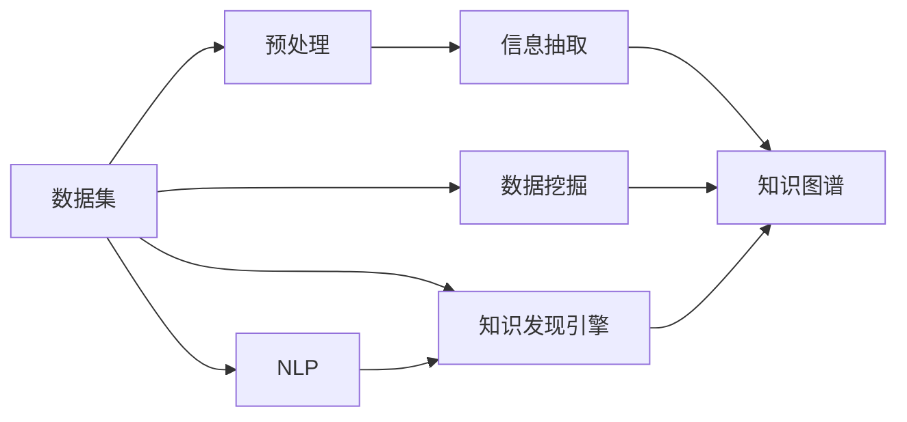

                 

# 知识发现引擎：知识创新的强大引擎

> 关键词：知识发现引擎, 知识创新, 知识图谱, 信息抽取, 数据挖掘, 深度学习, 自然语言处理

## 1. 背景介绍

在信息时代，数据的数量和质量日益增长，如何从海量数据中提取有用的知识，成为各行业关注的焦点。传统的数据分析方法已无法满足需求，需要引入更为智能和高效的工具。知识发现引擎(Knowledge Discovery Engine, KDE)作为一种新兴技术，正成为知识创新的强大引擎。本文将详细介绍知识发现引擎的核心概念与原理，通过实例代码实现，探讨其在实际应用场景中的广泛应用。

## 2. 核心概念与联系

### 2.1 核心概念概述

#### 2.1.1 知识发现引擎(KDE)

知识发现引擎，又称为数据挖掘工具，是一种用于自动化发现数据中潜在知识的软件系统。KDE能够自动分析大量数据，从中提取模式、规则、关联等有价值的信息，帮助用户进行数据理解、决策支持等。

#### 2.1.2 知识图谱(KG)

知识图谱是一种语义化的知识表示方法，通过节点和边的方式，将实体和关系存储在图结构中。知识图谱常用于构建大规模知识库，支持实体关系推理，辅助智能决策和推荐。

#### 2.1.3 信息抽取(Information Extraction, IE)

信息抽取是一种从非结构化数据中自动识别、抽取结构化信息的技术。常用于从文本、网页等数据源中提取出实体、属性、关系等结构化信息，构建知识图谱。

#### 2.1.4 数据挖掘(Data Mining, DM)

数据挖掘是从数据集中识别模式、关系和知识的过程。通常使用统计学、机器学习等方法，帮助用户从数据中提取有用信息，支持业务决策和优化。

#### 2.1.5 自然语言处理(Natural Language Processing, NLP)

自然语言处理是一种用于处理、理解和生成人类语言的技术。KDE通常需要处理大量的文本数据，NLP技术能够帮助其进行文本预处理、实体识别、关系抽取等，是知识发现的重要支撑。

这些核心概念之间的逻辑关系可以通过以下Mermaid流程图来展示：



此流程图展示了数据集在KDE的各个环节中的流向，以及知识图谱作为中间结果的重要性。

## 3. 核心算法原理 & 具体操作步骤
### 3.1 算法原理概述

知识发现引擎的运行一般遵循以下步骤：

1. **数据预处理**：对原始数据进行清洗、归一化、特征提取等预处理操作，使其适于后续分析和处理。
2. **特征抽取**：从预处理后的数据中抽取有意义的特征，如文本的TF-IDF特征、时间序列的周期性特征等。
3. **模型训练**：利用机器学习算法训练模型，如分类、聚类、回归等，挖掘数据中的潜在模式和关系。
4. **模式分析**：分析模型训练结果，识别数据中的有趣模式、规律和关联。
5. **结果验证**：对挖掘出的模式进行验证和评估，确保其准确性和可靠性。
6. **知识表示**：将挖掘出的模式和知识表示为结构化的形式，如知识图谱、规则库等。

### 3.2 算法步骤详解

#### 3.2.1 数据预处理

数据预处理是知识发现引擎的重要环节，直接影响后续分析的准确性。以下是数据预处理的主要步骤：

1. **数据清洗**：去除噪音、异常值和重复数据，提高数据质量。
2. **数据归一化**：将数据标准化，使之适用于机器学习算法的处理。
3. **特征提取**：从原始数据中提取有意义的特征，供后续分析和模型训练使用。

#### 3.2.2 特征抽取

特征抽取是从原始数据中提取有用信息的过程，常用于文本、图像、时间序列等数据的处理。以下是常见的特征抽取方法：

1. **文本特征抽取**：使用TF-IDF、词向量等方法提取文本特征，如文档的TF-IDF向量、词向量的平均长度等。
2. **图像特征抽取**：使用HOG、SIFT、CNN等方法提取图像特征，如局部特征点、特征向量的长度等。
3. **时间序列特征抽取**：使用周期性特征提取、滑动窗口等方法提取时间序列特征，如数据的时序性、周期性等。

#### 3.2.3 模型训练

模型训练是知识发现引擎的核心环节，通过训练机器学习模型，挖掘数据中的潜在模式和关系。以下是常见的机器学习算法：

1. **分类算法**：如逻辑回归、支持向量机、随机森林等，用于分类和预测。
2. **聚类算法**：如K-Means、层次聚类等，用于发现数据中的集群和分组。
3. **回归算法**：如线性回归、决策树回归等，用于预测数值型数据。

#### 3.2.4 模式分析

模式分析是知识发现引擎的重要步骤，通过分析模型训练结果，识别数据中的有趣模式、规律和关联。以下是常见的模式分析方法：

1. **关联规则挖掘**：如Apriori算法、FP-Growth算法，用于发现数据中的频繁项集和关联规则。
2. **序列模式挖掘**：如FP-Tree算法、GSP算法，用于发现数据中的序列模式和周期性。
3. **网络分析**：如社区发现算法、图分析算法，用于发现数据中的关系网络和节点间的关系。

#### 3.2.5 结果验证

结果验证是知识发现引擎的必要步骤，用于评估挖掘出的模式的准确性和可靠性。以下是常见的验证方法：

1. **交叉验证**：将数据集划分为训练集和测试集，通过交叉验证评估模型的泛化能力。
2. **模型评估**：使用各种评估指标，如准确率、召回率、F1-score等，评估模型的性能。
3. **敏感性分析**：通过改变数据集中的某些参数，评估挖掘结果的鲁棒性和稳定性。

#### 3.2.6 知识表示

知识表示是将挖掘出的模式和知识表示为结构化的形式，如知识图谱、规则库等。以下是常见的知识表示方法：

1. **知识图谱**：使用图结构表示实体和关系，如Neo4j、RDF等。
2. **规则库**：使用规则表示知识，如IF-THEN规则、DRL库等。
3. **语义网**：使用OWL、RDFS等语义标记语言表示知识，支持语义推理和查询。

### 3.3 算法优缺点

知识发现引擎具有以下优点：

1. **自动化程度高**：通过自动化的数据处理和分析，大大提高了数据处理的效率。
2. **模式发现能力强**：能够从大量数据中发现潜在的模式和规律，支持数据驱动的决策。
3. **可解释性强**：挖掘出的模式和知识通常具有较高的可解释性，方便用户理解和使用。

但同时，知识发现引擎也存在一些缺点：

1. **依赖数据质量**：数据质量直接影响挖掘结果的准确性，需要大量高质量数据。
2. **模型选择困难**：不同的数据集和任务需要选择不同的模型，选择不当可能导致挖掘结果不准确。
3. **解释性有限**：某些复杂的模式和知识难以解释，用户难以理解其背后的逻辑。

### 3.4 算法应用领域

知识发现引擎在多个领域中得到了广泛应用，以下是几个典型的应用场景：

1. **金融风险管理**：用于分析金融交易数据，挖掘潜在的风险模式，支持风险预警和控制。
2. **医疗诊断**：用于分析医疗数据，挖掘潜在的疾病关联和风险因素，支持早期诊断和个性化治疗。
3. **零售客户分析**：用于分析客户行为数据，挖掘潜在的消费模式和偏好，支持客户细分和个性化推荐。
4. **供应链优化**：用于分析供应链数据，挖掘潜在的供应链瓶颈和优化方案，支持供应链管理。
5. **社交媒体分析**：用于分析社交媒体数据，挖掘潜在的舆情趋势和用户行为模式，支持舆情监控和用户管理。

## 4. 数学模型和公式 & 详细讲解 & 举例说明
### 4.1 数学模型构建

知识发现引擎的数学模型通常包括以下几个关键组件：

1. **数据集**：表示为$D=\{(x_i, y_i)\}_{i=1}^N$，其中$x_i$为特征向量，$y_i$为标签向量。
2. **模型**：表示为$f(x)$，用于预测标签$y$。
3. **损失函数**：表示为$\mathcal{L}(f, D)$，用于评估模型预测的准确性。
4. **优化算法**：表示为$Optimizer$，用于优化模型参数$\theta$，最小化损失函数。

### 4.2 公式推导过程

以二分类任务为例，假设数据集$D=\{(x_i, y_i)\}_{i=1}^N$，其中$x_i$为特征向量，$y_i$为标签向量（0或1）。模型$f(x)$为逻辑回归模型，输出为预测概率$p$，即：

$$
f(x) = \frac{1}{1+e^{-\theta^T x}} = \frac{1}{1+e^{-W^T x - b}}
$$

其中$\theta = [W^T, b]$为模型参数。标签$y$与预测概率$p$的关系为：

$$
y \sim Bernoulli(p)
$$

则二分类任务的交叉熵损失函数为：

$$
\mathcal{L}(f, D) = -\frac{1}{N}\sum_{i=1}^N y_i \log p_i + (1-y_i) \log (1-p_i)
$$

优化目标为最小化损失函数，即：

$$
\min_{\theta} \mathcal{L}(f, D)
$$

常见的优化算法包括梯度下降、随机梯度下降、Adam等。以梯度下降为例，其更新公式为：

$$
\theta \leftarrow \theta - \eta \nabla_{\theta}\mathcal{L}(\theta)
$$

其中$\eta$为学习率，$\nabla_{\theta}\mathcal{L}(\theta)$为损失函数对模型参数的梯度。

### 4.3 案例分析与讲解

#### 4.3.1 文本分类任务

以文本分类任务为例，假设数据集$D=\{(x_i, y_i)\}_{i=1}^N$，其中$x_i$为文本向量，$y_i$为分类标签。使用逻辑回归模型$f(x)$，输出预测概率$p$：

$$
f(x) = \frac{1}{1+e^{-\theta^T x}} = \frac{1}{1+e^{-W^T x - b}}
$$

其中$x_i$表示为TF-IDF向量，$y_i$表示为类别标签（如0、1等）。损失函数为交叉熵损失：

$$
\mathcal{L}(f, D) = -\frac{1}{N}\sum_{i=1}^N y_i \log p_i + (1-y_i) \log (1-p_i)
$$

使用梯度下降算法进行模型训练，更新公式为：

$$
\theta \leftarrow \theta - \eta \nabla_{\theta}\mathcal{L}(\theta)
$$

其中$\eta$为学习率，$\nabla_{\theta}\mathcal{L}(\theta)$为损失函数对模型参数的梯度。

## 5. 项目实践：代码实例和详细解释说明
### 5.1 开发环境搭建

在Python环境中搭建知识发现引擎开发环境，需安装以下依赖：

1. **Python环境**：安装Python 3.7及以上版本。
2. **NumPy**：用于数组操作，支持Python的多维数据处理。
3. **Pandas**：用于数据处理，支持表格数据的读写和分析。
4. **Scikit-learn**：提供多种机器学习算法，支持数据挖掘任务。
5. **Matplotlib**：用于数据可视化，支持绘制图表。
6. **Jupyter Notebook**：用于开发和调试，支持代码块和数据交互。

使用Anaconda创建Python虚拟环境，并激活该环境：

```bash
conda create -n kde-env python=3.7
conda activate kde-env
```

安装依赖包：

```bash
pip install numpy pandas scikit-learn matplotlib jupyter notebook
```

### 5.2 源代码详细实现

以下是一个简单的文本分类任务实现，使用Scikit-learn库中的逻辑回归算法：

```python
import numpy as np
import pandas as pd
from sklearn.feature_extraction.text import CountVectorizer
from sklearn.linear_model import LogisticRegression
from sklearn.metrics import accuracy_score
from sklearn.model_selection import train_test_split

# 加载数据集
data = pd.read_csv('text_data.csv')

# 特征提取
vectorizer = CountVectorizer()
X = vectorizer.fit_transform(data['text'])
y = data['label']

# 划分数据集
X_train, X_test, y_train, y_test = train_test_split(X, y, test_size=0.2, random_state=42)

# 训练模型
model = LogisticRegression()
model.fit(X_train, y_train)

# 预测并评估
y_pred = model.predict(X_test)
accuracy = accuracy_score(y_test, y_pred)
print('Accuracy:', accuracy)
```

### 5.3 代码解读与分析

#### 5.3.1 数据加载

使用Pandas库读取文本数据集，将其存储为DataFrame对象：

```python
data = pd.read_csv('text_data.csv')
```

#### 5.3.2 特征提取

使用CountVectorizer进行特征提取，将文本转换为TF-IDF向量：

```python
vectorizer = CountVectorizer()
X = vectorizer.fit_transform(data['text'])
```

#### 5.3.3 数据划分

使用train_test_split将数据集划分为训练集和测试集：

```python
X_train, X_test, y_train, y_test = train_test_split(X, y, test_size=0.2, random_state=42)
```

#### 5.3.4 模型训练

使用Scikit-learn的LogisticRegression模型进行训练：

```python
model = LogisticRegression()
model.fit(X_train, y_train)
```

#### 5.3.5 模型评估

使用accuracy_score计算模型在测试集上的准确率：

```python
y_pred = model.predict(X_test)
accuracy = accuracy_score(y_test, y_pred)
print('Accuracy:', accuracy)
```

## 6. 实际应用场景
### 6.1 金融风险管理

金融风险管理是知识发现引擎的重要应用场景之一。通过分析历史交易数据，挖掘潜在的风险模式，支持风险预警和控制。以下是一个简单的金融风险管理案例：

假设有一家金融公司，每天记录客户交易数据，包含交易金额、时间、客户ID等信息。使用知识发现引擎，挖掘潜在的风险交易模式，支持风险预警和控制。具体步骤如下：

1. **数据清洗**：去除异常值和重复数据，保证数据质量。
2. **特征提取**：提取交易金额、时间、客户ID等特征，构建特征向量。
3. **模型训练**：使用分类算法（如逻辑回归、决策树等）训练模型，挖掘潜在的风险交易模式。
4. **模式分析**：分析模型训练结果，识别潜在的风险交易模式。
5. **结果验证**：通过交叉验证和模型评估，确保挖掘结果的准确性和可靠性。
6. **风险预警**：根据挖掘出的风险模式，实时监控客户交易行为，及时预警潜在的风险交易。

### 6.2 医疗诊断

医疗诊断是知识发现引擎的另一个重要应用场景。通过分析患者的病历数据，挖掘潜在的疾病关联和风险因素，支持早期诊断和个性化治疗。以下是一个简单的医疗诊断案例：

假设有一家医院，每天记录患者的病历数据，包含症状、检查结果、治疗记录等信息。使用知识发现引擎，挖掘潜在的疾病关联和风险因素，支持早期诊断和个性化治疗。具体步骤如下：

1. **数据清洗**：去除异常值和重复数据，保证数据质量。
2. **特征提取**：提取症状、检查结果、治疗记录等特征，构建特征向量。
3. **模型训练**：使用分类算法（如逻辑回归、随机森林等）训练模型，挖掘潜在的疾病关联和风险因素。
4. **模式分析**：分析模型训练结果，识别潜在的疾病关联和风险因素。
5. **结果验证**：通过交叉验证和模型评估，确保挖掘结果的准确性和可靠性。
6. **早期诊断**：根据挖掘出的疾病关联和风险因素，实时监控患者症状，及时预警潜在的疾病风险。

## 7. 工具和资源推荐
### 7.1 学习资源推荐

以下是一些推荐的学习资源，有助于深入理解知识发现引擎的核心概念和技术：

1. 《数据挖掘：概念与技术》（Pattern Recognition and Machine Learning）：该书是数据挖掘领域的经典教材，涵盖多种数据挖掘算法和应用。
2. 《Python数据科学手册》（Python Data Science Handbook）：该书介绍Python在数据科学和机器学习中的应用，包括数据处理、特征工程、模型训练等。
3. Coursera上的数据科学课程（Data Science Specialization）：由约翰霍普金斯大学提供，涵盖数据清洗、特征提取、模型训练等。
4. Kaggle上的数据挖掘竞赛：通过参加Kaggle竞赛，实践数据挖掘和机器学习的技能，提升实战能力。

### 7.2 开发工具推荐

以下是一些推荐的开发工具，支持知识发现引擎的开发和调试：

1. Jupyter Notebook：支持代码块和数据交互，方便开发和调试。
2. Anaconda：提供Python环境和依赖管理，方便版本管理和依赖安装。
3. PyCharm：提供代码高亮、调试、自动补全等特性，提升开发效率。
4. TensorBoard：支持可视化模型训练过程，便于调试和优化。

### 7.3 相关论文推荐

以下是几篇推荐的相关论文，提供深入的理论和实践知识：

1. 《Google Scholar: A Search Engine for Mining the Semantic Web》（Bolukbasi et al., 2013）：介绍如何使用知识图谱进行实体关系抽取和信息抽取。
2. 《A Knowledge Graph for High-Performance Recommendations》（Bilias et al., 2018）：介绍如何使用知识图谱进行推荐系统。
3. 《A Survey on Multi-view Data Mining》（Kim et al., 2015）：介绍多视图数据挖掘技术，如文本、图像、时间序列等。

## 8. 总结：未来发展趋势与挑战
### 8.1 研究成果总结

知识发现引擎作为数据驱动的重要工具，已在多个领域得到了广泛应用，显著提升了数据处理的效率和决策支持的准确性。其主要成果包括：

1. **自动化数据处理**：通过自动化数据清洗、特征提取等，大大提升了数据处理的效率和准确性。
2. **模式发现能力**：通过挖掘数据中的潜在模式和关系，支持数据驱动的决策。
3. **可解释性强**：挖掘出的模式和知识通常具有较高的可解释性，方便用户理解和使用。

### 8.2 未来发展趋势

展望未来，知识发现引擎将呈现以下几个发展趋势：

1. **自动化程度提升**：通过更智能的数据处理和分析，进一步提升数据处理的效率和精度。
2. **模型多样化**：引入更多智能模型，如深度学习、强化学习等，提升数据挖掘的深度和广度。
3. **跨领域融合**：与其他AI技术（如自然语言处理、计算机视觉等）进行深度融合，支持多模态数据挖掘。
4. **可解释性增强**：通过可解释性分析、可视化等手段，增强知识发现引擎的透明性和可信度。
5. **实时化应用**：通过实时数据流处理，支持实时分析和决策支持，提升业务响应速度。

### 8.3 面临的挑战

尽管知识发现引擎已取得了显著进展，但在实际应用中仍面临以下挑战：

1. **数据质量问题**：数据质量直接影响挖掘结果的准确性，需要大量高质量数据。
2. **模型选择困难**：不同的数据集和任务需要选择不同的模型，选择不当可能导致挖掘结果不准确。
3. **解释性有限**：某些复杂的模式和知识难以解释，用户难以理解其背后的逻辑。
4. **计算资源消耗大**：数据挖掘和模型训练需要大量的计算资源，对硬件设备要求较高。

### 8.4 研究展望

未来的研究需要在以下几个方面进行突破：

1. **数据增强技术**：通过数据增强、合成数据等技术，提升数据质量和挖掘效果。
2. **多模态数据融合**：通过跨模态数据融合技术，提升多模态数据的挖掘效果。
3. **解释性增强**：通过可解释性分析、可视化等手段，增强知识发现引擎的透明性和可信度。
4. **实时化应用**：通过实时数据流处理，支持实时分析和决策支持，提升业务响应速度。

## 9. 附录：常见问题与解答

### 9.1 常见问题

**Q1：知识发现引擎与传统数据分析有何不同？**

A: 知识发现引擎通过自动化数据分析，从大量数据中挖掘出潜在的模式和关系，支持数据驱动的决策。而传统数据分析需要人工介入，效率较低，且容易受主观因素影响。

**Q2：如何选择适合的知识发现引擎算法？**

A: 选择知识发现引擎算法需要考虑多个因素，如数据类型、任务目标、模型复杂度等。常见算法包括分类、聚类、回归等，具体选择需根据实际情况进行评估。

**Q3：知识图谱在知识发现中起什么作用？**

A: 知识图谱通过语义化的方式表示实体和关系，支持实体关系推理，提升知识发现引擎的智能性。在医疗、金融等应用中，知识图谱可以提供更丰富的背景知识和关联信息，支持深度挖掘。

**Q4：知识发现引擎在实际应用中存在哪些瓶颈？**

A: 数据质量、模型选择、解释性等问题是知识发现引擎在实际应用中面临的主要瓶颈。需要从数据预处理、模型优化、结果解释等多个环节进行全面优化，才能充分发挥其潜力。

**Q5：知识发现引擎在多模态数据挖掘中面临哪些挑战？**

A: 多模态数据融合、特征提取、跨模态模型训练等是知识发现引擎在多模态数据挖掘中面临的主要挑战。需要引入更多跨模态数据融合技术，提升多模态数据的挖掘效果。

通过以上对知识发现引擎的详细介绍和代码实践，相信你对这一新兴技术有了更深入的理解。希望本文能为你提供有价值的参考，推动知识发现引擎在更多领域的应用和发展。

---

作者：禅与计算机程序设计艺术 / Zen and the Art of Computer Programming

