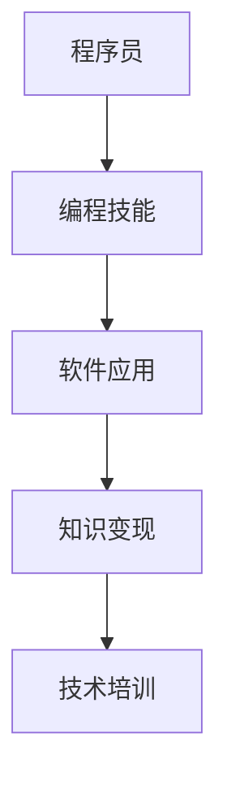

                 

# 知识变现：程序员的第二职业

## 1. 背景介绍

### 1.1 问题由来
在现代信息技术迅猛发展的时代，程序员作为软件技术和数字创新的关键推动者，面临着前所未有的机遇与挑战。尽管主业收入已相对稳定，但技术日新月异、行业快速迭代，要求程序员持续学习和创新。为了应对这些挑战，越来越多的程序员开始探索除了本职工作之外的第二职业。

### 1.2 问题核心关键点
在众多第二职业中，程序员通过知识变现是其中最具发展潜力和现实意义的途径之一。利用自身的编程技能和专业知识，开发出具备实用价值的应用，不仅能够带来额外的收入，还能提升自身的影响力和专业性。本文将详细探讨程序员如何进行知识变现，并讨论其核心概念与联系。

## 2. 核心概念与联系

### 2.1 核心概念概述

为更好地理解程序员如何进行知识变现，本节将介绍几个核心概念：

- **程序员**：指掌握计算机编程技能、从事软件开发工作的人员，通常具备解决问题的技术思维和实践能力。
- **编程技能**：包括但不限于算法设计、代码实现、数据结构、系统设计等方面的知识。
- **知识变现**：指将个人所掌握的知识、技能和经验转化为经济收益的过程，包括编写软件应用、提供咨询服务、参加技术培训等多种形式。
- **软件应用**：指为解决特定问题或满足特定需求而开发的软件系统或工具，可以是商业产品，也可以是开源项目。
- **技术培训**：指通过线上或线下方式，向他人传授编程知识和技能的课程或工作坊。

这些核心概念之间的逻辑关系可以通过以下Mermaid流程图来展示：



这个流程图展示出程序员如何通过编程技能开发出软件应用，实现知识变现；同时，通过技术培训分享知识，进一步提升自身价值。

## 3. 核心算法原理 & 具体操作步骤

### 3.1 算法原理概述

程序员通过知识变现，本质上是一种技能转化为商业价值的过程。该过程包括软件开发、应用发布、用户获取和收益实现等多个环节。核心算法原理包括但不限于软件开发流程、项目管理、市场营销等，其具体实现涉及多个技术和方法。

### 3.2 算法步骤详解

程序员进行知识变现的核心步骤包括：

1. **需求分析**：明确软件应用的解决目标和功能需求。
2. **系统设计**：设计软件架构和模块划分，规划技术选型。
3. **编码实现**：根据设计文档进行代码编写和测试。
4. **发布上线**：部署应用至服务器，并进行推广宣传。
5. **用户运营**：维护用户反馈，持续改进产品功能。
6. **收益实现**：根据应用模式收取费用，如订阅费、广告费、交易抽成等。

### 3.3 算法优缺点

知识变现的优势主要体现在：
1. 自主创业：程序员可以利用自己的技术优势，自主创业，自由度高。
2. 多渠道收益：除了直接销售软件，还可以通过广告、订阅、数据服务等多种渠道实现收益。
3. 技能提升：开发过程中需要不断学习和实践，有助于提升技术能力和市场敏锐度。

但该方法也存在一定的缺点：
1. 市场风险：软件市场需求变化快，失败的风险较高。
2. 技术壁垒：高技术门槛可能限制市场推广和用户获取。
3. 法律风险：涉及版权、隐私、数据安全等问题，可能面临法律风险。

### 3.4 算法应用领域

知识变现的应用领域非常广泛，包括但不限于：

1. **企业内部应用**：为公司提供定制开发软件，提升内部效率和业务流程。
2. **SaaS应用**：提供云端软件服务，按需计费，如项目管理工具、设计自动化工具等。
3. **开源项目**：通过开源社区发布工具或框架，积累社区资源，吸引用户支持。
4. **咨询服务**：提供技术咨询、解决方案开发等服务，帮助企业解决问题。
5. **教育培训**：通过线上课程、线下讲座等方式传授编程知识和技能。

## 4. 数学模型和公式 & 详细讲解 & 举例说明

### 4.1 数学模型构建

知识变现的数学模型可以基于用户获取和收益增长的框架构建。假设软件应用的用户增长率为 $r$，市场覆盖率为 $C$，每用户平均收益为 $A$，则软件应用的总收益 $R$ 可以表示为：

$$
R = C \times A \times (1 + r)^t
$$

其中 $t$ 为时间变量，$t=1$ 表示应用刚刚上线。

### 4.2 公式推导过程

为了最大化收益 $R$，我们需要分析不同因素对用户增长率 $r$、市场覆盖率 $C$ 和每用户平均收益 $A$ 的影响。

首先，市场覆盖率 $C$ 受到广告投放、社区推广、用户口碑等多种因素影响。假设广告费用为 $B$，则有：

$$
C = f(B)
$$

其中 $f$ 为市场覆盖率与广告费用的关系函数。

其次，每用户平均收益 $A$ 取决于用户订阅率、广告点击率、付费转化率等指标。假设订阅率、广告点击率和付费转化率分别为 $P_1, P_2, P_3$，则有：

$$
A = P_1 \times P_2 \times P_3 \times P_0
$$

其中 $P_0$ 为初始基准收益。

最后，用户增长率 $r$ 通常受到新功能发布、技术优化、市场策略变化等多种因素影响，可以表示为：

$$
r = g(P_1, P_2, P_3, \cdots)
$$

其中 $g$ 为用户增长率与多种指标的关系函数。

### 4.3 案例分析与讲解

以在线编程教育平台为例，分析其用户增长和收益增长情况。假设平台每月广告费用为 $B$，订阅率为 $P_1$，广告点击率为 $P_2$，付费转化率为 $P_3$。则市场覆盖率 $C$ 和每用户平均收益 $A$ 分别为：

$$
C = f(B)
$$
$$
A = P_1 \times P_2 \times P_3 \times P_0
$$

用户增长率 $r$ 受到课程内容更新、教师互动、学生评价等因素影响，可以表示为：

$$
r = g(P_1, P_2, P_3, \cdots)
$$

将上述公式代入总收益公式，可以得到：

$$
R = C \times A \times (1 + r)^t
$$

通过优化 $P_1, P_2, P_3$ 和 $B$，可以最大化总收益 $R$。例如，平台可以在初期通过增加广告费用和课程更新频率，提升市场覆盖率和用户增长率，待用户基础稳定后再优化广告投放策略和课程内容，进一步提高收益。

## 5. 项目实践：代码实例和详细解释说明

### 5.1 开发环境搭建

要进行知识变现，首先需要搭建开发环境，便于快速迭代和测试。以下是常用的开发环境搭建流程：

1. 安装Python：下载最新版本的Python，并添加到系统环境变量。
2. 安装开发工具：安装Visual Studio Code、PyCharm等IDE，配置编辑器和调试器。
3. 安装版本控制工具：安装Git，并配置远程仓库。
4. 安装依赖管理工具：安装Pip，使用虚拟环境管理依赖库。
5. 安装测试工具：安装unittest、pytest等单元测试框架，自动化测试代码。

### 5.2 源代码详细实现

以下是一个简单的在线编程教育平台开发实例：

```python
from flask import Flask, request
from flask_sqlalchemy import SQLAlchemy

app = Flask(__name__)
app.config['SQLALCHEMY_DATABASE_URI'] = 'sqlite:////tmp/test.db'
db = SQLAlchemy(app)

class User(db.Model):
    id = db.Column(db.Integer, primary_key=True)
    name = db.Column(db.String(80), nullable=False)
    email = db.Column(db.String(120), unique=True, nullable=False)

class Course(db.Model):
    id = db.Column(db.Integer, primary_key=True)
    name = db.Column(db.String(120), nullable=False)
    instructor = db.Column(db.String(80), nullable=False)
    content = db.Column(db.Text, nullable=False)

@app.route('/users', methods=['POST'])
def create_user():
    data = request.get_json()
    user = User(name=data['name'], email=data['email'])
    db.session.add(user)
    db.session.commit()
    return 'User created successfully'

@app.route('/courses', methods=['POST'])
def create_course():
    data = request.get_json()
    course = Course(name=data['name'], instructor=data['instructor'], content=data['content'])
    db.session.add(course)
    db.session.commit()
    return 'Course created successfully'

if __name__ == '__main__':
    app.run(debug=True)
```

### 5.3 代码解读与分析

这个例子展示了如何使用Flask框架和SQLAlchemy库开发一个简单的在线编程教育平台的后端逻辑。主要实现包括用户注册、课程创建等功能，使用SQLite作为数据存储。

- `User` 模型表示用户信息，包括姓名和邮箱。
- `Course` 模型表示课程信息，包括课程名、讲师名和课程内容。
- `create_user` 函数用于创建新用户，`create_course` 函数用于创建新课程。
- `app.run(debug=True)` 启动Flask应用，进入调试模式。

## 6. 实际应用场景

### 6.1 在线教育平台

在线编程教育平台是程序员进行知识变现的主要形式之一。通过开发在线课程、提供在线编程环境和社区支持，程序员能够帮助学习者系统地掌握编程知识和技能，从而获取稳定收入。

### 6.2 软件咨询服务

程序员可以通过提供软件开发咨询、方案设计和项目管理等服务，帮助企业提升技术实力和管理水平。例如，为企业提供定制开发解决方案，进行系统架构设计，或提供软件质量保证等。

### 6.3 开源项目和工具

程序员可以通过开发和维护开源项目和工具，积累社区资源，吸引用户支持和资金投入。例如，开发常用的编程工具、数据分析库、游戏引擎等。

### 6.4 技术培训

程序员可以开设线上或线下的技术培训课程，传授编程知识和技能，培养新程序员，提升自身影响力。例如，开设Python、Java、Web开发等课程，或开设特定技术的深入学习班。

## 7. 工具和资源推荐

### 7.1 学习资源推荐

1. **《Python编程：从入门到实践》**：由Eric Matthes编写，涵盖Python基础和高级编程技巧，适合初学者和进阶者。
2. **《软件测试：持续质量改进的实践》**：由Grady Booch、Robert L. Nord和William W. Palacy编写，全面介绍软件测试的原理和实践方法。
3. **Coursera和Udemy**：在线学习平台，提供丰富的编程和软件开发课程。
4. **GitHub**：代码托管平台，存储和分享开源项目。
5. **Stack Overflow**：程序员社区，提供技术问答和讨论。

### 7.2 开发工具推荐

1. **Visual Studio Code**：轻量级、功能强大的编辑器，支持多种编程语言。
2. **PyCharm**：专业的Python IDE，提供代码自动补全、调试和测试功能。
3. **Docker**：容器化工具，便于应用部署和管理。
4. **Git**：版本控制工具，支持代码协作和版本管理。
5. **GitHub Actions**：自动化工作流平台，支持持续集成和持续部署。

### 7.3 相关论文推荐

1. **《程序员的进化：从单一技能到多领域全面发展》**：探讨程序员如何通过技能扩展和跨领域学习，提升自身市场竞争力。
2. **《软件开发的可持续性：持续学习和自我提升的策略》**：分析程序员如何在技术迭代快速的环境下，保持持续学习和适应能力。
3. **《在线编程教育的创新：利用技术提升学习效果》**：探讨在线编程教育的教学模式和平台建设，提升教学效果和学习体验。

## 8. 总结：未来发展趋势与挑战

### 8.1 总结

本文对程序员如何进行知识变现进行了系统介绍。首先，探讨了知识变现的核心概念和联系，明确了程序员利用编程技能实现商业价值的过程。其次，从算法原理和具体操作步骤两个方面，详细讲解了知识变现的实现方法。同时，通过数学模型和案例分析，展示了知识变现的数学推导和实际应用。最后，列举了多个实际应用场景，并推荐了相关的学习资源、开发工具和论文。

通过本文的系统梳理，可以看到，知识变现不仅是程序员的额外收入来源，更是提升自身技术能力、增强市场竞争力的重要途径。未来，伴随着技术的发展和市场的变化，知识变现将呈现出更多新的形态和可能性。

### 8.2 未来发展趋势

未来知识变现的趋势主要体现在以下几个方面：

1. **跨领域技能融合**：程序员需要具备跨领域技能，如数据分析、人工智能、区块链等，以适应技术融合带来的新挑战。
2. **知识平台化**：通过知识平台化，程序员可以将知识与市场高效连接，提升知识变现的规模和效率。
3. **虚拟现实和增强现实**：利用VR/AR技术，开发沉浸式编程教育和培训系统，提升学习体验。
4. **物联网和边缘计算**：开发基于IoT和边缘计算的编程应用，提升设备自动化和智能化水平。
5. **人工智能和大数据**：结合AI和大数据技术，开发智能决策系统和数据分析平台，提升企业运营效率。

### 8.3 面临的挑战

尽管知识变现具有广阔的前景，但在实际应用中也面临诸多挑战：

1. **技术更新迅速**：编程技术和市场需求快速变化，要求程序员不断学习和适应新知识。
2. **市场竞争激烈**：程序员面临激烈的市场竞争，如何保持持续创新和差异化是一个重要问题。
3. **用户需求多样化**：不同的用户群体对软件应用的需求各异，如何满足多样化需求是一个挑战。
4. **资源和资金限制**：知识变现需要一定的资源和资金投入，如何有效利用资源是一个重要问题。
5. **法律和伦理风险**：知识变现过程中涉及版权、隐私、数据安全等问题，如何规避法律和伦理风险是一个重要课题。

### 8.4 研究展望

未来，知识变现领域的研究需要在以下几个方面进行突破：

1. **混合学习模式**：结合在线和线下学习，提升学习效果和用户体验。
2. **智能推荐系统**：利用AI技术，提供个性化的课程推荐和学习路径，提升学习效率。
3. **自适应学习平台**：根据用户的学习进度和反馈，动态调整学习内容和难度。
4. **开源社区管理**：建立有效的开源社区管理机制，提升开源项目的活跃度和质量。
5. **虚拟现实体验**：利用VR/AR技术，提供沉浸式的学习体验，提升学习效果。

## 9. 附录：常见问题与解答

**Q1: 程序员进行知识变现有哪些渠道？**

A: 程序员进行知识变现的主要渠道包括开发软件应用、提供咨询服务、开设技术培训等。例如，开发在线编程教育平台、提供软件开发咨询、开设技术培训课程等。

**Q2: 知识变现需要哪些关键技能？**

A: 知识变现需要具备以下关键技能：
1. 编程技能：包括但不限于算法设计、数据结构、系统设计等。
2. 项目管理：包括需求分析、项目规划、进度控制等。
3. 市场运营：包括用户获取、用户维护、营销推广等。
4. 财务管理：包括成本控制、收益核算、资金管理等。

**Q3: 知识变现过程中如何规避法律和伦理风险？**

A: 知识变现过程中，需要遵循以下原则：
1. 遵守法律法规：确保开发的软件应用符合当地法律法规。
2. 尊重用户隐私：保护用户的隐私信息，不泄露敏感数据。
3. 合理使用知识产权：明确软件应用的版权归属和使用范围。
4. 建立隐私保护机制：采用数据加密、访问控制等技术，保护用户数据安全。

**Q4: 如何保持知识变现的可持续性？**

A: 知识变现的可持续性需要从以下几个方面进行管理：
1. 定期更新知识：保持知识体系的更新和迭代，提升技术竞争力。
2. 多样化收入来源：不依赖单一收入来源，建立多渠道收益模式。
3. 用户社区建设：建立用户社区，增强用户粘性和忠诚度。
4. 持续优化产品：根据用户反馈，持续改进产品功能和用户体验。

**Q5: 如何提升在线编程教育平台的课程质量？**

A: 提升在线编程教育平台的课程质量需要从以下几个方面进行改进：
1. 课程内容设计：制定科学的课程大纲，涵盖核心知识点和实践技能。
2. 教师团队建设：选择经验丰富的讲师，提供高质量的教学内容。
3. 互动和反馈机制：建立互动和反馈机制，及时了解学生需求和问题。
4. 技术平台支持：采用先进的技术平台，提升平台稳定性和用户体验。

---

作者：禅与计算机程序设计艺术 / Zen and the Art of Computer Programming

