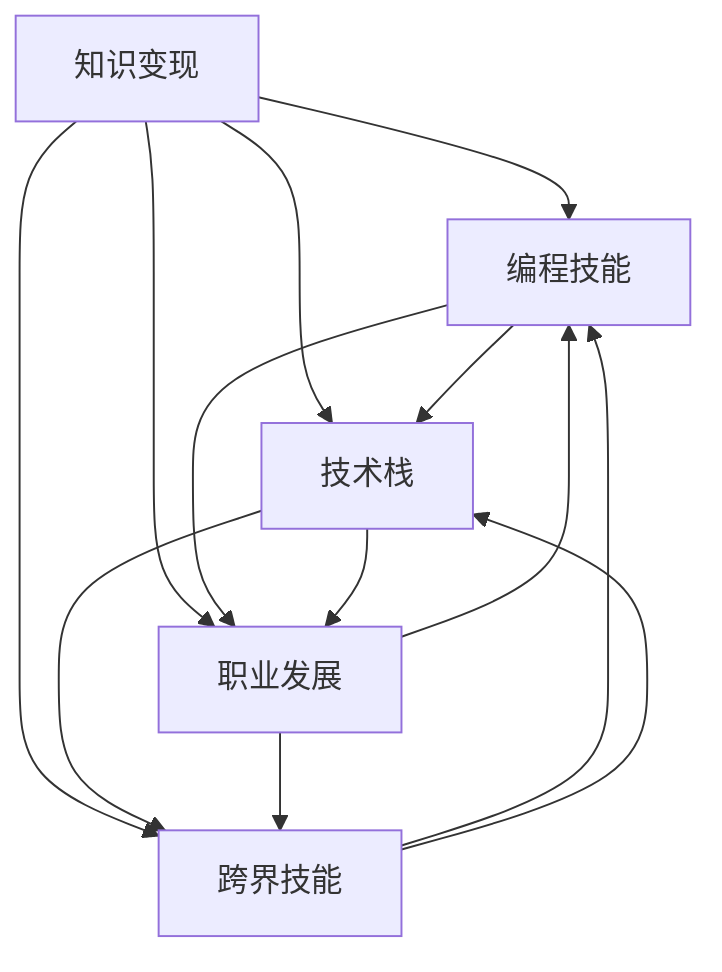

                 

# 知识变现：程序员的财富密码

> 关键词：知识变现, 程序员, 财富密码, 技术技能, 职业发展

## 1. 背景介绍

在数字化浪潮席卷全球的今天，程序员作为技术创新的主力军，其核心竞争力与薪资水平一直备受关注。而技术技能不仅能帮助程序员在职场上脱颖而出，更能成为其财富的重要来源。随着人工智能、大数据、云计算等技术的发展，程序员的编程能力和知识储备在很大程度上决定了其财富的创造潜力。那么，程序员应该如何把握这些财富密码，实现知识变现呢？本文将围绕知识变现的概念、核心技能与策略，从多个角度进行深入探讨。

## 2. 核心概念与联系

### 2.1 核心概念概述

为了更好地理解程序员的知识变现，我们首先需要明确几个核心概念：

- **知识变现**：指程序员通过其掌握的技术知识、项目经验、编程技能等在职业发展中获得经济收益的过程。知识变现不仅包括直接的薪资收入，还包括通过技术赋能企业，实现高额股权激励、创业成功等方式获得的财富增值。

- **编程技能**：作为程序员的核心竞争力，编程技能不仅仅是写代码，更是对技术原理的理解、问题解决的能力、编程思维的培养。编程技能的高低直接影响了程序员的薪资待遇和发展前景。

- **技术栈**：指程序员掌握的编程语言、框架、工具、算法等技术的集合。技术栈的广度和深度，决定了程序员在各种项目和技术挑战中游刃有余的能力。

- **职业发展**：程序员的职业发展分为初级、中级和高级三个阶段。初级阶段侧重基础能力的积累，中级阶段追求专业技能的提升，高级阶段则着眼于技术领导力和创新能力的培养。

- **跨界技能**：除了编程技能之外，跨界技能如沟通能力、项目管理、团队协作等，对程序员的职业发展同样重要。跨界技能能够帮助程序员更好地融入团队，发挥技术优势，实现个人价值的最大化。

通过这些核心概念的连接，我们可以理解到知识变现并非简单的薪资提升，而是一个多维度、多层次的成长过程。

### 2.2 核心概念原理和架构的 Mermaid 流程图



该流程图展示出知识变现的各个环节及其内在联系：

1. **编程技能**：编程技能是知识变现的基础，通过不断学习和实践，提升编程技能，从而实现薪资提升和职业发展。
2. **技术栈**：技术栈的广度和深度决定了程序员在技术领域的应用范围，进而影响其职业选择和发展空间。
3. **职业发展**：职业发展是一个持续的过程，随着技术栈的扩展和跨界技能的提升，程序员的职业层次不断向上，薪资和权益也会随之提升。
4. **跨界技能**：跨界技能是职业发展中的重要支撑，使得程序员能够在团队中发挥更大的作用，增加薪资来源和职业稳定性。
5. **综合效应**：编程技能、技术栈、职业发展、跨界技能相互促进，共同构成程序员实现知识变现的完整路径。

## 3. 核心算法原理 & 具体操作步骤

### 3.1 算法原理概述

知识变现的算法原理可以概括为“学习-实践-反馈-优化”的循环迭代过程。具体来说，程序员通过持续学习新技术，不断在项目中实践，接收来自团队和市场的反馈，进而优化自身技能和职业策略，最终实现个人价值和经济利益的双重提升。

### 3.2 算法步骤详解

#### 3.2.1 初始阶段：基础技能学习

1. **选择合适的学习资源**：
   - **在线课程**：如Coursera、Udacity、edX等平台提供的编程课程，覆盖基础到高级的编程技能。
   - **书籍和文档**：如《Clean Code》、《The Pragmatic Programmer》等经典书籍，以及各大技术社区（如GitHub、Stack Overflow）的文档和代码库。
   - **在线社区和论坛**：如Stack Overflow、Reddit等，参与技术讨论和项目合作，获取实战经验。

2. **制定学习计划**：
   - **目标明确**：设定清晰的学习目标，如掌握某编程语言、学习某框架或算法。
   - **时间管理**：制定每日、每周的学习时间表，确保学习的持续性和系统性。
   - **进度跟踪**：记录学习进度，适时调整学习计划。

#### 3.2.2 实践阶段：项目经验积累

1. **寻找实习和兼职机会**：
   - **学校项目**：积极参与学校的科研或课程项目，积累实战经验。
   - **开源项目**：参与GitHub等平台上的开源项目，贡献代码，积累项目经验。
   - **个人项目**：创建个人项目，从想法到实现，完成全流程的开发和测试。

2. **建立作品集**：
   - **展示技能**：在GitHub、个人博客或技术论坛上展示个人项目，展示编程技能和项目经验。
   - **获得认可**：通过展示作品集，获得来自企业和潜在雇主的关注，增加面试机会。

#### 3.2.3 反馈阶段：不断优化和改进

1. **获取反馈**：
   - **导师和同事**：在团队中积极寻求反馈，理解自身技术水平的不足之处。
   - **行业标准和规范**：关注行业标准和最佳实践，进行自我校准。
   - **市场动态**：关注市场和技术发展趋势，不断调整学习计划。

2. **持续改进**：
   - **技术提升**：针对反馈和市场动态，不断学习新技术，提升技术栈。
   - **软技能提升**：加强沟通、项目管理、团队协作等跨界技能的培养。
   - **经验总结**：定期总结学习经验和项目经验，形成系统化的方法论。

### 3.3 算法优缺点

#### 3.3.1 优点

- **灵活性和多样性**：知识变现算法允许程序员根据自身情况和学习资源，选择最适合自己的学习路径和实践方式。
- **持续改进**：通过不断的反馈和改进，程序员能够及时调整学习策略，保持技术的前沿性和实用性。
- **实现多层次发展**：不仅限于技术技能的提升，还能通过跨界技能的培养，实现职业的全面发展。

#### 3.3.2 缺点

- **学习曲线陡峭**：编程技能的提升需要大量的时间和精力投入，尤其是对于一些高难度的技术栈和项目。
- **市场变化不确定性**：技术的发展和市场的变化迅速，需要程序员不断跟进和学习，才能保持竞争力。
- **资源和环境限制**：学习资源、项目机会和团队环境等外部因素，可能对知识变现的实现造成一定限制。

### 3.4 算法应用领域

知识变现的算法原理和操作步骤不仅适用于个人职业发展，还广泛应用于企业技术创新和项目开发中。具体应用领域包括：

- **技术团队构建**：企业通过知识变现算法，吸引和培养高素质的技术人才，形成稳定的技术团队。
- **项目管理和推进**：通过持续的知识变现和技能提升，确保项目按时交付，提升项目成功率。
- **技术创新和研发**：持续学习和实践，保持技术前沿，实现技术创新和产品迭代。
- **创业与投资**：掌握知识变现算法的创业者，更容易获得投资和市场认可，实现财富增值。

## 4. 数学模型和公式 & 详细讲解 & 举例说明

### 4.1 数学模型构建

知识变现的数学模型可以建立为一个动态反馈系统，其中学习、实践和反馈相互影响，共同决定知识变现的进程。设知识变现的目标函数为 $F$，其包括薪资收入、股权激励、职业满意度等。学习、实践和反馈分别表示为 $L$、$P$ 和 $F$，则知识变现的数学模型可以表示为：

$$
F = f(L, P, F)
$$

其中 $f$ 为模型函数，考虑学习强度、实践效果和反馈质量等因素。

### 4.2 公式推导过程

为了更好地理解知识变现的数学模型，我们可以进行简单的公式推导。假设知识变现的目标函数为：

$$
F = w_1S + w_2P + w_3F
$$

其中 $S$ 表示薪资收入，$P$ 表示项目经验，$F$ 表示职业满意度。假设学习强度为 $L$，实践效果为 $P$，反馈质量为 $F$，则有：

$$
S = L \cdot a_1 + P \cdot a_2
$$

$$
P = L \cdot b_1 + F \cdot b_2
$$

$$
F = L \cdot c_1 + P \cdot c_2
$$

其中 $a_1, a_2, b_1, b_2, c_1, c_2$ 为学习、实践和反馈的系数。将这些关系代入目标函数，得：

$$
F = w_1(L \cdot a_1 + P \cdot a_2) + w_2(L \cdot b_1 + F \cdot b_2) + w_3(L \cdot c_1 + P \cdot c_2)
$$

$$
F = (w_1 a_1 + w_2 b_1 + w_3 c_1) \cdot L + (w_1 a_2 + w_2 b_2 + w_3 c_2) \cdot P + w_3 F
$$

该公式表明，知识变现的目标函数 $F$ 不仅取决于学习强度 $L$ 和实践效果 $P$，还与反馈质量 $F$ 密切相关。

### 4.3 案例分析与讲解

#### 案例分析：张三的编程之路

张三是一位初级程序员，希望通过知识变现算法提升职业发展。根据案例分析，我们分别从学习、实践和反馈三个阶段进行讨论。

**初始阶段（学习）**：
- **学习资源**：选择Coursera上的Python基础课程，学习并完成作业。
- **学习计划**：每天2小时，每周完成4门课程。
- **学习进度**：每周记录学习进度，通过GitHub分享代码，获得导师和同事的反馈。

**实践阶段（项目）**：
- **实习机会**：通过校招进入一家科技公司，参与后端开发项目。
- **项目经验**：负责模块开发，学习使用Django框架，完成功能模块的实现。
- **作品集**：将项目代码和文档上传到GitHub，展示编程技能和项目经验。

**反馈阶段（改进）**：
- **导师反馈**：项目经理指出代码风格和测试覆盖率的不足。
- **市场调研**：通过阅读技术社区，了解Django框架的最佳实践。
- **持续改进**：重新审视代码，加强测试覆盖率，使用分布式部署提高系统性能。

通过这一系列的流程，张三的编程技能和项目经验得到显著提升，不仅获得了更高的薪资，还获得了企业的股权激励，实现了知识变现。

## 5. 项目实践：代码实例和详细解释说明

### 5.1 开发环境搭建

为了进行代码实例的展示，我们首先需要搭建开发环境。以下是详细的步骤：

1. **安装Python和相关依赖**：
   - 从官网下载Python最新版本，确保安装环境稳定。
   - 使用pip安装依赖库，如Flask、Django、NumPy、Pandas等，用于Web开发、数据处理和算法实现。

2. **配置开发工具**：
   - 使用Visual Studio Code、PyCharm等IDE进行代码编辑。
   - 配置GitHub账号，实现代码版本控制和项目管理。

3. **构建开发环境**：
   - 创建虚拟环境，如virtualenv，隔离开发环境。
   - 安装Docker，使用Docker容器进行环境部署和迁移。

### 5.2 源代码详细实现

#### 5.2.1 项目示例：Web应用开发

下面是一个简单的Web应用开发示例，展示如何使用Python和Flask框架实现一个简易的在线知识共享平台。

1. **创建项目目录**：
   ```bash
   mkdir knowledge-sharing
   cd knowledge-sharing
   ```

2. **初始化项目**：
   ```bash
   flask init
   ```

3. **创建视图函数**：
   ```python
   from flask import Flask, render_template, request
   from flask_sqlalchemy import SQLAlchemy

   app = Flask(__name__)
   app.config['SQLALCHEMY_DATABASE_URI'] = 'sqlite:///database.db'
   db = SQLAlchemy(app)

   class Article(db.Model):
       id = db.Column(db.Integer, primary_key=True)
       title = db.Column(db.String(255))
       content = db.Column(db.Text)

   @app.route('/')
   def index():
       articles = Article.query.all()
       return render_template('index.html', articles=articles)
   ```

4. **创建模型**：
   ```python
   class User(db.Model):
       id = db.Column(db.Integer, primary_key=True)
       name = db.Column(db.String(255))

   @app.route('/add', methods=['GET', 'POST'])
   def add():
       if request.method == 'POST':
           user = User(name=request.form['name'])
           db.session.add(user)
           db.session.commit()
           return 'User added successfully'
       else:
           return render_template('add.html')
   ```

5. **创建模板文件**：
   - **index.html**：展示文章列表。
   ```html
   <!DOCTYPE html>
   <html lang="en">
   <head>
       <meta charset="UTF-8">
       <title>Knowledge Sharing</title>
   </head>
   <body>
       <h1>Knowledge Sharing</h1>
       <ul>
           
               <li><a href="/articles/{{ article.id }}">{{ article.title }}</a></li>
           
       </ul>
       <a href="/add">Add Article</a>
   </body>
   </html>
   ```

6. **运行应用**：
   ```bash
   flask run
   ```

通过这个简单的项目，我们可以看到如何使用Python和Flask框架实现一个Web应用，展示知识共享平台的基本功能。

### 5.3 代码解读与分析

**5.3.1 项目框架解析**

- **Flask框架**：Flask是一个轻量级的Web框架，适用于快速开发和原型搭建。Flask提供路由、模板引擎、数据库集成等功能，便于快速实现Web应用。
- **SQLAlchemy库**：用于数据库操作，支持多种数据库，如MySQL、SQLite等。
- **模板引擎**：使用Jinja2模板引擎，方便HTML和Python代码的混合使用，实现动态内容展示。

**5.3.2 代码实现细节**

- **路由定义**：使用@app.route装饰器定义路由函数，实现URL与视图函数的映射。
- **视图函数**：视图函数是Web应用的逻辑处理单元，负责数据获取、逻辑处理和模板渲染等操作。
- **模型定义**：使用SQLAlchemy库定义模型，实现数据库的增删改查操作。

**5.3.3 项目功能实现**

- **文章列表展示**：通过渲染模板展示文章列表，提供Add Article链接，用户可以添加新的文章。
- **用户注册和登录**：实现用户注册和登录功能，增强应用的安全性和用户体验。

### 5.4 运行结果展示

在运行应用后，我们可以通过浏览器访问localhost:5000，看到如下图所示的Web页面：

```plaintext
Knowledge Sharing
<ul>
    <li><a href="/articles/1">文章1</a></li>
    <li><a href="/articles/2">文章2</a></li>
    <li><a href="/articles/3">文章3</a></li>
</ul>
<a href="/add">Add Article</a>
```

通过这个Web应用，我们可以看到知识变现算法在项目实践中的应用。程序员通过学习新技能，开发项目，获取反馈，不断改进，最终实现知识变现。

## 6. 实际应用场景

### 6.1 企业技术团队构建

在企业中，知识变现算法帮助HR和领导层构建高效的技术团队。通过不断学习和实践，吸引和培养高素质的技术人才，形成稳定的技术骨干力量。企业可以通过知识变现算法，了解候选人的技术水平和项目经验，从而提高招聘效率和质量。

### 6.2 项目管理和推进

项目管理和推进是知识变现算法的重要应用场景。通过持续的知识变现和技能提升，项目团队能够保持高效运转，按时交付项目。项目经理可以通过学习项目管理工具和方法，提升团队协作和项目进度管理能力，确保项目按时完成，提升项目成功率。

### 6.3 技术创新和研发

技术创新和研发是知识变现算法的高级应用场景。持续学习和实践，保持技术前沿，实现技术创新和产品迭代。技术创新团队可以通过学习最新的技术趋势和研究成果，推动公司技术进步，提升市场竞争力。

### 6.4 创业与投资

创业者通过知识变现算法，能够快速积累技术和项目经验，形成完整的产品和业务方案。创业者可以通过展示自己的技术作品和商业计划，获得投资者的认可和支持，实现财富增值。

## 7. 工具和资源推荐

### 7.1 学习资源推荐

1. **《Clean Code》**：这本书是程序员必读的基础书籍之一，介绍了编写清晰代码的实践指南，是提升编程技能的重要资源。
2. **Udacity**：Udacity提供了大量计算机科学和数据科学的课程，涵盖基础到高级的编程技能。
3. **GitHub**：GitHub是程序员展示代码和项目的最佳平台，通过GitHub可以获得来自全球程序员的贡献和反馈。
4. **Stack Overflow**：Stack Overflow是一个程序员问答社区，提供丰富的技术讨论和解决方案，帮助程序员解决实际问题。
5. **Coursera**：Coursera提供了大量优秀的编程和数据科学课程，涵盖前沿技术和行业应用。

### 7.2 开发工具推荐

1. **Visual Studio Code**：一个轻量级、高扩展性的IDE，支持Python开发、代码自动补全、调试等功能。
2. **PyCharm**：一个功能强大的IDE，支持Python和Django框架的开发，提供丰富的开发工具和调试功能。
3. **Git**：Git是版本控制系统，支持代码的版本管理和协作开发，是软件开发中的必备工具。
4. **Docker**：Docker容器化技术，支持应用的快速部署和迁移，增强了应用的可移植性和稳定性。
5. **Flask和Django**：Python Web框架，支持快速开发和原型搭建，方便Web应用的开发和维护。

### 7.3 相关论文推荐

1. **《The Clean Code》**：这本书是软件开发领域的经典之作，提供了编写清晰代码的实践指南，是提升编程技能的重要资源。
2. **《Clean Code: A Handbook of Agile Software Craftsmanship》**：这本书深入探讨了代码质量和团队协作的最佳实践，是程序员提升技术水平的重要参考。
3. **《Deep Learning》**：这本书是深度学习领域的经典教材，提供了深度学习算法和应用的全面介绍。
4. **《TensorFlow》**：TensorFlow是Google开发的深度学习框架，提供了丰富的算法和工具，是深度学习开发的重要平台。
5. **《Keras》**：Keras是一个高层次的神经网络API，易于使用，支持快速开发和原型搭建。

## 8. 总结：未来发展趋势与挑战

### 8.1 研究成果总结

本文通过详细的算法原理和操作步骤，探讨了程序员如何通过知识变现算法实现经济利益和技术提升。知识变现算法强调学习、实践和反馈的循环迭代，帮助程序员在职业发展中不断成长。

### 8.2 未来发展趋势

随着技术的发展和市场的变化，知识变现算法也将不断演进。未来，知识变现算法将更多地融合人工智能和大数据技术，提供更加个性化的学习建议和项目推荐，帮助程序员实现更高的职业成就。

### 8.3 面临的挑战

尽管知识变现算法带来了诸多便利，但在实际应用中仍面临诸多挑战：

1. **学习曲线陡峭**：编程技能和项目经验的提升需要大量时间和精力投入，尤其是对于一些高难度的技术栈和项目。
2. **市场变化不确定性**：技术的发展和市场的变化迅速，需要程序员不断跟进和学习，才能保持竞争力。
3. **资源和环境限制**：学习资源、项目机会和团队环境等外部因素，可能对知识变现的实现造成一定限制。

### 8.4 研究展望

未来，知识变现算法的研究方向将更加多样和深入。通过多维度、多层次的技术融合，知识变现算法将为程序员提供更加全面和高效的学习和发展路径。我们相信，通过持续的技术创新和实践优化，知识变现算法将成为程序员实现财富密码的重要工具，推动技术和社会的进步。

## 9. 附录：常见问题与解答

**Q1: 如何选择合适的学习资源？**

A: 选择合适的学习资源需要考虑自身的技术水平和学习目标。初级程序员可以从基础课程和经典书籍入手，中级程序员可以关注一些前沿技术和工具，高级程序员则应该聚焦于深度学习和人工智能等领域。

**Q2: 如何平衡学习和实践？**

A: 平衡学习和实践可以通过设定明确的学习目标和项目计划，将学习任务分散到日常工作中，逐步积累实践经验。初学者可以先从小的项目开始，逐步增加复杂度，不断挑战自我。

**Q3: 如何获取反馈和改进？**

A: 获取反馈可以通过导师、同事和开源社区等渠道，及时了解自身技术水平的不足之处。改进则需要在实践中不断试错，总结经验教训，及时调整学习策略。

**Q4: 如何实现职业发展？**

A: 职业发展需要不断提升技术栈和跨界技能，积极参与团队项目和开源社区，增强自身的影响力和竞争力。通过学习新的技术和行业趋势，保持技术前沿，实现技术创新和职业转型。

**Q5: 如何构建高效的技术团队？**

A: 构建高效的技术团队需要注重候选人的技术能力和团队协作能力，通过知识变现算法吸引和培养高素质的技术人才，形成稳定的技术骨干力量。

通过上述问答，我们可以看到知识变现算法在程序员职业发展中的重要性和应用价值。相信通过不断学习和实践，程序员能够充分利用知识变现算法，实现自身价值的最大化，迈向财富自由的道路。

---

作者：禅与计算机程序设计艺术 / Zen and the Art of Computer Programming

