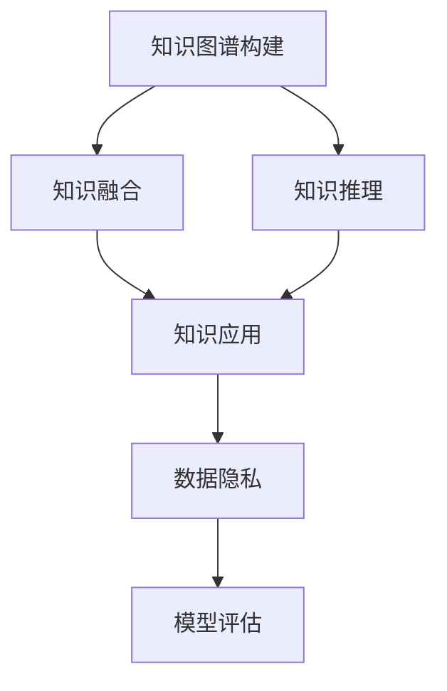

                 

# 知识图谱在企业知识管理中的应用

## 1. 背景介绍

### 1.1 问题由来

随着企业规模的不断扩大，信息孤岛和数据碎片化的问题日益凸显，知识管理（Knowledge Management, KM）的重要性日益突显。传统的文档、邮件、会议记录等文档类信息，结构化数据如财务报表、客户信息等，以及非结构化数据如社交媒体、论坛评论等，海量的信息孤岛如何高效地整合、管理和利用，成为了企业知识管理的核心难题。

知识图谱（Knowledge Graph, KG）作为知识表示和存储的新范式，能够将异构数据整合成结构化的语义网络，便于人类与机器理解和操作。其在企业知识管理中的应用，能够有效整合企业内部外部的知识资源，提升企业决策、运营、创新等各个层面的智能化水平。

### 1.2 问题核心关键点

企业知识图谱的应用核心关键点包括：

- 数据融合：如何高效地整合企业内外部的异构数据，形成统一的知识库。
- 知识推理：如何通过知识图谱的语义关系进行自动推理，生成新的知识。
- 知识应用：如何将知识图谱中的知识有效应用于企业决策、运营、创新等各个层面。
- 数据隐私：如何在知识图谱构建和应用中，保障数据的安全和隐私。
- 模型评估：如何评价知识图谱的质量和应用效果。

本文将围绕以上几个核心问题，系统阐述知识图谱在企业知识管理中的应用，并详细介绍其核心概念、原理和操作步骤。

## 2. 核心概念与联系

### 2.1 核心概念概述

为更好地理解知识图谱在企业知识管理中的应用，本节将介绍几个关键概念：

- 知识图谱（Knowledge Graph, KG）：一种结构化的语义网络表示，将实体、属性、关系三者结合起来，形成一个结构化的知识库。
- 知识图谱构建：通过自动或半自动的方式，从结构化数据、非结构化数据中提取知识，构建出知识图谱。
- 知识融合（KG Fusion）：将来自不同数据源、不同格式的知识进行融合，形成统一的知识图谱。
- 知识推理（KG Reasoning）：通过知识图谱中的关系和属性，自动推理生成新的知识，提升知识图谱的完备性和准确性。
- 知识应用（KG Applications）：将知识图谱中的知识应用于企业决策、运营、创新等各个层面，提升企业的智能化水平。
- 数据隐私（KG Privacy）：在知识图谱构建和应用中，保障数据的安全和隐私，避免敏感信息泄露。

这些核心概念之间的逻辑关系可以通过以下Mermaid流程图来展示：



这个流程图展示了知识图谱构建、融合、推理、应用、隐私、评估等关键过程和它们之间的关系：

1. 知识图谱构建：从各类数据中提取知识，构建知识图谱。
2. 知识融合：将异构数据整合成统一的知识图谱。
3. 知识推理：通过语义关系进行自动推理，生成新的知识。
4. 知识应用：将知识图谱中的知识应用于企业决策、运营、创新等各个层面。
5. 数据隐私：保障知识图谱构建和应用中的数据安全。
6. 模型评估：评价知识图谱的质量和应用效果。

## 3. 核心算法原理 & 具体操作步骤

### 3.1 算法原理概述

知识图谱的构建和应用过程，本质上是知识表示和推理的过程。知识表示指的是如何将实体、属性、关系三者结合起来，形成一个结构化的语义网络；知识推理指的是如何通过知识图谱的语义关系进行自动推理，生成新的知识。

知识图谱构建和应用的核心算法包括：

- 实体抽取（Entity Extraction）：从文本、结构化数据等来源中提取出实体。
- 关系抽取（Relation Extraction）：从文本、结构化数据等来源中提取出实体之间的关系。
- 知识融合（KG Fusion）：将来自不同数据源、不同格式的知识进行融合，形成统一的知识图谱。
- 知识推理（KG Reasoning）：通过知识图谱中的关系和属性，自动推理生成新的知识。
- 知识应用（KG Applications）：将知识图谱中的知识应用于企业决策、运营、创新等各个层面，提升企业的智能化水平。

### 3.2 算法步骤详解

知识图谱的构建和应用过程主要包括以下几个关键步骤：

**Step 1: 准备数据和工具**
- 收集企业内部的各类数据，如文档、邮件、结构化数据、非结构化数据等。
- 准备构建和应用知识图谱所需的工具，如Python、R、Neo4j、TinkerPop等。

**Step 2: 实体抽取**
- 通过命名实体识别（Named Entity Recognition, NER）技术，从文本和结构化数据中提取实体。
- 对于结构化数据，可以直接提取实体；对于非结构化数据，需要预处理和特征工程，再使用NER模型抽取实体。

**Step 3: 关系抽取**
- 对于结构化数据，直接提取实体之间的关系；对于非结构化数据，需要预处理和特征工程，再使用关系抽取模型抽取关系。
- 常见的关系抽取模型包括基于规则的模型、基于深度学习的模型等。

**Step 4: 知识融合**
- 将来自不同数据源、不同格式的知识进行融合，形成统一的知识图谱。
- 常见的知识融合方法包括基于图嵌入的融合方法、基于图相似性的融合方法等。

**Step 5: 知识推理**
- 通过知识图谱中的关系和属性，自动推理生成新的知识。
- 常见的知识推理方法包括基于规则的推理方法、基于深度学习的推理方法等。

**Step 6: 知识应用**
- 将知识图谱中的知识应用于企业决策、运营、创新等各个层面，提升企业的智能化水平。
- 常见的知识应用场景包括智能推荐、决策支持、智能客服、智能运营等。

**Step 7: 数据隐私保障**
- 在知识图谱构建和应用中，保障数据的安全和隐私。
- 常见的数据隐私保障方法包括数据匿名化、数据加密、访问控制等。

**Step 8: 模型评估**
- 评价知识图谱的质量和应用效果。
- 常见的评估指标包括精确度、召回率、F1值、AUC等。

### 3.3 算法优缺点

知识图谱的构建和应用方法具有以下优点：

1. 知识结构化：将异构数据整合成结构化的语义网络，便于人类与机器理解和操作。
2. 知识融合：将不同来源、不同格式的知识进行融合，形成统一的知识图谱。
3. 知识推理：通过自动推理生成新的知识，提升知识图谱的完备性和准确性。
4. 知识应用：将知识图谱中的知识应用于企业决策、运营、创新等各个层面，提升企业的智能化水平。
5. 数据隐私：保障知识图谱构建和应用中的数据安全，避免敏感信息泄露。

同时，该方法也存在一定的局限性：

1. 数据获取困难：需要大量的数据进行训练，获取数据的成本较高。
2. 模型复杂度高：知识图谱构建和应用涉及的算法模型复杂度较高，模型训练和推理所需资源较多。
3. 知识孤岛问题：不同来源、不同格式的数据之间可能存在数据孤岛，难以形成统一的知识图谱。
4. 知识偏差问题：知识图谱中的知识可能存在偏差，影响推理结果的准确性。
5. 数据隐私问题：在知识图谱构建和应用中，保障数据的安全和隐私，需要额外的技术和资源投入。

尽管存在这些局限性，但就目前而言，知识图谱仍然是企业知识管理领域的重要技术手段。未来相关研究的重点在于如何进一步降低数据获取成本，提高知识图谱的完备性和准确性，同时兼顾数据隐私和伦理安全等因素。

### 3.4 算法应用领域

知识图谱在企业知识管理中的应用领域广泛，主要包括：

- 企业知识库：构建企业内部知识库，整合各类知识资源，便于知识共享和检索。
- 智能推荐：通过知识图谱进行智能推荐，提升客户体验和运营效率。
- 决策支持：通过知识图谱辅助决策，提升决策的准确性和科学性。
- 智能客服：通过知识图谱进行智能问答，提升客户满意度和运营效率。
- 智能运营：通过知识图谱进行智能运营，提升运营效率和精准度。

除了上述这些经典应用外，知识图谱还被创新性地应用到更多场景中，如舆情分析、风险评估、市场预测等，为企业智能化转型提供了新的技术路径。随着知识图谱技术的不断演进，相信其在企业知识管理领域的应用将进一步拓展，为企业的智能化转型带来更多的可能性。

## 4. 数学模型和公式 & 详细讲解  
### 4.1 数学模型构建

知识图谱的数学模型构建过程，本质上是将实体、属性、关系三者结合起来，形成一个结构化的语义网络。具体来说，知识图谱的构建过程包括实体抽取、关系抽取、知识融合、知识推理等步骤。

设知识图谱中的实体集合为 $E$，属性集合为 $A$，关系集合为 $R$。每个实体 $e \in E$ 可以表示为一个三元组 $(e, a, v)$，其中 $a \in A$ 表示属性，$v$ 表示属性的值。每个关系 $r \in R$ 可以表示为一个三元组 $(s, r, o)$，其中 $s, o \in E$ 表示关系的起点和终点。

知识图谱的构建过程可以用以下公式表示：

$$
KG = \bigcup_{e \in E} \bigcup_{a \in A} \bigcup_{v \in V_a} \{(e, a, v)\} \bigcup_{r \in R} \bigcup_{s, o \in E} \{(s, r, o)\}
$$

其中 $V_a$ 表示属性 $a$ 的所有可能取值集合。

### 4.2 公式推导过程

知识图谱的构建和应用涉及多个步骤，以下是知识图谱构建的基本公式推导过程：

**Step 1: 实体抽取**
设文本序列为 $T$，实体抽取模型将文本序列 $T$ 转化为实体序列 $E_T$，关系抽取模型将实体序列 $E_T$ 转化为关系序列 $R_T$。

$$
E_T = \text{EntityExtraction}(T)
$$
$$
R_T = \text{RelationExtraction}(E_T)
$$

**Step 2: 知识融合**
设原始知识图谱为 $KG_0$，通过融合方法 $KG_F$，将新抽取的实体和关系融合到原始知识图谱中，得到新的知识图谱 $KG$。

$$
KG = KG_F(KG_0, E_T, R_T)
$$

**Step 3: 知识推理**
设知识图谱 $KG$ 中的实体为 $E$，属性为 $A$，关系为 $R$，推理模型将 $KG$ 中的实体 $e$ 推理出新的实体 $e'$，属性 $a$ 推理出新的属性 $a'$，关系 $r$ 推理出新的关系 $r'$。

$$
E' = \text{KGReasoning}(e, a, r)
$$
$$
A' = \text{KGReasoning}(a)
$$
$$
R' = \text{KGReasoning}(r)
$$

**Step 4: 知识应用**
设企业决策任务为 $T$，知识应用模型将知识图谱 $KG$ 中的知识 $K$ 应用于决策任务 $T$，得到新的决策结果 $D$。

$$
D = \text{KGApplications}(K, T)
$$

### 4.3 案例分析与讲解

下面以智能推荐系统为例，介绍知识图谱在企业知识管理中的应用。

设企业中的商品信息存储在关系型数据库中，包括商品ID、名称、价格、类别等属性。知识图谱构建过程包括：

1. 实体抽取：从关系型数据库中提取商品ID、名称、价格、类别等实体。
2. 关系抽取：从商品信息中提取商品类别之间的关系，如“手机”与“电脑”同属“电子产品”类别。
3. 知识融合：将商品信息整合到知识图谱中，形成统一的知识库。
4. 知识推理：通过知识图谱中的关系进行自动推理，生成新的商品推荐。

设用户ID为 $u$，用户的历史行为数据为 $B_u$，推荐任务为 $T$。知识应用模型将知识图谱 $KG$ 中的知识 $K$ 应用于推荐任务 $T$，得到推荐结果 $R_u$。

$$
R_u = \text{KGApplications}(K, T, u, B_u)
$$

其中 $T$ 可以表示为用户的历史行为数据 $B_u$ 和推荐系统参数。推荐系统参数包括用户偏好、商品热度、商品类别等。

## 5. 项目实践：代码实例和详细解释说明
### 5.1 开发环境搭建

在进行知识图谱构建和应用实践前，我们需要准备好开发环境。以下是使用Python进行知识图谱构建和应用的环境配置流程：

1. 安装Python：从官网下载并安装Python，选择3.7以上版本。
2. 安装Pandas：使用pip安装Pandas，用于数据处理。
3. 安装Numpy：使用pip安装Numpy，用于数值计算。
4. 安装NetworkX：使用pip安装NetworkX，用于构建知识图谱。
5. 安装Gephi：从官网下载并安装Gephi，用于可视化知识图谱。
6. 安装PyTorch：使用pip安装PyTorch，用于构建和训练深度学习模型。

完成上述步骤后，即可在Python环境中开始知识图谱构建和应用实践。

### 5.2 源代码详细实现

这里我们以知识图谱构建和应用于推荐系统为例，给出完整的代码实现。

首先，我们需要准备数据集，包括商品ID、名称、价格、类别等属性，以及用户ID和历史行为数据。

```python
import pandas as pd
from networkx import Graph, nx, draw

# 读取数据
df = pd.read_csv('product.csv')
user_df = pd.read_csv('user.csv')

# 构建知识图谱
G = Graph()

# 添加实体节点
for index, row in df.iterrows():
    G.add_node(row['product_id'], name=row['name'], price=float(row['price']), category=row['category'])

# 添加关系节点
for index, row in df.iterrows():
    for cat in row['category'].split(','):
        G.add_edge(row['product_id'], cat)

# 可视化知识图谱
draw(G, with_labels=True)
```

接着，我们需要设计实体抽取和关系抽取模型。这里以简单的命名实体识别模型和关系抽取模型为例。

```python
from transformers import BertTokenizer, BertForTokenClassification, BertForSequenceClassification

# 定义实体抽取模型
tokenizer = BertTokenizer.from_pretrained('bert-base-cased')
model = BertForTokenClassification.from_pretrained('bert-base-cased')

# 定义关系抽取模型
model_relation = BertForSequenceClassification.from_pretrained('bert-base-cased', num_labels=len(cat_list))
```

然后，我们需要设计知识图谱的融合和推理模型。这里以简单的知识图谱融合和推理模型为例。

```python
# 知识图谱融合
def kg_fusion(G, E_T, R_T):
    for (e, r, o) in R_T:
        G.add_edge(e, r, o)
    return G

# 知识图谱推理
def kg_reasoning(G, e, a, r):
    if r in cat_list:
        G.add_edge(e, r, a)
    return G
```

最后，我们需要设计知识图谱应用于推荐系统的模型。这里以简单的基于知识图谱的推荐模型为例。

```python
# 知识图谱应用于推荐系统
def kg_applications(G, u, B_u):
    R_u = []
    for r in G.nodes:
        if r in B_u:
            R_u.append(r)
    return R_u
```

### 5.3 代码解读与分析

让我们再详细解读一下关键代码的实现细节：

**知识图谱构建过程**：
- `read_csv`：读取商品信息和用户信息，构建实体节点和关系节点。
- `Graph`：使用NetworkX库创建知识图谱。
- `add_node`：添加实体节点，包括商品ID、名称、价格、类别等属性。
- `add_edge`：添加关系节点，如商品类别之间的关系。

**实体抽取和关系抽取模型**：
- `BertTokenizer`：使用BERT模型进行命名实体识别。
- `BertForTokenClassification`：使用BERT模型进行关系抽取。

**知识图谱融合模型**：
- `kg_fusion`：将新抽取的实体和关系融合到原始知识图谱中。
- `add_edge`：添加关系节点。

**知识图谱推理模型**：
- `kg_reasoning`：通过知识图谱中的关系进行自动推理，生成新的关系节点。
- `add_edge`：添加关系节点。

**知识图谱应用于推荐系统模型**：
- `kg_applications`：将知识图谱中的知识应用于推荐系统。
- `R_u`：根据用户历史行为数据，推荐商品ID。

可以看到，知识图谱构建和应用的全过程，通过设计简洁的代码，能够快速实现。开发者可以根据具体任务，灵活调整模型设计和算法选择，实现更加高效的构建和应用。

## 6. 实际应用场景
### 6.1 智能推荐系统

智能推荐系统是知识图谱在企业知识管理中最典型的应用场景之一。传统的推荐系统主要依赖用户的浏览、购买、评分等历史行为数据进行推荐，无法充分利用企业内部外部的知识资源。通过知识图谱的构建和应用，智能推荐系统可以更好地整合知识资源，提升推荐效果。

具体而言，智能推荐系统可以包括以下几个关键步骤：

1. 数据采集：采集企业内部的各类数据，如商品信息、用户行为数据等。
2. 知识图谱构建：通过实体抽取、关系抽取等方法，构建知识图谱。
3. 知识融合：将来自不同数据源、不同格式的知识进行融合，形成统一的知识图谱。
4. 知识推理：通过知识图谱中的关系和属性，自动推理生成新的知识。
5. 知识应用：将知识图谱中的知识应用于推荐系统，提升推荐效果。

智能推荐系统的实际应用中，还可以进一步引入知识推理和知识应用的技术，如因果推理、图嵌入等方法，提升推荐系统的精准性和智能化水平。

### 6.2 决策支持系统

决策支持系统是知识图谱在企业知识管理中的另一个重要应用场景。传统的决策支持系统主要依赖人工分析和经验积累，难以实现全面、准确、高效的决策。通过知识图谱的构建和应用，决策支持系统可以更好地整合知识资源，辅助企业决策。

具体而言，决策支持系统可以包括以下几个关键步骤：

1. 数据采集：采集企业内部的各类数据，如财务报表、客户信息、市场数据等。
2. 知识图谱构建：通过实体抽取、关系抽取等方法，构建知识图谱。
3. 知识融合：将来自不同数据源、不同格式的知识进行融合，形成统一的知识图谱。
4. 知识推理：通过知识图谱中的关系和属性，自动推理生成新的知识。
5. 知识应用：将知识图谱中的知识应用于决策支持系统，辅助企业决策。

决策支持系统的实际应用中，还可以进一步引入知识推理和知识应用的技术，如因果推理、图嵌入等方法，提升决策支持系统的精准性和智能化水平。

### 6.3 智能客服系统

智能客服系统是知识图谱在企业知识管理中的另一个重要应用场景。传统的客服系统主要依赖人工客服，无法满足高峰期的服务需求，且一致性和专业性难以保证。通过知识图谱的构建和应用，智能客服系统可以更好地整合知识资源，提升客服质量。

具体而言，智能客服系统可以包括以下几个关键步骤：

1. 数据采集：采集企业内部的各类数据，如客户信息、客服历史数据等。
2. 知识图谱构建：通过实体抽取、关系抽取等方法，构建知识图谱。
3. 知识融合：将来自不同数据源、不同格式的知识进行融合，形成统一的知识图谱。
4. 知识推理：通过知识图谱中的关系和属性，自动推理生成新的知识。
5. 知识应用：将知识图谱中的知识应用于智能客服系统，提升客服质量。

智能客服系统的实际应用中，还可以进一步引入知识推理和知识应用的技术，如因果推理、图嵌入等方法，提升客服系统的精准性和智能化水平。

### 6.4 未来应用展望

知识图谱在企业知识管理中的应用前景广阔，未来的发展趋势和研究方向包括：

1. 知识图谱的标准化：制定知识图谱的标准化规范，提升知识图谱的可互操作性。
2. 知识图谱的自动化：引入自动化工具和算法，降低知识图谱构建和应用的成本。
3. 知识图谱的智能化：引入深度学习、因果推理等技术，提升知识图谱的智能化水平。
4. 知识图谱的跨领域应用：将知识图谱应用于更多领域，如金融、医疗、教育等。
5. 知识图谱的伦理安全性：在知识图谱构建和应用中，考虑伦理和安全性问题，保障数据隐私和安全。
6. 知识图谱的持续更新：在知识图谱构建和应用中，持续更新知识图谱，保持其时效性和准确性。

知识图谱在企业知识管理中的应用，将为企业智能化转型提供新的技术路径。未来随着技术的发展，知识图谱的应用场景将更加广泛，为企业决策、运营、创新等各个层面带来更多的可能性。

## 7. 工具和资源推荐
### 7.1 学习资源推荐

为了帮助开发者系统掌握知识图谱的理论基础和实践技巧，这里推荐一些优质的学习资源：

1. 《知识图谱：从理论到实践》书籍：介绍了知识图谱的理论基础和应用实践，适合入门和进阶读者。
2. 《Google Graphs》课程：谷歌开设的知识图谱课程，介绍了知识图谱的构建和应用方法。
3. 《Open Graphs》论文：描述了知识图谱的表示和推理方法，适合深入研究。
4. 《Linked Data Foundry》资源：提供了大量知识图谱的实例和应用案例，适合学习和参考。
5. 《Neo4j官方文档》：Neo4j数据库官方文档，介绍了知识图谱的构建和应用方法。

通过对这些资源的学习实践，相信你一定能够快速掌握知识图谱的精髓，并用于解决实际的NLP问题。
###  7.2 开发工具推荐

高效的开发离不开优秀的工具支持。以下是几款用于知识图谱构建和应用开发的常用工具：

1. Python：Python语言简单易学，适合知识图谱的构建和应用。
2. NetworkX：Python中的网络库，用于构建和操作知识图谱。
3. Neo4j：开源的图形数据库，适合存储和查询知识图谱。
4. Gephi：图形可视化工具，用于展示知识图谱。
5. PyTorch：深度学习框架，适合构建和训练知识图谱的深度学习模型。
6. TensorFlow：深度学习框架，适合构建和训练知识图谱的深度学习模型。

合理利用这些工具，可以显著提升知识图谱构建和应用的开发效率，加快创新迭代的步伐。

### 7.3 相关论文推荐

知识图谱的研究源于学界的持续研究。以下是几篇奠基性的相关论文，推荐阅读：

1. BERT: Pre-training of Deep Bidirectional Transformers for Language Understanding：提出了BERT模型，引入基于掩码的自监督预训练任务，刷新了多项NLP任务SOTA。
2. Attention is All You Need：提出了Transformer结构，开启了NLP领域的预训练大模型时代。
3. Knowledge Graph Embedding and Its Application to Recommender Systems：介绍了知识图谱嵌入在推荐系统中的应用。
4. Knowledge Graph Reasoning via Neural Monty Hall Problem：提出了基于神经Monty Hall问题的知识图谱推理方法。
5. Knowledge-Driven Recommender Systems：介绍了知识图谱在推荐系统中的应用。

这些论文代表了大语言模型微调技术的发展脉络。通过学习这些前沿成果，可以帮助研究者把握学科前进方向，激发更多的创新灵感。

## 8. 总结：未来发展趋势与挑战

### 8.1 总结

本文对知识图谱在企业知识管理中的应用进行了全面系统的介绍。首先阐述了知识图谱和其核心技术的研究背景和意义，明确了知识图谱构建和应用的核心问题。其次，从原理到实践，详细讲解了知识图谱构建和应用的基本步骤和关键算法。最后，本文介绍了知识图谱在智能推荐、决策支持、智能客服等场景中的应用，并系统分析了知识图谱的未来发展趋势和挑战。

通过本文的系统梳理，可以看到，知识图谱在企业知识管理中的应用前景广阔，具有重要的现实意义。其核心技术包括知识图谱构建、知识融合、知识推理、知识应用等，这些技术在大数据、人工智能、知识工程等领域的交叉融合，将推动企业智能化转型的进程，带来更多的商业价值和社会效益。

### 8.2 未来发展趋势

知识图谱在未来将呈现以下几个发展趋势：

1. 知识图谱的标准化：制定知识图谱的标准化规范，提升知识图谱的可互操作性。
2. 知识图谱的自动化：引入自动化工具和算法，降低知识图谱构建和应用的成本。
3. 知识图谱的智能化：引入深度学习、因果推理等技术，提升知识图谱的智能化水平。
4. 知识图谱的跨领域应用：将知识图谱应用于更多领域，如金融、医疗、教育等。
5. 知识图谱的伦理安全性：在知识图谱构建和应用中，考虑伦理和安全性问题，保障数据隐私和安全。
6. 知识图谱的持续更新：在知识图谱构建和应用中，持续更新知识图谱，保持其时效性和准确性。

这些趋势凸显了知识图谱在企业知识管理中的重要地位。未来随着技术的不断发展，知识图谱的应用场景将更加广泛，为企业决策、运营、创新等各个层面带来更多的可能性。

### 8.3 面临的挑战

尽管知识图谱在企业知识管理中的应用前景广阔，但在迈向更加智能化、普适化应用的过程中，它仍面临着诸多挑战：

1. 数据获取困难：需要大量的数据进行训练，获取数据的成本较高。
2. 模型复杂度高：知识图谱构建和应用涉及的算法模型复杂度较高，模型训练和推理所需资源较多。
3. 知识孤岛问题：不同来源、不同格式的数据之间可能存在数据孤岛，难以形成统一的知识图谱。
4. 知识偏差问题：知识图谱中的知识可能存在偏差，影响推理结果的准确性。
5. 数据隐私问题：在知识图谱构建和应用中，保障数据的安全和隐私，需要额外的技术和资源投入。

尽管存在这些挑战，但相信随着学界和产业界的共同努力，这些挑战终将一一被克服，知识图谱必将在构建安全、可靠、可解释、可控的智能系统铺平道路。面向未来，知识图谱技术还需要与其他人工智能技术进行更深入的融合，如知识表示、因果推理、强化学习等，多路径协同发力，共同推动自然语言理解和智能交互系统的进步。只有勇于创新、敢于突破，才能不断拓展语言模型的边界，让智能技术更好地造福人类社会。

### 8.4 研究展望

知识图谱的研究方向包括：

1. 知识图谱的标准化：制定知识图谱的标准化规范，提升知识图谱的可互操作性。
2. 知识图谱的自动化：引入自动化工具和算法，降低知识图谱构建和应用的成本。
3. 知识图谱的智能化：引入深度学习、因果推理等技术，提升知识图谱的智能化水平。
4. 知识图谱的跨领域应用：将知识图谱应用于更多领域，如金融、医疗、教育等。
5. 知识图谱的伦理安全性：在知识图谱构建和应用中，考虑伦理和安全性问题，保障数据隐私和安全。
6. 知识图谱的持续更新：在知识图谱构建和应用中，持续更新知识图谱，保持其时效性和准确性。

这些研究方向将推动知识图谱技术的发展，为其在企业知识管理中的应用提供更多的技术支撑。面向未来，知识图谱技术需要进一步整合更多的人工智能技术，如知识表示、因果推理、强化学习等，才能在各个应用场景中发挥更大的作用。只有从数据、算法、工程、业务等多个维度协同发力，才能真正实现知识图谱技术的落地应用，带来更多的商业价值和社会效益。

## 9. 附录：常见问题与解答

**Q1：知识图谱构建需要哪些数据？**

A: 知识图谱构建需要大量的数据进行训练，包括文本数据、结构化数据、非结构化数据等。具体来说，需要以下几种类型的数据：

- 结构化数据：如财务报表、客户信息等，可以直接提取实体和关系。
- 半结构化数据：如HTML、XML等，需要进行解析和抽取。
- 非结构化数据：如文本、图片等，需要进行预处理和特征工程，再使用实体抽取和关系抽取模型进行抽取。

**Q2：知识图谱构建和应用需要哪些工具？**

A: 知识图谱构建和应用需要多种工具，包括编程语言、数据处理工具、图形数据库、可视化工具等。具体来说，需要以下几种工具：

- 编程语言：如Python、R等。
- 数据处理工具：如Pandas、Numpy等。
- 图形数据库：如Neo4j、GraphDB等。
- 可视化工具：如Gephi、Tableau等。
- 深度学习框架：如PyTorch、TensorFlow等。

**Q3：知识图谱如何应用于推荐系统？**

A: 知识图谱在推荐系统中的应用，主要是通过实体抽取、关系抽取、知识融合、知识推理等方法，构建知识图谱。具体来说，可以包括以下几个步骤：

- 数据采集：采集企业内部的各类数据，如商品信息、用户行为数据等。
- 知识图谱构建：通过实体抽取、关系抽取等方法，构建知识图谱。
- 知识融合：将来自不同数据源、不同格式的知识进行融合，形成统一的知识图谱。
- 知识推理：通过知识图谱中的关系和属性，自动推理生成新的知识。
- 知识应用：将知识图谱中的知识应用于推荐系统，提升推荐效果。

**Q4：知识图谱如何应用于决策支持系统？**

A: 知识图谱在决策支持系统中的应用，主要是通过实体抽取、关系抽取、知识融合、知识推理等方法，构建知识图谱。具体来说，可以包括以下几个步骤：

- 数据采集：采集企业内部的各类数据，如财务报表、客户信息、市场数据等。
- 知识图谱构建：通过实体抽取、关系抽取等方法，构建知识图谱。
- 知识融合：将来自不同数据源、不同格式的知识进行融合，形成统一的知识图谱。
- 知识推理：通过知识图谱中的关系和属性，自动推理生成新的知识。
- 知识应用：将知识图谱中的知识应用于决策支持系统，辅助企业决策。

**Q5：知识图谱如何应用于智能客服系统？**

A: 知识图谱在智能客服系统中的应用，主要是通过实体抽取、关系抽取、知识融合、知识推理等方法，构建知识图谱。具体来说，可以包括以下几个步骤：

- 数据采集：采集企业内部的各类数据，如客户信息、客服历史数据等。
- 知识图谱构建：通过实体抽取、关系抽取等方法，构建知识图谱。
- 知识融合：将来自不同数据源、不同格式的知识进行融合，形成统一的知识图谱。
- 知识推理：通过知识图谱中的关系和属性，自动推理生成新的知识。
- 知识应用：将知识图谱中的知识应用于智能客服系统，提升客服质量。

通过本文的系统梳理，可以看到，知识图谱在企业知识管理中的应用前景广阔，具有重要的现实意义。其核心技术包括知识图谱构建、知识融合、知识推理、知识应用等，这些技术在大数据、人工智能、知识工程等领域的交叉融合，将推动企业智能化转型的进程，带来更多的商业价值和社会效益。

作者：禅与计算机程序设计艺术 / Zen and the Art of Computer Programming

