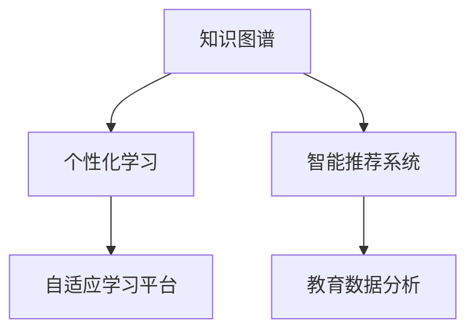

                 

# 知识图谱在教育中的应用：个性化学习的未来

> 关键词：知识图谱,个性化学习,教育,智能推荐,自适应学习,教育数据分析

## 1. 背景介绍

### 1.1 问题由来
随着信息技术的飞速发展，教育领域正经历着前所未有的变革。传统教育模式以教师讲授为主，学生自主学习为辅，难以满足每个学生的个性化需求，影响了学习效果和教育质量。而个性化学习（Personalized Learning）强调因材施教，通过技术手段为学生提供定制化的学习路径和资源，提升学习效率和效果。

知识图谱作为一种语义化、结构化的知识表示方法，为个性化学习提供了强有力的数据支撑。通过将教育知识、课程体系、学习者信息等构建成图谱，可以对学生进行精准画像，实现基于数据驱动的教育决策，进一步推动个性化学习的发展。

### 1.2 问题核心关键点
知识图谱在教育中的应用主要集中在以下几方面：

1. **知识表示与组织**：利用知识图谱将知识结构化表示，便于管理和检索。
2. **学习者画像构建**：通过分析学习者行为数据，构建动态学习者画像，实现个性化推荐。
3. **智能推荐系统**：结合知识图谱和机器学习算法，为学生推荐学习内容。
4. **自适应学习平台**：构建基于知识图谱的自适应学习平台，提供个性化学习路径。
5. **教育数据分析**：通过知识图谱挖掘教育数据中的知识关联，辅助教育决策。

### 1.3 问题研究意义
知识图谱在教育中的应用，有助于打破传统教育的固有框架，实现个性化、智能化、高效化的教学模式。具体意义如下：

1. **提高教育质量**：通过精准推荐，帮助学生掌握知识难点，提升学习效果。
2. **提升教学效率**：利用智能推荐系统，减轻教师负担，优化教学资源分配。
3. **促进教育公平**：通过个性化学习，缩小学习者之间的差距，提升教育公平性。
4. **推动教育创新**：结合最新技术，探索教育新模式，提升教育创新能力。

## 2. 核心概念与联系

### 2.1 核心概念概述

为更好地理解知识图谱在教育中的应用，本节将介绍几个关键概念：

- **知识图谱(Knowledge Graph)**：一种结构化的语义知识表示方法，通过节点和边来表示实体和它们之间的关系。
- **个性化学习(Personalized Learning)**：根据学生需求和特点，提供定制化的学习路径和资源，提升学习效果。
- **智能推荐系统(Intelligent Recommendation System)**：利用算法和模型，对用户进行行为分析，推荐相关内容或产品。
- **自适应学习平台(Adaptive Learning Platform)**：根据学生学习情况，自动调整学习内容和节奏，实现个性化教学。
- **教育数据分析(Education Data Analysis)**：通过数据分析挖掘教育中的知识关联，辅助教育决策。

这些概念之间的逻辑关系可以通过以下Mermaid流程图来展示：



这个流程图展示了几大核心概念之间的联系：

1. 知识图谱为个性化学习提供数据支撑。
2. 个性化学习通过智能推荐系统，实现知识图谱的灵活应用。
3. 自适应学习平台基于个性化学习策略，实现动态调整。
4. 教育数据分析利用知识图谱挖掘教育数据中的关联性。

## 3. 核心算法原理 & 具体操作步骤
### 3.1 算法原理概述

知识图谱在教育中的应用，主要依赖于以下几个核心算法：

1. **知识表示与构建算法**：将教育知识、课程体系等构建为知识图谱，形成结构化的知识库。
2. **学习者画像构建算法**：通过分析学生行为数据，构建动态学习者画像，实现个性化推荐。
3. **智能推荐算法**：利用协同过滤、深度学习等方法，为学生推荐相关学习资源。
4. **自适应学习算法**：根据学习者的反馈和进度，动态调整学习内容和节奏。
5. **教育数据分析算法**：通过图谱挖掘和统计分析，发现教育数据中的规律和趋势。

这些算法共同构成了知识图谱在教育中的完整应用框架，实现了个性化、智能化的学习体验。

### 3.2 算法步骤详解

知识图谱在教育中的应用可以分为以下几个关键步骤：

**Step 1: 知识图谱构建**
- 收集教育领域的各类知识，如课程、教师、教材、测评等，构建知识图谱的节点和边。
- 利用本体语言（如OWL、RDF）或图数据库（如Neo4j、ArangoDB）构建和管理知识图谱。

**Step 2: 学习者画像构建**
- 收集学生的学习数据，如成绩、答题情况、课堂表现等。
- 利用图算法，如PageRank、节点嵌入（如GNN）等，分析学生的行为特征，构建动态学习者画像。

**Step 3: 智能推荐系统**
- 根据学生的学习画像，利用协同过滤、基于内容的推荐、深度学习等算法，推荐相关学习资源。
- 使用在线学习平台，将推荐结果推送给学生，并提供反馈和调整机制。

**Step 4: 自适应学习平台**
- 利用机器学习算法，如决策树、随机森林、神经网络等，分析学生的学习进度和效果。
- 根据分析结果，动态调整学习内容和节奏，实现个性化学习路径。

**Step 5: 教育数据分析**
- 利用图谱挖掘算法，如知识图谱嵌入（如TransE、TransH），分析教育数据中的关联性。
- 结合统计分析方法，如聚类、分类、回归等，辅助教育决策和优化。

以上是知识图谱在教育中的主要应用步骤，每个步骤都需要根据具体场景进行优化和调整。

### 3.3 算法优缺点

知识图谱在教育中的应用具有以下优点：

1. **结构化表示**：知识图谱将教育知识结构化表示，便于管理和检索。
2. **灵活推荐**：智能推荐系统根据学生画像，实现个性化推荐，提升学习效果。
3. **自适应学习**：自适应学习平台根据学生反馈，动态调整学习路径，提高学习效率。
4. **数据驱动决策**：教育数据分析帮助教育者进行科学决策，优化教育资源配置。

同时，知识图谱在教育中也存在一些局限：

1. **构建复杂**：知识图谱的构建需要大量人力和时间，且需要专业知识。
2. **数据质量**：教育数据的质量和完整性影响知识图谱的准确性和实用性。
3. **更新困难**：知识图谱更新和维护需要持续的工作，否则影响推荐效果。
4. **隐私风险**：教育数据的隐私和安全问题，需严格遵守相关法律法规。

尽管存在这些局限性，但知识图谱在教育中的应用潜力依然巨大，可以显著提升教育的质量和效率。

### 3.4 算法应用领域

知识图谱在教育领域的应用覆盖了以下几个方面：

1. **个性化推荐系统**：利用知识图谱和智能推荐算法，为学生推荐个性化学习资源。
2. **自适应学习平台**：构建基于知识图谱的自适应学习平台，实现个性化学习路径。
3. **教育数据分析**：通过知识图谱挖掘教育数据中的关联性，辅助教育决策。
4. **课程设计**：利用知识图谱构建课程知识体系，优化课程设计和教学内容。
5. **智能辅导系统**：结合知识图谱和自然语言处理技术，实现智能辅导和学习支持。

除了上述这些应用外，知识图谱还被创新性地应用到更多教育场景中，如虚拟教室、虚拟实验、在线测验等，为教育技术的发展注入了新的活力。

## 4. 数学模型和公式 & 详细讲解 & 举例说明
### 4.1 数学模型构建

为了更好地理解知识图谱在教育中的应用，本节将使用数学语言对知识图谱的构建和应用进行更加严格的刻画。

定义教育知识图谱为一个三元组集合 $G=(V,E)$，其中 $V$ 表示节点集合，$E$ 表示边集合。每个节点 $v \in V$ 表示一个实体（如课程、教师、学生），每个边 $e \in E$ 表示两个实体之间的关系（如教师讲授课程、学生选修课程）。

**知识图谱构建算法**：
1. 收集教育领域的各种知识，形成实体和关系的集合。
2. 利用本体语言（如OWL）或图数据库（如Neo4j），构建知识图谱的数据模型。

**学习者画像构建算法**：
1. 收集学生的学习数据，如成绩、答题情况、课堂表现等，形成一个行为数据矩阵。
2. 利用图算法，如PageRank、节点嵌入（如GNN）等，分析学生的行为特征，构建动态学习者画像。

**智能推荐算法**：
1. 利用协同过滤、基于内容的推荐、深度学习等算法，分析学生的学习行为，生成推荐列表。
2. 使用在线学习平台，将推荐结果推送给学生，并提供反馈和调整机制。

**自适应学习算法**：
1. 利用机器学习算法，如决策树、随机森林、神经网络等，分析学生的学习进度和效果。
2. 根据分析结果，动态调整学习内容和节奏，实现个性化学习路径。

**教育数据分析算法**：
1. 利用图谱挖掘算法，如知识图谱嵌入（如TransE、TransH），分析教育数据中的关联性。
2. 结合统计分析方法，如聚类、分类、回归等，辅助教育决策和优化。

### 4.2 公式推导过程

以下我们以知识图谱推荐系统为例，推导协同过滤算法的公式。

假设知识图谱中的课程节点为 $C$，学生节点为 $S$，课程和学生的关系为 $(C,S)$。设课程 $c$ 的特征向量为 $v_c$，学生的特征向量为 $v_s$，则协同过滤算法中课程 $c$ 对学生 $s$ 的推荐度为：

$$
\text{rec}(s,c) = \frac{\mathbf{v}_s^T \mathbf{v}_c}{\|\mathbf{v}_s\|_2 \|\mathbf{v}_c\|_2}
$$

其中 $\mathbf{v}_s$ 和 $\mathbf{v}_c$ 分别为学生 $s$ 和课程 $c$ 的特征向量，$^T$ 表示转置操作，$\|\cdot\|_2$ 表示欧几里得范数。

通过上述公式，协同过滤算法根据学生的特征和课程的特征，计算出推荐度，进而实现课程推荐。

### 4.3 案例分析与讲解

**案例一：个性化推荐系统**

假设某在线教育平台收集了大量的课程和学生数据，构建了一个知识图谱。平台使用协同过滤算法，根据学生的学习行为数据，推荐个性化的课程。具体步骤如下：

1. 收集学生行为数据，如选修课程、答题情况、课堂表现等。
2. 利用协同过滤算法，计算学生对每门课程的推荐度。
3. 根据推荐度排序，将前 $N$ 门课程推荐给学生。
4. 学生可以查看推荐结果，并进行反馈和调整。

**案例二：自适应学习平台**

某在线教育平台开发了一个自适应学习系统，利用知识图谱和机器学习算法，实现动态调整学习路径。具体步骤如下：

1. 收集学生的学习数据，如考试成绩、答题时间、错误率等。
2. 利用机器学习算法，分析学生的学习进度和效果。
3. 根据分析结果，动态调整学习内容和节奏，生成个性化的学习路径。
4. 学生可以在系统中查看学习进度和建议，实现自主学习。

## 5. 项目实践：代码实例和详细解释说明
### 5.1 开发环境搭建

在进行教育应用开发前，我们需要准备好开发环境。以下是使用Python进行知识图谱开发的环境配置流程：

1. 安装Anaconda：从官网下载并安装Anaconda，用于创建独立的Python环境。

2. 创建并激活虚拟环境：
```bash
conda create -n kg-env python=3.8 
conda activate kg-env
```

3. 安装相关库：
```bash
pip install pykg \
pip install pytesseract \
pip install pymongo
```

4. 安装知识图谱工具包：
```bash
pip install geopython
```

5. 安装数据处理和分析工具：
```bash
pip install pandas numpy matplotlib seaborn
```

完成上述步骤后，即可在`kg-env`环境中开始知识图谱应用开发。

### 5.2 源代码详细实现

下面我们以推荐系统为例，给出使用Geopython进行知识图谱推荐系统的Python代码实现。

首先，定义推荐系统类：

```python
import geopython.graph as gp
import numpy as np
import pandas as pd

class RecommendationSystem:
    def __init__(self, kg):
        self.kg = kg
        self.graph = gp.create_graph(kg)

    def collaborative_filtering(self, user, num_recommendations=5):
        user_neighbors = self.graph.neighbors(user)
        similarities = self.calculate_similarities(user_neighbors)
        recommendations = self.calculate_recommendations(similarities, num_recommendations)
        return recommendations

    def calculate_similarities(self, neighbors):
        similarities = np.zeros((len(neighbors), len(neighbors)))
        for i in range(len(neighbors)):
            for j in range(len(neighbors)):
                similarities[i][j] = self.calculate_similarity(neighbors[i], neighbors[j])
        return similarities

    def calculate_similarity(self, user1, user2):
        items = set(self.graph.nodes[user1]) & set(self.graph.nodes[user2])
        common_items = len(items)
        divisor = np.sqrt(len(self.graph.nodes[user1]) + len(self.graph.nodes[user2]))
        if divisor == 0:
            return 0
        return common_items / divisor

    def calculate_recommendations(self, similarities, num_recommendations):
        recommendations = np.argsort(similarities)[::-1]
        recommendations = list(recommendations)[:num_recommendations]
        return list(self.graph.nodes.keys())[recommendations]
```

然后，定义数据处理和存储函数：

```python
from geopython import graph

def load_kg(kg_path):
    kg = graph.load_graph(kg_path)
    return kg

def load_student_data(student_path):
    df = pd.read_csv(student_path)
    return df

def load_course_data(course_path):
    df = pd.read_csv(course_path)
    return df
```

最后，启动推荐系统并输出推荐结果：

```python
kg_path = 'path/to/knowledge_graph'
student_path = 'path/to/student_data.csv'
course_path = 'path/to/course_data.csv'

kg = load_kg(kg_path)
students = load_student_data(student_path)
courses = load_course_data(course_path)

recommendation_system = RecommendationSystem(kg)

for user in students['user_id']:
    recommendations = recommendation_system.collaborative_filtering(user)
    print(f"Recommendations for user {user}: {recommendations}")
```

以上就是使用Geopython进行知识图谱推荐系统的完整代码实现。可以看到，Geopython为知识图谱的构建和查询提供了便捷的API，使得开发过程更为高效。

### 5.3 代码解读与分析

让我们再详细解读一下关键代码的实现细节：

**RecommendationSystem类**：
- `__init__`方法：初始化知识图谱和图结构。
- `collaborative_filtering`方法：实现协同过滤算法，计算推荐结果。
- `calculate_similarities`方法：计算节点之间的相似度。
- `calculate_similarity`方法：计算两个节点之间的相似度。
- `calculate_recommendations`方法：根据相似度计算推荐结果。

**load_kg函数**：
- 加载知识图谱文件，返回图结构。

**load_student_data和load_course_data函数**：
- 加载学生数据和课程数据，返回Pandas DataFrame。

**启动推荐系统**：
- 加载知识图谱和数据。
- 创建推荐系统对象。
- 循环遍历学生ID，输出推荐结果。

可以看到，Geopython为知识图谱的开发提供了丰富的工具和函数，使得知识图谱的应用开发变得更为简单和高效。

当然，工业级的系统实现还需考虑更多因素，如推荐结果的展示、用户反馈的收集与处理等。但核心的算法和开发过程基本与此类似。

## 6. 实际应用场景
### 6.1 智能推荐系统

智能推荐系统是知识图谱在教育中应用的重要方向。通过构建学生和课程的知识图谱，利用协同过滤等算法，可以高效地为学生推荐个性化的学习资源。

**案例一：在线教育平台**

某在线教育平台通过收集学生的学习行为数据，构建知识图谱。利用协同过滤算法，根据学生的学习行为，推荐个性化的课程。具体步骤如下：

1. 收集学生行为数据，如选修课程、答题情况、课堂表现等。
2. 利用协同过滤算法，计算学生对每门课程的推荐度。
3. 根据推荐度排序，将前 $N$ 门课程推荐给学生。
4. 学生可以查看推荐结果，并进行反馈和调整。

**案例二：图书馆推荐系统**

某大学图书馆通过收集学生的借阅历史数据，构建知识图谱。利用协同过滤算法，为学生推荐感兴趣的图书。具体步骤如下：

1. 收集学生借阅历史数据，如书名、借阅时间、借阅时长等。
2. 利用协同过滤算法，计算学生对每本书的推荐度。
3. 根据推荐度排序，将前 $N$ 本书推荐给学生。
4. 学生可以查看推荐结果，并进行反馈和调整。

### 6.2 自适应学习平台

自适应学习平台利用知识图谱和机器学习算法，动态调整学习路径，实现个性化教学。

**案例一：Khan Academy**

Khan Academy开发了一个自适应学习平台，利用知识图谱和机器学习算法，实现个性化学习路径。具体步骤如下：

1. 收集学生的学习数据，如考试成绩、答题时间、错误率等。
2. 利用机器学习算法，分析学生的学习进度和效果。
3. 根据分析结果，动态调整学习内容和节奏，生成个性化的学习路径。
4. 学生可以在系统中查看学习进度和建议，实现自主学习。

**案例二：Coursera**

Coursera开发了一个自适应学习平台，利用知识图谱和机器学习算法，实现个性化学习路径。具体步骤如下：

1. 收集学生的学习数据，如考试成绩、答题时间、错误率等。
2. 利用机器学习算法，分析学生的学习进度和效果。
3. 根据分析结果，动态调整学习内容和节奏，生成个性化的学习路径。
4. 学生可以在系统中查看学习进度和建议，实现自主学习。

### 6.3 教育数据分析

教育数据分析利用知识图谱挖掘教育数据中的关联性，辅助教育决策。

**案例一：学习分析系统**

某在线教育平台开发了一个学习分析系统，利用知识图谱和统计分析算法，发现教育数据中的规律和趋势。具体步骤如下：

1. 收集学生的学习数据，如考试成绩、答题时间、错误率等。
2. 利用知识图谱挖掘算法，分析教育数据中的关联性。
3. 结合统计分析方法，发现教育数据中的规律和趋势。
4. 教育者根据分析结果，优化教学资源配置，提高教育效果。

**案例二：教育质量监控系统**

某教育部门开发了一个教育质量监控系统，利用知识图谱和统计分析算法，监控教育质量。具体步骤如下：

1. 收集学校的教育数据，如师资情况、教学设施、学生成绩等。
2. 利用知识图谱挖掘算法，分析教育数据中的关联性。
3. 结合统计分析方法，发现教育质量中的问题。
4. 教育部门根据分析结果，优化教育资源配置，提升教育质量。

## 7. 工具和资源推荐
### 7.1 学习资源推荐

为了帮助开发者系统掌握知识图谱在教育中的应用，这里推荐一些优质的学习资源：

1. 《知识图谱》系列书籍：涵盖知识图谱的基本概念、构建方法、应用场景等，适合初学者入门。
2. 《教育数据挖掘》课程：由教育领域专家讲授，涵盖教育数据的挖掘和分析方法，适合研究者和实践者学习。
3. 《智能推荐系统》书籍：详细介绍了协同过滤、基于内容的推荐、深度学习等推荐算法，适合了解推荐系统原理。
4. 《自适应学习》课程：介绍自适应学习的基本原理和实现方法，适合了解自适应学习应用。
5. 《教育数据分析》书籍：详细介绍了教育数据分析的方法和技术，适合了解教育数据的应用场景。

通过对这些资源的学习实践，相信你一定能够快速掌握知识图谱在教育中的应用精髓，并用于解决实际的NLP问题。
###  7.2 开发工具推荐

高效的开发离不开优秀的工具支持。以下是几款用于知识图谱开发的工具：

1. Neo4j：领先的开源图形数据库，支持丰富的图算法和查询语言，适合大规模图谱应用。
2. ArangoDB：面向文档的图形数据库，支持灵活的存储模式，适合多数据源的集成。
3. Gephi：开源的图形可视化工具，支持多种数据格式和算法，适合数据探索和可视化。
4. TensorFlow：深度学习框架，支持图神经网络等算法，适合知识图谱的深度学习应用。
5. PyTorch：深度学习框架，支持图神经网络等算法，适合知识图谱的深度学习应用。

合理利用这些工具，可以显著提升知识图谱的应用开发效率，加速创新迭代的步伐。

### 7.3 相关论文推荐

知识图谱在教育中的应用源于学界的持续研究。以下是几篇奠基性的相关论文，推荐阅读：

1. Pereira et al.（2018）: "Knowledge Graphs in Educational Research: A Survey and Systematic Mapping"
2. Bordes et al.（2013）: "Translating Concepts from Natural Language to Learning Graphs"
3. Resnick et al.（2014）: "Learning to Learn with Knowledge Graphs"
4. Etzioni et al.（2013）: "Knowledge Graphs for Higher Education"
5. Paul et al.（2016）: "Graph-Based Recommendation Algorithms for Personalized Learning"

这些论文代表了大语言模型微调技术的发展脉络。通过学习这些前沿成果，可以帮助研究者把握学科前进方向，激发更多的创新灵感。

## 8. 总结：未来发展趋势与挑战
### 8.1 总结

本文对知识图谱在教育中的应用进行了全面系统的介绍。首先阐述了知识图谱和个性化学习的研究背景和意义，明确了知识图谱在教育中的应用场景和关键技术。其次，从原理到实践，详细讲解了知识图谱在教育中的应用流程和具体实现方法。最后，讨论了知识图谱在教育中面临的挑战和未来发展方向，强调了技术创新和产业应用的重要性。

通过本文的系统梳理，可以看到，知识图谱在教育中的应用具有广阔的前景和重大的价值。其在个性化推荐、自适应学习、教育数据分析等方面的应用，将为教育领域带来深远的变革。未来，随着知识图谱技术的不断进步，将进一步推动教育智能化、个性化、高效化的发展，提升教育质量和公平性。

### 8.2 未来发展趋势

展望未来，知识图谱在教育中的应用将呈现以下几个发展趋势：

1. **动态知识图谱**：构建动态知识图谱，实时更新教育数据，保持图谱的时效性和准确性。
2. **多源知识融合**：将不同来源的教育数据进行融合，形成更加全面的知识图谱，提升推荐效果。
3. **自适应学习**：利用知识图谱和机器学习算法，实现更加智能化的自适应学习路径。
4. **知识迁移**：通过知识图谱实现知识迁移，帮助学生快速掌握新知识。
5. **跨领域应用**：将知识图谱应用于更多教育领域，如职业培训、终身教育等，提升教育的多样性和灵活性。

以上趋势凸显了知识图谱在教育中的重要价值和巨大潜力，将进一步推动教育智能化、个性化、高效化的发展。

### 8.3 面临的挑战

尽管知识图谱在教育中的应用潜力巨大，但在迈向更加智能化、普适化应用的过程中，它仍面临着诸多挑战：

1. **数据质量问题**：教育数据的完整性和准确性直接影响知识图谱的构建和应用效果。
2. **知识图谱构建难度**：知识图谱的构建需要大量人力和时间，且需要专业知识。
3. **隐私和安全问题**：教育数据的隐私和安全问题，需严格遵守相关法律法规。
4. **技术门槛高**：知识图谱和相关算法的实现门槛较高，需具备一定的技术基础。
5. **资源需求高**：知识图谱的构建和应用需要大量计算资源和存储空间。

尽管存在这些挑战，但随着技术的发展和应用的深入，知识图谱在教育中的应用将更加广泛和深入。

### 8.4 研究展望

面对知识图谱在教育中面临的挑战，未来的研究需要在以下几个方面寻求新的突破：

1. **自动化知识图谱构建**：通过自动化方法，降低知识图谱构建的人力成本和时间成本。
2. **知识图谱嵌入**：利用知识图谱嵌入技术，提升知识图谱的表示能力和应用效果。
3. **跨领域知识融合**：将不同领域的数据进行融合，构建更加全面的知识图谱。
4. **自适应学习算法**：开发更加智能化的自适应学习算法，提升学习效果。
5. **隐私保护机制**：设计更加安全的隐私保护机制，保护教育数据的隐私和安全。

这些研究方向的探索，必将引领知识图谱在教育中的应用迈向更高的台阶，为教育智能化、个性化、高效化的发展铺平道路。面向未来，知识图谱需要与其他人工智能技术进行更深入的融合，如自然语言处理、深度学习等，共同推动教育技术的进步。只有勇于创新、敢于突破，才能不断拓展知识图谱在教育中的应用边界，让教育技术更好地造福人类社会。

## 9. 附录：常见问题与解答
**Q1：什么是知识图谱？**

A: 知识图谱是一种结构化的语义知识表示方法，通过节点和边来表示实体和它们之间的关系。

**Q2：知识图谱在教育中的应用有哪些？**

A: 知识图谱在教育中的应用主要包括个性化推荐系统、自适应学习平台、教育数据分析等。

**Q3：知识图谱的构建有哪些步骤？**

A: 知识图谱的构建包括收集教育领域的各类知识，构建知识图谱的节点和边，利用本体语言或图数据库进行存储和管理。

**Q4：如何缓解知识图谱的隐私和安全问题？**

A: 教育数据的隐私和安全问题需严格遵守相关法律法规，采取数据加密、匿名化等措施保护数据隐私。

**Q5：知识图谱的未来发展趋势有哪些？**

A: 知识图谱的未来发展趋势包括动态知识图谱、多源知识融合、自适应学习、知识迁移、跨领域应用等。

---

作者：禅与计算机程序设计艺术 / Zen and the Art of Computer Programming

