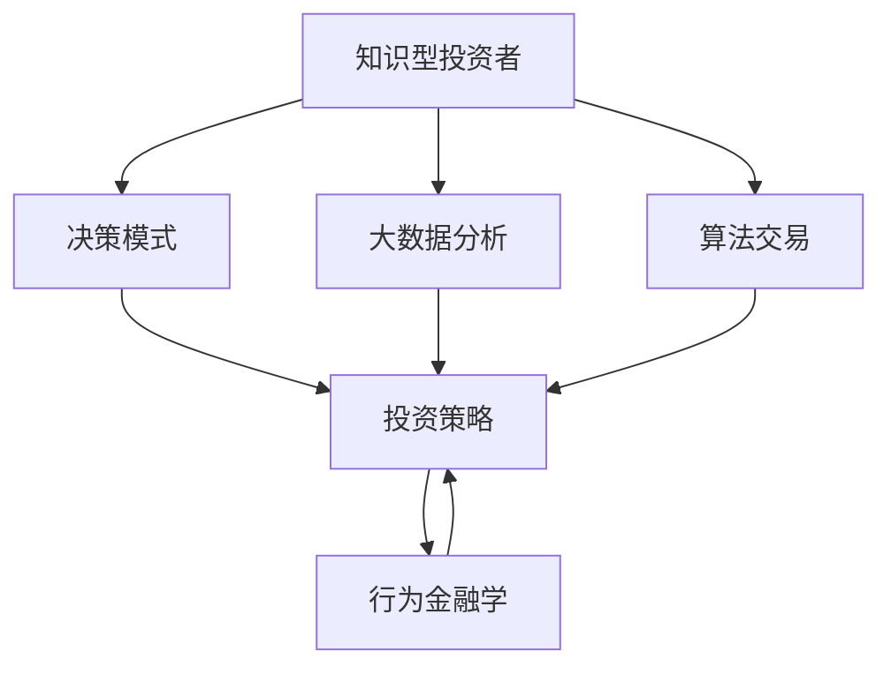

                 

# 知识型投资者的决策模式研究

> 关键词：知识型投资者,决策模式,投资策略,行为金融学,风险管理,大数据分析,算法交易

## 1. 背景介绍

### 1.1 问题由来

随着金融市场的不断发展和全球经济一体化的加深，越来越多的投资者开始转向以知识和数据分析为基础的智能投资策略。知识型投资者不再单纯依赖直觉和经验，而是借助先进的技术手段和数据驱动的方法，通过深度学习和人工智能模型来辅助决策。这种转变不仅提升了投资效率，也带来了诸多前所未有的挑战。如何在保证投资收益的同时，控制风险，制定出更加科学合理的投资策略，成为了知识型投资者决策过程中亟需解决的问题。

### 1.2 问题核心关键点

知识型投资者决策模式的研究，旨在理解投资者如何利用知识与数据分析来形成投资判断，进而优化投资策略，提高投资回报。核心问题包括：

- 知识型投资者的决策过程有哪些特点？
- 投资策略的设计和评估应遵循哪些原则？
- 如何通过大数据和算法优化投资决策？
- 风险管理的有效策略是什么？

这些问题的研究，有助于揭示知识型投资者决策行为的本质，为构建智能投资系统提供理论基础和实践指导。

## 2. 核心概念与联系

### 2.1 核心概念概述

在研究知识型投资者的决策模式时，需要涉及多个关键概念：

- **知识型投资者**：利用专业知识和技术手段，通过数据分析和模型优化来辅助决策的投资者。
- **决策模式**：投资者在面对市场变化和信息更新时，依据个人知识、经验和模型输出的投资策略。
- **投资策略**：根据市场动态和个人偏好，制定的具体投资行动方案，包括资产配置、交易时机选择等。
- **行为金融学**：研究投资者心理和行为对金融市场影响的学科，强调投资者非理性行为对市场波动的影响。
- **大数据分析**：通过收集和分析海量金融数据，揭示市场规律，辅助投资决策。
- **算法交易**：使用计算机算法自动执行交易指令，提高交易效率和策略执行的准确性。

这些概念之间的联系可以通过以下Mermaid流程图来展示：



这个流程图展示了知识型投资者的决策模式如何通过行为金融学、大数据分析、算法交易等方法和理论进行构建和优化，最终形成和调整投资策略。

## 3. 核心算法原理 & 具体操作步骤
### 3.1 算法原理概述

知识型投资者的决策模式研究，本质上是投资策略的优化过程。其核心算法原理包括以下几个方面：

- **模型训练与优化**：通过历史数据训练出预测模型，不断优化模型参数，以提高预测的准确性和泛化能力。
- **风险评估与控制**：利用风险管理技术，如VaR（Value at Risk）、ES（Expected Shortfall）等，评估和控制投资风险。
- **策略回测与调整**：对投资策略进行回测，评估历史表现，根据回测结果和市场动态调整策略。

### 3.2 算法步骤详解

知识型投资者的决策模式研究，涉及多个步骤，具体步骤如下：

1. **数据准备**：收集和清洗历史市场数据、公司财务数据、新闻资讯等，准备用于模型训练和策略评估的数据集。
2. **特征工程**：根据领域知识和经验，选择和构造影响投资决策的关键特征，包括市场指数、行业动态、公司基本面等。
3. **模型训练**：选择合适的机器学习或深度学习模型，如线性回归、随机森林、LSTM、Transformer等，对历史数据进行训练，得到预测模型。
4. **策略设计**：根据预测模型和市场理解，设计出具体的投资策略，如趋势跟踪、价值投资、套利等。
5. **风险评估**：利用风险管理工具评估策略的风险水平，确定风险承受能力。
6. **策略回测**：对投资策略进行回测，评估其历史表现和风险水平。
7. **策略调整**：根据回测结果和市场动态，调整投资策略，优化模型参数，提高策略的有效性。

### 3.3 算法优缺点

知识型投资者决策模式研究中使用的算法，具有以下优缺点：

**优点**：
- **效率高**：通过大数据分析和算法交易，可以自动化地处理大量数据，快速生成投资建议。
- **准确性好**：利用先进模型和算法，提高了投资预测的准确性和泛化能力。
- **可解释性强**：现代算法模型能够提供决策依据和逻辑解释，便于投资者理解和调整策略。

**缺点**：
- **模型依赖**：算法的性能和结果依赖于训练数据的质量和模型选择，存在一定的过拟合风险。
- **市场波动**：市场动态和信息更新迅速，算法模型需要频繁调整，增加了策略调整的复杂性。
- **数据需求大**：大数据分析需要大量的历史和实时数据，数据收集和处理成本较高。

### 3.4 算法应用领域

知识型投资者决策模式的研究，涵盖了多个应用领域，具体包括：

- **资产配置与组合优化**：通过分析不同资产的历史表现和风险特征，构建最优资产配置策略。
- **市场趋势预测**：利用大数据分析和模型，预测市场趋势和价格波动，指导投资时机选择。
- **风险管理与控制**：通过量化风险评估工具，控制投资组合的风险水平，避免大幅回撤。
- **算法交易与高频交易**：使用计算机算法自动化执行交易指令，提高交易效率和策略执行的准确性。
- **量化对冲策略**：通过量化模型实现对冲策略，降低投资组合的系统性风险。

## 4. 数学模型和公式 & 详细讲解 & 举例说明

### 4.1 数学模型构建

在知识型投资者决策模式研究中，常用的数学模型包括线性回归模型、随机森林、LSTM等。这里以线性回归模型为例，展示其基本构建过程。

设投资组合的收益率为 $Y$，影响因素为 $X_1, X_2, ..., X_n$，则线性回归模型为：

$$
Y = \beta_0 + \beta_1X_1 + \beta_2X_2 + ... + \beta_nX_n + \epsilon
$$

其中，$\beta_0$ 为截距，$\beta_i$ 为回归系数，$\epsilon$ 为误差项。

### 4.2 公式推导过程

线性回归模型的推导过程如下：

1. 设定模型形式，写出样本数据的线性回归方程。
2. 通过最小二乘法计算回归系数 $\beta_i$。
3. 计算回归方程的标准误差 $\sigma$。
4. 利用显著性检验和拟合优度检验，评估模型的可靠性和有效性。

### 4.3 案例分析与讲解

以股票市场趋势预测为例，假设有 $n=5$ 个影响因素：市盈率（PE）、市净率（PB）、盈利增长率（EPS）、股息率（DIV）和市场指数（INDEX）。

构建线性回归模型：

$$
\text{Return} = \beta_0 + \beta_1 \text{PE} + \beta_2 \text{PB} + \beta_3 \text{EPS} + \beta_4 \text{DIV} + \beta_5 \text{INDEX} + \epsilon
$$

通过最小二乘法求解 $\beta_i$，得到回归方程，并进行显著性检验和拟合优度检验，得到模型参数。

## 5. 项目实践：代码实例和详细解释说明
### 5.1 开发环境搭建

在开始项目实践前，需要搭建开发环境，主要步骤如下：

1. 安装Python和相关依赖包，如NumPy、Pandas、Scikit-learn、TensorFlow等。
2. 搭建数据库，用于存储和查询历史市场数据和公司财务数据。
3. 搭建数据处理和分析平台，如Jupyter Notebook或Google Colab。
4. 安装相关的深度学习框架，如TensorFlow、PyTorch等，准备进行模型训练。

### 5.2 源代码详细实现

以LSTM模型为例，展示投资组合收益率的预测过程：

```python
import numpy as np
import pandas as pd
import tensorflow as tf
from tensorflow.keras.models import Sequential
from tensorflow.keras.layers import LSTM, Dense

# 数据准备
data = pd.read_csv('stock_data.csv')
X = data[['PE', 'PB', 'EPS', 'DIV', 'INDEX']]
Y = data['Return']

# 特征处理
X = (X - X.mean()) / X.std()

# 划分训练集和测试集
train_size = int(len(X) * 0.7)
X_train, Y_train = X.iloc[:train_size], Y.iloc[:train_size]
X_test, Y_test = X.iloc[train_size:], Y.iloc[train_size:]

# 构建LSTM模型
model = Sequential()
model.add(LSTM(64, input_shape=(5, 1), return_sequences=True))
model.add(LSTM(64, return_sequences=True))
model.add(LSTM(64))
model.add(Dense(1))

# 模型训练
model.compile(loss='mse', optimizer='adam')
model.fit(X_train, Y_train, epochs=50, batch_size=64)

# 模型评估
mse = model.evaluate(X_test, Y_test, verbose=0)[0]
print('Mean Squared Error:', mse)
```

### 5.3 代码解读与分析

在代码中，我们首先从CSV文件中读取股票数据，并进行了标准化处理。然后，将数据划分为训练集和测试集，并构建了一个包含三个LSTM层和两个全连接层的深度学习模型。通过最小二乘法训练模型，并计算了测试集上的均方误差。

## 6. 实际应用场景
### 6.1 智能投资组合管理

知识型投资者可以利用大数据分析和算法交易技术，构建智能投资组合管理策略。通过分析市场动态和公司基本面，智能系统可以自动进行资产配置和动态调整，优化投资组合的表现。

### 6.2 量化高频交易

高频交易是知识型投资者常用的策略之一，通过算法自动执行高频交易指令，捕捉市场微小波动。量化高频交易策略的有效性依赖于算法模型的优化和数据处理的质量。

### 6.3 智能风险管理

知识型投资者可以利用量化风险评估工具，实时监控投资组合的风险水平，动态调整仓位和策略，避免大幅回撤。智能风险管理可以显著提高投资的安全性和稳定性。

### 6.4 未来应用展望

未来，随着技术的发展和数据的积累，知识型投资者决策模式将向智能化、个性化和实时化方向发展。通过更先进的算法和更丰富的数据，可以构建更加精确和灵活的投资策略，提升投资回报和风险控制能力。

## 7. 工具和资源推荐
### 7.1 学习资源推荐

1. 《行为金融学》一书：介绍了行为金融学的基本概念和理论，帮助理解投资者的心理和行为。
2. 《机器学习实战》一书：提供了实用的机器学习算法和代码实现，适合实践学习。
3. Kaggle竞赛平台：提供了大量的金融数据集和竞赛项目，可以练习和验证投资策略。
4. Coursera上的金融工程和数据科学课程：提供了系统的金融数据分析和建模课程。

### 7.2 开发工具推荐

1. Jupyter Notebook：提供交互式编程环境，方便数据处理和模型训练。
2. Google Colab：提供免费的GPU和TPU资源，方便深度学习实验和模型训练。
3. TensorFlow和PyTorch：提供强大的深度学习框架，支持各种复杂模型的构建和训练。

### 7.3 相关论文推荐

1. 《行为金融学》（Behaving Money）一书：介绍了行为金融学的基本概念和理论，帮助理解投资者的心理和行为。
2. 《大数据与投资决策》一书：介绍了大数据分析在投资决策中的应用。
3. 《深度学习在金融市场中的应用》一书：介绍了深度学习在金融市场中的各种应用，包括算法交易和风险管理。

## 8. 总结：未来发展趋势与挑战
### 8.1 总结

本文对知识型投资者的决策模式进行了系统的研究，探讨了投资者如何利用知识和数据分析进行投资决策，优化投资策略。通过数学模型和代码实例，展示了投资组合收益率的预测过程和策略评估方法。同时，讨论了未来发展的趋势和面临的挑战，为投资者提供理论和实践指导。

### 8.2 未来发展趋势

未来，知识型投资者决策模式将呈现以下几个发展趋势：

1. **算法优化**：随着算法的不断优化，智能投资策略将更加精确和高效。
2. **数据丰富化**：大数据分析将提供更丰富的市场信息和公司数据，支持更加灵活和智能的投资策略。
3. **模型泛化**：新型算法模型将具有更强的泛化能力，可以适应不同市场和资产。
4. **多模态融合**：结合多种数据类型和信息源，实现多模态数据融合，提升决策的全面性和准确性。

### 8.3 面临的挑战

尽管知识型投资者决策模式研究取得了显著进展，但在未来发展过程中，仍面临以下挑战：

1. **数据质量**：高质量数据是算法模型优化的基础，但数据的收集和处理成本较高。
2. **模型复杂性**：复杂算法模型的开发和调试难度较大，需要丰富的经验和知识。
3. **市场波动**：市场动态和信息更新迅速，算法模型需要频繁调整，增加了策略调整的复杂性。
4. **算法鲁棒性**：算法模型对异常数据和噪声的鲁棒性不足，可能影响投资决策。
5. **隐私保护**：在数据共享和模型训练过程中，隐私保护问题需引起重视。

### 8.4 研究展望

未来，知识型投资者决策模式研究需要在以下几个方面寻求新的突破：

1. **算法透明性**：提高算法的透明性和可解释性，便于投资者理解和调整策略。
2. **模型集成**：结合多种算法和模型，构建更全面和灵活的投资策略。
3. **多目标优化**：在追求投资回报的同时，更加注重风险管理和伦理道德。
4. **社会责任**：关注算法模型的社会影响和伦理问题，确保技术应用的公平性和普适性。

总之，知识型投资者决策模式研究是一个跨学科的领域，需要多方面协同创新，才能实现智能投资策略的可持续发展。

## 9. 附录：常见问题与解答

**Q1: 知识型投资者如何构建投资策略？**

A: 知识型投资者可以采用以下步骤构建投资策略：
1. 收集和清洗市场数据和公司财务数据。
2. 选择和构造影响投资决策的关键特征。
3. 使用机器学习或深度学习模型，对历史数据进行训练和预测。
4. 根据模型输出和市场理解，设计具体的投资策略，如趋势跟踪、价值投资等。
5. 对投资策略进行回测和调整，优化模型参数。

**Q2: 如何评估投资策略的有效性？**

A: 投资策略的有效性可以通过以下指标评估：
1. 历史回测表现，包括年化收益率、最大回撤、夏普比率等。
2. 风险评估指标，如VaR、ES等。
3. 策略优化后的实际表现，进行实证检验。

**Q3: 如何避免算法过拟合？**

A: 避免算法过拟合的常用方法包括：
1. 数据增强，如数据扩充、回译等。
2. 正则化技术，如L2正则、Dropout等。
3. 模型裁剪和剪枝，去除不重要的特征和参数。
4. 使用交叉验证和网格搜索，优化模型参数。

**Q4: 算法交易和量化高频交易有什么优缺点？**

A: 算法交易和量化高频交易的优缺点如下：
优点：
1. 提高交易效率，减少人为错误。
2. 策略执行准确性高，减少市场噪声影响。
3. 可以捕捉市场微小波动，获取额外收益。
缺点：
1. 需要高频数据和计算资源，成本较高。
2. 策略设计复杂，需要丰富的知识和经验。
3. 存在滑点、延迟等问题，可能导致交易损失。

**Q5: 如何进行风险管理？**

A: 风险管理可以通过以下方法实现：
1. 量化风险评估工具，如VaR、ES等。
2. 动态调整仓位，避免大幅回撤。
3. 分散投资，降低系统性风险。
4. 定期回测和调整策略，及时发现风险。

总之，知识型投资者决策模式研究是一个复杂而富有挑战性的领域，需要结合多种学科的知识和技术手段，才能实现智能投资策略的有效性和稳定性。

---

作者：禅与计算机程序设计艺术 / Zen and the Art of Computer Programming

