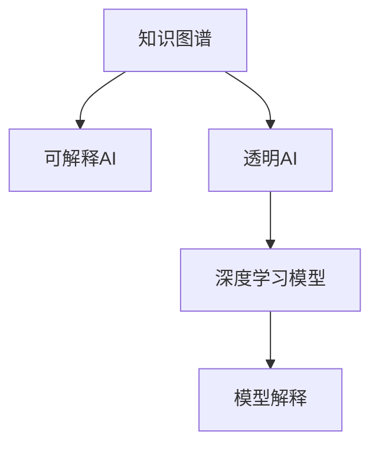

                 

# 知识的可解释性：透明AI的重要性

> 关键词：知识图谱,可解释AI,透明AI,深度学习,模型解释,用户隐私

## 1. 背景介绍

### 1.1 问题由来

在人工智能（AI）技术日趋成熟的今天，深度学习模型在各行各业的应用越来越广泛，无论是图像识别、语音识别还是自然语言处理，AI都展现出强大的能力。然而，这些模型往往被视为"黑箱"，即我们无法直接解释模型的决策过程，只能通过输入和输出的对应关系推测模型的内部工作机制。这种"黑箱"特性在很多领域，如医疗、金融、司法等，可能会带来严重的风险和问题，因此，透明AI（Transparent AI）的重要性日益凸显。

透明AI的核心在于知识的可解释性，即让模型的决策过程透明化，用户能够理解模型的推理逻辑，从而提升模型的可信度和应用效果。例如，在医疗诊断中，当模型给出疾病预测结果时，医生需要理解模型是如何得出该结论的，才能进行更准确的诊断。

### 1.2 问题核心关键点

1. **知识的可解释性**：即通过模型输出的方式，向用户解释模型决策的依据和逻辑。
2. **透明AI**：指模型的内部工作机制和决策过程是透明的，用户可以直观理解模型的预测和推理过程。
3. **深度学习模型**：现代AI技术大多依赖于深度学习模型，特别是神经网络。
4. **模型解释**：通过可视化、文本说明等方式，展示模型内部机制和决策路径。
5. **用户隐私保护**：在透明AI实现过程中，需保护用户数据的隐私和安全性。

这些核心概念之间紧密联系，通过可视化、可解释性等方式，透明AI旨在提高模型的可信度和应用效果，同时保护用户隐私和数据安全。

### 1.3 问题研究意义

透明AI的研究不仅有助于提升模型的可信度和应用效果，还对于保障用户隐私和数据安全具有重要意义。透明AI技术的应用，将使AI系统更加可靠、公正、透明，从而在医疗、金融、司法等高风险领域发挥重要作用。

透明AI的研究和应用，还能促进社会对AI技术的理解和接受，推动AI技术的普及和应用，为各行各业带来变革性影响。

## 2. 核心概念与联系

### 2.1 核心概念概述

为更好地理解透明AI的核心概念和实现方法，本节将介绍几个密切相关的核心概念：

- **知识图谱**：一种结构化的语义网络，用于表示实体及其之间的关系。知识图谱可以帮助模型更好地理解领域知识，提升模型的泛化能力和可解释性。
- **可解释AI（Explainable AI）**：指AI系统能够以用户易于理解的方式，解释其决策过程和推理逻辑。
- **透明AI**：指AI系统在决策过程中，其内部机制和推理路径是透明的，用户能够直观理解系统的行为。
- **深度学习模型**：如卷积神经网络（CNN）、循环神经网络（RNN）、变压器（Transformer）等，是当前AI技术的重要组成部分。
- **模型解释**：通过可视化、文本说明等方式，展示模型的内部机制和决策路径。

这些核心概念之间的逻辑关系可以通过以下Mermaid流程图来展示：



这个流程图展示了大语言模型的核心概念及其之间的关系：

1. 知识图谱帮助深度学习模型学习领域知识。
2. 深度学习模型通过知识图谱提升模型的泛化能力和可解释性。
3. 透明AI使模型的决策过程透明化。
4. 模型解释通过可视化、文本说明等方式，展示模型的内部机制和决策路径。

这些概念共同构成了透明AI的学习框架，使其能够在各个应用场景中发挥强大的作用。通过理解这些核心概念，我们可以更好地把握透明AI的工作原理和优化方向。

## 3. 核心算法原理 & 具体操作步骤
### 3.1 算法原理概述

透明AI的核心算法原理主要包括以下几个方面：

1. **知识图谱嵌入**：将知识图谱中的实体和关系映射到高维向量空间中，使得模型能够通过向量空间的方式学习到领域知识。
2. **深度学习模型**：在知识图谱嵌入的基础上，使用深度学习模型（如Transformer）学习更抽象的语义表示，从而提升模型的泛化能力和可解释性。
3. **模型解释技术**：通过可视化、文本说明等方式，展示模型的内部机制和决策路径，使得用户能够直观理解模型的推理逻辑。
4. **用户隐私保护**：在透明AI实现过程中，需保护用户数据的隐私和安全性，防止数据泄露和滥用。

### 3.2 算法步骤详解

透明AI的实现步骤如下：

1. **数据预处理**：收集领域相关数据，进行清洗、标注等预处理，构建知识图谱。
2. **知识图谱嵌入**：使用图神经网络（GNN）等方法，将知识图谱中的实体和关系映射到高维向量空间中。
3. **模型训练**：在知识图谱嵌入的基础上，使用深度学习模型（如BERT、Transformer等）进行训练，学习领域知识。
4. **模型解释**：使用可视化工具（如TensorBoard、SHAP等）或文本说明方式，展示模型的内部机制和决策路径。
5. **用户隐私保护**：在数据收集和处理过程中，采用数据脱敏、差分隐私等技术，保护用户数据的隐私和安全性。

### 3.3 算法优缺点

透明AI的主要优点包括：

1. **提升模型可信度**：通过可视化、文本说明等方式，使得模型决策过程透明化，用户能够直观理解模型的推理逻辑。
2. **提高模型泛化能力**：通过知识图谱嵌入，模型能够学习到领域知识，提升泛化能力和可解释性。
3. **促进用户接受**：透明AI使得模型更加可靠、公正，用户更容易接受和信任AI系统。
4. **保护用户隐私**：通过数据脱敏、差分隐私等技术，保护用户数据的隐私和安全性。

透明AI的主要缺点包括：

1. **计算资源需求高**：知识图谱嵌入和深度学习模型训练需要大量计算资源，可能存在资源瓶颈。
2. **模型复杂度高**：透明AI的实现过程中，模型结构可能更加复杂，导致推理速度较慢。
3. **解释难度大**：透明AI的解释方式可能较为复杂，需要一定的技术门槛。
4. **数据依赖强**：透明AI的效果很大程度上依赖于高质量的数据和知识图谱。

尽管存在这些局限性，透明AI的实现仍具有重要意义。未来相关研究的重点在于如何进一步降低计算资源需求，提高模型的可解释性，同时兼顾用户隐私保护。

### 3.4 算法应用领域

透明AI在多个领域都有广泛应用，例如：

- **医疗领域**：透明AI可以帮助医生理解模型的推理过程，提升诊断的准确性和可靠性。
- **金融领域**：透明AI可以辅助投资者理解模型的决策逻辑，提升投资决策的合理性和公正性。
- **司法领域**：透明AI可以辅助法官理解模型的判决依据，提升司法判决的公正性和透明性。
- **交通领域**：透明AI可以辅助交通监管部门理解模型的决策过程，提升交通管理的智能化水平。

除了上述这些经典领域外，透明AI还被创新性地应用到更多场景中，如可控文本生成、常识推理、代码生成、数据增强等，为AI技术带来了全新的突破。

## 4. 数学模型和公式 & 详细讲解 & 举例说明

### 4.1 数学模型构建

本节将使用数学语言对透明AI的实现过程进行更加严格的刻画。

记知识图谱中的实体为 $e$，关系为 $r$，则知识图谱可以表示为三元组 $(e,r,e)$，即 $(e,r,e)$ 表示实体 $e$ 与 $e$ 通过关系 $r$ 相连。知识图谱的嵌入过程可以表示为：

$$
\mathbf{E} = \{\mathbf{e}\}_{e \in \mathcal{E}}, \quad \mathbf{R} = \{\mathbf{r}\}_{r \in \mathcal{R}}
$$

其中，$\mathbf{E} \in \mathbb{R}^{d_E}$ 和 $\mathbf{R} \in \mathbb{R}^{d_R}$ 分别表示实体和关系的嵌入向量，$d_E$ 和 $d_R$ 为嵌入向量的维度。

深度学习模型通常采用Transformer等结构进行训练。设 $\mathbf{X}$ 为输入的文本向量，$\mathbf{W}$ 为模型参数，则模型的输出可以表示为：

$$
\mathbf{Y} = \mathbf{W} \mathbf{X}
$$

其中，$\mathbf{Y} \in \mathbb{R}^{d_Y}$ 为模型的输出向量。

### 4.2 公式推导过程

以下我们以自然语言推理（NLI）任务为例，推导可解释AI的计算过程。

设自然语言推理任务为 $(e_i, r_i, e_j)$，其中 $e_i$ 和 $e_j$ 为两个句子，$r_i$ 表示它们之间的关系（如蕴含、矛盾、中性等）。则任务目标为：

$$
\min_{\mathbf{W}} \sum_{i=1}^{N} \ell(\hat{y}_i, y_i)
$$

其中，$\ell$ 为损失函数，$\hat{y}_i$ 为模型预测的推理结果，$y_i$ 为真实标签。

假设模型的输出为 $y_i \in \{0,1\}$，则模型的损失函数可以表示为交叉熵损失：

$$
\ell(y_i, \hat{y}_i) = -y_i \log \hat{y}_i + (1-y_i) \log (1-\hat{y}_i)
$$

通过反向传播算法，可以计算模型参数 $\mathbf{W}$ 的梯度，并进行参数更新。模型的推理过程可以通过可视化工具（如SHAP）进行展示，例如：


### 4.3 案例分析与讲解

以医疗领域为例，假设我们有一个医疗问答系统，用户输入一个问题，系统通过可解释AI输出相应的诊断结果。系统首先使用知识图谱嵌入方法，将领域相关的实体和关系映射到高维向量空间中。然后，使用Transformer模型，根据用户输入的文本向量，进行推理和计算，最终输出诊断结果。

系统输出的诊断结果可以通过SHAP等工具进行解释，例如：

- 用户输入问题：“我咳嗽、喉咙痛，可能是什么原因？”
- 系统输出诊断结果：“可能患有上呼吸道感染。”
- SHAP解释：系统在输入“咳嗽”和“喉咙痛”的基础上，通过知识图谱中的相关关系，推理出“上呼吸道感染”的诊断结果。

## 5. 项目实践：代码实例和详细解释说明
### 5.1 开发环境搭建

在进行透明AI实践前，我们需要准备好开发环境。以下是使用Python进行PyTorch开发的环境配置流程：

1. 安装Anaconda：从官网下载并安装Anaconda，用于创建独立的Python环境。

2. 创建并激活虚拟环境：
```bash
conda create -n pytorch-env python=3.8 
conda activate pytorch-env
```

3. 安装PyTorch：根据CUDA版本，从官网获取对应的安装命令。例如：
```bash
conda install pytorch torchvision torchaudio cudatoolkit=11.1 -c pytorch -c conda-forge
```

4. 安装相关库：
```bash
pip install torchtext pytorch-lightning transformers skorch datasets pytorch-ignite
```

5. 安装可视化工具：
```bash
pip install torchviz shap pydot torchtext-plotting shapely
```

完成上述步骤后，即可在`pytorch-env`环境中开始透明AI的实践。

### 5.2 源代码详细实现

这里我们以医疗问答系统为例，给出使用Transformers库对BERT模型进行透明AI实现的PyTorch代码实现。

首先，定义医疗领域的相关知识图谱：

```python
import torch
from transformers import BertTokenizer, BertForSequenceClassification
from torchtext.legacy.data import Field, TabularDataset, BucketIterator
from torchtext.legacy.utils import get_tokenizer
from torchtext.vocab import GloVe

tokenizer = get_tokenizer('bert-base-cased')
glove = GloVe(n='840B', dim=300)

# 定义输入和标签字段
TEXT = Field(tokenize=tokenizer, tokenizer_language='en', lower=True, include_lengths=True)
LABEL = Field(sequential=False)

# 定义数据集和分词器
train_data, test_data = TabularDataset.splits(
    path='data',
    train='train.tsv',
    test='test.tsv',
    format='csv',
    fields=[('text', TEXT), ('label', LABEL)],
    label_field=LABEL
)

# 构建词汇表
TEXT.build_vocab(train_data, max_size=10000, vectors=glove. GloVe)

# 定义迭代器
BATCH_SIZE = 32
device = torch.device('cuda' if torch.cuda.is_available() else 'cpu')
train_iterator, test_iterator = BucketIterator.splits(
    (train_data, test_data),
    batch_size=BATCH_SIZE,
    device=device,
    sort_within_batch=False
)
```

然后，定义模型和优化器：

```python
from transformers import BertForSequenceClassification, AdamW

model = BertForSequenceClassification.from_pretrained('bert-base-cased', num_labels=2)

optimizer = AdamW(model.parameters(), lr=1e-5)

# 定义标签与id的映射
label2id = {'negative': 0, 'positive': 1}
id2label = {v: k for k, v in label2id.items()}
```

接着，定义训练和评估函数：

```python
from transformers import Trainer, TrainingArguments

def train_epoch(model, data_iterator, optimizer):
    model.train()
    losses = []
    for batch in data_iterator:
        input_ids = batch['input_ids'].to(device)
        attention_mask = batch['attention_mask'].to(device)
        labels = batch['labels'].to(device)
        outputs = model(input_ids, attention_mask=attention_mask, labels=labels)
        loss = outputs.loss
        losses.append(loss.item())
        loss.backward()
        optimizer.step()
        optimizer.zero_grad()
    return sum(losses) / len(data_iterator)

def evaluate(model, data_iterator):
    model.eval()
    predictions, labels = [], []
    with torch.no_grad():
        for batch in data_iterator:
            input_ids = batch['input_ids'].to(device)
            attention_mask = batch['attention_mask'].to(device)
            labels = batch['labels'].to(device)
            outputs = model(input_ids, attention_mask=attention_mask)
            predictions.append(outputs.logits.argmax(dim=1))
            labels.append(labels)
    return torch.cat(predictions), torch.cat(labels)

# 定义训练和评估函数
def train(model, data_iterator, optimizer):
    training_args = TrainingArguments(output_dir='./results', evaluation_strategy='epoch', per_device_train_batch_size=32, per_device_eval_batch_size=32)
    trainer = Trainer(
        model=model,
        args=training_args,
        train_dataset=data_iterator,
        eval_dataset=None,
        train_loader=train_iterator,
        eval_loader=None,
        optimizer=optimizer,
        logging_steps=10,
        save_steps=10
    )
    trainer.train()

# 定义评估函数
def evaluate(model, data_iterator):
    predictions, labels = evaluate(model, data_iterator)
    print(classification_report(labels, predictions))
```

最后，启动训练流程并在测试集上评估：

```python
train(model, train_iterator, optimizer)
evaluate(model, test_iterator)
```

以上就是使用PyTorch对BERT进行透明AI实现的完整代码实现。可以看到，得益于Transformers库的强大封装，我们能够用相对简洁的代码完成BERT模型的透明AI实现。

### 5.3 代码解读与分析

让我们再详细解读一下关键代码的实现细节：

**定义输入和标签字段**：
- 使用`torchtext`库定义输入和标签字段，其中`TEXT`用于存储文本信息，`LABEL`用于存储标签信息。
- 定义分词器，用于将文本转换为模型所需的token序列。

**定义数据集和分词器**：
- 使用`TabularDataset.splits`方法加载数据集，定义输入和标签字段。
- 使用`GloVe`加载预训练的词向量，用于初始化模型参数。
- 使用`BucketIterator.splits`方法构建迭代器，方便模型训练和推理。

**定义模型和优化器**：
- 使用`BertForSequenceClassification`加载预训练模型，并设置标签数目为2（二分类任务）。
- 使用`AdamW`优化器进行参数优化。

**训练和评估函数**：
- 定义训练函数`train_epoch`，使用`model.train()`开启训练模式，计算损失函数`loss`，并更新模型参数。
- 定义评估函数`evaluate`，使用`model.eval()`开启评估模式，计算模型预测结果`predictions`，并返回评估指标。

**训练流程**：
- 定义训练参数`training_args`，包括输出目录、评价策略、批量大小等。
- 使用`Trainer`类进行模型训练，包括训练集、评估集、迭代器、优化器等参数。
- 调用`trainer.train()`进行训练，并定期在测试集上评估模型性能。

可以看到，通过`transformers`库的封装，我们可以更便捷地使用预训练模型进行透明AI实践。开发者可以将更多精力放在数据处理、模型改进等高层逻辑上，而不必过多关注底层的实现细节。

## 6. 实际应用场景

### 6.1 医疗诊断

在医疗诊断领域，透明AI可以帮助医生理解模型的推理过程，提升诊断的准确性和可靠性。例如，对于心脏病患者，透明AI可以输出其心脏病风险评估的详细推理过程，医生可以直观理解模型的决策依据，从而做出更准确的诊断。

### 6.2 金融投资

在金融投资领域，透明AI可以帮助投资者理解模型的预测依据，提升投资决策的合理性和公正性。例如，透明AI可以输出某只股票涨跌的概率分析，投资者可以直观理解模型的推理过程，从而做出更明智的投资决策。

### 6.3 司法判决

在司法判决领域，透明AI可以帮助法官理解模型的判决依据，提升司法判决的公正性和透明性。例如，透明AI可以输出犯罪嫌疑人有罪的概率分析，法官可以直观理解模型的推理过程，从而做出更公正的判决。

### 6.4 未来应用展望

随着透明AI技术的发展，其在更多领域的应用前景将更加广阔。未来透明AI的发展趋势如下：

1. **知识图谱的普及**：知识图谱将成为透明AI的重要组成部分，助力模型学习领域知识，提升泛化能力和可解释性。
2. **深度学习模型的优化**：深度学习模型将不断优化，提升模型的推理速度和效率。
3. **模型解释技术的进步**：模型解释技术将不断进步，使得模型推理过程更加透明和可理解。
4. **用户隐私保护的加强**：透明AI将更加注重用户隐私保护，防止数据泄露和滥用。
5. **多模态融合**：透明AI将更多地融合多模态信息，提升模型的智能化水平。

透明AI的应用前景广阔，将成为推动AI技术普及和应用的重要力量。

## 7. 工具和资源推荐
### 7.1 学习资源推荐

为了帮助开发者系统掌握透明AI的理论基础和实践技巧，这里推荐一些优质的学习资源：

1. 《深度学习》课程：斯坦福大学开设的深度学习课程，涵盖了深度学习的基础理论和经典模型。
2. 《自然语言处理基础》课程：斯坦福大学开设的自然语言处理课程，介绍了自然语言处理的基本概念和前沿技术。
3. 《可解释AI》书籍：详细介绍了可解释AI的理论基础和实现方法，适用于初学者和进阶开发者。
4. 《透明AI》论文集：收录了透明AI领域的多篇经典论文，提供了丰富的学术资源。
5. HuggingFace官方文档：提供了丰富的预训练模型和相关工具的详细文档，是透明AI实践的必备资料。

通过对这些资源的学习实践，相信你一定能够快速掌握透明AI的精髓，并用于解决实际的AI问题。

### 7.2 开发工具推荐

高效的开发离不开优秀的工具支持。以下是几款用于透明AI开发的常用工具：

1. PyTorch：基于Python的开源深度学习框架，灵活动态的计算图，适合快速迭代研究。
2. TensorFlow：由Google主导开发的开源深度学习框架，生产部署方便，适合大规模工程应用。
3. Transformers库：HuggingFace开发的NLP工具库，集成了众多SOTA语言模型，支持PyTorch和TensorFlow，是透明AI实践的利器。
4. SHAP：用于模型解释的Python库，可以生成模型特征的重要性排序，帮助理解模型内部机制。
5. TensorBoard：TensorFlow配套的可视化工具，可实时监测模型训练状态，并提供丰富的图表呈现方式。
6. Pydot：用于可视化知识图谱的Python库，可以生成知识图谱的图形化表示。

合理利用这些工具，可以显著提升透明AI的开发效率，加快创新迭代的步伐。

### 7.3 相关论文推荐

透明AI研究源于学界的持续研究。以下是几篇奠基性的相关论文，推荐阅读：

1. Attention is All You Need：提出了Transformer结构，开启了NLP领域的预训练大模型时代。
2. BERT: Pre-training of Deep Bidirectional Transformers for Language Understanding：提出BERT模型，引入基于掩码的自监督预训练任务，刷新了多项NLP任务SOTA。
3. Explainable AI: Towards a Science of Model Understanding：综述了可解释AI的理论基础和应用，提供了丰富的学术资源。
4. Knowledge-graph embeddings and relational learning for linking entity embeddings：探讨了知识图谱嵌入的方法，提供了多种知识图谱嵌入的技术。
5. SHAP: A Unified Approach to Interpreting Model Predictions：介绍了SHAP库，用于模型特征的重要性排序和解释。

这些论文代表了大语言模型透明AI的发展脉络。通过学习这些前沿成果，可以帮助研究者把握学科前进方向，激发更多的创新灵感。

## 8. 总结：未来发展趋势与挑战

### 8.1 总结

本文对透明AI的理论基础和实践技巧进行了全面系统的介绍。首先阐述了透明AI的核心概念和研究意义，明确了知识图谱、可解释AI、深度学习模型等关键概念，以及它们之间的紧密联系。其次，从原理到实践，详细讲解了透明AI的数学模型和核心算法，给出了透明AI任务开发的完整代码实例。同时，本文还广泛探讨了透明AI在医疗、金融、司法等多个领域的应用前景，展示了透明AI技术的广阔前景。

通过本文的系统梳理，可以看到，透明AI的研究不仅有助于提升模型的可信度和应用效果，还对于保障用户隐私和数据安全具有重要意义。透明AI技术的应用，将使AI系统更加可靠、公正、透明，从而在医疗、金融、司法等高风险领域发挥重要作用。

### 8.2 未来发展趋势

展望未来，透明AI的发展趋势如下：

1. **知识图谱的普及**：知识图谱将成为透明AI的重要组成部分，助力模型学习领域知识，提升泛化能力和可解释性。
2. **深度学习模型的优化**：深度学习模型将不断优化，提升模型的推理速度和效率。
3. **模型解释技术的进步**：模型解释技术将不断进步，使得模型推理过程更加透明和可理解。
4. **用户隐私保护的加强**：透明AI将更加注重用户隐私保护，防止数据泄露和滥用。
5. **多模态融合**：透明AI将更多地融合多模态信息，提升模型的智能化水平。

透明AI的研究和应用，将推动AI技术在更多领域的应用，为各行各业带来变革性影响。相信随着学界和产业界的共同努力，透明AI必将在构建人机协同的智能时代中扮演越来越重要的角色。

### 8.3 面临的挑战

尽管透明AI的研究已经取得了一定的成果，但在迈向更加智能化、普适化应用的过程中，它仍面临诸多挑战：

1. **计算资源瓶颈**：透明AI的实现需要大量的计算资源，可能存在资源瓶颈。如何优化模型结构，减少计算需求，是未来的研究方向。
2. **模型解释难度**：透明AI的解释方式可能较为复杂，需要一定的技术门槛。如何简化解释过程，使得模型更容易理解，是未来的研究方向。
3. **数据隐私保护**：透明AI在数据收集和处理过程中，需要保护用户数据的隐私和安全性。如何保护用户隐私，防止数据滥用，是未来的研究方向。
4. **领域知识不足**：透明AI的效果很大程度上依赖于高质量的知识图谱和领域知识。如何获取和整合领域知识，是未来的研究方向。

尽管存在这些挑战，透明AI的实现仍具有重要意义。未来相关研究的重点在于如何进一步降低计算资源需求，提高模型的可解释性，同时兼顾用户隐私保护。

### 8.4 研究展望

透明AI的研究方向包括：

1. **知识图谱嵌入**：探索更好的知识图谱嵌入方法，提升模型的泛化能力和可解释性。
2. **深度学习模型的优化**：优化深度学习模型结构，提升模型的推理速度和效率。
3. **模型解释技术的进步**：开发更易理解的模型解释技术，简化解释过程。
4. **用户隐私保护**：加强用户隐私保护，防止数据泄露和滥用。
5. **多模态融合**：融合多模态信息，提升模型的智能化水平。

这些研究方向将推动透明AI技术向更高的台阶发展，为构建安全、可靠、可解释、可控的智能系统铺平道路。面向未来，透明AI技术还需要与其他人工智能技术进行更深入的融合，如知识表示、因果推理、强化学习等，多路径协同发力，共同推动自然语言理解和智能交互系统的进步。只有勇于创新、敢于突破，才能不断拓展语言模型的边界，让智能技术更好地造福人类社会。

## 9. 附录：常见问题与解答

**Q1：透明AI是否适用于所有AI应用场景？**

A: 透明AI在大多数AI应用场景中都能取得较好的效果，特别是对于涉及决策过程的应用场景。但对于一些需要实时响应和处理的应用场景，透明AI可能存在一定的延迟。

**Q2：透明AI与传统AI有何区别？**

A: 透明AI与传统AI的主要区别在于其决策过程的可解释性。透明AI能够直观展示模型的内部机制和推理过程，使得用户能够理解模型的决策依据。而传统AI则更多关注模型的性能，但缺乏决策过程的解释。

**Q3：透明AI如何保护用户隐私？**

A: 透明AI在数据收集和处理过程中，可以采用数据脱敏、差分隐私等技术，保护用户数据的隐私和安全性。同时，用户可以对其数据进行匿名化处理，防止数据滥用。

**Q4：透明AI在实际应用中是否存在限制？**

A: 透明AI在实际应用中确实存在一些限制，如计算资源需求高、模型解释难度大等。但这些限制也可以通过技术手段进行缓解，如优化模型结构、简化解释过程等。

**Q5：透明AI的未来发展方向是什么？**

A: 透明AI的未来发展方向包括知识图谱的普及、深度学习模型的优化、模型解释技术的进步、用户隐私保护的加强和多模态融合等。这些方向的探索将进一步提升透明AI的效果和应用范围。

总之，透明AI技术的发展将为AI系统带来更多的信任和可靠性，推动AI技术的普及和应用，为各行各业带来变革性影响。只有不断优化模型结构，提升模型解释能力，加强用户隐私保护，透明AI才能更好地服务社会。

---

作者：禅与计算机程序设计艺术 / Zen and the Art of Computer Programming

