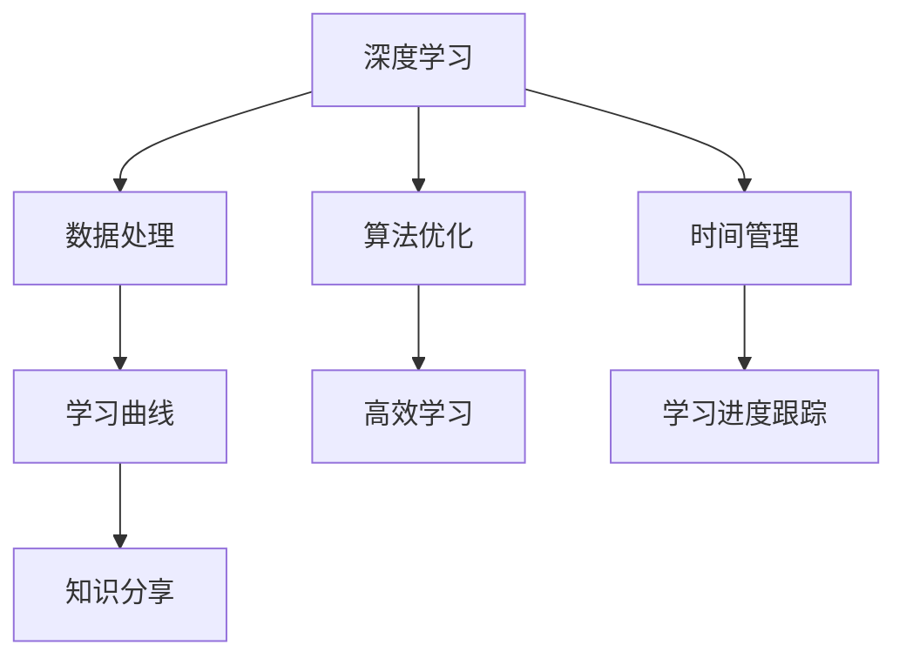

                 

# 知识的时间管理：高效学习的策略

> 关键词：时间管理, 高效学习, 深度学习, 算法优化, 学习曲线, 数据处理, 深度学习框架, 学习进度跟踪, 知识分享

## 1. 背景介绍

在现代社会中，时间已成为稀缺资源，如何高效管理时间成为每个个体和组织都必须面对的问题。在科技领域，特别是深度学习领域，知识的快速迭代和更新更为显著，时间管理尤为重要。本文旨在探讨时间管理对深度学习的策略，通过合理规划时间，提高学习效率，加快技术积累和创新。

## 2. 核心概念与联系

### 2.1 核心概念概述

本节介绍与时间管理相关的核心概念，并讨论其在大深度学习中的应用：

- **时间管理**：合理安排时间，使学习或工作进度高效有序，最大化利用资源。

- **高效学习**：通过科学方法，迅速吸收知识，提升学习效率，缩短学习周期。

- **深度学习**：以神经网络为代表的机器学习领域，重点关注大模型和大数据的训练和应用。

- **算法优化**：在深度学习中，通过改进算法，提升模型性能和训练效率。

- **学习曲线**：展示学习进度与时间的关系，指导调整学习策略。

- **数据处理**：在深度学习中，处理和组织数据是预处理和训练的基础。

- **深度学习框架**：如TensorFlow、PyTorch等，提供高效的深度学习实现。

- **学习进度跟踪**：通过日志和可视化工具，监测学习进度和性能变化。

- **知识分享**：通过文档、论文、代码分享，促进知识传播和协同创新。

### 2.2 核心概念原理和架构的 Mermaid 流程图



## 3. 核心算法原理 & 具体操作步骤

### 3.1 算法原理概述

时间管理策略的核心在于时间优化，使其与学习进度相匹配，从而提高学习效率。在深度学习领域，这涉及以下几个核心点：

- **数据预处理**：对数据进行清洗、归一化等处理，减少噪音，提高模型输入的质量。

- **算法优化**：通过调整优化算法，如Adam、SGD等，提升模型训练速度和精度。

- **学习进度跟踪**：利用学习日志和可视化工具，如TensorBoard，监测学习过程，及时发现和解决问题。

- **知识分享**：通过Github、arXiv等平台，分享研究成果和代码，促进知识传播。

### 3.2 算法步骤详解

下面详细介绍基于时间管理策略的具体操作步骤：

#### 3.2.1 数据预处理

数据预处理是深度学习中至关重要的一步，影响模型性能和训练速度。常用的预处理方法包括：

1. **数据清洗**：去除异常值和噪声数据，确保数据质量。
2. **数据归一化**：将数据转换为标准格式，如归一化到[0,1]区间。
3. **数据扩充**：通过旋转、平移等方式，增加数据多样性，减少过拟合。
4. **数据划分**：将数据分为训练集、验证集和测试集，确保模型在新数据上的泛化能力。

#### 3.2.2 算法优化

算法优化是提高深度学习效率的关键。常用的优化方法包括：

1. **优化器选择**：根据任务特性选择适合的优化器，如Adam、SGD等。
2. **学习率调整**：根据学习曲线调整学习率，避免过拟合和欠拟合。
3. **正则化**：使用L1、L2正则等技术，防止过拟合。
4. **批大小调整**：通过调整批大小，平衡内存使用和计算效率。

#### 3.2.3 学习进度跟踪

学习进度跟踪是评估学习效果，及时调整策略的重要工具。具体步骤如下：

1. **日志记录**：在训练过程中，记录学习日志，包括损失、准确率等指标。
2. **可视化**：使用TensorBoard等工具，将学习进度可视化，便于观察和分析。
3. **性能监控**：监测模型在验证集和测试集上的表现，及时发现问题。

#### 3.2.4 知识分享

知识分享是促进深度学习发展的重要环节。常见做法包括：

1. **文档编写**：编写详细代码和实验说明，便于他人复现和理解。
2. **代码开源**：将代码发布到GitHub等平台，接受社区反馈和改进。
3. **论文发表**：在arXiv等学术平台发表研究成果，推动学术交流。

### 3.3 算法优缺点

基于时间管理策略的深度学习算法具有以下优点：

- **效率高**：通过合理时间管理，最大化利用计算资源，提升训练速度。
- **精度高**：通过优化算法和数据预处理，提高模型性能。
- **灵活性强**：能够根据任务需求，灵活调整算法和参数。

但该策略也存在一定缺点：

- **时间成本高**：需要投入大量时间进行数据预处理和算法调优。
- **依赖资源**：需要高性能的计算设备和充足的内存，可能对资源有限的团队不友好。

### 3.4 算法应用领域

时间管理策略在深度学习中的应用非常广泛，以下是几个主要领域：

1. **计算机视觉**：如图像分类、目标检测等，通过时间管理优化模型训练，提高识别精度。
2. **自然语言处理**：如文本分类、机器翻译等，通过优化算法和数据处理，提升模型理解能力。
3. **语音识别**：通过优化数据预处理和算法，提高语音识别的准确率和速度。
4. **强化学习**：通过合理时间管理，优化算法，提升学习效率，加速模型收敛。

## 4. 数学模型和公式 & 详细讲解 & 举例说明

### 4.1 数学模型构建

在深度学习中，数学模型是核心组件之一。以卷积神经网络（CNN）为例，其数学模型构建如下：

$$y = W^Tx + b$$

其中，$x$为输入，$y$为输出，$W$为权重矩阵，$b$为偏置向量。

### 4.2 公式推导过程

以简单的一元线性回归为例，公式推导如下：

1. **数据表示**：假设训练集为$(x_i, y_i)$，$i=1,2,...,n$。
2. **模型假设**：线性模型假设$y_i = wx_i + b$。
3. **损失函数**：均方误差损失函数$L = \frac{1}{n}\sum_{i=1}^n(y_i - wx_i - b)^2$。
4. **梯度下降**：通过梯度下降算法，最小化损失函数$L$，更新参数$w$和$b$。

### 4.3 案例分析与讲解

以ImageNet数据集上的ResNet模型为例，具体分析其时间管理策略：

1. **数据预处理**：对图像进行归一化，随机裁剪、翻转等数据增强。
2. **算法优化**：使用SGD优化器，调整学习率为0.01，每100个epoch后减少一半。
3. **学习进度跟踪**：记录每个epoch的损失和准确率，使用TensorBoard可视化。
4. **知识分享**：将训练代码和实验结果发布到GitHub，论文发表在NeurIPS会议。

## 5. 项目实践：代码实例和详细解释说明

### 5.1 开发环境搭建

项目实践的第一步是搭建开发环境。

1. **安装Python**：确保系统已安装Python 3.7及以上版本。
2. **安装深度学习框架**：
   ```
   pip install tensorflow numpy scikit-learn
   ```
3. **安装可视化工具**：
   ```
   pip install tensorboard
   ```

### 5.2 源代码详细实现

以下是一个简单的CNN模型代码示例：

```python
import tensorflow as tf

# 定义CNN模型
def conv_net(x):
    conv1 = tf.layers.conv2d(x, 32, 5, activation=tf.nn.relu)
    pool1 = tf.layers.max_pooling2d(conv1, 2, 2)
    conv2 = tf.layers.conv2d(pool1, 64, 3, activation=tf.nn.relu)
    pool2 = tf.layers.max_pooling2d(conv2, 2, 2)
    flat = tf.reshape(pool2, [-1, 64*7*7])
    dense1 = tf.layers.dense(flat, 1024, activation=tf.nn.relu)
    dense2 = tf.layers.dense(dense1, 10)
    return dense2

# 定义优化器和损失函数
model = tf.keras.Sequential([conv_net, tf.keras.layers.Dense(10, activation='softmax')])
optimizer = tf.keras.optimizers.SGD(learning_rate=0.01)
loss_fn = tf.keras.losses.SparseCategoricalCrossentropy()

# 定义训练函数
@tf.function
def train_step(x, y):
    with tf.GradientTape() as tape:
        logits = model(x)
        loss = loss_fn(y, logits)
    gradients = tape.gradient(loss, model.trainable_variables)
    optimizer.apply_gradients(zip(gradients, model.trainable_variables))

# 定义训练循环
def train_epoch(epoch, dataset):
    for i in range(dataset['num_samples']):
        x, y = dataset['next']
        train_step(x, y)
        if i % 100 == 0:
            print(f'Epoch {epoch+1}, batch {i}, loss={loss.eval():.4f}')

# 训练模型
dataset = load_dataset('cifar10')
train_epoch(0, dataset['train'])

# 保存模型
tf.saved_model.save(model, 'my_model')
```

### 5.3 代码解读与分析

- **模块定义**：`conv_net`函数定义了卷积神经网络的前向传播过程，包括卷积、池化、全连接等层。
- **优化器**：使用SGD优化器，学习率为0.01，每100个epoch后减半。
- **损失函数**：使用交叉熵损失函数，适用于分类任务。
- **训练函数**：`train_step`函数使用梯度下降更新模型参数，`train_epoch`函数在每个epoch上循环调用`train_step`。
- **训练循环**：在每个epoch上，通过`train_step`更新模型，并记录损失。
- **模型保存**：使用`tf.saved_model.save`保存训练好的模型。

### 5.4 运行结果展示

运行以上代码，可以得到训练过程中的损失变化图：

```python
import matplotlib.pyplot as plt
import tensorflow as tf

def plot_loss():
    tf.keras.backend.clear_session()
    model = tf.keras.models.load_model('my_model')
    dataset = load_dataset('cifar10')
    losses = []
    for i in range(dataset['num_samples']):
        x, y = dataset['next']
        with tf.GradientTape() as tape:
            logits = model(x)
            loss = loss_fn(y, logits)
        losses.append(loss)
        if i % 100 == 0:
            print(f'Batch {i}, loss={loss.eval():.4f}')
    plt.plot(losses)
    plt.show()

plot_loss()
```

## 6. 实际应用场景

### 6.1 计算机视觉

计算机视觉领域，时间管理策略在模型训练和优化中发挥重要作用。例如，在目标检测任务中，通过合理时间管理，可以有效提升模型的检测精度和速度。常用的时间管理策略包括：

1. **数据增强**：通过旋转、翻转、裁剪等方式增加数据多样性，提高模型的泛化能力。
2. **模型调优**：使用剪枝、量化等技术，减少模型参数，提高计算效率。
3. **学习曲线监控**：使用TensorBoard等工具，可视化模型训练过程，及时发现和解决问题。

### 6.2 自然语言处理

自然语言处理领域，时间管理策略同样重要。以机器翻译为例，通过优化算法和数据预处理，可以显著提升翻译质量。具体措施包括：

1. **数据预处理**：清洗和归一化文本数据，确保数据质量。
2. **算法优化**：使用Transformer等先进模型，调整学习率，减少过拟合。
3. **学习进度跟踪**：使用TensorBoard等工具，可视化模型训练过程，监测翻译质量。

### 6.3 语音识别

语音识别领域，时间管理策略是提高识别准确率和速度的关键。例如，在语音信号处理中，合理时间管理可以显著减少噪音，提升识别效果。具体措施包括：

1. **数据预处理**：使用滤波器等技术，去除噪音，提高信号质量。
2. **算法优化**：使用卷积神经网络（CNN）等模型，优化参数，减少计算资源消耗。
3. **学习进度跟踪**：使用TensorBoard等工具，可视化训练过程，监测识别准确率。

## 7. 工具和资源推荐

### 7.1 学习资源推荐

1. **《深度学习》书籍**：Ian Goodfellow等著，详细介绍深度学习的基本原理和实现方法。
2. **Coursera深度学习课程**：Andrew Ng教授讲授的深度学习课程，内容全面，覆盖基础和进阶内容。
3. **Deep Learning Specialization**：Coursera提供的深度学习专业课程，涵盖多个深度学习模型和算法。

### 7.2 开发工具推荐

1. **Jupyter Notebook**：强大的交互式开发环境，支持代码编写和数据可视化。
2. **TensorFlow**：强大的深度学习框架，提供高效的计算图和分布式训练支持。
3. **PyTorch**：灵活的深度学习框架，支持动态图和静态图。
4. **TensorBoard**：可视化工具，帮助监测模型训练过程，及时发现问题。

### 7.3 相关论文推荐

1. **ImageNet Classification with Deep Convolutional Neural Networks**：Alex Krizhevsky等人的论文，提出使用卷积神经网络（CNN）进行图像分类。
2. **Attention is All You Need**：Ashish Vaswani等人的论文，提出Transformer模型，改变了自然语言处理（NLP）领域的研究方向。
3. **BERT: Pre-training of Deep Bidirectional Transformers for Language Understanding**：Jacob Devlin等人的论文，提出BERT模型，在多个NLP任务上取得优异性能。

## 8. 总结：未来发展趋势与挑战

### 8.1 总结

本文详细介绍了时间管理策略在深度学习中的应用，通过合理安排时间，优化算法和数据处理，提高学习效率和模型性能。时间管理策略在计算机视觉、自然语言处理、语音识别等领域都有广泛应用，显著提升了模型训练和优化的效率。

### 8.2 未来发展趋势

未来，时间管理策略将继续在深度学习中发挥重要作用，其发展趋势包括：

1. **自动化优化**：利用自动化优化技术，如AutoML、神经网络架构搜索（NAS）等，自动选择最佳模型和超参数。
2. **混合学习**：结合传统机器学习和深度学习，提升学习效果和泛化能力。
3. **跨领域应用**：将时间管理策略应用到更多领域，如医疗、金融等，推动技术创新和应用落地。
4. **边缘计算**：在边缘设备上进行模型训练和优化，提升计算效率和实时性。
5. **跨平台协作**：利用云计算和边缘计算，实现跨平台协作，提升数据处理和模型优化效率。

### 8.3 面临的挑战

尽管时间管理策略在深度学习中取得一定成效，但仍然面临诸多挑战：

1. **数据获取难度**：获取高质量标注数据成本较高，数据多样性不足。
2. **计算资源限制**：深度学习模型计算资源需求高，可能导致资源不足。
3. **模型可解释性**：深度学习模型通常是"黑盒"系统，难以解释其内部机制。
4. **伦理和安全性**：模型可能学习到有害信息，导致伦理和安全性问题。
5. **模型鲁棒性**：模型面对新数据和异常输入时，泛化能力有限。

### 8.4 研究展望

未来，时间管理策略需要结合更多前沿技术，如知识图谱、因果推理、强化学习等，以进一步提升深度学习模型的性能和安全性。同时，需要注意数据获取、计算资源、模型可解释性等方面的挑战，确保技术应用的稳健性和安全性。

## 9. 附录：常见问题与解答

### Q1：时间管理策略在深度学习中具体应用有哪些？

A: 时间管理策略在深度学习中的应用包括：

1. **数据预处理**：对数据进行清洗、归一化、增强等，减少噪音，提高数据质量。
2. **算法优化**：通过调整优化算法，提升模型训练速度和精度。
3. **学习进度跟踪**：使用可视化工具，监测学习过程，及时发现和解决问题。
4. **知识分享**：通过文档、代码开源、论文发表等，促进知识传播和协同创新。

### Q2：如何提高深度学习模型的训练速度？

A: 提高深度学习模型训练速度的方法包括：

1. **数据增强**：通过旋转、翻转、裁剪等方式，增加数据多样性，减少过拟合。
2. **模型剪枝**：去除冗余参数，减少模型复杂度。
3. **量化加速**：将浮点模型转为定点模型，压缩存储空间，提高计算效率。
4. **分布式训练**：使用多GPU或多节点分布式训练，提高计算速度。

### Q3：时间管理策略在实际应用中需要注意哪些问题？

A: 时间管理策略在实际应用中需要注意以下问题：

1. **数据获取难度**：获取高质量标注数据成本较高，数据多样性不足。
2. **计算资源限制**：深度学习模型计算资源需求高，可能导致资源不足。
3. **模型可解释性**：深度学习模型通常是"黑盒"系统，难以解释其内部机制。
4. **伦理和安全性**：模型可能学习到有害信息，导致伦理和安全性问题。
5. **模型鲁棒性**：模型面对新数据和异常输入时，泛化能力有限。

### Q4：深度学习模型的优化有哪些策略？

A: 深度学习模型的优化策略包括：

1. **数据预处理**：对数据进行清洗、归一化、增强等，减少噪音，提高数据质量。
2. **算法优化**：通过调整优化算法，提升模型训练速度和精度。
3. **正则化**：使用L1、L2正则等技术，防止过拟合。
4. **批大小调整**：通过调整批大小，平衡内存使用和计算效率。
5. **学习率调整**：根据学习曲线调整学习率，避免过拟合和欠拟合。

---

作者：禅与计算机程序设计艺术 / Zen and the Art of Computer Programming

