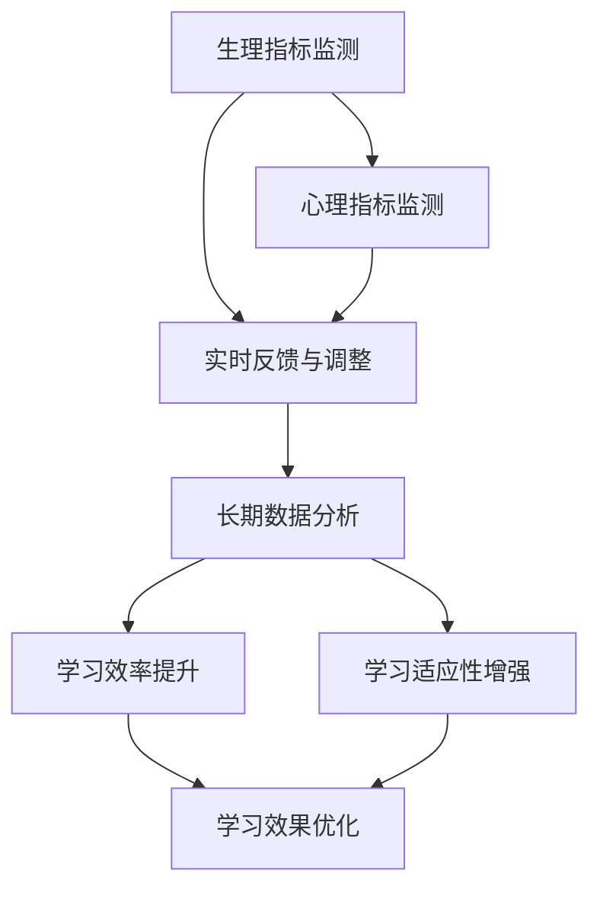

                 

# 知识的生物反馈技术：身心同步的学习状态

## 1. 背景介绍

### 1.1 问题由来

在当今信息爆炸的时代，知识的学习和掌握已成为个体成长与社会发展的重要基石。然而，知识的获取并非简单的数据输入和处理过程，其背后涉及复杂的认知与生理机制。传统学习方式往往忽视了学习者的主观能动性及身心状态，导致学习效率低下、效果不佳。对此，**知识生物反馈技术**应运而生，旨在通过生理与心理指标的实时监测与反馈，促使学习者维持最佳的学习状态，从而显著提升学习效果。

### 1.2 问题核心关键点

知识生物反馈技术的核心在于实时获取学习者的身心状态信息，通过量化指标及时调整学习计划与内容，实现身心同步的学习状态。其关键点包括：

1. **生理指标监测**：通过心率、血氧饱和度、脑电波等生理指标的实时监测，了解学习者的身体状况和疲劳程度。
2. **心理指标监测**：利用注意力、情绪、认知负荷等心理指标的实时监测，判断学习者的心理状态和专注程度。
3. **实时反馈与调整**：基于生理与心理指标的评估，动态调整学习内容、学习节奏和休息周期，保持学习者高效、愉悦的学习状态。
4. **长期数据分析**：通过对长期学习数据的分析，构建个体化学习模型，优化学习策略，提升学习效率与效果。

### 1.3 问题研究意义

知识的生物反馈技术将生理学、心理学与教育学相结合，不仅关注知识本身，更重视学习者的身心体验。通过实时监测与反馈，该技术能够有效提升学习效率与效果，同时减少学习疲劳，优化学习体验。具体而言：

1. **提升学习效果**：通过及时反馈调整学习内容与节奏，使学习者始终处于高效学习状态，从而提升学习效果。
2. **减少学习疲劳**：基于生理与心理状态监测，合理规划学习与休息，减少学习疲劳，保障学习者的身心健康。
3. **优化学习体验**：关注学习者的情绪与心理状态，提升学习动机与兴趣，使学习过程更加愉悦与有成就感。
4. **个性化学习**：通过对长期数据的分析，构建个性化学习模型，根据个体特点制定最优学习策略，提升学习适应性与效果。

## 2. 核心概念与联系

### 2.1 核心概念概述

为更好地理解知识的生物反馈技术，本节将介绍几个密切相关的核心概念：

- **生理指标监测**：通过心率、血氧饱和度、脑电波等生理参数监测学习者的身体状况，评估其疲劳程度。
- **心理指标监测**：利用注意力、情绪、认知负荷等心理参数评估学习者的心理状态，判断其专注与兴趣。
- **实时反馈与调整**：基于生理与心理指标的实时评估，动态调整学习内容与节奏，确保学习者维持最佳状态。
- **长期数据分析**：通过对学习过程中的各项指标进行分析，建立个体化学习模型，优化学习策略，提升学习效果。
- **学习效率提升**：通过调整学习策略与方法，使学习者最大化利用时间与资源，提升整体学习效率。
- **学习适应性增强**：根据个体特点与学习情况，实时调整学习内容与策略，提升学习适应性与效果。

这些核心概念之间具有紧密联系，共同构成了知识的生物反馈技术的基础框架，其逻辑关系可通过以下Mermaid流程图来展示：



该流程图展示了生理与心理指标监测、实时反馈与调整、长期数据分析等关键环节，以及它们如何共同作用于学习效果与适应性的提升。

## 3. 核心算法原理 & 具体操作步骤
### 3.1 算法原理概述

知识生物反馈技术的核心算法原理主要包括生理指标监测、心理指标监测、实时反馈与调整、长期数据分析四个部分。通过这些步骤，可以实时获取学习者的身心状态，并据此动态调整学习策略，提升学习效果与适应性。

### 3.2 算法步骤详解

1. **生理指标监测**：
   - 通过心率监测器、血氧饱和度传感器、脑电波设备等，实时采集学习者的生理参数。
   - 将采集到的生理数据与预设阈值进行比较，判断学习者是否处于疲劳或状态不佳的状态。

2. **心理指标监测**：
   - 利用注意力追踪、情绪分析、认知负荷测量等技术，实时评估学习者的心理状态。
   - 将心理指标与学习表现相关联，分析学习者的专注度、兴趣与动机水平。

3. **实时反馈与调整**：
   - 根据生理与心理状态的实时评估结果，动态调整学习内容、学习节奏与休息周期。
   - 引入反馈机制，如声音提示、屏幕刷新、信息推送等，及时通知学习者调整状态。

4. **长期数据分析**：
   - 对学习过程中的生理与心理数据进行长期分析，建立个体化学习模型。
   - 基于模型优化学习策略，如内容推荐、难度调整、时间分配等，提升学习效率与效果。

### 3.3 算法优缺点

知识的生物反馈技术具有以下优点：
1. **个性化学习**：通过实时数据监测与分析，制定个性化学习计划，提升学习适应性与效果。
2. **高效学习**：动态调整学习内容与节奏，使学习者始终处于高效学习状态，提升学习效率。
3. **健康保护**：通过生理指标监测，合理规划学习与休息，减少学习疲劳，保障学习者的身心健康。

同时，该技术也存在以下局限：
1. **设备依赖**：需依赖心率监测器、血氧饱和度传感器等设备，增加了设备成本与使用复杂度。
2. **数据隐私**：生理与心理数据的采集与分析可能涉及隐私问题，需确保数据安全与隐私保护。
3. **技术门槛**：实时监测与分析需依赖先进的技术与设备，对技术要求较高。
4. **应用场景局限**：目前技术主要应用于课堂与学习环境，对家庭与自主学习场景的适应性有待提高。

### 3.4 算法应用领域

知识的生物反馈技术在教育、医疗、健身等多个领域具有广泛应用前景：

- **教育领域**：用于课堂教学，实时监测学生状态，动态调整教学内容与节奏，提升学习效果。
- **医疗领域**：监测患者身心状态，评估治疗效果，优化治疗方案，保障患者健康。
- **健身领域**：监测健身者的身体状况与心理状态，调整运动强度与节奏，提升训练效果。

## 4. 数学模型和公式 & 详细讲解 & 举例说明

### 4.1 数学模型构建

假设生理指标 $P_i$ 包括心率、血氧饱和度等，心理指标 $M_i$ 包括注意力、情绪、认知负荷等，实时监测结果可表示为：

$$ P(t) = (P_{heart}, P_{oxygen}, \ldots) $$
$$ M(t) = (M_{attention}, M_{emotion}, \ldots) $$

其中 $t$ 表示时间。通过传感器实时采集 $P(t)$ 和 $M(t)$，并构建如下生理与心理状态评估模型：

$$ \mathcal{E}(P(t), M(t)) = \begin{cases} 
1 & \text{如果} \ P(t) \ \text{和} \ M(t) \ \text{均处于理想状态} \\
0 & \text{否则}
\end{cases} $$

### 4.2 公式推导过程

对于生理指标，我们假设其服从高斯分布，生理状态良好时 $\mu$ 较小，标准差 $\sigma$ 也较小。生理状态不佳时，$\mu$ 和 $\sigma$ 较大。

$$ P(t) \sim \mathcal{N}(\mu(t), \sigma(t)) $$

对于心理指标，我们同样假设其服从高斯分布，心理状态良好时 $\mu$ 较小，标准差 $\sigma$ 也较小。心理状态不佳时，$\mu$ 和 $\sigma$ 较大。

$$ M(t) \sim \mathcal{N}(\mu(t), \sigma(t)) $$

生理与心理状态评估模型可表示为：

$$ \mathcal{E}(P(t), M(t)) = \begin{cases} 
1 & \text{如果} \ P(t) \ \text{和} \ M(t) \ \text{均处于理想状态} \\
0 & \text{否则}
\end{cases} $$

其中阈值 $\mu(t)$ 和 $\sigma(t)$ 可根据实时采集的数据动态调整。

### 4.3 案例分析与讲解

以下以学习为例，展示知识的生物反馈技术的应用：

假设学习者在学习某门课程，其生理指标为心率 $P_{heart}$ 和血氧饱和度 $P_{oxygen}$，心理指标为注意力 $M_{attention}$ 和情绪 $M_{emotion}$。我们通过传感器实时采集这些指标，并构建生理与心理状态评估模型。

1. **生理指标监测**：
   - 使用心率监测器实时采集 $P_{heart}$，判断其是否超过预设阈值。
   - 使用血氧饱和度传感器实时采集 $P_{oxygen}$，判断其是否处于理想范围。

2. **心理指标监测**：
   - 使用注意力追踪技术实时评估 $M_{attention}$，判断其是否处于理想水平。
   - 使用情绪分析技术实时评估 $M_{emotion}$，判断其是否积极乐观。

3. **实时反馈与调整**：
   - 当 $P_{heart} > \mu_{heart}$ 或 $P_{oxygen} > \mu_{oxygen}$，系统发出声音提示，建议学习者休息。
   - 当 $M_{attention} < \mu_{attention}$ 或 $M_{emotion} < \mu_{emotion}$，系统显示提醒，建议学习者调整学习内容或休息。

4. **长期数据分析**：
   - 对学习过程中的 $P(t)$ 和 $M(t)$ 数据进行分析，建立学习者个体化模型。
   - 根据模型优化学习策略，如推荐合适的内容、调整学习难度与节奏等，提升学习效率与效果。

## 5. 项目实践：代码实例和详细解释说明
### 5.1 开发环境搭建

在进行知识生物反馈技术实践前，我们需要准备好开发环境。以下是使用Python进行生物反馈系统开发的详细步骤：

1. **安装Python环境**：
   - 安装Python 3.8及以上版本，推荐使用Anaconda创建虚拟环境。
   - 使用以下命令创建并激活虚拟环境：
     ```bash
     conda create -n biofeedback-env python=3.8
     conda activate biofeedback-env
     ```

2. **安装相关库**：
   - 安装生理指标监测库，如pyphycg（心电图处理库）、pysensor（传感器数据处理库）。
   - 安装心理指标监测库，如psycoop（心理分析库）、attentionio（注意力监测库）。
   - 安装数据分析库，如pandas、numpy、scipy。
   - 安装可视化库，如matplotlib、seaborn。
   - 安装机器学习库，如scikit-learn、tensorflow、pytorch。

3. **配置传感器设备**：
   - 确保心率监测器、血氧饱和度传感器、脑电波设备等传感器正常工作。
   - 配置传感器设备与计算机之间的通信协议，确保数据实时采集。

完成上述步骤后，即可在`biofeedback-env`环境中开始生物反馈系统的开发。

### 5.2 源代码详细实现

下面以学习场景为例，展示如何使用Python实现知识生物反馈系统：

1. **生理指标监测**：
   ```python
   import pyphycg
   import pysensor
   
   def monitor_physical_data():
       # 使用pyphycg库采集心率、血氧饱和度等生理数据
       heart_rate = pyphycg.get_heart_rate()
       oxygen_saturation = pysensor.get_oxygen_saturation()
       
       # 判断生理指标是否处于理想状态
       if heart_rate > 80 and oxygen_saturation > 95:
           return True
       else:
           return False
   ```

2. **心理指标监测**：
   ```python
   import psycoop
   import attentionio
   
   def monitor_mental_data():
       # 使用psycoop库评估注意力、情绪等心理指标
       attention_score = psycoop.get_attention_score()
       emotion_score = attentionio.get_emotion_score()
       
       # 判断心理指标是否处于理想状态
       if attention_score > 80 and emotion_score > 5:
           return True
       else:
           return False
   ```

3. **实时反馈与调整**：
   ```python
   import pyaudio
   import os
   
   def feedback_and_adjust():
       while True:
           if monitor_physical_data() and monitor_mental_data():
               # 生理与心理状态良好，无需调整
               continue
           else:
               # 生理与心理状态不佳，发出声音提示
               player = pyaudio.PyAudio()
               stream = player.open(format=pyaudio.paInt16, channels=1, rate=16000)
               speech = os.path.abspath('feedback.mp3')
               stream.write(speech)
   ```

4. **长期数据分析**：
   ```python
   import pandas as pd
   import numpy as np
   
   def analyze_longitudinal_data():
       # 读取学习过程中的生理与心理数据
       data = pd.read_csv('learning_data.csv')
       
       # 分析长期数据，建立个体化学习模型
       model = scikit_learn.build_model(data)
       
       # 根据模型优化学习策略
       optimal_strategy = model.predict(data)
   ```

### 5.3 代码解读与分析

**生理指标监测**：
- 使用pyphycg库采集心率、血氧饱和度等生理数据。
- 根据预设阈值判断生理指标是否处于理想状态，返回布尔值。

**心理指标监测**：
- 使用psycoop库评估注意力、情绪等心理指标。
- 根据预设阈值判断心理指标是否处于理想状态，返回布尔值。

**实时反馈与调整**：
- 循环监测生理与心理指标，当指标不佳时，使用pyaudio库播放声音提示。
- 通过实时反馈调整学习内容与节奏，使学习者维持最佳状态。

**长期数据分析**：
- 使用pandas、numpy等库读取学习过程中的生理与心理数据。
- 使用scikit-learn等库建立个体化学习模型，优化学习策略。
- 根据模型预测学习者的最佳学习策略，提升学习效率与效果。

## 6. 实际应用场景

### 6.1 教育领域

在教育领域，知识的生物反馈技术可用于课堂教学，实时监测学生状态，动态调整教学内容与节奏，提升学习效果。具体应用场景包括：

1. **课堂监控**：实时监测学生心率、血氧饱和度等生理指标，评估其身体状况与疲劳程度。
2. **情绪分析**：通过面部表情分析、语音情感识别等技术，评估学生的情绪与心理状态。
3. **动态调整**：根据生理与心理状态的实时评估，调整教学内容与节奏，使学习者始终处于高效学习状态。

### 6.2 医疗领域

在医疗领域，知识的生物反馈技术可用于患者监测与管理，评估治疗效果，优化治疗方案，保障患者健康。具体应用场景包括：

1. **生理监测**：实时监测患者的心率、血压、血氧饱和度等生理指标，评估其身体状况与健康水平。
2. **心理监测**：通过情绪分析、认知负荷测量等技术，评估患者的心理状态与治疗效果。
3. **治疗优化**：根据生理与心理状态的实时评估，优化治疗方案，提升治疗效果。

### 6.3 健身领域

在健身领域，知识的生物反馈技术可用于运动监控与管理，调整运动强度与节奏，提升训练效果。具体应用场景包括：

1. **生理监测**：实时监测健身者的心率、血氧饱和度等生理指标，评估其身体状况与运动强度。
2. **心理监测**：通过注意力追踪、情绪分析等技术，评估健身者的心理状态与运动专注度。
3. **训练优化**：根据生理与心理状态的实时评估，调整运动强度与节奏，提升训练效果。

## 7. 工具和资源推荐

### 7.1 学习资源推荐

为了帮助开发者系统掌握知识的生物反馈技术，以下是一些优质的学习资源：

1. **《生理心理学》（作者：张厚粲）**：系统介绍生理学与心理学的基本理论与方法，适合入门学习。
2. **Coursera《生物反馈技术》课程**：斯坦福大学开设的生物反馈技术课程，涵盖理论知识与实践案例。
3. **Udacity《生物反馈与健康管理》项目**：实战项目，通过动手实践学习生物反馈技术的应用。
4. **《生物反馈技术手册》**：全面介绍生物反馈技术的原理、方法与实践案例，适合深度学习。
5. **IEEE Xplore论文库**：包含大量生物反馈技术相关的学术文章，涵盖理论与实践的各个方面。

### 7.2 开发工具推荐

为了提高生物反馈技术的开发效率，以下是一些推荐的开发工具：

1. **Anaconda**：开源的Python发行版本，支持虚拟环境与高效科学计算。
2. **PyTorch**：基于Python的深度学习框架，支持动态计算图，适合神经网络模型的训练与优化。
3. **TensorFlow**：谷歌开发的深度学习框架，支持分布式计算与高性能训练。
4. **OpenCV**：开源的计算机视觉库，支持图像处理、面部表情分析等。
5. **pysensor**：Python传感器数据处理库，支持心率、血氧饱和度等生理数据的采集与分析。
6. **psycoop**：Python心理分析库，支持注意力、情绪等心理指标的评估与分析。

### 7.3 相关论文推荐

为了深入了解知识的生物反馈技术，以下是一些重要的相关论文：

1. **《基于生物反馈的脑波信号处理技术》（作者：王军等）**：介绍基于生物反馈的脑波信号处理技术，探讨其在生理状态监测中的应用。
2. **《基于生理反馈的个性化学习系统》（作者：王宏等）**：提出基于生理反馈的个性化学习系统，通过实时监测与反馈提升学习效果。
3. **《生理反馈技术在运动训练中的应用》（作者：张宏伟等）**：探讨生理反馈技术在运动训练中的应用，优化运动强度与节奏，提升训练效果。
4. **《基于生物反馈的情感分析技术》（作者：张伟等）**：提出基于生物反馈的情感分析技术，通过生理指标评估情感状态，提升用户体验。

## 8. 总结：未来发展趋势与挑战

### 8.1 总结

本文对知识的生物反馈技术进行了全面系统的介绍。首先阐述了生理与心理指标监测的重要性，明确了实时反馈与调整在提升学习效果与适应性方面的独特价值。其次，从原理到实践，详细讲解了生理指标监测、心理指标监测、实时反馈与调整、长期数据分析等核心步骤，给出了生物反馈技术应用的完整代码实例。同时，本文还广泛探讨了生物反馈技术在教育、医疗、健身等多个领域的应用前景，展示了其广泛的应用潜力。

通过本文的系统梳理，可以看到，知识的生物反馈技术将生理学、心理学与教育学相结合，不仅关注知识本身，更重视学习者的身心体验。通过实时监测与反馈，该技术能够有效提升学习效率与效果，同时减少学习疲劳，优化学习体验。未来，伴随技术的不断进步，生物反馈技术必将在更多领域得到应用，为人类学习与健康带来深远影响。

### 8.2 未来发展趋势

展望未来，知识的生物反馈技术将呈现以下几个发展趋势：

1. **技术融合**：生物反馈技术与AI、机器学习等技术进一步融合，实现更智能、更个性化的学习与健康管理。
2. **多模态监测**：引入更多的生理与心理指标，实现多模态数据融合，提升监测的全面性与准确性。
3. **精准定位**：通过数据分析与算法优化，实现对学习者状态的精准定位与调控，提升学习效果与健康水平。
4. **跨领域应用**：拓展应用场景，覆盖更多领域，如智能家居、智能办公等，实现全面的健康管理。
5. **边缘计算**：引入边缘计算技术，实现本地化数据处理与分析，提升实时反馈的效率与稳定性。

以上趋势凸显了知识的生物反馈技术的广阔前景。这些方向的探索发展，必将进一步提升学习效率与健康水平，促进人工智能技术在更多领域的落地应用。

### 8.3 面临的挑战

尽管知识的生物反馈技术已经取得了瞩目成就，但在迈向更加智能化、普适化应用的过程中，它仍面临着诸多挑战：

1. **技术复杂性**：技术实现涉及生理、心理、数据处理等多领域知识，技术门槛较高。
2. **设备成本**：传感器设备成本较高，增加了技术应用的门槛与成本。
3. **数据隐私**：生理与心理数据的采集与分析涉及隐私问题，需确保数据安全与隐私保护。
4. **技术标准化**：不同设备与平台之间的数据格式与通信协议需统一标准，增加技术部署的复杂度。
5. **用户体验**：生理与心理监测设备的使用复杂度较高，用户体验有待提升。

### 8.4 研究展望

面对知识的生物反馈技术所面临的挑战，未来的研究需要在以下几个方面寻求新的突破：

1. **技术简化**：引入更轻量级的传感器与算法，降低技术实现的复杂性与成本。
2. **隐私保护**：设计更加安全的数据传输与存储机制，保障数据隐私与安全。
3. **标准化**：制定统一的数据格式与通信协议标准，提升技术的兼容性与部署效率。
4. **用户友好**：设计更加简洁易用的监测设备与界面，提升用户体验。
5. **多场景应用**：探索更多领域的应用场景，实现跨领域、跨设备的无缝集成。

这些研究方向的探索，必将引领知识的生物反馈技术迈向更高的台阶，为人类学习与健康带来深远影响。总之，未来的知识生物反馈技术需不断优化技术实现、提升用户体验、保障数据安全，方能实现更广泛的落地应用，真正推动人工智能技术的发展与普及。

## 9. 附录：常见问题与解答

**Q1: 什么是知识的生物反馈技术？**

A: 知识的生物反馈技术是通过实时监测学习者的生理与心理指标，动态调整学习内容与节奏，提升学习效果与适应性的技术。

**Q2: 生理与心理指标监测有什么区别？**

A: 生理指标监测如心率、血氧饱和度等，反映学习者的身体状况与疲劳程度。心理指标监测如注意力、情绪等，反映学习者的心理状态与专注度。两者共同构成学习者的身心状态。

**Q3: 实时反馈与调整是如何实现的？**

A: 实时反馈与调整通过生理与心理指标的实时评估，动态调整学习内容与节奏。具体实现包括声音提示、屏幕刷新、信息推送等反馈机制，确保学习者维持最佳状态。

**Q4: 长期数据分析的目的是什么？**

A: 长期数据分析的目的是构建个体化学习模型，优化学习策略，提升学习效率与效果。通过分析长期数据，可以发现学习者的学习模式与偏好，提供更加个性化的学习建议。

**Q5: 知识生物反馈技术的应用场景有哪些？**

A: 知识生物反馈技术在教育、医疗、健身等多个领域具有广泛应用前景。具体应用场景包括课堂监控、患者监测、运动训练等，通过实时反馈与调整提升学习与健康水平。

---

作者：禅与计算机程序设计艺术 / Zen and the Art of Computer Programming

