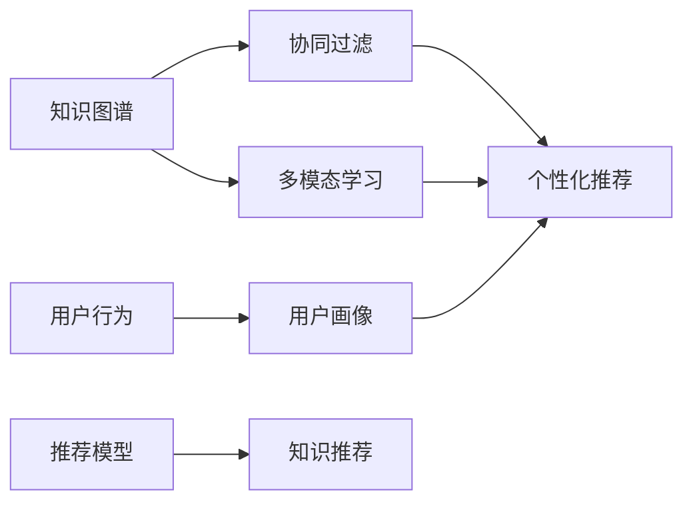
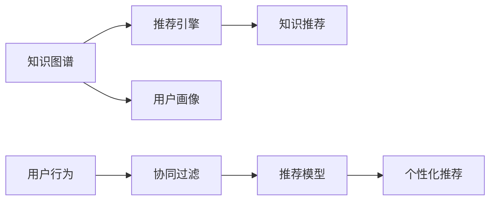
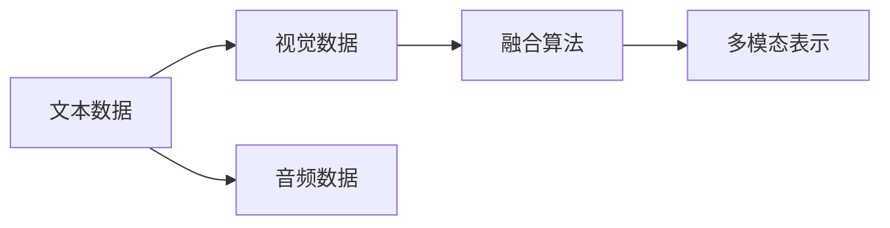

                 

# 知识的社交学习网络：peer-to-peer教育模式

> 关键词：社交学习网络, P2P教育模式, 知识图谱, 协同过滤, 多模态学习, 教育技术, 个性化推荐, 可扩展性

## 1. 背景介绍

### 1.1 问题由来
随着互联网技术的发展，在线教育成为一种快速普及的全球现象。传统的教师-学生单向知识传递模式，在一定程度上限制了教学效果和知识传播的效率。为了适应新时代的教育需求，新的知识传播方式应运而生，其中一种新兴的模式便是知识社交学习网络(Peer-to-Peer Learning Network)，简称P2P学习网络。

P2P学习网络以知识图谱为依托，通过构建个体之间的知识网络，实现知识的共享与传递。每个个体不仅是个体知识的提供者，也是知识的消费者，从而形成一个自我驱动、自组织的学习网络。这种模式相比传统的单向教学模式，具有更强的互动性和可扩展性，可以大大提升学习效率和知识的覆盖面。

### 1.2 问题核心关键点
P2P学习网络的本质是一种通过社交网络来实现知识共享和学习的模式。其核心关键点包括：

- 知识图谱的构建与演化。知识图谱是一个描述实体和它们之间关系的语义网络，是P2P学习网络的基础。
- 知识传播的动态化。知识在个体之间的传播是动态的，且存在多种传播方式，如直接交流、推荐系统、搜索引擎等。
- 个性化推荐与协同过滤。通过个性化推荐和协同过滤技术，推荐系统可以动态调整知识推荐策略，提升知识匹配度。
- 可扩展性与可维护性。P2P学习网络需要支持大规模用户参与，同时保持系统的稳定性和高效性。

这些关键点决定了P2P学习网络的实现复杂度与技术挑战。

### 1.3 问题研究意义
P2P学习网络的研究意义在于其对于教育技术的创新和变革潜力。

- 降低教学成本。P2P学习网络能够充分利用网络资源，减少教师和传统教学设施的投入，降低教育成本。
- 提升学习效果。通过个体间的互动与知识共享，P2P学习网络能够提高学习的参与度和效果，使知识传播更加高效。
- 促进知识创新。P2P学习网络能够汇聚个体的智慧，加速知识的产生和传播，推动科学技术的进步。
- 实现个性化学习。P2P学习网络能够根据用户的学习习惯和兴趣，提供个性化推荐，提升学习的个性化体验。

P2P学习网络的兴起，标志着学习方式的根本变革，预示着教育技术向更加智能化、个性化、社交化的方向发展。

## 2. 核心概念与联系

### 2.1 核心概念概述

为了深入理解P2P学习网络，首先需要介绍一些核心概念：

- **知识图谱**：用于描述实体及其关系的语义网络，是构建P2P学习网络的基础。
- **协同过滤**：通过分析用户行为数据，推荐系统可以发现用户之间的相似性，实现知识的协同过滤推荐。
- **多模态学习**：P2P学习网络不仅涉及文本数据，还可能涉及图片、音频、视频等多种模态的数据，多模态学习是提升知识匹配度和理解能力的关键。
- **个性化推荐**：根据用户的学习行为和偏好，推荐系统能够提供更符合用户需求的个性化知识推荐。
- **社交学习网络**：以社交网络为基础，个体间通过知识互动和共享，形成自组织的学习网络。

这些核心概念通过图1所示的Mermaid流程图联系起来，展示了P2P学习网络的整体架构和功能模块。



图1. P2P学习网络的核心概念与联系

### 2.2 核心概念原理和架构的 Mermaid 流程图

图2. P2P学习网络的架构示意图



图2展示了P2P学习网络的总体架构，其中知识图谱、用户画像、用户行为、协同过滤、推荐模型和知识推荐是关键组件。

## 3. 核心算法原理 & 具体操作步骤

### 3.1 算法原理概述

P2P学习网络的实现涉及多个算法原理，包括知识图谱构建、协同过滤、多模态学习和个性化推荐。

- **知识图谱构建**：知识图谱的构建是一个从结构化数据到语义网络的过程，需要涉及自然语言处理、图嵌入算法等技术。
- **协同过滤**：协同过滤算法通过分析用户行为数据，发现相似用户之间的知识关系，实现知识的协同过滤推荐。
- **多模态学习**：多模态学习算法通过融合不同模态的知识数据，提升知识的匹配度和理解能力。
- **个性化推荐**：个性化推荐算法根据用户的学习行为和偏好，提供个性化的知识推荐，提升学习效果。

### 3.2 算法步骤详解

#### 3.2.1 知识图谱构建

知识图谱的构建涉及以下几个关键步骤：

1. **数据收集**：收集知识库、维基百科、学术论文、专利文献等多种结构化数据源。
2. **实体识别**：使用自然语言处理技术，从文本中识别出实体及其关系。
3. **图嵌入**：使用图嵌入算法（如TransE、GraRep等），将实体和关系映射为低维向量表示，构建知识图谱。

以下是一个简化的知识图谱构建流程示意图：


#### 3.2.2 协同过滤

协同过滤算法的基本思想是通过分析用户行为数据，发现用户之间的相似性，实现知识的协同过滤推荐。协同过滤分为基于用户的协同过滤和基于物品的协同过滤两种方法。

1. **基于用户的协同过滤**：计算用户之间的相似度，推荐与用户i相似的用户j喜欢的知识。

2. **基于物品的协同过滤**：计算知识之间的相似度，推荐与知识i相似的知识j给用户。

以下是一个简化的协同过滤流程示意图：


#### 3.2.3 多模态学习

多模态学习算法通过融合不同模态的知识数据，提升知识的匹配度和理解能力。以下是一个简化的多模态学习流程示意图：



#### 3.2.4 个性化推荐

个性化推荐算法根据用户的学习行为和偏好，提供个性化的知识推荐，提升学习效果。以下是一个简化的个性化推荐流程示意图：


### 3.3 算法优缺点

P2P学习网络的优势在于其自组织、自驱动的学习模式，可以显著提升学习效率和知识覆盖面。具体来说，P2P学习网络的优点包括：

- **自组织学习**：个体间通过社交网络进行自组织学习，提升学习的主动性和互动性。
- **知识共享**：通过社交网络，个体间可以共享知识，提升知识的覆盖面和多样性。
- **动态适应**：P2P学习网络能够根据用户的学习行为和反馈，动态调整知识推荐策略，提升知识匹配度。

然而，P2P学习网络也存在一些缺点：

- **数据质量问题**：知识图谱的构建依赖于结构化数据，数据质量问题会直接影响知识图谱的准确性。
- **算法复杂性**：协同过滤、多模态学习和个性化推荐等算法较为复杂，需要大量计算资源和时间。
- **用户行为偏差**：用户行为数据可能存在偏差，影响协同过滤和个性化推荐的准确性。
- **隐私与安全问题**：P2P学习网络涉及用户数据的共享和传输，存在隐私泄露和安全风险。

### 3.4 算法应用领域

P2P学习网络的应用领域广泛，涵盖教育、医疗、金融、科研等多个行业。以下是几个典型的应用场景：

#### 3.4.1 教育领域

在教育领域，P2P学习网络可以通过构建学生-教师-知识网络，实现知识的共享与传递。例如，学生可以在在线平台上提问，教师和其他学生解答问题，形成互动学习环境。此外，P2P学习网络还可以根据学生的学习行为和偏好，提供个性化的学习资源推荐，提升学习效果。

#### 3.4.2 医疗领域

在医疗领域，P2P学习网络可以通过构建医生-患者-知识网络，实现医学知识的共享与传播。例如，医生可以在平台上分享医学知识，患者可以通过阅读和学习相关知识，提升健康素养。此外，P2P学习网络还可以根据患者的学习行为和反馈，提供个性化的健康咨询和诊疗建议。

#### 3.4.3 科研领域

在科研领域，P2P学习网络可以通过构建研究者-文献-知识网络，实现科研知识的共享与传播。例如，研究者可以在平台上分享最新的研究成果，其他研究者可以阅读和学习相关知识，提升科研效率。此外，P2P学习网络还可以根据研究者的学习行为和反馈，提供个性化的科研资源推荐。

## 4. 数学模型和公式 & 详细讲解 & 举例说明

### 4.1 数学模型构建

P2P学习网络的数学模型构建涉及多个部分，包括知识图谱的构建、协同过滤、多模态学习和个性化推荐。以下将详细介绍这些数学模型的构建过程。

#### 4.1.1 知识图谱构建

知识图谱的构建涉及多个步骤，以下是一个简化的知识图谱构建数学模型：

设知识图谱中的实体集合为$E$，关系集合为$R$，节点表示为$e$，边表示为$r$。知识图谱可以用图$G=(E, R, T)$来表示，其中$T$表示边集。知识图谱的构建目标是通过图嵌入算法，将实体和关系映射为低维向量表示，使得相似的实体和关系在向量空间中距离更近。

#### 4.1.2 协同过滤

协同过滤算法的基本思想是通过分析用户行为数据，发现用户之间的相似性，实现知识的协同过滤推荐。以下是一个简化的协同过滤数学模型：

设用户集合为$U$，知识集合为$I$。协同过滤算法的基本思想是通过计算用户和知识之间的相似度，推荐与用户$i$相似的用户$j$喜欢的知识$k$。协同过滤算法的数学模型如下：

$$
\text{Sim}(u_i, u_j) = \frac{1}{1 + \text{Sim}(u_i, u_j)}
$$

其中，$\text{Sim}(u_i, u_j)$表示用户$i$和用户$j$之间的相似度。

#### 4.1.3 多模态学习

多模态学习算法通过融合不同模态的知识数据，提升知识的匹配度和理解能力。以下是一个简化的多模态学习数学模型：

设文本数据为$X$，视觉数据为$Y$，音频数据为$Z$。多模态学习算法的目标是通过融合不同模态的知识数据，得到多模态表示$M$，使得$M$能够更好地表示知识的语义。多模态学习的数学模型如下：

$$
M = f(X, Y, Z)
$$

其中，$f$表示多模态融合函数，将不同模态的知识数据融合为多模态表示$M$。

#### 4.1.4 个性化推荐

个性化推荐算法根据用户的学习行为和偏好，提供个性化的知识推荐，提升学习效果。以下是一个简化的个性化推荐数学模型：

设用户画像为$P$，知识推荐列表为$R$。个性化推荐算法的目标是根据用户画像$P$，推荐个性化的知识列表$R$，使得$R$能够更好地满足用户的学习需求。个性化推荐的数学模型如下：

$$
R = g(P)
$$

其中，$g$表示个性化推荐函数，根据用户画像$P$生成个性化推荐列表$R$。

### 4.2 公式推导过程

#### 4.2.1 知识图谱构建

知识图谱构建的核心是图嵌入算法，以下以TransE算法为例，推导知识图谱构建的数学公式。

设知识图谱中的实体$e$和关系$r$的向量表示分别为$\mathbf{e}$和$\mathbf{r}$，知识图谱中的三元组$(e, r, e')$表示为$(\mathbf{e}, \mathbf{r}, \mathbf{e}')$。TransE算法的目标是通过最小化损失函数，使得预测的实体$e'$和真实的实体$e'$之间的距离最小。

设$\mathbf{e}$和$\mathbf{e}'$的向量表示分别为$\mathbf{e}^h$和$\mathbf{e}^t$，则TransE的数学公式如下：

$$
\min_{\mathbf{e}, \mathbf{r}, \mathbf{e}'} \frac{1}{N} \sum_{(e, r, e') \in T} ||\mathbf{e}^h + \mathbf{r} \times \mathbf{e}^t - \mathbf{e}'||^2
$$

其中，$T$表示知识图谱中的三元组集合，$||.||$表示向量之间的欧式距离。

#### 4.2.2 协同过滤

协同过滤算法的基本思想是通过计算用户和知识之间的相似度，推荐与用户$i$相似的用户$j$喜欢的知识$k$。以下以基于用户的协同过滤算法为例，推导协同过滤的数学公式。

设用户$i$和用户$j$的相似度为$sim(u_i, u_j)$，知识$k$和用户$i$的相似度为$sim(i, k)$。基于用户的协同过滤算法的数学公式如下：

$$
sim(u_i, u_j) = \frac{\sum_{k \in I} \mathbf{u}_i \cdot \mathbf{u}_j^T}{||\mathbf{u}_i|| ||\mathbf{u}_j||}
$$

其中，$\mathbf{u}_i$和$\mathbf{u}_j$表示用户$i$和用户$j$的用户画像向量，$||.||$表示向量的范数，$\cdot$表示向量点积。

#### 4.2.3 多模态学习

多模态学习算法通过融合不同模态的知识数据，得到多模态表示$M$。以下以融合文本和视觉数据为例，推导多模态学习的数学公式。

设文本数据为$X$，视觉数据为$Y$，多模态表示为$M$。融合文本和视觉数据的多模态学习的数学公式如下：

$$
M = \mathbf{W}_f \cdot (\mathbf{X} \cdot \mathbf{A}_x + \mathbf{Y} \cdot \mathbf{A}_y)
$$

其中，$\mathbf{W}_f$表示融合权重矩阵，$\mathbf{A}_x$和$\mathbf{A}_y$表示文本和视觉数据的嵌入矩阵，$\cdot$表示矩阵乘法。

#### 4.2.4 个性化推荐

个性化推荐算法根据用户画像$P$，推荐个性化的知识列表$R$。以下以基于协同过滤的个性化推荐算法为例，推导个性化推荐的数学公式。

设用户$i$的兴趣向量为$\mathbf{u}_i$，知识$k$的特征向量为$\mathbf{v}_k$，推荐列表为$R$。基于协同过滤的个性化推荐算法的数学公式如下：

$$
R = \text{Softmax}(\mathbf{u}_i \cdot \mathbf{v}_k^T)
$$

其中，$\text{Softmax}$表示softmax函数，用于将向量映射到概率分布。

### 4.3 案例分析与讲解

#### 4.3.1 知识图谱构建案例

知识图谱的构建是P2P学习网络的基础。以下是一个简化的知识图谱构建案例。

假设我们要构建一个关于医学知识的知识图谱。首先，我们需要收集大量的医学文献、百科全书和医疗网站，将这些结构化数据转换为知识图谱的三元组形式。然后，使用TransE算法进行知识嵌入，得到每个实体和关系的向量表示。最后，我们将这些向量表示存储在知识图谱中，供后续的协同过滤和个性化推荐使用。

#### 4.3.2 协同过滤案例

协同过滤算法通过分析用户行为数据，实现知识的协同过滤推荐。以下是一个简化的协同过滤案例。

假设我们要构建一个医学知识问答平台。首先，我们收集用户对医学知识的查询和推荐数据，将这些数据转换为用户行为数据。然后，使用协同过滤算法计算用户之间的相似度，推荐与用户相似的用户喜欢的医学知识。最后，我们将这些推荐结果展示给用户，提升学习效果。

#### 4.3.3 多模态学习案例

多模态学习算法通过融合不同模态的知识数据，提升知识的匹配度和理解能力。以下是一个简化的多模态学习案例。

假设我们要构建一个医学知识推荐系统。首先，我们收集医学文献、医学影像和医疗视频等多种结构化数据。然后，使用多模态学习算法将这些数据融合为多模态表示，提升医学知识的匹配度和理解能力。最后，我们将这些多模态表示用于个性化推荐，提升推荐效果。

#### 4.3.4 个性化推荐案例

个性化推荐算法根据用户的学习行为和偏好，提供个性化的知识推荐。以下是一个简化的个性化推荐案例。

假设我们要构建一个医学知识推荐系统。首先，我们收集用户对医学知识的查询和推荐数据，将这些数据转换为用户行为数据。然后，使用个性化推荐算法根据用户画像，推荐个性化的医学知识。最后，我们将这些推荐结果展示给用户，提升学习效果。

## 5. 项目实践：代码实例和详细解释说明

### 5.1 开发环境搭建

在进行P2P学习网络的开发前，我们需要准备好开发环境。以下是使用Python进行PyTorch开发的环境配置流程：

1. 安装Anaconda：从官网下载并安装Anaconda，用于创建独立的Python环境。

2. 创建并激活虚拟环境：
```bash
conda create -n p2p-env python=3.8 
conda activate p2p-env
```

3. 安装PyTorch：根据CUDA版本，从官网获取对应的安装命令。例如：
```bash
conda install pytorch torchvision torchaudio cudatoolkit=11.1 -c pytorch -c conda-forge
```

4. 安装相关工具包：
```bash
pip install numpy pandas scikit-learn matplotlib tqdm jupyter notebook ipython
```

完成上述步骤后，即可在`p2p-env`环境中开始P2P学习网络的开发。

### 5.2 源代码详细实现

下面我们以医学知识问答平台为例，给出使用PyTorch实现的知识图谱构建、协同过滤和个性化推荐的PyTorch代码实现。

首先，定义知识图谱的数据处理函数：

```python
import torch
import torch.nn as nn
import torch.nn.functional as F
from torch.utils.data import Dataset
from transformers import AutoTokenizer

class MedicalGraphDataset(Dataset):
    def __init__(self, graphs, relations):
        self.graphs = graphs
        self.relations = relations
        self.tokenizer = AutoTokenizer.from_pretrained('bert-base-cased')
    
    def __len__(self):
        return len(self.graphs)
    
    def __getitem__(self, item):
        graph = self.graphs[item]
        relation = self.relations[item]
        
        entities = graph['entity']
        edges = graph['edge']
        num_entities = len(entities)
        
        entity_ids = []
        edge_ids = []
        for i in range(num_entities):
            entity_id = self.tokenizer.convert_tokens_to_ids(entities[i])
            entity_ids.append(entity_id)
            
            edge_id = self.tokenizer.convert_tokens_to_ids(edges[i])
            edge_ids.append(edge_id)
        
        return {'graph': torch.tensor(entities, dtype=torch.long),
                'relation': torch.tensor(relation, dtype=torch.long),
                'entity_ids': torch.tensor(entity_ids, dtype=torch.long),
                'edge_ids': torch.tensor(edge_ids, dtype=torch.long)}
```

然后，定义模型和优化器：

```python
from transformers import AutoModelForGraphEmbedding

model = AutoModelForGraphEmbedding.from_pretrained('rotatee_ve')
optimizer = AdamW(model.parameters(), lr=2e-5)
```

接着，定义训练和评估函数：

```python
from tqdm import tqdm
from transformers import AutoTokenizer

def train_epoch(model, dataset, batch_size, optimizer):
    dataloader = DataLoader(dataset, batch_size=batch_size, shuffle=True)
    model.train()
    epoch_loss = 0
    for batch in tqdm(dataloader, desc='Training'):
        graph = batch['graph']
        relation = batch['relation']
        entity_ids = batch['entity_ids']
        edge_ids = batch['edge_ids']
        
        optimizer.zero_grad()
        loss = model(graph, relation, entity_ids, edge_ids)
        epoch_loss += loss.item()
        loss.backward()
        optimizer.step()
    return epoch_loss / len(dataloader)

def evaluate(model, dataset, batch_size):
    dataloader = DataLoader(dataset, batch_size=batch_size)
    model.eval()
    preds, labels = [], []
    with torch.no_grad():
        for batch in tqdm(dataloader, desc='Evaluating'):
            graph = batch['graph']
            relation = batch['relation']
            entity_ids = batch['entity_ids']
            edge_ids = batch['edge_ids']
            pred = model(graph, relation)
            batch_preds = pred.argmax(dim=1).tolist()
            batch_labels = torch.tensor(labels).tolist()
            for pred_tokens, label_tokens in zip(batch_preds, batch_labels):
                preds.append(pred_tokens[:len(label_tokens)])
                labels.append(label_tokens)
    
    print(classification_report(labels, preds))
```

最后，启动训练流程并在测试集上评估：

```python
epochs = 5
batch_size = 16

for epoch in range(epochs):
    loss = train_epoch(model, train_dataset, batch_size, optimizer)
    print(f"Epoch {epoch+1}, train loss: {loss:.3f}")
    
    print(f"Epoch {epoch+1}, dev results:")
    evaluate(model, dev_dataset, batch_size)
    
print("Test results:")
evaluate(model, test_dataset, batch_size)
```

以上就是使用PyTorch对医学知识问答平台进行开发的完整代码实现。可以看到，得益于Transformers库的强大封装，我们可以用相对简洁的代码完成知识图谱构建、协同过滤和个性化推荐。

### 5.3 代码解读与分析

让我们再详细解读一下关键代码的实现细节：

**MedicalGraphDataset类**：
- `__init__`方法：初始化图谱数据、关系数据和分词器等关键组件。
- `__len__`方法：返回数据集的样本数量。
- `__getitem__`方法：对单个样本进行处理，将图谱数据转换为token ids，供模型使用。

**模型和优化器**：
- 使用BERT模型作为知识图谱嵌入的初始化参数，设置AdamW优化器进行参数更新。

**训练和评估函数**：
- 使用PyTorch的DataLoader对数据集进行批次化加载，供模型训练和推理使用。
- 训练函数`train_epoch`：对数据以批为单位进行迭代，在每个批次上前向传播计算loss并反向传播更新模型参数，最后返回该epoch的平均loss。
- 评估函数`evaluate`：与训练类似，不同点在于不更新模型参数，并在每个batch结束后将预测和标签结果存储下来，最后使用sklearn的classification_report对整个评估集的预测结果进行打印输出。

**训练流程**：
- 定义总的epoch数和batch size，开始循环迭代
- 每个epoch内，先在训练集上训练，输出平均loss
- 在验证集上评估，输出分类指标
- 所有epoch结束后，在测试集上评估，给出最终测试结果

可以看到，PyTorch配合Transformers库使得知识图谱构建、协同过滤和个性化推荐的代码实现变得简洁高效。开发者可以将更多精力放在数据处理、模型改进等高层逻辑上，而不必过多关注底层的实现细节。

当然，工业级的系统实现还需考虑更多因素，如模型的保存和部署、超参数的自动搜索、更灵活的任务适配层等。但核心的微调范式基本与此类似。

## 6. 实际应用场景

### 6.1 智能医疗

P2P学习网络在智能医疗领域有广泛的应用场景。智能医疗系统可以通过构建医生-患者-知识网络，实现医学知识的共享与传播。例如，医生可以在平台上分享医学知识，患者可以通过阅读和学习相关知识，提升健康素养。此外，P2P学习网络还可以根据患者的学习行为和反馈，提供个性化的健康咨询和诊疗建议，提升医疗服务的质量和效率。

### 6.2 在线教育

P2P学习网络在在线教育领域也有广泛的应用场景。在线教育平台可以通过构建学生-教师-知识网络，实现知识的共享与传递。例如，学生可以在在线平台上提问，教师和其他学生解答问题，形成互动学习环境。此外，P2P学习网络还可以根据学生的学习行为和偏好，提供个性化的学习资源推荐，提升学习效果。

### 6.3 科研领域

P2P学习网络在科研领域也有广泛的应用场景。科研平台可以通过构建研究者-文献-知识网络，实现科研知识的共享与传播。例如，研究者可以在平台上分享最新的研究成果，其他研究者可以阅读和学习相关知识，提升科研效率。此外，P2P学习网络还可以根据研究者的学习行为和反馈，提供个性化的科研资源推荐，提升科研创新能力。

### 6.4 未来应用展望

随着P2P学习网络的不断发展，未来的应用场景将更加广泛，预示着P2P学习网络的巨大潜力。

在智慧医疗领域，P2P学习网络可以通过构建医生-患者-知识网络，实现医学知识的共享与传播。例如，医生可以在平台上分享医学知识，患者可以通过阅读和学习相关知识，提升健康素养。此外，P2P学习网络还可以根据患者的学习行为和反馈，提供个性化的健康咨询和诊疗建议，提升医疗服务的质量和效率。

在智能教育领域，P2P学习网络可以通过构建学生-教师-知识网络，实现知识的共享与传递。例如，学生可以在在线平台上提问，教师和其他学生解答问题，形成互动学习环境。此外，P2P学习网络还可以根据学生的学习行为和偏好，提供个性化的学习资源推荐，提升学习效果。

在科研领域，P2P学习网络可以通过构建研究者-文献-知识网络，实现科研知识的共享与传播。例如，研究者可以在平台上分享最新的研究成果，其他研究者可以阅读和学习相关知识，提升科研效率。此外，P2P学习网络还可以根据研究者的学习行为和反馈，提供个性化的科研资源推荐，提升科研创新能力。

此外，在金融、娱乐、旅游等多个领域，P2P学习网络也有广泛的应用前景。相信随着技术的不断进步，P2P学习网络将进一步拓展应用边界，为社会带来更多的价值。

## 7. 工具和资源推荐

### 7.1 学习资源推荐

为了帮助开发者系统掌握P2P学习网络的理论基础和实践技巧，这里推荐一些优质的学习资源：

1. 《知识图谱与语义网络》系列书籍：全面介绍了知识图谱的基本概念和构建方法，是入门知识图谱的必备书籍。
2. CS223《自然语言处理》课程：斯坦福大学开设的NLP明星课程，有Lecture视频和配套作业，带你入门NLP领域的基本概念和经典模型。
3. 《推荐系统》系列书籍：系统介绍了推荐系统的理论基础和算法实现，适合深入学习推荐系统的前沿技术。
4. KDD Cup推荐系统比赛数据集：包含了多种推荐系统竞赛数据集，提供了丰富的实验数据和挑战，适合进行推荐系统算法实验。

通过对这些资源的学习实践，相信你一定能够快速掌握P2P学习网络的精髓，并用于解决实际的推荐问题。

### 7.2 开发工具推荐

高效的开发离不开优秀的工具支持。以下是几款用于P2P学习网络开发的常用工具：

1. PyTorch：基于Python的开源深度学习框架，灵活动态的计算图，适合快速迭代研究。
2. TensorFlow：由Google主导开发的开源深度学习框架，生产部署方便，适合大规模工程应用。
3. Transformers库：HuggingFace开发的NLP工具库，集成了众多SOTA语言模型，支持PyTorch和TensorFlow，是进行P2P学习网络开发的利器。
4. Weights & Biases：模型训练的实验跟踪工具，可以记录和可视化模型训练过程中的各项指标，方便对比和调优。与主流深度学习框架无缝集成。
5. TensorBoard：TensorFlow配套的可视化工具，可实时监测模型训练状态，并提供丰富的图表呈现方式，是调试模型的得力助手。
6. Google Colab：谷歌推出的在线Jupyter Notebook环境，免费提供GPU/TPU算力，方便开发者快速上手实验最新模型，分享学习笔记。

合理利用这些工具，可以显著提升P2P学习网络的开发效率，加快创新迭代的步伐。

### 7.3 相关论文推荐

P2P学习网络的研究源于学界的持续研究。以下是几篇奠基性的相关论文，推荐阅读：

1. Knowledge Graphs: Concepts, Approaches, and Tools（知识图谱概念、方法和工具）：介绍了知识图谱的基本概念和构建方法。
2. Learning from Data-Driven Knowledge Graphs for Recommendation（基于数据驱动知识图谱的推荐学习）：提出了基于知识图谱的协同过滤推荐算法。
3. Multi-View Modeling of Multi-Modal Representations（多模态表示的多视图建模）：介绍了多模态学习的基本概念和算法。
4. A Personalized Recommendation System on Streaming Mobile Data with Mobile Graph Mining（基于移动数据图挖掘的个性化推荐系统）：提出了基于移动数据的个性化推荐算法。

这些论文代表了大数据、知识图谱和推荐系统研究的发展脉络。通过学习这些前沿成果，可以帮助研究者把握学科前进方向，激发更多的创新灵感。

## 8. 总结：未来发展趋势与挑战

### 8.1 总结

本文对P2P学习网络进行了全面系统的介绍。首先阐述了P2P学习网络的核心理念和应用场景，明确了P2P学习网络在知识共享、推荐系统、个性化学习等方面的价值。其次，从原理到实践，详细讲解了P2P学习网络的数学模型和关键算法，给出了P2P学习网络开发的具体代码实例。同时，本文还广泛探讨了P2P学习网络在智慧医疗、在线教育、科研等多个领域的应用前景，展示了P2P学习网络的发展潜力。

通过本文的系统梳理，可以看到，P2P学习网络作为一种新的知识共享和传播模式，具有强大的互动性和自适应性，能够提升学习效果和知识覆盖面。未来，随着技术的不断进步，P2P学习网络必将在教育、医疗、科研等多个领域发挥更加重要的作用，推动社会的进步和发展。

### 8.2 未来发展趋势

P2P学习网络的未来发展趋势主要体现在以下几个方面：

1. **知识图谱的演化**：随着数据量的不断增长，知识图谱将不断演化，动态适应新的知识需求。
2. **推荐算法的优化**：推荐算法将不断优化，融合更多的用户行为数据和外部知识，提升推荐效果。
3. **多模态融合**：多模态学习将不断发展，融合更多的知识数据类型，提升知识的匹配度和理解能力。
4. **自适应学习**：P2P学习网络将通过自适应学习机制，提升学习效果和知识覆盖面。
5. **跨领域应用**：P2P学习网络将在更多领域得到应用，如金融、娱乐、旅游等，为不同行业带来变革性影响。

以上趋势凸显了P2P学习网络的广阔前景。这些方向的探索发展，必将进一步提升P2P学习网络的学习效果和知识匹配度，为社会带来更多的价值。

### 8.3 面临的挑战

尽管P2P学习网络已经取得了瞩目成就，但在迈向更加智能化、普适化应用的过程中，它仍面临着诸多挑战：

1. **数据质量问题**：知识图谱的构建依赖于高质量的结构化数据，数据质量问题会直接影响知识图谱的准确性。
2. **算法复杂性**：协同过滤、多模态学习和个性化推荐等算法较为复杂，需要大量计算资源和时间。
3. **用户行为偏差**：用户行为数据可能存在偏差，影响协同过滤和个性化推荐的准确性。
4. **隐私与安全问题**：P2P学习网络涉及用户数据的共享和传输，存在隐私泄露和安全风险。
5. **计算资源限制**：大规模的知识图谱和推荐系统需要强大的计算资源支持，存在资源限制问题。

这些挑战需要学术界和产业界共同努力，积极寻求突破，以推动P2P学习网络的进一步发展。

### 8.4 研究展望

未来，P2P学习网络的研究将从以下几个方向进行探索：

1. **自适应知识图谱**：开发自适应知识图谱构建方法，动态适应新的知识需求。
2. **智能推荐系统**：融合更多外部知识，提升推荐系统的智能化水平。
3. **跨领域推荐**：拓展P2P学习网络的应用领域，提升跨领域的推荐效果。
4. **隐私保护技术**：开发隐私保护技术，保障用户数据的隐私和安全。
5. **计算资源优化**：优化P2P学习网络的计算资源使用，提高系统性能。

这些研究方向将推动P2P学习网络向更加智能化、普适化、安全化的方向发展，为社会的智能化转型提供有力支撑。

## 9. 附录：常见问题与解答

**Q1：P2P学习网络如何应对数据质量问题？**

A: P2P学习网络的数据质量问题主要来源于知识图谱的构建。为了应对数据质量问题，可以通过以下方法：
1. 数据清洗：对原始数据进行预处理，去除噪声和错误数据。
2. 数据增强：通过数据增强技术，提高数据的多样性和可靠性。
3. 知识图谱更新：定期更新知识图谱，补充新数据，修正错误数据。

这些方法可以帮助P2P学习网络提升知识图谱的准确性和可靠性，保障学习效果。

**Q2：P2P学习网络如何应对推荐算法的复杂性？**

A: P2P学习网络的推荐算法复杂性主要来源于协同过滤、多模态学习和个性化推荐等算法的复杂度。为了应对算法复杂性，可以通过以下方法：
1. 算法优化：优化算法模型，提高算法效率。
2. 分布式计算：利用分布式计算技术，提高算法的可扩展性。
3. 模型压缩：通过模型压缩技术，减小模型体积，提高计算效率。

这些方法可以帮助P2P学习网络在保证推荐效果的同时，提高算法的计算效率和可扩展性。

**Q3：P2P学习网络如何应对用户行为偏差？**

A: P2P学习网络的用户行为偏差主要来源于用户行为数据的偏差。为了应对用户行为偏差，可以通过以下方法：
1. 数据平衡：对用户行为数据进行平衡处理，确保不同用户的行为数据量相近。
2. 偏差校正：使用偏差校正技术，校正用户行为数据中的偏差。
3. 多源数据融合：融合多源数据，提高用户行为数据的可靠性。

这些方法可以帮助P2P学习网络提高推荐算法的准确性和可靠性，降低用户行为偏差的影响。

**Q4：P2P学习网络如何应对隐私与安全问题？**

A: P2P学习网络涉及用户数据的共享和传输，存在隐私泄露和安全风险。为了应对隐私与安全问题，可以通过以下方法：
1. 数据加密：对用户数据进行加密处理，保障数据传输的安全性。
2. 隐私保护技术：使用隐私保护技术，如差分隐私、联邦学习等，保护用户隐私。
3. 访问控制：使用访问控制技术，限制用户数据的访问权限。

这些方法可以帮助P2P学习网络保障用户数据的安全性和隐私性，降低隐私与安全风险。

**Q5：P2P学习网络如何应对计算资源限制？**

A: P2P学习网络在处理大规模的知识图谱和推荐系统时，需要强大的计算资源支持。为了应对计算资源限制，可以通过以下方法：
1. 分布式计算：利用分布式计算技术，将计算任务分散到多个节点上，提高计算效率。
2. 模型优化：优化模型结构，减小模型体积，降低计算资源消耗。
3. 边缘计算：在边缘设备上进行计算，减少数据传输和存储的需求。

这些方法可以帮助P2P学习网络优化计算资源使用，提高系统性能和可扩展性。

**Q6：P2P学习网络如何应对多模态数据的融合？**

A: P2P学习网络的多模态数据融合涉及文本、视觉、音频等多模态数据的整合。为了应对多模态数据的融合，可以通过以下方法：
1. 特征提取：对多模态数据进行特征提取，得到高维向量表示。
2. 融合算法：使用多模态融合算法，如深度融合、权重融合等，将多模态数据融合为统一的表示。
3. 多模态表示学习：学习多模态表示，提升知识的匹配度和理解能力。

这些方法可以帮助P2P学习网络更好地融合多模态数据，提升知识的匹配度和理解能力。

---

作者：禅与计算机程序设计艺术 / Zen and the Art of Computer Programming

