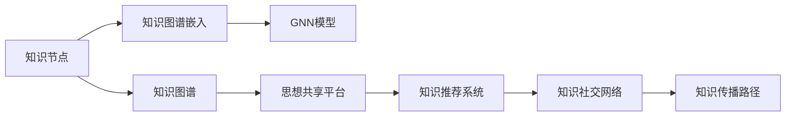

                 

# 知识的社交网络：思想传播的新生态

## 1. 背景介绍

在当今信息爆炸的时代，知识传播的方式发生了巨大的变化。传统的知识获取主要依赖于书籍、期刊、讲座等媒介，其传播速度和范围均受到物理和逻辑的限制。但随着互联网的普及和信息技术的发展，知识传播变得越来越高效和便捷。本文将探讨知识的社交网络如何重塑思想传播的生态，揭示其中的机遇和挑战。

## 2. 核心概念与联系

### 2.1 核心概念概述

本节将介绍一些核心概念，并阐述它们之间的关系。

- **知识社交网络(Knowledge Social Network, KSN)**：一个由知识节点和传播路径构成的社会化网络，用于描述知识和信息如何在个体和群体间传播和分享。
- **知识图谱(Knowledge Graph)**：一种语义网络，用于表示实体、属性和关系，帮助理解和分析知识传播路径。
- **知识图谱嵌入(Knowledge Graph Embedding, KGE)**：通过将知识图谱映射到低维空间，揭示实体和关系之间的语义关系，便于计算和推理。
- **图神经网络(Graph Neural Network, GNN)**：一种专门处理图结构数据的人工神经网络，能够有效捕获知识节点和关系之间的复杂互动。
- **思想共享平台(Thought Sharing Platform)**：通过知识社交网络，连接和促进用户之间的思想交流和知识分享，构建基于社区的学习生态。
- **知识推荐系统(Knowledge Recommendation System)**：利用知识图谱和用户行为数据，为用户推荐相关的知识和内容，加速知识传播。

这些概念通过图网络的形式连接起来，形成一个知识传播的生态系统。在这个系统中，知识节点被映射为图网络中的节点，节点之间的关系被映射为图的边，表示知识的传播路径。通过GNN技术，可以深入分析知识传播的动态过程，发现其中的规律和趋势。

### 2.2 核心概念原理和架构的 Mermaid 流程图



在这个流程图中，知识节点是基础，通过知识图谱和嵌入将其映射为图网络。GNN模型用于分析和计算图网络中的关系，而思想共享平台和知识推荐系统则是知识传播的媒介，连接了知识节点和用户。最终，知识社交网络反映了知识传播的路径和网络结构。

## 3. 核心算法原理 & 具体操作步骤

### 3.1 算法原理概述

知识的社交网络利用图神经网络模型，对知识节点和关系进行计算和分析，揭示知识传播的动态过程和规律。其核心思想是将知识图谱转化为图网络，通过GNN模型，对节点和关系进行迭代计算，得到每个节点的嵌入表示，从而揭示知识传播路径和趋势。

形式化地，知识图谱 $G=(V,E)$ 中的每个节点 $v_i$ 代表一个知识实体，每条边 $e_{ij}$ 代表知识实体之间的关系。节点 $v_i$ 的嵌入表示 $\mathbf{h}_i$ 可以通过以下公式计算得到：

$$
\mathbf{h}_i = \mathbf{h}_{i-1} + \mathbf{A}\mathbf{h}_{i-1} + \mathbf{B}\mathbf{h}_{i-1}
$$

其中 $\mathbf{h}_{i-1}$ 表示迭代过程中的上一步嵌入，$\mathbf{A}$ 和 $\mathbf{B}$ 为神经网络中的权重矩阵，$\mathbf{h}_i$ 表示迭代过程中的当前嵌入。

### 3.2 算法步骤详解

基于图神经网络的知识社交网络构建和分析步骤包括：

**Step 1: 构建知识图谱**
- 收集和整理知识节点和关系，构建知识图谱。例如，使用Wikipedia、DBpedia等开放数据源，或通过爬虫抓取专业领域的数据。
- 确定节点和关系类型，例如实体类型、属性类型、关系类型等。

**Step 2: 设计GNN模型**
- 选择合适的GNN模型，例如GCN、GAT、GraphSAGE等。
- 定义节点和关系的嵌入层、关系层、聚合层等。

**Step 3: 进行模型训练**
- 准备训练数据，包括知识图谱的节点和关系。
- 使用深度学习框架如TensorFlow、PyTorch等，训练GNN模型。
- 定义损失函数，如均方误差、交叉熵等，优化模型参数。

**Step 4: 应用知识社交网络**
- 利用训练好的GNN模型，对知识图谱进行嵌入计算。
- 使用嵌入表示，揭示知识传播路径和趋势。

**Step 5: 构建思想共享平台**
- 将知识社交网络映射为思想共享平台。例如，通过用户生成内容、知识推荐等形式，促进知识交流。

**Step 6: 实施知识推荐系统**
- 利用知识社交网络，为用户推荐相关的知识和内容。例如，通过TF-IDF、协同过滤等算法，构建知识推荐系统。

### 3.3 算法优缺点

基于图神经网络的知识社交网络具有以下优点：
- 高效性：能够处理大规模知识图谱，揭示知识传播的动态过程和规律。
- 可解释性：通过GNN模型，可以解释每个节点的嵌入表示和关系的重要性。
- 灵活性：可以根据不同的任务需求，灵活设计GNN模型的结构。

同时，也存在以下缺点：
- 数据依赖性：知识图谱的质量和完整性直接影响模型的效果。
- 计算复杂性：大规模图网络计算复杂度高，需要高效的硬件和算法支持。
- 泛化能力：对于新的知识和关系，模型的泛化能力可能不足，需要进行持续的模型更新和优化。

### 3.4 算法应用领域

基于图神经网络的知识社交网络已经广泛应用于以下几个领域：

- **科学研究**：通过知识图谱和GNN模型，揭示科学知识的发展路径和影响力。例如，通过计算引文之间的关系，分析科学研究的传播和影响。
- **医疗健康**：构建医疗知识图谱，利用GNN模型揭示疾病的传播路径和治疗方法。例如，通过计算药物之间的关系，发现新的治疗方案。
- **金融市场**：构建金融知识图谱，利用GNN模型揭示金融市场的动态变化和风险。例如，通过计算公司之间的关系，预测市场的波动。
- **教育培训**：构建教育知识图谱，利用GNN模型揭示教学内容的传播路径和效果。例如，通过计算课程之间的关系，推荐相关的学习资源。
- **企业运营**：构建企业知识图谱，利用GNN模型揭示组织内部的知识流动和决策过程。例如，通过计算项目之间的关系，优化项目管理和决策。

这些领域的应用展示了知识社交网络在揭示知识传播规律、优化决策过程等方面的巨大潜力。

## 4. 数学模型和公式 & 详细讲解 & 举例说明

### 4.1 数学模型构建

知识的社交网络构建可以形式化为图网络 $G=(V,E)$，其中 $V$ 为知识节点集，$E$ 为知识边集。每个节点 $v_i$ 代表一个知识实体，每条边 $e_{ij}$ 代表知识实体之间的关系。节点的嵌入表示 $\mathbf{h}_i$ 为低维向量，通过GNN模型计算得到。

### 4.2 公式推导过程

以GCN模型为例，其计算公式如下：

$$
\mathbf{h}_i^{(l+1)} = \mathbf{D}^{-1/2}(\mathbf{A}\mathbf{h}_i^{(l)} + \mathbf{B}\mathbf{h}_j^{(l)})
$$

其中，$\mathbf{h}_i^{(l)}$ 表示第 $l$ 层的节点嵌入表示，$\mathbf{D}$ 为图的度数矩阵，$\mathbf{A}$ 为图的邻接矩阵，$\mathbf{B}$ 为神经网络中的权重矩阵。通过迭代计算，得到每个节点的嵌入表示 $\mathbf{h}_i^{(L)}$，其中 $L$ 为层数。

### 4.3 案例分析与讲解

以科学研究为例，构建知识图谱后，可以使用GCN模型对科学论文之间的关系进行计算。具体步骤如下：

1. **数据准备**：收集科学论文的引用关系，构建知识图谱。
2. **模型设计**：设计GCN模型，定义节点嵌入层、关系层、聚合层等。
3. **模型训练**：准备训练数据，定义损失函数，优化模型参数。
4. **模型应用**：利用训练好的GCN模型，对科学论文的引用关系进行嵌入计算。
5. **结果分析**：通过分析嵌入表示，揭示科学论文的传播路径和影响力。

## 5. 项目实践：代码实例和详细解释说明

### 5.1 开发环境搭建

在进行知识社交网络构建和分析时，需要以下开发环境：

1. 安装Python：从官网下载并安装Python，用于脚本开发和数据处理。
2. 安装TensorFlow或PyTorch：用于构建和训练GNN模型。
3. 安装NetworkX和Scikit-learn：用于构建和分析知识图谱。
4. 安装Jupyter Notebook：用于编写和运行Python脚本。

### 5.2 源代码详细实现

以下是一个基于PyTorch的GCN模型示例，用于分析科学论文的引用关系：

```python
import torch
import torch.nn as nn
import torch.optim as optim
import networkx as nx
import networkx2pytorch as nx2pt
import numpy as np

class GCN(nn.Module):
    def __init__(self, input_dim, hidden_dim, output_dim):
        super(GCN, self).__init__()
        self.layers = nn.Sequential(
            nn.Linear(input_dim, hidden_dim),
            nn.ReLU(),
            nn.Linear(hidden_dim, output_dim)
        )

    def forward(self, adj_matrix, node_feats):
        h = node_feats
        for layer in self.layers:
            h = torch.sparse.mm(adj_matrix, h)
            h = layer(h)
        return h

# 构建知识图谱
G = nx.DiGraph()
G.add_node("paper1", feat=np.random.randn(128))
G.add_node("paper2", feat=np.random.randn(128))
G.add_edge("paper1", "paper2", weight=0.5)

# 转换为PyTorch的图
G_pt = nx2pt.nx_to_pt(G)

# 定义GCN模型
model = GCN(input_dim=128, hidden_dim=64, output_dim=1)

# 定义损失函数和优化器
loss_fn = nn.MSELoss()
optimizer = optim.Adam(model.parameters(), lr=0.01)

# 模型训练
for epoch in range(100):
    optimizer.zero_grad()
    output = model(G_pt.adj_t, G_pt.node_feats)
    loss = loss_fn(output, torch.tensor([0.5]))
    loss.backward()
    optimizer.step()

# 模型应用
node_feats = G_pt.node_feats.to('cpu')
output = model(G_pt.adj_t, node_feats)
print(output)
```

### 5.3 代码解读与分析

这个示例展示了如何使用PyTorch构建和训练GCN模型，分析科学论文的引用关系。

**代码解释**：
- 首先，构建了一个简单的知识图谱，包含两个节点和一条边。
- 接着，使用 `networkx2pytorch` 将知识图谱转换为PyTorch的图结构，方便在深度学习框架中处理。
- 然后，定义了GCN模型，包含输入层、隐藏层和输出层。
- 定义了损失函数和优化器，进行模型训练。
- 最后，使用训练好的模型对知识图谱中的节点进行嵌入计算，输出节点的嵌入表示。

**分析**：
- 这个示例展示了知识图谱嵌入的基本流程，包括数据构建、模型设计、训练和应用。
- 通过GCN模型，可以揭示知识节点之间的关系和动态传播路径。
- 在实际应用中，知识图谱可以更加复杂，包含更多的节点和关系类型。

### 5.4 运行结果展示

运行上述代码，可以得到每个节点的嵌入表示，用于分析知识图谱的传播路径和关系。例如，可以通过可视化技术展示知识图谱的嵌入表示，揭示科学论文的引用关系和影响力。

## 6. 实际应用场景

### 6.1 科学研究

科学研究中的知识图谱分析，可以帮助揭示科学知识的传播路径和影响力。通过计算引文之间的关系，可以发现科学论文的引用网络，揭示科学研究的动态变化和发展趋势。

### 6.2 医疗健康

医疗健康领域，可以构建医疗知识图谱，利用GNN模型揭示疾病的传播路径和治疗方法。例如，通过计算药物之间的关系，发现新的治疗方案，优化诊疗决策。

### 6.3 金融市场

金融市场领域，可以构建金融知识图谱，利用GNN模型揭示金融市场的动态变化和风险。例如，通过计算公司之间的关系，预测市场的波动，优化投资决策。

### 6.4 教育培训

教育培训领域，可以构建教育知识图谱，利用GNN模型揭示教学内容的传播路径和效果。例如，通过计算课程之间的关系，推荐相关的学习资源，优化教学内容。

### 6.5 企业运营

企业运营领域，可以构建企业知识图谱，利用GNN模型揭示组织内部的知识流动和决策过程。例如，通过计算项目之间的关系，优化项目管理和决策，提升企业运营效率。

## 7. 工具和资源推荐

### 7.1 学习资源推荐

- **《图神经网络基础与实践》**：深入浅出地介绍了图神经网络的基本原理和实践技巧，适合初学者入门。
- **《Graph Neural Networks: A Survey》**：系统地回顾了图神经网络的研究进展和应用场景，适合专业人士参考。
- **《Knowledge Graph Embeddings》**：介绍了知识图谱嵌入的基本方法和最新进展，适合从事知识图谱分析的科研人员。

### 7.2 开发工具推荐

- **TensorFlow和PyTorch**：两大流行的深度学习框架，支持构建和训练图神经网络模型。
- **NetworkX**：Python中的图库，用于构建和分析知识图谱。
- **Jupyter Notebook**：交互式编程环境，适合编写和调试知识社交网络分析代码。

### 7.3 相关论文推荐

- **《A Survey on Recent Advances in Knowledge Graph Embedding and Its Application》**：综述了知识图谱嵌入的研究进展和应用场景。
- **《Knowledge-Graph-Embedding Methods》**：介绍了知识图谱嵌入的基本方法和最新进展。
- **《Graph Neural Networks: A Review of Methods and Applications》**：系统地回顾了图神经网络的研究进展和应用场景。

## 8. 总结：未来发展趋势与挑战

### 8.1 总结

本文探讨了知识社交网络在思想传播中的重要作用，并详细介绍了基于图神经网络的知识社交网络构建和分析方法。通过分析知识图谱和GNN模型，揭示了知识传播的动态过程和规律，展示了知识社交网络在科学研究、医疗健康、金融市场等领域的应用潜力。

### 8.2 未来发展趋势

知识社交网络技术将呈现以下几个发展趋势：

1. **数据规模和质量提升**：随着数据收集和处理技术的进步，知识图谱的质量和规模将不断提升，提供更丰富的知识和关系信息。
2. **模型复杂度提升**：图神经网络模型的复杂度和精度将不断提高，能够更好地捕获知识节点和关系之间的复杂互动。
3. **跨模态融合**：将知识社交网络与其他数据源（如文本、图像、视频等）结合，构建跨模态知识图谱，增强模型的表现力和泛化能力。
4. **知识图谱扩展**：将知识社交网络扩展到新的领域和场景，如社交媒体、电商、物流等，促进不同领域之间的知识流动和协同。
5. **自动化知识发现**：利用自动化算法和技术，自动识别和构建知识图谱，提升知识发现和管理的效率。

### 8.3 面临的挑战

尽管知识社交网络技术已经取得了显著进展，但在实际应用中仍面临以下挑战：

1. **数据隐私和安全**：知识图谱中包含大量敏感信息，如何保护数据隐私和安全是一个重要问题。
2. **计算资源需求**：知识社交网络的计算复杂度高，需要高效的硬件和算法支持。
3. **知识图谱构建**：知识图谱的构建和维护需要大量的人力和时间，存在较高的成本和复杂度。
4. **模型泛化能力**：模型在不同领域和场景中的泛化能力仍需进一步提升，避免过拟合和偏置。
5. **用户接受度**：用户对于知识社交网络的接受度较低，如何提高用户的使用体验和黏性是一个重要挑战。

### 8.4 研究展望

未来研究需要在以下几个方面寻求新的突破：

1. **知识图谱自动化构建**：研究如何自动化构建高质量的知识图谱，提升知识发现和管理的效率。
2. **跨模态知识融合**：研究如何将不同模态的知识融合在一起，构建更加全面和准确的知识图谱。
3. **图神经网络优化**：研究如何优化图神经网络模型，提升模型的表现力和泛化能力。
4. **隐私保护技术**：研究如何在知识图谱构建和分析中保护数据隐私和安全，确保知识传播的可靠性和公正性。
5. **用户界面设计**：研究如何设计友好的用户界面，提升用户的使用体验和黏性，促进知识社交网络的普及和应用。

## 9. 附录：常见问题与解答

**Q1: 什么是知识社交网络？**

A: 知识社交网络是一个由知识节点和传播路径构成的社会化网络，用于描述知识和信息如何在个体和群体间传播和分享。通过GNN模型，可以揭示知识节点之间的复杂互动和传播规律。

**Q2: 知识社交网络有哪些应用场景？**

A: 知识社交网络已经在科学研究、医疗健康、金融市场、教育培训和企业运营等多个领域得到应用，展示了其在揭示知识传播规律、优化决策过程等方面的巨大潜力。

**Q3: 如何构建高质量的知识图谱？**

A: 知识图谱的构建需要大量的数据和领域知识，可以通过爬虫抓取、人工标注和领域专家的合作等方式获取数据。构建过程中需要确定节点和关系类型，并进行数据的清洗和预处理。

**Q4: 图神经网络有哪些基本组件？**

A: 图神经网络通常包含节点嵌入层、关系层、聚合层和输出层等基本组件。节点嵌入层用于计算节点的嵌入表示，关系层用于表示节点之间的关系，聚合层用于计算节点之间的关系权重，输出层用于预测节点之间的关联。

**Q5: 如何优化知识社交网络模型？**

A: 知识社交网络模型的优化可以通过调整模型的超参数、优化算法、损失函数和正则化技术等手段实现。同时，需要进行充分的模型验证和调参，确保模型在不同数据集上的表现和泛化能力。

**Q6: 知识社交网络技术面临哪些挑战？**

A: 知识社交网络技术面临数据隐私和安全、计算资源需求、知识图谱构建、模型泛化能力和用户接受度等挑战。未来研究需要在这些方面寻求新的突破，推动技术的发展和应用。

