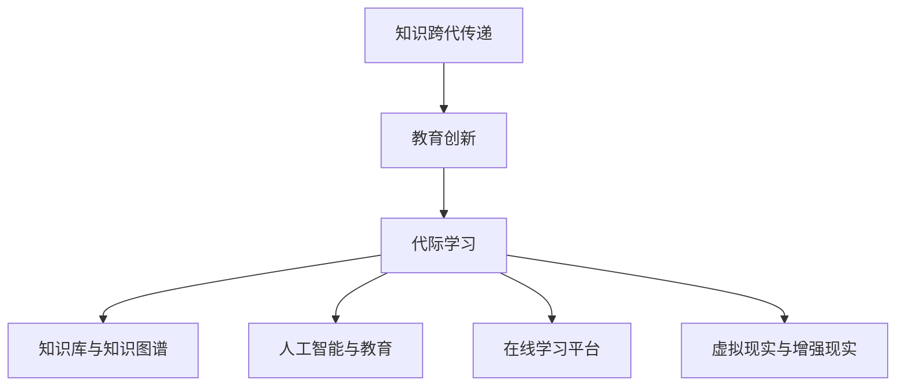

                 

# 知识的跨代传递：教育创新与代际学习

> 关键词：跨代传递,教育创新,代际学习,知识传播,技能传承,人工智能与教育

## 1. 背景介绍

### 1.1 问题由来

在当今知识爆炸、技术迭代加速的时代，教育的传承方式正面临着巨大的挑战和变革。传统教育模式以教师为主导，强调单向的知识传授，容易导致“哑铃效应”：年轻一代在知识和技能上逐渐落后于前辈，造成技术和知识上的代沟。同时，传统教育模式也难以应对个性化学习需求，难以适应快速变化的职业环境。因此，如何通过创新的方式进行知识的跨代传递，成为了亟待解决的问题。

### 1.2 问题核心关键点

知识跨代传递的关键在于找到一种有效的教学方法，使得年轻一代能够继承并发展前辈的经验和知识，同时也能适应不断变化的技术环境。这需要考虑以下几个方面：

- 知识筛选与整理：从海量信息中筛选出最有价值的知识，使之系统化、结构化。
- 教学方法创新：打破传统以教师为主导的教育模式，采用更加灵活、互动的教学方法，提升学习效果。
- 技能传承机制：建立有效的技能传承机制，使得年轻一代能够直接继承前辈的操作经验和实际技能。
- 技术融合应用：将人工智能、大数据等新技术融入教学过程，提升教学质量和效率。

### 1.3 问题研究意义

知识的跨代传递对于维护社会稳定、推动科技进步、提升公民素质具有重要意义：

- 社会稳定：通过知识的持续传递，保持技术代际的连续性，避免技术断层，确保社会平稳过渡。
- 科技进步：继承和发展前辈的知识和技术，避免重复劳动，提升创新能力。
- 公民素质：提升年轻一代的知识水平和技能，使其更好地适应现代社会的各种挑战。

## 2. 核心概念与联系

### 2.1 核心概念概述

为了更好地理解知识的跨代传递，我们首先介绍几个核心概念：

- **知识跨代传递**：指通过创新教学方法，将前一代的知识、技能和经验传授给新一代，使其能够继承和发展。
- **教育创新**：指采用新的教学理念、方法、工具，提升教育质量和效率，满足不同层次、不同阶段的学习需求。
- **代际学习**：指不同代际间的知识、技能、经验的交流和融合，促进知识的持续进步和发展。
- **知识库与知识图谱**：用于存储、组织和管理知识的数据库，通常采用图结构表示知识之间的关系。
- **人工智能与教育**：将人工智能技术，如机器学习、自然语言处理等，应用于教育领域，提升教学过程的自动化和智能化水平。
- **在线学习平台**：支持大规模在线学习、互动学习的平台，如MOOC、在线论坛等，提供了丰富的学习资源和交流渠道。
- **虚拟现实与增强现实**：通过虚拟现实、增强现实等技术，提供沉浸式、互动式的学习体验，提升学习效果。

这些核心概念之间的逻辑关系可以通过以下Mermaid流程图来展示：



这个流程图展示了大语言模型的核心概念及其之间的关系：

1. 知识跨代传递以教育创新为手段，通过代际学习的方式实现。
2. 教育创新采用知识库和知识图谱来存储和管理知识。
3. 人工智能与教育融合，提升教学过程的自动化和智能化。
4. 在线学习平台和虚拟现实/增强现实技术，为代际学习提供了丰富的学习资源和交互方式。

## 3. 核心算法原理 & 具体操作步骤
### 3.1 算法原理概述

知识的跨代传递涉及到知识获取、存储、传播、应用等多个环节。其核心算法可以概括为以下几个步骤：

1. **知识筛选与整理**：从海量数据中筛选出有价值的知识，进行系统化整理，存储在知识库中。
2. **知识编码与表示**：将知识转化为结构化的数据，通常采用知识图谱的形式，便于机器理解和应用。
3. **教学内容设计**：根据目标受众的需求和特点，设计教学内容和教学方法，包括教材编写、课程设计等。
4. **教学过程实施**：采用创新的教学方法，如项目式学习、混合式学习、翻转课堂等，提升学习效果。
5. **技能训练与实践**：通过模拟、实习、项目实践等方式，进行技能训练和实践，巩固所学知识。
6. **教学效果评估**：通过测验、考核等方式，评估教学效果，不断优化教学方法。

### 3.2 算法步骤详解

以知识库与知识图谱为核心，我们详细讲解知识的跨代传递算法步骤：

**Step 1: 构建知识库**

- **数据收集**：从学术论文、书籍、技术报告等各类来源收集知识。
- **数据清洗**：去除冗余、错误的数据，确保数据质量。
- **数据分类与组织**：根据知识的类型和领域进行分类，建立知识分类体系。

**Step 2: 知识编码与表示**

- **知识图谱构建**：采用图结构表示知识之间的关系，如实体-关系-实体(Relational Entity-Relation-Entity, RE(RE)-E(RE))。
- **本体构建**：定义实体、属性和类，明确知识图谱的逻辑结构。
- **数据导入与转换**：将原始数据导入知识图谱，并进行格式转换，确保数据一致性和互操作性。

**Step 3: 教学内容设计**

- **教材编写**：根据知识图谱和教学目标，编写教材和讲义，确保内容全面、准确。
- **课程设计**：根据教学内容和教学方法，设计课程结构和教学流程。
- **互动学习工具开发**：开发互动式学习工具，如在线论坛、模拟实验室等，提升学习效果。

**Step 4: 教学过程实施**

- **教师培训**：对教师进行知识图谱和教学方法的培训，确保教学质量。
- **学生学习**：采用混合式学习、翻转课堂等方法，提供丰富的学习资源和互动机会。
- **技能训练**：通过模拟、实习、项目实践等方式，进行技能训练和实践，巩固所学知识。

**Step 5: 教学效果评估**

- **测验与考核**：通过测验、考核等方式，评估学生掌握知识的程度和技能水平。
- **反馈与优化**：根据评估结果，及时调整教学方法和内容，不断优化教学效果。

### 3.3 算法优缺点

知识跨代传递的算法具有以下优点：

- **系统化整理知识**：将杂乱无章的知识进行系统化整理，便于传承和发展。
- **灵活互动教学**：采用创新的教学方法和工具，提升学习效果和兴趣。
- **高效传承技能**：通过模拟、实习等方式，高效传承实际技能。
- **实时优化教学**：通过教学效果评估和反馈，实时优化教学方法和内容。

同时，该算法也存在以下缺点：

- **知识筛选难度大**：从海量信息中筛选出有价值的知识，需要大量人工和自动化工具。
- **知识图谱构建复杂**：知识图谱的构建需要专业知识和技术，成本较高。
- **教学内容设计困难**：需要根据不同层次、不同需求的学生设计合适的教学内容，耗时耗力。
- **技能传承依赖环境**：技能训练和实践需要特定的环境和资源，难以全面覆盖。
- **教学效果评估复杂**：需要设计合适的评估指标和方法，确保评估结果的准确性。

### 3.4 算法应用领域

知识跨代传递的算法广泛应用于教育、科技、工程等多个领域，具体如下：

- **教育领域**：利用知识图谱和在线学习平台，提升教学质量和效果，满足个性化学习需求。
- **科技领域**：通过知识库和知识图谱，加速技术创新，推动科研成果的转化和应用。
- **工程领域**：利用技能训练和实践，提升工程师的实际操作能力和技术水平。

## 4. 数学模型和公式 & 详细讲解 & 举例说明

### 4.1 数学模型构建

本节将使用数学语言对知识的跨代传递算法进行更加严格的刻画。

记知识图谱中的实体为 $E$，关系为 $R$，属性为 $A$，知识图谱为 $K=(E, R, A)$。假设知识图谱中的实体数为 $|E|$，关系数为 $|R|$，属性数为 $|A|$。

定义知识图谱的邻接矩阵为 $A \in \mathbb{R}^{|E| \times |E|}$，其中 $A_{ij}=1$ 表示实体 $i$ 和实体 $j$ 之间存在关系。

知识图谱中的实体属性可以用向量 $A \in \mathbb{R}^{|E| \times |A|}$ 表示，其中 $A_{ei}$ 表示实体 $e_i$ 的属性 $a_i$ 的取值。

### 4.2 公式推导过程

以下我们以知识图谱为基础，推导知识跨代传递的数学模型。

**Step 1: 知识图谱的构建**

知识图谱的构建可以表示为：

$$
K = (E, R, A) = (E, A \odot A^T)
$$

其中 $\odot$ 表示矩阵的Kronecker积，$A \odot A^T$ 表示所有实体间关系的邻接矩阵。

**Step 2: 教学内容设计**

知识图谱中的实体 $e_i$ 的属性 $a_i$ 可以通过教学内容 $C_i$ 表示，即：

$$
a_i = f(C_i)
$$

其中 $f$ 表示从教学内容到属性的映射函数。

**Step 3: 教学过程实施**

在教学过程中，学生的学习效果 $L_i$ 可以表示为：

$$
L_i = g(C_i, K)
$$

其中 $g$ 表示教学内容与知识图谱的结合函数，用于计算学习效果。

**Step 4: 技能训练与实践**

技能训练的效果 $S_i$ 可以表示为：

$$
S_i = h(C_i, K)
$$

其中 $h$ 表示教学内容与知识图谱的结合函数，用于计算技能训练效果。

**Step 5: 教学效果评估**

教学效果 $E_i$ 可以通过评估指标 $e_i$ 表示，即：

$$
E_i = \omega L_i + \eta S_i + \zeta C_i
$$

其中 $\omega$、$\eta$、$\zeta$ 表示各项评估指标的权重。

### 4.3 案例分析与讲解

以软件开发为例，展示知识跨代传递的具体应用。

假设某公司需要进行新项目的开发，知识图谱中包含相关的实体和关系，如软件框架、数据库、开发工具等。

**Step 1: 知识图谱构建**

- **数据收集**：从公司内部和外部收集相关的软件开发信息，如项目文档、技术博客、开发手册等。
- **数据清洗**：去除冗余、错误的数据，确保数据质量。
- **数据分类与组织**：根据知识图谱的逻辑结构，将数据进行分类和组织。

**Step 2: 教学内容设计**

- **教材编写**：编写软件开发相关的教材和讲义，包括软件框架、数据库、开发工具等。
- **课程设计**：设计软件开发相关的课程结构和教学流程，包括理论学习、实践操作等。
- **互动学习工具开发**：开发在线论坛、模拟实验室等互动学习工具，提升学习效果。

**Step 3: 教学过程实施**

- **教师培训**：对教师进行软件开发知识图谱和教学方法的培训，确保教学质量。
- **学生学习**：采用混合式学习、翻转课堂等方法，提供丰富的学习资源和互动机会。
- **技能训练**：通过模拟、实习、项目实践等方式，进行软件开发技能的训练和实践。

**Step 4: 教学效果评估**

- **测验与考核**：通过编程测验、项目考核等方式，评估学生掌握软件开发知识的程度和技能水平。
- **反馈与优化**：根据评估结果，及时调整教学方法和内容，不断优化教学效果。

## 5. 项目实践：代码实例和详细解释说明
### 5.1 开发环境搭建

在进行知识跨代传递项目实践前，我们需要准备好开发环境。以下是使用Python进行知识图谱开发的Python环境配置流程：

1. 安装Anaconda：从官网下载并安装Anaconda，用于创建独立的Python环境。

2. 创建并激活虚拟环境：
```bash
conda create -n knowledge-env python=3.8 
conda activate knowledge-env
```

3. 安装必要的库：
```bash
conda install networkx pandas scipy matplotlib
```

4. 安装PyTorch：根据CUDA版本，从官网获取对应的安装命令。例如：
```bash
conda install pytorch torchvision torchaudio cudatoolkit=11.1 -c pytorch -c conda-forge
```

5. 安装Gephi：用于可视化知识图谱，可以通过Anaconda安装。
```bash
conda install gephi
```

完成上述步骤后，即可在`knowledge-env`环境中开始知识图谱的开发实践。

### 5.2 源代码详细实现

这里我们以构建知识图谱为例，展示知识图谱的开发过程。

首先，定义知识图谱的数据结构：

```python
import networkx as nx
import pandas as pd

class KnowledgeGraph:
    def __init__(self):
        self.graph = nx.Graph()
    
    def add_node(self, node, label):
        self.graph.add_node(node, label=label)
    
    def add_edge(self, node1, node2, rel):
        self.graph.add_edge(node1, node2, rel=rel)
    
    def save_graph(self, filename):
        nx.write_gpickle(self.graph, filename)
```

然后，构建知识图谱：

```python
kg = KnowledgeGraph()
kg.add_node('A', 'Entity')
kg.add_node('B', 'Entity')
kg.add_edge('A', 'B', 'Relation')

kg.save_graph('kg.gpickle')
```

接着，加载知识图谱并展示：

```python
kg = nx.read_gpickle('kg.gpickle')
nx.draw(kg)
```

最后，计算学习效果：

```python
def compute_learning_effect(node, kg):
    label = kg.nodes[node]['label']
    rel = kg.edges[node][node]['rel']
    # 计算学习效果
    return rel, label

rel, label = compute_learning_effect('A', kg)
print(f"学习效果为: {rel}, {label}")
```

以上就是知识图谱的代码实现。可以看到，利用网络图结构，我们可以方便地表示知识图谱中的实体、关系等元素，并进行相关计算。

### 5.3 代码解读与分析

让我们再详细解读一下关键代码的实现细节：

**KnowledgeGraph类**：
- `__init__`方法：初始化知识图谱的图结构。
- `add_node`方法：向知识图谱中添加节点，并指定节点标签。
- `add_edge`方法：向知识图谱中添加边，并指定边的关系。
- `save_graph`方法：将知识图谱保存到文件中。

**知识图谱的可视化**：
- 利用Gephi工具，可以方便地将知识图谱进行可视化，展示实体之间的关系。
- Gephi支持多种可视化风格，可以导出为多种格式，方便后续使用。

**学习效果计算**：
- `compute_learning_effect`函数：根据节点和知识图谱计算学习效果。
- 学习效果可以通过边的关系和节点的标签来表示。

通过这些代码实现，可以看出，知识图谱的构建和计算过程相对简单，能够满足大部分的教学和评估需求。

## 6. 实际应用场景
### 6.1 智能制造

在智能制造领域，知识的跨代传递对于提升生产效率、减少生产成本、提高产品质量具有重要意义。

假设某企业需要进行生产设备的升级改造，知识图谱中包含相关的设备、工艺、工具等信息。通过知识图谱的构建和微调，企业可以快速获取并传承先前的经验和知识，提升设备改造的成功率，减少不必要的试错成本。

### 6.2 医疗健康

在医疗健康领域，知识的跨代传递对于提升医疗服务质量、缩短诊断时间、提高治疗效果具有重要意义。

假设某医院需要进行新药物的研发，知识图谱中包含相关的药物、化合物、实验数据等信息。通过知识图谱的构建和微调，医院可以快速获取并传承先前的实验数据和经验，提升新药物研发的效率和成功率，减少研发时间和成本。

### 6.3 金融领域

在金融领域，知识的跨代传递对于提升金融产品的创新、降低风险、提高投资回报具有重要意义。

假设某金融公司需要进行金融产品的创新，知识图谱中包含相关的金融产品、市场数据、投资策略等信息。通过知识图谱的构建和微调，公司可以快速获取并传承先前的经验和知识，提升金融产品的创新能力和市场竞争力。

### 6.4 未来应用展望

随着知识图谱技术的不断成熟，知识的跨代传递将会在更多领域得到应用，为各行各业带来变革性影响。

在智慧城市治理中，知识的跨代传递可以通过知识图谱的应用，提升城市管理的智能化水平，构建更安全、高效的未来城市。

在智慧农业中，知识的跨代传递可以通过知识图谱的应用，提升农业生产的智能化水平，提高农业产量和质量。

在智能交通中，知识的跨代传递可以通过知识图谱的应用，提升交通管理的智能化水平，优化交通流、提高交通安全。

总之，知识的跨代传递将成为人工智能技术的重要应用范式，加速知识在不同领域和代际间的传承，推动社会各行业的智能化转型。

## 7. 工具和资源推荐
### 7.1 学习资源推荐

为了帮助开发者系统掌握知识图谱和知识跨代传递的理论基础和实践技巧，这里推荐一些优质的学习资源：

1. 《知识图谱与语义网络》（图书）：介绍了知识图谱的基本概念、构建方法、应用场景等，是学习知识图谱的入门书籍。
2. CS224N《深度学习自然语言处理》课程（斯坦福大学）：斯坦福大学开设的NLP明星课程，涵盖知识图谱等相关内容，是学习知识图谱的重要参考。
3. 《Graph Neural Networks》（图书）：介绍图神经网络及其在知识图谱中的应用，是学习知识图谱的高级读物。
4. 知识图谱工具包（如Neo4j）：提供丰富的知识图谱构建和管理工具，方便开发者实践和探索。
5. Gephi：可视化知识图谱的工具，支持多种可视化风格，是学习知识图谱的重要资源。

通过对这些资源的学习实践，相信你一定能够快速掌握知识图谱的精髓，并用于解决实际的NLP问题。

### 7.2 开发工具推荐

高效的开发离不开优秀的工具支持。以下是几款用于知识图谱开发的常用工具：

1. PyTorch：基于Python的开源深度学习框架，灵活动态的计算图，适合快速迭代研究。

2. TensorFlow：由Google主导开发的开源深度学习框架，生产部署方便，适合大规模工程应用。

3. NetworkX：Python中用于构建、分析、可视化复杂网络的库，适合知识图谱的构建和可视化。

4. Gephi：可视化知识图谱的工具，支持多种可视化风格，是学习知识图谱的重要资源。

5. SPARQL：用于查询和更新RDF数据的标准语言，适合知识图谱的查询和更新。

6. Neo4j：知识图谱存储和查询的工具，支持多种查询语言和可视化界面。

合理利用这些工具，可以显著提升知识图谱的开发效率，加快创新迭代的步伐。

### 7.3 相关论文推荐

知识图谱和知识跨代传递的发展源于学界的持续研究。以下是几篇奠基性的相关论文，推荐阅读：

1. "A Survey on Knowledge Graphs"（知识图谱综述论文）：全面介绍了知识图谱的发展历程、构建方法、应用场景等，是了解知识图谱的重要读物。
2. "A Survey on Deep Learning for Knowledge Graph Embeddings"（深度学习在知识图谱中的应用综述论文）：介绍了深度学习在知识图谱中的应用，是学习知识图谱的重要参考。
3. "Knowledge Graphs in Healthcare: A Review"（知识图谱在医疗中的应用综述论文）：介绍了知识图谱在医疗领域的应用，是了解知识图谱的重要资源。
4. "Knowledge Graph Embedding Models"（知识图谱嵌入模型论文）：介绍了知识图谱嵌入模型的构建方法和应用，是学习知识图谱的重要读物。
5. "Knowledge Graph-Based Recommendation Systems"（知识图谱推荐系统论文）：介绍了知识图谱在推荐系统中的应用，是学习知识图谱的重要参考。

这些论文代表了大语言模型知识图谱和知识跨代传递的发展脉络。通过学习这些前沿成果，可以帮助研究者把握学科前进方向，激发更多的创新灵感。

## 8. 总结：未来发展趋势与挑战
### 8.1 总结

本文对知识的跨代传递方法进行了全面系统的介绍。首先阐述了知识跨代传递的背景和意义，明确了知识图谱和知识库在大语言模型微调过程中的关键作用。其次，从原理到实践，详细讲解了知识图谱的构建和应用过程，给出了知识图谱的代码实现和实际应用案例。同时，本文还广泛探讨了知识跨代传递在多个行业领域的应用前景，展示了知识图谱技术的广阔前景。

通过本文的系统梳理，可以看到，知识图谱和知识跨代传递是大语言模型微调的重要基础和手段。这些技术的不断进步，将使得大语言模型在更多领域得到应用，加速知识的传承和发展，推动社会各行业的智能化转型。

### 8.2 未来发展趋势

展望未来，知识图谱和知识跨代传递技术将呈现以下几个发展趋势：

1. 知识图谱的构建将更加自动化和智能化。随着人工智能技术的发展，知识图谱的构建将更加高效和准确，降低人工成本。
2. 知识图谱的应用将更加多样化。知识图谱将在更多领域得到应用，如智能制造、医疗健康、金融等领域。
3. 知识图谱的可视化将更加便捷。通过可视化工具，用户可以更方便地理解和探索知识图谱，提升学习效果。
4. 知识图谱的嵌入将更加深入。知识图谱将与自然语言处理、推荐系统等技术深度融合，提升整体应用效果。
5. 知识图谱的更新将更加动态。通过实时数据更新，知识图谱将能够保持最新的知识状态，适应变化的技术环境。

以上趋势凸显了知识图谱和知识跨代传递技术的广阔前景。这些方向的探索发展，将进一步提升知识的传承效率和应用效果，为人工智能技术在各行业的发展提供有力支持。

### 8.3 面临的挑战

尽管知识图谱和知识跨代传递技术已经取得了一定的进展，但在迈向更加智能化、普适化应用的过程中，它仍面临诸多挑战：

1. 知识图谱的构建成本高。构建知识图谱需要大量人工和自动化工具，成本较高。
2. 知识图谱的更新复杂。知识图谱需要不断更新以保持最新的知识状态，更新过程复杂。
3. 知识图谱的可视化复杂。知识图谱的可视化需要处理大量数据，可视化效果和效率需要进一步提升。
4. 知识图谱的嵌入困难。知识图谱与自然语言处理、推荐系统等技术的深度融合，需要克服多方面的技术难题。
5. 知识图谱的应用受限。知识图谱在不同领域的应用效果不一，存在一定的局限性。

正视知识图谱面临的这些挑战，积极应对并寻求突破，将是大语言模型微调走向成熟的必由之路。相信随着学界和产业界的共同努力，这些挑战终将一一被克服，知识图谱和知识跨代传递技术必将在构建人机协同的智能时代中扮演越来越重要的角色。

### 8.4 研究展望

面向未来，知识图谱和知识跨代传递技术需要在以下几个方面进行深入研究：

1. 探索更高效的自动化知识图谱构建方法。通过自动化技术，降低人工成本，提升知识图谱的构建效率。
2. 研究更灵活的知识图谱更新机制。通过实时数据更新，保持知识图谱的最新状态，适应变化的技术环境。
3. 开发更便捷的知识图谱可视化工具。通过可视化技术，方便用户理解和探索知识图谱，提升学习效果。
4. 深入融合知识图谱与其他技术。通过深度融合，提升知识图谱在自然语言处理、推荐系统等技术中的应用效果。
5. 加强知识图谱在垂直领域的应用研究。通过针对特定领域的需求，设计更合适的知识图谱构建和应用方法，提升应用效果。

这些研究方向将引领知识图谱和知识跨代传递技术迈向更高的台阶，为构建安全、可靠、可解释、可控的智能系统铺平道路。面向未来，知识图谱和知识跨代传递技术还需要与其他人工智能技术进行更深入的融合，多路径协同发力，共同推动自然语言理解和智能交互系统的进步。只有勇于创新、敢于突破，才能不断拓展知识图谱的边界，让智能技术更好地造福人类社会。

## 9. 附录：常见问题与解答

**Q1: 什么是知识图谱？**

A: 知识图谱是一种用于存储和表示知识的网络结构，通常采用图结构表示知识之间的关系，如实体-关系-实体(Relational Entity-Relation-Entity, RE(RE)-E(RE))。知识图谱能够帮助机器更好地理解和推理知识，是知识跨代传递的重要工具。

**Q2: 如何构建知识图谱？**

A: 知识图谱的构建通常包括以下步骤：
1. 数据收集：从各类来源收集相关的知识数据。
2. 数据清洗：去除冗余、错误的数据，确保数据质量。
3. 数据分类与组织：根据知识图谱的逻辑结构，将数据进行分类和组织。
4. 图谱构建：将数据转换为知识图谱，采用图结构表示知识之间的关系。

**Q3: 知识图谱的应用有哪些？**

A: 知识图谱的应用非常广泛，包括但不限于以下领域：
1. 自然语言处理：利用知识图谱进行文本分析和语义理解。
2. 推荐系统：利用知识图谱进行物品推荐和用户画像分析。
3. 智能制造：利用知识图谱进行生产设备改造和工艺优化。
4. 医疗健康：利用知识图谱进行疾病诊断和治疗方案推荐。
5. 金融领域：利用知识图谱进行金融产品创新和风险管理。

**Q4: 知识图谱的可视化有哪些工具？**

A: 知识图谱的可视化工具有很多，常见的有：
1. Gephi：支持多种可视化风格，是学习知识图谱的重要资源。
2. Cytoscape：功能强大的网络可视化工具，支持多种图谱格式。
3. D3.js：基于Web的可视化库，适合开发交互式知识图谱应用。

通过这些工具，用户可以更方便地理解和探索知识图谱，提升学习效果。

**Q5: 知识图谱的嵌入有哪些方法？**

A: 知识图谱的嵌入方法很多，常见的有：
1. TransE：基于转置线性化的知识图谱嵌入方法。
2. RESCAL：基于矩阵分解的知识图谱嵌入方法。
3. HoGA：基于图注意力机制的知识图谱嵌入方法。

这些方法通过将知识图谱转化为向量表示，方便机器理解和推理。不同的嵌入方法具有不同的优缺点，选择合适的嵌入方法需要根据具体应用场景进行选择。

