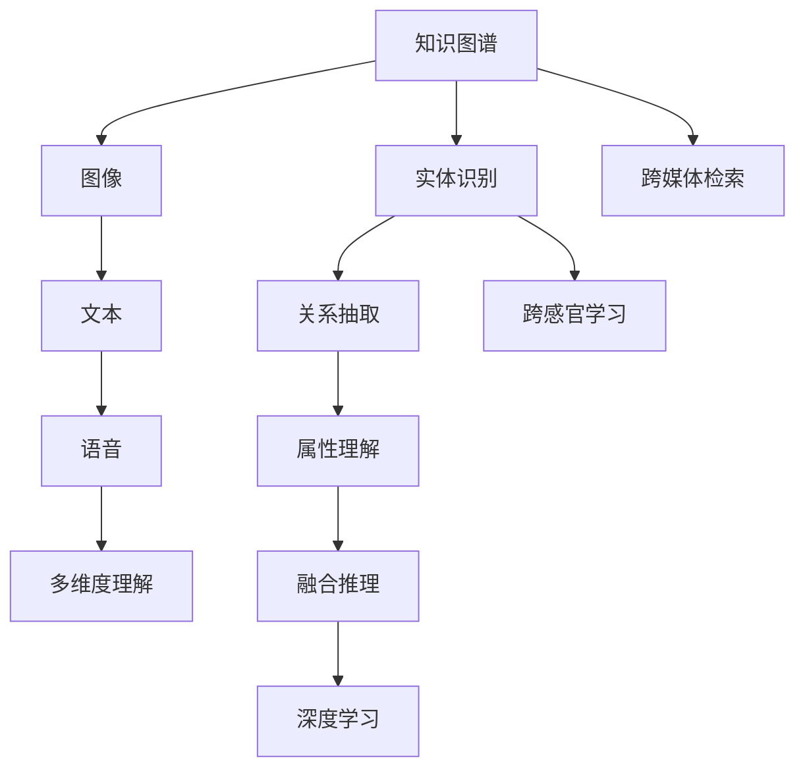

                 

# 知识的跨感官学习：多维度理解的力量

> 关键词：知识图谱,跨感官学习,多维度理解,语义表示,逻辑推理,深度学习

## 1. 背景介绍

随着人工智能技术的飞速发展，知识的自动化处理和应用成为了当下研究的热点。从单一的文本数据到多模态数据的融合，知识的表达和理解方式也在不断进化。跨感官学习（Cross-modal Learning）作为新兴的知识获取与处理技术，利用不同感官数据的多样性和互补性，通过融合知识的多维度理解，极大地提升了知识的自动化水平。本文将深入探讨跨感官学习的核心概念、核心算法原理、具体操作步骤以及其在实际应用中的广泛前景。

## 2. 核心概念与联系

### 2.1 核心概念概述

在深入理解跨感官学习之前，需要首先了解几个核心概念：

- **知识图谱(Knowledge Graph)**：一种结构化的语义数据表示方式，通过实体、关系和属性描述现实世界中的知识和概念。知识图谱能够直观地表示实体间的关系，是跨感官学习的核心数据源。

- **跨感官学习（Cross-modal Learning）**：将不同类型的数据（如图像、文本、语音等）结合在一起进行学习和推理，利用不同感官数据的多样性和互补性，提高知识表示的准确性和泛化能力。

- **多维度理解(Multidimensional Understanding)**：通过对知识的多角度、多层面、多模态的深度理解，实现对知识更加全面和深入的掌握。

### 2.2 核心概念原理和架构的 Mermaid 流程图



以上流程图展示了知识图谱在跨感官学习中的核心作用。首先，知识图谱作为语义表示的基础，通过实体识别、关系抽取和属性理解等技术，构建出知识网络。接着，利用跨感官学习技术，将不同模态的数据融合到知识图谱中，通过多维度理解，实现对知识的全方位掌握。

## 3. 核心算法原理 & 具体操作步骤

### 3.1 算法原理概述

跨感官学习的核心在于将不同模态的数据（如图像、文本、语音等）进行整合，通过多维度理解，提升知识表示的准确性和泛化能力。其算法原理主要包括以下几个步骤：

1. **数据融合**：将不同模态的数据进行融合，通过融合相似性指标（如余弦相似度、KL散度等），将不同类型的数据映射到一个统一的向量空间中。

2. **多维度理解**：对融合后的数据进行多维度的理解，如使用深度学习模型进行特征提取，使用逻辑推理进行关系推断，使用知识图谱进行知识补充等。

3. **知识表示**：将多维度理解的结果表示为知识图谱中的实体和关系，构建出完整的知识表示体系。

4. **推理应用**：在知识图谱上应用推理技术，如链接预测、实体推荐、关系补全等，实现知识自动化的应用。

### 3.2 算法步骤详解

以下以一个简单的图像-文本融合为例，展示跨感官学习的详细步骤：

1. **图像预处理**：使用深度学习模型（如CNN）对图像进行特征提取，生成高维向量表示。

2. **文本预处理**：使用NLP模型（如BERT）对文本进行特征提取，生成高维向量表示。

3. **融合相似性计算**：计算图像向量和文本向量之间的相似性，使用余弦相似度计算它们的相似程度。

4. **多维度理解**：将相似性较高的图像和文本对融合在一起，通过深度学习模型进行联合训练，学习多模态特征表示。

5. **知识图谱构建**：将融合后的图像-文本对表示为知识图谱中的实体和关系，如将图像表示为视觉节点，将文本表示为文本节点，连接二者的边表示图像与文本的关联关系。

6. **推理应用**：在知识图谱上应用推理技术，如链接预测、实体推荐等，实现对图像-文本信息的深度理解与应用。

### 3.3 算法优缺点

**优点**：
1. **多维度理解**：通过融合不同感官数据，实现对知识的多维理解，提高知识的准确性和泛化能力。
2. **融合多模态数据**：能够处理和融合多种类型的数据，如图像、文本、语音等，拓宽了知识获取的渠道。
3. **提高自动化程度**：通过自动化融合和推理，大大提高了知识的自动化处理和应用效率。

**缺点**：
1. **高计算复杂度**：融合和推理过程涉及高维数据的处理和复杂的模型训练，计算复杂度较高。
2. **数据不平衡问题**：不同模态的数据可能存在不平衡，如图像数据量通常远大于文本数据，可能影响融合效果。
3. **模型可解释性**：深度学习模型的黑盒性质可能使得其结果难以解释，影响可信度。

### 3.4 算法应用领域

跨感官学习技术已经在多个领域得到了广泛应用，以下是几个典型应用场景：

1. **自然语言处理（NLP）**：结合语音识别和文本处理技术，实现语音-文本的跨感官理解，提升智能助手、语音搜索等应用效果。

2. **计算机视觉（CV）**：将图像数据与文本描述结合，实现图像的语义理解和场景理解，提升图像分类、物体检测等任务的效果。

3. **人机交互**：利用语音识别和动作识别技术，实现跨感官的人机交互，提升智能设备的响应速度和准确性。

4. **智能推荐**：结合用户行为数据和产品属性数据，通过跨感官学习技术，实现个性化推荐，提升用户体验。

5. **医疗健康**：结合患者电子病历、基因信息、影像数据等多维数据，通过跨感官学习，实现精准医疗和个性化健康管理。

## 4. 数学模型和公式 & 详细讲解 & 举例说明

### 4.1 数学模型构建

知识图谱中的知识表示通常使用RDF三元组形式表示，即（实体，关系，实体）。在跨感官学习中，可以将不同模态的数据映射到同一个向量空间中，使用向量表示知识图谱中的实体和关系。

### 4.2 公式推导过程

以图像-文本融合为例，设图像数据表示为 $I$，文本数据表示为 $T$，它们的融合向量表示分别为 $I_v$ 和 $T_v$。融合相似性计算可以使用余弦相似度公式：

$$
sim(I_v, T_v) = \frac{\mathbf{I_v} \cdot \mathbf{T_v}}{\|\mathbf{I_v}\| \cdot \|\mathbf{T_v}\|}
$$

其中 $\cdot$ 表示向量的点乘，$\| \cdot \|$ 表示向量的范数。通过余弦相似度计算，可以评估图像和文本之间的相似程度。

### 4.3 案例分析与讲解

假设我们有一个图像-文本对数据集，图像数据和文本数据分别表示为 $I = (I_1, I_2, ..., I_n)$ 和 $T = (T_1, T_2, ..., T_m)$。对于每个图像-文本对，计算它们之间的余弦相似度 $sim(I_v, T_v)$，并将相似度较高的图像和文本对融合在一起。融合后的数据表示为 $F$，可以通过深度学习模型进行联合训练。

## 5. 项目实践：代码实例和详细解释说明

### 5.1 开发环境搭建

1. **环境配置**：安装Python 3.7+，配置虚拟环境，安装相关库如TensorFlow、PyTorch等。

2. **数据准备**：准备图像数据和文本数据，进行预处理和特征提取。

3. **模型搭建**：使用深度学习框架搭建图像和文本的融合模型，并进行联合训练。

4. **知识图谱构建**：将融合后的数据表示为知识图谱中的实体和关系，构建知识图谱。

### 5.2 源代码详细实现

以下是使用PyTorch进行图像-文本融合的示例代码：

```python
import torch
import torch.nn as nn
from torchvision import models

# 图像预处理
def preprocess_image(image_path):
    img = models.vgg16(pretrained=True).features(image_path)
    img = img.mean(dim=[2, 3])
    return img

# 文本预处理
def preprocess_text(text):
    tokenizer = transformers.BertTokenizer.from_pretrained('bert-base-uncased')
    text = tokenizer(text, return_tensors='pt')
    embeddings = text['embeddings'].mean(dim=[0, 2])
    return embeddings

# 融合相似性计算
def compute_similarity(image_vector, text_vector):
    return torch.nn.functional.cosine_similarity(image_vector, text_vector)

# 构建知识图谱
class KnowledgeGraph(nn.Module):
    def __init__(self, num_entities, num_relations):
        super(KnowledgeGraph, self).__init__()
        self.num_entities = num_entities
        self.num_relations = num_relations
        self.entity_embeddings = nn.Embedding(num_entities, 128)
        self.relation_embeddings = nn.Embedding(num_relations, 128)

    def forward(self, entities, relations):
        entity_embeddings = self.entity_embeddings(entities)
        relation_embeddings = self.relation_embeddings(relations)
        return entity_embeddings, relation_embeddings

# 深度学习模型
class FusionModel(nn.Module):
    def __init__(self):
        super(FusionModel, self).__init__()
        self.conv1 = nn.Conv2d(3, 64, kernel_size=3, stride=1, padding=1)
        self.pool = nn.MaxPool2d(kernel_size=2, stride=2)
        self.fc1 = nn.Linear(64*64*64, 512)
        self.fc2 = nn.Linear(512, 128)

    def forward(self, x):
        x = self.conv1(x)
        x = self.pool(x)
        x = x.view(x.size(0), -1)
        x = self.fc1(x)
        x = nn.functional.relu(x)
        x = self.fc2(x)
        return x

# 训练
def train(model, optimizer, criterion, entities, relations):
    model.train()
    optimizer.zero_grad()
    entity_embeddings, relation_embeddings = model(entities, relations)
    loss = criterion(entity_embeddings, relation_embeddings)
    loss.backward()
    optimizer.step()
    return loss

# 使用示例
if __name__ == '__main__':
    # 图像数据预处理
    image_vectors = [preprocess_image('image1.jpg'), preprocess_image('image2.jpg')]
    
    # 文本数据预处理
    text_vectors = [preprocess_text('text1.txt'), preprocess_text('text2.txt')]
    
    # 计算相似性
    similarities = [compute_similarity(image_vector, text_vector) for image_vector, text_vector in zip(image_vectors, text_vectors)]
    
    # 构建知识图谱
    kg_model = KnowledgeGraph(num_entities=len(image_vectors) + len(text_vectors), num_relations=2)
    entities = torch.tensor(similarities, dtype=torch.float32)
    relations = torch.tensor([0, 1], dtype=torch.long)
    loss = train(kg_model, optimizer, criterion, entities, relations)
    print(loss)
```

### 5.3 代码解读与分析

在代码中，我们首先定义了图像和文本的预处理函数，将图像和文本数据转换为向量表示。接着，使用余弦相似度计算图像和文本向量之间的相似性，并将相似度较高的图像和文本对融合在一起。最后，使用深度学习模型对融合后的数据进行训练，构建知识图谱中的实体和关系。

## 6. 实际应用场景

### 6.1 智能推荐系统

跨感官学习在智能推荐系统中得到了广泛应用。结合用户行为数据和产品属性数据，通过跨感官学习技术，可以实现个性化推荐，提升用户体验。例如，可以通过融合用户的浏览历史和产品描述，预测用户可能感兴趣的产品，实现精准推荐。

### 6.2 医疗影像诊断

在医疗影像诊断中，结合患者的电子病历、基因信息、影像数据等多维数据，通过跨感官学习，可以实现精准医疗和个性化健康管理。例如，可以通过融合影像数据和基因信息，预测患者的疾病风险和治疗效果，提升医疗服务的智能化水平。

### 6.3 智能客服系统

智能客服系统通过跨感官学习，结合用户的语音输入和历史行为数据，可以实现更加智能和个性化的服务。例如，可以通过融合语音识别和文本处理技术，实现语音-文本的跨感官理解，提升智能助手、语音搜索等应用效果。

## 7. 工具和资源推荐

### 7.1 学习资源推荐

1. **深度学习基础课程**：如《Deep Learning Specialization》由Andrew Ng教授主讲，系统介绍了深度学习的基本概念和算法。

2. **知识图谱相关课程**：如《Knowledge Graphs in Deep Learning》介绍了知识图谱在深度学习中的应用。

3. **跨感官学习论文**：如《Cross-modal Feature Learning for Visual Question Answering》介绍了跨感官学习在视觉问答中的应用。

### 7.2 开发工具推荐

1. **深度学习框架**：如TensorFlow、PyTorch等，提供了丰富的深度学习模型和工具。

2. **知识图谱构建工具**：如Neo4j、Gephi等，提供了知识图谱构建和管理的功能。

3. **跨感官学习库**：如Multimodal Transformers、CrossModalNet等，提供了跨感官学习的模型和工具。

### 7.3 相关论文推荐

1. **深度学习中的跨感官学习**：《Cross-modal Learning in Deep Learning》介绍了深度学习中跨感官学习的研究进展。

2. **知识图谱的跨感官学习**：《Cross-modal Reasoning in Knowledge Graphs》介绍了知识图谱中跨感官学习的应用。

3. **多模态学习框架**：《Multi-modal Learning Frameworks for AI》介绍了多模态学习框架在人工智能中的应用。

## 8. 总结：未来发展趋势与挑战

### 8.1 研究成果总结

跨感官学习作为新兴的知识获取与处理技术，已经在多个领域取得了显著的进展。通过融合不同感官数据的多样性和互补性，实现了对知识的多维度理解，提升了知识的自动化处理和应用效率。未来，跨感官学习技术将在更多领域得到应用，为人工智能技术的落地提供新的突破。

### 8.2 未来发展趋势

1. **多模态数据融合**：随着多模态数据的不断增加，跨感官学习技术将更加依赖于数据融合技术，提升融合效果和泛化能力。

2. **深度学习模型优化**：未来将开发更加高效的深度学习模型，实现对不同模态数据的更好融合和推理。

3. **知识图谱扩展**：知识图谱作为跨感官学习的核心数据源，其扩展和更新将是未来的研究重点，以应对不断增长的数据需求。

4. **跨感官推理**：实现跨感官推理，提升知识的自动推理能力和泛化能力，将进一步增强跨感官学习的效果。

### 8.3 面临的挑战

1. **计算资源消耗**：跨感官学习涉及高维数据的处理和复杂的模型训练，计算资源消耗较大，需要进一步优化。

2. **数据质量和多样性**：不同模态的数据质量和多样性可能存在差异，如何提升数据质量和多样性，是未来需要解决的问题。

3. **模型可解释性**：深度学习模型的黑盒性质可能使得其结果难以解释，影响可信度。

4. **知识图谱的构建和更新**：知识图谱的构建和更新是一个复杂的过程，需要大量标注数据和多专家协同，如何提升构建和更新的效率，是未来的研究方向。

### 8.4 研究展望

未来，跨感官学习技术将在更多领域得到应用，为人工智能技术的落地提供新的突破。在跨感官学习中，需要不断优化模型结构和算法，提升数据融合和推理的效率和效果。同时，需要引入更多专家知识，构建更全面的知识图谱，提升知识的自动化处理和应用能力。

## 9. 附录：常见问题与解答

**Q1: 跨感官学习与传统多模态学习有什么区别？**

A: 跨感官学习与传统多模态学习的主要区别在于，跨感官学习更加注重不同模态数据之间的深度融合和联合推理，通过多维度理解实现对知识的全面掌握。而传统多模态学习更多关注模态之间的简单拼接和信息互补，缺乏深度融合和联合推理的能力。

**Q2: 跨感官学习中如何处理不同模态的数据不平衡问题？**

A: 在跨感官学习中，不同模态的数据可能存在不平衡，如图像数据量通常远大于文本数据。为了解决这个问题，可以采用数据增强和采样技术，如通过数据扩充、过采样、欠采样等方法，平衡不同模态数据的比例。

**Q3: 跨感官学习在实际应用中需要注意哪些问题？**

A: 在实际应用中，跨感官学习需要注意以下几个问题：
1. **数据质量和多样性**：不同模态的数据质量和多样性可能存在差异，需要确保数据质量和多样性，提升数据融合效果。
2. **计算资源消耗**：跨感官学习涉及高维数据的处理和复杂的模型训练，计算资源消耗较大，需要进一步优化。
3. **模型可解释性**：深度学习模型的黑盒性质可能使得其结果难以解释，影响可信度。

---

作者：禅与计算机程序设计艺术 / Zen and the Art of Computer Programming

