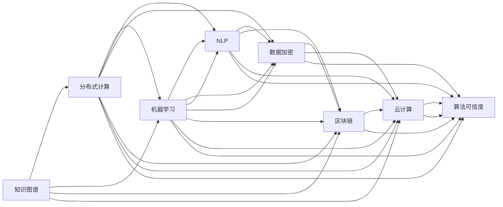

                 

# 知识的跨文化传播：全球化时代的挑战

> 关键词：跨文化交流, 知识传播, 全球化, 数字化, 智能算法, 数据传输, 国际合作

## 1. 背景介绍

### 1.1 问题由来

在全球化快速发展的背景下，知识的跨文化传播变得日益重要。各国之间不仅经济联系更加紧密，文化交流也更加频繁，知识传播的渠道和方式也在不断扩展。然而，知识在跨文化传播过程中，面临着诸多挑战，如文化差异、语言障碍、版权问题、数据传输等问题。

随着人工智能和大数据技术的发展，知识传播的效率和质量得到了显著提升。但同时，数据安全和隐私保护，内容审核和版权认证等问题，也成为了跨文化传播中的重要难题。如何高效、安全地进行知识跨文化传播，成为了摆在我们面前的一项重要任务。

### 1.2 问题核心关键点

知识跨文化传播的挑战主要集中在以下几个方面：

- 跨文化适应性：不同文化背景下的知识表达和理解存在差异，需要找到共通的表达方式。
- 数据传输效率：跨文化传播依赖于数据传输，如何在保证数据安全性的前提下，提高传输效率，是一个重要问题。
- 内容审核机制：避免有害信息和误导性内容，保障知识的传播质量和真实性。
- 版权保护：确保知识产权不被侵犯，同时便于知识的国际共享。
- 用户隐私保护：在知识共享过程中，确保用户隐私不被泄露。

## 2. 核心概念与联系

### 2.1 核心概念概述

在讨论知识跨文化传播的挑战时，我们需要理解几个核心概念：

- 知识图谱(Knowledge Graph)：用于表示知识的结构化图，涵盖实体、属性、关系等元素，是知识传播的基础。
- 分布式计算(Distributed Computing)：通过多台计算机协同工作，提高知识处理和传输的效率。
- 机器学习(Machine Learning)：利用算法和模型自动学习知识，提高知识传播的智能化和自动化水平。
- 自然语言处理(Natural Language Processing, NLP)：处理和分析人类语言，实现知识的自然语言表示和理解。
- 数据加密(Data Encryption)：保护数据在传输和存储过程中的安全性，防止数据泄露。
- 区块链(Blockchain)：通过去中心化、不可篡改的特性，确保数据和内容的真实性和完整性。
- 云计算(Cloud Computing)：提供大规模计算资源，支持知识的分布式存储和计算。
- 算法可信度(Algorithmic Trustworthiness)：确保算法决策的可解释性和透明度，保障知识的可信度。

这些概念之间相互联系，共同构建了知识跨文化传播的技术框架。

### 2.2 核心概念原理和架构的 Mermaid 流程图



该流程图展示了各个核心概念之间的相互联系，帮助我们理解知识跨文化传播的完整架构。

## 3. 核心算法原理 & 具体操作步骤

### 3.1 算法原理概述

知识跨文化传播的算法原理基于以下三点：

1. **分布式知识图谱构建**：通过分布式计算技术，构建跨地域的知识图谱，实现知识的网络化存储和组织。
2. **知识图谱查询与推理**：利用NLP和机器学习技术，进行知识图谱的智能查询与推理，提高知识检索和推理的准确性和效率。
3. **跨文化知识转换**：使用机器翻译和知识对齐技术，实现不同文化背景下的知识转换，确保知识的跨文化适应性。

### 3.2 算法步骤详解

基于上述算法原理，知识跨文化传播的具体操作步骤如下：

1. **知识图谱构建**：
   - 收集各地区的知识资源，建立本地知识图谱。
   - 通过分布式计算技术，实现多地知识图谱的合并和同步。

2. **知识图谱查询与推理**：
   - 利用NLP技术，将用户的自然语言查询转换为知识图谱中的查询语句。
   - 使用机器学习算法，对查询结果进行推理和过滤，提供最相关的知识。

3. **跨文化知识转换**：
   - 将用户查询的本地知识转换为目标语言或文化背景下的知识表示。
   - 利用知识对齐技术，确保转换后的知识在目标文化中的语义准确性和适用性。

### 3.3 算法优缺点

基于上述算法步骤，知识跨文化传播的优点包括：

- 高效性：分布式计算和多地知识图谱的合并，提高了知识检索和推理的效率。
- 准确性：利用机器学习和NLP技术，提高了知识转换和推理的准确性。
- 鲁棒性：分布式计算和区块链技术，保障了数据传输和存储的安全性。

同时，算法也存在一些缺点：

- 数据同步难度：多地知识图谱的合并和同步，可能面临数据冲突和同步问题。
- 知识对齐复杂性：跨文化知识转换需要理解不同文化之间的差异，实现知识对齐的复杂性较高。
- 计算资源消耗：分布式计算和机器学习算法需要大量的计算资源，可能增加系统负担。

### 3.4 算法应用领域

知识跨文化传播的算法已在多个领域得到了广泛应用，包括但不限于：

- 国际教育：通过知识图谱和跨文化知识转换，实现全球范围内的教育资源共享。
- 医学知识传播：利用分布式知识图谱和区块链技术，确保医学知识的真实性和完整性。
- 跨文化交流平台：建立跨文化知识传播平台，促进不同文化背景下的交流和理解。
- 商业知识共享：利用分布式计算和机器学习技术，提高商业知识的传播效率和质量。
- 国际科研合作：通过知识图谱和跨文化知识转换，促进全球科研合作和知识共享。

## 4. 数学模型和公式 & 详细讲解 & 举例说明

### 4.1 数学模型构建

知识跨文化传播的数学模型构建涉及以下几个核心概念：

- 知识图谱表示：使用图论中的图结构表示知识，包括节点和边，表示实体、属性和关系。
- 分布式计算模型：使用MapReduce等算法，实现分布式并行计算。
- 机器学习模型：使用各种机器学习算法，如分类、回归、聚类等，进行知识推理和查询。
- 自然语言处理模型：使用NLP技术，进行知识图谱的文本化表示和理解。
- 数据加密模型：使用对称加密、非对称加密等技术，确保数据传输和存储的安全性。
- 区块链模型：使用区块链技术，确保数据的真实性和不可篡改性。
- 云计算模型：使用云计算技术，实现知识的分布式存储和计算。

### 4.2 公式推导过程

以知识图谱查询为例，假设知识图谱为 $\mathcal{G}=(\mathcal{V},\mathcal{E})$，其中 $\mathcal{V}$ 为节点集，$\mathcal{E}$ 为边集。用户输入的查询为 $Q$，通过NLP技术转换为查询图 $Q'$。查询过程包括以下步骤：

1. 将查询图 $Q'$ 与知识图谱 $\mathcal{G}$ 进行匹配，得到匹配结果 $R$。
2. 对匹配结果 $R$ 进行推理，得到推理结果 $R'$。
3. 将推理结果 $R'$ 转换为用户可理解的形式。

其中，查询匹配过程可以通过以下公式表示：

$$
R = \mathcal{G} \cap Q'
$$

查询推理过程可以通过以下公式表示：

$$
R' = \text{Reason}(R)
$$

其中 $\text{Reason}$ 为推理算法，可以通过各种机器学习模型实现。

### 4.3 案例分析与讲解

以医疗知识传播为例，分析知识跨文化传播的实现过程。

1. **知识图谱构建**：
   - 收集全球各地的医学知识资源，建立本地医学知识图谱。
   - 利用分布式计算技术，将各地区的医学知识图谱合并，构建全球医学知识图谱。

2. **知识图谱查询与推理**：
   - 用户输入症状描述，通过NLP技术将其转换为知识图谱中的查询图。
   - 利用机器学习模型对查询结果进行推理，得到最相关的医学知识。

3. **跨文化知识转换**：
   - 将用户查询的本地医学知识转换为目标语言或文化背景下的知识表示。
   - 利用知识对齐技术，确保转换后的医学知识在目标文化中的语义准确性和适用性。

## 5. 项目实践：代码实例和详细解释说明

### 5.1 开发环境搭建

进行知识跨文化传播的实践开发，需要搭建以下开发环境：

1. **Python环境**：安装Python 3.x，建议使用Anaconda进行环境管理。
2. **分布式计算框架**：安装Apache Spark，用于分布式计算。
3. **知识图谱构建工具**：使用Neo4j或GraphDB，用于构建和管理知识图谱。
4. **自然语言处理工具**：安装NLTK或SpaCy，用于NLP处理。
5. **机器学习库**：安装Scikit-learn或TensorFlow，用于机器学习模型构建。
6. **数据加密库**：安装PyCryptodome或cryptography，用于数据加密。
7. **区块链库**：安装Ethereum或Hyperledger，用于区块链技术实现。
8. **云计算服务**：使用AWS或Google Cloud，提供分布式存储和计算资源。

### 5.2 源代码详细实现

以下是一个简单的知识图谱查询与推理的Python代码实现：

```python
from py2neo import Graph
from spacy import displacy

# 连接数据库
graph = Graph('http://localhost:7474', username='neo4j', password='password')

# 查询知识图谱
query = 'MATCH (n:Node {name: "疾病"})-[:HAS symptoms]->(symptom:Node {name: "发热"}) RETURN n'
result = graph.run(query)

# 可视化查询结果
displacy.render(result, style='graph')
```

上述代码实现了通过Py2neo连接Neo4j数据库，查询知识图谱中与“疾病”有关联的节点，并使用Displacy可视化查询结果。

### 5.3 代码解读与分析

上述代码中的关键步骤包括：

- 连接数据库：使用Py2neo连接Neo4j数据库，设置用户名和密码。
- 查询知识图谱：通过Cypher语言，查询知识图谱中与“疾病”有关联的节点，并指定查询条件“症状”为“发热”。
- 可视化查询结果：使用Displacy库，将查询结果以图形的方式可视化。

## 6. 实际应用场景

### 6.1 国际教育

在知识图谱的基础上，通过分布式计算和多语言NLP技术，实现全球范围内的教育资源共享。例如，将各地的教育课程、教学资源、学生表现等数据，整合到知识图谱中，通过知识查询和推理，提供个性化的学习建议和资源推荐。

### 6.2 医学知识传播

利用分布式计算和区块链技术，确保医学知识的真实性和完整性。通过知识图谱和跨文化知识转换，实现全球医学知识的共享和传播。例如，将全球各地的医学研究成果、临床实践数据等，整合到知识图谱中，通过分布式计算和区块链技术，确保数据的安全性和可靠性。

### 6.3 跨文化交流平台

建立跨文化知识传播平台，促进不同文化背景下的交流和理解。例如，将各地的文化、语言、习俗等数据，整合到知识图谱中，通过知识查询和推理，提供跨文化交流的建议和资源推荐。

### 6.4 商业知识共享

利用分布式计算和机器学习技术，提高商业知识的传播效率和质量。例如，将各地的商业数据、市场分析报告等，整合到知识图谱中，通过知识查询和推理，提供商业决策的支撑和建议。

### 6.5 国际科研合作

通过知识图谱和跨文化知识转换，促进全球科研合作和知识共享。例如，将全球各地的科研论文、研究成果等，整合到知识图谱中，通过分布式计算和区块链技术，确保数据的真实性和可靠性。

## 7. 工具和资源推荐

### 7.1 学习资源推荐

1. **《分布式计算原理与实践》**：该书深入浅出地介绍了分布式计算的基本原理和应用场景，是学习分布式计算的优秀入门书籍。
2. **《机器学习实战》**：该书通过丰富的案例和代码，展示了机器学习算法的实际应用，适合学习机器学习算法和模型。
3. **《区块链技术入门》**：该书详细介绍了区块链技术的原理和应用，是学习区块链技术的良好起点。
4. **《自然语言处理入门》**：该书介绍了NLP技术的基本概念和常用算法，适合学习NLP技术的初学者。
5. **《云计算基础》**：该书介绍了云计算技术的基本原理和应用场景，是学习云计算技术的入门教材。

### 7.2 开发工具推荐

1. **PyTorch**：基于Python的开源深度学习框架，提供了丰富的深度学习算法和模型，支持分布式计算。
2. **TensorFlow**：由Google开发的开源深度学习框架，支持分布式计算和高效计算。
3. **Spark**：由Apache基金会提供的分布式计算框架，支持大数据处理和分布式计算。
4. **Neo4j**：开源图数据库，支持知识图谱的构建和管理。
5. **NLTK**：Python自然语言处理库，提供了丰富的NLP处理工具和算法。
6. **Displacy**：用于可视化知识图谱的库，支持多种图形样式。

### 7.3 相关论文推荐

1. **《知识图谱：表示、查询和应用》**：该书详细介绍了知识图谱的构建、查询和应用，是学习知识图谱技术的优秀教材。
2. **《分布式计算：原理与实践》**：该书介绍了分布式计算的基本原理和应用场景，适合学习分布式计算技术的开发者。
3. **《机器学习：原理、算法与应用》**：该书详细介绍了机器学习的基本原理和算法，是学习机器学习技术的经典教材。
4. **《区块链技术：原理与应用》**：该书介绍了区块链技术的基本原理和应用场景，是学习区块链技术的入门书籍。
5. **《云计算：原理与实践》**：该书介绍了云计算技术的基本原理和应用场景，是学习云计算技术的优秀教材。

## 8. 总结：未来发展趋势与挑战

### 8.1 总结

本文深入探讨了知识跨文化传播的核心概念和算法原理，详细讲解了知识图谱构建、分布式计算、机器学习、自然语言处理、数据加密、区块链和云计算等关键技术。通过对这些技术的综合应用，实现了高效、安全、准确的跨文化传播。

通过本文的系统梳理，我们可以看到，知识跨文化传播的技术已经日趋成熟，并在教育、医学、商业、科研等领域得到了广泛应用。未来，随着这些技术的进一步发展和完善，知识跨文化传播的效率和质量将得到更大的提升。

### 8.2 未来发展趋势

未来，知识跨文化传播将呈现以下几个发展趋势：

1. **智能化的知识传播**：利用人工智能和大数据技术，实现知识的智能化传播。例如，通过智能推荐系统，根据用户兴趣和行为，提供个性化的知识推荐。
2. **多模态的知识传播**：结合视觉、音频、文本等多种模态的数据，实现更全面的知识传播。例如，通过视频、音频等多模态数据，增强知识传播的生动性和直观性。
3. **全球化的知识协作**：利用分布式计算和区块链技术，实现全球范围内的知识协作。例如，通过知识图谱和分布式计算，促进全球科研合作和知识共享。
4. **普适化的知识传播**：通过跨文化知识转换和对齐技术，实现知识的普适化传播。例如，通过机器翻译和知识对齐技术，确保不同文化背景下的知识传播。
5. **安全化的知识传播**：利用数据加密和区块链技术，确保知识传播的安全性和可靠性。例如，通过数据加密和区块链技术，防止数据泄露和篡改。

这些趋势预示着知识跨文化传播将变得更加高效、智能化和普适化，为全球知识共享和协作带来新的机遇和挑战。

### 8.3 面临的挑战

尽管知识跨文化传播技术已经取得显著进展，但仍面临诸多挑战：

1. **数据隐私问题**：知识跨文化传播需要大量的数据支持，但数据隐私和安全问题也随之而来。如何在确保数据隐私的前提下，实现知识传播，是一个重要问题。
2. **文化差异问题**：不同文化背景下的知识传播，需要克服语言、习俗等方面的差异。如何在知识传播中实现文化适应性，是一个重要挑战。
3. **技术复杂性问题**：知识跨文化传播涉及多种技术，包括分布式计算、机器学习、自然语言处理等，技术复杂性较高。如何在实践中有效整合这些技术，是一个重要挑战。
4. **数据标准化问题**：不同地区的数据格式和标准可能不同，如何实现数据的标准化和统一，是一个重要问题。
5. **系统可扩展性问题**：知识跨文化传播系统需要处理大量的数据和计算任务，如何在保证性能的前提下，实现系统的可扩展性，是一个重要挑战。

### 8.4 研究展望

未来的研究需要在以下几个方面进行突破：

1. **隐私保护技术**：开发新的隐私保护技术，保障知识跨文化传播中的数据隐私和安全。例如，利用差分隐私技术，保护用户数据的隐私。
2. **文化适应性技术**：研究跨文化知识转换和对齐技术，实现不同文化背景下的知识传播。例如，利用多语言NLP技术，提高知识转换的准确性和效率。
3. **技术集成技术**：研究多种技术的集成方法，实现知识跨文化传播系统的可扩展性和高效性。例如，利用微服务架构，实现分布式计算和知识图谱的协同工作。
4. **数据标准化技术**：研究数据标准化的技术和方法，实现不同地区数据的统一和互操作性。例如，利用数据标准化框架，统一不同格式的数据。
5. **系统优化技术**：研究系统优化技术，提高知识跨文化传播系统的性能和可扩展性。例如，利用分布式计算和机器学习算法，优化知识图谱的构建和查询过程。

这些研究方向将为知识跨文化传播技术带来新的突破，推动知识传播的全球化进程。

## 9. 附录：常见问题与解答

**Q1: 知识跨文化传播的核心概念和算法原理是什么？**

A: 知识跨文化传播的核心概念包括知识图谱、分布式计算、机器学习、自然语言处理、数据加密、区块链和云计算等。算法原理包括知识图谱构建、分布式计算、知识图谱查询与推理、跨文化知识转换等。这些核心概念和算法原理共同构建了知识跨文化传播的技术框架。

**Q2: 知识跨文化传播的优点和缺点是什么？**

A: 知识跨文化传播的优点包括高效性、准确性和鲁棒性。高效性体现在分布式计算和多地知识图谱的合并，提高了知识检索和推理的效率。准确性体现在利用机器学习和NLP技术，提高了知识转换和推理的准确性。鲁棒性体现在分布式计算和区块链技术，保障了数据传输和存储的安全性。缺点包括数据同步难度、知识对齐复杂性和计算资源消耗等。

**Q3: 知识跨文化传播的应用领域有哪些？**

A: 知识跨文化传播在多个领域得到了广泛应用，包括国际教育、医学知识传播、跨文化交流平台、商业知识共享和国际科研合作等。这些领域都需要高效、安全、准确的跨文化传播，知识跨文化传播技术提供了有力支持。

**Q4: 知识跨文化传播面临的挑战是什么？**

A: 知识跨文化传播面临的挑战包括数据隐私问题、文化差异问题、技术复杂性问题、数据标准化问题和系统可扩展性问题等。这些挑战需要通过隐私保护技术、文化适应性技术、技术集成技术、数据标准化技术和系统优化技术等手段进行解决。

**Q5: 知识跨文化传播的未来趋势是什么？**

A: 知识跨文化传播的未来趋势包括智能化的知识传播、多模态的知识传播、全球化的知识协作、普适化的知识传播和安全化的知识传播等。这些趋势预示着知识跨文化传播将变得更加高效、智能化和普适化，为全球知识共享和协作带来新的机遇和挑战。

