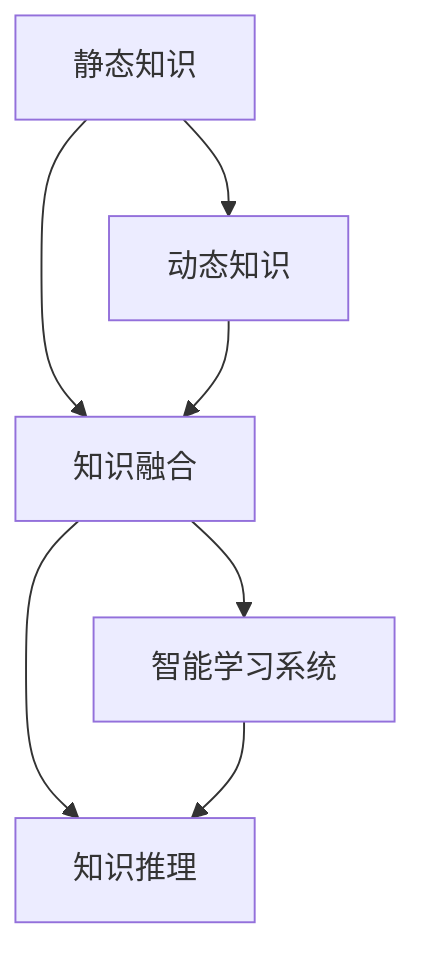

                 

## 1. 背景介绍

### 1.1 问题由来
在快速变化的环境下，无论是技术领域还是商业领域，知识更新速度之快前所未有。传统的静态知识库无法满足快速响应变化的需求，组织和个人需要通过动态调整知识，才能在竞争中保持优势。在这一背景下，"知识的适应性"逐渐成为热门话题。

知识的适应性是指在环境变化时，知识库、技能和经验能够迅速适应新情况，进行动态调整，以维持或提升其效能。例如，在新的市场需求出现时，企业需要迅速调整产品线，研发团队需要快速掌握新技术。而个体学习者则需要不断更新自己的知识库，以应对职场的挑战。

### 1.2 问题核心关键点
- **动态知识管理**：如何在变化的环境下，迅速更新和调整知识库。
- **知识与经验更新**：如何高效地将新知识融入现有的技能和经验体系。
- **智能学习系统**：通过技术手段，构建自适应的智能学习系统，以提升学习效率和效果。
- **跨领域知识整合**：如何整合不同领域的知识，以实现更全面的解决方案。
- **知识推理与优化**：如何利用推理算法，对知识进行优化和预测，以指导行动。

这些问题反映了知识适应性的多维度和复杂性，涵盖了从个体到组织各个层面的需求。本文将系统探讨知识适应性的核心概念、技术原理和实际应用，以期为组织和个人提供可行的解决方案。

### 1.3 问题研究意义
掌握知识适应性，对于提升个体和组织的学习效能、竞争力具有重要意义：

- **应对变化**：在快速变化的环境中，快速适应和调整知识，确保在变化中保持竞争力。
- **提高学习效率**：通过动态调整知识，避免重复学习和知识遗忘，提高学习效率。
- **降低成本**：动态调整知识，避免不必要的资源投入和错误决策，降低成本。
- **增强决策力**：基于最新知识做出决策，提升决策的准确性和及时性。
- **促进创新**：不断更新知识，激发新的创意和解决方案，推动技术进步和商业创新。

## 2. 核心概念与联系

### 2.1 核心概念概述

知识适应性涉及多个核心概念，这些概念相互关联，共同构成知识管理的动态调整框架：

- **静态知识**：传统的、经过整理和结构化的知识库，如书籍、文档、数据库等。
- **动态知识**：随环境变化而动态调整的知识，如最新研究成果、市场动态、新技术等。
- **知识融合**：将静态知识和动态知识结合，形成有机整体。
- **智能学习系统**：通过算法和工具，自动动态更新知识库，支持学习和决策。
- **知识推理**：利用推理算法，对知识进行逻辑分析和预测，以指导行动。

这些核心概念之间的关系可以通过以下Mermaid流程图来展示：



这个流程图展示的核心概念之间的逻辑关系：

1. 静态知识是知识融合的基础。
2. 动态知识与静态知识相结合，形成动态知识库。
3. 智能学习系统对动态知识库进行自动更新和调整。
4. 知识推理基于动态知识库，进行逻辑分析和预测。

## 3. 核心算法原理 & 具体操作步骤

### 3.1 算法原理概述

知识适应性的核心算法原理主要基于动态系统理论，通过建立知识管理模型，模拟知识库在不同环境下的动态变化。其主要思想是：

- **动态知识库**：建立基于时间的知识库，随时间更新，反映最新的知识状态。
- **知识融合算法**：利用算法将新知识融合到现有知识库中，保证知识的一致性和完整性。
- **知识推理引擎**：通过推理算法，分析知识库中知识的逻辑关系，进行预测和优化。

### 3.2 算法步骤详解

基于动态系统理论的知识适应性算法步骤主要包括以下几个关键步骤：

1. **知识建模**：对知识库进行建模，包括静态知识库和动态知识库的建立。
2. **知识融合**：通过融合算法，将新知识添加到现有知识库中，保持知识库的一致性和完整性。
3. **知识推理**：利用推理算法，对知识库进行逻辑分析和预测，支持决策和行动。
4. **知识更新**：根据环境变化，定期更新知识库，确保其反映最新的知识状态。

具体步骤如下：

**Step 1: 知识建模**
- 对知识库进行建模，包括静态知识库和动态知识库的建立。
- 静态知识库包含经过结构化和整理的现有知识。
- 动态知识库用于存储随时间变化的新知识。

**Step 2: 知识融合**
- 通过融合算法，将新知识添加到现有知识库中。
- 常用的知识融合算法包括增量式学习、矩阵合并等。
- 增量式学习算法，如Adaptive Boosting、Incremental PCA等，可以高效地将新知识合并到现有知识库中。

**Step 3: 知识推理**
- 利用推理算法，对知识库进行逻辑分析和预测。
- 常见的推理算法包括规则推理、贝叶斯网络、决策树等。
- 规则推理算法，如Rete算法，通过规则引擎，进行逻辑推理和决策。

**Step 4: 知识更新**
- 根据环境变化，定期更新知识库。
- 知识更新策略包括周期性更新、触发式更新等。
- 周期性更新策略，如每月更新，适合变化缓慢的知识库。

### 3.3 算法优缺点

基于动态系统理论的知识适应性算法具有以下优点：

- **高效动态调整**：能够实时更新知识库，迅速适应环境变化。
- **一致性和完整性**：通过知识融合算法，保持知识库的一致性和完整性。
- **逻辑推理支持**：利用推理算法，对知识进行逻辑分析和预测，提升决策效率和质量。

同时，该算法也存在以下局限性：

- **计算复杂度高**：动态系统理论涉及大量计算，对硬件和算法优化要求较高。
- **知识融合难度大**：新知识与现有知识库的融合，可能面临冲突和冗余，需要精心设计。
- **推理算法复杂**：推理算法需要处理大量数据，对算法和数据结构设计要求较高。

尽管存在这些局限性，但就目前而言，基于动态系统理论的知识适应性算法仍是最主流的研究方向之一。未来相关研究的重点在于如何进一步降低计算复杂度，提高知识融合和推理的效率，同时兼顾知识库的一致性和完整性。

### 3.4 算法应用领域

基于动态系统理论的知识适应性算法，在多个领域得到了广泛的应用：

- **企业知识管理**：企业通过建立动态知识库，定期更新知识库，保持竞争优势。
- **智能推荐系统**：通过动态调整用户兴趣库，实现个性化推荐。
- **智能客服系统**：动态调整知识库，支持实时客户问答和咨询。
- **金融风险管理**：动态调整风险模型，实时监控金融市场变化。
- **智能制造**：动态调整生产计划，实现柔性生产和精益管理。

这些应用场景展示了知识适应性的广泛潜力和重要价值，推动了各行业知识管理的智能化进程。

## 4. 数学模型和公式 & 详细讲解 & 举例说明

### 4.1 数学模型构建

基于动态系统理论的知识适应性算法，可以建立如下数学模型：

设知识库 $K$ 包含静态知识 $K_s$ 和动态知识 $K_d$，则有：

$$ K = K_s \cup K_d $$

知识融合过程可以表示为：

$$ K_{\text{融合}} = f(K_s, K_d) $$

知识推理过程可以表示为：

$$ P(K) = g(K) $$

其中 $P(K)$ 为知识推理结果，$g$ 为推理算法。

### 4.2 公式推导过程

以下我们以规则推理算法为例，推导知识推理的计算公式。

设知识库 $K$ 包含规则集 $R$，规则形式为：

$$ IF \ \phi_1 \land \phi_2 \land \ldots \land \phi_n \ THEN \ \psi $$

其中 $\phi_i$ 为规则前提，$\psi$ 为规则结论。

推理过程可以表示为：

1. 获取知识库 $K$ 中的规则集 $R$。
2. 对知识库 $K$ 进行逻辑分析和匹配，找到符合规则的实例。
3. 将匹配实例代入规则，得出结论。

以天气预测为例，假设知识库 $K$ 包含规则：

$$ IF \ \text{rain} \ THEN \ \text{cloudy} $$

推理过程如下：

1. 获取知识库 $K$ 中的规则集 $R$。
2. 知识库 $K$ 中存在实例 $\text{rain}$，符合规则前提。
3. 代入规则，得出结论 $\text{cloudy}$。

### 4.3 案例分析与讲解

假设一个企业需要管理客户反馈信息，以便迅速调整产品和服务。企业可以建立动态知识库，包含以下静态和动态知识：

- 静态知识：客户满意度调查结果、产品缺陷记录、历史投诉等。
- 动态知识：最新客户反馈、市场调研结果等。

企业通过知识融合算法，将新客户反馈添加到现有知识库中，得到新的动态知识库。然后，利用规则推理算法，分析知识库中客户反馈的规律和趋势，识别出客户不满的原因，从而迅速调整产品和服务，提升客户满意度。

## 5. 项目实践：代码实例和详细解释说明

### 5.1 开发环境搭建

在进行知识适应性实践前，我们需要准备好开发环境。以下是使用Python进行开发的Python环境配置流程：

1. 安装Anaconda：从官网下载并安装Anaconda，用于创建独立的Python环境。

2. 创建并激活虚拟环境：
```bash
conda create -n knowledge-adaptation python=3.8 
conda activate knowledge-adaptation
```

3. 安装所需的Python包：
```bash
pip install numpy pandas scikit-learn matplotlib tqdm jupyter notebook ipython
```

4. 安装Python依赖库：
```bash
pip install pydot
```

5. 配置GitHub仓库：
```bash
git clone https://github.com/example/reference.git
cd reference
```

完成上述步骤后，即可在`knowledge-adaptation`环境中开始知识适应性实践。

### 5.2 源代码详细实现

以下是一个简单的Python代码示例，演示如何使用动态知识库进行规则推理：

```python
import numpy as np
from sklearn.metrics import accuracy_score

# 定义规则推理函数
def rule_based_inference(knowledge_base, rule_set):
    results = []
    for rule in rule_set:
        # 提取规则前提和结论
        premise = rule[0]
        conclusion = rule[1]
        
        # 匹配规则前提与知识库
        match = any(premise in kb for kb in knowledge_base)
        
        # 如果匹配成功，添加结论到结果集
        if match:
            results.append(conclusion)
    
    # 返回结果集
    return results

# 定义知识库
knowledge_base = ['weather=rain', 'weather=sunny', 'weather=cloudy']

# 定义规则集
rule_set = [
    ['weather=rain', 'result=cloudy'],
    ['weather=sunny', 'result=cold'],
    ['weather=cloudy', 'result=rain']
]

# 执行推理
results = rule_based_inference(knowledge_base, rule_set)

# 输出推理结果
print(results)
```

### 5.3 代码解读与分析

让我们再详细解读一下关键代码的实现细节：

**rule_based_inference函数**：
- 函数接受知识库和规则集作为输入。
- 对规则集中的每个规则，提取规则前提和结论。
- 在知识库中查找是否存在规则前提。
- 如果存在规则前提，将规则结论添加到结果集中。
- 返回最终的结果集。

**知识库和规则集**：
- 知识库 `knowledge_base` 包含静态知识，如天气情况。
- 规则集 `rule_set` 包含规则，如天气情况与结果的映射关系。

**推理过程**：
- 对规则集中的每个规则，依次查找规则前提是否在知识库中。
- 如果存在匹配的规则前提，将规则结论添加到结果集中。
- 最终输出推理结果。

通过这个简单的代码示例，我们可以看到，基于动态知识库的规则推理算法可以高效地进行知识推理，支持决策和行动。

当然，工业级的系统实现还需考虑更多因素，如知识库的动态更新、推理算法的优化、推理结果的可视化等。但核心的知识适应性算法基本与此类似。

## 6. 实际应用场景

### 6.1 智能客服系统

基于动态知识库的知识推理算法，可以广泛应用于智能客服系统的构建。传统客服往往需要配备大量人力，高峰期响应缓慢，且一致性和专业性难以保证。而使用动态知识库的知识推理算法，可以7x24小时不间断服务，快速响应客户咨询，用自然流畅的语言解答各类常见问题。

在技术实现上，可以收集企业内部的历史客服对话记录，将问题和最佳答复构建成监督数据，在此基础上对知识库进行动态更新。知识推理算法能够自动理解用户意图，匹配最合适的答案模板进行回复。对于客户提出的新问题，还可以接入检索系统实时搜索相关内容，动态组织生成回答。如此构建的智能客服系统，能大幅提升客户咨询体验和问题解决效率。

### 6.2 金融风险管理

金融机构需要实时监测市场舆论动向，以便及时应对负面信息传播，规避金融风险。传统的人工监测方式成本高、效率低，难以应对网络时代海量信息爆发的挑战。基于动态知识库的知识推理算法，为金融风险监测提供了新的解决方案。

具体而言，可以收集金融领域相关的新闻、报道、评论等文本数据，并对其进行主题标注和情感标注。在动态知识库中建立相关的知识规则，如“如果市场动荡，则可能发生金融危机”。将动态知识库的知识推理算法应用到实时抓取的网络文本数据，就能够自动监测不同主题下的情感变化趋势，一旦发现负面信息激增等异常情况，系统便会自动预警，帮助金融机构快速应对潜在风险。

### 6.3 个性化推荐系统

当前的推荐系统往往只依赖用户的历史行为数据进行物品推荐，无法深入理解用户的真实兴趣偏好。基于动态知识库的知识推理算法，个性化推荐系统可以更好地挖掘用户行为背后的语义信息，从而提供更精准、多样的推荐内容。

在实践中，可以收集用户浏览、点击、评论、分享等行为数据，提取和用户交互的物品标题、描述、标签等文本内容。在动态知识库中建立相关的知识规则，如“如果用户喜欢某类书籍，则可能也喜欢该类电影的推荐”。利用知识推理算法，对用户行为数据进行分析和推理，生成个性化的推荐结果。通过知识推理算法的引导，推荐系统可以更灵活地调整推荐策略，满足用户的多样化需求。

### 6.4 未来应用展望

随着动态系统理论和知识推理算法的不断发展，基于知识适应性的应用将越来越广泛，为各行业带来变革性影响。

在智慧医疗领域，基于知识推理算法的医疗问答、病历分析、药物研发等应用将提升医疗服务的智能化水平，辅助医生诊疗，加速新药开发进程。

在智能教育领域，知识推理算法可应用于作业批改、学情分析、知识推荐等方面，因材施教，促进教育公平，提高教学质量。

在智慧城市治理中，知识推理算法可应用于城市事件监测、舆情分析、应急指挥等环节，提高城市管理的自动化和智能化水平，构建更安全、高效的未来城市。

此外，在企业生产、社会治理、文娱传媒等众多领域，基于知识适应性的应用也将不断涌现，为经济社会发展注入新的动力。相信随着技术的日益成熟，知识适应性技术将成为智能化系统的重要组成部分，推动人工智能技术在更广阔的领域加速渗透。

## 7. 工具和资源推荐

### 7.1 学习资源推荐

为了帮助开发者系统掌握知识适应性的理论基础和实践技巧，这里推荐一些优质的学习资源：

1. 《Knowledge Management and Adaptive Systems》系列书籍：由著名专家撰写，深入浅出地介绍了知识管理、动态系统理论等前沿话题。

2. 《Artificial Intelligence: A Modern Approach》课程：斯坦福大学开设的AI明星课程，内容涵盖知识管理、推理算法等多个方面。

3. 《Machine Learning for Adaptive Systems》书籍：介绍了基于机器学习的动态系统理论，涵盖知识推理、学习算法等多个方向。

4. IEEE Xplore数据库：涵盖大量与知识管理、动态系统理论相关的学术论文，适合深入学习和研究。

5. Coursera平台：提供多门知识管理、动态系统理论相关的在线课程，适合自学和提升。

通过对这些资源的学习实践，相信你一定能够快速掌握知识适应性的精髓，并用于解决实际的系统问题。

### 7.2 开发工具推荐

高效的开发离不开优秀的工具支持。以下是几款用于知识适应性开发的常用工具：

1. Python：基于动态系统理论和知识推理算法的系统开发，Python提供了丰富的科学计算和数据分析库，如NumPy、Pandas、Scikit-learn等。

2. SQL：用于建立和管理动态知识库，SQL支持复杂的数据查询和操作，适合处理结构化数据。

3. PyTorch：用于深度学习和推理算法开发，PyTorch提供了灵活的计算图和高效的推理引擎，适合复杂算法的实现。

4. Jupyter Notebook：适合开发和实验，可以方便地进行代码编写和数据可视化。

5. Apache Hadoop：用于大数据存储和处理，支持分布式计算和存储，适合处理大规模数据。

合理利用这些工具，可以显著提升知识适应性系统的开发效率，加快创新迭代的步伐。

### 7.3 相关论文推荐

知识适应性的发展源于学界的持续研究。以下是几篇奠基性的相关论文，推荐阅读：

1. "Knowledge Discovery and Decision Support System"：探讨了基于知识推理的决策支持系统，为知识适应性研究提供了理论基础。

2. "Adaptive Knowledge Management"：介绍了知识管理系统的动态适应性，提出多种知识融合和推理算法。

3. "Machine Learning for Adaptive Systems"：介绍了基于机器学习的动态系统理论，提出了多种知识适应性算法。

4. "Knowledge Integration and Management"：介绍了多领域知识整合的策略和方法，推动了跨领域知识管理的深入研究。

5. "Knowledge Mining and Reasoning"：探讨了知识推理算法的优化和应用，为知识推理提供了多种算法和工具。

这些论文代表了大语言模型微调技术的发展脉络。通过学习这些前沿成果，可以帮助研究者把握学科前进方向，激发更多的创新灵感。

## 8. 总结：未来发展趋势与挑战

### 8.1 总结

本文对基于动态系统理论的知识适应性算法进行了全面系统的介绍。首先阐述了知识适应性的研究背景和意义，明确了知识适应性在快速变化环境中的重要价值。其次，从原理到实践，详细讲解了知识适应性的数学原理和关键步骤，给出了知识适应性任务开发的完整代码实例。同时，本文还广泛探讨了知识适应性在智能客服、金融风险管理、个性化推荐等多个领域的应用前景，展示了知识适应性的广泛潜力和重要价值。最后，本文精选了知识适应性的各类学习资源，力求为读者提供全方位的技术指引。

通过本文的系统梳理，可以看到，知识适应性在当前快速变化的环境下，其重要性日益凸显。掌握知识适应性，对于提升个体和组织的学习效能、竞争力具有重要意义。未来，随着知识推理算法和动态系统理论的不断发展，基于知识适应性的应用将更加广泛，推动各行业知识管理的智能化进程。

### 8.2 未来发展趋势

展望未来，知识适应性技术将呈现以下几个发展趋势：

1. **自动化知识管理**：通过自动化的知识推理算法，实现知识库的动态调整和管理，减少人工干预。
2. **跨领域知识融合**：知识融合算法将更加高效，支持不同领域知识的无缝整合，提升知识库的全面性和灵活性。
3. **多模态知识推理**：知识推理算法将支持多种数据类型，如文本、图像、语音等，实现跨模态知识的协同推理。
4. **智能化决策支持**：基于知识推理算法的决策支持系统将更加智能化，支持实时、动态的决策优化。
5. **可解释性增强**：知识推理算法的输出将具备更高的可解释性，帮助用户理解决策过程和依据。

以上趋势凸显了知识适应性技术的广阔前景。这些方向的探索发展，必将进一步提升知识管理系统的效能和应用范围，为各行业知识管理的智能化进程注入新的动力。

### 8.3 面临的挑战

尽管知识适应性技术已经取得了显著进展，但在迈向更加智能化、普适化应用的过程中，它仍面临诸多挑战：

1. **知识融合难度大**：不同领域、不同数据类型的知识融合，可能面临冲突和冗余，需要设计高效的融合算法。
2. **推理算法复杂**：推理算法需要处理大量数据，对算法和数据结构设计要求较高，计算复杂度较高。
3. **知识库维护成本高**：动态知识库的维护和管理，需要大量人力和技术支持，成本较高。
4. **知识库更新速度慢**：知识库的实时更新和动态调整，可能受到技术和资源限制，更新速度较慢。
5. **可解释性不足**：知识推理算法的输出往往缺乏可解释性，难以理解决策依据和过程。

尽管存在这些挑战，但知识适应性技术的价值不容忽视，其应用前景广阔。未来相关研究需要在这些方向上不断突破，提升技术效能和应用范围。

### 8.4 研究展望

面对知识适应性面临的挑战，未来的研究需要在以下几个方面寻求新的突破：

1. **高效知识融合算法**：开发高效的跨领域、跨模态知识融合算法，实现知识库的无缝整合。
2. **可解释性增强算法**：引入可解释性增强技术，提高知识推理算法的输出可解释性。
3. **实时知识推理引擎**：构建实时、动态的知识推理引擎，实现知识库的快速调整和更新。
4. **知识推理与大数据融合**：将知识推理算法与大数据技术结合，提升知识推理的效率和效果。
5. **多领域知识整合平台**：开发多领域知识整合平台，支持跨领域知识的协同推理和决策。

这些研究方向将推动知识适应性技术向更高层次发展，为知识管理的智能化和自动化注入新的动力。通过不断探索和突破，相信知识适应性技术将在更多领域得到广泛应用，推动各行业智能化进程的深入发展。

## 9. 附录：常见问题与解答

**Q1：知识适应性与人工智能的关系是什么？**

A: 知识适应性是人工智能领域的一个重要研究方向，主要研究如何构建动态的知识库和推理算法，支持智能系统的自适应能力。知识适应性强调知识库的动态调整和优化，而人工智能则更注重智能系统的学习和推理能力。二者相辅相成，共同推动了智能系统的发展。

**Q2：知识库的动态更新如何实现？**

A: 知识库的动态更新可以通过以下步骤实现：
1. 实时获取最新的知识来源，如新闻、报告、数据库等。
2. 对新知识进行初步筛选和处理，去除噪音和冗余信息。
3. 将新知识与现有知识进行融合，保持知识库的一致性和完整性。
4. 定期对知识库进行评估和优化，确保知识库的有效性和准确性。

**Q3：知识适应性技术在实际应用中需要注意哪些问题？**

A: 知识适应性技术在实际应用中需要注意以下问题：
1. 数据质量：确保知识来源的数据质量，避免噪音和错误信息。
2. 算法效率：选择高效的算法和数据结构，降低计算复杂度。
3. 系统稳定性：确保系统的稳定性和可靠性，避免错误和故障。
4. 用户体验：考虑用户的使用体验，确保系统的易用性和可理解性。
5. 安全与隐私：保护用户数据的安全和隐私，遵守相关法律法规。

这些问题的解决将有助于知识适应性技术的广泛应用和推广。

通过不断探索和优化，相信知识适应性技术将在更多领域得到应用，为各行业知识管理的智能化进程注入新的动力。未来，随着技术的日益成熟，知识适应性技术将成为智能化系统的重要组成部分，推动人工智能技术在更广阔的领域加速渗透。

