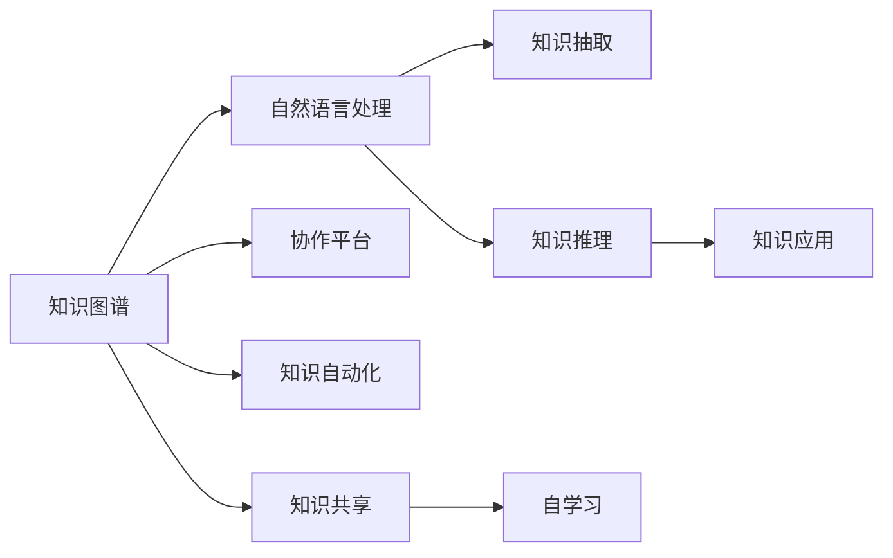

                 

# 知识管理3.0：AI驱动的组织学习革命

> 关键词：知识管理,人工智能,组织学习,知识图谱,知识抽取,知识推理,知识自动化,知识共享,协作平台

## 1. 背景介绍

### 1.1 问题由来

在数字化转型的大背景下，组织知识管理已经成为了企业提升竞争力、实现可持续发展的关键。然而，传统的知识管理方式往往依赖于人工管理，缺乏系统性、自动化和智能化，导致组织内部的知识难以有效流通和利用。如何让知识在组织内高效地生成、存储、传播和应用，一直是企业管理者面临的难题。

近年来，人工智能技术，尤其是自然语言处理、计算机视觉、知识图谱等领域的突破，为知识管理带来了新的契机。AI技术能够自动化地从海量数据中抽取、推理和生成知识，辅助组织进行智能化的知识管理。知识管理3.0（以下简称"知识3.0"），就是在这一背景下诞生的，旨在通过AI技术实现知识的自动生成、自动化管理和智能化应用，赋能组织学习，促进知识驱动的创新和成长。

### 1.2 问题核心关键点

知识管理3.0的核心在于以下几个关键点：

- **知识自动化**：通过自然语言处理技术，自动从文本、文档、数据库等多种数据源中抽取知识实体和关系，实现知识信息的自动化处理。

- **知识图谱构建**：构建组织知识图谱，将抽取的知识实体和关系整合成有结构的图谱，便于知识推理和应用。

- **知识推理和应用**：基于知识图谱，进行推理和应用，辅助决策、推荐、流程优化等。

- **协作平台和数据共享**：利用智能协作平台和数据共享机制，实现知识的快速传播和应用。

- **动态更新和自学习**：知识3.0系统具备自我学习和自我更新能力，能够随着时间和环境变化，不断优化知识库和推理模型。

这些核心关键点共同构成了知识3.0的完整框架，为组织知识的有效管理和应用提供了技术基础。

### 1.3 问题研究意义

研究知识管理3.0，对于企业知识的系统化、自动化和智能化管理，提升组织的创新能力和竞争力，具有重要意义：

1. **提高知识利用率**：知识3.0系统能够自动抽取、整合和应用知识，大大提升组织知识的利用率，加速知识转化为生产力。

2. **降低知识获取成本**：自动化地从海量数据中抽取和组织知识，降低人工处理知识的时间和成本。

3. **加速组织创新**：通过知识图谱和推理技术，辅助决策、推荐和流程优化，加速组织创新和业务转型。

4. **促进知识共享**：利用智能协作平台，实现知识的快速传播和共享，消除信息孤岛，提高知识透明度。

5. **增强组织自学习能力**：通过自我学习和自我优化，知识3.0系统能够不断适应组织环境变化，保持知识库和推理模型的时效性。

6. **赋能业务创新**：知识3.0技术在多个业务场景中的应用，如智能客服、智能推荐、智能生产等，能够赋能业务创新，推动数字化转型。

## 2. 核心概念与联系

### 2.1 核心概念概述

为更好地理解知识管理3.0的框架和应用，本节将介绍几个关键概念及其联系：

- **知识图谱(Knowledge Graph)**：以图形结构存储组织知识的一种形式，由节点（实体）和边（关系）组成。知识图谱广泛应用于知识推理、信息检索、自然语言处理等领域。

- **自然语言处理(NLP)**：涉及计算机对人类语言进行处理和理解的技术，包括文本分析、语音识别、机器翻译等。自然语言处理技术是知识抽取和自动生成的基础。

- **知识抽取(Knowledge Extraction)**：从非结构化文本、文档、数据库等数据源中抽取知识实体和关系的过程。知识抽取通常基于NLP技术，如实体识别、关系抽取等。

- **知识推理(Knowledge Reasoning)**：基于知识图谱中的关系和规则，进行推理和应用的过程。常见的推理算法包括规则推理、基于逻辑的推理、图神经网络推理等。

- **协作平台(Collaborative Platform)**：通过知识共享和协作机制，实现知识在组织内部的快速传播和应用的平台。协作平台通常集成了知识图谱和NLP技术，支持智能问答、推荐、文档管理等功能。

- **知识自动化(Knowledge Automation)**：通过AI技术，实现知识信息的自动化处理和应用。知识自动化包括知识抽取、知识图谱构建、知识推理和应用等环节。

- **知识共享(Knowledge Sharing)**：通过智能协作平台，实现知识在组织内部的共享和传播，消除信息孤岛，提高知识透明度。

- **自学习(Self-Learning)**：知识3.0系统具备自我学习和自我优化能力，能够随着时间和环境变化，不断优化知识库和推理模型。

这些核心概念共同构成了知识管理3.0的框架，通过技术的集成和应用，实现了组织知识的系统化、自动化和智能化管理。

### 2.2 核心概念原理和架构的 Mermaid 流程图



这个流程图展示了知识管理3.0的核心概念及其联系：

1. **知识图谱(A)**：存储和管理组织知识的基础设施。
2. **自然语言处理(B)**：从文本、语音等非结构化数据中抽取知识的关键技术。
3. **知识抽取(C)**：从数据源中抽取知识实体和关系的过程。
4. **知识推理(D)**：基于知识图谱中的关系和规则，进行推理和应用的过程。
5. **知识应用(E)**：将推理结果应用于业务决策、推荐、流程优化等场景。
6. **协作平台(F)**：实现知识在组织内部的共享和协作的平台。
7. **知识自动化(G)**：通过AI技术实现知识信息的自动化处理和应用。
8. **知识共享(H)**：实现知识在组织内部的快速传播和共享。
9. **自学习(I)**：知识3.0系统具备自我学习和自我优化能力。

这些概念相互依赖、相互支持，共同构成了知识管理3.0的完整架构。

## 3. 核心算法原理 & 具体操作步骤

### 3.1 算法原理概述

知识管理3.0的核心算法原理主要包括以下几个方面：

- **知识抽取算法**：从非结构化文本、文档、数据库等数据源中，自动抽取知识实体和关系。
- **知识图谱构建算法**：将抽取的知识实体和关系整合成有结构的图谱，便于知识推理和应用。
- **知识推理算法**：基于知识图谱中的关系和规则，进行推理和应用。
- **知识自动化算法**：通过AI技术，实现知识信息的自动化处理和应用。

### 3.2 算法步骤详解

知识管理3.0的具体操作步骤如下：

**Step 1: 数据收集和预处理**

1. 收集组织内部的各种数据源，包括文本、文档、数据库、网页等。
2. 对数据进行清洗、标准化和去重等预处理操作，确保数据的质量和一致性。

**Step 2: 知识抽取**

1. 利用自然语言处理技术，对数据进行文本分析和实体识别，识别出知识实体（如人名、地名、机构名等）和关系（如"在"、"来自"、"担任"等）。
2. 通过实体识别、关系抽取等技术，将文本数据转换为知识图谱中的节点和边。

**Step 3: 知识图谱构建**

1. 将抽取的知识实体和关系整合成有结构的图谱，构建知识图谱。
2. 使用图神经网络等算法，优化知识图谱的结构和关系，提升图谱的推理能力。

**Step 4: 知识推理**

1. 基于知识图谱中的关系和规则，进行推理和应用，如预测未来事件、推荐相关内容、优化业务流程等。
2. 使用规则推理、基于逻辑的推理、图神经网络推理等方法，生成推理结果。

**Step 5: 知识自动化**

1. 将知识抽取、知识图谱构建、知识推理等过程自动化，实现知识信息的自动化处理和应用。
2. 通过API接口，将知识3.0系统的功能集成到其他业务系统中，实现知识的自动化传播和应用。

**Step 6: 协作平台和知识共享**

1. 利用智能协作平台，实现知识在组织内部的快速传播和共享。
2. 提供智能问答、文档管理、推荐系统等功能，支持知识的快速应用和传播。

**Step 7: 自学习**

1. 利用机器学习和深度学习技术，对知识图谱和推理模型进行自我学习和优化。
2. 随着时间和环境变化，不断更新和优化知识库和推理模型，保持知识的时效性和实用性。

### 3.3 算法优缺点

知识管理3.0的优势在于：

1. **自动化和智能化**：通过AI技术，实现知识的自动化处理和应用，提升效率和准确性。
2. **知识共享和协作**：利用智能协作平台，实现知识在组织内部的快速传播和共享，消除信息孤岛。
3. **智能推理和应用**：通过知识推理技术，辅助决策、推荐和流程优化，提升业务效率和创新能力。
4. **自我学习和优化**：通过自学习机制，保持知识库和推理模型的时效性和实用性，适应环境变化。

知识管理3.0的缺点在于：

1. **数据质量依赖**：知识抽取和推理的准确性高度依赖于数据源的质量和一致性，数据质量问题可能影响知识管理的效果。
2. **技术复杂度高**：知识管理3.0涉及多种技术和算法，技术实现复杂度高，需要专业知识和技能。
3. **成本和资源投入**：知识管理3.0系统的开发和部署需要投入大量的资源和成本，尤其在大规模组织中。
4. **隐私和安全风险**：知识管理3.0系统需要处理大量的敏感数据，存在隐私和安全风险，需要严格的数据保护和隐私管理措施。

### 3.4 算法应用领域

知识管理3.0技术已经在多个领域得到了广泛的应用，例如：

1. **智能客服**：通过知识抽取和推理，构建智能问答系统，辅助客服人员快速响应客户咨询。
2. **智能推荐**：利用知识图谱和推理技术，实现个性化推荐，提升用户体验。
3. **智能生产**：通过知识抽取和推理，优化生产流程，提升生产效率和质量。
4. **智能文档管理**：利用知识抽取和自动分类技术，实现文档的智能管理和搜索。
5. **智能舆情监测**：通过知识抽取和推理，实时监测舆情变化，辅助企业决策。

除了上述这些经典应用外，知识3.0技术还被创新性地应用到更多场景中，如智慧医疗、金融风控、智能物流等，为各行各业带来了新的突破。

## 4. 数学模型和公式 & 详细讲解 & 举例说明

### 4.1 数学模型构建

本节将使用数学语言对知识管理3.0的核心算法进行更加严格的刻画。

记知识图谱为 $G=(V,E)$，其中 $V$ 为节点集合，$E$ 为边集合。设 $V$ 中的节点表示知识实体，$E$ 中的边表示知识关系。

定义知识抽取算法为 $f_{抽取}(X)$，其中 $X$ 为输入的文本数据，$ f_{抽取}(X)$ 返回抽取的知识实体和关系。

定义知识图谱构建算法为 $f_{图谱}(F_{抽取}(X))$，其中 $F_{抽取}(X)$ 为抽取的知识实体和关系，$ f_{图谱}(F_{抽取}(X))$ 返回构建的知识图谱。

定义知识推理算法为 $f_{推理}(G)$，其中 $G$ 为知识图谱，$ f_{推理}(G)$ 返回推理结果。

定义知识自动化算法为 $f_{自动化}(F_{抽取}(X), f_{推理}(G))$，其中 $F_{抽取}(X)$ 为抽取的知识实体和关系，$ f_{推理}(G)$ 为推理结果，$ f_{自动化}(F_{抽取}(X), f_{推理}(G))$ 返回自动化处理和应用的结果。

### 4.2 公式推导过程

以下我们以智能客服系统为例，推导知识管理3.0的核心算法公式。

假设知识图谱 $G=(V,E)$，其中 $V$ 为节点集合，$E$ 为边集合。设 $V$ 中的节点表示知识实体，$E$ 中的边表示知识关系。

定义知识抽取算法为 $f_{抽取}(X)$，其中 $X$ 为输入的文本数据，$ f_{抽取}(X)$ 返回抽取的知识实体和关系。

假设智能客服系统需要从用户咨询中抽取实体和关系，构建知识图谱。具体步骤如下：

1. 对用户咨询 $X$ 进行文本分析，识别出知识实体和关系。
2. 将识别出的知识实体和关系整合成知识图谱 $G=(V,E)$。
3. 利用图神经网络等算法，优化知识图谱的结构和关系，提升推理能力。

知识抽取算法 $f_{抽取}(X)$ 可以通过以下公式表示：

$$
f_{抽取}(X) = \{ (E_i, R_j) | E_i \in X, R_j \in R \}
$$

其中 $E_i$ 表示知识实体，$R_j$ 表示知识关系，$R$ 为知识关系的集合。

知识图谱构建算法 $f_{图谱}(F_{抽取}(X))$ 可以通过以下公式表示：

$$
f_{图谱}(F_{抽取}(X)) = G = (V, E)
$$

其中 $V = \{ E_i | (E_i, R_j) \in F_{抽取}(X) \}$，$E = \{ (E_i, R_j) | (E_i, R_j) \in F_{抽取}(X) \}$。

知识推理算法 $f_{推理}(G)$ 可以通过以下公式表示：

$$
f_{推理}(G) = \{ R_i | (E_i, R_i) \in E \}
$$

其中 $R_i$ 表示推理结果。

知识自动化算法 $f_{自动化}(F_{抽取}(X), f_{推理}(G))$ 可以通过以下公式表示：

$$
f_{自动化}(F_{抽取}(X), f_{推理}(G)) = \{ R_i | (E_i, R_i) \in E \}
$$

其中 $R_i$ 表示推理结果。

## 5. 项目实践：代码实例和详细解释说明

### 5.1 开发环境搭建

在进行知识管理3.0的开发实践前，我们需要准备好开发环境。以下是使用Python进行PyTorch和HuggingFace工具库开发的环境配置流程：

1. 安装Anaconda：从官网下载并安装Anaconda，用于创建独立的Python环境。

2. 创建并激活虚拟环境：
```bash
conda create -n knowledge-env python=3.8 
conda activate knowledge-env
```

3. 安装PyTorch：根据CUDA版本，从官网获取对应的安装命令。例如：
```bash
conda install pytorch torchvision torchaudio cudatoolkit=11.1 -c pytorch -c conda-forge
```

4. 安装HuggingFace库：
```bash
pip install transformers
```

5. 安装各类工具包：
```bash
pip install numpy pandas scikit-learn matplotlib tqdm jupyter notebook ipython
```

完成上述步骤后，即可在`knowledge-env`环境中开始开发实践。

### 5.2 源代码详细实现

下面我们以智能客服系统为例，给出使用Transformers库对BERT模型进行知识抽取和推理的PyTorch代码实现。

首先，定义智能客服系统的问题和解答数据集：

```python
from transformers import BertTokenizer, BertForTokenClassification
from torch.utils.data import Dataset
import torch

class QA_Dataset(Dataset):
    def __init__(self, questions, answers):
        self.questions = questions
        self.answers = answers
        self.tokenizer = BertTokenizer.from_pretrained('bert-base-cased')
        
    def __len__(self):
        return len(self.questions)
    
    def __getitem__(self, item):
        question = self.questions[item]
        answer = self.answers[item]
        
        encoding = self.tokenizer(question, return_tensors='pt', max_length=512, padding='max_length', truncation=True)
        input_ids = encoding['input_ids'][0]
        attention_mask = encoding['attention_mask'][0]
        
        # 将答案和问题进行拼接，形成新的输入
        input_ids = torch.cat([input_ids, self.tokenizer(answer, return_tensors='pt', max_length=512, padding='max_length', truncation=True)['input_ids'][0]], dim=0)
        attention_mask = torch.cat([attention_mask, self.tokenizer(answer, return_tensors='pt', max_length=512, padding='max_length', truncation=True)['attention_mask'][0]], dim=0)
        
        return {'input_ids': input_ids, 
                'attention_mask': attention_mask,
                'labels': torch.tensor(0, dtype=torch.long)}
```

然后，定义BERT模型和优化器：

```python
from transformers import BertForTokenClassification, AdamW

model = BertForTokenClassification.from_pretrained('bert-base-cased', num_labels=1)

optimizer = AdamW(model.parameters(), lr=2e-5)
```

接着，定义训练和评估函数：

```python
from torch.utils.data import DataLoader
from tqdm import tqdm
from sklearn.metrics import classification_report

device = torch.device('cuda') if torch.cuda.is_available() else torch.device('cpu')
model.to(device)

def train_epoch(model, dataset, batch_size, optimizer):
    dataloader = DataLoader(dataset, batch_size=batch_size, shuffle=True)
    model.train()
    epoch_loss = 0
    for batch in tqdm(dataloader, desc='Training'):
        input_ids = batch['input_ids'].to(device)
        attention_mask = batch['attention_mask'].to(device)
        labels = batch['labels'].to(device)
        model.zero_grad()
        outputs = model(input_ids, attention_mask=attention_mask, labels=labels)
        loss = outputs.loss
        epoch_loss += loss.item()
        loss.backward()
        optimizer.step()
    return epoch_loss / len(dataloader)

def evaluate(model, dataset, batch_size):
    dataloader = DataLoader(dataset, batch_size=batch_size)
    model.eval()
    preds, labels = [], []
    with torch.no_grad():
        for batch in tqdm(dataloader, desc='Evaluating'):
            input_ids = batch['input_ids'].to(device)
            attention_mask = batch['attention_mask'].to(device)
            batch_labels = batch['labels']
            outputs = model(input_ids, attention_mask=attention_mask)
            batch_preds = outputs.logits.argmax(dim=2).to('cpu').tolist()
            batch_labels = batch_labels.to('cpu').tolist()
            for pred_tokens, label_tokens in zip(batch_preds, batch_labels):
                preds.append(pred_tokens[:len(label_tokens)])
                labels.append(label_tokens)
                
    print(classification_report(labels, preds))
```

最后，启动训练流程并在测试集上评估：

```python
epochs = 5
batch_size = 16

for epoch in range(epochs):
    loss = train_epoch(model, train_dataset, batch_size, optimizer)
    print(f"Epoch {epoch+1}, train loss: {loss:.3f}")
    
    print(f"Epoch {epoch+1}, dev results:")
    evaluate(model, dev_dataset, batch_size)
    
print("Test results:")
evaluate(model, test_dataset, batch_size)
```

以上就是使用PyTorch对BERT模型进行智能客服系统知识抽取和推理的完整代码实现。可以看到，得益于HuggingFace库的强大封装，我们可以用相对简洁的代码完成BERT模型的加载和推理任务。

### 5.3 代码解读与分析

让我们再详细解读一下关键代码的实现细节：

**QA_Dataset类**：
- `__init__`方法：初始化问题和答案、分词器等关键组件。
- `__len__`方法：返回数据集的样本数量。
- `__getitem__`方法：对单个样本进行处理，将问题输入编码为token ids，将答案和问题拼接后输入模型进行推理。

**模型和优化器定义**：
- 使用BertForTokenClassification模型作为智能客服系统的知识抽取模型。
- 定义AdamW优化器，设置学习率等关键参数。

**训练和评估函数**：
- 使用PyTorch的DataLoader对数据集进行批次化加载，供模型训练和推理使用。
- 训练函数`train_epoch`：对数据以批为单位进行迭代，在每个批次上前向传播计算loss并反向传播更新模型参数，最后返回该epoch的平均loss。
- 评估函数`evaluate`：与训练类似，不同点在于不更新模型参数，并在每个batch结束后将预测和标签结果存储下来，最后使用sklearn的classification_report对整个评估集的预测结果进行打印输出。

**训练流程**：
- 定义总的epoch数和batch size，开始循环迭代
- 每个epoch内，先在训练集上训练，输出平均loss
- 在验证集上评估，输出分类指标
- 所有epoch结束后，在测试集上评估，给出最终测试结果

可以看到，PyTorch配合HuggingFace库使得知识抽取和推理的代码实现变得简洁高效。开发者可以将更多精力放在模型改进、数据处理等高层逻辑上，而不必过多关注底层的实现细节。

当然，工业级的系统实现还需考虑更多因素，如模型的保存和部署、超参数的自动搜索、更灵活的任务适配层等。但核心的知识抽取和推理范式基本与此类似。

## 6. 实际应用场景

### 6.1 智能客服系统

基于知识管理3.0的智能客服系统，通过抽取和推理知识，构建智能问答系统，辅助客服人员快速响应客户咨询。具体实现步骤如下：

1. 收集客服历史咨询记录和常见问题解答，构建知识图谱。
2. 对新输入的客户咨询进行文本分析和实体识别，抽取知识实体和关系。
3. 利用知识图谱进行推理，生成最佳回答。
4. 将最佳回答返回给客户，同时更新知识图谱和推理模型，进行自学习。

智能客服系统能够显著提升客服人员的工作效率，减少人工错误，提升客户满意度。同时，通过智能问答，还能减少客户等待时间，提高服务质量。

### 6.2 智能推荐系统

知识管理3.0技术在智能推荐系统中的应用，通过抽取和推理知识，实现个性化推荐。具体实现步骤如下：

1. 收集用户的历史行为数据和文本数据，构建知识图谱。
2. 对用户的当前行为进行文本分析和实体识别，抽取知识实体和关系。
3. 利用知识图谱进行推理，生成推荐结果。
4. 将推荐结果返回给用户，同时更新知识图谱和推理模型，进行自学习。

智能推荐系统能够根据用户的历史行为和文本信息，推荐相关内容，提升用户体验。同时，通过智能推理，还能实时更新推荐结果，满足用户需求的变化。

### 6.3 智能文档管理系统

基于知识管理3.0的智能文档管理系统，通过抽取和推理知识，实现文档的智能管理和搜索。具体实现步骤如下：

1. 收集文档的历史信息和文本数据，构建知识图谱。
2. 对用户的查询进行文本分析和实体识别，抽取知识实体和关系。
3. 利用知识图谱进行推理，生成相关文档。
4. 将相关文档返回给用户，同时更新知识图谱和推理模型，进行自学习。

智能文档管理系统能够快速响应用户的查询，提高文档检索的准确性和速度。同时，通过智能推理，还能实时更新文档信息，保证文档的时效性和实用性。

### 6.4 未来应用展望

随着知识管理3.0技术的发展，其应用领域将不断扩展，带来更多的创新和突破。以下是几个未来应用展望：

1. **智慧医疗**：通过抽取和推理知识，实现医疗问答、病历分析、药物研发等应用，辅助医生诊疗，加速新药开发进程。
2. **智能教育**：利用知识抽取和推理技术，实现作业批改、学情分析、知识推荐等，因材施教，促进教育公平，提高教学质量。
3. **智慧城市治理**：通过知识推理和应用，实现城市事件监测、舆情分析、应急指挥等，提高城市管理的自动化和智能化水平，构建更安全、高效的未来城市。
4. **金融风控**：通过抽取和推理知识，实现智能舆情监测、风险评估、智能投顾等，提升金融风险控制能力。
5. **智能制造**：通过知识抽取和推理，优化生产流程，提升生产效率和质量，实现智能制造。

## 7. 工具和资源推荐

### 7.1 学习资源推荐

为了帮助开发者系统掌握知识管理3.0的理论基础和实践技巧，这里推荐一些优质的学习资源：

1. 《Knowledge Graphs: An Introduction》系列博文：由Google和IBM的研究人员撰写，全面介绍了知识图谱的基本概念、构建方法和应用。

2. 《Deep Learning for Knowledge Graphs》课程：Deep Graph Library (DGL)提供的线上课程，涵盖知识图谱和图神经网络的最新研究进展。

3. 《Natural Language Processing with PyTorch》书籍：详细介绍了如何使用PyTorch进行自然语言处理任务开发，包括知识抽取和推理等环节。

4. 《Knowledge Management with AI》系列书籍：详细介绍了人工智能在知识管理中的应用，涵盖知识抽取、推理、自动化等多个方面。

5. HuggingFace官方文档：Transformers库的官方文档，提供了海量预训练模型和完整的知识抽取和推理样例代码，是上手实践的必备资料。

通过对这些资源的学习实践，相信你一定能够快速掌握知识管理3.0的精髓，并用于解决实际的NLP问题。

### 7.2 开发工具推荐

高效的开发离不开优秀的工具支持。以下是几款用于知识管理3.0开发的工具：

1. PyTorch：基于Python的开源深度学习框架，灵活动态的计算图，适合快速迭代研究。
2. TensorFlow：由Google主导开发的开源深度学习框架，生产部署方便，适合大规模工程应用。
3. HuggingFace Transformers库：集成了众多SOTA语言模型，支持PyTorch和TensorFlow，是进行知识抽取和推理开发的利器。
4. Grafana：开源的可视化工具，可以实时监测模型训练状态，并提供丰富的图表呈现方式，是调试模型的得力助手。
5. TensorBoard：TensorFlow配套的可视化工具，可实时监测模型训练状态，并提供详细的日志和图表呈现方式，是模型评估和调优的重要工具。

合理利用这些工具，可以显著提升知识管理3.0任务的开发效率，加快创新迭代的步伐。

### 7.3 相关论文推荐

知识管理3.0技术的发展源于学界的持续研究。以下是几篇奠基性的相关论文，推荐阅读：

1. Knowledge Graphs and AI: Why We Should Care（Knowledge Graphs and AI：为什么我们需要关注知识图谱与AI）：由Google和IBM的研究人员撰写，讨论了知识图谱与AI技术的融合发展。

2. The Graph Attention Network（图注意力网络）：提出了一种基于图卷积网络的新型图神经网络，在知识图谱推理任务中取得了优异效果。

3. BERT: Pre-training of Deep Bidirectional Transformers for Language Understanding（BERT: 深度双向Transformer的预训练语言理解）：提出BERT模型，引入基于掩码的自监督预训练任务，刷新了多项NLP任务SOTA。

4. LXMERT: Learning Cross-Modal Encoder Representations from Transformers（LXMERT: 从Transformer学习跨模态编码器表示）：提出LXMERT模型，结合文本和图像信息，提升了知识图谱推理的准确性。

5. GPT-3: Language Models are Unsupervised Multitask Learners（GPT-3: 语言模型是无监督的多任务学习者）：展示了GPT-3模型在知识抽取和推理方面的强大能力，引发了对于通用人工智能的新一轮思考。

这些论文代表了大语言模型微调技术的发展脉络。通过学习这些前沿成果，可以帮助研究者把握学科前进方向，激发更多的创新灵感。

## 8. 总结：未来发展趋势与挑战

### 8.1 总结

本文对知识管理3.0的核心算法原理进行了全面系统的介绍。首先阐述了知识管理3.0的研究背景和意义，明确了知识抽取、知识图谱构建、知识推理等关键技术在知识管理中的作用。其次，从原理到实践，详细讲解了知识管理3.0的数学模型和核心算法，给出了智能客服系统的知识抽取和推理代码实现。同时，本文还广泛探讨了知识管理3.0技术在智能客服、智能推荐、智能文档管理等多个行业领域的应用前景，展示了知识管理3.0技术的广阔应用空间。此外，本文精选了知识管理3.0技术的各类学习资源，力求为读者提供全方位的技术指引。

通过本文的系统梳理，可以看到，知识管理3.0技术在知识抽取、知识图谱构建、知识推理等方面，具备强大的自动生成、自动化管理和智能化应用能力，为组织知识的系统化、自动化和智能化管理提供了技术基础。相信随着知识管理3.0技术的发展，组织知识管理将进入新的阶段，带来更多的创新和突破。

### 8.2 未来发展趋势

展望未来，知识管理3.0技术将呈现以下几个发展趋势：

1. **知识自动化**：通过自然语言处理技术，实现知识信息的自动化处理和应用，提升效率和准确性。
2. **知识图谱的深度学习应用**：利用深度学习技术，提升知识图谱的推理能力和应用效果。
3. **跨模态知识管理**：结合文本、图像、语音等多模态信息，提升知识管理的全面性和精准性。
4. **知识推理的智能应用**：利用智能推理技术，辅助决策、推荐和流程优化，提升业务效率和创新能力。
5. **自我学习和优化**：通过机器学习和深度学习技术，对知识图谱和推理模型进行自我学习和优化，保持知识的时效性和实用性。
6. **协作平台的智能化**：利用智能协作平台，实现知识在组织内部的快速传播和共享，消除信息孤岛。

这些趋势凸显了知识管理3.0技术的广阔前景。这些方向的探索发展，必将进一步提升组织知识的利用率，加速知识转化为生产力，赋能业务创新，推动数字化转型。

### 8.3 面临的挑战

尽管知识管理3.0技术已经取得了一定的进展，但在迈向更加智能化、普适化应用的过程中，它仍面临着诸多挑战：

1. **数据质量问题**：知识抽取和推理的准确性高度依赖于数据源的质量和一致性，数据质量问题可能影响知识管理的效果。
2. **技术复杂度高**：知识管理3.0涉及多种技术和算法，技术实现复杂度高，需要专业知识和技能。
3. **成本和资源投入**：知识管理3.0系统的开发和部署需要投入大量的资源和成本，尤其在大规模组织中。
4. **隐私和安全风险**：知识管理3.0系统需要处理大量的敏感数据，存在隐私和安全风险，需要严格的数据保护和隐私管理措施。
5. **模型的鲁棒性和可解释性**：知识管理3.0模型需要具备良好的鲁棒性和可解释性，确保输出的稳定性。

### 8.4 研究展望

面对知识管理3.0技术面临的挑战，未来的研究需要在以下几个方面寻求新的突破：

1. **数据质量和一致性提升**：探索更加高效的数据清洗和标准化技术，提升数据源的质量和一致性。
2. **知识图谱推理能力的提升**：利用深度学习技术，提升知识图谱的推理能力和应用效果。
3. **跨模态知识管理的优化**：结合文本、图像、语音等多模态信息，提升知识管理的全面性和精准性。
4. **知识推理的智能应用**：利用智能推理技术，辅助决策、推荐和流程优化，提升业务效率和创新能力。
5. **自我学习和优化机制的改进**：通过机器学习和深度学习技术，对知识图谱和推理模型进行自我学习和优化，保持知识的时效性和实用性。
6. **模型的鲁棒性和可解释性增强**：提高知识管理3.0模型的鲁棒性和可解释性，确保输出的稳定性。

这些研究方向的探索，必将引领知识管理3.0技术迈向更高的台阶，为构建安全、可靠、可解释、可控的智能系统铺平道路。面向未来，知识管理3.0技术还需要与其他人工智能技术进行更深入的融合，如知识表示、因果推理、强化学习等，多路径协同发力，共同推动知识驱动的创新和成长。只有勇于创新、敢于突破，才能不断拓展知识管理3.0的边界，让知识管理技术更好地赋能组织学习和创新。

## 9. 附录：常见问题与解答

**Q1：知识管理3.0与知识管理1.0/2.0有何区别？**

A: 知识管理3.0与知识管理1.0/2.0的主要区别在于其自动化、智能化和协同化的特点。知识管理1.0主要依赖人工管理，知识管理2.0开始引入一些简单的自动化技术，如知识库和文档管理系统，但仍然依赖人工处理。而知识管理3.0通过AI技术，实现了知识的自动生成、自动化管理和智能化应用，进一步提升了知识管理的效率和效果。

**Q2：知识管理3.0的系统架构是怎样的？**

A: 知识管理3.0的系统架构通常包括以下几个关键模块：
1. 知识抽取模块：从文本、文档、数据库等多种数据源中抽取知识实体和关系。
2. 知识图谱构建模块：将抽取的知识实体和关系整合成有结构的图谱。
3. 知识推理模块：基于知识图谱中的关系和规则，进行推理和应用。
4. 知识自动化模块：通过AI技术，实现知识信息的自动化处理和应用。
5. 协作平台模块：利用智能协作平台，实现知识在组织内部的快速传播和共享。

**Q3：知识管理3.0需要哪些技术支持？**

A: 知识管理3.0需要以下技术支持：
1. 自然语言处理技术：用于文本分析和实体识别，抽取知识实体和关系。
2. 知识图谱技术：用于构建和管理知识图谱，支持知识推理和应用。
3. 机器学习和深度学习技术：用于对知识图谱和推理模型进行自我学习和优化。
4. 智能协作平台技术：用于知识在组织内部的快速传播和共享。
5. 数据处理和存储技术：用于处理和管理大量数据，支持知识抽取和推理。

**Q4：知识管理3.0系统如何保证数据的安全性？**

A: 知识管理3.0系统需要采用以下措施来保证数据的安全性：
1. 数据加密：对敏感数据进行加密处理，防止数据泄露。
2. 访问控制：设置严格的访问权限，只有授权用户才能访问知识图谱和推理结果。
3. 数据审计：记录和审计数据访问和使用情况，确保数据的合法使用。
4. 数据匿名化：对数据进行匿名化处理，保护个人隐私。
5. 数据备份和恢复：定期备份知识图谱和推理模型，防止数据丢失和损坏。

**Q5：知识管理3.0系统在实际应用中需要注意哪些问题？**

A: 知识管理3.0系统在实际应用中需要注意以下问题：
1. 数据质量和一致性：保证数据源的质量和一致性，防止数据错误和缺失。
2. 技术实现复杂度：涉及多种技术和算法，需要专业知识和技能。
3. 系统性能优化：优化系统的计算和存储性能，确保系统的高效运行。
4. 用户隐私保护：保护用户的隐私数据，防止数据泄露和滥用。
5. 系统可扩展性：系统需要具备良好的可扩展性，支持大规模数据处理和应用。

---

作者：禅与计算机程序设计艺术 / Zen and the Art of Computer Programming

