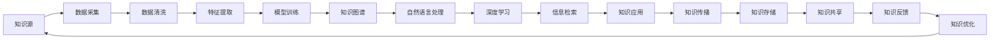

                 

# 知识管理3.0：AI驱动的组织学习革命

> 关键词：知识管理,人工智能,组织学习,知识图谱,自然语言处理,机器学习,深度学习

## 1. 背景介绍

### 1.1 问题由来

在数字化时代的浪潮中，组织内部知识共享与学习的重要性日益凸显。知识管理（Knowledge Management, KM）作为推动组织学习和创新的关键工具，历经传统知识管理、社会性知识管理到当前正盛的知识管理3.0的演进。传统的知识管理主要依赖于文档和文件等静态媒介，而社会性知识管理则引入了社交网络和协作工具，让知识流动更加动态和社交化。然而，这些方法在面对海量、复杂、非结构化数据的挑战时，仍显力有不逮。

### 1.2 问题核心关键点

知识管理3.0利用人工智能（AI）和大数据技术，实现了知识获取、存储、传播、应用和创新的自动化与智能化。AI驱动的知识管理不仅能够自动提取、分类、索引和关联数据，还能够利用深度学习、自然语言处理（NLP）、知识图谱等技术，实现对隐性知识（隐性知识通常以经验、直觉、情感等形式存在）的挖掘与智能化表达，进而推动组织内部的持续学习与创新。

## 2. 核心概念与联系

### 2.1 核心概念概述

1. **知识管理**：旨在通过系统的收集、整理、存储和应用知识，提高组织的学习能力和创新效率。知识管理3.0强调利用AI和大数据技术，实现知识获取和传播的智能化和自动化。

2. **人工智能**：通过模拟人类智能行为，实现问题求解、数据处理、知识发现和推理等任务。在知识管理中，AI特别擅长处理大规模、非结构化数据。

3. **深度学习**：一种特殊的机器学习方法，能够通过多层次的神经网络模型，从原始数据中自动提取和表示高层次的抽象特征，常用于图像、语音、文本等复杂数据的处理。

4. **自然语言处理**：通过计算语言学和人工智能技术，使计算机能够理解和处理自然语言，常用于文本分析、信息抽取、情感分析、问答系统等应用。

5. **知识图谱**：一种结构化的语义表示模型，将知识以图的形式展现，通过节点和边的关系表达实体之间的关联，有助于知识的存储、查询和推理。

6. **机器学习**：一种数据驱动的学习方法，通过算法从数据中提取模式和规律，实现模型自动优化。常用于分类、聚类、回归等任务。

7. **信息检索**：通过算法从文本数据库中查找相关信息，帮助用户快速获取知识。信息检索是知识管理的重要组成部分，能够提升知识获取的效率。

### 2.2 核心概念原理和架构的 Mermaid 流程图



这个流程图展示了知识管理3.0的核心流程：
1. 从各类知识源收集数据。
2. 对数据进行清洗、提取特征。
3. 利用模型训练知识图谱，便于知识表示和推理。
4. 利用NLP技术处理文本，提取语义信息。
5. 应用深度学习模型，从数据中提取高层次特征。
6. 构建信息检索系统，提升知识获取效率。
7. 通过知识传播和存储，促进知识共享和迭代。
8. 根据知识反馈，优化知识库和应用模型。
9. 最终知识通过优化应用，反馈到知识源，形成闭环。

## 3. 核心算法原理 & 具体操作步骤

### 3.1 算法原理概述

知识管理3.0的核心算法包括深度学习、NLP、知识图谱和信息检索等技术，其原理和操作流程如下：

**深度学习算法**：用于从大规模数据中自动提取和表示高层次的抽象特征，常用于图像、语音、文本等复杂数据的处理。例如，通过卷积神经网络（CNN）处理图像数据，通过循环神经网络（RNN）或Transformer处理文本数据。

**自然语言处理算法**：通过计算语言学和人工智能技术，使计算机能够理解和处理自然语言，常用于文本分析、信息抽取、情感分析、问答系统等应用。例如，通过BERT或GPT模型进行文本分类、实体识别、关系抽取和情感分析。

**知识图谱算法**：通过结构化的语义表示模型，将知识以图的形式展现，通过节点和边的关系表达实体之间的关联，有助于知识的存储、查询和推理。例如，通过GraphSAGE或Neighbor Sampling等算法构建知识图谱，并使用TransE等模型进行知识推理。

**信息检索算法**：通过算法从文本数据库中查找相关信息，帮助用户快速获取知识。例如，通过倒排索引或向量空间模型进行文本检索。

### 3.2 算法步骤详解

1. **数据采集**：从各类知识源，如企业内部文档、社交媒体、公开文献等，自动采集和导入数据。
   
2. **数据清洗和预处理**：对采集到的数据进行去重、去噪、分词、词性标注等处理，以便后续特征提取和模型训练。
   
3. **特征提取**：通过自然语言处理算法，从文本中提取关键特征，如主题、情感、实体关系等。例如，使用TF-IDF或Word2Vec提取文本特征。
   
4. **模型训练**：利用深度学习模型，如BERT、GPT等，对文本数据进行训练，学习到文本的语义表示。
   
5. **知识图谱构建**：利用知识图谱算法，将提取到的语义信息结构化表示，形成知识图谱。例如，通过Neighbor Sampling算法构建知识图谱，并使用TransE模型进行推理。
   
6. **信息检索**：构建信息检索系统，通过算法快速匹配用户查询和知识库中的信息，提升信息获取效率。例如，使用倒排索引或向量空间模型进行检索。
   
7. **知识应用和传播**：将知识应用于具体任务，如问答系统、推荐系统、决策支持等，并通过社交网络和协作工具传播知识。

### 3.3 算法优缺点

**优点**：
- 自动化与智能化：AI和大数据技术能够自动处理和分析海量数据，提高知识管理的效率和准确性。
- 知识表示与推理：通过知识图谱和深度学习模型，能够将复杂知识结构化和关联化，便于知识的应用和传播。
- 覆盖面广：能够处理不同类型的知识源和数据类型，如文本、图像、语音等。

**缺点**：
- 数据依赖：AI模型需要大量高质量标注数据进行训练，数据的获取和标注成本较高。
- 复杂度较高：深度学习模型和知识图谱算法较为复杂，模型训练和维护成本较高。
- 解释性不足：AI模型往往是黑盒，难以解释其内部决策过程，影响用户信任度。

### 3.4 算法应用领域

知识管理3.0已经在多个领域得到了应用，例如：

- **企业知识管理**：通过AI驱动的知识管理平台，帮助企业高效获取、存储和应用知识，提升决策和创新能力。
- **教育培训**：利用知识图谱和NLP技术，提供个性化的教育资源和智能辅导，提升学习效果。
- **医疗健康**：构建基于知识图谱的临床决策支持系统，辅助医生进行疾病诊断和治疗方案推荐。
- **金融服务**：利用AI技术分析市场数据，提供智能投顾和风险控制建议。
- **环境保护**：通过信息检索和NLP技术，收集和分析环境数据，辅助环境保护政策制定。
- **文化艺术**：利用NLP和知识图谱技术，进行文化遗产的数字化保护和传承。

## 4. 数学模型和公式 & 详细讲解 & 举例说明

### 4.1 数学模型构建

本节将使用数学语言对知识管理3.0的核心算法进行详细讲解。

**深度学习模型**：假设输入为 $x \in \mathbb{R}^d$，输出为 $y \in \mathbb{R}^c$，定义深度神经网络模型为 $f_{\theta}(x) = M(x; \theta)$，其中 $M$ 为多层神经网络，$\theta$ 为模型参数。

**自然语言处理模型**：假设输入为文本 $x \in \mathbb{R}^n$，输出为分类标签 $y \in \{0,1\}^m$，定义NLP模型为 $f_{\theta}(x) = S(x; \theta)$，其中 $S$ 为BERT或GPT等模型，$\theta$ 为模型参数。

**知识图谱模型**：假设知识图谱表示为 $G=(V,E)$，其中 $V$ 为节点集合，$E$ 为边集合。定义知识推理模型为 $f_{\theta}(x) = P(x; \theta)$，其中 $P$ 为GraphSAGE或Neighbor Sampling等模型，$\theta$ 为模型参数。

**信息检索模型**：假设查询为 $q \in \mathbb{R}^m$，文档集合为 $D$，定义信息检索模型为 $f_{\theta}(q) = R(q; \theta)$，其中 $R$ 为向量空间模型或倒排索引，$\theta$ 为模型参数。

### 4.2 公式推导过程

**深度学习模型的公式推导**：假设深度学习模型为 $f_{\theta}(x) = M(x; \theta)$，其中 $M$ 为多层神经网络，$\theta$ 为模型参数。定义损失函数为 $L(y, \hat{y})$，则模型的训练目标为最小化损失函数：

$$
\min_{\theta} L(y, M(x; \theta))
$$

通过反向传播算法，计算梯度并更新参数：

$$
\theta \leftarrow \theta - \eta \nabla_{\theta} L(y, M(x; \theta))
$$

**自然语言处理模型的公式推导**：假设NLP模型为 $f_{\theta}(x) = S(x; \theta)$，其中 $S$ 为BERT或GPT等模型，$\theta$ 为模型参数。定义损失函数为 $L(y, \hat{y})$，则模型的训练目标为最小化损失函数：

$$
\min_{\theta} L(y, S(x; \theta))
$$

通过反向传播算法，计算梯度并更新参数：

$$
\theta \leftarrow \theta - \eta \nabla_{\theta} L(y, S(x; \theta))
$$

**知识图谱模型的公式推导**：假设知识图谱模型为 $f_{\theta}(x) = P(x; \theta)$，其中 $P$ 为GraphSAGE或Neighbor Sampling等模型，$\theta$ 为模型参数。定义损失函数为 $L(y, \hat{y})$，则模型的训练目标为最小化损失函数：

$$
\min_{\theta} L(y, P(x; \theta))
$$

通过反向传播算法，计算梯度并更新参数：

$$
\theta \leftarrow \theta - \eta \nabla_{\theta} L(y, P(x; \theta))
$$

**信息检索模型的公式推导**：假设信息检索模型为 $f_{\theta}(q) = R(q; \theta)$，其中 $R$ 为向量空间模型或倒排索引，$\theta$ 为模型参数。定义损失函数为 $L(y, \hat{y})$，则模型的训练目标为最小化损失函数：

$$
\min_{\theta} L(y, R(q; \theta))
$$

通过反向传播算法，计算梯度并更新参数：

$$
\theta \leftarrow \theta - \eta \nabla_{\theta} L(y, R(q; \theta))
$$

### 4.3 案例分析与讲解

以一个简单的问答系统为例，分析知识管理3.0的核心算法：

**输入**：用户输入问题 $q = "今天天气怎么样？"$
**处理**：
1. **自然语言处理**：将问题分词、词性标注，提取关键词。
2. **深度学习**：使用BERT模型，将问题转换为向量表示。
3. **知识图谱**：通过知识图谱查询，查找相关实体和关系。
4. **信息检索**：在知识库中检索相关文档，获取答案。
5. **回答**：将答案返回给用户。

## 5. 项目实践：代码实例和详细解释说明

### 5.1 开发环境搭建

在进行知识管理3.0的开发实践前，我们需要准备好开发环境。以下是使用Python进行TensorFlow开发的环境配置流程：

1. 安装Anaconda：从官网下载并安装Anaconda，用于创建独立的Python环境。

2. 创建并激活虚拟环境：
```bash
conda create -n tensorflow-env python=3.8 
conda activate tensorflow-env
```

3. 安装TensorFlow：从官网获取对应的安装命令。例如：
```bash
pip install tensorflow==2.4
```

4. 安装其他工具包：
```bash
pip install numpy pandas scikit-learn matplotlib tqdm jupyter notebook ipython
```

完成上述步骤后，即可在`tensorflow-env`环境中开始知识管理3.0的开发实践。

### 5.2 源代码详细实现

我们先实现一个基于深度学习模型的问答系统，代码如下：

```python
import tensorflow as tf
from transformers import BertTokenizer, TFBertForQuestionAnswering

tokenizer = BertTokenizer.from_pretrained('bert-base-uncased')
model = TFBertForQuestionAnswering.from_pretrained('bert-base-uncased')

@tf.function
def get_answer(question, context):
    inputs = tokenizer(question, context, return_tensors='tf')
    start_logits, end_logits = model(inputs['input_ids'], attention_mask=inputs['attention_mask'])
    start_index = tf.argmax(start_logits, axis=-1)
    end_index = tf.argmax(end_logits, axis=-1)
    return tokenizer.convert_ids_to_tokens(inputs['input_ids'][0, start_index:end_index+1])

question = "What is the capital of France?"
context = "France is a country located in Europe. The capital of France is Paris."
answer = get_answer(question, context)
print(answer)
```

该代码实现了通过深度学习模型进行问答的流程：
1. 初始化BERT模型和分词器。
2. 将问题和上下文转换为token ids。
3. 将token ids输入模型，得到开始和结束位置的概率分布。
4. 将概率分布转换为实际的位置，并解码成文本。

### 5.3 代码解读与分析

代码的核心是BERT模型的输入输出处理。其中，`get_answer`函数实现了问题的抽取过程：
1. `tokenizer(question, context, return_tensors='tf')`：将问题和上下文转换为token ids，并返回TF tensors。
2. `model(inputs['input_ids'], attention_mask=inputs['attention_mask'])`：将token ids输入模型，得到开始和结束位置的概率分布。
3. `tf.argmax(start_logits, axis=-1)`：对概率分布进行softmax，得到开始和结束位置的索引。
4. `tokenizer.convert_ids_to_tokens(inputs['input_ids'][0, start_index:end_index+1])`：将索引转换为实际的单词，并返回答案。

## 6. 实际应用场景

### 6.1 企业知识管理

在企业知识管理中，知识管理3.0的应用场景主要包括：
- **知识采集与整合**：从企业内部的文档、邮件、会议记录等数据源中自动采集和整合知识。
- **知识分类与索引**：利用深度学习模型自动分类和索引知识，便于查询和检索。
- **知识检索与推荐**：构建信息检索系统，根据用户需求快速匹配相关知识，并推荐相关内容。
- **知识应用与传播**：将知识应用于决策支持、员工培训等场景，并通过内部社交网络传播。

### 6.2 教育培训

在教育培训中，知识管理3.0的应用场景主要包括：
- **知识生成与整理**：根据教材、学术论文、实验报告等生成结构化的知识库。
- **个性化学习**：利用NLP技术对学生的学习行为和成绩进行分析，推荐个性化的学习资源和辅导方案。
- **智能辅导**：构建智能辅导系统，通过对话界面解答学生问题，提升学习效果。

### 6.3 医疗健康

在医疗健康中，知识管理3.0的应用场景主要包括：
- **知识库构建**：构建基于知识图谱的临床知识库，包含疾病症状、诊断标准、治疗方案等信息。
- **智能诊断**：利用深度学习模型对病历数据进行分析，辅助医生进行疾病诊断。
- **决策支持**：提供基于知识图谱的决策支持系统，辅助医生制定治疗方案。

### 6.4 金融服务

在金融服务中，知识管理3.0的应用场景主要包括：
- **风险控制**：利用深度学习模型对市场数据进行分析，预测市场风险。
- **智能投顾**：构建智能投顾系统，根据用户需求和市场数据，推荐投资策略和资产配置。
- **知识图谱应用**：通过知识图谱构建金融领域的知识图谱，提供全面的市场信息和分析工具。

### 6.5 环境保护

在环境保护中，知识管理3.0的应用场景主要包括：
- **环境数据监测**：利用深度学习模型分析环境数据，预测环境变化趋势。
- **环境政策制定**：构建基于知识图谱的环境政策库，辅助环境保护政策的制定和实施。
- **公众科普**：通过NLP技术生成通俗易懂的科普文章，提升公众对环境保护的意识。

### 6.6 文化艺术

在文化艺术中，知识管理3.0的应用场景主要包括：
- **文化遗产数字化**：利用深度学习模型对文化遗产进行数字化处理，构建虚拟博物馆和展览馆。
- **艺术创作辅助**：通过NLP技术生成艺术创作灵感，辅助艺术家进行创作。
- **艺术史研究**：构建基于知识图谱的艺术史知识库，提供艺术史研究工具和资源。

## 7. 工具和资源推荐

### 7.1 学习资源推荐

为了帮助开发者系统掌握知识管理3.0的理论基础和实践技巧，这里推荐一些优质的学习资源：

1. 《深度学习》系列书籍：由深度学习领域权威人士编写，全面介绍深度学习的基本原理和应用。
2. 《自然语言处理综论》：介绍自然语言处理的理论基础和主要技术，适合初学者和进阶者。
3. 《知识图谱：构建与查询》：详细介绍知识图谱的概念、构建方法和查询技术，适合知识图谱开发者。
4. TensorFlow官方文档：提供TensorFlow的详细使用指南和教程，适合TensorFlow开发者。
5. PyTorch官方文档：提供PyTorch的详细使用指南和教程，适合PyTorch开发者。

通过对这些资源的学习实践，相信你一定能够快速掌握知识管理3.0的精髓，并用于解决实际的NLP问题。

### 7.2 开发工具推荐

高效的开发离不开优秀的工具支持。以下是几款用于知识管理3.0开发的常用工具：

1. TensorFlow：由Google主导开发的开源深度学习框架，生产部署方便，适合大规模工程应用。
2. PyTorch：基于Python的开源深度学习框架，灵活动态，适合快速迭代研究。
3. Apache Jena：用于构建和管理知识图谱的开源工具，支持RDF和Turtle等数据格式。
4. Gephi：用于可视化和管理知识图谱的开源工具，支持图形绘制和分析。
5. Elasticsearch：高性能的全文搜索和分析引擎，支持NLP和知识图谱的集成。

合理利用这些工具，可以显著提升知识管理3.0的开发效率，加快创新迭代的步伐。

### 7.3 相关论文推荐

知识管理3.0的发展源于学界的持续研究。以下是几篇奠基性的相关论文，推荐阅读：

1. "Knowledge Graphs: Creating, Publishing, and Querying RDF Data on the Web"（维基百科）：介绍知识图谱的基本概念和构建方法。
2. "Knowledge Graphs for Semantic Search Engines"：介绍将知识图谱应用于搜索引擎的技术和应用。
3. "Deep Learning for Natural Language Processing"：介绍深度学习在自然语言处理中的应用，适合深度学习初学者和进阶者。
4. "Knowledge-Base Question Answering with Continuous Tensor Embeddings"：介绍基于连续张量嵌入的知识图谱问答系统。
5. "Knowledge-Graph-based Recommendation Systems"：介绍基于知识图谱的推荐系统，适合推荐系统开发者。

这些论文代表了大语言模型微调技术的发展脉络。通过学习这些前沿成果，可以帮助研究者把握学科前进方向，激发更多的创新灵感。

## 8. 总结：未来发展趋势与挑战

### 8.1 总结

本文对知识管理3.0进行了全面系统的介绍。首先阐述了知识管理3.0的背景和意义，明确了AI和大数据技术在推动组织学习和创新方面的重要作用。其次，从原理到实践，详细讲解了知识管理3.0的核心算法和操作步骤，给出了知识管理3.0的代码实例。同时，本文还广泛探讨了知识管理3.0在企业知识管理、教育培训、医疗健康、金融服务、环境保护、文化艺术等多个领域的应用前景，展示了知识管理3.0的巨大潜力。此外，本文精选了知识管理3.0的学习资源、开发工具和相关论文，力求为读者提供全方位的技术指引。

通过本文的系统梳理，可以看到，知识管理3.0利用AI和大数据技术，实现了知识获取、存储、传播、应用和创新的自动化与智能化。未来，伴随AI技术的不断进步，知识管理3.0必将在更多领域得到应用，为组织学习和创新提供新的解决方案。

### 8.2 未来发展趋势

展望未来，知识管理3.0的发展趋势主要包括以下几个方面：

1. **知识图谱的普及**：随着知识图谱技术的成熟，越来越多的组织和企业将采用知识图谱来管理和应用知识，实现知识的智能化表达和关联。
2. **深度学习的应用**：深度学习在知识管理中的应用将更加广泛和深入，例如知识推理、知识抽取、知识生成等任务。
3. **多模态融合**：未来的知识管理将越来越多地融合视觉、语音、图像等多种模态的信息，提升知识表示和应用的全面性。
4. **个性化推荐**：通过知识管理3.0技术，提供更加个性化、精准的知识推荐服务，满足用户的多样化需求。
5. **实时知识更新**：知识管理3.0将能够实时更新和调整知识库，确保知识的时效性和准确性。
6. **智能决策支持**：基于知识图谱和深度学习模型，提供更加智能和全面的决策支持系统，辅助组织的决策制定。

以上趋势凸显了知识管理3.0的广阔前景。这些方向的探索发展，必将进一步提升知识管理的智能化和自动化水平，为组织学习带来新的突破。

### 8.3 面临的挑战

尽管知识管理3.0已经取得了瞩目成就，但在迈向更加智能化、普适化应用的过程中，它仍面临着诸多挑战：

1. **数据依赖**：AI模型需要大量高质量标注数据进行训练，数据的获取和标注成本较高。如何进一步降低对标注样本的依赖，将是一大难题。
2. **复杂度较高**：深度学习模型和知识图谱算法较为复杂，模型训练和维护成本较高。
3. **可解释性不足**：AI模型往往是黑盒，难以解释其内部决策过程，影响用户信任度。
4. **资源限制**：知识管理3.0需要强大的计算资源和存储资源，如何优化资源使用，提升系统效率，是一个重要问题。
5. **安全性和隐私**：知识管理3.0涉及大量敏感数据，如何确保数据的安全性和隐私性，是亟待解决的问题。

### 8.4 研究展望

面对知识管理3.0面临的挑战，未来的研究需要在以下几个方面寻求新的突破：

1. **无监督和半监督学习**：摆脱对大规模标注数据的依赖，利用无监督和半监督学习技术，最大限度利用非结构化数据，实现更加灵活高效的微调。
2. **知识表示与推理**：研究更加全面和精准的知识表示和推理技术，提升知识管理的智能化水平。
3. **多模态融合**：将视觉、语音、图像等多种模态的信息，与文本信息进行协同建模，提升知识表示的全面性。
4. **个性化推荐**：利用知识管理3.0技术，提供更加个性化、精准的知识推荐服务，满足用户的多样化需求。
5. **实时知识更新**：研究实时知识更新和调整技术，确保知识的时效性和准确性。
6. **智能决策支持**：基于知识图谱和深度学习模型，提供更加智能和全面的决策支持系统，辅助组织的决策制定。

这些研究方向将引领知识管理3.0技术的发展，为构建智能学习系统提供新的解决方案。面向未来，知识管理3.0还需要与其他人工智能技术进行更深入的融合，如知识表示、因果推理、强化学习等，多路径协同发力，共同推动知识管理的进步。只有勇于创新、敢于突破，才能不断拓展知识管理的边界，让智能技术更好地造福人类社会。

## 9. 附录：常见问题与解答

**Q1：知识管理3.0是否适用于所有组织？**

A: 知识管理3.0适用于大多数组织，特别是那些拥有大量数据和丰富知识的企业。对于小型组织，由于数据量有限，可能无法获得理想的微调效果。

**Q2：知识管理3.0是否需要昂贵的硬件设备？**

A: 知识管理3.0需要强大的计算资源和存储资源，但随着云计算和分布式计算技术的发展，许多企业可以通过云服务实现知识管理的部署。

**Q3：知识管理3.0是否需要大量的标注数据？**

A: 知识管理3.0可以通过无监督和半监督学习技术，最大限度利用非结构化数据，实现更加灵活高效的微调。标注数据的成本和获取问题将逐渐得到缓解。

**Q4：知识管理3.0是否容易受到偏见和噪声的影响？**

A: 知识管理3.0系统容易受到数据中的偏见和噪声影响，需要通过数据清洗和预处理技术，尽可能减少这些影响。

**Q5：知识管理3.0是否容易被黑客攻击？**

A: 知识管理3.0涉及大量敏感数据，需要采取严格的安全措施，如数据加密、访问控制、审计日志等，确保数据的安全性和隐私性。

---

作者：禅与计算机程序设计艺术 / Zen and the Art of Computer Programming

