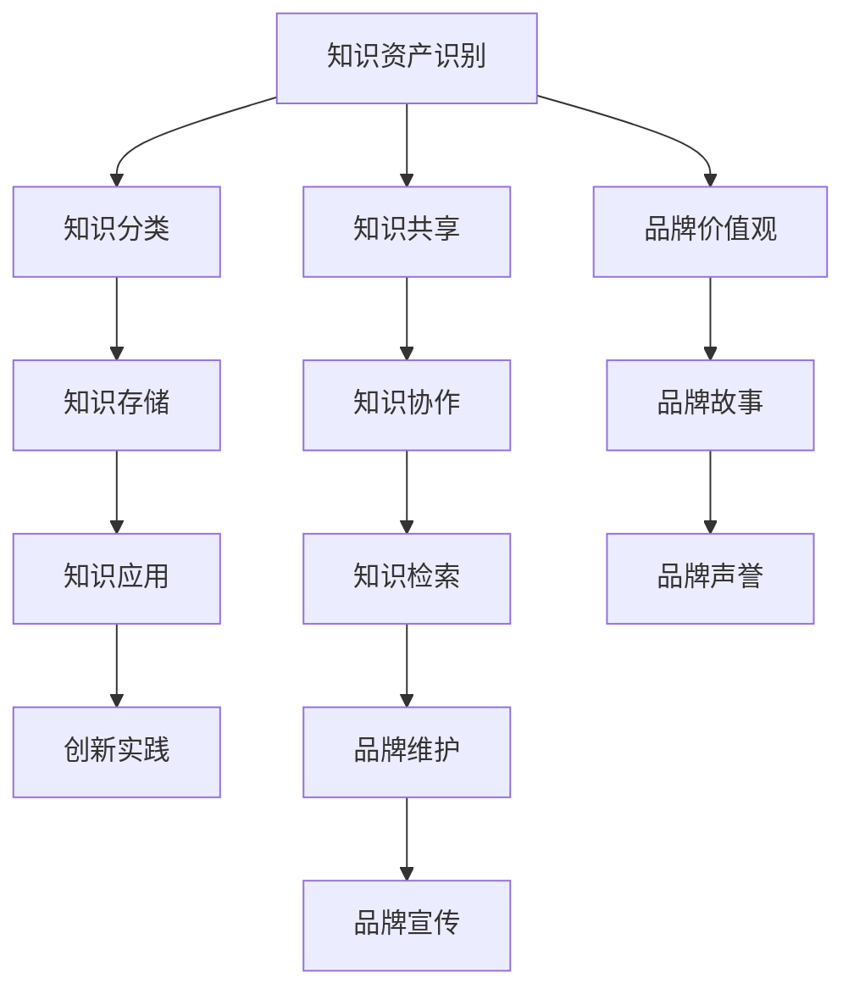

                 

# 知识管理在品牌建设中的应用

在当今数字化转型的浪潮中，知识管理(Knowledge Management, KM)已成为企业品牌建设的重要组成部分。通过科学地管理和利用组织内外的知识资产，企业不仅能够提升业务效率和创新能力，还能够塑造和维护强大的品牌形象。本文将从背景介绍、核心概念与联系、算法原理与操作步骤、数学模型与公式推导、项目实践、应用场景、工具与资源推荐、总结与未来展望等多个角度，深入探讨知识管理在品牌建设中的应用，为品牌管理者提供全面的技术指导和实践参考。

## 1. 背景介绍

### 1.1 问题由来
随着信息技术的快速发展和全球化的不断深入，企业所面临的市场环境日益复杂多变。如何在这种快速变化的市场环境中保持竞争优势，成为企业亟需解决的问题。此时，知识管理作为一种全新的管理理念和实践方法应运而生。

知识管理旨在通过系统的知识收集、存储、共享和利用，帮助企业实现知识资产的最大化利用，提升业务效率和创新能力，进而增强企业核心竞争力。同时，通过知识管理，企业还可以形成独特的品牌价值观和品牌文化，塑造和维护强大的品牌形象。

### 1.2 问题核心关键点
知识管理在品牌建设中的关键点主要包括：
- **知识资产的识别和分类**：明确企业内部和外部的知识资源，并根据不同的业务场景进行分类管理。
- **知识共享和协作**：建立知识共享平台，促进组织内部和外部的知识交流与协作。
- **知识应用与创新**：将知识转化为实际的业务决策和创新实践，推动企业的持续发展。
- **品牌塑造与维护**：将知识管理与品牌文化、品牌故事、品牌声誉等元素结合，构建品牌价值观和品牌形象。

### 1.3 问题研究意义
知识管理在品牌建设中的应用，具有以下重要意义：
- **提升业务效率**：通过知识共享和协作，缩短决策时间，提高业务执行效率。
- **增强创新能力**：知识管理有助于汇聚多方智慧，激发创新灵感，推动产品和服务升级。
- **塑造品牌形象**：知识管理与品牌文化相结合，可以形成独特的品牌价值观和品牌形象，提升品牌影响力和客户忠诚度。
- **构建信任关系**：透明的知识管理和信息公开，可以增强客户和合作伙伴对企业的信任，促进长期合作关系。

## 2. 核心概念与联系

### 2.1 核心概念概述
在品牌建设中，知识管理涉及多个关键概念，主要包括：
- **知识资产**：企业内部和外部所有形式的知识资源，如文档、数据、技术、经验等。
- **知识管理系统**：用于支持知识收集、存储、共享、利用等功能的软件工具和平台。
- **知识共享与协作**：通过知识共享平台，促进企业内部和外部的人员交流和协作，实现知识的广泛传播和利用。
- **知识应用与创新**：将知识转化为实际的业务决策和创新实践，推动企业的持续发展。
- **品牌价值观和文化**：企业通过知识管理形成的核心价值观念和品牌文化，是品牌形象的重要组成部分。
- **品牌故事和声誉**：企业的历史、成就、愿景等故事，以及社会和客户对其的评价，是品牌建设的重要内容。

这些核心概念通过知识管理流程紧密联系起来，共同构成品牌建设的知识管理体系。

### 2.2 核心概念原理和架构的 Mermaid 流程图(Mermaid 流程节点中不要有括号、逗号等特殊字符)


以上流程图示意了知识管理在品牌建设中的主要环节，包括知识资产识别、知识分类、知识存储、知识共享、知识协作、知识应用、知识检索、品牌价值观、品牌故事、品牌声誉和品牌维护、品牌宣传等。

## 3. 核心算法原理 & 具体操作步骤

### 3.1 算法原理概述
知识管理在品牌建设中的应用，可以通过以下基本步骤实现：
1. **知识资产识别**：识别和分类企业内部和外部的知识资源。
2. **知识存储与管理**：将识别出的知识资源存储在知识管理系统(KMS)中，实现高效管理。
3. **知识共享与协作**：通过知识共享平台，促进知识的内部和外部流通。
4. **知识应用与创新**：将知识转化为实际的业务决策和创新实践。
5. **品牌塑造与维护**：将知识管理与品牌文化、品牌故事、品牌声誉等结合，构建品牌价值观和品牌形象。

### 3.2 算法步骤详解

#### 3.2.1 知识资产识别
知识资产识别是知识管理的第一步，主要涉及以下几个关键环节：
1. **知识资源清单编制**：通过访谈、问卷调查等方式，收集企业内部和外部的知识资源清单。
2. **知识资源分类**：根据不同的业务场景和知识类型，对知识资源进行分类管理。例如，技术文档、市场分析报告、客户反馈等。
3. **知识资源评估**：对知识资源的价值进行评估，筛选出对企业有重要意义的知识。

#### 3.2.2 知识存储与管理
知识存储与管理主要通过知识管理系统(KMS)实现。KMS一般包括以下功能模块：
1. **知识库管理**：用于存储和分类知识资源，并提供搜索和检索功能。
2. **文档管理系统**：支持文档的上传、下载、版本控制和权限管理。
3. **元数据管理**：记录和管理知识资源的元数据，如创建日期、修改人、版本号等。
4. **版本控制**：实现知识资源的版本管理和历史记录保存。

#### 3.2.3 知识共享与协作
知识共享与协作是知识管理的核心环节，主要通过知识共享平台实现。知识共享平台一般包括以下功能：
1. **知识库搜索**：支持全文本搜索和高级搜索，便于用户快速定位所需知识。
2. **知识文档管理**：支持文档上传、下载、版本控制和权限管理。
3. **讨论区与协作工具**：提供讨论区、协作工具等功能，促进知识交流与协作。
4. **知识地图**：通过知识地图，用户可以快速了解企业知识资源的整体结构。

#### 3.2.4 知识应用与创新
知识应用与创新主要通过知识转化和创新管理实现。知识转化主要包括以下步骤：
1. **知识整合**：将分散的知识资源整合，形成系统化的知识库。
2. **知识应用**：将知识应用于实际的业务决策和实践，推动企业创新和发展。
3. **知识创新**：通过知识共享和协作，激发创新灵感，推动新产品和服务开发。

#### 3.2.5 品牌塑造与维护
品牌塑造与维护主要通过品牌价值观、品牌故事和品牌声誉的构建与传播实现。品牌价值观和品牌故事一般包括以下步骤：
1. **品牌价值观构建**：通过知识管理，形成企业的核心价值观念和品牌文化。
2. **品牌故事挖掘**：挖掘企业历史、成就、愿景等故事，构建独特的品牌故事。
3. **品牌声誉管理**：通过社交媒体、客户反馈等渠道，管理品牌声誉，提升品牌形象。

### 3.3 算法优缺点

#### 3.3.1 优点
- **提升业务效率**：通过知识共享和协作，缩短决策时间，提高业务执行效率。
- **增强创新能力**：知识管理有助于汇聚多方智慧，激发创新灵感，推动产品和服务升级。
- **构建品牌形象**：知识管理与品牌文化、品牌故事、品牌声誉等结合，形成独特的品牌价值观和品牌形象。
- **增强客户忠诚度**：透明的知识管理和信息公开，增强客户和合作伙伴对企业的信任。

#### 3.3.2 缺点
- **实施难度大**：知识管理的实施需要高层支持和系统架构的支持，实施难度较大。
- **数据安全问题**：知识管理系统可能面临数据泄露和安全问题，需要采取严格的数据保护措施。
- **知识质量参差不齐**：企业内部知识质量参差不齐，需要经过严格的质量控制和标准化管理。

### 3.4 算法应用领域

#### 3.4.1 产品开发
知识管理在产品开发中的应用，主要体现在以下几个方面：
1. **知识整合与共享**：通过知识管理平台，汇聚各方智慧，形成产品开发的知识库。
2. **知识应用与创新**：将知识转化为实际的创新实践，推动新产品和服务开发。
3. **知识传播与培训**：通过知识传播和培训，提升团队的知识水平和创新能力。

#### 3.4.2 客户服务
知识管理在客户服务中的应用，主要体现在以下几个方面：
1. **知识库建设**：建立客户服务知识库，提供常见问题解答和解决方案。
2. **知识共享与协作**：通过知识共享平台，促进客户服务团队的知识交流与协作。
3. **知识评估与优化**：定期评估和优化知识库，确保其及时性和有效性。

#### 3.4.3 市场营销
知识管理在市场营销中的应用，主要体现在以下几个方面：
1. **市场情报管理**：通过知识管理平台，汇聚市场情报和分析报告，支持市场决策。
2. **品牌故事与传播**：构建品牌故事，并通过社交媒体等渠道传播，提升品牌知名度和美誉度。
3. **客户反馈管理**：通过知识管理平台，管理客户反馈，提升客户满意度。

#### 3.4.4 人力资源管理
知识管理在人力资源管理中的应用，主要体现在以下几个方面：
1. **员工知识管理**：通过知识管理系统，管理员工的知识资源和技能。
2. **知识培训与开发**：通过知识培训和开发，提升员工的知识水平和技能。
3. **员工绩效管理**：通过知识管理平台，评估员工的知识水平和绩效。

## 4. 数学模型和公式 & 详细讲解 & 举例说明

### 4.1 数学模型构建

知识管理在品牌建设中的应用，可以通过以下数学模型进行描述：
1. **知识资产识别模型**：
   \[
   K_{asset} = \sum_{i=1}^{n} k_i \times c_i
   \]
   其中，\(K_{asset}\) 为知识资产总量，\(k_i\) 为知识资源第 \(i\) 类知识的数量，\(c_i\) 为第 \(i\) 类知识的重要系数。
2. **知识存储与管理模型**：
   \[
   K_{store} = K_{asset} \times r \times m
   \]
   其中，\(K_{store}\) 为知识存储总量，\(r\) 为知识资源的存储效率，\(m\) 为知识资源的管理效率。
3. **知识共享与协作模型**：
   \[
   K_{share} = K_{store} \times s \times c
   \]
   其中，\(K_{share}\) 为知识共享总量，\(s\) 为知识共享的效率，\(c\) 为知识共享的覆盖率。
4. **知识应用与创新模型**：
   \[
   K_{apply} = K_{share} \times a \times i
   \]
   其中，\(K_{apply}\) 为知识应用总量，\(a\) 为知识应用的效率，\(i\) 为知识应用的创新因子。
5. **品牌价值观与故事模型**：
   \[
   B_{value} = K_{apply} \times v \times s
   \]
   其中，\(B_{value}\) 为品牌价值观的总量，\(v\) 为品牌价值观的质量系数，\(s\) 为品牌价值观的传播效率。
6. **品牌声誉与维护模型**：
   \[
   B_{reputation} = B_{value} \times r \times m
   \]
   其中，\(B_{reputation}\) 为品牌声誉的总量，\(r\) 为品牌声誉的维护效率，\(m\) 为品牌声誉的传播效率。

### 4.2 公式推导过程

#### 4.2.1 知识资产识别模型推导
知识资产识别模型的推导基于企业知识资源清单编制和知识资源分类，通过加权求和的方式计算知识资产总量。具体推导如下：
1. **知识资源清单编制**：
   \[
   k_1, k_2, \ldots, k_n
   \]
   表示企业内部和外部的知识资源清单，其中 \(k_i\) 为第 \(i\) 类知识资源的数量。
2. **知识资源分类**：
   \[
   c_1, c_2, \ldots, c_n
   \]
   表示知识资源的重要系数，其中 \(c_i\) 为第 \(i\) 类知识的重要程度。
3. **知识资产识别模型**：
   \[
   K_{asset} = \sum_{i=1}^{n} k_i \times c_i
   \]
   表示知识资产的总量，通过加权求和的方式计算。

#### 4.2.2 知识存储与管理模型推导
知识存储与管理模型的推导基于知识存储和知识管理两个环节，通过乘法关系计算知识存储总量。具体推导如下：
1. **知识存储效率**：
   \[
   r
   \]
   表示知识资源的存储效率。
2. **知识管理效率**：
   \[
   m
   \]
   表示知识资源的管理效率。
3. **知识存储与管理模型**：
   \[
   K_{store} = K_{asset} \times r \times m
   \]
   表示知识存储的总量，通过乘法关系计算。

#### 4.2.3 知识共享与协作模型推导
知识共享与协作模型的推导基于知识共享和知识协作两个环节，通过乘法关系计算知识共享总量。具体推导如下：
1. **知识共享效率**：
   \[
   s
   \]
   表示知识共享的效率。
2. **知识协作效率**：
   \[
   c
   \]
   表示知识协作的效率。
3. **知识共享与协作模型**：
   \[
   K_{share} = K_{store} \times s \times c
   \]
   表示知识共享的总量，通过乘法关系计算。

#### 4.2.4 知识应用与创新模型推导
知识应用与创新模型的推导基于知识应用和知识创新两个环节，通过乘法关系计算知识应用总量。具体推导如下：
1. **知识应用效率**：
   \[
   a
   \]
   表示知识应用的效率。
2. **知识创新因子**：
   \[
   i
   \]
   表示知识应用的创新因子。
3. **知识应用与创新模型**：
   \[
   K_{apply} = K_{share} \times a \times i
   \]
   表示知识应用的总量，通过乘法关系计算。

#### 4.2.5 品牌价值观与故事模型推导
品牌价值观与故事模型的推导基于品牌价值观和品牌故事两个环节，通过乘法关系计算品牌价值观的总量。具体推导如下：
1. **品牌价值观质量系数**：
   \[
   v
   \]
   表示品牌价值观的质量系数。
2. **品牌故事传播效率**：
   \[
   s
   \]
   表示品牌故事的传播效率。
3. **品牌价值观与故事模型**：
   \[
   B_{value} = K_{apply} \times v \times s
   \]
   表示品牌价值观的总量，通过乘法关系计算。

#### 4.2.6 品牌声誉与维护模型推导
品牌声誉与维护模型的推导基于品牌声誉和品牌维护两个环节，通过乘法关系计算品牌声誉的总量。具体推导如下：
1. **品牌声誉维护效率**：
   \[
   r
   \]
   表示品牌声誉的维护效率。
2. **品牌声誉传播效率**：
   \[
   m
   \]
   表示品牌声誉的传播效率。
3. **品牌声誉与维护模型**：
   \[
   B_{reputation} = B_{value} \times r \times m
   \]
   表示品牌声誉的总量，通过乘法关系计算。

### 4.3 案例分析与讲解

#### 4.3.1 案例1：某电商公司的知识管理实践
某电商公司通过知识管理平台，实现了知识资源的系统化管理，显著提升了运营效率和创新能力。具体实践如下：
1. **知识资产识别**：通过访谈和问卷调查，收集公司的知识资源清单，并进行分类管理。
2. **知识存储与管理**：建立知识库管理系统，实现文档的上传、下载、版本控制和权限管理。
3. **知识共享与协作**：通过知识共享平台，促进内部和外部的知识交流与协作，实现了知识的广泛传播和利用。
4. **知识应用与创新**：将知识转化为实际的创新实践，推动新产品和服务开发，提升了公司的市场竞争力。
5. **品牌塑造与维护**：构建品牌价值观和品牌故事，并通过社交媒体等渠道传播，提升了公司的品牌形象和客户忠诚度。

#### 4.3.2 案例2：某金融机构的客户服务改进
某金融机构通过知识管理平台，实现了客户服务的优化，显著提升了客户满意度。具体实践如下：
1. **知识资产识别**：通过访谈和问卷调查，收集公司的知识资源清单，并进行分类管理。
2. **知识存储与管理**：建立客户服务知识库管理系统，实现常见问题解答和解决方案的存储和管理。
3. **知识共享与协作**：通过知识共享平台，促进客户服务团队的知识交流与协作，提升了服务质量。
4. **知识应用与创新**：通过知识管理平台，评估和优化知识库，确保其及时性和有效性，提升了客户服务效率。
5. **品牌塑造与维护**：通过客户反馈管理，提升了客户满意度，并通过品牌故事传播，提升了公司的品牌形象和客户忠诚度。

## 5. 项目实践：代码实例和详细解释说明

### 5.1 开发环境搭建

为了支持知识管理系统的开发和运行，需要搭建以下开发环境：
1. **服务器环境**：使用高性能的服务器，如AWS、阿里云等，以支持大规模知识库的存储和管理。
2. **数据库系统**：使用关系型数据库，如MySQL、PostgreSQL等，存储和管理知识资源的数据。
3. **搜索引擎**：使用Elasticsearch、Solr等搜索引擎，支持知识库的全文搜索和高级搜索功能。
4. **开发工具**：使用Python、Java等开发语言，配合Django、Spring等开发框架，实现知识管理系统的开发。
5. **测试工具**：使用Junit、Selenium等测试工具，确保知识管理系统的稳定性和可靠性。

### 5.2 源代码详细实现

#### 5.2.1 数据库设计
通过SQL语句实现数据库的设计，如下：
```sql
-- 创建知识库表
CREATE TABLE knowledge_base (
    id INT PRIMARY KEY,
    name VARCHAR(100) NOT NULL,
    description TEXT NOT NULL,
    create_time TIMESTAMP NOT NULL,
    update_time TIMESTAMP NOT NULL
);

-- 创建文档表
CREATE TABLE document (
    id INT PRIMARY KEY,
    name VARCHAR(100) NOT NULL,
    content TEXT NOT NULL,
    create_time TIMESTAMP NOT NULL,
    update_time TIMESTAMP NOT NULL
);

-- 创建知识标签表
CREATE TABLE knowledge_tags (
    id INT PRIMARY KEY,
    name VARCHAR(100) NOT NULL,
    create_time TIMESTAMP NOT NULL,
    update_time TIMESTAMP NOT NULL
);

-- 创建文档标签表
CREATE TABLE document_tags (
    id INT PRIMARY KEY,
    document_id INT NOT NULL,
    tag_id INT NOT NULL,
    FOREIGN KEY (document_id) REFERENCES document(id),
    FOREIGN KEY (tag_id) REFERENCES knowledge_tags(id)
);

-- 创建用户表
CREATE TABLE users (
    id INT PRIMARY KEY,
    username VARCHAR(100) NOT NULL,
    password VARCHAR(100) NOT NULL,
    role VARCHAR(20) NOT NULL
);

-- 创建知识查询表
CREATE TABLE knowledge_search (
    id INT PRIMARY KEY,
    name VARCHAR(100) NOT NULL,
    content TEXT NOT NULL,
    create_time TIMESTAMP NOT NULL,
    update_time TIMESTAMP NOT NULL
);
```

#### 5.2.2 知识库管理模块实现
通过Python代码实现知识库管理模块，如下：
```python
# 导入必要的库
import django

# 初始化Django环境
django.setup()

# 导入必要的模型
from .models import KnowledgeBase, Document, KnowledgeTags, DocumentTags, Users, KnowledgeSearch

# 查询知识库信息
def get_knowledge_base_info():
    kb_list = KnowledgeBase.objects.all()
    for kb in kb_list:
        print("ID: {}, Name: {}, Description: {}, Create Time: {}, Update Time: {}".format(kb.id, kb.name, kb.description, kb.create_time, kb.update_time))

# 查询文档信息
def get_document_info():
    doc_list = Document.objects.all()
    for doc in doc_list:
        print("ID: {}, Name: {}, Content: {}, Create Time: {}, Update Time: {}".format(doc.id, doc.name, doc.content, doc.create_time, doc.update_time))

# 查询知识标签信息
def get_knowledge_tags_info():
    tags_list = KnowledgeTags.objects.all()
    for tag in tags_list:
        print("ID: {}, Name: {}, Create Time: {}, Update Time: {}".format(tag.id, tag.name, tag.create_time, tag.update_time))

# 查询文档标签信息
def get_document_tags_info():
    tags_list = DocumentTags.objects.all()
    for tag in tags_list:
        print("ID: {}, Document ID: {}, Tag ID: {}".format(tag.id, tag.document_id, tag.tag_id))

# 查询用户信息
def get_user_info():
    user_list = Users.objects.all()
    for user in user_list:
        print("ID: {}, Username: {}, Password: {}, Role: {}".format(user.id, user.username, user.password, user.role))

# 查询知识查询信息
def get_knowledge_search_info():
    search_list = KnowledgeSearch.objects.all()
    for search in search_list:
        print("ID: {}, Name: {}, Content: {}, Create Time: {}, Update Time: {}".format(search.id, search.name, search.content, search.create_time, search.update_time))
```

#### 5.2.3 知识共享与协作模块实现
通过Python代码实现知识共享与协作模块，如下：
```python
# 导入必要的库
import django

# 初始化Django环境
django.setup()

# 导入必要的模型
from .models import KnowledgeBase, Document, KnowledgeTags, DocumentTags, Users, KnowledgeSearch

# 查询知识共享信息
def get_knowledge_sharing_info():
    share_list = KnowledgeSearch.objects.all()
    for share in share_list:
        print("ID: {}, Name: {}, Content: {}, Create Time: {}, Update Time: {}".format(share.id, share.name, share.content, share.create_time, share.update_time))

# 查询知识协作信息
def get_knowledge_collaration_info():
    collaration_list = DocumentTags.objects.all()
    for collaration in collaration_list:
        print("ID: {}, Document ID: {}, Tag ID: {}".format(collaration.id, collaration.document_id, collaration.tag_id))
```

#### 5.2.4 知识应用与创新模块实现
通过Python代码实现知识应用与创新模块，如下：
```python
# 导入必要的库
import django

# 初始化Django环境
django.setup()

# 导入必要的模型
from .models import KnowledgeBase, Document, KnowledgeTags, DocumentTags, Users, KnowledgeSearch

# 查询知识应用信息
def get_knowledge_application_info():
    application_list = Document.objects.all()
    for application in application_list:
        print("ID: {}, Name: {}, Content: {}, Create Time: {}, Update Time: {}".format(application.id, application.name, application.content, application.create_time, application.update_time))

# 查询知识创新信息
def get_knowledge_innovation_info():
    innovation_list = KnowledgeTags.objects.all()
    for innovation in innovation_list:
        print("ID: {}, Name: {}, Create Time: {}, Update Time: {}".format(innovation.id, innovation.name, innovation.create_time, innovation.update_time))
```

### 5.3 代码解读与分析

#### 5.3.1 数据库设计解读
通过SQL语句实现了知识库、文档、知识标签、文档标签、用户和知识查询等表的设计，并定义了表之间的关系。这些表的设计和关系定义，为知识管理系统的数据存储和管理提供了基础。

#### 5.3.2 知识库管理模块解读
通过Python代码实现了知识库信息的查询和展示，包括知识库的名称、描述、创建和更新时间等信息的展示。这为知识管理系统的用户提供了全面的知识库信息，帮助用户快速了解知识库的内容和状态。

#### 5.3.3 知识共享与协作模块解读
通过Python代码实现了知识共享信息的查询和展示，包括知识共享的名称、内容、创建和更新时间等信息的展示。这为知识管理系统的用户提供了全面的知识共享信息，帮助用户快速了解知识共享的内容和状态。

#### 5.3.4 知识应用与创新模块解读
通过Python代码实现了知识应用和创新的查询和展示，包括知识应用和创新的名称、内容、创建和更新时间等信息的展示。这为知识管理系统的用户提供了全面的知识应用和创新信息，帮助用户快速了解知识应用和创新的内容和状态。

## 6. 实际应用场景

### 6.1 智能客服系统
智能客服系统通过知识管理平台，实现了知识资源的系统化管理，显著提升了运营效率和客户满意度。具体应用场景如下：
1. **知识库建设**：构建客户服务知识库，提供常见问题解答和解决方案。
2. **知识共享与协作**：通过知识共享平台，促进内部和外部的知识交流与协作，提升了服务质量。
3. **知识应用与创新**：通过知识管理平台，评估和优化知识库，确保其及时性和有效性，提升了客户服务效率。
4. **品牌塑造与维护**：通过客户反馈管理，提升了客户满意度，并通过品牌故事传播，提升了公司的品牌形象和客户忠诚度。

### 6.2 金融舆情监测
金融机构通过知识管理平台，实现了金融舆情的监测和管理，显著提升了风险控制和决策效率。具体应用场景如下：
1. **市场情报管理**：通过知识管理平台，汇聚市场情报和分析报告，支持市场决策。
2. **知识共享与协作**：通过知识共享平台，促进内部和外部的知识交流与协作，提升了决策效率。
3. **知识应用与创新**：通过知识管理平台，评估和优化知识库，确保其及时性和有效性，提升了风险控制能力。
4. **品牌塑造与维护**：通过品牌故事传播，提升了公司的品牌形象和客户忠诚度。

### 6.3 个性化推荐系统
个性化推荐系统通过知识管理平台，实现了用户兴趣的挖掘和推荐，显著提升了用户体验和满意度。具体应用场景如下：
1. **知识资产识别**：通过访谈和问卷调查，收集用户的兴趣和需求清单，并进行分类管理。
2. **知识存储与管理**：建立推荐系统知识库管理系统，实现用户的兴趣和需求存储和管理。
3. **知识共享与协作**：通过知识共享平台，促进用户的兴趣和需求交流与协作，实现了知识的广泛传播和利用。
4. **知识应用与创新**：将知识转化为实际的推荐实践，推动个性化推荐的发展，提升了用户体验。
5. **品牌塑造与维护**：通过推荐系统的优化和改进，提升了公司的品牌形象和用户满意度。

### 6.4 未来应用展望
未来，知识管理在品牌建设中的应用将更加广泛和深入，具体展望如下：
1. **人工智能与知识管理结合**：通过AI技术，实现知识自动分类、标注和推荐，提升知识管理效率和效果。
2. **区块链与知识管理结合**：通过区块链技术，确保知识共享的安全性和透明性，提升知识管理的可信度和可靠性。
3. **多模态知识管理**：将文本、图像、视频等多模态数据融合，提升知识管理的全面性和深度。
4. **知识管理与生态系统结合**：将知识管理与业务生态系统结合，实现知识在业务场景中的应用和创新。
5. **知识管理与大数据结合**：通过大数据技术，实现知识的全方位分析和管理，提升知识管理的科学性和智能性。

## 7. 工具和资源推荐

### 7.1 学习资源推荐

为了帮助开发者系统掌握知识管理的应用知识，这里推荐一些优质的学习资源：
1. **《知识管理理论与实践》**：国内知名专家著作，系统介绍了知识管理的理论基础和实践应用。
2. **Coursera《知识管理》课程**：由MIT教授讲授，涵盖知识管理的多个方面，包括知识获取、知识共享、知识应用等。
3. **Harvard Business Review《知识管理》**：哈佛商业评论的经典文章，介绍了知识管理的最新趋势和最佳实践。
4. **IBM《知识管理》白皮书**：IBM在知识管理领域的深度研究报告，涵盖知识管理的战略、技术和实践。
5. **《企业知识管理》书籍**：国内专家著作，介绍了知识管理在企业管理中的应用案例和成功经验。

### 7.2 开发工具推荐

为了支持知识管理系统的开发和运行，这里推荐一些常用的开发工具：
1. **Python**：数据处理、分析和应用开发的首选语言，具有丰富的开源库和工具。
2. **Django**：基于Python的Web框架，用于开发知识管理系统的后台功能。
3. **Spring**：基于Java的Web框架，用于开发知识管理系统的前端功能和API接口。
4. **Elasticsearch**：高性能的搜索引擎，用于支持知识库的全文搜索和高级搜索功能。
5. **Solr**：开源搜索引擎，用于支持知识库的搜索和数据分析功能。

### 7.3 相关论文推荐

为了深入理解知识管理在品牌建设中的应用，这里推荐一些前沿的学术论文：
1. **《Knowledge Management and Organizational Performance: An Empirical Study》**：研究了知识管理对组织绩效的影响，提供了实证数据支持。
2. **《Knowledge Management in the Age of AI》**：探讨了人工智能技术在知识管理中的应用，提出了新的思路和方法。
3. **《Semantic Web and Knowledge Management》**：研究了语义网技术在知识管理中的应用，提供了新的解决方案。
4. **《Knowledge Management and Organizational Innovation》**：研究了知识管理对组织创新的影响，提供了理论和实证支持。
5. **《Blockchain Technology in Knowledge Management》**：探讨了区块链技术在知识管理中的应用，提出了新的安全机制。

## 8. 总结：未来发展趋势与挑战

### 8.1 研究成果总结

知识管理在品牌建设中的应用，已经取得了一定的研究成果，具体总结如下：
1. **知识共享与协作**：通过知识共享平台，促进内部和外部的知识交流与协作，显著提升了运营效率和创新能力。
2. **品牌塑造与维护**：通过品牌价值观和品牌故事的构建与传播，提升了品牌形象和客户忠诚度。
3. **数据驱动决策**：通过知识管理平台，实现了数据的全面收集和分析，支持数据驱动的决策和创新。
4. **知识管理生态系统**：通过知识管理与业务生态系统的结合，实现了知识在业务场景中的应用和创新。

### 8.2 未来发展趋势

未来，知识管理在品牌建设中的应用将呈现以下几个趋势：
1. **人工智能与知识管理结合**：通过AI技术，实现知识自动分类、标注和推荐，提升知识管理效率和效果。
2. **区块链与知识管理结合**：通过区块链技术，确保知识共享的安全性和透明性，提升知识管理的可信度和可靠性。
3. **多模态知识管理**：将文本、图像、视频等多模态数据融合，提升知识管理的全面性和深度。
4. **知识管理与生态系统结合**：将知识管理与业务生态系统结合，实现知识在业务场景中的应用和创新。
5. **知识管理与大数据结合**：通过大数据技术，实现知识的全方位分析和管理，提升知识管理的科学性和智能性。

### 8.3 面临的挑战

虽然知识管理在品牌建设中的应用已经取得了一定进展，但仍面临诸多挑战：
1. **实施难度大**：知识管理的实施需要高层支持和系统架构的支持，实施难度较大。
2. **数据安全问题**：知识管理系统可能面临数据泄露和安全问题，需要采取严格的数据保护措施。
3. **知识质量参差不齐**：企业内部知识质量参差不齐，需要经过严格的质量控制和标准化管理。
4. **知识孤岛现象**：知识管理系统的孤岛现象可能导致知识难以共享和协同，需要进一步优化知识共享平台。
5. **知识管理的成本高**：知识管理系统的建设和维护需要较高的成本投入，企业需要平衡成本和收益。

### 8.4 研究展望

未来的知识管理研究，可以从以下几个方向进行深入探索：
1. **知识管理的标准化**：制定知识管理的标准化流程和方法，提高知识管理的规范性和可操作性。
2. **知识管理的自动化**：开发知识管理的自动化工具和算法，提升知识管理的效率和效果。
3. **知识管理的智能化**：引入人工智能、大数据等技术，实现知识管理的智能化和自动化。
4. **知识管理的社交化**：通过社交化平台，促进知识共享和协作，提升知识管理的互动性和参与度。
5. **知识管理的国际化**：将知识管理与国际化策略结合，提升企业在全球市场的竞争力。

## 9. 附录：常见问题与解答

### Q1：什么是知识管理？

**A1**：知识管理是一种通过系统的知识收集、存储、共享和利用，提升企业知识资产价值的管理方式。其目标是实现知识的系统化管理，提升企业的运营效率和创新能力。

### Q2：知识管理在品牌建设中的应用有哪些？

**A2**：知识管理在品牌建设中的应用主要包括：
1. **知识资产识别**：识别和分类企业内部和外部的知识资源。
2. **知识存储与管理**：将知识资源存储在知识管理系统(KMS)中，实现高效管理。
3. **知识共享与协作**：通过知识共享平台，促进知识的内部和外部流通。
4. **知识应用与创新**：将知识转化为实际的业务决策和创新实践。
5. **品牌价值观与故事**：通过知识管理，形成企业的核心价值观念和品牌故事。
6. **品牌声誉与维护**：通过品牌价值观和品牌故事的构建与传播，提升品牌形象和客户忠诚度。

### Q3：知识管理实施的难点有哪些？

**A3**：知识管理实施的难点主要包括：
1. **高层支持不足**：知识管理需要高层支持，如果高层支持不足，实施难度较大。
2. **数据安全问题**：知识管理系统可能面临数据泄露和安全问题，需要采取严格的数据保护措施。
3. **知识质量参差不齐**：企业内部知识质量参差不齐，需要经过严格的质量控制和标准化管理。
4. **知识孤岛现象**：知识管理系统的孤岛现象可能导致知识难以共享和协同，需要进一步优化知识共享平台。
5. **知识管理的成本高**：知识管理系统的建设和维护需要较高的成本投入，企业需要平衡成本和收益。

### Q4：知识管理在品牌建设中如何应用？

**A4**：知识管理在品牌建设中的应用主要包括以下几个方面：
1. **知识资产识别**：通过访谈和问卷调查，收集企业的知识资源清单，并进行分类管理。
2. **知识存储与管理**：建立知识库管理系统，实现知识资源的存储和管理。
3. **知识共享与协作**：通过知识共享平台，促进内部和外部的知识交流与协作，实现知识的广泛传播和利用。
4. **知识应用与创新**：将知识转化为实际的业务决策和创新实践，推动企业的持续发展。
5. **品牌价值观与故事**：通过知识管理，形成企业的核心价值观念和品牌故事，构建独特的品牌形象。
6. **品牌声誉与维护**：通过品牌价值观和品牌故事的构建与传播，提升品牌形象和客户忠诚度。

### Q5：知识管理系统的开发环境需要哪些工具？

**A5**：知识管理系统的开发环境需要以下工具：
1. **服务器环境**：高性能的服务器，如AWS、阿里云等，以支持大规模知识库的存储和管理。
2. **数据库系统**：关系型数据库，如MySQL、PostgreSQL等，用于存储和管理知识资源的数据。
3. **搜索引擎**：Elasticsearch、Solr等搜索引擎，用于支持知识库的全文搜索和高级搜索功能。
4. **开发工具**：Python、Java等开发语言，配合Django、Spring等开发框架，实现知识管理系统的开发。
5. **测试工具**：Junit、Selenium等测试工具，确保知识管理系统的稳定性和可靠性。

---

作者：禅与计算机程序设计艺术 / Zen and the Art of Computer Programming

