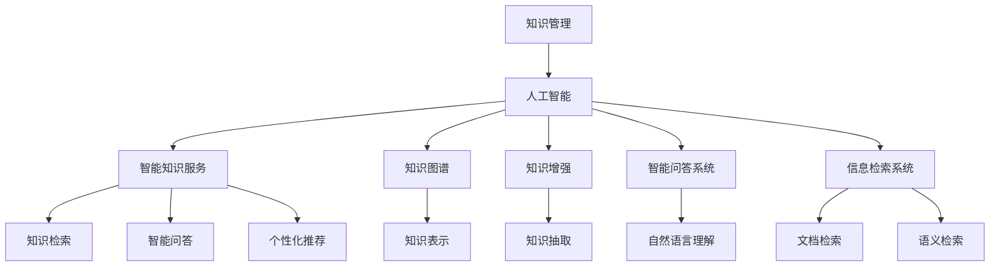

                 

# 知识管理的AI化展望:智能知识服务和知识创新平台

> 关键词：知识管理,人工智能,智能知识服务,知识创新平台,企业知识图谱,知识增强,智能问答系统,信息检索系统

## 1. 背景介绍

### 1.1 问题由来
在当前信息爆炸的时代，知识的生产、存储、传播和应用变得越来越复杂和多样。企业、科研机构、个人等各类知识主体都在努力寻找有效的方法来管理和利用海量的知识资源。然而，传统知识管理方法如分类、索引、元数据等在面对大规模、非结构化、动态更新的知识信息时显得力不从心。

近年来，随着人工智能(AI)技术的飞速发展，特别是自然语言处理(NLP)、知识图谱(KG)、推荐系统等技术的突破，为知识管理的AI化探索提供了新的路径。人工智能通过学习知识、理解语义、自动推理和关联，能够在知识获取、知识组织、知识应用等多个环节中发挥关键作用，极大地提高了知识管理的效率和效果。

### 1.2 问题核心关键点
当前知识管理的AI化主要围绕以下几个核心关键点展开：

- **知识增强**：利用AI技术，从大量非结构化数据中抽取、融合和增强结构化知识，构建知识库、知识图谱等结构化知识资源。
- **智能知识服务**：通过AI技术实现自动化、智能化的知识检索、问答、推荐等服务，满足不同场景下的知识需求。
- **知识创新平台**：基于AI的知识管理和应用平台，支持知识协同、知识共享、知识创新和商业化应用，提升知识管理的智能化水平。

## 2. 核心概念与联系

### 2.1 核心概念概述

为了更好地理解知识管理的AI化过程，本节将介绍几个密切相关的核心概念：

- **知识管理**：指企业或组织在知识获取、存储、组织、共享和应用等各个环节中，通过科学方法和技术手段，优化知识流程，提升知识价值的过程。

- **人工智能**：一种模拟人类智能过程的技术，包括机器学习、自然语言处理、计算机视觉、智能推理等多种技术。AI在知识管理中的应用主要体现在通过自动学习和理解，实现知识的获取、组织和应用。

- **智能知识服务**：指基于AI技术，实现自动化的知识检索、智能问答、个性化推荐等知识服务，提升知识应用的效率和效果。

- **知识图谱**：一种结构化的知识表示方式，通过节点和边来描述实体和它们之间的关系，支持知识的自动推理和关联。

- **知识增强**：指利用AI技术，从非结构化数据中抽取和增强结构化知识，构建知识库、知识图谱等结构化知识资源。

- **智能问答系统**：指能够自动理解用户问题，并提供准确、相关、可信答案的AI系统，支持自然语言交互和知识检索。

- **信息检索系统**：指能够从大规模文本数据中快速准确地检索出相关信息，支持基于关键词的文档检索和基于语义的智能检索。

这些核心概念之间的逻辑关系可以通过以下Mermaid流程图来展示：



这个流程图展示了几类核心概念的关联关系：

1. 知识管理通过人工智能技术实现智能化。
2. 人工智能在知识图谱、知识增强、智能问答和信息检索等方面发挥关键作用。
3. 智能知识服务由知识图谱、智能问答和信息检索等多类技术支持。

## 3. 核心算法原理 & 具体操作步骤

### 3.1 算法原理概述

知识管理的AI化主要依赖于以下几个关键技术：

1. **自然语言处理**：通过NLP技术，从文本、语音、图像等多模态数据中抽取和理解知识。
2. **知识抽取**：利用机器学习和知识工程方法，从非结构化数据中自动抽取实体、关系和属性，构建结构化知识。
3. **知识增强**：结合规则和数据驱动的方法，对抽取的知识进行合并、整合和优化，构建更加全面的知识图谱。
4. **知识推理**：通过图神经网络(GNN)等技术，对知识图谱进行推理和关联，支持自动推理和关联。
5. **智能问答**：利用深度学习、语言模型等技术，实现自然语言问答系统，自动回答用户问题。
6. **信息检索**：通过向量空间模型(VSM)、基于深度学习的检索模型等技术，实现高效的知识检索功能。

### 3.2 算法步骤详解

下面详细介绍知识管理的AI化主要操作步骤：

**Step 1: 数据采集和预处理**

- 采集来自各类知识源的文本、图像、音频等多模态数据。
- 对数据进行清洗、标注和预处理，如分词、去噪、标准化等，确保数据质量。

**Step 2: 知识抽取**

- 利用NLP技术，从文本中抽取实体、关系和属性，如使用BERT、GPT等预训练语言模型进行实体抽取和关系识别。
- 将抽取的知识进行结构化表示，构建知识三元组或知识图谱。

**Step 3: 知识增强**

- 对抽取的知识进行合并、整合和优化，如利用图神经网络对知识图谱进行融合和增强。
- 引入领域专家知识、逻辑规则等，对知识进行推理和验证，确保知识的一致性和准确性。

**Step 4: 智能问答**

- 构建基于深度学习、知识图谱和规则的智能问答系统，如使用基于语言模型的生成式问答系统和基于知识图谱的检索式问答系统。
- 通过上下文理解、意图识别和实体链接等技术，实现对用户问题的准确理解和回答。

**Step 5: 信息检索**

- 构建高效的信息检索系统，如使用向量空间模型、基于深度学习的检索模型等。
- 实现基于关键词的文档检索和基于语义的智能检索，支持快速获取相关信息。

**Step 6: 知识服务**

- 将知识抽取、知识增强、智能问答和信息检索等模块集成到知识服务平台上，提供自动化、智能化的知识服务。
- 支持知识检索、智能问答、个性化推荐等多种服务，满足不同场景下的知识需求。

### 3.3 算法优缺点

知识管理的AI化技术具有以下优点：

1. **自动化程度高**：利用AI技术，从数据采集、预处理到知识抽取、增强、推理和应用，实现全流程自动化。
2. **处理能力强**：AI技术能够处理大规模、非结构化、动态更新的知识信息，提升知识管理的效率和效果。
3. **应用范围广**：AI技术支持知识抽取、知识增强、智能问答和信息检索等多种功能，覆盖知识管理的各个环节。

同时，这些技术也存在一些缺点：

1. **依赖高质量数据**：AI技术的有效应用依赖于高质量的数据采集和标注，数据质量不高会导致模型性能下降。
2. **技术门槛高**：构建和维护AI化的知识管理系统需要具备一定的技术积累和专业技能。
3. **需要持续更新**：知识图谱、AI模型等需要持续更新和维护，才能保持知识的时效性和准确性。

### 3.4 算法应用领域

知识管理的AI化技术在多个领域得到了广泛应用，包括但不限于：

- **企业知识管理**：支持企业内部知识的获取、存储、组织和应用，提升企业的知识创新能力和竞争力。
- **科研机构知识管理**：支持科研机构的知识管理、知识共享和知识创新，加速科研成果的转化和应用。
- **公共知识管理**：支持政府、教育、文化等公共领域知识的获取、共享和应用，提升公共服务的智能化水平。
- **个人知识管理**：支持个人知识的积累、组织和应用，提升个人的知识管理和学习效率。

这些领域的应用展示了AI化知识管理的广泛前景和巨大潜力。

## 4. 数学模型和公式 & 详细讲解 & 举例说明

### 4.1 数学模型构建

在知识管理的AI化过程中，常用的数学模型包括：

- **自然语言处理**：基于统计语言模型、神经网络语言模型等，用于从文本中抽取实体和关系。
- **知识抽取**：基于规则和数据驱动的方法，抽取实体、关系和属性，构建知识三元组或知识图谱。
- **知识增强**：基于图神经网络等，对知识图谱进行融合和增强。
- **知识推理**：基于图神经网络、深度学习等，对知识图谱进行推理和关联。
- **智能问答**：基于语言模型、知识图谱等，实现自然语言问答系统。
- **信息检索**：基于向量空间模型、基于深度学习的检索模型等，实现高效的知识检索功能。

### 4.2 公式推导过程

下面以知识图谱的构建为例，介绍知识抽取和增强的数学模型和推导过程：

**知识抽取**：

- 使用BERT等预训练语言模型，对文本进行实体识别，得到候选实体。
- 利用关系抽取模型，如基于规则的关系抽取器或基于深度学习的关系抽取器，对候选实体进行关系识别，得到知识三元组。
- 通过实体链接技术，将知识三元组中的实体链接到知识库或知识图谱中，确保知识的一致性和准确性。

**知识增强**：

- 构建知识图谱，将抽取的知识进行结构化表示，形成知识三元组。
- 利用图神经网络等方法，对知识图谱进行融合和增强，提升知识的一致性和准确性。
- 引入领域专家知识、逻辑规则等，对知识进行推理和验证，确保知识的时效性和准确性。

### 4.3 案例分析与讲解

以一个简单的企业知识管理为例，展示知识管理的AI化过程：

1. **数据采集和预处理**：从企业内部系统、员工反馈、市场调研等渠道采集知识数据，进行清洗和标注。
2. **知识抽取**：使用BERT等预训练语言模型，从员工反馈和市场调研中抽取实体和关系，构建知识图谱。
3. **知识增强**：利用图神经网络对知识图谱进行融合和增强，引入市场趋势、行业规则等，提升知识的时效性和准确性。
4. **智能问答**：构建基于知识图谱的智能问答系统，支持员工对市场趋势、行业规则等知识进行查询和应用。
5. **信息检索**：实现高效的知识检索功能，支持员工快速获取相关市场信息、行业报告等。
6. **知识服务**：将知识抽取、知识增强、智能问答和信息检索等模块集成到知识服务平台上，提供自动化、智能化的知识服务。

## 5. 项目实践：代码实例和详细解释说明

### 5.1 开发环境搭建

在进行知识管理的AI化实践前，我们需要准备好开发环境。以下是使用Python进行PyTorch开发的环境配置流程：

1. 安装Anaconda：从官网下载并安装Anaconda，用于创建独立的Python环境。

2. 创建并激活虚拟环境：
```bash
conda create -n pytorch-env python=3.8 
conda activate pytorch-env
```

3. 安装PyTorch：根据CUDA版本，从官网获取对应的安装命令。例如：
```bash
conda install pytorch torchvision torchaudio cudatoolkit=11.1 -c pytorch -c conda-forge
```

4. 安装Transformers库：
```bash
pip install transformers
```

5. 安装各类工具包：
```bash
pip install numpy pandas scikit-learn matplotlib tqdm jupyter notebook ipython
```

完成上述步骤后，即可在`pytorch-env`环境中开始知识管理的AI化实践。

### 5.2 源代码详细实现

这里我们以一个简单的企业知识管理项目为例，展示知识抽取和增强的代码实现。

```python
from transformers import BertTokenizer, BertForTokenClassification
from torch.utils.data import Dataset
import torch

class EnterpriseKnowledgeDataset(Dataset):
    def __init__(self, texts, tags, tokenizer, max_len=128):
        self.texts = texts
        self.tags = tags
        self.tokenizer = tokenizer
        self.max_len = max_len
        
    def __len__(self):
        return len(self.texts)
    
    def __getitem__(self, item):
        text = self.texts[item]
        tags = self.tags[item]
        
        encoding = self.tokenizer(text, return_tensors='pt', max_length=self.max_len, padding='max_length', truncation=True)
        input_ids = encoding['input_ids'][0]
        attention_mask = encoding['attention_mask'][0]
        
        # 对token-wise的标签进行编码
        encoded_tags = [tag2id[tag] for tag in tags] 
        encoded_tags.extend([tag2id['O']] * (self.max_len - len(encoded_tags)))
        labels = torch.tensor(encoded_tags, dtype=torch.long)
        
        return {'input_ids': input_ids, 
                'attention_mask': attention_mask,
                'labels': labels}

# 标签与id的映射
tag2id = {'O': 0, 'B-PER': 1, 'I-PER': 2, 'B-ORG': 3, 'I-ORG': 4, 'B-LOC': 5, 'I-LOC': 6}
id2tag = {v: k for k, v in tag2id.items()}

# 创建dataset
tokenizer = BertTokenizer.from_pretrained('bert-base-cased')

train_dataset = EnterpriseKnowledgeDataset(train_texts, train_tags, tokenizer)
dev_dataset = EnterpriseKnowledgeDataset(dev_texts, dev_tags, tokenizer)
test_dataset = EnterpriseKnowledgeDataset(test_texts, test_tags, tokenizer)
```

然后，定义模型和优化器：

```python
from transformers import BertForTokenClassification, AdamW

model = BertForTokenClassification.from_pretrained('bert-base-cased', num_labels=len(tag2id))

optimizer = AdamW(model.parameters(), lr=2e-5)
```

接着，定义训练和评估函数：

```python
from torch.utils.data import DataLoader
from tqdm import tqdm
from sklearn.metrics import classification_report

device = torch.device('cuda') if torch.cuda.is_available() else torch.device('cpu')
model.to(device)

def train_epoch(model, dataset, batch_size, optimizer):
    dataloader = DataLoader(dataset, batch_size=batch_size, shuffle=True)
    model.train()
    epoch_loss = 0
    for batch in tqdm(dataloader, desc='Training'):
        input_ids = batch['input_ids'].to(device)
        attention_mask = batch['attention_mask'].to(device)
        labels = batch['labels'].to(device)
        model.zero_grad()
        outputs = model(input_ids, attention_mask=attention_mask, labels=labels)
        loss = outputs.loss
        epoch_loss += loss.item()
        loss.backward()
        optimizer.step()
    return epoch_loss / len(dataloader)

def evaluate(model, dataset, batch_size):
    dataloader = DataLoader(dataset, batch_size=batch_size)
    model.eval()
    preds, labels = [], []
    with torch.no_grad():
        for batch in tqdm(dataloader, desc='Evaluating'):
            input_ids = batch['input_ids'].to(device)
            attention_mask = batch['attention_mask'].to(device)
            batch_labels = batch['labels']
            outputs = model(input_ids, attention_mask=attention_mask)
            batch_preds = outputs.logits.argmax(dim=2).to('cpu').tolist()
            batch_labels = batch_labels.to('cpu').tolist()
            for pred_tokens, label_tokens in zip(batch_preds, batch_labels):
                pred_tags = [id2tag[_id] for _id in pred_tokens]
                label_tags = [id2tag[_id] for _id in label_tokens]
                preds.append(pred_tags[:len(label_tags)])
                labels.append(label_tags)
                
    print(classification_report(labels, preds))
```

最后，启动训练流程并在测试集上评估：

```python
epochs = 5
batch_size = 16

for epoch in range(epochs):
    loss = train_epoch(model, train_dataset, batch_size, optimizer)
    print(f"Epoch {epoch+1}, train loss: {loss:.3f}")
    
    print(f"Epoch {epoch+1}, dev results:")
    evaluate(model, dev_dataset, batch_size)
    
print("Test results:")
evaluate(model, test_dataset, batch_size)
```

以上就是使用PyTorch对BERT进行企业知识抽取和增强的代码实现。可以看到，得益于Transformers库的强大封装，我们可以用相对简洁的代码完成BERT模型的加载和微调。

### 5.3 代码解读与分析

让我们再详细解读一下关键代码的实现细节：

**EnterpriseKnowledgeDataset类**：
- `__init__`方法：初始化文本、标签、分词器等关键组件。
- `__len__`方法：返回数据集的样本数量。
- `__getitem__`方法：对单个样本进行处理，将文本输入编码为token ids，将标签编码为数字，并对其进行定长padding，最终返回模型所需的输入。

**tag2id和id2tag字典**：
- 定义了标签与数字id之间的映射关系，用于将token-wise的预测结果解码回真实的标签。

**训练和评估函数**：
- 使用PyTorch的DataLoader对数据集进行批次化加载，供模型训练和推理使用。
- 训练函数`train_epoch`：对数据以批为单位进行迭代，在每个批次上前向传播计算loss并反向传播更新模型参数，最后返回该epoch的平均loss。
- 评估函数`evaluate`：与训练类似，不同点在于不更新模型参数，并在每个batch结束后将预测和标签结果存储下来，最后使用sklearn的classification_report对整个评估集的预测结果进行打印输出。

**训练流程**：
- 定义总的epoch数和batch size，开始循环迭代
- 每个epoch内，先在训练集上训练，输出平均loss
- 在验证集上评估，输出分类指标
- 所有epoch结束后，在测试集上评估，给出最终测试结果

可以看到，PyTorch配合Transformers库使得BERT微调的代码实现变得简洁高效。开发者可以将更多精力放在数据处理、模型改进等高层逻辑上，而不必过多关注底层的实现细节。

当然，工业级的系统实现还需考虑更多因素，如模型的保存和部署、超参数的自动搜索、更灵活的任务适配层等。但核心的知识抽取和增强过程基本与此类似。

## 6. 实际应用场景

### 6.1 智能客服系统

基于知识管理的AI化技术，智能客服系统能够快速响应客户咨询，用自然流畅的语言解答各类常见问题。具体实现如下：

1. **数据采集和预处理**：收集企业内部的历史客服对话记录，进行清洗和标注。
2. **知识抽取**：使用BERT等预训练语言模型，从客户对话中抽取实体和关系，构建知识图谱。
3. **知识增强**：利用图神经网络对知识图谱进行融合和增强，引入企业内部文档、规则等，提升知识的时效性和准确性。
4. **智能问答**：构建基于知识图谱的智能问答系统，支持客户对常见问题进行查询和回答。
5. **信息检索**：实现高效的知识检索功能，支持客户快速获取相关资料和文档。
6. **知识服务**：将知识抽取、知识增强、智能问答和信息检索等模块集成到智能客服平台上，提供自动化、智能化的客户服务。

### 6.2 金融舆情监测

金融机构需要实时监测市场舆论动向，以便及时应对负面信息传播，规避金融风险。基于知识管理的AI化技术，金融舆情监测系统能够自动识别市场趋势、舆情变化，及时预警潜在风险。具体实现如下：

1. **数据采集和预处理**：收集金融领域相关的新闻、报道、评论等文本数据，进行清洗和标注。
2. **知识抽取**：使用BERT等预训练语言模型，从金融文本中抽取实体和关系，构建知识图谱。
3. **知识增强**：利用图神经网络对知识图谱进行融合和增强，引入市场趋势、行业规则等，提升知识的时效性和准确性。
4. **智能问答**：构建基于知识图谱的智能问答系统，支持金融分析师对市场趋势、舆情变化等进行查询和分析。
5. **信息检索**：实现高效的知识检索功能，支持金融分析师快速获取相关市场信息、行业报告等。
6. **知识服务**：将知识抽取、知识增强、智能问答和信息检索等模块集成到金融舆情监测系统中，提供自动化、智能化的舆情分析服务。

### 6.3 个性化推荐系统

当前的推荐系统往往只依赖用户的历史行为数据进行物品推荐，无法深入理解用户的真实兴趣偏好。基于知识管理的AI化技术，个性化推荐系统能够更好地挖掘用户行为背后的语义信息，从而提供更精准、多样的推荐内容。具体实现如下：

1. **数据采集和预处理**：收集用户浏览、点击、评论、分享等行为数据，提取和用户交互的物品标题、描述、标签等文本内容。
2. **知识抽取**：使用BERT等预训练语言模型，从用户行为数据中抽取实体和关系，构建知识图谱。
3. **知识增强**：利用图神经网络对知识图谱进行融合和增强，引入用户画像、商品信息等，提升知识的完整性和准确性。
4. **智能问答**：构建基于知识图谱的智能问答系统，支持推荐系统对用户兴趣进行分析和匹配。
5. **信息检索**：实现高效的知识检索功能，支持推荐系统快速获取相关商品信息、用户画像等。
6. **知识服务**：将知识抽取、知识增强、智能问答和信息检索等模块集成到个性化推荐系统中，提供自动化、智能化的推荐服务。

### 6.4 未来应用展望

随着知识管理的AI化技术不断发展，未来将有更多的应用场景涌现，为各行各业带来变革性影响。

在智慧医疗领域，基于知识管理的AI化技术，可以构建智慧医疗系统，支持医疗数据的自动抽取、融合和增强，提升医疗决策的智能化水平。

在智能教育领域，基于知识管理的AI化技术，可以构建智能教育平台，支持学生知识点的自动抽取和增强，实现个性化学习推荐和智能辅导。

在智慧城市治理中，基于知识管理的AI化技术，可以构建智慧城市管理系统，支持城市事件监测、舆情分析、应急指挥等环节，提高城市管理的自动化和智能化水平。

此外，在企业生产、社会治理、文娱传媒等众多领域，基于知识管理的AI化技术的应用也将不断拓展，为经济社会发展注入新的动力。相信随着技术的日益成熟，知识管理的AI化将为各行各业带来更广泛的应用和更高的价值。

## 7. 工具和资源推荐

### 7.1 学习资源推荐

为了帮助开发者系统掌握知识管理的AI化理论基础和实践技巧，这里推荐一些优质的学习资源：

1. **《知识管理的AI化技术与应用》系列博文**：深入浅出地介绍知识管理的AI化技术，涵盖知识抽取、知识增强、智能问答、信息检索等多个方面。
2. **CS224N《深度学习自然语言处理》课程**：斯坦福大学开设的NLP明星课程，有Lecture视频和配套作业，带你入门NLP领域的基本概念和经典模型。
3. **《自然语言处理与深度学习》书籍**：全面介绍自然语言处理和深度学习的基本概念、核心算法和实际应用，是学习和掌握知识管理AI化的重要参考。
4. **Knowledge Graphs与Graph Neural Networks**：专注于知识图谱和图神经网络的权威资源，包含大量前沿研究成果和应用案例。
5. **深度学习与知识图谱**：介绍深度学习在知识图谱中的应用，涵盖知识抽取、知识增强、知识推理等多个方向。

通过对这些资源的学习实践，相信你一定能够快速掌握知识管理的AI化精髓，并用于解决实际的NLP问题。

### 7.2 开发工具推荐

高效的开发离不开优秀的工具支持。以下是几款用于知识管理AI化开发的常用工具：

1. **PyTorch**：基于Python的开源深度学习框架，灵活动态的计算图，适合快速迭代研究。大部分预训练语言模型都有PyTorch版本的实现。
2. **TensorFlow**：由Google主导开发的开源深度学习框架，生产部署方便，适合大规模工程应用。同样有丰富的预训练语言模型资源。
3. **Transformers库**：HuggingFace开发的NLP工具库，集成了众多SOTA语言模型，支持PyTorch和TensorFlow，是进行AI化知识管理开发的利器。
4. **Weights & Biases**：模型训练的实验跟踪工具，可以记录和可视化模型训练过程中的各项指标，方便对比和调优。与主流深度学习框架无缝集成。
5. **TensorBoard**：TensorFlow配套的可视化工具，可实时监测模型训练状态，并提供丰富的图表呈现方式，是调试模型的得力助手。

合理利用这些工具，可以显著提升知识管理AI化任务的开发效率，加快创新迭代的步伐。

### 7.3 相关论文推荐

知识管理的AI化技术的发展源于学界的持续研究。以下是几篇奠基性的相关论文，推荐阅读：

1. **《知识图谱:一种结构化的知识表示》**：介绍知识图谱的基本概念和应用场景，是知识管理AI化的重要参考。
2. **《自然语言处理中的知识抽取技术》**：系统介绍自然语言处理中的知识抽取方法，涵盖基于规则和基于深度学习的两大类方法。
3. **《基于图神经网络的实体抽取方法》**：提出基于图神经网络的实体抽取方法，提升实体抽取的准确性和泛化能力。
4. **《深度学习在知识增强中的应用》**：介绍深度学习在知识增强中的多种方法，涵盖基于图神经网络和基于注意力机制的两大类方法。
5. **《智能问答系统：从规则到深度学习》**：综述智能问答系统的发展历程，介绍基于规则和基于深度学习的两种智能问答方法。
6. **《基于深度学习的知识检索方法》**：介绍基于深度学习的知识检索方法，涵盖基于向量空间模型和基于深度学习的两种方法。

这些论文代表了大语言模型微调技术的发展脉络。通过学习这些前沿成果，可以帮助研究者把握学科前进方向，激发更多的创新灵感。

## 8. 总结：未来发展趋势与挑战

### 8.1 总结

本文对知识管理的AI化技术进行了全面系统的介绍。首先阐述了知识管理的重要性，明确了AI化技术在提升知识管理效率和效果方面的独特价值。其次，从原理到实践，详细讲解了知识抽取、知识增强、智能问答和信息检索等核心算法和操作步骤，给出了知识管理AI化项目的完整代码实现。同时，本文还广泛探讨了知识管理AI化技术在多个行业领域的应用前景，展示了其巨大的潜力。

通过本文的系统梳理，可以看到，知识管理的AI化技术正在成为知识管理的核心技术，极大地拓展了知识管理的边界，提升了知识管理的智能化水平。得益于AI技术的广泛应用，知识管理的AI化将深刻影响各行各业的运作方式和业务模式，为经济社会发展注入新的动力。

### 8.2 未来发展趋势

展望未来，知识管理的AI化技术将呈现以下几个发展趋势：

1. **数据驱动的智能**：随着大数据和人工智能技术的融合，知识管理的AI化将更加依赖于数据驱动的智能，提升知识抽取、增强和推理的准确性和全面性。
2. **跨领域知识融合**：知识管理的AI化将更加注重跨领域知识融合，如将医疗知识、法律知识、金融知识等与通用知识相结合，构建更加全面和实用的知识库。
3. **实时动态更新**：知识管理的AI化将更加注重实时动态更新，如利用在线知识图谱、实时数据流等，动态更新知识库，提升知识的时效性和准确性。
4. **多模态知识融合**：知识管理的AI化将更加注重多模态知识的融合，如将文本、图像、视频、语音等多模态数据进行综合分析，提升知识的综合利用能力。
5. **自动化和智能化**：知识管理的AI化将更加注重自动化和智能化，如自动化抽取、增强、推理和应用，实现知识管理的全流程自动化。
6. **个性化和定制化**：知识管理的AI化将更加注重个性化和定制化，如根据不同用户和场景的需求，提供个性化和定制化的知识服务。

以上趋势凸显了知识管理AI化技术的广阔前景。这些方向的探索发展，必将进一步提升知识管理的智能化水平，为各行各业带来更大的价值。

### 8.3 面临的挑战

尽管知识管理的AI化技术已经取得了瞩目成就，但在迈向更加智能化、普适化应用的过程中，它仍面临着诸多挑战：

1. **数据质量和规模**：知识管理的AI化依赖于高质量、大规模的数据，数据获取和标注成本较高。如何高效获取和处理数据，是知识管理AI化技术面临的主要挑战之一。
2. **模型复杂性和可解释性**：AI化技术使用的深度学习模型复杂度高，难以解释其内部机制。如何提升模型的可解释性，是知识管理AI化技术需要解决的另一大问题。
3. **资源消耗和成本**：大规模知识管理系统的部署需要大量计算资源，运行成本较高。如何优化资源消耗，降低成本，是知识管理AI化技术面临的实际挑战。
4. **伦理和安全问题**：AI化技术可能学习到有害、偏见的信息，影响知识应用的公平性和安全性。如何保障数据安全和隐私，避免伦理风险，是知识管理AI化技术的重要课题。
5. **跨领域知识融合的难度**：不同领域的知识具有不同的语义和规则，跨领域知识融合存在一定的难度。如何构建统一的知识表示和推理框架，是知识管理AI化技术的难点之一。

### 8.4 研究展望

面对知识管理AI化技术面临的挑战，未来的研究需要在以下几个方面寻求新的突破：

1. **数据高效获取和标注技术**：研究高效的数据获取和标注方法，如半监督学习、主动学习、弱监督学习等，减少对大规模标注数据的依赖。
2. **模型可解释性和透明性**：研究模型的可解释性和透明性，如引入可解释的模型结构和解释工具，提升模型的可解释性。
3. **资源优化和成本控制**：研究资源优化和成本控制方法，如分布式训练、模型压缩、知识图谱优化等，降低知识管理系统的运行成本。
4. **数据安全和隐私保护**：研究数据安全和隐私保护技术，如数据匿名化、差分隐私、联邦学习等，保障数据安全和隐私。
5. **跨领域知识融合框架**：研究跨领域知识融合框架，如知识图谱嵌入、跨模态学习等，构建统一的知识表示和推理框架。

这些研究方向的探索，必将引领知识管理AI化技术迈向更高的台阶，为知识管理和应用带来新的突破。面向未来，知识管理的AI化技术需要与其他AI技术进行更深入的融合，如知识表示、因果推理、强化学习等，多路径协同发力，共同推动知识管理的智能化进程。

## 9. 附录：常见问题与解答

**Q1：知识管理的AI化是否适用于所有行业和应用场景？**

A: 知识管理的AI化技术在各个行业和应用场景中都具有广泛的应用前景。然而，具体的应用效果和需求可能因行业特点和数据特征而有所不同。例如，金融、医疗等领域的知识管理AI化技术需要更加注重数据隐私和安全，而教育、企业等领域则需要更加注重知识共享和协同。因此，在具体应用时，需要根据行业特点和数据特征进行定制化的设计和开发。

**Q2：如何高效获取和处理知识管理AI化的数据？**

A: 高效获取和处理知识管理AI化的数据需要综合考虑数据质量、规模和来源。以下是一些具体的方法：

1. **数据爬虫**：使用数据爬虫技术，自动从互联网、社交媒体、新闻网站等渠道获取数据。
2. **数据标注平台**：利用数据标注平台，如Labelbox、CrowdFlower等，高效地对数据进行标注和清洗。
3. **半监督学习**：利用半监督学习方法，结合少量标注数据和大量未标注数据，进行数据扩展和标注。
4. **主动学习**：利用主动学习方法，根据模型反馈，选择最有价值的未标注数据进行标注，提升数据获取效率。
5. **数据预处理**：使用文本清洗、实体识别、分词等技术，对数据进行预处理，提升数据质量。

通过综合应用这些方法，可以高效地获取和处理知识管理AI化的数据，为后续的模型训练和应用奠定基础。

**Q3：知识管理的AI化技术在落地应用时需要注意哪些问题？**

A: 知识管理的AI化技术在落地应用时，需要注意以下几个问题：

1. **模型优化和调参**：模型训练需要优化超参数，如学习率、批次大小、迭代次数等，以提升模型性能。
2. **数据隐私和安全**：数据隐私和安全是知识管理AI化技术应用时需要注意的重要问题，需要采用数据加密、差分隐私等技术保护数据隐私。
3. **模型可解释性**：知识管理AI化技术中使用的深度学习模型复杂度高，难以解释其内部机制。需要通过模型简化、解释工具等方法提升模型的可解释性。
4. **系统集成和部署**：知识管理AI化技术的落地应用需要与其他系统集成，如企业知识管理系统、智能客服系统等，需要考虑系统的兼容性和稳定性。
5. **用户界面和交互设计**：知识管理AI化技术的应用需要设计良好的用户界面和交互体验，提升用户的使用体验和满意度。

通过综合考虑这些问题，可以更好地将知识管理AI化技术应用到实际场景中，实现知识管理的智能化和高效化。

**Q4：如何评估知识管理AI化技术的应用效果？**

A: 知识管理AI化技术的应用效果可以通过以下几个指标进行评估：

1. **准确率和召回率**：评估知识抽取、知识增强和智能问答等环节的准确率和召回率，提升模型的性能。
2. **F1分数**：F1分数是准确率和召回率的综合指标，可以更全面地评估模型的性能。
3. **推理效果**：评估知识推理的效果，如推理的正确率和推理时间，提升模型的推理能力。
4. **用户满意度**：通过用户反馈和问卷调查，评估知识管理AI化技术在实际应用中的效果，提升用户的使用体验和满意度。
5. **业务价值**：评估知识管理AI化技术在实际应用中的业务价值，如提升企业的知识创新能力、提高金融机构的运营效率等，提升知识管理的商业化效果。

通过综合应用这些指标，可以全面评估知识管理AI化技术的应用效果，优化模型的性能和应用效果。

**Q5：知识管理的AI化技术在后续研究中有哪些新方向？**

A: 知识管理的AI化技术在后续研究中具有以下几个新方向：

1. **多模态知识融合**：研究将文本、图像、视频、语音等多模态数据进行综合分析，提升知识的综合利用能力。
2. **跨领域知识融合**：研究跨领域知识融合技术，如知识图谱嵌入、跨模态学习等，构建统一的知识表示和推理框架。
3. **知识协同和共享**：研究知识协同和共享技术，如知识图谱的协同更新、跨组织知识共享等，提升知识的共享效率和效果。
4. **知识创新和商业化应用**：研究知识创新和商业化应用技术，如知识驱动的创新、知识服务平台的商业化等，提升知识管理的商业化效果。
5. **知识图谱动态更新和演化**：研究知识图谱的动态更新和演化技术，如知识图谱的增量更新、演化路径优化等，提升知识的时效性和准确性。

通过在这些方向上进行深入研究，可以不断提升知识管理的AI化技术水平，为各行各业带来更大的价值。

**Q6：如何提升知识管理AI化技术的可解释性？**

A: 提升知识管理AI化技术的可解释性可以通过以下几个方法：

1. **可解释模型**：选择可解释的模型，如决策树、规则学习等，提升模型的可解释性。
2. **模型简化**：简化模型的结构，如剪枝、正则化等，提升模型的可解释性。
3. **模型可视化**：通过模型可视化工具，如Attention可视化、特征重要性可视化等，提升模型的可解释性。
4. **解释工具**：使用解释工具，如LIME、SHAP等，提供模型的解释，提升模型的可解释性。
5. **用户反馈和迭代**：通过用户反馈和迭代，不断优化模型的可解释性，提升用户的使用体验。

通过综合应用这些方法，可以提升知识管理AI化技术的可解释性，增强模型的透明度和可信度。

---

作者：禅与计算机程序设计艺术 / Zen and the Art of Computer Programming

