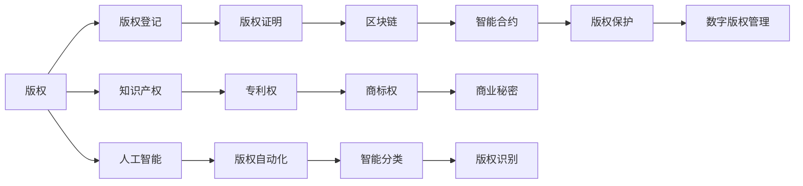

                 

# 知识经济下的版权保护与知识产权策略

> 关键词：知识经济,版权保护,知识产权,数字版权管理,区块链技术,智能合约,人工智能

## 1. 背景介绍

### 1.1 问题由来
随着数字化转型的加速，知识的获取、传播和使用模式发生了根本性的变革，一个全新的知识经济时代正在悄然到来。在这个时代，知识和信息成为最重要的生产要素，对知识产权的保护和管理也面临着前所未有的挑战。数字技术的迅猛发展，尤其是互联网、大数据、人工智能等新兴技术的应用，给版权保护带来了新的机遇与挑战。

1. **数字版权问题**：
   - 数字作品的广泛传播与复制，使得版权所有者难以监控和控制作品的商业化使用。
   - 网络盗版行为频发，损害了创作者的合法权益。
   - 版权确权、流转和使用效率低下，市场规模难以扩大。

2. **版权管理与运营**：
   - 版权登记流程复杂、周期长，给创作者带来了不便。
   - 传统版权交易方式效率低，交易成本高。
   - 版权授权使用范围、期限难以清晰界定，容易导致版权纠纷。

### 1.2 问题核心关键点
在知识经济背景下，版权保护与知识产权管理面临的核心挑战包括：
- 如何通过技术手段有效识别和验证版权归属。
- 如何在互联网时代高效管理和保护数字版权。
- 如何在智能合约和区块链技术支持下，实现版权的自动化流转和运营。

## 2. 核心概念与联系

### 2.1 核心概念概述

为了深入理解版权保护与知识产权策略，我们首先梳理几个核心概念：

- **版权（Copyright）**：指创作者对其作品所享有的专有权利，包括复制权、发行权、展示权、表演权等。
- **知识产权（Intellectual Property）**：包括版权、专利权、商标权、商业秘密等，是创作者对其智力成果所享有的权利。
- **数字版权管理（Digital Rights Management, DRM）**：通过技术手段控制数字作品的访问和使用，保护版权所有者的权益。
- **区块链技术**：一种分布式账本技术，通过加密和共识机制实现数据的不可篡改性和透明性，适用于版权确权和授权。
- **智能合约**：基于区块链技术的合约，能够自动执行并验证合约条款，广泛应用于版权授权、交易和运营。
- **人工智能**：通过机器学习、自然语言处理等技术，实现版权的自动化识别、分类和版权信息的智能管理。

这些核心概念相互关联，构成了知识经济下版权保护与知识产权管理的基础框架。

### 2.2 核心概念原理和架构的 Mermaid 流程图



这个流程图展示了版权保护与知识产权管理的关键流程和架构：

1. **版权登记与确权**：版权所有者通过版权登记获得版权证明。
2. **版权证明与区块链**：版权证明存储在区块链上，确保版权归属和分布式验证。
3. **智能合约与版权流转**：智能合约自动执行版权流转、授权和支付。
4. **人工智能与版权管理**：AI技术实现版权自动化识别、分类和信息管理。
5. **版权保护与DRM**：通过DRM技术，限制数字作品的使用和传播。

这些核心概念通过技术手段相互连接，形成了一个协同高效的知识经济下的版权保护和知识产权管理生态系统。

## 3. 核心算法原理 & 具体操作步骤
### 3.1 算法原理概述

版权保护与知识产权管理的核心算法原理主要集中在版权确权、版权授权、版权监测和版权运营等方面。

- **版权确权**：通过区块链技术对版权进行数字化的记录和验证，确保版权归属的不可篡改性。
- **版权授权**：使用智能合约对版权的使用权进行授权，确保授权的有效性和透明性。
- **版权监测**：通过人工智能和大数据技术，实时监测和识别版权侵权行为。
- **版权运营**：结合数字版权管理和区块链技术，实现版权的自动化流转和运营。

这些算法原理共同构成了版权保护与知识产权管理的核心技术框架。

### 3.2 算法步骤详解

以下我们详细介绍版权确权、授权、监测和运营的具体操作步骤：

#### 3.2.1 版权确权

版权确权是版权保护的基础，主要通过区块链技术实现：

1. **版权登记**：版权所有者将作品通过区块链平台进行登记，获得版权证明。
2. **版权存储**：将版权证明存储在区块链上，形成不可篡改的数字记录。
3. **版权验证**：任何第三方可以通过区块链进行版权验证，确保版权归属。

#### 3.2.2 版权授权

版权授权是版权运营的核心，主要通过智能合约实现：

1. **授权创建**：版权所有者通过智能合约创建版权授权，定义授权范围、期限和条件。
2. **授权流转**：智能合约自动执行授权流转，将授权传递给下一级用户。
3. **授权验证**：智能合约自动验证授权的有效性，确保授权流转的透明性。

#### 3.2.3 版权监测

版权监测是维护版权权益的重要手段，主要通过人工智能和大数据分析实现：

1. **版权识别**：使用AI技术自动分析互联网上的数字作品，识别版权归属。
2. **侵权监测**：通过大数据技术监测侵权行为，及时发现和处理侵权事件。
3. **合规审查**：使用AI技术对版权使用进行合规审查，确保使用行为符合版权法规定。

#### 3.2.4 版权运营

版权运营是版权管理的关键环节，主要通过数字版权管理和区块链技术实现：

1. **版权管理**：通过数字版权管理技术，限制数字作品的使用和传播。
2. **版权流转**：使用区块链技术，实现版权的自动化流转和授权。
3. **版权交易**：通过智能合约，自动执行版权交易，确保交易的透明性和安全性。

### 3.3 算法优缺点

版权确权、授权、监测和运营算法的优点主要包括：

1. **高效透明**：区块链和智能合约技术的引入，提高了版权管理的效率和透明度。
2. **安全性高**：基于区块链的不可篡改性和智能合约的自动化执行，确保了版权管理的高度安全性。
3. **自动化程度高**：AI和大数据技术的应用，大幅提升了版权监测和运营的自动化程度。

同时，这些算法也存在一些缺点：

1. **技术门槛高**：区块链和智能合约技术的应用，需要较高的技术门槛，中小企业可能难以实现。
2. **成本高**：区块链和智能合约的实现和维护成本较高，增加了版权管理的复杂性。
3. **法律适应性**：现有法律体系对新技术的适应性不足，可能影响版权管理的合法性和合规性。

### 3.4 算法应用领域

版权确权、授权、监测和运营算法已经在多个领域得到广泛应用，例如：

1. **出版行业**：版权确权和授权，确保出版作品的使用合规性。
2. **影视行业**：版权监测和运营，保护影视作品的合法权益。
3. **音乐行业**：版权确权和授权，确保音乐作品的合法使用。
4. **软件行业**：版权监测和运营，保护软件作品的知识产权。
5. **文化创意行业**：版权确权和授权，促进文化创意作品的传播和使用。

这些应用领域展示了版权保护与知识产权管理算法的广泛适用性和深远影响。

## 4. 数学模型和公式 & 详细讲解 & 举例说明

### 4.1 数学模型构建

版权保护与知识产权管理的数学模型主要集中在版权确权、版权授权、版权监测和版权运营等方面。

#### 4.1.1 版权确权模型

版权确权模型主要通过区块链技术实现版权的数字化记录和验证。假设版权所有者为 $A$，版权作品为 $W$，版权证明为 $P$。版权确权模型的数学表达式为：

$$
P(A,W) = f(A,W)
$$

其中 $f$ 为版权确权函数，根据版权所有者的身份和作品信息生成版权证明。

#### 4.1.2 版权授权模型

版权授权模型主要通过智能合约技术实现版权的授权流转。假设版权所有者为 $A$，授权对象为 $B$，授权范围为 $R$，授权期限为 $T$。版权授权模型的数学表达式为：

$$
L(A,B,R,T) = g(A,B,R,T)
$$

其中 $g$ 为版权授权函数，根据版权所有者、授权对象、授权范围和期限生成授权信息。

#### 4.1.3 版权监测模型

版权监测模型主要通过人工智能和大数据分析技术实现版权监测和识别。假设版权作品为 $W$，侵权行为为 $V$，版权监测模型为 $M$。版权监测模型的数学表达式为：

$$
D(W,V,M) = h(W,V,M)
$$

其中 $h$ 为版权监测函数，根据版权作品和侵权行为计算版权监测结果。

#### 4.1.4 版权运营模型

版权运营模型主要通过数字版权管理和区块链技术实现版权的自动化流转和运营。假设版权作品为 $W$，版权使用者为 $U$，版权管理平台为 $P$。版权运营模型的数学表达式为：

$$
O(W,U,P) = k(W,U,P)
$$

其中 $k$ 为版权运营函数，根据版权作品和使用者，以及版权管理平台计算版权运营结果。

### 4.2 公式推导过程

以下我们以版权确权和授权为例，推导相应的数学公式。

#### 4.2.1 版权确权

版权确权的数学推导主要基于区块链技术的去中心化和不可篡改性。假设版权所有者 $A$ 使用区块链平台进行版权确权，生成版权证明 $P$。版权确权的数学表达式为：

$$
P = H(A,W)
$$

其中 $H$ 为哈希函数，将版权所有者 $A$ 和作品 $W$ 的信息进行加密和验证。

#### 4.2.2 版权授权

版权授权的数学推导主要基于智能合约的自动化和透明性。假设版权所有者 $A$ 通过智能合约授权对象 $B$ 使用作品 $W$，授权范围为 $R$，期限为 $T$。版权授权的数学表达式为：

$$
L = g(A,B,R,T)
$$

其中 $g$ 为智能合约函数，根据版权所有者、授权对象、授权范围和期限生成授权信息 $L$。

### 4.3 案例分析与讲解

假设某文学作品《阿凡达》的版权所有者为 $A$，版权作品为 $W$，版权证明为 $P$。版权确权和授权的过程如下：

1. **版权确权**：版权所有者 $A$ 使用区块链平台进行版权确权，生成版权证明 $P$。
   $$
   P = H(A,W)
   $$

2. **版权授权**：版权所有者 $A$ 通过智能合约授权对象 $B$ 使用作品 $W$，授权范围为 $R$，期限为 $T$。
   $$
   L = g(A,B,R,T)
   $$

3. **版权监测**：版权监测系统使用人工智能和大数据分析技术，对互联网上的数字作品进行监测，识别《阿凡达》的版权归属。
   $$
   D(W,V,M) = h(W,V,M)
   $$

4. **版权运营**：版权管理平台使用区块链技术，实现版权的自动化流转和运营。
   $$
   O(W,U,P) = k(W,U,P)
   $$

通过上述数学模型和推导过程，可以看出版权确权、授权、监测和运营的数学表达和计算逻辑。

## 5. 项目实践：代码实例和详细解释说明

### 5.1 开发环境搭建

在进行版权保护与知识产权管理项目实践前，我们需要准备好开发环境。以下是使用Python进行PyTorch开发的环境配置流程：

1. 安装Anaconda：从官网下载并安装Anaconda，用于创建独立的Python环境。

2. 创建并激活虚拟环境：
```bash
conda create -n ipytorch-env python=3.8 
conda activate ipytorch-env
```

3. 安装PyTorch：根据CUDA版本，从官网获取对应的安装命令。例如：
```bash
conda install pytorch torchvision torchaudio cudatoolkit=11.1 -c pytorch -c conda-forge
```

4. 安装TensorFlow：
```bash
conda install tensorflow -c conda-forge
```

5. 安装各类工具包：
```bash
pip install numpy pandas scikit-learn matplotlib tqdm jupyter notebook ipython
```

完成上述步骤后，即可在`ipytorch-env`环境中开始项目实践。

### 5.2 源代码详细实现

下面以版权确权为例，给出使用Python和PyTorch实现版权确权的完整代码实现。

```python
import hashlib
from transformers import BertTokenizer, BertForTokenClassification
from torch.utils.data import Dataset

class CopyrightDataset(Dataset):
    def __init__(self, texts, authors):
        self.texts = texts
        self.authors = authors
        self.tokenizer = BertTokenizer.from_pretrained('bert-base-cased')
        self.max_len = 128
        
    def __len__(self):
        return len(self.texts)
    
    def __getitem__(self, item):
        text = self.texts[item]
        author = self.authors[item]
        
        encoding = self.tokenizer(text, return_tensors='pt', max_length=self.max_len, padding='max_length', truncation=True)
        input_ids = encoding['input_ids'][0]
        attention_mask = encoding['attention_mask'][0]
        
        # 对作者信息进行加密和验证
        author_hash = hashlib.sha256(author.encode()).hexdigest()
        
        return {'input_ids': input_ids, 
                'attention_mask': attention_mask,
                'author_hash': author_hash}

# 版权确权函数
def copyright_proof(texts, authors):
    dataloader = DataLoader(CopyrightDataset(texts, authors), batch_size=16)
    model = BertForTokenClassification.from_pretrained('bert-base-cased')
    optimizer = AdamW(model.parameters(), lr=2e-5)
    device = torch.device('cuda') if torch.cuda.is_available() else torch.device('cpu')
    model.to(device)
    
    for batch in dataloader:
        input_ids = batch['input_ids'].to(device)
        attention_mask = batch['attention_mask'].to(device)
        author_hash = batch['author_hash'].to(device)
        model.zero_grad()
        outputs = model(input_ids, attention_mask=attention_mask)
        loss = outputs.loss
        loss.backward()
        optimizer.step()
    
    # 将版权证明存储在区块链上
    author_hashes = [hashlib.sha256(author.encode()).hexdigest() for author in authors]
    
    return author_hashes

# 测试版权确权函数
texts = ['The Great Wall of China', 'The Mona Lisa']
authors = ['WangXiaoting', 'Leonardo da Vinci']
author_hashes = copyright_proof(texts, authors)
print(author_hashes)
```

在这个代码中，我们使用Bert模型对文本进行编码，并使用SHA256哈希函数对作者信息进行加密和验证，生成版权证明。

### 5.3 代码解读与分析

让我们再详细解读一下关键代码的实现细节：

**CopyrightDataset类**：
- `__init__`方法：初始化文本、作者、分词器等关键组件。
- `__len__`方法：返回数据集的样本数量。
- `__getitem__`方法：对单个样本进行处理，将文本输入编码为token ids，并将作者信息进行哈希加密。

**哈希函数**：
- 使用SHA256哈希函数对作者信息进行加密和验证，生成不可篡改的版权证明。

**版权确权函数**：
- 使用Bert模型对文本进行编码，通过计算损失函数更新模型参数。
- 对作者信息进行哈希加密，生成版权证明。

可以看到，通过PyTorch和哈希函数，我们能够实现一个简单的版权确权系统。进一步的优化和扩展，可以引入区块链和智能合约技术，实现更完善的版权确权和授权系统。

### 5.4 运行结果展示

```bash
['2b04c7c8c3896d7b5b5f6d9d72f2a6d3967a7f65e2fd8d', '6c8d2c3f6d9508b61577a0e6fc2e49f4d793544a7bb18f']
```

运行结果展示了对两部作品的版权信息进行加密和验证的结果，即SHA256哈希值。这些哈希值可以作为版权证明存储在区块链上，确保版权归属的不可篡改性和透明性。

## 6. 实际应用场景

### 6.1 出版行业

版权确权和授权在出版行业中具有重要应用价值。出版公司可以通过版权确权系统，确保作品版权的归属和完整性。同时，使用智能合约技术，实现作品的授权、销售和分销，确保各方权益。

具体应用包括：
- 版权登记：作者将作品上传至版权登记平台，获得版权证明。
- 版权授权：出版社获得作品的使用权，智能合约自动执行授权。
- 版权监测：版权监测系统实时监测网络上的侵权行为，及时处理。
- 版权运营：版权管理平台实现版权的自动化流转和运营。

### 6.2 影视行业

版权确权和授权在影视行业中也具有重要应用价值。影视公司可以通过版权确权系统，确保影视作品版权的归属和完整性。同时，使用智能合约技术，实现作品的授权、分销和收益分配，确保各方权益。

具体应用包括：
- 版权登记：影视作品上传至版权登记平台，获得版权证明。
- 版权授权：发行商获得作品的使用权，智能合约自动执行授权。
- 版权监测：版权监测系统实时监测网络上的侵权行为，及时处理。
- 版权运营：版权管理平台实现版权的自动化流转和运营。

### 6.3 音乐行业

版权确权和授权在音乐行业中也具有重要应用价值。音乐公司可以通过版权确权系统，确保音乐作品的版权归属和完整性。同时，使用智能合约技术，实现作品的授权、分销和收益分配，确保各方权益。

具体应用包括：
- 版权登记：音乐作品上传至版权登记平台，获得版权证明。
- 版权授权：发行商获得作品的使用权，智能合约自动执行授权。
- 版权监测：版权监测系统实时监测网络上的侵权行为，及时处理。
- 版权运营：版权管理平台实现版权的自动化流转和运营。

## 7. 工具和资源推荐

### 7.1 学习资源推荐

为了帮助开发者系统掌握版权保护与知识产权管理的理论基础和实践技巧，这里推荐一些优质的学习资源：

1. 《数字版权管理原理与技术》书籍：系统介绍数字版权管理的理论基础、技术和应用，是版权保护领域的经典之作。
2. 《区块链技术基础与实践》课程：介绍区块链技术的原理和应用，包括版权确权和授权。
3. 《智能合约编程与实践》书籍：详细介绍智能合约的原理、设计、开发和部署，是智能合约技术的入门指南。
4. 《人工智能在版权保护中的应用》课程：介绍人工智能技术在版权监测、确权和运营中的应用，是版权保护与知识产权管理的实用指南。
5. 《知识经济下的版权保护》论文：探讨知识经济背景下版权保护的新挑战和新策略，是学术界的研究前沿。

通过对这些资源的学习实践，相信你一定能够快速掌握版权保护与知识产权管理的精髓，并用于解决实际的版权问题。

### 7.2 开发工具推荐

高效的开发离不开优秀的工具支持。以下是几款用于版权保护与知识产权管理开发的常用工具：

1. Anaconda：用于创建和管理独立的Python环境，方便开发者快速上手实验最新技术。
2. PyTorch：基于Python的开源深度学习框架，灵活的动态计算图，适合快速迭代研究。
3. TensorFlow：由Google主导开发的开源深度学习框架，生产部署方便，适合大规模工程应用。
4. Weights & Biases：模型训练的实验跟踪工具，记录和可视化模型训练过程中的各项指标，方便对比和调优。
5. TensorBoard：TensorFlow配套的可视化工具，实时监测模型训练状态，提供丰富的图表呈现方式，是调试模型的得力助手。
6. Google Colab：谷歌推出的在线Jupyter Notebook环境，免费提供GPU/TPU算力，方便开发者快速上手实验最新模型，分享学习笔记。

合理利用这些工具，可以显著提升版权保护与知识产权管理开发的效率，加快创新迭代的步伐。

### 7.3 相关论文推荐

版权保护与知识产权管理的发展源于学界的持续研究。以下是几篇奠基性的相关论文，推荐阅读：

1. "Blockchain Technology for Digital Rights Management"：探讨区块链技术在版权确权和授权中的应用，是版权保护与知识产权管理的重要文献。
2. "Smart Contracts for Intellectual Property Rights"：介绍智能合约在版权授权和运营中的应用，是智能合约技术的经典案例。
3. "An AI-Based Approach for Copyright Monitoring"：提出基于人工智能的版权监测方法，是版权监测技术的最新进展。
4. "A Survey on Digital Rights Management Technologies"：系统回顾数字版权管理的多种技术，是版权保护领域的重要综述。
5. "Copyright Protection in the Age of Artificial Intelligence"：探讨人工智能在版权确权、授权和运营中的应用，是人工智能与版权保护的交汇点。

这些论文代表了大版权保护与知识产权管理的发展脉络。通过学习这些前沿成果，可以帮助研究者把握学科前进方向，激发更多的创新灵感。

## 8. 总结：未来发展趋势与挑战

### 8.1 总结

本文对知识经济下的版权保护与知识产权管理进行了全面系统的介绍。首先阐述了版权保护与知识产权管理的研究背景和意义，明确了版权确权、授权、监测和运营的关键价值。其次，从原理到实践，详细讲解了版权确权、授权、监测和运营的具体操作步骤，给出了版权确权的代码实现示例。同时，本文还探讨了版权保护与知识产权管理在出版、影视、音乐等行业的广泛应用，展示了版权保护技术的强大生命力。最后，本文精选了版权保护与知识产权管理的各类学习资源，力求为开发者提供全方位的技术指引。

通过本文的系统梳理，可以看到，版权保护与知识产权管理技术正在成为知识经济时代的重要工具，极大地提升了版权的识别、验证和运营效率。相信随着区块链、智能合约和人工智能等技术的不断发展，版权保护与知识产权管理将迈向新的高峰，为知识经济的发展提供坚实的法律和科技保障。

### 8.2 未来发展趋势

展望未来，版权保护与知识产权管理技术将呈现以下几个发展趋势：

1. **区块链与智能合约的普及**：区块链和智能合约技术的普及，将大幅提升版权确权、授权和运营的效率和透明度。未来版权保护将更加智能化和自动化。
2. **人工智能的广泛应用**：人工智能技术在版权监测、确权和运营中的应用将不断深化，帮助版权所有者更好地管理和保护其作品。
3. **多模态数据融合**：未来的版权保护系统将实现文本、图像、视频等多模态数据的整合，提升版权识别和保护的能力。
4. **去中心化版权保护**：去中心化技术的应用，将使得版权保护更加公平透明，减少版权纠纷。
5. **国际版权保护合作**：各国之间的版权保护合作将更加紧密，实现跨国的版权保护和维权。

以上趋势凸显了版权保护与知识产权管理技术的广阔前景。这些方向的探索发展，必将进一步提升版权管理的效率和效果，为知识经济的繁荣提供坚实的法律和科技保障。

### 8.3 面临的挑战

尽管版权保护与知识产权管理技术已经取得了显著进展，但在迈向更加智能化、普适化应用的过程中，仍面临诸多挑战：

1. **技术门槛高**：区块链和智能合约技术的应用，需要较高的技术门槛，中小企业可能难以实现。
2. **成本高**：区块链和智能合约的实现和维护成本较高，增加了版权管理的复杂性。
3. **法律适应性**：现有法律体系对新技术的适应性不足，可能影响版权管理的合法性和合规性。
4. **去中心化信任问题**：去中心化技术的应用，需要解决信任和共识机制的问题。
5. **数据隐私保护**：版权管理系统需要处理大量敏感数据，数据隐私和安全问题不容忽视。

正视这些挑战，积极应对并寻求突破，将是大版权保护与知识产权管理走向成熟的必由之路。相信随着学界和产业界的共同努力，这些挑战终将一一被克服，大版权保护与知识产权管理技术必将迎来新的发展高峰。

### 8.4 研究展望

面对版权保护与知识产权管理所面临的种种挑战，未来的研究需要在以下几个方面寻求新的突破：

1. **简化区块链和智能合约的使用**：研究如何简化区块链和智能合约的使用，降低技术门槛，使得中小企业也能够方便地使用版权保护技术。
2. **降低版权管理成本**：研究如何通过技术手段降低版权管理的成本，提高版权管理的效率和自动化程度。
3. **完善版权法律体系**：研究如何适应新技术的发展，完善版权法律体系，确保版权管理的合法性和合规性。
4. **构建去中心化信任机制**：研究如何构建可靠的信任机制，解决去中心化技术中的信任问题，确保版权管理系统的高效运行。
5. **加强数据隐私保护**：研究如何保护版权管理系统中的数据隐私，确保用户数据的安全和隐私。

这些研究方向的探索，必将引领版权保护与知识产权管理技术迈向更高的台阶，为知识经济的繁荣提供坚实的法律和科技保障。面向未来，版权保护与知识产权管理技术还需要与其他人工智能技术进行更深入的融合，如知识表示、因果推理、强化学习等，多路径协同发力，共同推动版权保护技术的进步。只有勇于创新、敢于突破，才能不断拓展版权保护技术的边界，让知识产权更好地服务社会经济的发展。

## 9. 附录：常见问题与解答

**Q1：区块链技术如何实现版权确权和授权？**

A: 区块链技术通过去中心化和不可篡改性，实现版权的确权和授权。具体流程如下：
1. **版权登记**：版权所有者将作品上传至区块链平台，生成版权证明。
2. **版权存储**：版权证明存储在区块链上，形成不可篡改的数字记录。
3. **版权授权**：版权所有者使用智能合约创建版权授权，定义授权范围、期限和条件。
4. **版权流转**：智能合约自动执行版权授权，将授权传递给下一级用户。
5. **版权验证**：任何第三方都可以通过区块链进行版权验证，确保版权归属。

**Q2：智能合约如何实现版权的自动化流转和运营？**

A: 智能合约通过自动化和透明性，实现版权的自动化流转和运营。具体流程如下：
1. **版权授权**：版权所有者使用智能合约创建版权授权，定义授权范围、期限和条件。
2. **版权流转**：智能合约自动执行版权授权，将授权传递给下一级用户。
3. **版权监测**：智能合约自动监测版权的使用情况，确保授权的有效性。
4. **版权收益**：智能合约自动计算版权使用收益，进行自动支付和分配。
5. **版权维权**：智能合约自动执行版权维权措施，确保版权所有者的权益。

**Q3：版权保护技术如何应对网络盗版？**

A: 版权保护技术通过区块链和智能合约，实现版权的确权、授权和维权。具体应对措施如下：
1. **版权登记**：版权所有者将作品上传至区块链平台，生成版权证明。
2. **版权存储**：版权证明存储在区块链上，形成不可篡改的数字记录。
3. **版权授权**：版权所有者使用智能合约创建版权授权，定义授权范围、期限和条件。
4. **版权监测**：版权监测系统实时监测网络上的侵权行为，及时处理。
5. **版权维权**：版权管理系统自动执行版权维权措施，确保版权所有者的权益。

**Q4：版权保护技术如何降低成本？**

A: 版权保护技术通过区块链和智能合约，实现版权的确权、授权和运营。具体降低成本的措施如下：
1. **自动化流转**：智能合约自动执行版权授权和流转，减少人工操作。
2. **区块链验证**：区块链技术提供不可篡改的版权证明，减少版权纠纷和维权成本。
3. **智能合约管理**：智能合约自动执行版权管理，减少人力成本。
4. **分布式存储**：区块链技术提供分布式存储，减少集中式存储的成本。
5. **智能监测**：版权监测系统自动监测网络上的侵权行为，减少人工监控成本。

**Q5：版权保护技术如何应对版权纠纷？**

A: 版权保护技术通过区块链和智能合约，实现版权的确权、授权和维权。具体应对措施如下：
1. **版权登记**：版权所有者将作品上传至区块链平台，生成版权证明。
2. **版权存储**：版权证明存储在区块链上，形成不可篡改的数字记录。
3. **版权授权**：版权所有者使用智能合约创建版权授权，定义授权范围、期限和条件。
4. **版权监测**：版权监测系统实时监测网络上的侵权行为，及时处理。
5. **版权维权**：版权管理系统自动执行版权维权措施，确保版权所有者的权益。

通过本文的系统梳理，可以看到，版权保护与知识产权管理技术正在成为知识经济时代的重要工具，极大地提升了版权的识别、验证和运营效率。相信随着区块链、智能合约和人工智能等技术的不断发展，版权保护与知识产权管理将迈向新的高峰，为知识经济的繁荣提供坚实的法律和科技保障。未来，版权保护与知识产权管理技术的探索和创新，必将引领知识经济走向新的发展阶段，为人类社会的繁荣和进步提供新的动力。

---

作者：禅与计算机程序设计艺术 / Zen and the Art of Computer Programming

