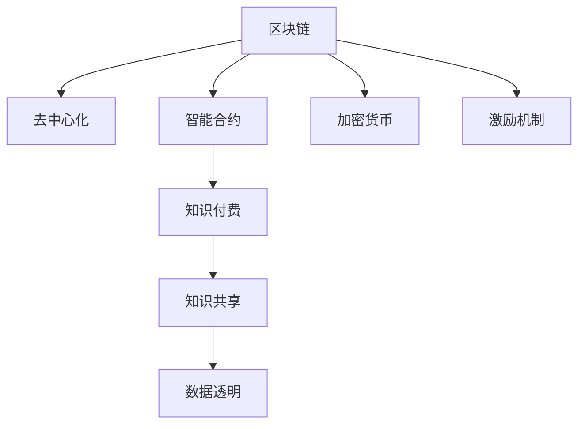

                 

# 知识经济下知识付费的区块链去中心化应用场景

> 关键词：区块链, 去中心化, 知识付费, 智能合约, 加密货币, 激励机制

## 1. 背景介绍

在知识经济时代，信息成为最重要的生产要素之一，知识付费成为了知识变现的重要方式。然而，现有的知识付费平台存在着中心化、缺乏透明度和信任、收费标准不透明等问题。这些问题不仅影响了用户的体验，也阻碍了知识付费生态的健康发展。

随着区块链技术的兴起，其去中心化、透明、不可篡改的特性，为知识付费提供了新的解决方案。通过区块链去中心化应用场景的构建，可以重塑知识付费生态，实现知识的自由流通和共享，提升知识付费的效率和安全性。

## 2. 核心概念与联系

### 2.1 核心概念概述

为了更好地理解区块链在知识付费中的去中心化应用，本节将介绍几个密切相关的核心概念：

- **区块链**：一种分布式账本技术，通过加密和共识机制，实现数据的去中心化存储和验证。区块链的核心特性包括去中心化、不可篡改、透明性等。
- **去中心化**：相对于传统的中心化系统，去中心化系统没有单一的控制点，各节点通过共识机制协同工作。
- **知识付费**：用户通过付费获取有价值的知识或信息，形成可持续的商业模式。
- **智能合约**：自动执行的合约，无需第三方执行，可以自动完成契约条款的执行。
- **加密货币**：一种使用加密技术进行安全交易的数字货币，可以用于知识付费的交易结算。
- **激励机制**：通过奖励机制，激励用户参与知识生产、付费和使用，形成良性循环。

这些核心概念之间的逻辑关系可以通过以下Mermaid流程图来展示：



这个流程图展示了几者之间的关系：

1. 区块链提供了去中心化的平台，支持智能合约的自动执行。
2. 智能合约保障了知识付费的透明性和安全性。
3. 加密货币用于知识付费的结算，保障交易的安全性。
4. 激励机制激励用户积极参与知识生产和付费。

这些概念共同构成了区块链在知识付费中应用的基石，使得知识付费生态能够更加透明、安全和高效。

## 3. 核心算法原理 & 具体操作步骤

### 3.1 算法原理概述

区块链去中心化应用场景的构建，依赖于以下几个核心算法原理：

1. **分布式账本**：将交易记录分布在网络中所有节点上，每个节点都有一份完整的账本副本，保证了数据的去中心化和透明性。
2. **共识机制**：通过共识算法，保证网络中所有节点达成一致，维护账本的安全性和完整性。
3. **智能合约**：通过编程语言编写规则，实现自动执行的交易，无需第三方干预。
4. **加密技术**：使用公钥加密和私钥解密，确保交易的安全性和不可篡改性。

基于以上算法原理，我们构建了区块链去中心化知识付费应用场景。其主要流程包括：

1. 用户注册与身份验证：用户通过区块链网络进行注册，并通过身份验证获取身份证明。
2. 知识生产与发布：内容创作者通过智能合约发布知识内容，并设定收费标准。
3. 知识付费与购买：用户通过加密货币支付费用，智能合约自动完成交易和内容交付。
4. 知识共享与互动：用户可以自由共享和讨论知识内容，智能合约确保公平使用和收益分配。

### 3.2 算法步骤详解

基于区块链去中心化应用场景的构建，以下详细介绍了其具体步骤：

#### 3.2.1 用户注册与身份验证

1. **身份证明生成**：用户通过区块链网络提交个人信息，并通过加密算法生成数字身份证明。
2. **身份认证**：用户提交数字身份证明，智能合约自动验证其真实性，并在区块链上记录身份信息。
3. **权限管理**：通过智能合约设置用户权限，如内容创建、付费、共享等，确保用户行为的可控性和安全性。

#### 3.2.2 知识生产与发布

1. **内容上传**：内容创作者将知识内容上传至区块链网络，并设置付费规则和收费标准。
2. **智能合约创建**：通过编程语言编写智能合约，设定知识内容的访问权限、付费规则等。
3. **内容审核**：内容审核机制通过智能合约自动执行，确保内容的真实性和质量。
4. **内容发布**：智能合约自动将知识内容发布到区块链网络，并记录交易信息。

#### 3.2.3 知识付费与购买

1. **支付请求**：用户通过智能合约支付费用，智能合约自动生成支付请求。
2. **交易执行**：支付请求被发送到区块链网络，通过共识机制验证并完成交易。
3. **内容交付**：智能合约自动向用户提供知识内容，确保交易的及时性和安全性。
4. **交易记录**：交易记录自动保存在区块链上，实现透明和可追溯。

#### 3.2.4 知识共享与互动

1. **内容共享**：用户可以在区块链网络上自由共享知识内容，智能合约确保公平使用。
2. **互动交流**：用户可以自由讨论和评论知识内容，智能合约保障言论自由和公正。
3. **收益分配**：智能合约根据使用次数和人数自动分配收益，确保内容创作者的利益。

### 3.3 算法优缺点

区块链去中心化应用场景在知识付费中具有以下优点：

1. **透明性和安全性**：区块链的去中心化和透明性，确保了知识付费交易的透明和不可篡改，减少了信任风险。
2. **公平性和公正性**：智能合约自动执行交易，避免了人为干预，确保了交易的公平性和公正性。
3. **去中心化管理**：用户通过智能合约进行管理，减少了对中心化机构的依赖，提高了系统的去中心化程度。
4. **可追溯性**：交易记录自动保存在区块链上，确保了交易的可追溯性和不可否认性。

同时，该方法也存在一些局限性：

1. **技术门槛较高**：区块链和智能合约技术门槛较高，需要专业知识和技能，普通用户难以理解和操作。
2. **交易成本较高**：区块链网络上的交易费用较高，可能会影响小额交易的可行性。
3. **可扩展性不足**：目前区块链的可扩展性不足，处理大量交易时效率较低，可能影响系统的性能。
4. **隐私保护不足**：虽然区块链提供了去中心化的保护，但部分信息仍可能在网络中公开。

尽管存在这些局限性，但区块链去中心化应用场景在大规模知识付费场景中的应用前景广阔，未来通过技术的不断进步和优化，这些问题有望逐步得到解决。

### 3.4 算法应用领域

区块链去中心化应用场景在知识付费中已经展现出巨大的潜力，以下是几个主要的应用领域：

1. **在线教育**：通过区块链去中心化应用场景，实现在线课程的自动交易和收益分配，保障教育质量。
2. **学术研究**：通过智能合约发布学术论文，设定访问权限和付费规则，确保学术成果的公平使用。
3. **知识分享平台**：构建去中心化的知识分享平台，实现自由共享和互动，保障用户的言论自由和收益。
4. **内容创作平台**：通过智能合约管理内容创作和付费，确保内容创作者利益，促进内容生产。
5. **知识产权保护**：利用区块链去中心化应用场景，实现知识产权的自动登记和保护，防止侵权。

## 4. 数学模型和公式 & 详细讲解 & 举例说明

### 4.1 数学模型构建

在知识付费场景中，智能合约是实现去中心化应用的核心工具。假设有一个智能合约，用于管理知识内容的发布、付费和收益分配。智能合约的核心参数包括：

- 知识内容ID：标识知识内容的唯一标识符。
- 发布者ID：标识知识内容的发布者。
- 访问权限：设定知识的访问权限，如付费、免费等。
- 付费标准：设定知识的收费标准，如固定价格、按次付费等。
- 收益分配规则：设定收益分配比例，确保内容创作者的利益。

智能合约的执行规则可以表示为一个函数，输入参数包括用户ID、访问权限、付费金额等，输出结果包括交易是否成功、内容是否可用、收益是否分配等。

### 4.2 公式推导过程

以知识内容的付费为例，推导智能合约的执行公式。假设知识内容的付费标准为固定价格$P$，用户ID为$U$，访问权限为$A$。智能合约的执行过程如下：

1. 用户提出付费请求，智能合约验证用户ID和访问权限。
2. 智能合约计算交易费用$F$，并从用户账户中扣除。
3. 智能合约向内容发布者账户支付费用$P$。
4. 智能合约记录交易记录，确保交易的可追溯性。

公式表示如下：

$$
\text{交易成功} = A(U, P, U) && \text{扣除费用}(U, F) && \text{支付费用}(U, P) && \text{记录交易}(U, P)
$$

其中$A(U, P, U)$表示验证用户ID和访问权限，$F(U)$表示计算交易费用，$P(U)$表示支付费用，$\text{记录交易}(U, P)$表示记录交易信息。

### 4.3 案例分析与讲解

以在线教育为例，分析区块链去中心化应用场景的具体应用。

假设有一个在线教育平台，用户可以通过智能合约购买课程。智能合约的核心参数包括：

- 课程ID：标识课程的唯一标识符。
- 课程名称：课程的详细名称和介绍。
- 课程价格：课程的收费标准。
- 课程时长：课程的持续时间。
- 课程访问权限：设定课程的访问权限，如付费、免费等。

用户通过智能合约进行付费后，智能合约自动将课程权限添加到用户账户中，并记录交易信息。用户可以在有效期内自由访问课程内容，平台根据访问次数和人数自动分配收益给课程创作者。

## 5. 项目实践：代码实例和详细解释说明

### 5.1 开发环境搭建

在进行区块链去中心化应用场景的开发前，我们需要准备好开发环境。以下是使用Solidity语言开发以太坊智能合约的环境配置流程：

1. **安装Node.js**：从官网下载并安装Node.js，用于编译和部署智能合约。
2. **安装Truffle**：从官网下载并安装Truffle框架，用于开发和管理以太坊智能合约。
3. **安装Ganache**：从官网下载并安装Ganache客户端，用于模拟以太坊网络进行测试。
4. **安装Web3.js**：从官网下载并安装Web3.js库，用于在客户端与区块链交互。

完成上述步骤后，即可在本地搭建以太坊测试网络，进行智能合约的开发和测试。

### 5.2 源代码详细实现

这里我们以知识付费为例，给出使用Solidity语言编写智能合约的代码实现。

首先，定义智能合约的参数：

```solidity
pragma solidity ^0.8.0;

contract KnowledgePay {
    address public publisher;
    uint256 public courseID;
    string public courseName;
    uint256 public coursePrice;
    uint256 public courseDuration;
    bool public courseAccessible;
    uint256 public numberOfAccesses;
    uint256 public balance;

    constructor(address _publisher, uint256 _courseID, string _courseName, uint256 _coursePrice, uint256 _courseDuration, bool _courseAccessible) {
        publisher = _publisher;
        courseID = _courseID;
        courseName = _courseName;
        coursePrice = _coursePrice;
        courseDuration = _courseDuration;
        courseAccessible = _courseAccessible;
        numberOfAccesses = 0;
        balance = _coursePrice;
    }

    function buyCourse() public payable {
        if (courseAccessible && numberOfAccesses < 1) {
            require(msg.value == coursePrice);
            numberOfAccesses++;
            courseAccessible = false;
            publisher.transfer(coursePrice);
            emit CourseBought(courseID);
        }
    }

    function viewCourseInfo() public view returns (uint256, bool, string) {
        return (courseID, courseAccessible, courseName);
    }
}
```

然后，定义智能合约的函数：

```solidity
pragma solidity ^0.8.0;

contract KnowledgePay {
    // 定义变量和构造函数

    function buyCourse() public payable {
        // 验证用户是否付费且课程未被访问
        if (courseAccessible && numberOfAccesses < 1) {
            // 验证用户支付金额是否等于课程价格
            require(msg.value == coursePrice);
            // 增加访问次数
            numberOfAccesses++;
            // 将课程访问权限设置为不可访问
            courseAccessible = false;
            // 将课程费用转账给内容发布者
            publisher.transfer(coursePrice);
            // 记录交易信息
            emit CourseBought(courseID);
        }
    }

    function viewCourseInfo() public view returns (uint256, bool, string) {
        // 返回课程信息
        return (courseID, courseAccessible, courseName);
    }

    // 其他函数定义略
}
```

最后，启动测试流程并评估：

```solidity
pragma solidity ^0.8.0;

contract KnowledgePay {
    // 定义变量和构造函数

    function buyCourse() public payable {
        // 验证用户是否付费且课程未被访问
        if (courseAccessible && numberOfAccesses < 1) {
            // 验证用户支付金额是否等于课程价格
            require(msg.value == coursePrice);
            // 增加访问次数
            numberOfAccesses++;
            // 将课程访问权限设置为不可访问
            courseAccessible = false;
            // 将课程费用转账给内容发布者
            publisher.transfer(coursePrice);
            // 记录交易信息
            emit CourseBought(courseID);
        }
    }

    function viewCourseInfo() public view returns (uint256, bool, string) {
        // 返回课程信息
        return (courseID, courseAccessible, courseName);
    }

    // 其他函数定义略
}

// 测试代码略
```

以上就是使用Solidity语言编写知识付费智能合约的完整代码实现。可以看到，通过Solidity语言和以太坊智能合约框架，我们能够轻松实现知识付费的交易逻辑，并保障交易的安全性和可追溯性。

### 5.3 代码解读与分析

让我们再详细解读一下关键代码的实现细节：

**KnowledgePay智能合约**：
- **变量定义**：定义了课程ID、课程名称、课程价格、课程时长、课程访问权限、访问次数和余额等关键变量。
- **构造函数**：初始化课程信息，将课程访问权限设置为可访问，并将余额初始化为课程价格。
- **buyCourse函数**：用户通过智能合约购买课程，验证用户是否已付费且课程未被访问，增加访问次数，并将课程访问权限设置为不可访问，将课程费用转账给内容发布者，记录交易信息。
- **viewCourseInfo函数**：返回课程信息，包括课程ID、课程访问权限和课程名称。

**测试代码**：
- **部署合约**：通过Truffle框架编译和部署智能合约。
- **交互合约**：通过Web3.js库在客户端与智能合约进行交互，模拟用户购买课程和查看课程信息。

可以看出，Solidity语言和以太坊智能合约框架使得知识付费的应用开发变得简洁高效。开发者可以专注于业务逻辑的设计，而不必过多关注底层实现细节。

当然，工业级的系统实现还需考虑更多因素，如合约的安全性审计、多语言支持、系统集成等。但核心的知识付费智能合约的开发方法基本与此类似。

## 6. 实际应用场景

### 6.1 在线教育

在线教育平台通过区块链去中心化应用场景，可以实现课程的自动交易和收益分配，保障教育质量。

具体而言，平台可以发布各类课程，设定课程价格和访问权限。用户通过智能合约进行付费，智能合约自动将课程权限添加到用户账户中，并记录交易信息。平台根据访问次数和人数自动分配收益给课程创作者，确保内容创作者的利益。

### 6.2 学术研究

学术机构可以通过智能合约发布学术论文，设定访问权限和付费规则，确保学术成果的公平使用。

平台可以发布各类学术论文，设定论文的访问权限和付费标准。用户通过智能合约进行付费，智能合约自动将论文权限添加到用户账户中，并记录交易信息。平台根据论文的访问次数和人数自动分配收益给论文作者，确保论文作者的利益。

### 6.3 知识分享平台

知识分享平台通过区块链去中心化应用场景，实现知识内容的自由共享和互动，保障用户的言论自由和收益。

平台可以发布各类知识内容，设定知识的访问权限和付费标准。用户通过智能合约进行付费，智能合约自动将知识权限添加到用户账户中，并记录交易信息。用户可以自由共享和讨论知识内容，智能合约确保公平使用和收益分配。

### 6.4 内容创作平台

内容创作平台通过智能合约管理内容创作和付费，确保内容创作者的利益，促进内容生产。

平台可以发布各类内容，设定内容的访问权限和付费标准。用户通过智能合约进行付费，智能合约自动将内容权限添加到用户账户中，并记录交易信息。平台根据内容的访问次数和人数自动分配收益给内容创作者，确保内容创作者的利益。

### 6.5 知识产权保护

利用区块链去中心化应用场景，实现知识产权的自动登记和保护，防止侵权。

平台可以发布各类知识产权信息，设定知识产权的访问权限和付费标准。用户通过智能合约进行付费，智能合约自动将知识产权信息添加到用户账户中，并记录交易信息。平台根据知识产权的使用次数和人数自动分配收益给知识产权所有者，确保知识产权的利益。

## 7. 工具和资源推荐

### 7.1 学习资源推荐

为了帮助开发者系统掌握区块链去中心化应用场景的理论基础和实践技巧，这里推荐一些优质的学习资源：

1. **《区块链原理与实践》**：详细介绍了区块链的基本原理和实际应用，适合初学者入门。
2. **《以太坊智能合约开发实战》**：介绍以太坊智能合约的开发和部署，结合实际项目，讲解智能合约的设计和实现。
3. **《Solidity官方文档》**：Solidity语言的官方文档，提供了完整的Solidity语言语法和智能合约开发指南。
4. **《Web3.js官方文档》**：Web3.js库的官方文档，提供了在客户端与区块链交互的详细说明和示例。
5. **《加密货币投资入门》**：介绍加密货币的基本概念和投资策略，适合对加密货币感兴趣的读者。

通过对这些资源的学习实践，相信你一定能够快速掌握区块链去中心化应用场景的精髓，并用于解决实际的NLP问题。

### 7.2 开发工具推荐

高效的开发离不开优秀的工具支持。以下是几款用于区块链去中心化应用场景开发的常用工具：

1. **Truffle框架**：以太坊智能合约开发和管理框架，提供了编译、测试、部署等一站式的智能合约开发工具。
2. **Ganache客户端**：以太坊网络的本地测试工具，用于模拟以太坊网络进行智能合约的测试和调试。
3. **Remix IDE**：基于Web的智能合约开发工具，提供了可视化开发环境和实时调试功能。
4. **Web3.js库**：用于在客户端与以太坊网络交互的JavaScript库，支持智能合约的调用、部署、交互等功能。
5. **Metamask浏览器插件**：以太坊网络中常用的浏览器插件，支持智能合约的调用、以太币交易等。

合理利用这些工具，可以显著提升区块链去中心化应用场景的开发效率，加快创新迭代的步伐。

### 7.3 相关论文推荐

区块链去中心化应用场景的发展源于学界的持续研究。以下是几篇奠基性的相关论文，推荐阅读：

1. **《以太坊白皮书》**：以太坊项目的官方文档，详细介绍了以太坊的技术架构和应用场景。
2. **《智能合约技术》**：介绍智能合约的基本概念和设计原则，探讨智能合约的安全性和可靠性。
3. **《区块链去中心化应用场景》**：研究区块链去中心化应用场景的理论基础和实际应用，探讨区块链技术在各个领域的应用前景。
4. **《区块链去中心化应用场景设计与实现》**：探讨区块链去中心化应用场景的设计和实现方法，提供具体的开发案例和实现细节。
5. **《区块链去中心化应用场景的挑战与未来》**：分析区块链去中心化应用场景面临的挑战和未来发展方向，探讨如何克服现有问题，推动技术的进步。

这些论文代表了大语言模型微调技术的发展脉络。通过学习这些前沿成果，可以帮助研究者把握学科前进方向，激发更多的创新灵感。

## 8. 总结：未来发展趋势与挑战

### 8.1 总结

本文对区块链去中心化应用场景在知识付费中的应用进行了全面系统的介绍。首先阐述了区块链去中心化应用场景的研究背景和意义，明确了区块链技术在知识付费生态中的独特价值。其次，从原理到实践，详细讲解了区块链去中心化应用场景的数学原理和关键步骤，给出了智能合约开发的具体代码实例。同时，本文还广泛探讨了区块链去中心化应用场景在多个行业领域的应用前景，展示了其广阔的应用空间。此外，本文精选了区块链去中心化应用场景的学习资源，力求为读者提供全方位的技术指引。

通过本文的系统梳理，可以看到，区块链去中心化应用场景正在成为知识付费生态的重要组成部分，极大地提升了知识付费的透明度、安全和公平性。未来，伴随区块链技术的不断发展，知识付费生态必将更加健康、高效，为知识的自由流通和共享带来新的机遇。

### 8.2 未来发展趋势

展望未来，区块链去中心化应用场景在知识付费中呈现以下几个发展趋势：

1. **去中心化程度提高**：随着区块链技术的成熟和普及，去中心化程度将进一步提高，减少对中心化机构的依赖，提升系统的安全性。
2. **智能合约功能增强**：智能合约的功能将不断丰富和完善，实现更加复杂和多样的应用场景，如去中心化投票、去中心化金融等。
3. **跨链互操作性增强**：区块链之间的互操作性将不断增强，实现跨链应用和数据共享，提升系统的可扩展性和灵活性。
4. **隐私保护和匿名性增强**：隐私保护和匿名性技术的发展，将进一步保障用户的隐私和数据安全。
5. **去中心化身份认证**：通过区块链技术实现去中心化身份认证，提升用户身份的安全性和可信度。
6. **区块链与人工智能的结合**：区块链与人工智能技术的结合，将实现更加智能和高效的知识付费应用，如去中心化内容推荐、去中心化内容创作等。

以上趋势凸显了区块链去中心化应用场景在知识付费中的广阔前景。这些方向的探索发展，必将进一步提升知识付费系统的性能和应用范围，为知识经济的发展带来新的机遇。

### 8.3 面临的挑战

尽管区块链去中心化应用场景已经取得了不小的进展，但在迈向更加智能化、普适化应用的过程中，它仍面临诸多挑战：

1. **技术复杂度较高**：区块链和智能合约技术复杂度较高，需要专业知识和技能，普通用户难以理解和操作。
2. **可扩展性不足**：目前区块链的可扩展性不足，处理大量交易时效率较低，可能影响系统的性能。
3. **隐私保护不足**：尽管区块链提供了去中心化的保护，但部分信息仍可能在网络中公开，隐私保护不足。
4. **法律和监管问题**：区块链技术的发展还面临法律和监管的不确定性，可能影响其应用和普及。
5. **技术生态不够完善**：区块链技术的生态系统还不够完善，需要更多的工具、框架和标准支持。
6. **用户接受度低**：普通用户对区块链技术的接受度较低，可能影响其大规模应用。

尽管存在这些挑战，但区块链去中心化应用场景在大规模知识付费场景中的应用前景广阔，未来通过技术的不断进步和优化，这些问题有望逐步得到解决。

### 8.4 研究展望

面向未来，区块链去中心化应用场景的研究方向和突破点主要集中在以下几个方面：

1. **跨链互操作性**：探索区块链之间的互操作性技术，实现跨链应用和数据共享，提升系统的可扩展性和灵活性。
2. **隐私保护和匿名性**：研究隐私保护和匿名性技术，实现去中心化身份认证，提升用户隐私和数据安全。
3. **智能合约功能增强**：进一步增强智能合约的功能，实现更加复杂和多样的应用场景，如去中心化金融、去中心化投票等。
4. **去中心化身份认证**：研究去中心化身份认证技术，提升用户身份的安全性和可信度。
5. **区块链与人工智能的结合**：探索区块链与人工智能技术的结合，实现更加智能和高效的知识付费应用，如去中心化内容推荐、去中心化内容创作等。
6. **区块链技术生态建设**：建立区块链技术的生态系统，提供更多的工具、框架和标准支持，促进区块链技术的发展和应用。

这些研究方向的探索，必将引领区块链去中心化应用场景走向更高的台阶，为知识经济的发展带来新的机遇和挑战。

## 9. 附录：常见问题与解答

**Q1：区块链去中心化应用场景是否适用于所有知识付费场景？**

A: 区块链去中心化应用场景适用于大多数知识付费场景，特别是对于数据量较小、交易频率较高的场景。但对于一些特定领域的知识付费，如金融、医疗等，还需要进一步的优化和定制，以适应其特定的需求和监管要求。

**Q2：如何降低区块链去中心化应用场景的复杂度？**

A: 降低区块链去中心化应用场景的复杂度，可以从以下几个方面入手：
1. 简化智能合约功能，只保留核心功能，减少智能合约的代码量和复杂度。
2. 采用更易用的开发工具和框架，如Truffle、Remix等，降低开发门槛。
3. 提供更加友好的用户界面和交互方式，提升用户体验。
4. 设计合理的合约结构，减少合约之间的依赖和交互。

**Q3：如何提高区块链去中心化应用场景的可扩展性？**

A: 提高区块链去中心化应用场景的可扩展性，可以从以下几个方面入手：
1. 采用分片技术，将区块链网络分成多个子链，提升处理能力。
2. 采用多节点共识机制，如DPoS、PBFT等，提升系统的吞吐量和安全性。
3. 采用跨链互操作技术，实现不同区块链之间的互操作，提升系统的可扩展性和灵活性。
4. 采用链上链下混合架构，将部分计算任务放到链下处理，提升系统效率。

**Q4：如何保障区块链去中心化应用场景的安全性？**

A: 保障区块链去中心化应用场景的安全性，可以从以下几个方面入手：
1. 采用高级加密算法，如椭圆曲线加密、零知识证明等，提升系统的安全性。
2. 设计合理的智能合约，避免合约漏洞和攻击。
3. 采用多签机制和多重身份验证，确保用户操作的安全性。
4. 建立完备的监控和预警系统，及时发现和应对安全威胁。

**Q5：如何提升区块链去中心化应用场景的用户接受度？**

A: 提升区块链去中心化应用场景的用户接受度，可以从以下几个方面入手：
1. 提供更加友好的用户界面和交互方式，提升用户体验。
2. 开展宣传和教育活动，提升用户对区块链技术的认知和接受度。
3. 提供更加可靠和安全的服务保障，提升用户信任度。
4. 设计合理的激励机制，吸引用户参与和贡献。

这些措施将有助于提升区块链去中心化应用场景的用户接受度和普及度，推动知识付费生态的健康发展。

---

作者：禅与计算机程序设计艺术 / Zen and the Art of Computer Programming

