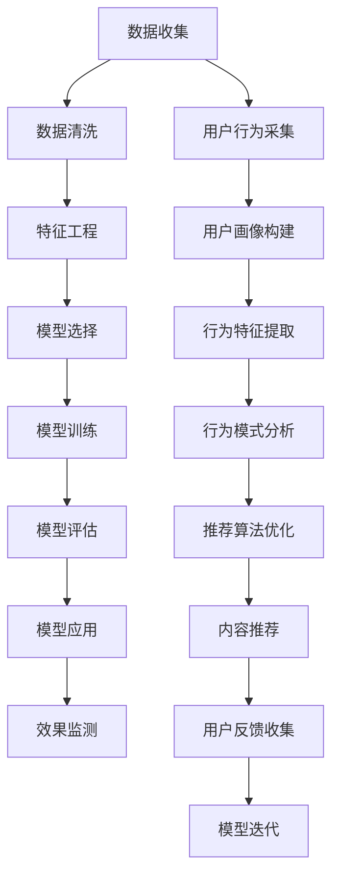

                 

# 知识经济下知识付费的大数据用户行为分析模型

> 关键词：知识付费, 大数据, 用户行为, 分析模型, 人工智能

## 1. 背景介绍

### 1.1 问题由来
在知识经济的时代背景下，知识付费模式逐渐成为人们获取知识的主要途径。知识付费平台，如得到、喜马拉雅、Coursera等，吸引了越来越多的用户订阅付费内容，利用碎片时间进行自我提升。

随着知识付费市场的不断发展，各大平台之间的竞争日益激烈，纷纷推出各类会员体系、积分系统、推荐算法等工具来提升用户粘性。这些做法在一定程度上提高了用户留存率和转化率，但也带来了不少挑战：

1. **用户行为多样性**：不同用户的学习习惯、支付意愿、内容偏好各不相同，难以进行统一的分析和个性化推荐。
2. **推荐算法效果参差不齐**：当前的推荐算法往往是基于用户历史行为和兴趣标签，有时难以准确匹配用户的真实需求，导致用户流失。
3. **用户活跃度监测**：如何实时监测用户的活跃度变化，及时调整内容推荐策略，提高平台运营效率。

为了解决这些问题，大数据和人工智能技术在知识付费领域的应用显得尤为重要。通过大数据分析，可以深入挖掘用户的行为模式，发现潜在的用户需求；通过人工智能模型，可以对用户行为进行预测和优化，提升平台的运营效果。

### 1.2 问题核心关键点
本文将聚焦于基于大数据和人工智能技术，构建知识付费平台的用户行为分析模型，通过分析用户行为数据，优化平台推荐算法，提高用户粘性和活跃度。

具体而言，核心关键点包括：

1. 如何收集和处理知识付费平台的用户行为数据，构建高质量的数据集。
2. 如何设计用户行为分析模型，利用机器学习算法挖掘用户行为特征和模式。
3. 如何基于用户行为分析结果，优化推荐算法，提升用户满意度和留存率。

## 2. 核心概念与联系

### 2.1 核心概念概述

为更好地理解本文构建的用户行为分析模型，本节将介绍几个密切相关的核心概念：

- **知识付费**：用户为获取专业知识或技能，支付一定费用订阅内容的模式。这种模式可以细分为订阅制和按次付费制。

- **大数据**：指规模庞大的数据集合，通常难以在传统计算环境中实时处理和分析。大数据技术包括数据收集、存储、处理和分析等。

- **用户行为分析**：通过对用户的行为数据进行分析，了解用户需求、偏好和趋势，从而提供更加个性化的服务。

- **推荐系统**：根据用户的历史行为、兴趣等特征，向用户推荐可能感兴趣的内容或产品，提高用户满意度。

- **机器学习**：利用算法和模型，从数据中自动学习规律，并进行预测和优化。

- **深度学习**：一种机器学习方法，利用神经网络模型进行特征提取和模式识别，适用于复杂的非线性关系建模。

- **自然语言处理(NLP)**：涉及计算机理解和处理人类语言的技术，常用于文本分类、情感分析等。

- **强化学习**：通过与环境的交互，优化策略以最大化预期奖励的算法。

这些概念之间存在紧密联系，形成了一个从数据收集到模型优化，再到内容推荐的全链条流程。通过深入理解这些核心概念，可以更好地把握知识付费平台用户行为分析模型的构建思路。

### 2.2 核心概念原理和架构的 Mermaid 流程图



这个流程图展示了从用户行为数据收集到最终推荐算法优化的全链条流程。通过各个环节的紧密协作，知识付费平台可以构建一个高效、精准的用户行为分析模型。

## 3. 核心算法原理 & 具体操作步骤

### 3.1 算法原理概述

本文构建的知识付费平台用户行为分析模型，基于机器学习算法，对用户行为数据进行分析和预测，从而优化推荐算法，提升用户粘性和活跃度。

核心算法流程如下：

1. **数据收集与预处理**：通过数据采集工具，收集知识付费平台的用户行为数据，包括登录次数、付费记录、课程学习情况、课程评分、评论内容等。

2. **特征工程**：对收集到的数据进行特征提取和构建，包括用户基本信息（如年龄、性别、职业）、课程信息（如课程难度、时长、价格）、行为数据（如课程访问次数、学习时长、互动次数）等。

3. **模型训练与优化**：选择适当的机器学习算法，如线性回归、决策树、随机森林、梯度提升树、神经网络等，对数据进行训练，并不断优化模型参数，提升模型预测准确性。

4. **模型应用与评估**：将训练好的模型应用于推荐系统，实时监测推荐效果，并根据用户反馈和行为数据进行模型迭代，进一步提升推荐算法的效果。

### 3.2 算法步骤详解

#### 3.2.1 数据收集与预处理

1. **数据收集**：
   - 通过API接口，实时采集知识付费平台的用户行为数据。
   - 使用网络爬虫技术，从各大知识付费平台抓取公开数据，如用户注册信息、课程详情、用户评价等。

2. **数据清洗**：
   - 去除重复、缺失、异常的数据。
   - 处理文本数据，如去除停用词、进行分词处理等。
   - 归一化数值数据，如对时间戳进行标准化处理。

#### 3.2.2 特征工程

1. **用户基本信息**：
   - 收集用户的基本信息，如年龄、性别、职业等，构建用户画像。
   - 利用自然语言处理技术，对用户评论进行情感分析，构建情感特征。

2. **课程信息**：
   - 收集课程的基本信息，如课程名称、难度、时长、价格等。
   - 利用自然语言处理技术，对课程描述进行关键词提取，构建课程特征。

3. **行为数据**：
   - 记录用户的行为数据，如课程访问次数、学习时长、互动次数等。
   - 对行为数据进行时间序列分析，构建行为特征。

#### 3.2.3 模型训练与优化

1. **模型选择**：
   - 根据问题的复杂度和数据特点，选择适当的机器学习算法，如线性回归、决策树、随机森林、梯度提升树、神经网络等。
   - 利用交叉验证技术，对模型进行初步评估和调参。

2. **模型训练**：
   - 将数据划分为训练集、验证集和测试集。
   - 使用训练集数据对模型进行训练，并根据验证集进行调参优化。

3. **模型评估**：
   - 在测试集上对模型进行评估，计算各项指标，如准确率、召回率、F1分数等。
   - 根据评估结果，调整模型参数，进行迭代优化。

#### 3.2.4 模型应用与评估

1. **推荐系统优化**：
   - 将训练好的模型应用于推荐系统，实时监测推荐效果。
   - 根据用户反馈和行为数据，进行模型迭代，提升推荐算法的效果。

2. **效果监测**：
   - 实时监测用户行为数据，如课程访问次数、学习时长、互动次数等。
   - 根据用户行为变化，调整推荐策略，提高用户满意度。

### 3.3 算法优缺点

#### 3.3.1 优点

1. **提升推荐效果**：通过用户行为分析，可以更准确地预测用户需求，提高推荐算法的效果。
2. **个性化推荐**：根据用户个性化特征，提供更加贴合用户需求的内容推荐，提升用户粘性。
3. **实时调整**：通过实时监测用户行为数据，及时调整推荐策略，提高用户满意度和留存率。

#### 3.3.2 缺点

1. **数据隐私问题**：收集用户行为数据需要遵循隐私保护法律法规，保护用户隐私。
2. **算法复杂度**：模型的训练和调参过程较为复杂，需要专业知识和技术支持。
3. **数据质量要求高**：数据的质量直接影响模型的效果，数据收集和清洗难度较大。

### 3.4 算法应用领域

本节将探讨本文构建的用户行为分析模型在知识付费领域的具体应用场景：

1. **用户流失预警**：通过用户行为数据，预测用户流失风险，及时采取措施，提升用户留存率。

2. **个性化课程推荐**：根据用户行为特征，推荐符合用户兴趣的课程，提高用户满意度和课程订阅率。

3. **内容定价优化**：分析课程价格和用户付费行为的关系，优化课程定价策略，提高收益。

4. **平台运营效率监测**：实时监测用户行为数据，调整运营策略，提高平台运营效率。

5. **用户行为趋势分析**：通过用户行为数据，分析用户学习趋势和需求变化，优化内容生产策略。

## 4. 数学模型和公式 & 详细讲解 & 举例说明

### 4.1 数学模型构建

本文构建的用户行为分析模型，主要涉及以下几类数学模型：

1. **线性回归模型**：用于预测用户的行为变化趋势，如用户订阅课程的概率。

2. **决策树模型**：用于分类用户的行为标签，如用户是否流失、课程是否受欢迎等。

3. **随机森林模型**：用于集成多个决策树模型，提升预测准确性。

4. **梯度提升树模型**：通过迭代训练，逐步提升模型的预测效果。

5. **神经网络模型**：用于处理复杂非线性关系，提升预测准确性。

### 4.2 公式推导过程

#### 4.2.1 线性回归模型

1. **模型定义**：
   $$
   y = \beta_0 + \beta_1x_1 + \beta_2x_2 + \cdots + \beta_nx_n + \epsilon
   $$
   其中 $y$ 为预测目标，$\beta$ 为模型参数，$x$ 为特征变量，$\epsilon$ 为误差项。

2. **最小二乘法求解**：
   $$
   \hat{\beta} = \arg\min_{\beta} \sum_{i=1}^N (y_i - (\beta_0 + \beta_1x_{i1} + \beta_2x_{i2} + \cdots + \beta_nx_{in}))^2
   $$
   通过求解最小二乘法，可以得到模型参数 $\hat{\beta}$。

3. **预测值计算**：
   $$
   y_{pred} = \hat{\beta}_0 + \hat{\beta}_1x_1 + \hat{\beta}_2x_2 + \cdots + \hat{\beta}_nx_n
   $$

#### 4.2.2 决策树模型

1. **信息增益定义**：
   $$
   IG(S_d) = -\sum_{c\in C} \frac{|S_d^c|}{|S_d|} \log_2 \frac{|S_d^c|}{|S_d|}
   $$
   其中 $S_d$ 为数据集，$c$ 为类别，$S_d^c$ 为数据集中属于类别 $c$ 的样本。

2. **最优分裂节点选择**：
   $$
   \hat{S} = \arg\max_{a} IG(S_a)
   $$
   通过选择信息增益最大的特征 $a$ 进行分裂，得到最优的决策树节点。

3. **预测结果计算**：
   $$
   y_{pred} = \hat{y}_a, \text{其中} a \text{为分裂节点的特征值}
   $$

#### 4.2.3 随机森林模型

1. **集成决策树模型**：
   $$
   y_{pred} = \frac{1}{M} \sum_{m=1}^M y_{pred_m}
   $$
   其中 $M$ 为随机森林的树数，$y_{pred_m}$ 为第 $m$ 棵树的预测结果。

2. **特征重要性计算**：
   $$
   I_j = \frac{1}{T} \sum_{t=1}^T (r_{1j} - r_{0j})
   $$
   其中 $j$ 为特征索引，$T$ 为树数，$r_{ij}$ 为第 $i$ 棵树的平均特征重要性。

#### 4.2.4 梯度提升树模型

1. **基础学习器定义**：
   $$
   f_m(x) = \sum_{j=1}^m h_j(x)
   $$
   其中 $h_j(x)$ 为第 $j$ 个学习器的预测结果，$m$ 为学习器个数。

2. **梯度下降求解**：
   $$
   \hat{\beta}_m = \arg\min_{\beta} \frac{1}{N} \sum_{i=1}^N (y_i - f_{m-1}(x_i) - \beta h_m(x_i))^2
   $$
   通过求解梯度下降，可以得到第 $m$ 个学习器的预测结果 $\hat{\beta}_m$。

3. **预测值计算**：
   $$
   y_{pred} = \sum_{m=1}^M \hat{\beta}_m
   $$

#### 4.2.5 神经网络模型

1. **神经网络定义**：
   $$
   y_{pred} = \sum_{i=1}^M \beta_i \sigma(\sum_{j=1}^N w_{ij} x_j + b_i)
   $$
   其中 $y_{pred}$ 为预测结果，$\beta$ 为模型参数，$x$ 为输入特征，$\sigma$ 为激活函数，$w$ 为权重矩阵，$b$ 为偏置项。

2. **反向传播算法**：
   $$
   \frac{\partial L}{\partial w} = \frac{\partial L}{\partial y} \frac{\partial y}{\partial z} \frac{\partial z}{\partial w}
   $$
   其中 $L$ 为损失函数，$z$ 为中间变量，$\frac{\partial L}{\partial y}$ 为梯度，$\frac{\partial y}{\partial z}$ 为激活函数的导数，$\frac{\partial z}{\partial w}$ 为权重导数。

3. **损失函数计算**：
   $$
   L(y_{pred}, y_{true}) = \frac{1}{N} \sum_{i=1}^N (y_{pred} - y_{true})^2
   $$

### 4.3 案例分析与讲解

以知识付费平台的用户流失预警为例，介绍如何使用本文构建的模型进行分析。

1. **数据收集**：
   - 收集用户注册信息、登录记录、课程订阅情况、课程学习进度等行为数据。

2. **数据预处理**：
   - 对用户注册信息进行去重和标准化处理。
   - 对登录记录进行时间序列分析，记录用户每天登录的次数和时长。
   - 对课程订阅情况进行归一化处理，计算用户订阅的课程数和付费金额。

3. **特征工程**：
   - 收集用户基本信息，如年龄、性别、职业等。
   - 对用户评论进行情感分析，构建情感特征。
   - 对课程信息进行归一化处理，构建课程难度、时长、价格等特征。
   - 对行为数据进行时间序列分析，构建行为特征，如每天登录次数、学习时长、互动次数等。

4. **模型训练与优化**：
   - 使用随机森林模型，对用户流失风险进行预测。
   - 根据模型评估结果，对模型进行调参优化。

5. **效果监测**：
   - 实时监测用户流失情况，及时采取措施，如用户回访、优惠券等。
   - 根据用户行为变化，调整课程推荐策略，提高用户满意度。

## 5. 项目实践：代码实例和详细解释说明

### 5.1 开发环境搭建

在进行用户行为分析模型的开发前，需要准备好开发环境。以下是使用Python进行Scikit-learn开发的环境配置流程：

1. 安装Anaconda：从官网下载并安装Anaconda，用于创建独立的Python环境。

2. 创建并激活虚拟环境：
```bash
conda create -n sklearn-env python=3.8 
conda activate sklearn-env
```

3. 安装Scikit-learn：
```bash
pip install scikit-learn
```

4. 安装其他工具包：
```bash
pip install numpy pandas matplotlib seaborn scikit-learn joblib
```

完成上述步骤后，即可在`sklearn-env`环境中开始开发实践。

### 5.2 源代码详细实现

这里以用户流失预警模型为例，给出基于Scikit-learn的代码实现。

```python
from sklearn.ensemble import RandomForestClassifier
from sklearn.model_selection import train_test_split
from sklearn.metrics import accuracy_score, roc_auc_score

# 假设已经收集到用户流失数据集，包括用户基本信息、课程信息、行为数据等

# 数据预处理和特征工程
X = data[['年龄', '性别', '职业', '课程难度', '课程时长', '课程价格', '每天登录次数', '学习时长', '互动次数']]
y = data['流失情况']

# 划分训练集和验证集
X_train, X_val, y_train, y_val = train_test_split(X, y, test_size=0.2, random_state=42)

# 构建随机森林模型
clf = RandomForestClassifier(n_estimators=100, max_depth=5, random_state=42)

# 模型训练和评估
clf.fit(X_train, y_train)
y_pred = clf.predict(X_val)
acc = accuracy_score(y_val, y_pred)
auc = roc_auc_score(y_val, y_pred)

# 模型应用和效果监测
# 在实时数据中，对新用户的流失情况进行预测，及时采取措施，如用户回访、优惠券等
```

以上是使用Scikit-learn进行用户流失预警模型的完整代码实现。可以看到，通过Scikit-learn库，可以相对简洁地实现用户行为分析模型的开发。

### 5.3 代码解读与分析

让我们再详细解读一下关键代码的实现细节：

1. **数据预处理和特征工程**：
   - `data` 为已收集到的用户数据集。
   - `X` 为特征矩阵，包含用户基本信息、课程信息、行为数据等。
   - `y` 为标签向量，表示用户是否流失。

2. **模型训练和评估**：
   - `RandomForestClassifier` 为随机森林分类器，用于构建用户流失预警模型。
   - `train_test_split` 用于将数据集划分为训练集和验证集。
   - `accuracy_score` 和 `roc_auc_score` 用于评估模型预测效果。

3. **模型应用和效果监测**：
   - `clf.predict` 用于对新用户进行流失情况预测。
   - 根据预测结果，及时采取措施，如用户回访、优惠券等。

## 6. 实际应用场景

### 6.1 智能推荐系统

基于用户行为分析模型，可以构建智能推荐系统，向用户推荐可能感兴趣的课程和内容，提高用户满意度和留存率。推荐系统可以从以下几个方面进行优化：

1. **实时推荐**：根据用户实时行为数据，动态调整推荐策略，提高推荐效果。
2. **个性化推荐**：根据用户行为特征，提供更加贴合用户需求的内容推荐。
3. **多模态融合**：结合文本、图像、音频等多模态数据，提升推荐系统的准确性。
4. **反馈优化**：根据用户反馈，及时调整推荐算法，优化推荐效果。

### 6.2 用户流失预警

用户流失是知识付费平台面临的重要挑战。通过用户行为分析模型，可以实时监测用户行为变化，预警潜在流失风险，采取措施挽留用户。预警系统可以从以下几个方面进行优化：

1. **实时监测**：通过实时监测用户行为数据，及时发现异常行为，预警潜在流失风险。
2. **用户回访**：根据预警结果，主动联系用户，了解流失原因，提供相应帮助。
3. **优惠活动**：针对预警用户，推出优惠券、会员特惠等优惠活动，提升用户留存率。

### 6.3 用户行为趋势分析

通过用户行为分析模型，可以分析用户的学习趋势和需求变化，优化内容生产策略，提升平台运营效率。趋势分析可以从以下几个方面进行优化：

1. **行为变化分析**：通过时间序列分析，了解用户行为的变化趋势，发现潜在需求。
2. **内容推荐优化**：根据行为变化，调整课程推荐策略，提升用户满意度。
3. **市场趋势预测**：通过用户行为数据，预测市场趋势，优化内容生产计划。

### 6.4 未来应用展望

随着大数据和人工智能技术的不断发展，用户行为分析模型在知识付费领域的应用前景将更加广阔。

1. **深度学习应用**：未来可以引入深度学习模型，提升模型的复杂度和预测准确性。
2. **多模态融合**：结合文本、图像、音频等多模态数据，提升推荐系统的准确性。
3. **实时优化**：通过实时监测和优化，提高推荐系统的效果和响应速度。
4. **用户情感分析**：通过情感分析，理解用户情感变化，提升用户满意度。

## 7. 工具和资源推荐

### 7.1 学习资源推荐

为了帮助开发者系统掌握用户行为分析模型的理论基础和实践技巧，这里推荐一些优质的学习资源：

1. 《Python机器学习》书籍：由机器学习领域的知名专家撰写，系统介绍了机器学习算法和工具库，包括Scikit-learn。

2. 《深度学习》课程：斯坦福大学开设的深度学习课程，涵盖机器学习、深度学习等基础知识，适合初学者学习。

3. 《随机森林》书籍：介绍随机森林算法的基本原理和应用，适合深入学习随机森林模型的开发者。

4. 《Kaggle竞赛》：参与Kaggle竞赛，学习大数据和机器学习领域的最新技术，提升实战能力。

5. 《Scikit-learn官方文档》：Scikit-learn库的官方文档，提供了丰富的学习资源和样例代码。

通过对这些资源的学习实践，相信你一定能够快速掌握用户行为分析模型的构建思路，并用于解决实际的NLP问题。

### 7.2 开发工具推荐

高效的开发离不开优秀的工具支持。以下是几款用于用户行为分析模型开发的常用工具：

1. Jupyter Notebook：一个轻量级的Web交互式开发工具，支持Python等语言的代码编写和数据分析。

2. PyCharm：一款Python开发IDE，支持Python语言的全文搜索、调试、分析等功能。

3. Anaconda：一款数据科学和机器学习环境，支持多语言编程和数据管理。

4. TensorBoard：TensorFlow配套的可视化工具，可实时监测模型训练状态，并提供丰富的图表呈现方式。

5. Joblib：用于加速Python代码执行的工具，适合进行大规模数据处理和模型训练。

合理利用这些工具，可以显著提升用户行为分析模型的开发效率，加快创新迭代的步伐。

### 7.3 相关论文推荐

用户行为分析模型在知识付费领域的应用源于学界的持续研究。以下是几篇奠基性的相关论文，推荐阅读：

1. 《User Behavior Modeling and Recommendation System in Knowledge Service Platform》：介绍知识付费平台的用户行为分析和推荐系统，提供详细的算法实现。

2. 《Personalized Recommendation Based on User Behavior Analysis》：探讨基于用户行为分析的个性化推荐算法，提供深入的理论分析。

3. 《Real-Time Prediction of User Churn Using Machine Learning》：介绍使用机器学习模型预测用户流失的实时系统，提供丰富的案例分析。

4. 《Deep Learning for Natural Language Processing》：介绍深度学习在自然语言处理领域的应用，适合了解深度学习模型的基本原理。

5. 《Integrating Multimodal Data for Recommendation Systems》：介绍多模态融合在推荐系统中的应用，提供丰富的算法实现。

这些论文代表了大数据和人工智能在知识付费领域的应用方向，通过学习这些前沿成果，可以帮助研究者把握学科前进方向，激发更多的创新灵感。

## 8. 总结：未来发展趋势与挑战

### 8.1 总结

本文对基于大数据和人工智能技术，构建知识付费平台用户行为分析模型的理论与实践进行了全面系统的介绍。首先阐述了知识付费领域面临的问题和挑战，明确了用户行为分析模型构建的必要性和重要性。其次，从数据收集、预处理、特征工程、模型训练与优化等方面，详细讲解了用户行为分析模型的核心算法流程。最后，通过实例和应用场景，展示了用户行为分析模型的实际应用效果。

通过本文的系统梳理，可以看到，用户行为分析模型在知识付费领域具有广泛的应用前景，能够显著提升平台的运营效果和用户满意度。未来，伴随大数据和人工智能技术的不断发展，用户行为分析模型将得到更深入的研究和应用。

### 8.2 未来发展趋势

展望未来，用户行为分析模型在知识付费领域将呈现以下几个发展趋势：

1. **深度学习应用**：未来可以引入深度学习模型，提升模型的复杂度和预测准确性。
2. **多模态融合**：结合文本、图像、音频等多模态数据，提升推荐系统的准确性。
3. **实时优化**：通过实时监测和优化，提高推荐系统的效果和响应速度。
4. **用户情感分析**：通过情感分析，理解用户情感变化，提升用户满意度。

### 8.3 面临的挑战

尽管用户行为分析模型在知识付费领域已经取得了一定的成果，但在实际应用中仍面临不少挑战：

1. **数据隐私问题**：收集用户行为数据需要遵循隐私保护法律法规，保护用户隐私。
2. **算法复杂度**：模型的训练和调参过程较为复杂，需要专业知识和技术支持。
3. **数据质量要求高**：数据的质量直接影响模型的效果，数据收集和清洗难度较大。
4. **实时性要求高**：推荐系统需要实时处理大量数据，对系统的实时性要求较高。
5. **模型泛化能力差**：现有模型往往针对特定应用场景，泛化能力较弱，难以适应新场景。

### 8.4 研究展望

面对用户行为分析模型面临的挑战，未来的研究需要在以下几个方面寻求新的突破：

1. **数据隐私保护**：探索如何在保证数据隐私的前提下，实现高质量的数据收集和预处理。
2. **模型复杂度降低**：开发更加轻量级的算法模型，降低模型训练和调参的复杂度。
3. **实时数据处理**：引入实时数据处理技术，提高推荐系统的实时性和效率。
4. **模型泛化能力提升**：开发具有更好泛化能力的算法模型，适应更广泛的应用场景。
5. **多模态融合技术**：结合多模态数据，提升推荐系统的准确性和效果。

这些研究方向将引领用户行为分析模型迈向更高的台阶，为知识付费平台的智能推荐和运营优化提供强有力的技术支持。面向未来，用户行为分析模型还需要与其他人工智能技术进行更深入的融合，如知识表示、因果推理、强化学习等，多路径协同发力，共同推动知识付费技术的进步。只有勇于创新、敢于突破，才能不断拓展用户行为分析模型的边界，让智能推荐技术更好地服务于知识付费平台的发展。

## 9. 附录：常见问题与解答

**Q1：用户行为分析模型是否适用于所有知识付费平台？**

A: 用户行为分析模型可以在大多数知识付费平台中得到应用，但需要根据平台的具体特点进行调整。不同的平台用户群体、课程内容、运营策略等存在差异，需要根据实际情况进行模型优化。

**Q2：数据隐私保护如何保障？**

A: 在用户行为数据收集和处理过程中，需要遵循隐私保护法律法规，如GDPR、CCPA等，对数据进行匿名化处理，避免泄露用户隐私。

**Q3：如何提升模型的实时性？**

A: 引入实时数据处理技术，如流式数据处理、分布式计算等，提升模型的实时处理能力。同时，优化模型结构和算法，减少计算量，提高计算速度。

**Q4：如何提升模型的泛化能力？**

A: 增加数据量和数据多样性，提升模型的泛化能力。引入多模态数据融合技术，提升模型的多场景适应能力。

**Q5：如何应对用户行为变化？**

A: 通过实时监测用户行为数据，及时调整推荐策略，应对用户行为变化。引入在线学习算法，实时更新模型参数，提升模型的动态适应能力。

**Q6：如何提升用户满意度？**

A: 结合用户反馈，不断优化推荐算法，提升推荐效果。引入情感分析技术，理解用户情感变化，提升用户满意度。

通过上述问答，相信你一定对用户行为分析模型的应用有了更深入的了解。希望本文能为你提供有价值的参考和启示，推动知识付费领域的技术进步。

---

作者：禅与计算机程序设计艺术 / Zen and the Art of Computer Programming

