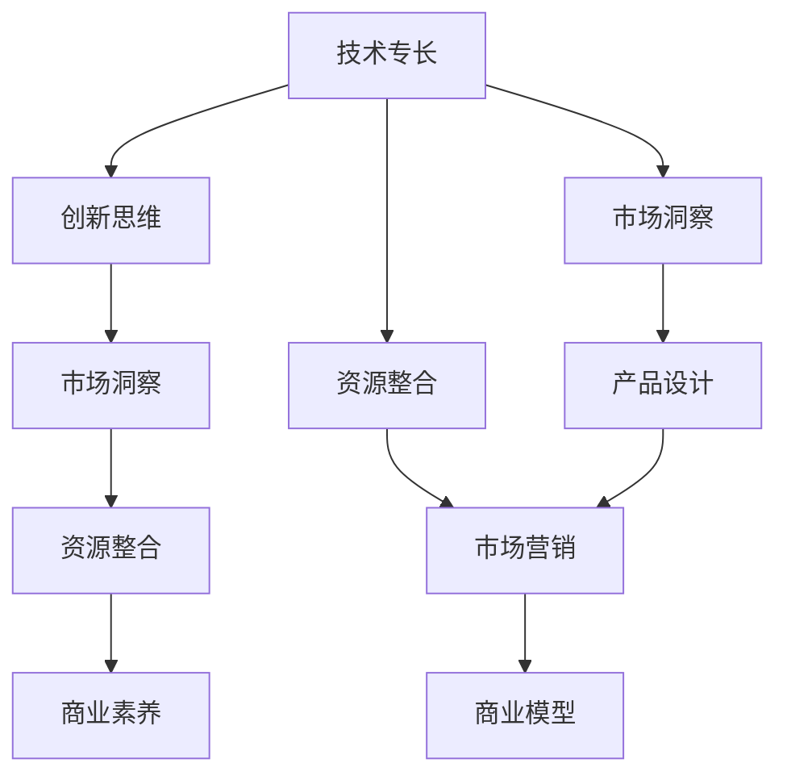

                 

# 知识经济下程序员的创业之路

在知识经济的浪潮下，程序员不仅能够作为技术工作者，更可以转型为创业者，利用自己的技术专长和创新思维，开创属于自己的事业。本文将探讨程序员在知识经济下创业的多个方面，从市场机遇、技术方向、团队构建到商业模式等，全面剖析程序员的创业之路。

## 1. 背景介绍

### 1.1 问题由来

随着全球信息化的发展，知识经济已经成为推动经济发展的重要引擎。在知识经济背景下，传统行业对技术的需求日益增加，为程序员创业提供了广阔的市场空间。然而，与传统行业创业者不同，程序员需要具备更加深厚的技术背景和创新能力，以把握新兴技术趋势，实现商业模式创新。

### 1.2 问题核心关键点

程序员在知识经济下创业的核心关键点包括：

- 技术专长：程序员具备深度学习、人工智能、大数据、云计算等前沿技术能力，这是创业的基础。
- 创新思维：能够提出独特的商业模式和产品创意，满足市场需求。
- 市场洞察：了解行业动态，预判市场需求变化，及时调整产品策略。
- 资源整合：整合技术、资金、市场等资源，高效推进项目落地。
- 商业素养：具备商业运营、市场营销、产品管理等方面的综合能力。

这些关键点共同构成了程序员创业的基本框架，帮助其在知识经济中找到创业切入点，实现商业成功。

## 2. 核心概念与联系

### 2.1 核心概念概述

- **知识经济**：指经济增长依赖于知识的积累、传播和应用，而不是传统的自然资源和劳动力。程序员创业的核心在于运用技术知识和创新思维，推动经济发展。
- **技术专长**：程序员在特定技术领域具备深厚的专业知识和实践经验，是创业的基石。
- **创新思维**：通过技术创新和商业模式创新，开拓市场空间，实现商业增值。
- **市场洞察**：深入了解市场需求变化，预判市场趋势，指导产品设计和推广策略。
- **资源整合**：有效整合技术资源、资本、人才、市场等资源，实现高效的项目运作。
- **商业素养**：具备产品管理、市场营销、财务管理等综合能力，确保企业运营成功。

### 2.2 核心概念原理和架构的 Mermaid 流程图



这个流程图展示了程序员创业的各个环节，其中技术专长是基础，创新思维和市场洞察决定创业方向，资源整合确保项目落地，商业素养保障运营成功。

## 3. 核心算法原理 & 具体操作步骤

### 3.1 算法原理概述

程序员在创业过程中，需要运用多种算法和模型，以实现技术驱动的商业创新。以下是几种常用的算法和模型：

- **数据挖掘算法**：通过分析大量用户行为数据，挖掘市场需求和用户偏好，指导产品设计和优化。
- **机器学习算法**：利用机器学习算法进行模式识别、预测分析，提升产品和服务的精准性。
- **自然语言处理(NLP)**：运用NLP技术处理用户评论、反馈等文本数据，优化产品体验和客户服务。
- **推荐系统算法**：通过推荐算法为用户推荐个性化产品和服务，提升用户粘性和满意度。

### 3.2 算法步骤详解

以下将详细介绍一种典型的创业项目——基于人工智能的个性化推荐系统，涉及的主要算法步骤：

**Step 1: 需求分析与市场调研**
- 分析目标用户群体的特征、需求和行为模式，确定推荐系统的功能模块。
- 调研市场竞争状况，确定差异化竞争策略。

**Step 2: 数据采集与预处理**
- 采集用户行为数据（如浏览记录、购买记录）和产品属性数据。
- 对数据进行清洗、去重、标准化等预处理，确保数据质量。

**Step 3: 模型训练与优化**
- 利用协同过滤、基于内容的推荐算法等，构建推荐模型。
- 使用交叉验证、A/B测试等方法进行模型优化，提升推荐精度。

**Step 4: 系统实现与部署**
- 将推荐算法集成到产品后台，实现实时推荐功能。
- 在服务器上进行部署，优化性能和扩展性，确保系统稳定性。

**Step 5: 用户体验优化与迭代**
- 收集用户反馈，进行用户界面和交互的优化。
- 根据用户反馈和市场变化，迭代产品功能和算法模型。

### 3.3 算法优缺点

基于人工智能的推荐系统具有以下优点：
- 个性化推荐：根据用户历史行为和偏好，提供量身定制的推荐结果。
- 实时性：实时处理用户请求，提升用户体验。
- 高精度：结合多种算法，提升推荐精度。

但同时也存在以下缺点：
- 数据隐私：大量用户行为数据涉及隐私，需要严格保护。
- 数据冷启动：新用户没有历史数据，难以进行个性化推荐。
- 算法复杂度：模型训练和优化需要较高的计算资源和专业知识。

### 3.4 算法应用领域

基于人工智能的推荐系统广泛应用于电商、社交、新闻、音乐等多个领域，具有广泛的应用前景。例如：

- 电商推荐：根据用户浏览和购买历史，推荐个性化商品。
- 社交推荐：根据用户互动行为，推荐好友和兴趣内容。
- 新闻推荐：根据用户阅读习惯，推荐相关新闻和文章。
- 音乐推荐：根据用户听歌历史，推荐相似音乐和歌单。

## 4. 数学模型和公式 & 详细讲解 & 举例说明

### 4.1 数学模型构建

推荐系统常用的数学模型包括协同过滤模型和基于内容的推荐模型。

**协同过滤模型**：
- 用户-物品评分矩阵 $R$：$R_{ui}=r_{ui}$
- 用户向量 $u$：$u_i=\alpha_1u_{i1}+\alpha_2u_{i2}+\ldots+\alpha_nu_{in}$
- 物品向量 $v$：$v_j=\beta_1v_{j1}+\beta_2v_{j2}+\ldots+\beta_nv_{nj}$

**基于内容的推荐模型**：
- 物品属性向量 $v$：$v_j=\beta_1v_{j1}+\beta_2v_{j2}+\ldots+\beta_nv_{nj}$
- 物品评分向量 $s$：$s_j=s_{j1}+s_{j2}+\ldots+s_{jn}$
- 用户评分向量 $r$：$r_i=r_{i1}+r_{i2}+\ldots+r_{in}$

### 4.2 公式推导过程

**协同过滤模型推导**：

设用户 $u$ 对物品 $i$ 的评分 $r_{ui}$，用户向量 $u_i$ 和物品向量 $v_i$，通过余弦相似度计算用户 $u$ 和物品 $i$ 的相似度 $sim(u,i)$：

$$
sim(u,i) = \frac{\alpha_1u_{i1}+\alpha_2u_{i2}+\ldots+\alpha_nu_{in} \cdot \beta_1v_{j1}+\beta_2v_{j2}+\ldots+\beta_nv_{nj}}{\sqrt{(\alpha_1^2u_{i1}^2+\alpha_2^2u_{i2}^2+\ldots+\alpha_n^2u_{in}^2) \cdot (\beta_1^2v_{j1}^2+\beta_2^2v_{j2}^2+\ldots+\beta_n^2v_{nj}^2)}
$$

推荐物品 $i$ 的概率 $p_{ui}$ 为：

$$
p_{ui} = \frac{sim(u,i)}{\sum_{k \in K} sim(u,k)}
$$

**基于内容的推荐模型推导**：

设物品属性向量 $v_j$ 和物品评分向量 $s_j$，用户评分向量 $r_i$，通过线性回归模型计算用户 $u$ 对物品 $j$ 的评分 $r_{uj}$：

$$
r_{uj} = \beta_1v_{j1}+\beta_2v_{j2}+\ldots+\beta_nv_{nj} + s_{j1}+s_{j2}+\ldots+s_{jn}
$$

### 4.3 案例分析与讲解

**电商推荐系统**：以淘宝推荐系统为例，该系统通过收集用户浏览记录、购买记录等数据，构建用户和物品的评分矩阵。然后，使用协同过滤算法，根据用户的历史行为和物品的评分，推荐个性化商品。

**社交推荐系统**：以Facebook为例，该系统通过分析用户点赞、评论等社交行为，构建用户和物品的评分矩阵。然后，使用协同过滤算法，根据用户的社交网络结构和物品的评分，推荐好友和兴趣内容。

## 5. 项目实践：代码实例和详细解释说明

### 5.1 开发环境搭建

为了构建基于人工智能的推荐系统，需要搭建相应的开发环境。以下是Python环境配置的步骤：

1. 安装Anaconda：从官网下载并安装Anaconda，用于创建独立的Python环境。

2. 创建并激活虚拟环境：
```bash
conda create -n pytorch-env python=3.8 
conda activate pytorch-env
```

3. 安装PyTorch：根据CUDA版本，从官网获取对应的安装命令。例如：
```bash
conda install pytorch torchvision torchaudio cudatoolkit=11.1 -c pytorch -c conda-forge
```

4. 安装相关库：
```bash
pip install pandas numpy scikit-learn joblib
```

5. 安装PyTorch Lightning：用于简化模型训练的库，便于快速迭代研究。
```bash
pip install pytorch-lightning
```

完成上述步骤后，即可在`pytorch-env`环境中开始项目开发。

### 5.2 源代码详细实现

以下是推荐系统的Python代码实现，包含协同过滤和基于内容的推荐算法：

**协同过滤推荐代码**：
```python
import pandas as pd
import numpy as np
from sklearn.decomposition import TruncatedSVD
from sklearn.metrics.pairwise import cosine_similarity

# 读取用户和物品评分矩阵
ratings = pd.read_csv('ratings.csv')

# 构建评分矩阵
user_item_matrix = ratings.pivot_table(index='user', columns='item', values='rating')

# 用户向量
user_vector = user_item_matrix.mean().T

# 物品向量
item_vector = user_item_matrix.mean().index

# 计算用户与物品的相似度
similarity = cosine_similarity(user_vector, item_vector)

# 推荐物品
def recommend(user_id):
    user_ratings = user_item_matrix[user_id].to_numpy()
    similarities = similarity[user_id]
    recommended_items = np.argsort(similarities)[-10:].tolist()
    return [item_vector[i] for i in recommended_items]

# 测试推荐系统
user_id = 'user1'
recommended_items = recommend(user_id)
print(f"推荐物品列表: {recommended_items}")
```

**基于内容的推荐代码**：
```python
import pandas as pd
import numpy as np
from sklearn.linear_model import Ridge

# 读取物品属性和评分数据
items = pd.read_csv('items.csv')
ratings = pd.read_csv('ratings.csv')

# 提取物品属性
item_features = items['feature'].apply(lambda x: np.array(x.split(',')).astype(float))

# 构建物品向量
item_vector = np.mean(item_features, axis=0)

# 构建物品评分向量
item_ratings = np.mean(ratings.pivot_table(index='item', columns='user', values='rating'), axis=1)

# 训练模型
model = Ridge(alpha=0.1)
model.fit(item_vector, item_ratings)

# 测试推荐系统
user_id = 'user1'
user_item_matrix = ratings.pivot_table(index='user', columns='item', values='rating')
user_item_matrix = np.delete(user_item_matrix, user_id, axis=0)
user_item_matrix = np.delete(user_item_matrix, [0], axis=1)
user_ratings = user_item_matrix[user_id].to_numpy()
user_ratings = np.delete(user_ratings, 0)
recommended_items = np.argsort(model.predict(user_ratings))[-10:].tolist()
recommended_items = np.delete(recommended_items, 0)
print(f"推荐物品列表: {recommended_items}")
```

### 5.3 代码解读与分析

以下是代码的详细解读和分析：

**协同过滤推荐代码**：
- 读取评分矩阵，并构建用户和物品的评分矩阵。
- 计算用户和物品的向量表示，使用余弦相似度计算相似度。
- 根据相似度推荐物品。

**基于内容的推荐代码**：
- 读取物品属性和评分数据，提取物品属性向量。
- 计算物品向量，使用线性回归模型构建评分向量。
- 根据评分向量推荐物品。

## 6. 实际应用场景

### 6.1 电商推荐系统

电商推荐系统通过分析用户浏览记录、购买历史等数据，为用户提供个性化商品推荐。这对于提升用户购买转化率和用户体验具有重要作用。例如，亚马逊和阿里巴巴等电商平台都采用了推荐系统，显著提升了用户购买率和销售额。

### 6.2 社交推荐系统

社交推荐系统通过分析用户互动行为，为用户推荐好友和兴趣内容。这对于提升社交平台的用户粘性和活跃度具有重要意义。例如，Facebook、Twitter等社交平台都采用了推荐系统，增强了用户互动和内容分发。

### 6.3 新闻推荐系统

新闻推荐系统通过分析用户阅读习惯，为用户推荐相关新闻和文章。这对于提升新闻平台的流量和用户留存具有重要作用。例如，今日头条和网易新闻等新闻平台都采用了推荐系统，提升了用户阅读体验和平台流量。

### 6.4 音乐推荐系统

音乐推荐系统通过分析用户听歌历史，为用户推荐相似音乐和歌单。这对于提升音乐平台的活跃度和用户粘性具有重要作用。例如，Spotify和网易云音乐等音乐平台都采用了推荐系统，显著提升了用户音乐消费体验。

## 7. 工具和资源推荐

### 7.1 学习资源推荐

为帮助程序员全面掌握创业所需的技术和知识，以下推荐一些优质的学习资源：

1. Coursera《创业课程》：由斯坦福大学开设，涵盖创业基础、商业模式设计、融资等综合内容，适合创业初学者。

2. Udemy《Python机器学习实战》：由Python专家编写，深入浅出地讲解机器学习和推荐系统等内容，适合实战操作。

3. Kaggle数据科学竞赛：参加Kaggle竞赛，训练数据挖掘、机器学习等技能，积累实战经验。

4. 《深度学习实战》书籍：动手实践深度学习项目，涵盖推荐系统、语音识别等前沿技术，适合动手学习。

5. TensorFlow官方文档：了解TensorFlow框架的使用，构建推荐系统的技术实现。

### 7.2 开发工具推荐

为了提升开发效率和项目质量，以下推荐一些高效的工具：

1. PyTorch：深度学习框架，支持动态计算图，便于快速迭代研究。

2. TensorFlow：深度学习框架，支持静态计算图，适合大规模工程应用。

3. PyTorch Lightning：简化模型训练流程，便于快速搭建和调试模型。

4. Jupyter Notebook：交互式笔记本环境，便于实时调试和展示代码结果。

5. Docker：容器化技术，便于部署和管理推荐系统。

### 7.3 相关论文推荐

以下推荐几篇经典的相关论文，有助于理解推荐系统的理论和实践：

1. "Collaborative Filtering for Implicit Feedback Datasets"（协同过滤算法）：推荐系统领域的经典论文，详细阐述了协同过滤算法的基本思想和应用。

2. "A New Recommender System Model"（基于内容的推荐算法）：介绍了基于内容的推荐算法的基本思想和实现方法，适合技术实践者参考。

3. "Deep Learning for Recommendation Systems"：深度学习在推荐系统中的应用，探讨了深度神经网络在推荐算法中的优化。

4. "Fine-Grained Personalized Recommendation via Adversarial Deep Learning"（对抗性深度学习推荐系统）：介绍对抗性深度学习在推荐系统中的应用，提升推荐系统的鲁棒性和稳定性。

## 8. 总结：未来发展趋势与挑战

### 8.1 总结

本文系统介绍了程序员在知识经济下创业的关键要素，包括技术专长、创新思维、市场洞察、资源整合和商业素养等。通过详细讲解推荐系统的核心算法和实现步骤，展示了程序员如何利用技术驱动商业创新。同时，通过实际应用场景的剖析，揭示了推荐系统在电商、社交、新闻、音乐等多个领域的广泛应用。

### 8.2 未来发展趋势

未来，随着人工智能技术的不断进步，程序员在知识经济下的创业将面临新的趋势和挑战：

1. **技术融合**：推荐系统将与其他AI技术（如自然语言处理、计算机视觉等）深度融合，提供更全面、精准的服务。

2. **用户隐私保护**：用户隐私保护成为重要议题，推荐系统需要在数据收集和处理过程中严格遵守法律法规，保障用户隐私安全。

3. **个性化定制**：个性化推荐系统将更加深入了解用户需求，提供定制化的产品和服务。

4. **多模态融合**：推荐系统将融合多种数据源（如文本、图片、视频等），提升推荐精度和用户体验。

5. **实时性**：实时推荐系统将通过大数据和云计算技术，提供高效、实时的推荐服务。

### 8.3 面临的挑战

程序员在知识经济下创业仍然面临诸多挑战：

1. **技术复杂度**：推荐系统涉及多学科知识，技术复杂度高，对程序员的技术能力和知识储备要求高。

2. **市场竞争**：推荐系统市场竞争激烈，需不断提升技术优势和产品差异化。

3. **数据隐私**：数据隐私保护成为重要议题，推荐系统需在数据收集和处理过程中严格遵守法律法规。

4. **用户粘性**：需不断提升用户体验和用户粘性，增加用户互动和留存率。

5. **商业变现**：推荐系统需具备良好的商业模式，实现商业变现和盈利。

### 8.4 研究展望

未来的研究将从以下几个方向进行：

1. **数据增强**：利用生成对抗网络（GAN）等技术，增强推荐系统的数据量和多样性，提升推荐精度。

2. **自适应推荐**：根据用户反馈和行为，实时调整推荐策略，提升推荐系统的灵活性和适应性。

3. **跨模态推荐**：融合多种数据模态（如文本、图像、音频等），提升推荐系统的综合性能。

4. **联邦学习**：利用联邦学习技术，实现跨平台、跨设备的数据协同推荐，保护用户隐私。

5. **解释性推荐**：提升推荐系统的可解释性和透明度，帮助用户理解推荐结果的依据。

综上所述，程序员在知识经济下的创业道路充满机遇和挑战。通过不断学习和探索，相信程序员能够更好地运用技术驱动商业创新，实现商业成功。

---

作者：禅与计算机程序设计艺术 / Zen and the Art of Computer Programming

