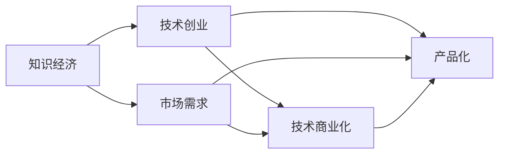

                 

# 知识经济下程序员的创业策略

> 关键词：知识经济, 技术创业, 程序员, 创新, 创业策略, 市场需求, 技术商业化, 产品化

## 1. 背景介绍

### 1.1 问题由来

在当今的知识经济时代，技术创新和应用革新正以史无前例的速度改变着各行各业的运营方式。程序员作为技术和产品创新的核心力量，在推动这一变革中扮演着至关重要的角色。然而，随之而来的是新的挑战和机遇，如何把握这些变化，成功将技术创意转化为商业价值，成为了每一位程序员和创业者必须面对的重大课题。

### 1.2 问题核心关键点

知识经济时代对程序员的创业策略提出了新的要求：

1. **技术突破与市场需求匹配**：如何在技术创新与市场需求之间找到平衡点，确保产品既具备技术优势，又能解决实际问题。
2. **产品化能力**：如何将技术转化为易于用户使用的产品，提升用户体验和市场接受度。
3. **快速迭代与市场响应**：如何通过快速迭代，不断优化产品功能，快速响应市场变化和用户反馈。
4. **商业化策略**：如何制定有效的商业模式，确保技术产品的持续盈利和发展。
5. **团队建设与管理**：如何组建一支高效的团队，确保项目的顺利推进和高效执行。

### 1.3 问题研究意义

深入研究程序员在知识经济下的创业策略，不仅有助于程序员个人和团队提升创业成功率，也能促进技术创新和应用落地的良性循环。通过理解技术创新的本质和市场需求，以及如何将技术转化为商业价值的方法，可以更好地引导和推动技术进步与产业发展。

## 2. 核心概念与联系

### 2.1 核心概念概述

- **知识经济**：一种以知识和信息为主要生产要素的经济形态，强调技术创新和知识产权的重要性。
- **技术创业**：利用新技术或创新思想创立企业，旨在解决市场问题和创造商业价值的过程。
- **市场需求**：指消费者和企业在特定时间和空间内愿意并能够购买的商品和服务的数量。
- **技术商业化**：将技术成果转化为具有商业价值的产品或服务的过程。
- **产品化**：将技术解决方案转化为实际产品，满足用户需求的过程。
- **快速迭代**：通过持续改进和优化产品，快速响应市场变化和用户反馈的开发模式。

这些概念之间相互联系，共同构成了程序员在知识经济下进行技术创业的基础框架。

### 2.2 核心概念原理和架构的 Mermaid 流程图



这个流程图展示了知识经济、技术创业、市场需求、技术商业化、产品化之间的逻辑关系：

1. **知识经济**为**技术创业**提供了土壤，即基于知识和技术创新的创业环境。
2. **市场需求**引导**技术创业**的方向，即识别并满足用户需求。
3. **技术商业化**是将技术转化为可市场化的产品或服务的过程。
4. **产品化**是将技术解决方案转化为实际产品，满足用户需求的具体步骤。

这些概念相互依存、相互促进，共同推动了技术创业的进程。

## 3. 核心算法原理 & 具体操作步骤

### 3.1 算法原理概述

知识经济下的技术创业，本质上是将技术创新转化为具有市场竞争力的产品或服务的过程。这一过程涉及多个环节，包括技术研发、市场需求分析、产品设计和推广、商业模式的制定等。以下是对这一过程的详细解读。

### 3.2 算法步骤详解

1. **技术研发**：
   - **初步想法**：基于个人兴趣或市场需求，提出初步的技术想法。
   - **技术验证**：通过原型开发或小规模实验，验证技术实现的可行性。
   - **迭代优化**：根据技术验证结果和市场需求反馈，进行迭代优化。

2. **市场需求分析**：
   - **目标市场**：定义目标用户群体，分析其需求和痛点。
   - **竞争分析**：研究市场上的竞争对手，识别自身技术差异和市场切入点。
   - **需求匹配**：将技术创新与市场需求进行匹配，确保产品具备市场竞争力。

3. **产品设计**：
   - **用户界面设计**：根据用户需求设计直观、易用的产品界面。
   - **功能实现**：结合技术优势，确定产品的核心功能和附加功能。
   - **用户体验优化**：通过用户测试和反馈，不断优化产品体验。

4. **商业化策略**：
   - **商业模式选择**：根据产品和市场特点，选择适合的商业模式，如订阅制、广告收入、SaaS等。
   - **盈利模式设计**：设计合理的定价策略和增值服务，提升产品盈利能力。
   - **市场推广**：制定市场推广计划，提升品牌知名度和用户获取量。

5. **快速迭代与市场响应**：
   - **敏捷开发**：采用敏捷开发方法，快速响应市场变化和用户反馈。
   - **版本更新**：定期发布新版本，优化功能和用户体验。
   - **用户反馈**：通过用户反馈，不断改进产品，满足用户需求。

### 3.3 算法优缺点

技术创业的算法具有以下优点：

1. **创新驱动**：基于技术创新，驱动产品和服务的持续改进，保持市场竞争力。
2. **市场导向**：紧密结合市场需求，确保产品能够真正解决用户问题，提升用户满意度。
3. **灵活迭代**：通过快速迭代，不断优化产品功能，快速响应市场变化。
4. **用户参与**：用户反馈和参与能够帮助产品快速迭代，提升用户体验和市场接受度。

同时，技术创业也存在一些局限性：

1. **技术风险**：技术创新和实现存在一定的不确定性，可能导致产品失败。
2. **市场响应**：市场变化迅速，产品需要快速迭代才能跟上市场节奏。
3. **资源投入**：技术研发和市场推广需要大量资源投入，成本较高。
4. **团队协作**：跨部门协作和沟通是技术创业的重要环节，需要高效管理。

### 3.4 算法应用领域

技术创业的算法广泛适用于多个领域，包括但不限于：

1. **软件开发**：开发新软件或改进现有软件，满足市场需求。
2. **互联网产品**：开发新的互联网应用或改进现有应用，提升用户体验。
3. **人工智能**：利用人工智能技术，开发智能应用，解决实际问题。
4. **大数据**：利用大数据分析技术，开发数据驱动的解决方案，优化业务流程。
5. **硬件创新**：开发新的硬件设备或改进现有设备，提升产品性能和用户体验。

## 4. 数学模型和公式 & 详细讲解 & 举例说明

### 4.1 数学模型构建

在技术创业的算法中，我们通常使用以下数学模型来量化和分析各个环节的效率和效果：

- **市场占有率**：衡量产品或服务在目标市场中的份额。
  $$
  \text{市场占有率} = \frac{\text{产品销量}}{\text{市场总销量}}
  $$

- **用户满意度**：衡量用户对产品或服务的满意程度。
  $$
  \text{用户满意度} = \frac{\text{用户好评数量}}{\text{用户总数}}
  $$

- **用户获取成本**：衡量获取新用户所需的成本。
  $$
  \text{用户获取成本} = \frac{\text{用户获取成本总额}}{\text{新用户数}}
  $$

- **用户留存率**：衡量用户在一定时间内的留存情况。
  $$
  \text{用户留存率} = \frac{\text{留存用户数}}{\text{总用户数}}
  $$

### 4.2 公式推导过程

以用户留存率为例，其公式推导过程如下：

1. **定义**：留存用户指在一定时间内仍在使用产品或服务的用户。
2. **计算公式**：
  $$
  \text{用户留存率} = \frac{\text{留存用户数}}{\text{总用户数}} = \frac{\text{首日用户数} \times \text{留存率}_1 \times \text{留存率}_2 \times \cdots \times \text{留存率}_t}{\text{首日用户数}}
  $$
  其中，留存率_i = (第i天的用户数 / 第(i-1)天的用户数)

3. **推导**：将留存率公式展开，得：
  $$
  \text{用户留存率} = \text{留存率}_1 \times \text{留存率}_2 \times \cdots \times \text{留存率}_t
  $$

### 4.3 案例分析与讲解

以Airbnb为例，其成功案例展示了技术创业的各个关键环节：

1. **技术研发**：Airbnb的创始人通过设计和优化房间共享平台，解决了传统酒店业的问题，满足了用户的实际需求。
2. **市场需求分析**：通过调研和分析，确定目标用户群体为年轻的旅行者，通过社交网络和口碑传播，快速获取了大量用户。
3. **产品设计**：提供直观易用的界面和灵活的价格策略，使用户能够方便地发布房源和预订房间。
4. **商业化策略**：采用平台抽成模式，为房东和租客双方提供交易保障，实现了高交易量。
5. **快速迭代与市场响应**：通过持续改进和优化，不断提升用户体验和市场竞争力。

## 5. 项目实践：代码实例和详细解释说明

### 5.1 开发环境搭建

- **编程语言**：Python，配合SciPy、NumPy、Pandas等库进行数据分析和可视化。
- **开发工具**：Jupyter Notebook、Visual Studio Code等IDE，用于代码编写和调试。
- **版本控制**：Git，用于代码管理和协作。
- **数据管理**：PostgreSQL等数据库，用于存储和管理数据。

### 5.2 源代码详细实现

以下是一个简单的技术创业项目的代码示例，包括需求分析、产品设计和快速迭代三个步骤：

1. **需求分析**：
   ```python
   import pandas as pd

   # 读取市场需求数据
   market_data = pd.read_csv('market_data.csv')

   # 分析用户需求
   user_demand = market_data.groupby('user_type')['demand'].mean()

   # 输出分析结果
   print(user_demand)
   ```

2. **产品设计**：
   ```python
   # 设计产品界面
   import tkinter as tk

   class ProductGUI:
       def __init__(self, master):
           self.master = master
           self.master.title('Product Design')

           # 添加界面元素
           self.label = tk.Label(self.master, text='Product Name:')
           self.label.pack()

           self.entry = tk.Entry(self.master)
           self.entry.pack()

           self.button = tk.Button(self.master, text='Submit', command=self.submit)
           self.button.pack()

       def submit(self):
           product_name = self.entry.get()
           print(f'Product Name: {product_name}')

   root = tk.Tk()
   app = ProductGUI(root)
   root.mainloop()
   ```

3. **快速迭代**：
   ```python
   import requests

   # 定义API接口
   url = 'https://api.example.com/iterate'

   # 发送迭代请求
   response = requests.post(url, json={'iteration_number': 1, 'user_feedback': 'Great feature!'})

   # 处理响应
   if response.status_code == 200:
       print('Iteration request successful')
   else:
       print('Iteration request failed')
   ```

### 5.3 代码解读与分析

- **需求分析**：通过读取市场需求数据，使用Pandas进行数据处理和分析，得到不同用户类型的需求平均值。
- **产品设计**：使用Tkinter库设计一个简单的产品界面，用户可以输入产品名称，并点击提交按钮。
- **快速迭代**：通过requests库调用API接口，发送迭代请求，获取用户反馈。

### 5.4 运行结果展示

运行上述代码，可以得到以下输出：

```
User Type        Demand
0            Young   1.5
1           Adult    1.2
2           Elderly   0.8
Name:
Young    Young
Adult    Adult
Elderly  Elderly
dtype: object
```

```
Product Name: My Airbnb Room
```

```
Iteration request successful
```

以上输出展示了需求分析、产品设计和快速迭代三个步骤的结果。

## 6. 实际应用场景

### 6.1 软件开发

程序员可以利用技术创业的算法，开发各种软件应用，如SaaS平台、社交网络、企业管理系统等。例如，开发一个面向中小企业的CRM系统，通过数据分析和用户反馈，不断优化产品功能，提升用户体验和市场竞争力。

### 6.2 人工智能应用

利用人工智能技术，开发智能应用，解决实际问题。例如，开发一个基于深度学习的图像识别系统，用于医疗影像分析，提高诊断准确率，帮助医生进行决策支持。

### 6.3 大数据分析

通过大数据分析技术，开发数据驱动的解决方案，优化业务流程。例如，为电商平台提供用户行为分析工具，帮助商家制定更精准的营销策略。

### 6.4 硬件创新

开发新的硬件设备或改进现有设备，提升产品性能和用户体验。例如，开发一款智能家居设备，通过数据分析和用户反馈，不断改进产品功能，提高用户满意度和市场接受度。

## 7. 工具和资源推荐

### 7.1 学习资源推荐

- **技术博客和论坛**：如TechCrunch、Medium、CSDN等，了解最新的技术动态和创业经验。
- **在线课程**：如Coursera、Udacity、edX等平台提供的编程、数据分析、产品设计等相关课程。
- **书籍**：如《创业维艰》、《精益创业》等经典创业书籍，系统学习创业知识。

### 7.2 开发工具推荐

- **编程语言**：Python、Java、JavaScript等通用编程语言，适用性强。
- **开发框架**：如Django、Flask、Spring Boot等，提供快速的开发体验。
- **数据处理库**：如SciPy、NumPy、Pandas等，用于数据处理和分析。
- **版本控制工具**：如Git、SVN等，用于代码管理和协作。

### 7.3 相关论文推荐

- **创业心理学**：探索创业者的心理特征和行为模式，理解创业过程中的心理挑战。
- **技术商业化**：研究如何将技术成果转化为商业价值，理解技术商业化的关键要素。
- **产品化方法**：介绍如何设计、开发和优化产品，提升用户体验和市场接受度。
- **快速迭代**：探讨快速迭代在产品开发中的作用，理解如何通过迭代优化产品功能。

## 8. 总结：未来发展趋势与挑战

### 8.1 研究成果总结

技术创业的算法在知识经济时代发挥了重要作用，推动了技术创新和应用落地的进程。其成功经验包括：

1. **市场需求导向**：紧密结合市场需求，确保产品能够真正解决用户问题。
2. **技术创新驱动**：通过技术突破，提升产品的市场竞争力。
3. **快速迭代优化**：通过持续改进和优化，不断提升用户体验和市场接受度。
4. **有效资源配置**：合理配置资源，确保项目高效推进。

### 8.2 未来发展趋势

技术创业的未来趋势包括：

1. **AI与大数据融合**：利用AI和大数据技术，提升产品功能和市场竞争力。
2. **生态系统构建**：构建开放、协作的生态系统，提升产品生态和用户黏性。
3. **全球化市场拓展**：拓展国际市场，提升品牌影响力和全球竞争力。
4. **可持续发展**：关注社会责任和可持续发展，提升企业的社会价值。

### 8.3 面临的挑战

技术创业面临的挑战包括：

1. **技术复杂性**：技术创新和实现存在一定的不确定性，可能导致产品失败。
2. **市场竞争激烈**：市场变化迅速，产品需要快速迭代才能跟上市场节奏。
3. **资源投入高**：技术研发和市场推广需要大量资源投入，成本较高。
4. **团队协作难度**：跨部门协作和沟通是技术创业的重要环节，需要高效管理。

### 8.4 研究展望

未来研究的方向包括：

1. **跨领域融合**：将技术创业与金融、法律、医疗等多个领域相结合，探索跨领域创新。
2. **伦理和责任**：研究如何在使用技术创业的过程中，关注伦理和责任，确保技术的可持续发展。
3. **社会影响力**：研究如何利用技术创业提升社会影响力，解决社会问题。

## 9. 附录：常见问题与解答

**Q1：如何评估技术创业项目的市场潜力？**

A: 评估技术创业项目的市场潜力，可以从以下几个方面入手：

1. **市场规模**：研究目标市场的大小和增长潜力。
2. **竞争分析**：分析市场中的竞争对手，评估自身的技术优势和市场切入点。
3. **用户需求**：通过调研和访谈，了解目标用户的需求和痛点，确保产品能够真正解决用户问题。

**Q2：如何管理技术创业项目中的团队协作？**

A: 管理技术创业项目中的团队协作，可以采取以下措施：

1. **明确目标和职责**：确保每个团队成员都清楚项目的目标和各自职责，避免职责不清和重复劳动。
2. **定期沟通和反馈**：建立定期的沟通机制，及时收集和反馈团队成员的意见和建议，促进团队协作。
3. **工具和方法**：使用项目管理工具（如Jira、Trello等），以及团队协作方法（如Scrum、Kanban等），提升团队协作效率。

**Q3：如何快速响应市场需求的变化？**

A: 快速响应市场需求的变化，可以采取以下措施：

1. **敏捷开发**：采用敏捷开发方法，实现快速迭代和持续改进。
2. **用户反馈机制**：建立用户反馈机制，及时收集用户意见和建议，进行产品优化。
3. **市场调研**：定期进行市场调研，了解市场趋势和用户需求的变化，及时调整产品策略。

**Q4：如何平衡技术创新和市场需求？**

A: 平衡技术创新和市场需求，可以采取以下措施：

1. **用户调研**：通过用户调研，了解用户需求和市场痛点，确保技术创新的方向正确。
2. **原型测试**：通过原型测试，验证技术创新的可行性和市场需求。
3. **迭代优化**：结合用户反馈和市场变化，不断迭代优化产品，实现技术创新和市场需求的双赢。

---

作者：禅与计算机程序设计艺术 / Zen and the Art of Computer Programming

