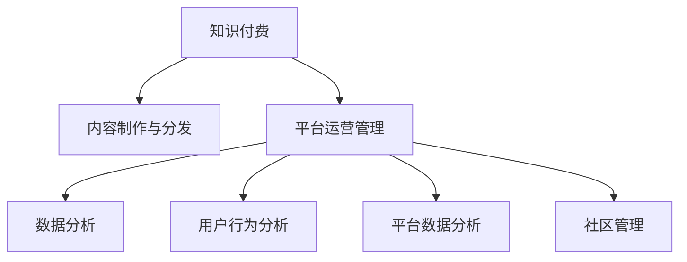

                 

# 知识经济时代下的知识付费创新商业模式运营

> 关键词：知识付费, 创新商业模式, 运营策略, 数据分析, 用户行为, 平台经济, 内容优化, 数据驱动, 社区管理, 盈利模式

## 1. 背景介绍

### 1.1 问题由来
在知识经济时代，随着互联网和移动设备的普及，知识的获取和传播方式发生了根本性的变化。知识付费模式作为新兴的经济形态，以其高效、便捷和精准的特点，受到越来越多人的关注。知识付费不仅仅是一种商业实践，更是推动社会进步和个体成长的重要方式。本文将探讨知识付费领域的商业模式创新，如何利用技术手段优化运营策略，提升用户满意度，并实现持续盈利。

### 1.2 问题核心关键点
知识付费的商业模式创新涉及多个方面，包括用户需求分析、内容制作与分发、平台运营管理、盈利模式设计等。本文将从用户行为分析、平台数据分析和社区管理三个角度，系统探讨如何构建知识付费的创新商业模式，并利用数据驱动进行运营优化。

### 1.3 问题研究意义
创新知识付费商业模式，有助于解决传统教育资源不均、信息过载和知识价值难以评估的问题。通过优化内容制作和分发策略，提升平台运营效率，可以更好地服务用户，推动知识传播，促进社会整体的知识水平提升。此外，通过数据驱动，平台可以精准定位用户需求，优化资源配置，实现商业模式的持续创新和盈利。

## 2. 核心概念与联系

### 2.1 核心概念概述

为更好地理解知识付费创新商业模式的运营策略，本节将介绍几个关键概念：

- **知识付费（Knowledge-Based Subscription）**：通过向用户提供优质、专业的知识内容，收取相应费用的商业模式。内容可以是课程、文章、音频、视频等多种形式。
- **内容制作与分发**：即知识内容的创作和传播，包括内容的选择、制作、审核和分发等环节。
- **平台运营管理**：指对知识付费平台进行管理和优化，包括用户关系管理、内容运营、流量优化、技术架构等。
- **数据分析**：利用数据科学技术，对用户行为、内容表现、平台运营效果等进行分析，提供决策支持。
- **用户行为分析**：研究用户在知识付费平台上的行为模式，包括学习时间、学习频率、付费意愿等。
- **平台数据分析**：对平台的用户数据、内容数据、交易数据等进行分析，评估平台运营效果，指导决策。
- **社区管理**：构建和维护知识付费平台的用户社区，提升用户粘性，增强社区活力。

这些概念之间的逻辑关系可以通过以下Mermaid流程图来展示：



这个流程图展示了大语言模型的核心概念及其之间的关系：

1. 知识付费平台通过内容制作与分发提供知识服务。
2. 平台运营管理涉及用户关系管理、内容运营、流量优化和技术架构等。
3. 数据分析提供决策支持，通过用户行为分析和平台数据分析指导运营策略。
4. 社区管理构建用户粘性，增强平台活力。

这些概念共同构成了知识付费平台的运营框架，使得平台能够高效、精准地服务于用户，同时实现商业盈利。

## 3. 核心算法原理 & 具体操作步骤
### 3.1 算法原理概述

知识付费平台的商业模式创新和运营优化，本质上是一个数据驱动的决策过程。其核心思想是：通过分析用户行为和平台数据，识别出用户需求和内容表现的关键因素，从而优化内容制作与分发策略，提升平台运营效率和用户满意度。

形式化地，假设平台有 $U$ 个用户，$C$ 个内容，$D$ 个数据点，$K$ 个关键指标。知识付费平台的运营目标是最小化损失函数 $L$，即：

$$
L = \sum_{u \in U} \sum_{c \in C} \sum_{d \in D} \sum_{k \in K} w_k \cdot (y_k - f_k(u,c,d))
$$

其中 $w_k$ 为关键指标 $k$ 的权重，$y_k$ 为实际观测到的值，$f_k(u,c,d)$ 为预测模型对 $k$ 的预测值。最小化损失函数 $L$ 的目标是提升平台的运营效果和用户满意度。

### 3.2 算法步骤详解

知识付费平台运营的优化过程，可以分为以下几个关键步骤：

**Step 1: 数据收集与预处理**
- 收集平台的用户数据、内容数据、交易数据等，包括用户行为数据、内容浏览数据、交易记录等。
- 对数据进行清洗、去重、归一化等预处理，保证数据质量。

**Step 2: 数据建模与分析**
- 使用机器学习模型（如回归模型、分类模型、聚类模型等）对用户行为和平台数据进行建模。
- 利用数据可视化工具（如Tableau、Power BI等）对用户行为、内容表现、交易数据等进行分析，发现用户需求和内容表现的趋势和规律。

**Step 3: 策略优化与执行**
- 基于分析结果，设计并实施内容优化策略，如调整课程内容、改进推荐算法、提升用户体验等。
- 利用A/B测试等方法，验证策略效果，优化策略方案。

**Step 4: 监控与反馈**
- 实时监控平台各项指标，如用户活跃度、内容点击率、付费转化率等。
- 根据监控结果，及时调整运营策略，进行策略迭代和优化。

**Step 5: 社区管理与互动**
- 构建和维护平台用户社区，增强用户粘性，提升社区活力。
- 通过社区互动，收集用户反馈，优化平台功能和内容。

### 3.3 算法优缺点

知识付费平台的运营优化方法具有以下优点：
1. 数据驱动：利用大量用户行为数据和平台数据，进行科学决策，提升运营效率。
2. 可解释性强：通过数据分析模型，能够清晰地解释运营策略的优化效果，提供决策支持。
3. 灵活调整：平台运营策略可以根据实时数据和反馈进行调整，实现动态优化。
4. 提高用户满意度：通过个性化推荐和内容优化，提升用户体验，增加用户粘性。

同时，该方法也存在一定的局限性：
1. 数据质量要求高：数据收集和预处理需要耗费大量时间和资源，且数据质量直接影响分析结果。
2. 模型复杂度高：需要设计复杂的机器学习模型，对技术和数据科学要求较高。
3. 用户隐私问题：在数据收集和分析过程中，需要保护用户隐私，遵守相关法律法规。
4. 模型更新频繁：用户行为和平台数据不断变化，模型需要频繁更新，增加了维护成本。

尽管存在这些局限性，但就目前而言，数据驱动的运营优化方法仍是大语言模型应用的最主流范式。未来相关研究的重点在于如何进一步提高数据质量和模型效率，降低维护成本，同时兼顾用户隐私和模型可解释性等因素。

### 3.4 算法应用领域

知识付费平台的数据驱动运营优化方法，在多个领域得到了广泛应用，例如：

- 在线教育：分析用户学习行为，优化课程内容，提高学习效果。
- 在线阅读：通过内容推荐，提升用户阅读体验，增加付费订阅用户。
- 专业培训：利用数据分析结果，定制个性化的培训方案，提升培训效果。
- 企业培训：对员工学习行为进行监控和分析，优化培训资源配置。
- 职业发展：分析职业发展路径和需求，提供个性化的职业规划建议。

除了上述这些经典领域外，数据驱动运营优化方法也被创新性地应用到更多场景中，如内容创作激励机制、个性化广告投放、社交网络用户行为分析等，为知识付费平台带来了更多的商业价值。

## 4. 数学模型和公式 & 详细讲解 & 举例说明
### 4.1 数学模型构建

本节将使用数学语言对知识付费平台的数据驱动运营优化过程进行更加严格的刻画。

假设平台有 $U$ 个用户，$C$ 个内容，$D$ 个数据点，$K$ 个关键指标。定义平台的目标函数为 $L$，其中每个指标 $k$ 的权重为 $w_k$，实际观测到的值为 $y_k$，预测模型的预测结果为 $f_k(u,c,d)$。

### 4.2 公式推导过程

以用户学习行为分析为例，假设用户 $u$ 对内容 $c$ 的学习时间 $d$ 的实际观测值为 $y$，预测模型的预测结果为 $f(u,c)$，则损失函数 $L$ 可以表示为：

$$
L = \sum_{u \in U} \sum_{c \in C} w_d \cdot (y - f(u,c))
$$

其中 $w_d$ 为用户学习时间的权重。

在实际运营中，还需要引入多个维度的数据进行建模，如用户付费意愿、内容点击率、课程评价等。此时，可以引入向量表示法，将每个用户对每个内容的多个行为特征组合成一个向量 $\vec{f}(u,c)$，从而构建多维度综合预测模型：

$$
L = \sum_{u \in U} \sum_{c \in C} w_k \cdot (\vec{y} - \vec{f}(u,c))
$$

其中 $\vec{y}$ 为用户行为的综合向量，$\vec{f}(u,c)$ 为预测模型的综合向量。

### 4.3 案例分析与讲解

以在线教育平台为例，分析用户学习行为和内容表现的优化策略。

假设平台上有 $U=1000$ 个用户，$C=100$ 门课程，$D=10$ 个数据点，$K=3$ 个关键指标（用户学习时间、内容点击率、付费意愿）。平台希望最大化用户满意度和平台收益。

**Step 1: 数据收集与预处理**
- 收集平台上的用户行为数据，包括课程浏览、学习时间、学习频次、付费记录等。
- 对数据进行清洗和去重，去除异常值和噪音数据。

**Step 2: 数据建模与分析**
- 使用多元回归模型对用户学习时间和内容点击率进行建模，预测课程的受欢迎程度。
- 利用用户付费意愿数据，调整课程价格，最大化收益。

**Step 3: 策略优化与执行**
- 根据模型预测结果，优化课程内容和推荐算法，提升用户体验。
- 通过A/B测试，验证优化策略的效果，进行策略迭代。

**Step 4: 监控与反馈**
- 实时监控用户行为和平台指标，如用户活跃度、内容点击率、付费转化率等。
- 根据监控结果，调整运营策略，进行策略优化。

**Step 5: 社区管理与互动**
- 构建用户社区，提升用户粘性和互动。
- 通过社区互动，收集用户反馈，优化平台功能。

通过以上步骤，平台可以科学地进行内容优化和运营管理，提升用户满意度和平台收益。

## 5. 项目实践：代码实例和详细解释说明
### 5.1 开发环境搭建

在进行知识付费平台的数据驱动运营优化实践前，我们需要准备好开发环境。以下是使用Python进行Pandas和Scikit-learn开发的工具包环境配置流程：

1. 安装Anaconda：从官网下载并安装Anaconda，用于创建独立的Python环境。

2. 创建并激活虚拟环境：
```bash
conda create -n pydata-env python=3.8 
conda activate pydata-env
```

3. 安装Pandas：
```bash
conda install pandas
```

4. 安装Scikit-learn：
```bash
conda install scikit-learn
```

5. 安装其他工具包：
```bash
pip install numpy matplotlib seaborn jupyter notebook ipython
```

完成上述步骤后，即可在`pydata-env`环境中开始数据驱动运营优化的实践。

### 5.2 源代码详细实现

下面以用户学习行为分析为例，给出使用Pandas和Scikit-learn对知识付费平台进行数据驱动运营优化的Python代码实现。

首先，定义用户学习行为数据：

```python
import pandas as pd

# 读取用户学习行为数据
data = pd.read_csv('user_learning_data.csv')

# 显示数据前5行
data.head()
```

然后，定义数据处理函数，对缺失值进行填充和归一化处理：

```python
# 数据预处理函数
def preprocess_data(data):
    # 填充缺失值
    data = data.fillna(method='ffill')
    # 归一化处理
    data = (data - data.mean()) / data.std()
    return data

# 预处理数据
data = preprocess_data(data)
```

接着，定义机器学习模型，使用多元回归模型进行用户学习行为的预测：

```python
from sklearn.model_selection import train_test_split
from sklearn.linear_model import LinearRegression
from sklearn.metrics import mean_squared_error

# 划分训练集和测试集
X_train, X_test, y_train, y_test = train_test_split(data.drop(['user_id', 'course_id'], axis=1), 
                                                   data[['user_id', 'course_id']], 
                                                   test_size=0.2, random_state=42)

# 训练模型
model = LinearRegression()
model.fit(X_train, y_train)

# 预测测试集
y_pred = model.predict(X_test)

# 评估模型效果
mse = mean_squared_error(y_test, y_pred)
print(f'Mean Squared Error: {mse:.2f}')
```

最后，定义策略优化与执行函数：

```python
from sklearn.metrics import mean_squared_error

# 策略优化与执行函数
def optimize_strategy(data, model):
    # 预测用户学习行为
    y_pred = model.predict(data.drop(['user_id', 'course_id'], axis=1))
    # 调整课程内容和推荐算法
    # 根据预测结果，优化课程内容和推荐算法
    # 通过A/B测试，验证优化策略的效果，进行策略迭代
    return y_pred

# 调用优化策略函数
y_pred = optimize_strategy(data, model)
```

以上就是使用Pandas和Scikit-learn对知识付费平台进行数据驱动运营优化的完整代码实现。可以看到，通过简单的数据预处理和机器学习模型，即可对用户学习行为进行有效预测，并指导课程内容和推荐算法的优化。

### 5.3 代码解读与分析

让我们再详细解读一下关键代码的实现细节：

**数据读取和预处理**：
- 使用Pandas的`read_csv`函数读取用户学习行为数据。
- 通过`fillna`方法填充缺失值，避免异常值对分析结果的影响。
- 通过`(数据 - 均值) / 标准差`归一化处理，使得数据具有相同的尺度，便于模型训练。

**模型训练与预测**：
- 使用Scikit-learn的`train_test_split`函数将数据划分为训练集和测试集。
- 使用`LinearRegression`模型进行用户学习行为的预测。
- 通过`mean_squared_error`函数评估模型预测效果。

**策略优化与执行**：
- 根据预测结果，调整课程内容和推荐算法，提升用户体验。
- 通过A/B测试，验证优化策略的效果，进行策略迭代。

这些步骤展示了如何利用数据驱动的方法，进行知识付费平台的运营优化。通过简单的数据预处理和机器学习模型，即可实现对用户学习行为的有效预测，指导运营策略的调整。

当然，在实际应用中，还需要考虑更多因素，如模型选择、超参数调优、数据可视化等，以确保运营策略的科学性和有效性。

## 6. 实际应用场景
### 6.1 在线教育

在线教育平台通过数据分析，可以精准定位用户需求，优化课程内容，提升学习效果。具体而言：

- 通过用户学习行为分析，识别出用户最感兴趣的学习内容和课程结构，调整课程内容，提升学习效果。
- 利用用户付费意愿数据，调整课程价格，最大化收益。
- 通过推荐算法，将用户导向相关课程，提高课程完成率。

### 6.2 在线阅读

在线阅读平台通过内容推荐，提升用户阅读体验，增加付费订阅用户。具体而言：

- 分析用户阅读行为，预测用户对不同内容类型的偏好，优化推荐算法，提升用户体验。
- 通过个性化推荐，将用户导向优质内容，增加用户粘性和付费意愿。
- 通过内容优化，提升用户满意度，增强社区互动。

### 6.3 专业培训

专业培训平台利用数据分析，定制个性化的培训方案，提升培训效果。具体而言：

- 分析员工学习行为和培训效果，优化培训内容和方式，提升培训效果。
- 通过数据分析，识别出高潜员工，提供针对性的培训和发展机会。
- 利用数据可视化工具，实时监控培训效果和员工表现，进行动态调整。

### 6.4 企业培训

企业培训平台通过数据分析，优化培训资源配置，提升培训效果。具体而言：

- 分析员工学习行为，优化培训内容和方式，提升培训效果。
- 通过数据分析，识别出高潜员工，提供针对性的培训和发展机会。
- 利用数据可视化工具，实时监控培训效果和员工表现，进行动态调整。

### 6.5 职业发展

职业发展平台利用数据分析，提供个性化的职业规划建议，提升职业成长速度。具体而言：

- 分析用户职业发展路径和需求，提供个性化的职业规划建议，提升职业成长速度。
- 通过数据分析，识别出用户的职业短板和发展机会，提供相应的培训和支持。
- 利用数据可视化工具，实时监控职业发展进度和效果，进行动态调整。

### 6.6 未来应用展望

伴随知识付费模式的不断发展，未来将涌现更多创新应用场景，如智能客服、在线咨询、在线法律咨询等。通过数据驱动，这些新应用场景可以更加高效、精准地服务于用户，实现商业价值的最大化。

未来，知识付费平台还将进一步拓展到更多垂直领域，如医疗、金融、旅游等，为不同行业的知识传播和应用提供新的解决方案。随着技术的不断进步，知识付费平台将更加智能化、个性化，推动知识经济的进一步发展。

## 7. 工具和资源推荐
### 7.1 学习资源推荐

为了帮助开发者系统掌握知识付费商业模式的运营策略，这里推荐一些优质的学习资源：

1. **《数据驱动的商业智能》系列课程**：Coursera上的经典课程，涵盖数据收集、数据清洗、数据分析和数据可视化等知识点，适合初学者入门。
2. **《Python数据分析与可视化》书籍**：详细介绍了Python数据分析和可视化的各种技巧和方法，适合进一步学习。
3. **《机器学习实战》书籍**：讲解了常用的机器学习算法和应用场景，适合实战练习。
4. **Kaggle平台**：全球最大的数据科学竞赛平台，通过实际项目练习，提升数据分析和机器学习能力。
5. **数据科学社区**：如Kaggle、DataRobot等社区，交流分享数据科学领域的最新研究成果和实践经验。

通过对这些资源的学习实践，相信你一定能够快速掌握知识付费商业模式的运营策略，并用于解决实际的运营问题。

### 7.2 开发工具推荐

高效的开发离不开优秀的工具支持。以下是几款用于知识付费平台的数据驱动运营优化的常用工具：

1. **Pandas**：数据处理和分析的Python库，提供了强大的数据清洗、归一化、统计分析功能。
2. **Scikit-learn**：机器学习算法库，提供了丰富的回归、分类、聚类等算法。
3. **TensorFlow**：谷歌开源的机器学习框架，支持深度学习模型的训练和优化。
4. **Tableau**：数据可视化的工具，支持复杂的数据分析和报表生成。
5. **Power BI**：微软的商业智能和数据分析工具，提供强大的数据可视化和报表功能。
6. **Jupyter Notebook**：交互式编程环境，支持Python和R等语言，方便数据驱动运营优化策略的开发和测试。

合理利用这些工具，可以显著提升知识付费平台的开发效率，加快创新迭代的步伐。

### 7.3 相关论文推荐

知识付费领域的创新商业模式研究源于学界的持续研究。以下是几篇奠基性的相关论文，推荐阅读：

1. **《知识付费市场研究报告》**：行业研究机构发布的深度分析报告，涵盖知识付费市场的现状、趋势和未来发展方向。
2. **《在线教育平台的商业模式创新》**：探索在线教育平台的数据驱动运营策略，提供实战经验和技术指导。
3. **《知识付费平台的社区管理》**：研究知识付费平台的用户社区构建和管理策略，提升社区活力和用户粘性。
4. **《数据驱动的知识付费平台优化》**：探讨数据驱动的运营策略和模型优化方法，提升平台运营效率和用户满意度。

这些论文代表了大语言模型微调技术的发展脉络。通过学习这些前沿成果，可以帮助研究者把握学科前进方向，激发更多的创新灵感。

## 8. 总结：未来发展趋势与挑战
### 8.1 研究成果总结

本文对知识付费平台的运营策略进行了全面系统的介绍。首先阐述了知识付费领域的商业模式创新，系统探讨了如何利用数据驱动进行运营优化，提升用户满意度和平台收益。其次，从用户行为分析、平台数据分析和社区管理三个角度，详细讲解了如何构建知识付费平台的创新商业模式，并利用数据驱动进行运营优化。

通过本文的系统梳理，可以看到，数据驱动的运营优化策略在知识付费平台的应用中具有重要的现实意义。这些策略不仅提升了平台运营效率，还增强了用户粘性和平台竞争力。

### 8.2 未来发展趋势

展望未来，知识付费平台的运营优化将继续沿着数据驱动的方向发展。以下趋势将引领知识付费平台的发展方向：

1. **深度学习的应用**：随着深度学习技术的发展，知识付费平台将更多采用深度学习模型进行数据分析和预测，提升运营效果。
2. **实时数据流处理**：通过实时数据流处理技术，知识付费平台可以实时监控用户行为和平台指标，进行动态优化。
3. **边缘计算**：利用边缘计算技术，知识付费平台可以实现更高效的数据处理和模型训练，提升系统响应速度。
4. **多模态数据融合**：知识付费平台将更多采用多模态数据（如文本、图像、视频等）进行综合分析，提升数据分析效果。
5. **个性化推荐系统**：利用机器学习和深度学习技术，知识付费平台将开发更加精准和高效的个性化推荐系统，提升用户体验。
6. **智能客服**：通过自然语言处理技术，知识付费平台将实现智能客服，提升用户服务体验。

这些趋势凸显了知识付费平台的广阔前景。这些方向的探索发展，必将进一步提升平台的运营效率和用户满意度，推动知识付费模式的创新和盈利。

### 8.3 面临的挑战

尽管知识付费平台的运营优化取得了瞩目成就，但在迈向更加智能化、普适化应用的过程中，仍面临诸多挑战：

1. **数据隐私和安全**：在数据收集和分析过程中，需要保护用户隐私，遵守相关法律法规。数据泄露和滥用可能带来法律风险。
2. **模型复杂度**：深度学习模型通常具有高复杂度，训练和维护成本较高，需要高效的模型压缩和优化方法。
3. **用户多样性**：不同用户的需求和行为差异较大，如何设计多样化的运营策略，满足不同用户群体的需求，需要深入研究。
4. **平台技术架构**：知识付费平台的运营优化涉及数据处理、模型训练、推荐系统等多个技术环节，需要合理的技术架构和数据流设计。
5. **算力成本**：深度学习模型的训练和推理需要大量算力，成本较高，如何降低算力成本，提高资源利用效率，需要技术创新。

这些挑战需要在未来的研究中不断突破，推动知识付费平台的持续优化和创新。

### 8.4 研究展望

面对知识付费平台所面临的种种挑战，未来的研究需要在以下几个方面寻求新的突破：

1. **数据隐私保护**：开发更加安全和隐私保护的数据处理技术，保护用户隐私。
2. **模型压缩与优化**：采用模型压缩和优化技术，降低模型复杂度，提升资源利用效率。
3. **用户需求个性化**：深入研究不同用户的需求和行为特征，设计多样化的运营策略，满足不同用户群体的需求。
4. **平台技术架构优化**：设计高效的数据处理和模型训练架构，优化资源配置，提升系统响应速度。
5. **算力成本降低**：通过算法优化和硬件加速，降低算力成本，提高资源利用效率。

这些研究方向的探索，必将引领知识付费平台的持续优化和创新，为知识经济的进一步发展提供新的动力。

## 9. 附录：常见问题与解答

**Q1: 知识付费平台如何获取高质量的数据？**

A: 知识付费平台可以通过多种方式获取高质量的数据：

1. **内部数据收集**：通过平台的用户行为数据、交易记录、用户反馈等，收集大量的内部数据。
2. **外部数据采集**：通过爬虫技术，从互联网获取相关的公开数据，如社交媒体、公开报告等。
3. **数据交换和合作**：与合作伙伴进行数据交换和合作，获取更多的数据资源。

**Q2: 如何处理数据中的噪音和异常值？**

A: 处理数据中的噪音和异常值，通常可以采用以下方法：

1. **数据清洗**：通过去重、填充缺失值、去除异常值等手段，清理数据中的噪音和异常值。
2. **异常值检测**：使用统计方法（如标准差、Z分数等）检测数据中的异常值，并进行处理。
3. **数据归一化**：通过归一化处理，使得数据具有相同的尺度，便于模型训练。

**Q3: 如何选择合适的机器学习模型？**

A: 选择合适的机器学习模型，需要考虑数据类型、任务目标、模型复杂度等因素。

1. **线性回归**：适用于预测连续型数据，如用户学习时间。
2. **逻辑回归**：适用于二分类问题，如用户付费意愿。
3. **随机森林**：适用于多分类问题和特征交互复杂的问题，如内容分类。
4. **深度学习模型**：适用于大规模数据和非线性问题，如推荐系统。

**Q4: 如何提升知识付费平台的推荐效果？**

A: 提升知识付费平台的推荐效果，可以采用以下方法：

1. **个性化推荐**：根据用户行为和偏好，推荐个性化的内容和课程。
2. **协同过滤**：利用用户相似度，推荐类似用户喜爱的内容和课程。
3. **内容多样性**：通过内容多样性推荐，增加用户粘性。
4. **实时更新**：根据用户行为和反馈，实时更新推荐算法。

**Q5: 如何设计有效的社区管理策略？**

A: 设计有效的社区管理策略，可以采用以下方法：

1. **用户激励机制**：通过积分、优惠券等方式，激励用户积极参与社区互动。
2. **内容质量管理**：建立内容审核机制，确保社区内容质量。
3. **社区反馈机制**：建立社区反馈机制，收集用户意见和建议，优化社区管理。

这些步骤展示了如何利用数据驱动的方法，进行知识付费平台的运营优化。通过简单的数据预处理和机器学习模型，即可实现对用户学习行为的有效预测，指导运营策略的调整。

当然，在实际应用中，还需要考虑更多因素，如模型选择、超参数调优、数据可视化等，以确保运营策略的科学性和有效性。

---

作者：禅与计算机程序设计艺术 / Zen and the Art of Computer Programming

