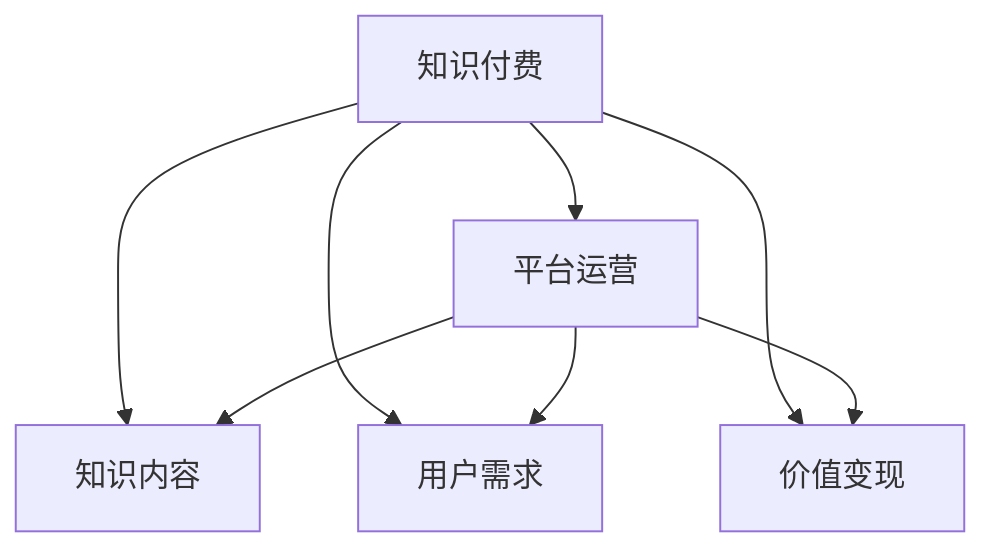

                 

# 知识经济时代下的知识付费创新商业模式运营

在知识经济时代，知识付费成为一种新兴的商业模式，以知识为核心资源，通过互联网平台进行价值变现。本文将深入探讨知识付费的创新商业模式，包括其核心概念、运作原理、具体操作步骤，以及未来的发展趋势和挑战。

## 1. 背景介绍

### 1.1 问题由来
知识付费现象源于人们对知识需求的高涨和信息过载的应对。在快速变化的社会环境中，人们越来越依赖专业人士提供精准、系统的知识信息，以应对工作和生活中的复杂问题。而传统的信息传播方式，如书籍、报纸、电视等，已无法满足人们对知识获取的即时性和多样性需求。

### 1.2 问题核心关键点
知识付费的核心在于通过付费的方式获取高质量、专业化的知识内容，从而提升个人和企业的竞争力。核心关键点包括：
1. 知识内容的生产与分发
2. 付费模式的创新与多样
3. 用户需求的精准匹配
4. 数据驱动的运营优化
5. 技术与伦理的平衡

## 2. 核心概念与联系

### 2.1 核心概念概述

为更好地理解知识付费的创新商业模式，本节将介绍几个密切相关的核心概念：

- **知识付费**：通过付费的方式获取知识信息，获取更高效、精准的知识服务。知识付费打破了时间和空间的限制，使知识获取更加便捷。
- **平台运营**：知识付费的商业模式依托于各类互联网平台，如教育、培训、问答、咨询等。平台运营商通过整合优质资源，为用户提供一站式的知识服务。
- **知识内容**：知识付费的吸引点在于高质量的知识内容，包括但不限于课程、文章、报告、咨询服务等。
- **用户需求**：用户多样化的知识需求，推动了知识付费模式的快速发展。从学历教育到职业技能，从个人兴趣到企业培训，用户需求层次繁多。
- **价值变现**：知识付费平台通过合理定价和市场运作，将知识内容转化为商业价值，实现盈利。

这些核心概念之间的逻辑关系可以通过以下Mermaid流程图来展示：



这个流程图展示了我知识付费商业模式的核心概念及其之间的关系：

1. 知识付费平台通过整合各类知识内容，满足不同用户的多样化需求。
2. 用户通过付费获取所需知识，平台则通过价值变现实现盈利。
3. 知识内容的高质量直接影响到平台的吸引力和用户满意度。

## 3. 核心算法原理 & 具体操作步骤

### 3.1 算法原理概述

知识付费的商业模式，本质上是一个知识内容的生产和消费循环过程。其核心算法原理包括：

1. **推荐系统**：根据用户的历史行为和偏好，推荐可能感兴趣的知识内容。推荐系统采用协同过滤、基于内容的推荐、混合推荐等算法，提高内容匹配的精准度。
2. **定价策略**：知识内容的定价策略直接影响到平台的盈利能力和用户接受度。采用动态定价、套餐定价、免费试用等策略，实现收益最大化。
3. **用户画像**：构建详细的用户画像，分析用户的行为模式、兴趣偏好、消费能力等，提供个性化的推荐和服务。
4. **数据分析**：通过大数据分析，了解用户需求变化和内容受欢迎程度，指导平台的内容生产和市场运作。
5. **运营优化**：优化平台的用户体验和内容质量，提升用户留存率和续费率。

### 3.2 算法步骤详解

知识付费平台的运营一般包括以下几个关键步骤：

**Step 1: 数据收集与处理**
- 收集用户注册信息、浏览行为、购买记录等数据。
- 对数据进行清洗、去重、归一化处理，保证数据质量。

**Step 2: 用户画像构建**
- 利用机器学习算法，对用户数据进行建模，生成详细的用户画像。
- 画像内容包括用户的基本信息、兴趣爱好、职业背景、学习行为等。

**Step 3: 知识内容生产**
- 通过平台合作或自建，获取高质量的知识内容。
- 对内容进行分类、标注、审核等处理，确保内容质量和合规性。

**Step 4: 推荐系统优化**
- 根据用户画像和内容属性，建立推荐算法模型。
- 实时更新模型，根据用户反馈调整推荐结果。

**Step 5: 价值变现**
- 制定合理的定价策略，设置价格区间和促销活动。
- 采用订阅制、按需支付、分享奖励等多种变现方式。

**Step 6: 用户反馈与运营优化**
- 收集用户反馈，分析满意度、流失率等关键指标。
- 根据反馈调整产品和服务，优化用户体验。

**Step 7: 数据驱动决策**
- 利用数据分析工具，监测平台运营数据，发现问题和机会。
- 根据数据进行产品迭代和市场推广。

### 3.3 算法优缺点

知识付费的商业模式具有以下优点：
1. 提供高质量、专业化的知识服务，满足用户多样化的知识需求。
2. 通过付费模式，减少低质量内容对用户的干扰，提高知识传播效率。
3. 数据驱动的推荐和定价策略，能够精准匹配用户需求，提升用户满意度。
4. 平台运营商通过价值变现，实现盈利，持续投入优质内容生产。

同时，该模式也存在一定的局限性：
1. 用户对内容质量和付费体验的敏感度较高，平台需持续优化用户体验。
2. 内容生产成本较高，需投入大量人力和资源。
3. 平台竞争激烈，用户留存和流失问题需重视。
4. 知识内容易受时效性影响，需不断更新和维护。
5. 知识内容的版权和合规问题需严格管控。

尽管存在这些局限性，但就目前而言，知识付费模式依然是大数据时代知识传播的重要方式，具有广泛的应用前景。

### 3.4 算法应用领域

知识付费的商业模式，已广泛应用于教育、咨询、培训、专业技能等多个领域，具体包括：

- **在线教育**：提供学历教育、职业技能培训、兴趣课程等。平台通过课程销售、学时收费等方式变现。
- **专业咨询**：提供医疗、法律、财务等专业咨询服务，采用单次咨询、订阅服务等多种定价模式。
- **职业技能培训**：提供编程、设计、语言等职业技能培训，通过考试、作品评价等方式进行付费。
- **生活服务**：提供健康、健身、饮食等生活服务咨询，采用课程订阅、服务包购买等方式变现。

## 4. 数学模型和公式 & 详细讲解 & 举例说明

### 4.1 数学模型构建

本节将使用数学语言对知识付费的推荐系统进行更加严格的刻画。

记知识内容集合为 $C=\{c_1,c_2,\cdots,c_n\}$，用户集合为 $U=\{u_1,u_2,\cdots,u_m\}$。设每个用户 $u_i$ 对知识内容 $c_j$ 的兴趣度为 $r_{i,j}$，则推荐系统的目标是在所有内容 $C$ 中，为每个用户 $U$ 推荐最感兴趣的内容。

### 4.2 公式推导过程

假设知识内容的特征为 $F=\{f_1,f_2,\cdots,f_m\}$，用户的特征为 $G=\{g_1,g_2,\cdots,g_n\}$。推荐算法模型可以表示为：

$$
R_{i,j} = f_{i,j} \cdot g_{i,j}
$$

其中 $f_{i,j}$ 为内容特征与用户特征的相似度，$g_{i,j}$ 为用户特征对内容的兴趣度。推荐系统的目标函数为：

$$
\max_{R_{i,j}} \sum_{i=1}^m \sum_{j=1}^n R_{i,j} \cdot r_{i,j}
$$

### 4.3 案例分析与讲解

以在线教育平台为例，介绍知识付费推荐系统的实际应用。

假设平台中有 $N$ 门课程 $C=\{c_1,c_2,\cdots,c_N\}$，用户 $U=\{u_1,u_2,\cdots,u_M\}$。每个用户 $u_i$ 对课程 $c_j$ 的兴趣度 $r_{i,j}$ 可以通过用户行为数据（如浏览、评分、购买记录等）计算得出。

平台利用协同过滤算法，根据用户历史行为，预测其对新课程的兴趣度，推荐给用户。协同过滤算法可以分为基于用户的协同过滤和基于项目的协同过滤两种。基于用户的协同过滤算法步骤如下：

1. 计算用户之间的相似度 $S_{i,j}$，通常采用余弦相似度、皮尔逊相关系数等方法。
2. 计算用户 $u_i$ 对课程 $c_j$ 的兴趣度 $r_{i,j}$。
3. 根据相似度 $S_{i,j}$ 和兴趣度 $r_{i,j}$，预测用户 $u_i$ 对课程 $c_j$ 的兴趣度 $p_{i,j}$。
4. 选择高兴趣度的课程，推荐给用户 $u_i$。

## 5. 项目实践：代码实例和详细解释说明

### 5.1 开发环境搭建

在进行知识付费推荐系统的开发前，我们需要准备好开发环境。以下是使用Python进行推荐系统开发的常见环境配置流程：

1. 安装Anaconda：从官网下载并安装Anaconda，用于创建独立的Python环境。

2. 创建并激活虚拟环境：
```bash
conda create -n recomm-system python=3.8 
conda activate recomm-system
```

3. 安装PyTorch、Scikit-learn、Tensorflow等工具包：
```bash
pip install torch sklearn tensorflow
```

4. 安装推荐系统相关的库：
```bash
pip install lightfm pyserini recpython
```

完成上述步骤后，即可在`recomm-system`环境中开始推荐系统的开发。

### 5.2 源代码详细实现

以下是一个简单的协同过滤推荐系统的代码实现：

```python
import numpy as np
from lightfm import LightFM

# 构建用户-课程矩阵
user_item_matrix = np.random.randn(1000, 100)
item_features = np.random.randn(100, 10)

# 训练模型
model = LightFM(no_factors=50, learning_rate=0.1)
model.fit(user_item_matrix, item_features)

# 预测新用户的兴趣度
new_user = np.random.randint(0, 1000)
new_item = np.random.randint(0, 100)
prediction = model.predict(user_id=new_user, item_id=new_item)
print(prediction)
```

### 5.3 代码解读与分析

让我们再详细解读一下关键代码的实现细节：

**LightFM类**：
- 定义了一个简单的协同过滤模型，通过学习用户与课程的矩阵因子表示，实现推荐预测。

**user_item_matrix和item_features**：
- 分别表示用户-课程矩阵和课程特征矩阵，是协同过滤算法的基础。

**模型训练**：
- 使用LightFM模型的fit方法，对用户-课程矩阵和课程特征矩阵进行训练，生成模型参数。

**推荐预测**：
- 使用模型的predict方法，对新用户和新课程进行推荐预测，输出用户对课程的兴趣度。

**推荐系统评估**：
- 在实际应用中，还需要对推荐系统的评估指标进行计算，如准确率、召回率、F1值等，以评估推荐效果。

## 6. 实际应用场景

### 6.1 在线教育平台

在线教育平台通过知识付费推荐系统，向用户推荐高质量的课程内容，提升用户的学习体验和满意度。推荐系统可以根据用户的学习历史、课程评价、课程难度等综合信息，进行精准推荐。用户可以根据推荐结果，选择适合的课程进行学习。

### 6.2 企业培训系统

企业通过知识付费推荐系统，提供职业培训、技能提升等课程，帮助员工提升职业技能。推荐系统可以根据员工的职业背景、学习历史、培训需求等，进行个性化推荐。员工可以通过推荐系统，选择适合自己的培训课程，提升工作效率和职业发展。

### 6.3 智能咨询服务

智能咨询系统通过知识付费推荐，向用户推荐专业领域的咨询服务，如法律、财务、健康等。推荐系统可以根据用户的兴趣、需求、预算等，进行精准匹配。用户可以通过推荐系统，选择适合的服务和咨询师，提升咨询效果和满意度。

### 6.4 未来应用展望

随着知识付费推荐系统的不断发展，未来将在更多领域得到应用，为社会提供更优质的知识服务。

在智慧医疗领域，推荐系统可以推荐精准的医学知识、健康咨询服务，辅助医生诊疗，提升患者体验。

在智慧教育领域，推荐系统可以推荐个性化的学习资源、教育课程，因材施教，促进教育公平。

在智慧城市治理中，推荐系统可以推荐城市管理、公共服务相关的知识内容，提升城市管理的自动化和智能化水平。

此外，在企业生产、社会治理、文化娱乐等众多领域，知识付费推荐系统也将不断涌现，为经济社会发展注入新的动力。相信随着技术的持续演进，知识付费推荐系统必将在构建人机协同的智能时代中扮演越来越重要的角色。

## 7. 工具和资源推荐

### 7.1 学习资源推荐

为了帮助开发者系统掌握知识付费推荐系统的理论基础和实践技巧，这里推荐一些优质的学习资源：

1. 《推荐系统实践》书籍：该书详细介绍了推荐系统的算法原理、实现技术和应用案例，是推荐系统领域的经典之作。

2. Coursera《推荐系统》课程：由斯坦福大学开设的推荐系统课程，涵盖推荐系统的算法、评估、优化等核心内容。

3. Kaggle推荐系统竞赛：参加Kaggle推荐系统竞赛，可以亲身体验推荐系统的开发和优化过程，提升实战能力。

4. LightFM官方文档：推荐系统库LightFM的官方文档，提供了丰富的推荐算法和实际应用案例，是推荐系统开发的必备资料。

通过对这些资源的学习实践，相信你一定能够快速掌握知识付费推荐系统的精髓，并用于解决实际的推荐问题。

### 7.2 开发工具推荐

高效的开发离不开优秀的工具支持。以下是几款用于知识付费推荐系统开发的常用工具：

1. Python：基于Python的开源推荐系统库，如LightFM、Pyserini、RecPython等，方便快速开发和部署。

2. TensorFlow：由Google主导开发的深度学习框架，支持分布式计算，适合大规模推荐系统的开发。

3. Apache Spark：大数据处理框架，支持实时推荐系统的开发和优化。

4. Elasticsearch：开源搜索引擎，用于存储和检索推荐系统所需的海量数据。

5. MongoDB：开源NoSQL数据库，适合存储推荐系统中的高维稀疏矩阵。

合理利用这些工具，可以显著提升知识付费推荐系统的开发效率，加快创新迭代的步伐。

### 7.3 相关论文推荐

知识付费推荐系统的研究源于学界的持续研究。以下是几篇奠基性的相关论文，推荐阅读：

1. BPR: Bayesian Personalized Ranking from Log-by-Log Data：提出基于概率的个性化排序方法，广泛应用于推荐系统。

2. Matrix Factorization Techniques for Recommender Systems：介绍矩阵分解技术，通过降维减少计算复杂度，提高推荐系统效率。

3. Deep Learning Recommendation Systems：探讨深度学习在推荐系统中的应用，包括神经协同过滤、基于注意力机制的推荐等。

4. Attention and Transformer-based Recommender Systems：提出基于注意力机制和Transformer结构的推荐算法，提高推荐系统的表现。

5. Context-aware Recommendation Systems：介绍上下文感知推荐系统，利用用户行为、商品属性等多维信息，提升推荐准确性。

这些论文代表的知识付费推荐系统的发展脉络。通过学习这些前沿成果，可以帮助研究者把握学科前进方向，激发更多的创新灵感。

## 8. 总结：未来发展趋势与挑战

### 8.1 总结

本文对知识付费推荐系统的理论基础和实践技巧进行了全面系统的介绍。首先阐述了知识付费的商业模式和运作原理，明确了推荐系统在知识付费平台的核心作用。其次，从原理到实践，详细讲解了推荐系统的数学模型和具体操作步骤，给出了推荐系统任务开发的完整代码实例。同时，本文还探讨了推荐系统在多个领域的应用前景，展示了知识付费推荐系统的广阔前景。此外，本文精选了推荐系统的各类学习资源，力求为读者提供全方位的技术指引。

通过本文的系统梳理，可以看到，知识付费推荐系统为知识经济时代的商业运营提供了新的思路和方法，提升了知识传播和消费的效率，拓宽了知识服务的市场。未来，伴随推荐算法的不断进步和推荐系统的持续优化，知识付费推荐系统必将在更多领域大放异彩，推动知识服务的升级和创新。

### 8.2 未来发展趋势

展望未来，知识付费推荐系统将呈现以下几个发展趋势：

1. 算法模型多样化。推荐系统将采用更复杂的算法模型，如深度神经网络、多任务学习、强化学习等，提高推荐精度和个性化程度。
2. 数据融合与协同。推荐系统将更多地融合多维数据，如用户行为、商品属性、社会网络等，实现更全面、精准的推荐。
3. 实时推荐与动态调整。推荐系统将实现实时推荐，并根据用户反馈和市场变化，动态调整推荐策略和内容。
4. 推荐系统集成。推荐系统将与其他商业系统（如电商、金融、旅游等）集成，实现跨领域协同推荐，提升用户体验。
5. 推荐系统的伦理与隐私。推荐系统需考虑用户的隐私保护和数据安全，避免数据滥用和隐私泄露。

以上趋势凸显了知识付费推荐系统的广阔前景。这些方向的探索发展，必将进一步提升推荐系统的性能和应用范围，为知识经济的繁荣注入新的活力。

### 8.3 面临的挑战

尽管知识付费推荐系统已经取得了显著的成就，但在迈向更加智能化、普适化应用的过程中，仍面临诸多挑战：

1. 数据质量与数据量。推荐系统的精准度高度依赖于高质量的数据，但实际应用中数据量往往不足，数据质量也有待提升。如何获取和清洗高质量数据，将是推荐系统面临的重要挑战。
2. 推荐系统偏见。推荐系统容易受到数据偏见的干扰，导致不公平推荐。如何避免和纠正推荐系统偏见，将是一大难题。
3. 推荐系统鲁棒性。推荐系统在面对异常数据和噪声时，容易产生错误的推荐结果。如何增强推荐系统的鲁棒性，提高其稳定性和可靠性，是推荐系统优化的一个重要方向。
4. 推荐系统可解释性。推荐系统通常是“黑盒”模型，难以解释其内部工作机制和决策逻辑。如何提升推荐系统的可解释性，将有助于增强用户信任和满意度。
5. 推荐系统伦理与安全。推荐系统在商业应用中，需考虑伦理和安全性问题，避免推荐有害内容或侵犯用户隐私。如何平衡商业利益与伦理安全，将是推荐系统发展的关键。

这些挑战需要研究者从算法、数据、技术、伦理等多个维度进行深入研究和持续优化，才能实现知识付费推荐系统的长远发展。

### 8.4 研究展望

面向未来，知识付费推荐系统的研究需要关注以下几个方向：

1. 多模态推荐系统。融合视觉、听觉、位置等多模态数据，提高推荐系统的感知能力和表现力。
2. 推荐系统的公平性。研究和应用公平性算法，确保推荐系统的推荐结果公正、公平。
3. 推荐系统的可解释性。引入可解释性算法和工具，提高推荐系统的透明度和可信度。
4. 推荐系统的隐私保护。研究和应用隐私保护技术，确保用户数据安全，避免数据滥用。
5. 推荐系统的跨领域融合。探索推荐系统与其他商业系统的融合，实现跨领域协同推荐。

这些研究方向的探索，必将引领知识付费推荐系统走向更高的台阶，为构建智能、高效、可信赖的知识经济生态提供新的技术支持。

## 9. 附录：常见问题与解答

**Q1：知识付费推荐系统如何平衡推荐精度和个性化？**

A: 推荐系统的核心在于推荐精度和个性化之间的平衡。常用的方法包括：
1. 特征工程：通过用户行为数据、商品属性等特征，构建高质量的特征向量。
2. 多模型融合：结合不同算法模型的预测结果，取平均或加权平均，提高推荐精度。
3. 动态调整：根据用户反馈和市场变化，动态调整推荐策略和内容，提升个性化程度。
4. 上下文感知：利用用户行为、商品属性、时间、地点等上下文信息，提升推荐效果。

**Q2：知识付费推荐系统如何处理长尾问题？**

A: 长尾问题指推荐系统中，少数热门商品的推荐精度很高，而大多数冷门商品的推荐精度很低。常用的方法包括：
1. 数据增强：通过爬虫、众包等方式，获取更多的冷门商品数据，增加长尾商品的数量。
2. 冷启动策略：对于新用户和新商品，采用基于内容的推荐或关联推荐，提高推荐的覆盖面。
3. 多样性推荐：增加推荐结果的多样性，避免热门商品过度推荐，提高用户满意度。
4. 个性化推荐：针对长尾商品，设计个性化的推荐策略，提升长尾商品的推荐效果。

**Q3：知识付费推荐系统如何应对实时推荐的需求？**

A: 实时推荐系统需要快速响应用户请求，生成推荐结果。常用的方法包括：
1. 缓存机制：对于热门商品和用户，使用缓存机制，提高推荐速度。
2. 异步计算：采用异步计算技术，提高推荐系统的并发处理能力。
3. 增量更新：根据用户行为数据，实时更新推荐模型，提高推荐效率。
4. 负载均衡：采用负载均衡技术，分布式部署推荐系统，提升系统的处理能力和稳定性。

**Q4：知识付费推荐系统如何处理异常数据和噪声？**

A: 异常数据和噪声会影响推荐系统的准确性。常用的方法包括：
1. 数据清洗：对数据进行清洗、去重、归一化处理，保证数据质量。
2. 异常检测：利用异常检测算法，识别并处理异常数据和噪声。
3. 模型鲁棒性：采用鲁棒性算法，提高推荐系统的鲁棒性，减少异常数据的影响。
4. 多模型融合：结合不同模型预测结果，取平均或加权平均，提升推荐稳定性。

这些方法需要根据具体应用场景，灵活组合使用，才能应对复杂的推荐需求。

**Q5：知识付费推荐系统如何实现用户画像构建？**

A: 用户画像的构建是推荐系统的基础。常用的方法包括：
1. 数据收集：收集用户注册信息、浏览行为、购买记录等数据。
2. 特征提取：通过用户行为数据，提取用户的基本特征、兴趣偏好、消费能力等。
3. 模型训练：利用机器学习算法，对用户特征进行建模，生成详细的用户画像。
4. 画像更新：根据用户行为数据，动态更新用户画像，提高推荐精度。

用户画像的构建需要多维数据的融合和机器学习算法的支持，是推荐系统实现个性化推荐的关键步骤。

---

作者：禅与计算机程序设计艺术 / Zen and the Art of Computer Programming

