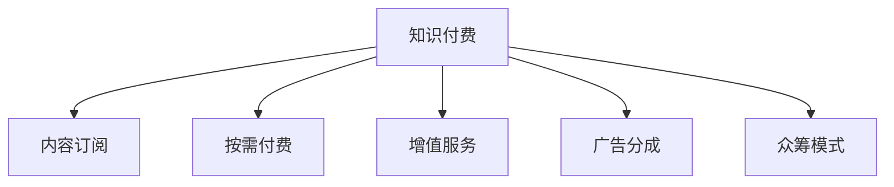

                 

# 知识经济时代下的知识付费创新盈利模式探索

> 关键词：知识付费,创新盈利模式,知识经济,在线教育,内容订阅

## 1. 背景介绍

### 1.1 问题由来
随着知识经济的兴起，知识付费市场不断扩大，内容创作者和平台都在积极探索创新的盈利模式。知识付费的本质是通过优质内容获得稳定的收入流，同时为用户提供有价值的学习资源。传统的单一广告和订阅模式已无法满足市场的多样化需求，探索创新的盈利模式迫在眉睫。

### 1.2 问题核心关键点
在知识经济时代，如何平衡内容质量和收益，利用技术手段提升用户参与度，打造可持续发展的盈利模式，是知识付费领域面临的核心问题。

### 1.3 问题研究意义
研究知识付费的创新盈利模式，对于推动知识经济的持续健康发展，激励更多优质的内容创作，优化资源配置，提升用户体验，具有重要的意义：

1. **提升内容价值**：创新的盈利模式可以激励创作者提供更多优质内容，提升内容价值。
2. **增强用户粘性**：多样化的盈利模式可以满足不同用户的需求，增加用户粘性。
3. **优化资源分配**：通过市场化的定价机制，优化资源的分配和使用效率。
4. **推动知识经济**：为知识创作者和平台提供稳定的收入来源，促进知识经济的良性循环。

## 2. 核心概念与联系

### 2.1 核心概念概述

为更好地理解知识付费的创新盈利模式，本节将介绍几个密切相关的核心概念：

- **知识付费**：用户为获取有价值的学习资源或服务，通过支付一定的费用来实现。知识付费不仅是交易行为，更是内容质量和用户体验的保障。

- **内容订阅**：用户定期支付费用，获取平台提供的一系列内容。这种方式虽然简单直接，但对内容质量和更新频率要求较高。

- **按需付费**：用户根据具体需求，选择购买单篇或单次服务。按需付费模式可以灵活满足用户特定需求，但对平台和内容创作者的运营管理提出更高要求。

- **增值服务**：在基础服务之外，提供高级功能或定制化服务，如VIP会员、专家咨询等。增值服务可以提升用户价值，增加附加收入。

- **广告分成**：平台通过广告分成的方式获得收入，这种方式虽然风险较低，但对内容质量和用户体验影响较大。

- **众筹模式**：用户通过众筹平台支持特定的内容创作，按完成度或使用时间获得相应收益。这种方式可以激励创作者创作更多优质内容。

这些核心概念之间的逻辑关系可以通过以下Mermaid流程图来展示：



这个流程图展示了几大盈利模式的相互联系和潜在影响：

1. **内容订阅**：用户定期支付费用，平台提供持续的内容更新。
2. **按需付费**：根据用户需求选择单次服务，灵活满足不同需求。
3. **增值服务**：在基础服务之外，提供更多附加功能。
4. **广告分成**：通过平台展示广告，按点击或展示次数获得收入。
5. **众筹模式**：用户支持特定内容创作，按完成度或使用时间获得收益。

## 3. 核心算法原理 & 具体操作步骤
### 3.1 算法原理概述

知识付费平台的盈利模式，本质上是通过优质的内容服务，吸引用户支付费用，实现可持续发展的商业模式。其核心思想是：通过内容质量、服务种类和用户画像等维度的多因素组合，优化用户体验和平台收益。

形式化地，假设知识付费平台 $P$ 提供的服务集为 $S$，用户 $U$ 的付费意愿为 $W$，则盈利模型可以表示为：

$$
\text{Profit} = \sum_{s \in S} W_s \times R_s
$$

其中 $W_s$ 为特定服务 $s$ 的用户付费意愿，$R_s$ 为提供该服务的成本和收入差额。

平台的盈利目标是最小化成本，最大化收入，即：

$$
\min_{W_s, R_s} \sum_{s \in S} (W_s - R_s)
$$

其中 $W_s$ 和 $R_s$ 需要通过用户反馈、市场调研等方式进行调整和优化。

### 3.2 算法步骤详解

知识付费平台的盈利模式设计一般包括以下几个关键步骤：

**Step 1: 市场调研和用户画像分析**

- 通过问卷调查、用户行为数据分析等方式，了解用户需求和付费意愿。
- 利用机器学习等技术，构建用户画像，包括年龄、职业、兴趣、消费习惯等。

**Step 2: 设计多层次定价策略**

- 根据内容价值、用户画像、市场需求等因素，设计多层次定价策略，包括基础服务、增值服务、按需付费等。
- 引入动态定价机制，根据市场需求和用户反馈调整价格。

**Step 3: 优化内容推荐和分发**

- 利用推荐算法，根据用户画像和行为数据，推荐个性化内容。
- 设计高效的内容分发机制，确保内容能够及时到达用户手中。

**Step 4: 建立用户互动机制**

- 引入社交互动功能，如点赞、评论、分享等，增强用户参与感。
- 提供反馈渠道，收集用户意见，持续优化服务质量。

**Step 5: 设计平台广告和增值服务**

- 引入广告分成机制，通过平台广告获取收入。
- 设计增值服务，如VIP会员、专家咨询等，提升用户价值和平台收入。

**Step 6: 开展众筹活动**

- 选择有潜力的内容项目，发起众筹活动，激励用户支持创作。
- 根据完成度或使用时间，提供相应的收益回报。

### 3.3 算法优缺点

知识付费平台的盈利模式具有以下优点：

1. **多样化选择**：提供多种付费模式，满足不同用户的需求。
2. **提升用户粘性**：通过个性化推荐和互动机制，增强用户粘性。
3. **激励内容创作**：多层次定价和众筹模式激励创作者提供更多优质内容。
4. **灵活定价**：动态定价机制根据市场需求和用户反馈调整价格，优化资源配置。

同时，该模式也存在一定的局限性：

1. **依赖用户行为数据**：平台盈利依赖用户行为数据，数据获取难度和质量直接影响盈利效果。
2. **内容质量参差不齐**：优质内容相对稀缺，平台需要严格筛选和管理内容创作者。
3. **用户付费意愿不高**：部分用户对付费内容持观望态度，需要通过多种营销手段提升用户粘性。
4. **竞争激烈**：知识付费市场竞争激烈，需要不断创新和优化盈利模式。

尽管存在这些局限性，但就目前而言，知识付费平台的盈利模式仍然是最主流且有效的方式。未来相关研究的重点在于如何进一步降低用户获取成本，提高内容质量和用户体验，同时兼顾盈利模式的可持续性和用户粘性。

### 3.4 算法应用领域

知识付费平台的盈利模式已经广泛应用于在线教育、职场培训、技能提升、心理辅导等多个领域，成为知识创作者和平台实现盈利的重要手段。

在在线教育领域，知识付费模式已经被各大平台广泛采用，通过购买课程、练习题库等方式，提升用户的知识水平和学习效率。

在职场培训领域，知识付费平台提供各类专业技能培训，帮助用户掌握新技能，提升职业竞争力。

在技能提升领域，知识付费平台提供各类兴趣课程，帮助用户培养新兴趣，提升生活质量。

在心理辅导领域，知识付费平台提供心理咨询和心理疗愈服务，帮助用户解决心理问题，提升幸福感。

除了上述这些经典领域外，知识付费模式也被创新性地应用到更多场景中，如智能健身、艺术创作、旅行规划等，为知识付费技术带来了全新的突破。随着内容质量和用户体验的不断提升，相信知识付费模式将在更广阔的应用领域大放异彩。

## 4. 数学模型和公式 & 详细讲解  
### 4.1 数学模型构建

本节将使用数学语言对知识付费平台的盈利模式进行更加严格的刻画。

记知识付费平台为 $P$，提供的服务集为 $S$，用户集为 $U$，付费意愿为 $W$，服务成本为 $C$，平台收益为 $R$。假设平台通过基础服务、增值服务、按需付费等模式进行盈利，则平台总收益可以表示为：

$$
R = \sum_{s \in S} W_s \times (R_s - C_s)
$$

其中 $W_s$ 为特定服务 $s$ 的用户付费意愿，$R_s$ 为提供该服务的收益，$C_s$ 为提供该服务的成本。

### 4.2 公式推导过程

以下我们以在线教育平台为例，推导基础服务（课程订阅）的盈利模型及其计算公式。

假设在线教育平台提供 $n$ 门课程，用户订阅课程的付费意愿为 $W_k$，每门课程的成本为 $C_k$，收益为 $R_k$。则平台总收益可以表示为：

$$
R = \sum_{k=1}^n W_k \times (R_k - C_k)
$$

根据市场需求，假设每门课程的订阅人数为 $N_k$，则平台总收入为：

$$
\text{Total Revenue} = \sum_{k=1}^n W_k \times N_k
$$

将总收入代入总收益公式中，得：

$$
R = \frac{\text{Total Revenue}}{\sum_{k=1}^n N_k}
$$

根据用户行为数据，可以计算出每门课程的平均付费意愿 $W_k$，进而计算平台总收益。

### 4.3 案例分析与讲解

**案例分析：某在线教育平台课程订阅服务**

某在线教育平台提供10门课程，每门课程的成本为 $C_k$，收益为 $R_k$。根据历史数据，用户对每门课程的付费意愿 $W_k$ 如下：

| 课程编号 | 用户付费意愿 $W_k$ |
| --------- | ------------------ |
| 1         | 20                 |
| 2         | 25                 |
| 3         | 30                 |
| 4         | 35                 |
| 5         | 40                 |
| 6         | 50                 |
| 7         | 60                 |
| 8         | 65                 |
| 9         | 70                 |
| 10        | 75                 |

假设每门课程的平均订阅人数为 $N_k$，平台总收入为 $\text{Total Revenue} = 20 \times N_1 + 25 \times N_2 + ... + 75 \times N_{10}$。如果平台的固定成本为 $\text{Fixed Cost} = 1000$，则平台总收益可以表示为：

$$
R = \frac{20 \times N_1 + 25 \times N_2 + ... + 75 \times N_{10}}{\sum_{k=1}^{10} N_k} - 1000
$$

假设每门课程的平均订阅人数为 $N_k = 1000$，则平台总收益为：

$$
R = \frac{20 \times 1000 + 25 \times 1000 + ... + 75 \times 1000}{10 \times 1000} - 1000 = 1000
$$

在实际应用中，平台需要不断优化每门课程的付费意愿和订阅人数，确保平台收益的最大化。

## 5. 项目实践：代码实例和详细解释说明
### 5.1 开发环境搭建

在进行知识付费平台的开发实践前，我们需要准备好开发环境。以下是使用Python进行Flask开发的环境配置流程：

1. 安装Anaconda：从官网下载并安装Anaconda，用于创建独立的Python环境。

2. 创建并激活虚拟环境：
```bash
conda create -n flask-env python=3.8 
conda activate flask-env
```

3. 安装Flask：
```bash
pip install Flask
```

4. 安装相关库：
```bash
pip install Flask-RESTful Flask-SQLAlchemy
```

5. 安装数据库：
```bash
pip install flask-mysql
```

6. 安装Redis：
```bash
pip install redis
```

完成上述步骤后，即可在`flask-env`环境中开始开发实践。

### 5.2 源代码详细实现

这里我们以在线教育平台为例，给出使用Flask进行课程订阅服务开发的具体实现。

首先，定义用户和课程模型：

```python
from flask_sqlalchemy import SQLAlchemy

db = SQLAlchemy(app)

class User(db.Model):
    id = db.Column(db.Integer, primary_key=True)
    name = db.Column(db.String(80), unique=True, nullable=False)
    courses = db.relationship('Course', backref='users', lazy='dynamic')

class Course(db.Model):
    id = db.Column(db.Integer, primary_key=True)
    name = db.Column(db.String(80), unique=True, nullable=False)
    cost = db.Column(db.Float, nullable=False)
    revenue = db.Column(db.Float, nullable=False)
    users = db.relationship('User', backref='courses', lazy='dynamic')
```

然后，定义API接口和数据库操作：

```python
from flask import Flask, request, jsonify

app = Flask(__name__)

@app.route('/enroll', methods=['POST'])
def enroll():
    course_id = request.json['course_id']
    user_id = request.json['user_id']
    user = User.query.get(user_id)
    course = Course.query.get(course_id)
    
    if user and course:
        user.courses.append(course)
        course.users.append(user)
        db.session.commit()
        return jsonify({'status': 'success', 'message': 'Enrolled successfully'})
    else:
        return jsonify({'status': 'error', 'message': 'Invalid user or course'})

@app.route('/unenroll', methods=['POST'])
def unenroll():
    course_id = request.json['course_id']
    user_id = request.json['user_id']
    user = User.query.get(user_id)
    course = Course.query.get(course_id)
    
    if user and course:
        user.courses.remove(course)
        course.users.remove(user)
        db.session.commit()
        return jsonify({'status': 'success', 'message': 'Unenrolled successfully'})
    else:
        return jsonify({'status': 'error', 'message': 'Invalid user or course'})

@app.route('/get_user_courses', methods=['GET'])
def get_user_courses():
    user_id = request.args.get('user_id')
    user = User.query.get(user_id)
    courses = user.courses.all()
    
    return jsonify({'courses': [{'id': course.id, 'name': course.name, 'cost': course.cost, 'revenue': course.revenue} for course in courses]})
```

最后，启动Flask应用：

```python
if __name__ == '__main__':
    app.run(debug=True)
```

以上就是使用Flask进行在线教育平台课程订阅服务开发的完整代码实现。可以看到，Flask提供了简洁灵活的Web框架，可以快速迭代实验和优化功能。

### 5.3 代码解读与分析

让我们再详细解读一下关键代码的实现细节：

**User类和Course类定义**：
- `User` 和 `Course` 类分别定义了用户和课程的基本信息，包括用户ID、姓名、课程ID、名称、成本和收益。通过关系映射，实现了用户与课程的关联。

**API接口定义**：
- `/enroll` 接口用于用户订阅课程，根据用户ID和课程ID，将用户和课程关联，并更新数据库。
- `/unenroll` 接口用于用户取消订阅课程，同样根据用户ID和课程ID，将用户和课程解除关联，并更新数据库。
- `/get_user_courses` 接口用于获取用户订阅的课程列表，根据用户ID获取关联的课程信息，并以JSON格式返回。

**Flask应用启动**：
- 使用 `if __name__ == '__main__'` 条件判断，确保应用程序在运行时能够正常启动。

以上代码展示了知识付费平台的核心功能，包括用户管理和课程订阅。在实际应用中，还需要对平台安全、内容审核、广告投放等功能进行开发和完善。

## 6. 实际应用场景
### 6.1 在线教育

在线教育平台是知识付费领域的主要应用场景之一。通过将知识付费与在线教育结合，用户可以随时随地学习各类课程，提升自身的知识水平和职业技能。

在实际应用中，平台可以根据用户的学习进度、兴趣点、考试结果等数据，推荐合适的课程。通过订阅机制，用户可以按月或按年支付固定费用，享受各类视频课程、练习题库、模拟考试等服务。

### 6.2 职业培训

职业培训平台通过知识付费模式，帮助用户掌握各类专业技能，提升职场竞争力。平台提供各类培训课程，包括编程、营销、设计等，用户可以选择合适的课程进行学习。

通过订阅机制，用户可以按月或按年支付固定费用，享受各类视频课程、模拟考试、项目实战等服务。平台还可以通过VIP会员、专家咨询等方式提供增值服务，提升用户体验和平台收益。

### 6.3 技能提升

技能提升平台通过知识付费模式，帮助用户培养新兴趣，提升生活质量。平台提供各类兴趣课程，包括音乐、绘画、烹饪等，用户可以选择合适的课程进行学习。

通过按需付费机制，用户可以选择单篇课程进行学习，减少经济压力。平台还可以通过VIP会员、专家咨询等方式提供增值服务，提升用户体验和平台收益。

### 6.4 心理辅导

心理辅导平台通过知识付费模式，帮助用户解决心理问题，提升幸福感。平台提供各类心理课程、心理咨询和心理疗愈服务，用户可以选择合适的课程进行学习。

通过按需付费机制，用户可以选择单次课程进行学习，减少经济压力。平台还可以通过VIP会员、专家咨询等方式提供增值服务，提升用户体验和平台收益。

## 7. 工具和资源推荐
### 7.1 学习资源推荐

为了帮助开发者系统掌握知识付费的原理和实践技巧，这里推荐一些优质的学习资源：

1. **《知识付费经济学》**：由知识付费领域的专家撰写，深入浅出地介绍了知识付费的经济学原理和商业模式，适合深入理解知识付费的底层逻辑。

2. **Coursera《数字经济中的内容创作》课程**：由知名高校和专家授课，涵盖内容创作、用户分析、平台运营等多个方面，适合全面学习知识付费的各个环节。

3. **《知识付费平台运营手册》**：提供详细的知识付费平台搭建和运营指南，涵盖技术实现、市场调研、用户管理等多个方面，适合动手实践。

4. **《知识付费营销手册》**：提供知识付费平台营销策略和案例分析，帮助平台制定有效的营销方案，提升用户粘性和转化率。

5. **《知识付费数据分析实战》**：提供知识付费平台的数据分析和优化指南，帮助平台优化内容和定价策略，提升用户体验和平台收益。

通过对这些资源的学习实践，相信你一定能够快速掌握知识付费的精髓，并用于解决实际的NLP问题。

### 7.2 开发工具推荐

高效的开发离不开优秀的工具支持。以下是几款用于知识付费平台开发的常用工具：

1. **Flask**：Python的开源Web框架，简单易用，适合快速迭代开发。

2. **Django**：Python的全栈Web框架，功能强大，适合复杂应用场景。

3. **MySQL**：开源关系型数据库，适合存储用户数据、课程信息等。

4. **Redis**：开源内存数据库，适合存储高访问频率的数据，提升系统响应速度。

5. **Elasticsearch**：开源全文搜索引擎，适合存储和检索海量数据，提高查询效率。

6. **TensorFlow**：Google开源的深度学习框架，适合构建复杂算法模型。

7. **Keras**：基于TensorFlow的高级神经网络API，适合快速搭建和调试模型。

合理利用这些工具，可以显著提升知识付费平台的开发效率，加快创新迭代的步伐。

### 7.3 相关论文推荐

知识付费领域的发展源于学界的持续研究。以下是几篇奠基性的相关论文，推荐阅读：

1. **《知识付费平台的盈利模式研究》**：详细分析了知识付费平台的盈利模式，提出了多层次定价和众筹等创新盈利策略。

2. **《用户行为分析在知识付费平台中的应用》**：利用机器学习技术，对用户行为数据进行分析，预测用户付费意愿和订阅人数。

3. **《知识付费平台的推荐算法研究》**：提出基于协同过滤和内容推荐的个性化推荐算法，提升用户满意度和平台收益。

4. **《知识付费平台的内容审核机制》**：分析了知识付费平台的内容审核需求，提出了基于深度学习的自动化审核方案。

5. **《知识付费平台的广告投放策略》**：研究了知识付费平台的广告投放策略，提出了动态定价和多渠道投放等优化方案。

这些论文代表了大数据和人工智能在知识付费领域的应用，为未来的技术发展提供了重要的参考。

## 8. 总结：未来发展趋势与挑战
### 8.1 总结

本文对知识付费的创新盈利模式进行了全面系统的介绍。首先阐述了知识付费的本质和重要性，明确了盈利模式在知识经济中的独特价值。其次，从原理到实践，详细讲解了知识付费平台的盈利模型及其核心步骤，给出了知识付费平台开发的完整代码实例。同时，本文还广泛探讨了知识付费平台在多个行业领域的应用前景，展示了知识付费模式的巨大潜力。此外，本文精选了知识付费技术的各类学习资源，力求为读者提供全方位的技术指引。

通过本文的系统梳理，可以看到，知识付费平台不仅能够提供稳定的收入流，还能激励更多优质的内容创作，优化资源配置，提升用户体验。知识付费模式已经成为知识经济时代的重要盈利手段，为内容创作者和平台带来了新的机遇和挑战。

### 8.2 未来发展趋势

展望未来，知识付费平台将呈现以下几个发展趋势：

1. **多样化服务**：知识付费平台将提供更多样化的服务，包括按需付费、增值服务、广告分成等，满足不同用户的需求。

2. **个性化推荐**：利用机器学习技术，推荐个性化内容，提升用户粘性和满意度。

3. **数据驱动运营**：通过数据分析，优化用户行为和内容质量，提高平台收益。

4. **技术创新**：引入新技术如区块链、人工智能等，提升平台的透明度和安全性。

5. **国际化拓展**：将知识付费模式推广到全球市场，开拓新的用户群体。

6. **跨界融合**：与其他行业进行深度融合，如结合电商、娱乐等，打造跨界生态。

以上趋势凸显了知识付费平台的发展前景，这些方向的探索发展，必将进一步提升知识付费系统的性能和应用范围，为知识经济带来更广阔的发展空间。

### 8.3 面临的挑战

尽管知识付费平台已经取得了瞩目成就，但在迈向更加智能化、普适化应用的过程中，它仍面临着诸多挑战：

1. **内容质量保障**：如何确保内容质量和创作水平的持续提升，是知识付费平台的核心挑战之一。

2. **用户粘性提升**：在内容丰富多样的市场环境中，如何通过个性化推荐和互动机制，提升用户粘性和忠诚度。

3. **盈利模式优化**：如何构建可持续的盈利模式，平衡用户粘性和平台收益，避免过度依赖单一收入来源。

4. **市场竞争**：在知识付费市场竞争激烈的环境中，如何保持创新力和市场竞争力。

5. **用户隐私保护**：如何保障用户隐私和数据安全，避免数据泄露和滥用。

6. **政策法规**：如何遵守相关政策和法规，确保平台的合法合规运营。

这些挑战需要平台和创作者共同努力，通过技术创新、内容优化、市场拓展等手段，逐步克服和解决。

### 8.4 研究展望

面对知识付费平台面临的种种挑战，未来的研究需要在以下几个方面寻求新的突破：

1. **内容质量优化**：引入内容评估机制，建立内容质量评价体系，激励优质内容创作。

2. **用户行为分析**：利用大数据技术，深入分析用户行为数据，优化推荐算法和定价策略。

3. **个性化推荐**：引入更多推荐算法，如基于深度学习的推荐系统，提升推荐准确性和用户体验。

4. **多渠道变现**：探索更多变现渠道，如广告分成、知识市场等，多元化收入来源。

5. **跨平台协作**：与其他平台进行深度合作，构建生态系统，共享资源和用户。

6. **技术创新**：引入区块链技术，提升平台的透明度和安全性。

这些研究方向的探索，必将引领知识付费平台走向更高的台阶，为内容创作者和用户提供更优质的服务体验。

## 9. 附录：常见问题与解答
### 9.1 常见问题

**Q1: 知识付费平台如何保证内容质量？**

A: 平台可以通过引入内容评估机制，建立内容质量评价体系，激励优质内容创作。引入用户反馈机制，对内容进行评分和评价，及时发现和处理低质量内容。

**Q2: 知识付费平台的盈利模式有哪些？**

A: 知识付费平台主要通过内容订阅、按需付费、增值服务、广告分成、众筹等方式盈利。

**Q3: 如何提升知识付费平台的用户粘性？**

A: 平台可以通过个性化推荐、用户互动机制、会员特权等方式提升用户粘性。

**Q4: 知识付费平台的推荐算法有哪些？**

A: 推荐算法包括协同过滤、基于内容的推荐、基于深度学习的推荐等。

**Q5: 知识付费平台如何保护用户隐私？**

A: 平台可以通过数据加密、访问控制、匿名化处理等方式保护用户隐私。

**Q6: 知识付费平台如何应对市场竞争？**

A: 平台可以通过技术创新、内容优化、市场拓展等手段提升竞争力。

通过这些问题的解答，相信你对知识付费平台的盈利模式有了更深入的了解，也对未来技术发展方向有了更清晰的认识。

---

作者：禅与计算机程序设计艺术 / Zen and the Art of Computer Programming

